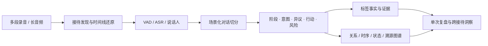
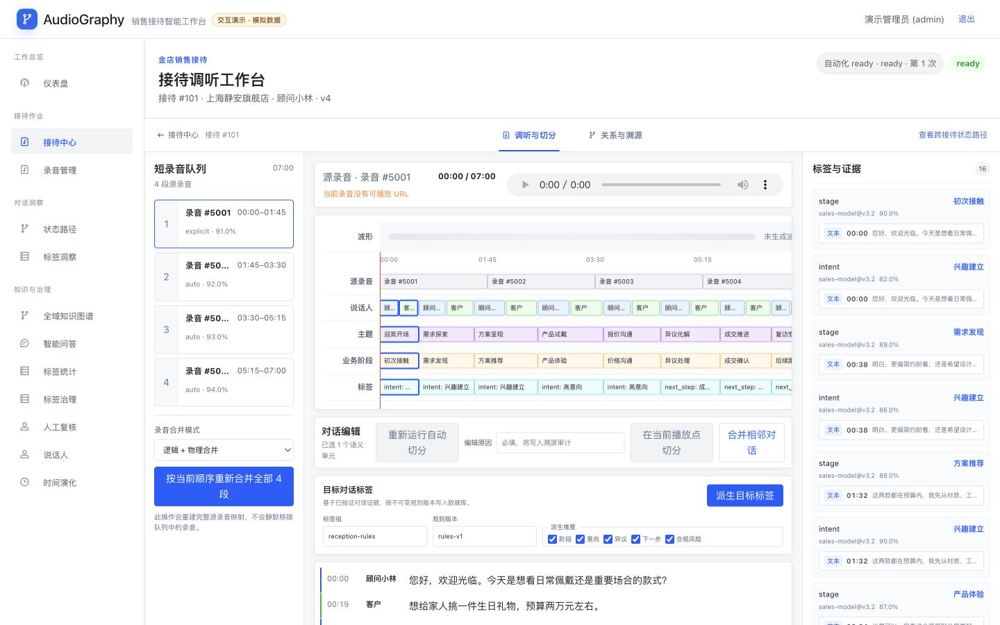
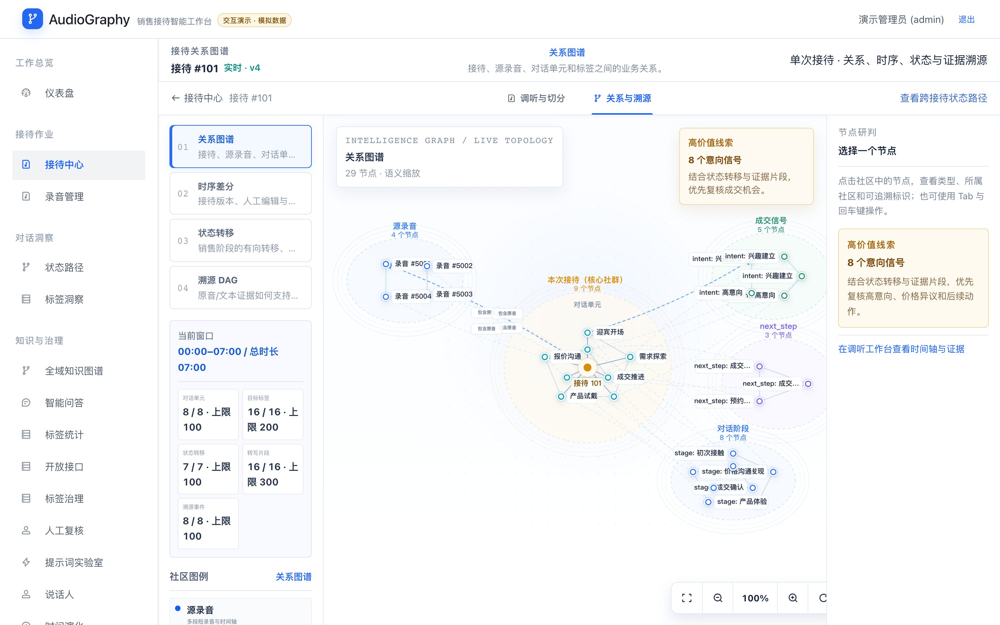
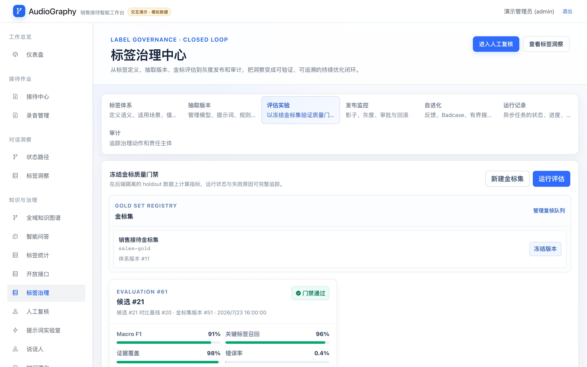
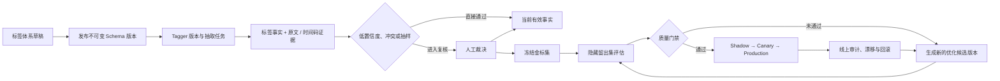
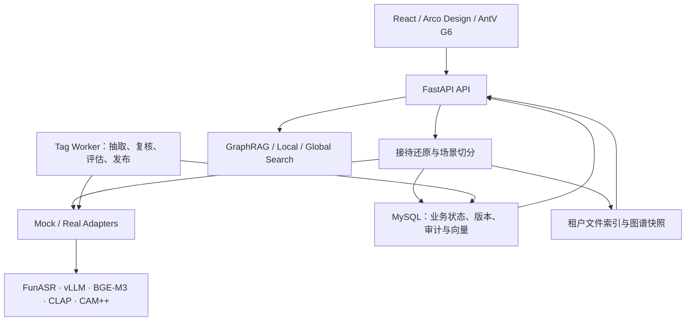

<div align="center">

# AudioGraphy

**场景化对话智能引擎**

*Turn conversations into scene-aware, evidence-grounded business intelligence.*

[](https://github.com/g5n-dev/audio_graphy/actions/workflows/ci.yml)
[](./LICENSE)
[](./backend/pyproject.toml)
[](./frontend/package.json)

[产品能力](#核心能力) · [快速启动](#快速启动) · [Roadmap](#进度与-roadmap) · [系统架构](#架构与部署) · [专题文档](#文档索引)

</div>

> [!NOTE]
> 当前版本已交付完整的**音频处理与语义转译链路**。Hero 中的纯文本直接输入、多语言翻译以及原文—译文—时间码映射属于下一阶段，不作为当前可用能力宣传。

## 产品定位

AudioGraphy 不是只服务某一种销售流程的录音工具，而是一套把非结构化对话还原为**业务过程**的场景化引擎。

它接收一次业务交互中的多段短录音或长录音，完成接待还原、ASR、语义切分、标签派生、关系建图与证据绑定。阶段模型、Prompt、标签体系和证据规则共同定义“怎样切、怎样理解”，因此同一套引擎可以适配汽车销售、零售导购、外贸洽谈、咨询服务等不同过程。

项目的图谱驱动 RAG 设计来源于 [VideoRAG](https://github.com/HKUDS/VideoRAG)，并针对音频场景重新实现索引、图谱与检索链路：使用 VAD、ASR、音频嵌入和声纹能力替换视觉模态预处理。

## 工作方式

一段原始汽车销售对话：

> **客户 · 12:41**　“这款配置可以，但价格还是超预算。如果今天能把金融方案算清楚，我可以先约周末试驾。”

AudioGraphy 不只保存这句话，而是把它转译为可以计算和追溯的业务事实：

| 业务维度 | 结构化结果 | 证据 |
|---|---|---|
| 当前阶段 | 报价与异议处理 | `12:41–12:49` 原始录音及转写 |
| 客户意向 | 中高意向 | 明确提出条件并愿意预约试驾 |
| 核心异议 | 价格超出预算 | “价格还是超预算” |
| 下一步行动 | 测算金融方案、预约周末试驾 | “算清楚……先约周末试驾” |
| 关系图谱 | 客户 → 关注 → 金融方案；试驾 → 前置于 → 成交推进 | 节点、边与证据引用绑定 |



## 一个引擎，多种切分语义

| 场景 | 业务过程如何切分 | 典型转译结果 | 状态 |
|---|---|---|---|
| 汽车销售 | 迎宾 → 需求 → 车型介绍 → 试驾 → 报价 → 异议 → 跟进 | 车型偏好、预算、竞品、试驾意向、金融方案 | 已交付场景基线 |
| 零售导购 | 需求识别 → 商品比较 → 价格沟通 → 成交 → 售后 | 商品偏好、价格敏感度、购买信号、复访动作 | 可通过自定义场景扩展 |
| 外贸洽谈 | 询盘 → 规格 → 报价 → 贸易条款 → 交期 → 议价 → 订单推进 | MOQ、Incoterms、付款条件、交期风险、下一步 | 下一阶段场景包 |
| 自定义场景 | 自定义阶段、允许跳转与回退 | 自定义标签键、值域、证据要求和质量门禁 | 持续增强 |

场景并不是一组页面文案。它由四类可版本化资产共同决定：

1. **阶段模型**：定义业务过程、跳转、回退与异常路径。
2. **Prompt**：定义领域实体、关系、摘要和语义边界。
3. **标签体系**：定义阶段、意图、异议、行动、风险等值域。
4. **证据规则**：规定结论必须绑定的文本、时间码、来源与置信度。

## 产品界面

以下界面来自仓库内置的 Mock 演示数据，不包含真实客户信息。

### 接待时间线：从多段录音回到一次完整业务过程



### 关系图谱：让对话单元、标签与证据形成可解释结构



### 标签治理：从标签定义、金标评估到发布门禁



## 核心能力

| 能力 | AudioGraphy 做什么 | 业务价值 |
|---|---|---|
| **输入与还原** | 发现同一次接待中的多段录音，重算顺序与时间轴；对长音频执行可信边界复核 | 从散落文件还原完整业务过程，源录音仍可追溯 |
| **场景化切分** | 从 ASR Segment 生成业务对话单元，支持人工拆分、相邻合并与状态链重建 | 分析粒度从“整段录音”下沉到“业务动作” |
| **双重转译** | 已交付阶段、意图、异议、行动和风险的语义转译；规划多语言翻译 | 将自然对话变为可统计、可比较的业务事实 |
| **证据化标签** | 标签绑定体系版本、模型版本、置信度、文本和双时间坐标 | 每个结论都能回到原始声音，不产生无来源洞察 |
| **图谱洞察** | 单次关系/时序/状态/溯源图谱，以及跨接待路径、回退、冲突、趋势和共现 | 解释一次接待，也能比较门店、销售和场景差异 |
| **治理与部署** | 金标、评估、Shadow/Canary、回滚、审计、隐私擦除及 Mock/CPU/GPU 部署 | 模型结果可验证、可恢复、可治理、可私有化部署 |

### 标签从抽取到优化的闭环

标签能力不是一次性调用模型，而是一条有版本、有证据、有质量门禁的状态链：



- **构建与分类**：已发布的 Schema 定义标签键、值域、证据要求和规则；Tagger 版本绑定具体 Schema，不能跨版本写入模糊结果。
- **执行与恢复**：独立 `tag-worker` 使用租约、心跳、断点和超时回收执行抽取与评估任务，失败任务可重试，取消和幂等状态持久化。
- **复核与学习数据**：低置信度、冲突及抽样结果进入人工复核；关键真值必须经过两轮独立盲审和第三人仲裁，裁决追加不可变事实、反馈、Badcase 与经验，再按血缘冻结为金标版本。
- **评估与发布**：候选版本只能在隐藏留出集上计算指标，通过门禁后才可进入 Shadow、Canary 和 Production；线上异常可以回滚。
- **六阶段 Harness**：Context、Tools、Generation、Orchestration、Memory、Output 均随 Tagger 版本冻结；每次执行保存解析配置、场景画像和逐阶段 trace，可按输入快照重放。
- **真实优化任务**：达到“新增 T2/T3 反馈 ≥ 200、每个受影响标签域 ≥ 30”的覆盖门后，API 才在同一事务创建持久化 `optimize` Job；Worker 执行有界 trial 并保存指标、胜出项和候选 Tagger，基线、金标、cohort 与真值均由服务端冻结，不能由浏览器注入。
- **优化边界**：优化只创建 `draft` 候选并重新评估，不会在生产版本上原地“自学习”或绕过发布门禁。真实推理质量取决于所配置的模型 Adapter 与金标质量。

> [!IMPORTANT]
> Sites Worker + D1 提供的是带 `is_demo=true` 标记的确定性交互演示；真实抽取、优化、评估和灰度闭环运行在 Docker Compose 的 API + MySQL + `tag-worker` 上。

### 全域图谱的数据一致性

`/graph` 将“实体关系”和“主题聚类”作为同一工作区的两个真实 Tab。主题聚类查询始终绑定一个已成功的 Leiden 任务和层级；搜索由服务端在该任务的完整摘要集合中执行，而不是只过滤前端已显示的八个社区。

摘要策略将 Level 0 与叶子社区定义为 eager、中间层定义为 lazy。若一个非空任务的目标层级尚无精确任务快照摘要，API 返回 `409 SUMMARY_NOT_READY`，界面展示可重试状态；系统不会拿当前图谱重建旧任务结果，以免发生跨快照数据混用。

`/reception-flow` 保留为“状态路径”而不是重复图谱：它聚合多次接待的阶段转移、完成率、置信度、跳步和异常回退，用于流程挖掘；`/graph` 解释全域实体与主题关系，`/tag-insights` 比较标签版本、冲突和证据。三者的分析主体、问题和交互均不同。

图谱和洞察响应都有显式输出预算。全域图谱边窗口默认受服务端预算控制且硬上限为 5,000，响应返回 `total / returned / truncated / render_budget`；标签矩阵、证据和差异明细同样分页或截断并保留全量 KPI。前端按路由拆分图谱运行时，切换 Tab 时主动释放画布和布局资源，避免把“大结果可查询”误做成“大结果一次性渲染”。

## 进度与 Roadmap

### 能力成熟度

| 能力域 | 已交付 | 持续增强 | 下一阶段 |
|---|---|---|---|
| 输入 | 多段/长音频、接待合并、批处理 ASR | Streaming VAD/ASR、真实模型稳定性 | 纯文本直接输入、音频与文本混合接待 |
| 切分 | ASR Segment、业务单元、人工 split/merge | 自定义阶段模板与切分评估 | 外贸等可安装场景包 |
| 转译 | 阶段、意图、异议、下一步、合规风险 | Prompt/Tagger 版本优化 | 多语言翻译、原文—译文—时间码映射 |
| 图谱 | 关系、时序、状态、溯源、Leiden 主题聚类 | 大规模图谱性能与增量聚类 | 跨语言实体与主题对齐 |
| 治理 | 版本、复核、金标、评估、同输入 JSD 漂移、灰度、审计、回滚 | 大规模窗口性能与阈值调优 | 场景包评测与发布市场 |
| 部署 | Mock、CPU、单 GPU、多 GPU、Sites 演示 | 真实租户压测与任务队列 | 分布式分析存储 |

### 迭代时间线

| 里程碑 | 关键交付 |
|---|---|
| M1–M3 | 多租户基础、索引与图谱 RAG 主链路 |
| M4 | Real Adapter 契约：VAD、OpenAI 兼容 LLM、BGE-M3 与模型拓扑 |
| M5 | FunASR、离线评估 CLI、指标与 Markdown/JSON 报告 |
| M6 | 音频加密、PII 清洗、保留与 DSAR、Eval REST、中文实体归并、Prometheus |
| M7 | CLAP 音频嵌入、CAM++ 声纹、说话人连接、三通道检索 |
| M8 | Streaming VAD/ASR、会话状态机、增量切片与增量图更新 |
| M9 | 双时态边、Leiden 社区、社区摘要、全局搜索、图压缩与说话人复核 |
| M10 | 接待智能工作台、场景切分、跨接待洞察及标签治理闭环 |
| Next | 纯文本输入、多语言翻译、外贸场景包与统一多源对话模型 |

> [!TIP]
> 截至 **2026-07-24** 的 M10 联合验收记录了后端 2251 个测试、90.47% 覆盖率和前端 131 个测试。数字是带日期的验收快照，最新状态以 [CI](https://github.com/g5n-dev/audio_graphy/actions/workflows/ci.yml) 与 [M10 验收报告](./docs/m10-status-report.md) 为准。

## 快速启动

### Docker Compose：Mock 全栈

Mock profile 不下载模型、不需要 GPU，适合产品体验、功能验证和前后端联调。

```bash
cp .env.example .env

# --wait 会等到 backend 健康检查通过为止。backend 启动时先跑 alembic upgrade head，
# 冷启动约 30 秒，不加 --wait 直接 curl 会连接被拒。
docker compose --profile mock up -d --wait
docker compose --profile mock ps
curl --fail http://127.0.0.1:8000/health
```

**创建第一个账号。** 数据库是空的，也没有自助注册接口，所以在这一步之前任何人都登录不进去。仓库刻意不预置演示账号——一个众所周知的默认口令比没有账号更糟：

```bash
BOOTSTRAP_ADMIN_EMAIL=you@example.com \
BOOTSTRAP_ADMIN_PASSWORD='选一个至少 12 位的密码' \
docker compose --profile bootstrap run --rm bootstrap-admin
```

命令可重复执行：租户或用户已存在时只会提示并跳过，`--reset-password` 是改动既有账号的唯一方式。本地不用 Docker 时等价命令是 `python backend/scripts/bootstrap_admin.py --email you@example.com`（不传密码则交互式询问）。

> [!WARNING]
> 同一台机器上已经跑着一套 AudioGraphy？`docker compose -p 别名` **不能**隔离两套栈——网络与卷名冲突是静默的，第二套栈会连上第一套的数据库、上面这条命令会把账号写进那边。先看 [部署指南](./docs/deployment.md) 的「在同一台主机上运行第二套栈」。

| 服务 | 地址 |
|---|---|
| Web | `http://127.0.0.1:5173` |
| API | `http://127.0.0.1:8000/api/v1` |
| Swagger | `http://127.0.0.1:8000/docs` |
| Prometheus | `http://127.0.0.1:8000/metrics` |
| Adminer | `http://127.0.0.1:8081` |

登录后界面是空的：还需要导入录音，接入真实模型则要配置密钥和 Adapter。Mock 模式下各环节的真假边界见下表。

### Mock 模式下哪些是真的

Mock profile 的目的是让整条链路跑起来，不是产出可信结论。默认配置里：

| 环节 | 默认 | 说明 |
|---|---|---|
| 数据库、迁移、多租户 | ✅ 真实 | — |
| JWT 鉴权、RBAC、审计 | ✅ 真实 | 生产需替换 `JWT_SECRET` |
| 音频静态加密（PIPL） | ✅ 真实 | 主密钥由 `master-key-init` 一次性任务生成 |
| 图存储、Leiden、双时态 | ✅ 真实算法 | 但输入来自下面的 mock 抽取结果 |
| 接待时间线与分段编辑 | ✅ 真实 | 物理拼接需要 ffmpeg，缺失时降级为逻辑合并 |
| VAD | ❌ mock | 按文件大小推算切分点，与语音内容无关 |
| ASR | ❌ mock | 从固定话术池中按哈希取一条 |
| LLM（强/弱） | ❌ mock | 固定模板，抽取出的实体与录音无关 |
| 文本 Embedding | ❌ mock | 伪随机向量，相似度无语义 |
| 声纹 / CLAP | ❌ 默认关闭 | 需 `ENABLE_VOICEPRINT` / `ENABLE_CLAP` |
| 流式实时转写 | ❌ 路由不注册 | 需 `ENABLE_STREAMING=true` |
| 高级图 HTTP 接口 | ❌ 路由不注册 | 需 `ENABLE_ADVANCED_GRAPH=true` |

也就是说：**mock 模式下问答页返回的是固定文案，不是对你的问题的回答**。要得到真实结论，按 [部署指南](./docs/deployment.md) 切换到 `models-cpu` 或 GPU profile。

常用命令：

```bash
# 查看 API、标签任务 Worker 与前端日志
docker compose logs -f backend tag-worker frontend

# 重启应用服务
docker compose restart backend tag-worker frontend

# 停止并保留数据卷
docker compose --profile mock down
```

<details>
<summary><strong>展开：本地运行前后端</strong></summary>

环境要求：Python 3.13、Node.js 22、npm，以及 Docker Compose v2。

先在项目根目录启动 MySQL：

```bash
docker compose up -d mysql
```

终端一，启动后端：

```bash
cd backend
python3.13 -m venv .venv
source .venv/bin/activate
python -m pip install -e ".[dev]"

mkdir -p .local/working
python scripts/init_master_key.py \
  .local/audiography_master.key \
  --state-dir .local/working

export MYSQL_HOST=127.0.0.1
export MYSQL_PORT=3307
export WORKING_DIR=.local/working
export MASTER_KEY_PATH=.local/audiography_master.key

alembic upgrade head

# 创建第一个租户和管理员（不传 --password 会交互式询问，不回显）
python scripts/bootstrap_admin.py --email you@example.com

uvicorn audio_graphy.main:app --reload --port 8000
```

终端二，启动前端：

```bash
cd frontend
npm ci
npm run dev
```

</details>

<details>
<summary><strong>展开：构建 Sites 交互演示</strong></summary>

```bash
cd frontend
npm ci
npm run build:sites
```

Sites 使用独立 D1 保存交互演示状态，与生产 MySQL 数据隔离，表结构定义在 `frontend/db/schema.ts`。

托管平台的项目配置（`frontend/.openai/`）绑定特定部署账号，不随开源仓库发布——自行部署时按所用平台生成即可。

</details>

完整模型配置与生产检查见 [部署指南](./docs/deployment.md)；接待处理接口和业务不变量见 [接待对话智能工作台](./docs/reception-intelligence.md)。

## 架构与部署



### 部署 Profile

| Profile | 模型服务 | GPU | 适用场景 |
|---|---|---:|---|
| `mock` | 全部 Adapter 保持 Mock | 0 | 开发、CI、产品演示 |
| `cache-redis` | 可选 Redis LLM 热缓存（与任一模型 Profile 组合） | 0 | 多进程共享热缓存 |
| `models-cpu` | FunASR、BGE-M3、CAM++ | 0 | CPU 验证与离线小批量 |
| `models-single-gpu` | vLLM、BGE-M3、CLAP、CAM++ | 1 | 单卡推理 |
| `models-multi-gpu` | Strong/Weak LLM 分卡及完整音频模型 | 2+ | 多卡生产拓扑 |

### LLM 多级缓存

MySQL 是 LLM 结果的持久化与跨进程 singleflight 层。未配置 Redis 时使用
有界进程内 TTL/LRU 热缓存；配置 Redis 且启动探测成功后改用 Redis，运行中
故障会自动降级，本身不会让业务请求失败。每个 HTTP 请求还带有生命周期内
memo，先于热缓存消除同一请求中的顺序重复调用，请求结束即释放。
精确缓存、热缓存和 MySQL 持久层可独立回退；仅关闭持久层时，无来源关联的
请求仍可使用热缓存，带 provenance 的请求则安全绕过，避免失去 DSAR 反向索引。

```bash
# 可与 mock 或真实模型 Profile 同时启用
REDIS_URL=redis://redis:6379/0 \
  docker compose --profile mock --profile cache-redis up -d
```

Compose 内置 Redis 限制为 128 MiB、容器上限 192 MiB，使用 LRU 且关闭
AOF/RDB；需要长期复用的数据只保存在 MySQL。外部 Redis 建议使用独立实例或
独立 DB，应用只操作自己的命名空间，不会执行 `KEYS`、`FLUSHDB` 或修改全局
淘汰策略。Redis/MySQL 都不保存原始 prompt；校验后的输出先压缩，再使用
租户、namespace 和 recipe 绑定的 AES-256-GCM 密文保存。语义缓存、候选批判断、
hybrid 短路和自适应 gleaning 默认关闭，
需在金标质量门禁通过后逐项开启。
来源删除会先写入 MySQL 墓碑，并把 Redis/本地清除意图放入持久队列；即使
Redis 当时不可用，在途 leader 也不能复活结果，恢复后会自动完成物理清除。

### 默认安全边界

- 所有业务数据按租户隔离，接待授权使用稳定用户 ID，不以销售姓名作为权限主键。
- PII 在进入标签和图谱前清洗；音频支持分块认证加密、保留期和 DSAR 物理擦除。
- 生成标签必须绑定版本与证据；人工裁决产生新事实，不静默覆盖历史结果。
- 应用、数据库和模型诊断端口默认仅绑定 `127.0.0.1`。
- Mock、真实模型、Streaming 和 Advanced Graph 能力均通过显式 Profile 或开关启用。

模型端口、硬件边界、密钥、VAD 契约和生产检查清单见 [部署指南](./docs/deployment.md)。

## 技术栈

| 层 | 主要技术 |
|---|---|
| 后端 | Python 3.13、FastAPI、SQLAlchemy、Alembic |
| 数据 | MySQL 8、文件索引、NetworkX 图存储 |
| 前端 | React 18、TypeScript、Vite、Arco Design、AntV G6 |
| 模型 | FunASR、vLLM、BGE-M3、CLAP、CAM++、Silero VAD |
| 工程 | Docker Compose、GitHub Actions、Ruff、mypy、pytest、Vitest、Playwright |

## 文档索引

### 产品

- [接待对话智能工作台](./docs/reception-intelligence.md)：接待合并、场景切分、证据、标签、自动化与工作台不变量。
- [标签治理闭环](./docs/tag-governance.md)：标签 Schema、抽取任务、人工复核、金标评估、发布门禁与回滚不变量。
- [M10 验收报告](./docs/m10-status-report.md)：产品、数据、安全、性能、部署与自动化验收结论。

### 架构

- [总体设计](./docs/DESIGN.md)：早期总体设计、核心模型与路线图。
- [Advanced Graph](./docs/advanced-graph.md)：双时态、Leiden、全局搜索、压缩与说话人复核。
- [Streaming 架构](./docs/m8-architecture.md)：Streaming VAD/ASR、会话与增量图谱。
- [架构决策记录](./docs/adr/)：长期有效的技术裁决。
  - [ADR-0001 声纹采样](./docs/adr/0001-voiceprint-sampling.md)：采样来源、加权均值策略、质量门控与代表模板选取。
- [架构图资产](./docs/assets/)：索引、查询、存储分层与标签版本图。

### 部署与合规

- [部署指南](./docs/deployment.md)：模型 Profile、端口、密钥、安全边界和 VAD 部署。
- [PIPL 实现指南](./docs/m6-pipl.md)：音频加密、PII、保留、DSAR 与审计。

### 质量与评估

- [离线评估](./docs/m5-eval.md)：评估 CLI、指标与报告。
- [Eval REST](./docs/m6-eval.md)：服务化评估与 position de-bias。
- [M9 QA](./docs/m9-qa-report.md)：Advanced Graph 验收证据。

### 参与项目

- [贡献指南](./CONTRIBUTING.md)：开发环境、代码规范、提交与 PR 流程。
- [安全策略](./SECURITY.md)：漏洞私密报告通道与范围界定。

## 许可

本项目以 [MIT License](./LICENSE) 发布。

## 致谢

图谱 RAG 的设计范式承袭自 [VideoRAG](https://github.com/HKUDS/VideoRAG)（其自身的图谱内核来自 [LightRAG](https://github.com/HKUDS/LightRAG) / [nano-graphrag](https://github.com/gusye1234/nano-graphrag)），社区摘要与全局检索的分层模式参考微软 [GraphRAG](https://github.com/microsoft/graphrag)，双时态边模型参考 Graphiti。

**本仓库不包含上述任何项目的源码**，也不依赖它们。逐字沿用的只有若干接口约定——`working_dir` 的文件命名，以及实体抽取的分隔符三元组。各项目的许可、版权方，以及哪些是承袭、哪些是独立实现，逐条列在 [NOTICES.md](./NOTICES.md)。

---

<div align="center">

**AudioGraphy — 让声音不止被转写，更被理解。**

</div>
