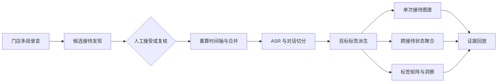
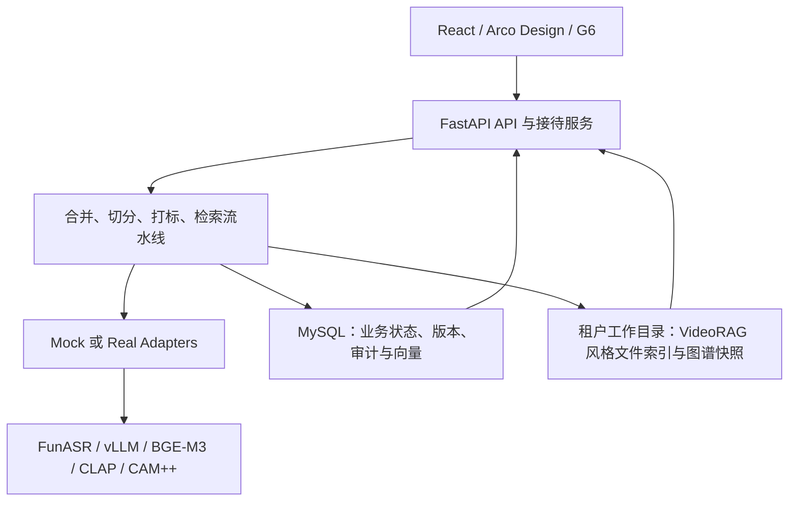

# AudioGraphy

> 把散落的门店短录音，还原成一次可调听、可切分、可追溯、可比较的销售接待。

AudioGraphy 是面向金店、汽车销售、咨询服务等线下场景的接待对话智能平台。它把一次接待中的多段录音、转写、对话单元、业务状态和标签证据组织成统一时间线，并提供单次接待图谱、跨接待状态图谱与标签洞察图谱。

项目的图谱驱动 RAG 设计来源于 [VideoRAG](https://github.com/HKUDS/VideoRAG)（KDD 2026，HKUDS），并针对音频场景重新实现文件索引、图谱与检索链路：使用 VAD、ASR、音频嵌入和声纹能力替换视觉模态预处理。

## 产品能力

| 能力 | AudioGraphy 做什么 | 业务结果 |
|---|---|---|
| 多段短录音合并 | 按租户、门店、销售、时间与客户线索发现候选；服务端重算顺序和时间轴后再接受 | 多个文件被还原为一次完整接待，源录音仍可追溯 |
| 长录音与对话切分 | 对可信边界进行快照复核；从 ASR Segment 生成对话单元，支持人工拆分与相邻合并 | 复盘粒度从“整段录音”下沉到“业务对话” |
| 接待调听 | Range 音频回放、多轨时间线、转写窗口、播放头、证据定位与过期凭证刷新 | 从洞察、标签或图谱一键回到原始声音 |
| 单次接待图谱 | 在同一接待内查看关系、时序差分、业务状态与溯源 DAG | 解释这次接待发生了什么、如何演化、证据来自哪里 |
| 跨接待状态图谱 | 聚合主路径、回退和异常跳转，并下钻到样本接待 | 识别流程瓶颈、销售差异和异常转移 |
| 标签矩阵与洞察图谱 | 对多标签组、多版本进行矩阵对齐、合并、冲突、覆盖、趋势和共现分析 | 比较不同标签体系，定位高价值目标对话 |
| 自动处理与治理 | 按合并、切分、打标阶段持久化检查点；保留版本、审计、失效和重试信息 | 流水线可恢复、结果可解释、变更可审计 |

典型数据链路：



业务不变量、接口与验收标准见 [接待对话智能工作台](./docs/reception-intelligence.md)。

## 信息架构

界面使用三层导航，避免把平台入口、接待上下文和图谱模式混在同一级：

```text
平台侧栏
├── 工作总览
├── 接待作业
│   ├── 接待中心
│   └── 录音管理
├── 对话洞察
│   ├── 状态路径
│   └── 标签洞察
└── 知识与治理
    ├── 全域知识图谱
    ├── 智能问答
    ├── 说话人
    ├── 社区探索
    └── 时间演化

接待详情 Tab
├── 调听与切分
└── 关系与溯源

页面内部视图
├── 单次接待：关系图谱 / 时序差分 / 状态路径 / 溯源 DAG
├── 跨接待分析：全部路径 / 主路径 / 回退与异常
└── 标签洞察：关系图谱 / 对比矩阵 / 图表分析
```

单次接待图谱始终保留接待 ID 与返回调听路径；跨接待状态流和标签洞察属于全局分析，不依赖一个硬编码接待。

## 快速启动

### 环境要求

- Docker 与 Docker Compose v2
- 本地开发后端需要 Python 3.13
- 本地开发前端需要 Node.js 22 与 npm

### Docker Compose：Mock 全栈

主 Compose 是带源码挂载、自动重载和 Vite 开发服务器的单机开发栈。Mock profile 不下载模型、不要求 GPU，适合功能验证和前后端联调。首次运行且根目录尚无 `.env` 时，先从示例创建：

```bash
cp .env.example .env
docker compose --profile mock up -d
docker compose --profile mock ps
curl --fail http://127.0.0.1:8000/health
```

默认地址：

| 服务 | 地址 | 说明 |
|---|---|---|
| Web | `http://127.0.0.1:5173` | React + Vite 前端 |
| API | `http://127.0.0.1:8000/api/v1` | 业务 API 前缀 |
| Swagger | `http://127.0.0.1:8000/docs` | FastAPI 交互文档 |
| 健康检查 | `http://127.0.0.1:8000/health` | 进程存活 |
| 就绪检查 | `http://127.0.0.1:8000/health/readiness` | 数据库与适配器状态 |
| Prometheus | `http://127.0.0.1:8000/metrics` | 应用指标 |
| Adminer | `http://127.0.0.1:8081` | 仅 `mock` profile |
| MySQL | `127.0.0.1:3307` | 宿主端口；容器内为 `mysql:3306` |

仓库不会写死演示账号或演示密码。首次启动会创建数据库结构与服务，但业务界面登录仍需要导入或创建所属环境的租户和用户数据。

常用 Compose 命令：

```bash
# 查看应用日志
docker compose logs -f backend frontend

# 重启应用服务
docker compose restart backend frontend

# 停止并保留数据卷
docker compose --profile mock down

# 校验配置，不拉取或启动模型
docker compose --env-file .env.example --profile mock config --quiet
```

### 本地运行前后端

先在项目根目录启动 MySQL：

```bash
docker compose up -d mysql
```

本地后端不会自动读取项目根目录的 `.env`；下面显式导出的数据库端口、工作目录和主密钥路径必须与本机环境一致。

终端一：后端。

```bash
cd backend
python3.13 -m venv .venv
source .venv/bin/activate
python -m pip install -e ".[dev]"

mkdir -p .local/working
python scripts/init_master_key.py \
  .local/audiography_master.key \
  --state-dir .local/working

export MYSQL_HOST=127.0.0.1
export MYSQL_PORT=3307
export WORKING_DIR=.local/working
export MASTER_KEY_PATH=.local/audiography_master.key

alembic upgrade head
uvicorn audio_graphy.main:app --reload --port 8000
```

终端二：前端。Vite 默认把 `/api` 代理到 `http://localhost:8000`。

```bash
cd frontend
npm ci
npm run dev
```

## 模型部署

`docker-compose.yml` 提供四个互斥 profile。不要同时启用 CPU 与 GPU profile，因为 BGE-M3 服务会争用相同的网络别名和宿主端口。

| Profile | 模型服务 | GPU | 适用场景 |
|---|---|---:|---|
| `mock` | 无；全部 adapter 保持 mock | 0 | 开发、CI、前端联调 |
| `models-cpu` | FunASR、BGE-M3 CPU、CAM++ | 0 | CPU 验证与离线小批量处理 |
| `models-single-gpu` | FunASR、vLLM strong、BGE-M3 GPU、CLAP、CAM++ | 1 | 单卡推理；strong/weak 可共用一个 vLLM |
| `models-multi-gpu` | 单卡 profile 的服务，加独立 vLLM weak | 2+ | strong/weak 分卡部署 |

选择 profile 前，如果还没有 `.env`，先复制 `.env.example`；随后只把该拓扑实际提供的 adapter 切换为 `real`。Profile 只决定启动哪些容器，旧的 `ADAPTER_MODE=real` 不会启用真实 adapter。

```bash
cp .env.example .env
docker compose --profile models-cpu up -d
docker compose --profile models-cpu ps
```

真实模型的默认宿主诊断端口：

| 服务 | 默认地址 |
|---|---|
| vLLM strong | `127.0.0.1:18000` |
| vLLM weak | `127.0.0.1:18001` |
| BGE-M3 | `127.0.0.1:18080` |
| FunASR | `127.0.0.1:10095` |
| CLAP | `127.0.0.1:18006` |
| CAM++ | `127.0.0.1:18007` |

模型与应用端口默认只绑定 `127.0.0.1`。生产环境需要替换 JWT、数据库和模型 API 密钥，并备份独立的音频主密钥卷。

Batch VAD 没有绑定未经审计的第三方镜像，默认保持 mock；Streaming VAD 使用本地 ONNX adapter 和只读模型挂载：

```bash
SILERO_VAD_MODEL_FILE=/absolute/path/silero_vad.onnx \
docker compose \
  -f docker-compose.yml \
  -f docker-compose.streaming-vad.yml \
  --profile mock up -d
```

该 overlay 只切换 Streaming VAD adapter 并挂载模型；如需开放 `/ws/stream`，还必须在 `.env` 显式设置 `ENABLE_STREAMING=true`。它不会把 batch VAD 的 `ADAPTER_VAD_MODE` 切换为 real。

硬件边界、单卡/多卡变量、模型名映射、安全策略和 VAD 契约见 [模型部署指南](./docs/deployment.md)。

## 系统架构

AudioGraphy 将业务状态、模型能力与图谱检索解耦：



核心技术栈：

| 层 | 主要技术 |
|---|---|
| 后端 | Python 3.13、FastAPI、SQLAlchemy、Alembic、MySQL 8 |
| 前端 | React 18、TypeScript、Vite、Arco Design、AntV G6 |
| 图谱与检索 | VideoRAG 思路、NetworkX、BGE-M3、社区摘要与 GraphRAG 检索 |
| 音频 | VAD、FunASR、CLAP、CAM++、Range 回放 |
| 治理 | 多租户、JWT/RBAC、标签版本、审计、加密、保留与 DSAR |
| 部署 | Docker Compose、互斥模型 profile、Prometheus 指标 |

核心设计原则：

- 参考 VideoRAG 的图谱驱动检索思想，按音频场景实现独立工程链路。
- MySQL 管理流水线状态、版本、权限与审计；租户工作目录承载文件索引和图谱快照。
- 标签计算、接待合并、人工切分和自动处理均使用幂等或乐观锁边界。
- 证据同时保留源录音坐标与合并时间线坐标。
- 图谱变更和标签变更显式失效并留下溯源，不静默覆盖。

## 质量门禁

质量标准以源码配置和 CI 为准：

| 范围 | 门禁 |
|---|---|
| 后端 | Ruff 格式检查、Ruff lint、mypy strict、pytest、分支覆盖率门槛 |
| 性能 | 独立向量热查询性能测试；预算由 CI 环境变量显式给出 |
| 前端 | ESLint、Vitest/Testing Library、TypeScript 构建、初始包体预算 |
| 部署 | 四个 Compose profile 与 Streaming VAD overlay 均执行配置解析 |

本地执行与 CI 对齐的主要命令：

```bash
# 后端
cd backend
ruff format --check .
ruff check .
mypy audio_graphy
python -m pytest tests/

# 前端
cd ../frontend
npm ci
npm run lint
npm test
npm run build

# Compose 配置
cd ..
for profile in mock models-cpu models-single-gpu models-multi-gpu; do
  docker compose --env-file .env.example --profile "$profile" config --quiet
done
docker compose \
  -f docker-compose.yml \
  -f docker-compose.streaming-vad.yml \
  --env-file .env.example \
  --profile models-single-gpu config --quiet
```

前端还提供 `npm run test:watch`、`npm run test:ui` 与 `npm run e2e`；E2E 需要先启动目标环境。

## 工程能力与里程碑

| 里程碑 | 已沉淀的工程能力 | 默认安全边界 |
|---|---|---|
| M4 | Real adapter 代码与契约；Silero VAD HTTP 适配、OpenAI 兼容 LLM、BGE-M3；模型拓扑 | 未提供或未部署的 adapter 保持 mock |
| M5 | FunASR 适配；离线评估 CLI、指标与 Markdown/JSON 报告 | 评估可复用现有 strong LLM，不新增隐式模型服务 |
| M6 | 音频分块认证加密、PII 清洗、保留与 DSAR；Eval REST；中文实体模糊归并；Prometheus | 敏感删除与管理接口受 RBAC 和租户边界约束 |
| M7 | CLAP 音频嵌入、CAM++ 声纹与说话人连接、文本/图谱/音频三通道检索 | 音频与声纹能力由独立开关控制 |
| M8 | Streaming VAD/ASR、会话状态机、增量切片与增量图更新 | Streaming 总开关默认关闭 |
| M9 | 双时态边、Leiden 社区、社区摘要与全局搜索、软删除压缩、说话人模糊复核队列 | Advanced Graph 总开关默认关闭 |

M9 的接口、权限、定时任务与开关见 [Advanced Graph 指南](./docs/advanced-graph.md)。

## 目录结构

```text
audio_graphy/
├── backend/
│   ├── audio_graphy/
│   │   ├── api/          # FastAPI 路由
│   │   ├── adapters/     # Mock / Real 模型协议与实现
│   │   ├── analytics/    # 聚合洞察计算
│   │   ├── core/         # 切分、图谱、检索、流式与治理算法
│   │   ├── eval/         # 评估 runner、judge 与指标
│   │   ├── models/       # SQLAlchemy ORM
│   │   ├── services/     # 接待、标签、索引与模型服务
│   │   ├── storage/      # MySQL、文件索引与 NetworkX 存储
│   │   └── tags/         # 标签事实、当前视图与重算
│   ├── alembic/          # 数据库迁移
│   ├── scripts/          # 运维与初始化脚本
│   └── tests/            # 单元、集成、E2E 与性能测试
├── frontend/
│   ├── src/pages/        # 接待、调听、图谱与洞察页面
│   ├── src/components/   # 对话、证据与导航组件
│   ├── src/api/          # API client 与类型契约
│   └── worker/           # Sites/Cloudflare 适配层
├── docker/               # CLAP、CAM++ 模型服务镜像
├── mysql/                # MySQL 初始化与配置
├── examples/eval/        # 评估样例
├── docs/                 # 设计、部署、里程碑与 QA 文档
├── docker-compose.yml
└── docker-compose.streaming-vad.yml
```

## 文档索引

| 文档 | 用途 |
|---|---|
| [docs/reception-intelligence.md](./docs/reception-intelligence.md) | 接待合并、对话切分、证据、标签、自动化与工作台不变量 |
| [docs/m10-status-report.md](./docs/m10-status-report.md) | 接待工作台的产品、数据、安全、性能、部署与自动化验收结论 |
| [design-qa.md](./design-qa.md) | 三类浅色图谱的参考对照、交互与可访问性验收 |
| [docs/deployment.md](./docs/deployment.md) | 模型 profile、端口、安全边界、主密钥与 VAD 部署 |
| [docs/DESIGN.md](./docs/DESIGN.md) | 早期总体设计与路线图；现行行为以源码和专题文档为准 |
| [docs/advanced-graph.md](./docs/advanced-graph.md) | M9 双时态、Leiden、全局搜索、压缩与说话人复核 |
| [docs/m5-eval.md](./docs/m5-eval.md) | 离线评估 CLI 与报告 |
| [docs/m6-eval.md](./docs/m6-eval.md) | Eval REST 与 position de-bias |
| [docs/m6-pipl.md](./docs/m6-pipl.md) | M6 历史实现指南：音频加密、PII、保留、DSAR 与审计 |
| [docs/m8-architecture.md](./docs/m8-architecture.md) | Streaming VAD/ASR、会话与增量图谱设计 |
| [docs/preview.html](./docs/preview.html) | 早期 Arco/G6 交互原型；首次打开依赖 CDN |
| [docs/assets/](./docs/assets/) | 总体架构、数据流、标签版本与存储分层图 |

## 设计来源

- [VideoRAG](https://github.com/HKUDS/VideoRAG)：图谱驱动多模态 RAG 的设计来源；当前仓库未直接内置其上游源码。
- [Graphify](https://github.com/Graphify-Labs/graphify)：工程产物形态与边置信度参考。
- [Microsoft GraphRAG](https://github.com/microsoft/graphrag)：社区摘要与图谱检索范式参考。
- `AudioRAG开发方案.docx`：项目上层目录中的原始算法与架构方案，未随本仓库分发；本仓库文档是其工程化落地。

## 参与项目

开发约定、代码风格与提交流程见 [CONTRIBUTING.md](./CONTRIBUTING.md)，第三方概念与依赖归属见 [NOTICES.md](./NOTICES.md)。项目使用 [MIT License](./LICENSE)。
