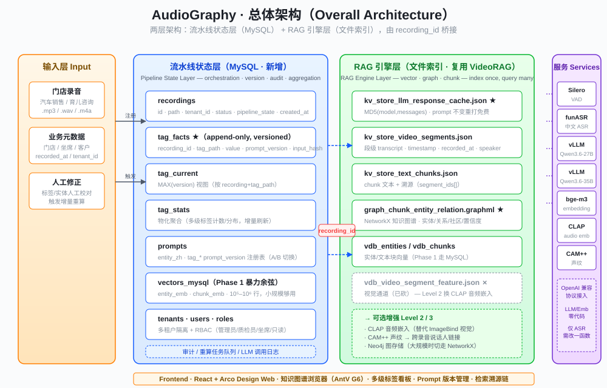
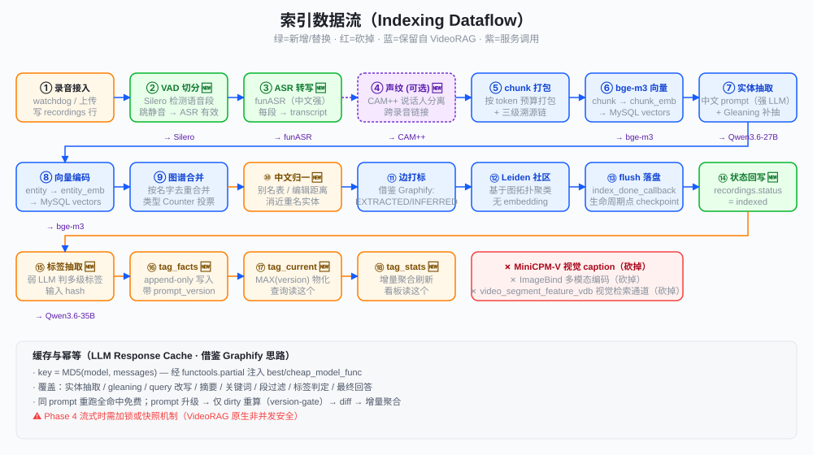
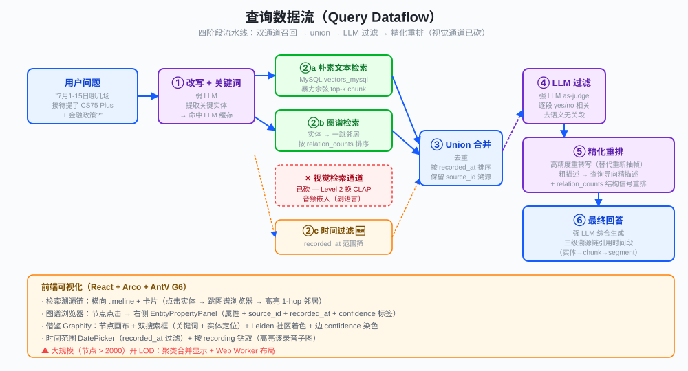
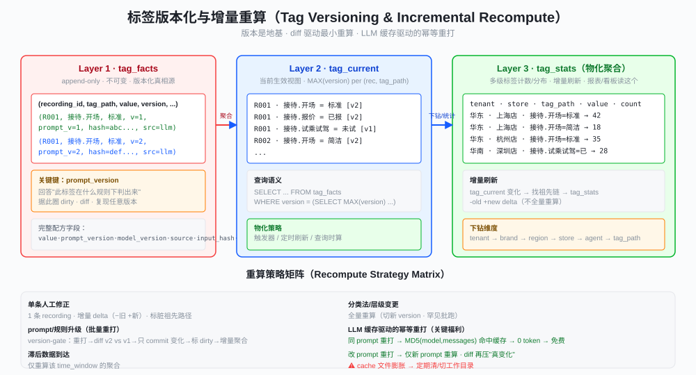
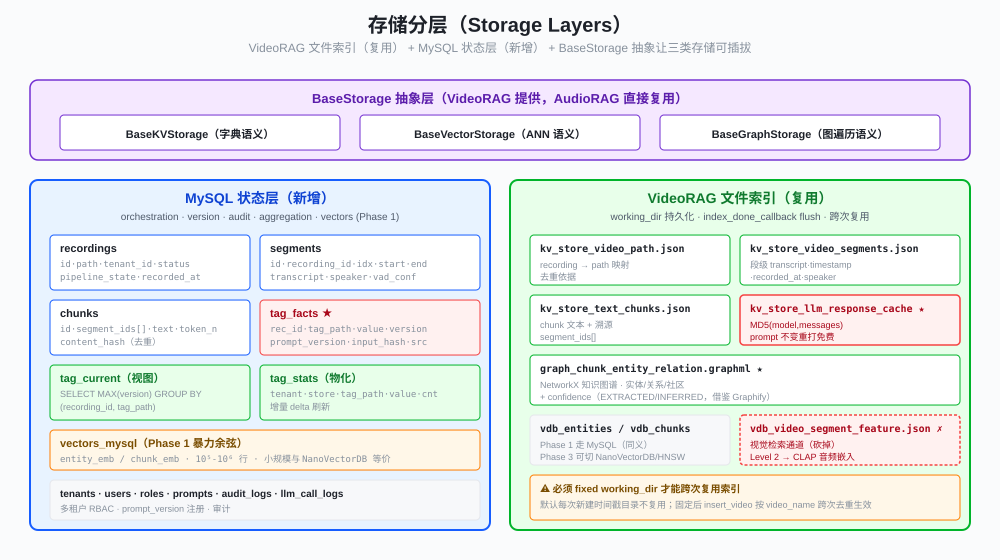
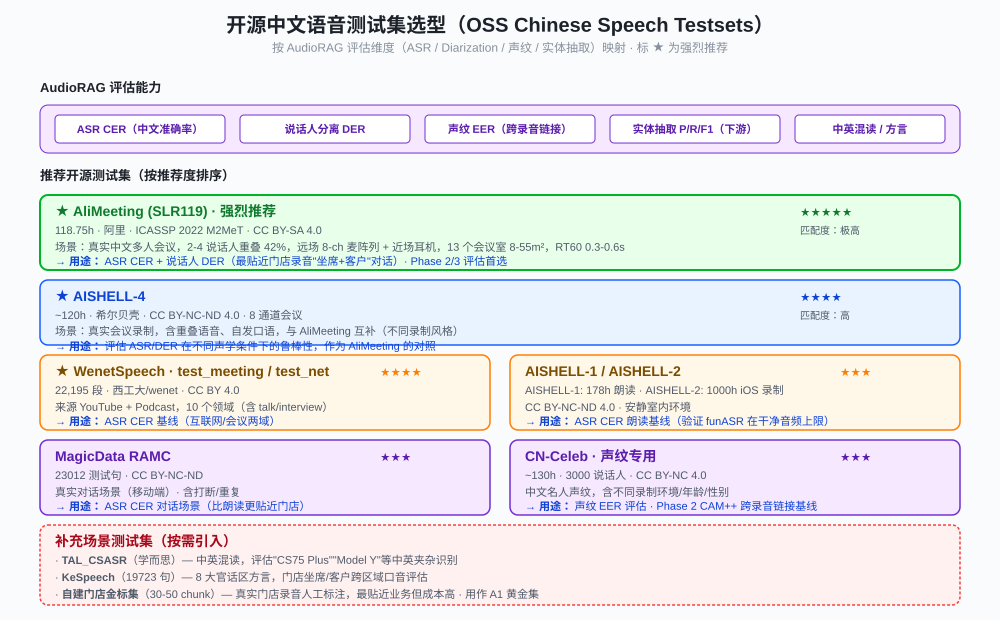

# AudioGraphy · 工程设计文档（Engineering Design Document）

> **门店录音图谱检索与多级打标系统 · Store Recording Graph Retrieval & Multi-level Tagging System**
> 
> **版本（Version）**: v1.0 · 2026-07
> **范围（Scope）**: 架构 / 算法 / 音频适配 / 标签版本化 / 存储 / 评估 / 安全 / 部署 / UI / 路线图
> **关联方案（Related Spec）**: `AudioRAG开发方案.docx`（本设计文档是其工程化落地）

> **关于上游谱系**：本文多处以 VideoRAG / GraphRAG 作为**设计参照**说明取舍。这是设计范式上的承袭——
> 本仓库不包含任何上游源码，也不依赖 VideoRAG / LightRAG / nano-graphrag 中的任何一个。
> 逐字沿用的只有若干接口约定（`working_dir` 文件命名、实体抽取的分隔符三元组），
> 完整的归属说明与许可分析见 [NOTICES.md](../NOTICES.md)。

---

## 目录（Table of Contents）

1. [项目背景与定位](#1-项目背景与定位--background--positioning)
2. [总体架构](#2-总体架构--overall-architecture)
3. [核心算法（图谱内核 · 设计参考 VideoRAG）](#3-核心算法--inheriting-videorag-graph-kernel)
4. [音频适配层](#4-音频适配层--audio-adaptation-layer)
5. [中文与领域适配](#5-中文与领域适配--chinese--domain-adaptation)
6. [多级标签版本化与增量重算](#6-多级标签版本化与增量重算--tag-versioning--incremental-recompute)
7. [存储与状态设计](#7-存储与状态设计--storage--state-design)
8. [评估方案](#8-评估方案--evaluation)
9. [流式扩展（可选 Phase）](#9-流式扩展可选-phase--streaming-extension)
10. [项目目录结构](#10-项目目录结构--project-layout)
11. [模块拆分与职责矩阵](#11-模块拆分与职责矩阵--module-breakdown)
12. [API 与数据模型](#12-api-与数据模型--api--data-model)
13. [UI 设计 · Arco 实现](#13-ui-设计--arco-实现--ui-design)
14. [鉴权、多租户与安全](#14-鉴权多租户与安全--auth-multi-tenancy--security)
15. [部署与运维](#15-部署与运维--deployment--ops)
16. [实施路线图](#16-实施路线图--roadmap)
17. [风险与权衡](#17-风险与权衡--risks--trade-offs)
18. [附录 A · 中英术语对照表](#附录-a--中英术语对照表--en-glossary)
19. [附录 B · 参考文献](#附录-b--参考文献--references)

---

## 1. 项目背景与定位 (Background & Positioning)

### 1.1 从 VideoRAG 到 AudioRAG (From VideoRAG to AudioRAG)

**VideoRAG**（KDD 2026，HKUDS）是面向超长视频的检索增强生成（Retrieval-Augmented Generation）框架，核心是把视频内容蒸馏成知识图谱，再做图谱驱动 + 多模态双通道检索。其图谱内核来自 **LightRAG / nano-graphrag**，实体抽取提示词来自微软 **GraphRAG**。

**关键洞察（Key Insight）**：VideoRAG 喂给知识图谱的文本，本来就是 ASR 转写（transcript）。所谓"视频专属"的只有两块——视觉 caption（MiniCPM-V 抽帧描述）和 ImageBind 视频段向量（视觉检索通道）。砍掉这两块，整个图谱 RAG 内核对音频完全成立，且 transcript 的信息密度高于稀疏抽帧 caption，图谱质量更优。

**结论**：AudioRAG 沿用 VideoRAG 的图谱 RAG **范式**，将模态预处理整体替换为音频链路（VAD + ASR + 声纹 + 音频嵌入），不实现视觉分支；索引、图谱与检索链路按音频场景重新实现，不复用上游源码（见 [NOTICES.md](../NOTICES.md)）。

### 1.2 项目命名 (Naming)

`audio_graphy` = **audio + graphy** = 音频图谱化。

灵感来自开源项目 **Graphify**（[Graphify-Labs/graphify](https://github.com/Graphify-Labs/graphify)，YC S26）的命名风格——把任意语料"图谱化（graphify）"。本项目把门店录音做同样的"图谱化"，但目标场景是离线质检、复盘与多级打标，而非代码助手的即时检索。

### 1.3 目标场景与设计原则 (Target Scenarios & Design Principles)

**目标场景**：门店录音（汽车销售 / 育儿咨询等）的离线质检（quality inspection）、复盘（review）与多级打标（multi-level tagging）；后续可扩展到流式实时辅助坐席。

**设计原则（Design Principles）**:

| 中文 | English | 含义 |
|---|---|---|
| 设计承袭 | Design Lineage | 图谱内核、存储分层、检索-重排的**设计范式**承袭自 VideoRAG（其自身内核来自 LightRAG / nano-graphrag）。代码按音频场景独立实现，不引入上游依赖，不复用上游源码 |
| 模态替换 | Modality Swap | 视觉预处理整体替换为音频预处理（VAD + ASR），不改造内核 |
| 两层分离 | Two-Layer Separation | MySQL 管流水线状态/版本/审计，文件索引管 RAG 检索，各司其职 |
| 治理前置 | Governance First | 标签版本化 + 增量重算 + LLM 缓存幂等重打，从设计期就内建 |
| 评估驱动 | Evaluation Driven | 分层评估框架，prompt 改动有量化指标，不靠感觉 |
| 聚焦逻辑 | Logic Focus | 文档与方案聚焦算法/数据流/状态机，不堆部署细节（端口/容器/镜像/IP） |
| 借鉴开源 | Stand on Giants | 工程产物形态借鉴 Graphify（三件套 + 边置信度）；检索范式借鉴 GraphRAG（社区/分层/DRIFT） |

### 1.4 与 AudioRAG 方案 docx 的关系

本设计文档是 `AudioRAG开发方案.docx` 的**工程化落地**（engineering realization）。docx 给出的是算法/架构思路，本文档在其基础上新增：项目目录结构、模块拆分、API/数据模型、UI 设计、鉴权与多租户、部署与运维——使之可直接交付开发团队。

---

## 2. 总体架构 (Overall Architecture)



### 2.1 两层架构 (Two-Layer Architecture)

系统分为两层，由 `recording_id` 桥接：

- **流水线状态层（Pipeline State Layer · MySQL · 新增）**：负责"谁处理到哪一步、打了哪些标、什么版本、推没推、能不能重试"——流水线编排 + 中间状态 + 审计 + 多级标签聚合。VideoRAG 本身没有这一层，必须外挂。
- **RAG 引擎层（RAG Engine Layer · 文件索引 · 自研）**：负责"这些录音建出来的向量/图/chunk 索引"——检索引擎，模态无关。`working_dir` 的目录布局与文件命名沿用 VideoRAG 约定（`graph_chunk_entity_relation.graphml`、`kv_store_*.json`）以便对照排查；索引、图谱与检索代码由本项目实现。

复用现有编排基础设施（watchdog / daily_download / daily_pipeline 三层定时任务），把其中 tagging 阶段替换为 AudioRAG 图谱流程即可，状态机照旧。

### 2.2 组件清单 (Component List)

| 组件 (Component) | 职责 (Responsibility) | 来源 (Source) |
|---|---|---|
| VAD 切分 (VAD Segmentation) | 音频分段（替代 VideoRAG 文件切分） | Silero VAD 服务 |
| ASR 转写 (Transcription) | 每段音频转文本（替代 whisper） | funASR 服务 |
| 文本切分 (Text Chunking) | 段→chunk 层次打包 + 溯源 | 自研（设计参考 VideoRAG） |
| 实体抽取/图谱 (Entity Extraction + Graph) | LLM 抽实体关系、合并进图 | 自研（设计参考 VideoRAG） |
| 双通道检索+重排 (Dual-channel Retrieval + Rerank) | naive + 图谱检索，LLM 过滤精化 | 自研（设计参考 VideoRAG；无视觉通道，另加音频通道） |
| 强 LLM (Strong LLM) | 抽取/回答 | Qwen3.6-27B vLLM |
| 弱 LLM (Weak LLM) | 改写/摘要/标签判定 | Qwen3.6-35B-A3B vLLM |
| Embedding | 实体/文本块向量 | bge-m3 |
| MySQL 状态层 (MySQL State Layer) | 状态/版本/聚合/审计/向量（Phase 1） | 新增 |
| [可选] 音频嵌入 (Audio Embedding) | 音频段向量（替代 ImageBind） | CLAP / 声纹 |
| [可选] 说话人链接 (Speaker Linking) | 跨录音声纹连接 | CAM++ |

### 2.3 三层服务 (Three Service Layers)

后端逻辑按职责拆为三组服务（部署时可单进程内分组，亦可独立服务）：

- **Ingestion 服务（Ingestion Service）**：录音注册 → VAD → ASR → 实体抽取 → 图谱合并 → 落盘 → 状态回写
- **Query 服务（Query Service）**：用户提问 → 双通道检索 → LLM 过滤 → 精化重排 → 最终回答 + 三级溯源
- **Governance 服务（Governance Service）**：标签抽取 → tag_facts 写入 → 增量聚合 → prompt 版本切换 → diff 驱动重算 → 评估任务

### 2.4 部署拓扑（单机 docker-compose）

详见 [§15 部署与运维](#15-部署与运维--deployment--ops)。

### 2.5 多租户与 RBAC

详见 [§14 鉴权、多租户与安全](#14-鉴权多租户与安全--auth-multi-tenancy--security)。

---

## 3. 核心算法（图谱内核 · 设计参考 VideoRAG）(Graph Kernel — Design Reference: VideoRAG)

本章算法的整体流程（分块 → LLM 抽实体关系 → 跨块合并入图 → naive + 图谱双通道检索 → LLM 重排）**参考** VideoRAG / GraphRAG 范式，实现为本项目自写，未复用上游源码。与上游的具体差异见 §3.4：切分以 VAD/ASR 段为原子单位而非 token 滑窗；实体合并用类型多数投票 + 描述去重截断，而非上游的 LLM 描述摘要；关系记录 schema 为「源实体 / 关系标签 / 目标实体 / 详情」，不含上游的数值 strength 字段，与上游解析器不互通。



### 3.1 图谱知识索引（实体抽取 + 合并）(Entity Extraction + Merge)

两阶段：

1. **抽取（Extraction）**：每个 chunk 并发抽实体/关系。
   - GraphRAG 风格的分隔符协议（tuple/record/completion 分隔符），LLM 输出结构化记录，代码正则解析。比 JSON 对 LLM 更鲁棒。
   - **Gleaning**：多轮"补抽"提升实体召回（默认首轮 + 1 次强制补抽）。
2. **合并（Merge）**：跨 chunk 按名字去重合并进图。
   - 实体类型按 Counter 多数投票；
   - 描述去重拼接（超长则 LLM 摘要）；
   - 边权重累加（提及越多越强）。
3. **跨录音（Cross-recording）**：实体按名字全局合并，`source_id` 指向多个录音的 chunk——这是 Cross-Video Understanding 的机制。

**借鉴 Graphify 的边置信度标签**（edge confidence tags）：每条边带 `EXTRACTED`（源码/原文中直接存在，置信度 1.0）/ `INFERRED`（合理推断，带 score）/ `AMBIGUOUS`（不确定，待人工审核）。这让图谱可视化时能区分"看到"与"猜到"，对应到 UI 上用不同颜色染色（见 §13.5）。

### 3.2 段→chunk 层次打包 + 三级溯源链 (Hierarchical Chunking + 3-level Provenance)

`chunking_by_video_segments` 按 token 预算把多个段打包进一个 chunk，并记录 chunk 由哪些段组成。贯穿全流程的是**三级溯源链（3-level Provenance Chain）**：

```
实体 (entity)
  ──source_id──→ chunk
                 ──video_segment_id[]──→ {recording}_{段idx}
                                         ──→ 段级原文 + 录制时间 (segment-level transcript + recorded_at)
```

这条链让回答能精确引用到时间段，也让图谱检索能反查回原文。**这是 AudioRAG 质检/复盘场景区别于通用问答的根本——必须能"回到现场（audio segment）"**。

### 3.3 双通道检索 + 重排 (Dual-channel Retrieval + Rerank)



查询是**四阶段流水线**，不是一次向量搜索：

1. **双通道召回（Dual-channel Recall）**：
   - ① **朴素文本块检索（naive text chunk retrieval）**：`chunks_vdb` 暴力余弦 top-k chunk。
   - ② **图谱检索（graph retrieval）**：实体 → 一跳邻居，按 `relation_counts`（图结构信号，非纯向量相似度）排序反查段。
   - ③ **视觉通道（原版砍掉）**：可换成音频嵌入（CLAP / 声纹）。
2. **union 合并 + 时间排序**：去重 + 按 `recorded_at` 排序。
3. **LLM 过滤（LLM as-judge）**：逐段判 yes/no 是否相关，去掉向量相似但语义无关的段。
4. **精化重排（Refined Rerank）**：提取关键词 + 对存活段定向"精看"（音频场景用**高精度重转写**替代原版"重新抽帧"），把粗描述升级为查询导向的精描述。

**VideoRAG 检索质量的三个亮点**：图结构排序（`relation_counts`）、粗/精两阶段描述、LLM 重排。三项均与模态无关，AudioGraphy 参照实现。其中图结构排序与 LLM 重排已落地（`core/retrieval.py` / `core/rerank.py`）；**粗/精两阶段描述目前是直通占位**——`core/rerank.py` 的 `_refine_descriptions()` 原样返回候选文本，高精度重转写尚未接入，列为待实现项。

### 3.4 AudioRAG 相对 VideoRAG：砍 / 留 / 加 (Cut / Keep / Add)

| 组件 (Component) | VideoRAG | AudioRAG | 动作 (Action) |
|---|---|---|---|
| 视频文件切分 (file split) | moviepy 按时长切 | VAD 切分 | 替换 (Swap) |
| ASR | faster-whisper（英文强） | funASR（中文强） | 替换 (Swap) |
| 视觉 caption (visual caption) | MiniCPM-V 抽帧 | — | 砍掉 (Cut) |
| 多模态编码 (multimodal encoder) | ImageBind 视觉（强制 GPU） | CLAP / 声纹（可选） | 砍/换 (Cut/Swap) |
| 视觉检索通道 (visual retrieval) | video_segment_feature_vdb | —（或音频嵌入通道） | 砍/换 (Cut/Swap) |
| 实体抽取+图谱 (entity + graph) | GraphRAG prompt | 中文领域 prompt | 保留+汉化 (Keep + Localize) |
| 段→chunk 打包 (chunking) | chunking_by_segments | 同 | 保留 (Keep) |
| 双通道检索+重排 (retrieval + rerank) | naive+图谱 | 同（砍视觉） | 保留 (Keep) |
| 知识图谱/向量库 (KG + vector DB) | NetworkX/NanoVectorDB | 同（Phase 1 进 MySQL） | 保留 (Keep) |
| 说话人维度 (speaker dimension) | 无 | CAM++ 说话人节点 | 新增 (Add) |
| 时间维度 (time dimension) | 仅视频内偏移 | + recorded_at + 时间查询 | 新增 (Add) |
| 边置信度标签 (edge confidence) | 无 | EXTRACTED/INFERRED/AMBIGUOUS | 新增（借鉴 Graphify）(Add) |

---

## 4. 音频适配层 (Audio Adaptation Layer)

### 4.1 模型角色与映射 (Model Roles & Mapping)

VideoRAG 需要 6 个模型角色，AudioRAG 砍掉视觉后只需 4 个，且全部对接现成服务：

| 角色 (Role) | 用途 (Usage) | AudioRAG 接入 (Integration) | 改动 (Change) |
|---|---|---|---|
| ASR | 音频→transcript | funASR 服务 | 改 1 个函数（HTTP） |
| 强 LLM (Strong LLM) | 实体抽取/最终回答/段过滤 | Qwen3.6-27B vLLM | 0 代码（配 base_url） |
| 弱 LLM (Weak LLM) | query 改写/摘要/关键词/标签判定 | Qwen3.6-35B-A3B | 0 代码（配 base_url） |
| Embedding | 实体/文本块向量 | bge-m3 | 0~少代码 |
| ✗ 视觉 VLM | 抽帧描述 | — | 删 MiniCPM-V |
| ✗ 多模态编码 | 视频段向量 | — | 删 ImageBind |

**核心**：Qwen3.6 vLLM 暴露 OpenAI 兼容 API。AudioGraphy 自带 `adapters/real/llm_openai.py`（httpx 直连 `POST {base_url}/chat/completions`，**不依赖 openai SDK**），strong / weak 两档共用同一个类、仅 `(base_url, model)` 不同，由 `Settings.openai_base_url_strong` / `openai_base_url_weak` 配置——**换模型只改配置、不改代码**。唯一需要写适配代码的是 ASR（funASR 是自有服务、非 OpenAI 格式）。本项目**不集成** MiniCPM-V 与 ImageBind（音频场景无视觉模态），本地 GPU 需求相应下降，ASR 走现成服务不在本进程。

### 4.2 切分：VAD 替代文件切分 (VAD Replaces File Split)

VideoRAG 的 `split_video` 依赖完整文件（需预知 duration 才能 `list(range(0, total, 30))`）。AudioRAG 用 **Silero VAD** 做语音活动检测分段，天然适配音频，且能跳过静音段，提升 ASR 有效率。

### 4.3 砍掉：视觉 caption + ImageBind (Cut: Visual Caption + ImageBind)

- **MiniCPM-V**：视觉描述 VLM，最吃显存，AudioRAG 无视觉，整体删除。
- **ImageBind**：多模态编码（vision 模态），强制 `.cuda()`，删除后连带砍掉 `pytorchvideo` / `bitsandbytes` / `eva-decod` 等一长串依赖。
- 砍视觉检索通道后，`video_segment_feature_vdb` 为空，可整体关闭。

### 4.4 可选增强：音频嵌入 + 说话人链接 (Optional: Audio Embedding + Speaker Linking)

这两项是 AudioRAG 能超越 VideoRAG 的增量能力：

#### 4.4.1 音频嵌入（Level 2）

用 **CLAP**（文本↔音频跨模态）或 Whisper encoder 替代 ImageBind 视觉，编码音频段。保留双通道检索的"第二通道"，但模态从视觉换成音频——能抓住 transcript 里没有的副语言信息（情绪、停顿、语速）。

#### 4.4.2 说话人链接（Level 3 强增量 · Audio-only）

**CAM++ 声纹做说话人分离**，把"说话人"作为一类节点显式建进图：

```
(坐席) –[推荐]→ (车型)
(客户) –[询问]→ (车型)
(客户) –[对比]→ (竞品)
```

**跨录音声纹匹配（Cross-recording Voiceprint Matching）**：同一客户多次到店、同一坐席跨班次——这些"相邻录制"靠声纹一致就能连，而 VideoRAG 只靠实体名重叠（聊的内容不同就连不上）。**这是声纹驱动的跨音频理解（voiceprint-driven cross-audio understanding），VideoRAG 完全没有**。

> VideoRAG 的 Cross-Video Understanding 仅靠语义实体重叠，不含任何时序/邻接关系。AudioRAG 用声纹重叠补上"相邻/同人"这一类连接，比文本实体更强。

---

## 5. 中文与领域适配 (Chinese & Domain Adaptation)

### 5.1 实体抽取 prompt 中文化 (Entity Extraction Prompt Localization)

实体抽取提示词是整个流程里**唯一需要为中文场景改的地方**，三处改动（纯提示词编辑，零代码）：

1. **输出语言（Output Language）**：原版强制 `Return output in English` → 改为中文输出（中文 transcript 不翻译，省 token、保语义）。
2. **实体类型（Entity Types）**：原版仅 4 类 `[organization/person/geo/event]` → 换成领域类型：
   - 汽车销售：`[客户, 坐席, 车型, 价格方案, 金融政策, 优惠权益, 竞品, 预约事件]`
   - 育儿咨询：`[客户, 顾问, 商品, 促销方案, 育儿问题, 竞品, 预约事件]`
3. **few-shot 例子（Few-shot Examples）**：原版 3 个英文叙事例子 → 加 1 个中文接待对话例子（含完整实体/关系输出），LLM 仿写更准。

占位符（`tuple/record/completion/entity_types/input_text`）全部保留，与 `_op.py` 的 `.format()` 调用兼容，可直接替换 `prompt.py` 对应三段。

### 5.2 中文实体命名一致性（必测坑）(Chinese Entity Naming Consistency — Must Test)

原版靠 `entity_name.upper()` 做归一（英文大小写），中文无大小写 → `"CS75 Plus"` / `"CS75PLUS"` / `"长安CS75"` 会被当成不同节点，图里出现**近重名实体（near-duplicate entities）**。

**缓解**：
- 抽取后加一层中文实体归一（别名表 / 编辑距离聚类）；
- 把它列入评估指标（近重名实体率）。

### 5.3 时间维度补强 (Time Dimension Enhancement)

VideoRAG 的时间是"半相关（semi-correlated）"：只有单个视频内的时间偏移（段 timestamp、ASR 词时间、回答引用），**完全没有录制时间 / 跨视频时序 / 按时间检索**。时间是 citation 装饰，不是检索维度。

AudioRAG 的质检/复盘场景需要按日期筛（"只看 7 月 1-15 日的接待"），补两处即可：

- **段结构加 `recorded_at`**：索引时写真实录制时间（从文件名/元数据），不用 `time.time()`。
- **查询加时间过滤**：`videorag_query` 召回后加一道 `recorded_at` 范围筛选。

---

## 6. 多级标签版本化与增量重算 (Tag Versioning & Incremental Recompute)



### 6.1 版本化是地基 (Versioning is the Foundation)

多级标签统计的重算痛点，根因是"**没版本 = 每次改标签都是破坏性覆盖 = 没法 diff = 只能全量重算**"。版本化是把它变成按需增量重算的开关。

**关键精度**：要版本化的不是"标签值"，而是"**判定本身（the judgment itself）**"——一条 `version` 行须带上产生它的配方：

```
tag_facts 行 (tag_facts row):
  (recording_id, tag_path, tag_value, prompt_version, model_version,
   source, input_hash, computed_at, confidence)
```

`prompt_version` 是核心键——回答"这个标签是在什么规则下判出来的"，据此圈出待重打、做 diff、复现任意版本。

| 能力 (Capability) | 没版本 (No Versioning) | 有版本 (With Versioning) |
|---|---|---|
| diff 找变化 (find changes) | 没两版可比 | v1 vs v2 |
| 增量重算 (incremental recompute) | 只能全量 | 只重算 dirty |
| 可复现/审计 (reproducible / auditable) | 历史被覆盖 | 回任意版本 |
| A/B 对比 prompt | 做不到 | 两版并行 |

### 6.2 三层数据模型 (Three-Layer Data Model)

- **Layer 1 · `tag_facts`（原始事实，append-only，版本化）**：真相源，只追加不改。人工修正/prompt 升级都是写新 version 行。
- **Layer 2 · `tag_current`（当前生效视图）**：每条 `(recording, tag_path)` 取 `MAX(version)`，统计查这个。
- **Layer 3 · `tag_stats`（物化聚合）**：多级标签的计数/分布，增量刷新，报表/看板读这个。

### 6.3 重算策略矩阵 (Recompute Strategy Matrix)

| 触发场景 (Trigger) | 影响范围 (Scope) | 策略 (Strategy) |
|---|---|---|
| 单条人工修正 (single manual correction) | 1 条 recording | 增量 delta：聚合 −旧 +新，只标脏祖先路径 |
| prompt/规则升级（批量重打）(prompt upgrade) | 一批 recording | version-gate：重打→diff→只 commit 变化→标 dirty→增量聚合 |
| 滞后数据到达 (late arrival) | 某时间窗 | 只重算该 `time_window` 聚合 |
| 分类法/层级变更 (taxonomy change) | 全部 | 全量重算（切新 version · 罕见批跑） |

### 6.4 LLM 缓存驱动的幂等重打 (LLM Cache-Driven Idempotent Retagging)

VideoRAG 的 LLM 响应缓存（`kv_store_llm_response_cache.json`）以 `(model, messages)` 的 MD5 为 key。含义：**同 prompt 重打 → 命中缓存 → 免费**。所以 prompt 升级重打的昂贵部分只剩"新 prompt 下的重打"，而 diff 又把它压到"只有真变化的"。

**完整流程（Full Flow）**：

```
prompt v2 上线
  → MySQL 查 prompt_version < v2 的 recording
  → 重打（同 prompt 命中免费 / 新 prompt 调 LLM）
  → 写 v2 行 不动 v1
  → diff v2 vs v1
  → 相同丢弃 / 不同入 dirty 队列
  → 增量聚合（祖先链 −old +new）
  → 更新 recording.prompt_version = v2
```

---

## 7. 存储与状态设计 (Storage & State Design)



### 7.1 两层存储 (Two-Layer Storage)

VideoRAG 只有文件存储（JSON/GraphML），不管流水线状态——这正是它不能直接用于多级打标的原因。AudioRAG 采用两层：**MySQL 管状态/版本/审计，文件索引管 RAG 检索，用 `recording_id` 桥接**。

### 7.2 working_dir 布局与落盘机制 (working_dir Layout & Flush Mechanism)

文件索引全部持久化到 `working_dir`，**索引建一次反复查**：

| 文件 (File) | 内容 (Content) | AudioRAG |
|---|---|---|
| `kv_store_video_path.json` | recording→路径 | 复用 |
| `kv_store_video_segments.json` | 段级原文（transcript/time/recorded_at/speaker） | 复用 |
| `kv_store_text_chunks.json` | chunk + 溯源 | 复用 |
| `kv_store_llm_response_cache.json` ★ | LLM 响应缓存（省 token） | 复用（核心福利） |
| `vdb_entities.json` | 实体向量库 | 复用（Phase 1 走 MySQL） |
| `vdb_chunks.json` | 文本块向量库 | 复用（Phase 1 走 MySQL） |
| `vdb_video_segment_feature.json` | 视频段视觉向量 | 砍视觉→空/删 |
| `graph_chunk_entity_relation.graphml` | 知识图谱（GraphML） | 复用（+ confidence 字段） |

**关键 gotcha**：必须**固定 `working_dir`** 才能跨次复用索引。默认值是每次新建时间戳目录（不复用）。固定后 `insert_video` 的 `video_name` 去重才能跨次生效。

**落盘机制**：不是每次写都落盘，而是 `index_done_callback()` 在生命周期节点（段索引完 / 图谱建完 / 查询完）统一 flush。模型：**内存攒着 → checkpoint 整体写盘**。

### 7.3 LLM 响应缓存机制 (LLM Response Cache Mechanism)

- **注入**：`llm_response_cache`（`JsonKVStorage`）通过 `functools.partial` 注入 `best/cheap_model_func`。
- **Key**：`compute_args_hash(model, messages) = md5(str((model, [system+history+user])))`。
- **流程**：命中 → 直接返回上次输出（不调 API、0 token）；未命中 → 调 API → 存回 → flush。
- **缓存范围**：实体抽取、gleaning、query 改写、摘要、关键词、段过滤、标签判定、最终回答——凡走 `best/cheap` 的全缓存。

**对迭代的意义**：没改 prompt → 重跑全命中免费；改了 prompt → 全 miss 重算（正确性优先）；评估时只动目标 prompt，其余命中，成本可控。

### 7.4 Phase 1 决策：全 MySQL 暴力余弦 (Phase 1 Decision: All-MySQL Brute-Force Cosine)

能"存" ≠ 能"搜"。核心区别：向量库的价值是 ANN 近似最近邻（百万级毫秒找 top-k），MySQL 没有向量索引，每次查询全表算余弦 = O(N)。但 VideoRAG 默认的 NanoVectorDB 本身也是暴力余弦（无 HNSW），所以小规模下两者等价。

| 存储 (Storage) | MySQL 替代 | 结论 |
|---|---|---|
| KV（kv_store_*.json） | ✅ 容易且推荐 | 就是字典，行存即可；反而比 JSON 文件好（可查/并发/统一备份） |
| 向量库（vdb_*.json） | ⚠️ 看规模 | 小规模（<10万）暴力 MySQL ≈ NanoVectorDB 无损；大规模需 ANN |
| 图库（graph_*.graphml） | ❌ 不建议 | 图遍历在关系库痛苦；要上 DB 用 Neo4j（已支持） |

AudioRAG 规模估算（几百-几千录音 × 每条几百 chunk/实体 ≈ 10⁵–10⁶ 向量）属临界。

**Phase 1 路线（已选）**：**KV + 向量都进 MySQL（暴力）**，图库留 NetworkX 文件。代价是大规模检索慢，适合离线质检。运维极简，Phase 3 再评估升级。

**升级路径（Phase 3 可选）**：MySQL 管状态 + 独立向量库（NanoVectorDB/HNSW 或 pgvector）管 ANN。检索快，多一个组件。

> VideoRAG / nano-graphrag 用 `BaseKVStorage` / `BaseVectorStorage` / `BaseGraphStorage` 三个抽象基类换取存储可插拔。**AudioGraphy 目前没有引入这层抽象**：`storage/` 下的 `FileIndex` / `MySQLVectorStore` / `NetworkXGraphStore` 是三个互不继承的具体类，由调用方直接依赖。后续若要更换向量库或图库，需先补一层 Protocol 再替换——这是**已知技术债，不是现成能力**。

### 7.5 并发与幂等 (Concurrency & Idempotency)

- **幂等（Idempotent）**：`insert_video` 按 `video_name` 去重 + chunk 内容哈希去重 + LLM 缓存，重跑不重复建图、不重复花钱。
- **并发短板（Concurrency Limitation）**：全量内存 + 生命周期 flush 模型**不是并发安全**的，读写无锁。离线建库+查询完全够用；流式/边写边查需自加锁或快照（见 §9）。

---

## 8. 评估方案 (Evaluation)

### 8.0 开源测试集选型（OSS Chinese Speech Testsets）

门店录音 = "坐席 + 客户" 2-4 人中文对话，与会议多人场景高度对齐。**Phase 1 评估引入开源中文语音测试集作为业务金标集的预训练基线（baseline-before-business），避免在没有参照的情况下直接评估业务数据**。



**强烈推荐（★★★★★）**：

| 数据集 | 规模 | 关键属性 | 在 AudioRAG 中的用途 |
|---|---|---|---|
| **AliMeeting** (SLR119) | 118.75h | 阿里 · ICASSP 2022 M2MeT · CC BY-SA 4.0 · 真实中文多人会议 · 2-4 说话人重叠 42% · 远场 8 通道麦阵列 + 近场耳机 · 13 个会议室 8-55m² · RT60 0.3-0.6s | ★ **ASR CER + 说话人 DER 双维度**：场景与门店录音最贴近，Phase 1-3 主基准 |
| AISHELL-4 | ~120h | 希尔贝壳 · CC BY-NC-ND · 8 通道真实会议 | 与 AliMeeting 互为对照（不同录制风格/声学条件） |
| WenetSpeech test_meeting/net | 22,195 段 | 西工大/wenet · CC BY · YouTube + Podcast · 10 领域含 talk/interview | ASR CER 互联网/会议两域基线 |
| AISHELL-1/2 | 178h / 1000h | 希尔贝壳 · CC BY-NC-ND · 安静室内朗读 | ASR CER 干净音频上限验证（funASR ceiling） |
| MagicData RAMC | 23,012 段 | CC BY-NC-ND · 移动端真实对话 · 含打断/重复 | ASR CER 对话场景（比朗读更贴近门店） |
| CN-Celeb | ~130h · 3000 说话人 | CC BY-NC · 中文名人声纹 · 多录制环境 | **声纹 EER 评估** · Phase 2 CAM++ 跨录音链接基线 |

**补充场景（按需 ★）**：

- **TAL_CSASR**（学而思）— 中英混读（code-switching）。门店录音里大量"CS75 Plus""Model Y""ID.4"等中英夹杂，必测。
- **KeSpeech**（19,723 句）— 8 大官话区方言。门店跨区域（华北/华东/华南）坐席/客户口音差异，按需评估。

**A1 黄金集自建（必做）**：开源测试集评估的是"通用 ASR/分离能力"，**不能直接衡量业务指标**。仍需自建 30-50 chunk 的门店录音人工标注（A1 层），覆盖真实车型术语、坐席话术、客户口语——开源测试集给的是"下限保证"，业务金标集给的是"上限真实"。

> ⚠ **AliMeeting 是闭集测试**（test set 不公开 transcription，需提交评测脚本到官方）。生产评估走 dev set（4h · 8 sessions · 公开标注）即可。

### 8.1 分层评估框架 (Layered Evaluation Framework)

| 层 (Layer) | 评什么 (What) | 方法 (Method) | VideoRAG 有没有 |
|---|---|---|---|
| A0 格式合规 (format compliance) | 输出能否被正则解析 | parse 成功率 / 每chunk实体数 / 空抽取率 | 隐式（warn） |
| A1 黄金集 P/R/F1 (gold-set P/R/F1) | 实体抽取准确率 | 人工标 30-50 chunk，算 P/R/F1 | 无，需自建 |
| A2 LLM-as-judge (LLM scoring) | 抽取质量打分 | 强模型对每抽取 1-5 分 | 无 |
| B 端到端 win-rate (end-to-end) | 答案质量 | 5 维 rubric + 位置去偏 | 有（reproduce/） |

VideoRAG 论文只做 B 层（端到端答案质量），A 层（提示词输出本身）需自建——尤其中文的命名一致性。

### 8.2 VideoRAG 5 维 rubric + 位置去偏 (5-dim Rubric + Position De-bias)

VideoRAG 评答案用 5 维度（GraphRAG/LightRAG 一脉标准）：**Comprehensiveness（全面性）/ Depth（深度）/ Density（密度）/ Empowerment（启发性）/ Trustworthiness（可信度）**。

三种关键技巧：

- **两模式**：win-rate（两两对比选赢家）+ 1-5 打分（vs NaiveRAG 基线）。
- **位置去偏（Position De-bias）**：同一对比跑正反两次（`ori` + `rev`）抵消 LLM judge 的位置偏好——评 LLM 输出的标准操作。
- **结构化输出 + 多轮降方差**：pydantic → strict JSON 可解析；`run_time=5` 跑多次取均。

### 8.3 OSS 工具选型 (OSS Tool Selection)

| 工具 (Tool) | 强项 (Strength) | 接哪层 (Layer) |
|---|---|---|
| Promptfoo | YAML 测试用例 / 多 prompt 并排对比 / LLM-judge / Web UI / OpenAI 兼容（接 vLLM） | A2 + B（首选） |
| RAGAS | faithfulness / context_precision / context_recall / answer_relevancy | 检索质量（补 A1 检索召回） |
| DeepEval | pytest 风格 / CI 集成 / pairwise judge | A2 / B |
| 自写脚本 (self-script) | freeform 实体抽取 P/R/F1 | A1（无现成工具） |

**落地建议**：先用 Promptfoo 把"中文 vs 英文 prompt""AudioRAG vs 朴素 RAG"两组对比跑起来（最能承接 B+A2），跑顺再按需补 RAGAS 检索指标；A1 的实体 P/R/F1 单独小脚本。三家全 OpenAI 兼容 + pip 安装，judge 接 Qwen3.6 vLLM，不依赖外网、不占 GPU。

**ASR/分离维度的工具链（独立于 RAG）**：

- **AliMeeting/AISHELL-4 等 DER 评估**：用 M2MeT 官方 `dscore`（Python 脚本，吃 RTTM 格式）；
- **ASR CER**：用 `jiwer` 或 `speechmetrics`；
- **声纹 EER**（CN-Celeb）：用 `speechbrain` 或自写脚本；
- **整合报告**：所有指标最终汇入 `/api/eval/results` 端点，前端 `/eval` 页面分 A0/A1/A2/B/ASR/Diarization 标签展示。

### 8.4 中文特有坑（必测）(Chinese Pitfalls — Must Test)

- **实体命名一致性（Entity Naming Consistency）**：中文无大小写，近重名实体被当不同节点（见 §5.2）。**A1 黄金集必测**。
- **类型召回（Type Recall）**：建 must-catch 清单（车型/报价/金融政策/预约），测命中率。
- **中英混读（Code-switching）**：用 **TAL_CSASR** 测，车型名"CS75 Plus"/"Model Y"/"ID.4"必须能识别。
- **跨区口音（Regional Accents）**：用 **KeSpeech** 8 官话区测，门店跨区域部署时必查。
- **多人重叠（Speaker Overlap）**：**AliMeeting** 平均重叠 42%，验证 funASR + CAM++ 在重叠段的表现（这是真实门店常态）。
- **远场鲁棒性（Far-field Robustness）**：用 **AliMeeting** 远场麦阵列数据测，门店麦克风未必近场。
- **LLM judge 与人一致率约 85%（2026）**：够用非完美——所以更要位置去偏 + 多轮。

---

## 9. 流式扩展（可选 Phase）(Streaming Extension)

### 9.1 为什么 VideoRAG 不支持流式 (Why VideoRAG Doesn't Support Streaming)

VideoRAG 是**离线批量、文件级索引系统**，三个层面都不支持流式：

- 流式输入（moviepy/ImageBind 需完整文件、split 需预知 duration）；
- 流式输出（query 同步返回完整结果）；
- 边写边查（无并发锁）。

但其增量实体合并设计是流式友好的——是搭流式的正确底子。

### 9.2 流式改造点（若需要）(Streaming Changes If Needed)

- **ingestion 入口换掉文件依赖**：新增滚动切窗（每 30s 或 VAD 段），跳过 `VideoFileClip/duration`。
- **双速索引（Dual-speed Indexing）**：transcript 向量（naive 通道）先落库立即可查；实体抽取（强 LLM，慢）异步后台跑完合并进图。查询时 naive 永远最新，图谱滞后一个窗口。
- **流式 chunking（Streaming Chunking）**：原版按视频打包，流式改滚动窗口 + 重叠 token，避免每窗成独立小 chunk 导致图谱碎片化。
- **读写并发锁（RWLock）**：原版不支持边写图边查（NetworkX 无锁），需加 RWLock 或快照机制。
- **compaction（控制膨胀）**：流式持续累积，定期合并旧实体、摘要长描述。

> **先确认是否真需要流式**：离线质检/复盘 → 原版批量够用；通话进行中实时辅助坐席 → 才值得上流式。

---

## 10. 项目目录结构 (Project Layout)

```
audio_graphy/
├── docs/                                  # 设计文档（本文件）
│   ├── DESIGN.md
│   ├── preview.html
│   └── assets/
├── README.md
├── docker-compose.yml                     # 单机部署
├── .env.example
│
├── backend/                               # FastAPI + Python 3.13
│   ├── pyproject.toml
│   ├── alembic/                           # DB 迁移
│   ├── audio_graphy/
│   │   ├── __init__.py
│   │   ├── config.py                      # 配置（vLLM/funASR/MySQL）
│   │   │
│   │   ├── api/                           # FastAPI 路由
│   │   │   ├── recordings.py              # 录音 ingestion
│   │   │   ├── query.py                   # 问答
│   │   │   ├── graph.py                   # 图谱查询
│   │   │   ├── tags.py                    # 标签 + 版本
│   │   │   ├── stats.py                   # 多级聚合
│   │   │   ├── prompts.py                 # prompt 版本管理
│   │   │   └── eval.py                    # 评估任务
│   │   │
│   │   ├── core/                          # 图谱内核（自研；设计参考 VideoRAG）
│   │   │   ├── chunker.py                 # VAD+ASR+chunking
│   │   │   ├── extractor.py               # 实体抽取（中文 prompt）
│   │   │   ├── graph.py                   # 图谱合并
│   │   │   ├── retrieval.py               # 双通道检索
│   │   │   └── rerank.py                  # LLM 过滤 + 精化
│   │   │
│   │   ├── adapters/                      # 模型适配
│   │   │   ├── asr_funasr.py              # ★ 唯一非 OpenAI 兼容
│   │   │   ├── llm_openai.py              # vLLM via OpenAI SDK
│   │   │   ├── embed_bge.py               # bge-m3
│   │   │   ├── vad_silero.py
│   │   │   ├── audio_embed_clap.py        # 可选 Level 2
│   │   │   └── voiceprint_cam.py          # 可选 Level 3
│   │   │
│   │   ├── storage/                       # BaseStorage 实现
│   │   │   ├── mysql_state.py             # 状态层（新增）
│   │   │   ├── mysql_vector.py            # Phase 1 暴力余弦（新增）
│   │   │   ├── file_index.py              # 文件索引（自研；沿用 VideoRAG 文件命名）
│   │   │   └── graph_networkx.py          # NetworkX 图（复用）
│   │   │
│   │   ├── tags/                          # 标签版本化
│   │   │   ├── facts.py                   # tag_facts append-only
│   │   │   ├── current_view.py            # MAX(version) 视图
│   │   │   ├── stats.py                   # 增量聚合
│   │   │   └── recompute.py               # diff 驱动重算
│   │   │
│   │   ├── prompts/
│   │   │   ├── entity_zh.md               # 中文实体抽取（汽车销售）
│   │   │   ├── entity_zh_parenting.md     # 育儿咨询
│   │   │   └── versions.yaml              # prompt_version 注册表
│   │   │
│   │   ├── eval/
│   │   │   ├── golden_set/                # 自建门店金标集 30-50 chunk
│   │   │   ├── external/                  # 开源测试集（git submodule 或 LFS）
│   │   │   │   ├── alimeeting/            # ★ SLR119（CC BY-SA 4.0）
│   │   │   │   ├── aishell4/              # 对照
│   │   │   │   ├── wenetspeech/           # test_meeting / test_net
│   │   │   │   ├── cn_celeb/              # 声纹 EER
│   │   │   │   └── README.md              # 各数据集 license + 引用规范
│   │   │   ├── rubric.py                  # 5 维 + 位置去偏
│   │   │   ├── asr_cer.py                 # jiwer 计 CER（吃开源 + 自建集）
│   │   │   ├── diarization_der.py         # dscore 计 DER（RTTM 格式）
│   │   │   ├── voiceprint_eer.py          # CN-Celeb 声纹 EER
│   │   │   └── promptfoo_configs/         # YAML 测试用例
│   │   │
│   │   ├── streaming/                     # Phase 4（可选骨架）
│   │   │
│   │   ├── auth/                          # 多租户 + RBAC
│   │   │   ├── tenants.py
│   │   │   ├── roles.py
│   │   │   └── middleware.py
│   │   │
│   │   └── models/                        # SQLAlchemy ORM
│   │       ├── recording.py
│   │       ├── segment.py
│   │       ├── tag_fact.py
│   │       └── user.py
│   │
│   └── tests/
│
├── frontend/                              # React + Vite + Arco Design Web
│   ├── package.json                       # @arco-design/web-react + @antv/g6
│   ├── vite.config.ts
│   ├── src/
│   │   ├── main.tsx
│   │   ├── App.tsx                        # Arco Layout + Router
│   │   ├── routes/
│   │   │   ├── dashboard/                 # 仪表盘
│   │   │   ├── recordings/                # 录音列表/详情
│   │   │   ├── graph/                     # ★ 知识图谱浏览器（核心）
│   │   │   ├── tags/                      # 多级标签统计
│   │   │   ├── prompts/                   # prompt 版本管理
│   │   │   ├── eval/                      # 评估报告
│   │   │   ├── admin/                     # 用户/租户
│   │   │   └── settings/
│   │   ├── components/
│   │   │   ├── GraphCanvas/               # G6 图谱画布（核心）
│   │   │   ├── EntityPropertyPanel/       # 实体属性侧栏
│   │   │   ├── TimeFilter/                # 时间范围筛选
│   │   │   ├── RetrievalTrace/            # 检索溯源链可视化
│   │   │   ├── TagVersionDiff/            # v1↔v2 diff 视图
│   │   │   └── PromptEditor/              # Monaco prompt 编辑器
│   │   ├── api/                           # axios + tanstack-query
│   │   ├── stores/                        # zustand
│   │   └── arco-theme.ts                  # Arco 主题定制
│   └── index.html
│
└── scripts/
    ├── seed_golden.py                     # 评估金标集
    └── recompute_tags.py                  # 全量/增量重算 CLI
```

---

## 11. 模块拆分与职责矩阵 (Module Breakdown)

| 模块 (Module) | 职责 (Responsibility) | 来源 (Source) | 依赖 (Dependencies) | 单测要点 (Unit Test Focus) |
|---|---|---|---|---|
| `core/chunker.py` | VAD 切分 → ASR → chunking | 改写（替换 video split） | Silero / funASR adapters | token 预算打包、segment_ids 溯源完整 |
| `core/extractor.py` | 中文实体抽取 + Gleaning | 改写（中文化 prompt） | 强 LLM | parse 成功率、空抽取率、近重名实体率 |
| `core/graph.py` | 实体/关系合并进图 | 复用 + 加 confidence 标签 | NetworkX | 跨 chunk 合并、edge confidence 正确打标 |
| `core/retrieval.py` | 双通道召回 + 时间过滤 | 复用 + 砍视觉 | MySQL vectors | 时间窗过滤精度、relation_counts 排序 |
| `core/rerank.py` | LLM 过滤 + 精化重排 | 复用 + 改"重转写" | 强 LLM | 段过滤准确率、精描述相关性提升 |
| `adapters/asr_funasr.py` | ASR HTTP 调用 | 新写 | funASR server | 中文识别准确率、超时重试 |
| `adapters/real/llm_openai.py` | vLLM via OpenAI 兼容 HTTP | 新写 | httpx | 换模型 0 代码改动、错误分级降级 |
| `storage/mysql_state.py` | 状态/版本/审计 CRUD | 新写 | SQLAlchemy | 幂等、租户隔离、审计完整 |
| `storage/mysql_vector.py` | Phase 1 暴力余弦 | 新写 | MySQL | top-k 召回正确、规模临界性能 |
| `storage/file_index.py` | working_dir 文件读写 | 复用 | — | 跨次复用、fixed working_dir |
| `tags/facts.py` | tag_facts append-only | 新写 | SQLAlchemy | 版本递增、配方字段完整 |
| `tags/recompute.py` | diff 驱动增量重算 | 新写 | tags/facts + tags/stats | diff 正确、delta 聚合、version-gate |
| `eval/rubric.py` | 5 维 + 位置去偏 | 复用 | 强 LLM | run_time=5 一致性、pydantic 解析 |
| `eval/asr_cer.py` | ASR CER（开源集 + 自建集） | 新写 | jiwer | AliMeeting/AISHELL/WenetSpeech 跨集一致 |
| `eval/diarization_der.py` | 说话人 DER | 新写 | dscore | RTTM 格式正确、0.25s collar 处理 |
| `eval/voiceprint_eer.py` | 声纹 EER | 新写 | speechbrain | CN-Celeb trial 文件解析 |
| `auth/middleware.py` | 租户注入 + RBAC | 新写 | FastAPI | tenant_id 强制、角色权限矩阵 |
| `frontend/components/GraphCanvas` | G6 图谱画布 | 新写 | @antv/g6 | 节点 2000+ 性能、社区着色、confidence 染色 |

---

## 12. API 与数据模型 (API & Data Model)

### 12.1 REST API 总览 (REST API Overview)

按模块分组（OpenAPI 风格，所有路径带 `/api/v1` 前缀）：

| 方法 (Method) | 路径 (Path) | 描述 (Description) |
|---|---|---|
| POST | `/recordings` | 注册新录音（手动/上传） |
| GET | `/recordings` | 列表（含 tenant/store/status 筛选） |
| GET | `/recordings/{id}` | 详情（含 segments + tags + 溯源） |
| POST | `/recordings/{id}/reindex` | 重新索引 |
| POST | `/query` | 自然语言问答（带时间窗/租户过滤） |
| GET | `/graph/explore` | 图谱浏览（节点/边/社区） |
| GET | `/graph/entity/{name}` | 实体详情（属性 + 1-hop 邻居 + source_id） |
| GET | `/graph/path` | 两实体间最短路径 |
| GET | `/tags/current` | 当前生效标签（多级下钻） |
| GET | `/tags/facts/{recording_id}` | 历史标签版本（审计） |
| POST | `/tags/recompute` | 触发重算（prompt_version 升级） |
| GET | `/tags/stats` | 多级标签聚合（看板） |
| GET | `/prompts` | prompt 版本列表 |
| POST | `/prompts` | 新建 prompt 版本 |
| POST | `/prompts/{id}/activate` | 切换生效版本（触发重算） |
| POST | `/eval/run` | 启动评估任务 |
| GET | `/eval/results/{task_id}` | 评估结果（A0/A1/A2/B） |
| GET | `/admin/tenants` | 租户管理 |
| POST | `/admin/users` | 用户/角色管理 |

### 12.2 数据库 schema (Database Schema)

核心表（详见 alembic 迁移）：

```sql
-- 多租户与权限
tenants(id, name, brand, region, created_at)
users(id, tenant_id, name, email, role, created_at)   -- role: admin/inspector/agent/viewer

-- 录音流水线
recordings(
  id, tenant_id, store_id, agent_name, customer_hash,
  path, status, pipeline_state, recorded_at,
  prompt_version, indexed_at, created_at
)
segments(id, recording_id, idx, start_sec, end_sec, transcript, speaker, vad_conf)
chunks(id, recording_id, segment_ids[], text, token_n, content_hash)

-- 标签三层数据模型
tag_facts(                                              -- append-only, versioned
  id, recording_id, tag_path, tag_value, version,
  prompt_version, model_version, source,                -- 'llm' | 'manual'
  input_hash, confidence, computed_at, computed_by
)
tag_current(                                            -- 物化视图（或查询时算）
  recording_id, tag_path, tag_value, version, prompt_version
)
tag_stats(                                              -- 物化聚合（增量刷新）
  tenant_id, store_id, agent_name, tag_path, tag_value, count, updated_at
)

-- prompt 版本管理
prompts(id, name, version, content, changelog, active, created_by, created_at)

-- 向量（Phase 1 暴力余弦）
vectors_entity(id, tenant_id, entity_id, embedding BLOB)
vectors_chunk(id, tenant_id, chunk_id, embedding BLOB)

-- 审计与日志
audit_logs(id, tenant_id, user_id, action, target, before, after, at)
llm_call_logs(id, tenant_id, model, prompt_hash, tokens_in, tokens_out, cached, latency, at)
```

### 12.3 数据流序列图（文字版 · Text Sequence Diagrams）

**索引时序（Indexing Sequence）**：

```
Client → API/recordings → MySQL.insert(recording, status=queued)
                        → Pipeline worker pulls
Pipeline → VAD → ASR → MySQL.insert(segments)
         → chunker → MySQL.insert(chunks)
         → bge-m3 → MySQL.insert(vectors_*)
         → extractor(强 LLM) → graph.merge → file_index.flush
         → tag extractor(弱 LLM) → tag_facts.append
         → tag_current.refresh → tag_stats.delta
         → MySQL.update(recording, status=indexed)
```

**查询时序（Query Sequence）**：

```
Client → API/query → weak LLM(rewrite + keywords)
                  → vectors_chunk.cosine_topk + graph.neighbors(relation_counts)
                  → filter(recorded_at)
                  → union + dedup + sort
                  → strong LLM(filter as-judge)
                  → rerank(精化重转写)
                  → strong LLM(final answer with 溯源)
                  → return {answer, citations[entity→chunk→segment]}
```

**重算时序（Recompute Sequence）**：

```
Admin → POST /prompts/{v2}/activate
      → MySQL.find(prompt_version < v2)
      → batch retag(同 prompt cache hit / 新 prompt LLM)
      → tag_facts.append(v2 rows, 不动 v1)
      → diff v2 vs v1
      → tag_stats.delta(只更新 dirty)
      → recordings.prompt_version = v2
```

---

## 13. UI 设计 · Arco 实现 (UI Design)

### 13.1 设计语言对齐 (Align with Arco Pro v2.0)

参考火山引擎企业知识引擎知识图谱控制台 + **Arco Pro v2.0** 设计语言：

- **卡片化布局（Card-based Layout）**：4px 圆角卡片，快速聚焦内容；
- **字重对比（Font Weight Contrast）**：适当增加字号/字重区分，突出信息层级；
- **多彩 icon（Multi-color Icons）**：IconBox 风格统一，导航侧更大尺寸 + 厚重描边；
- **轻量风格（Light Style）**：毛玻璃材质 + 半透明点缀（不喧宾夺主）；
- **暗黑模式（Dark Mode）**：多元化色彩适配暗色视觉层次。

### 13.2 导航结构 (Navigation Structure)

```
顶部 Header（Logo + 租户切换 + 用户头像 + 通知）
└── 左侧 Menu（可折叠）
    ├── 仪表盘 (Dashboard)
    ├── 录音管理 (Recordings)
    │   ├── 列表
    │   └── 详情
    ├── ★ 知识图谱 (Graph)
    ├── 标签统计 (Tags)
    ├── Prompt 管理 (Prompts)
    ├── 评估报告 (Eval)
    ├── 管理 (Admin)
    │   ├── 用户与租户
    │   └── 重算任务
    └── 设置 (Settings)
```

### 13.3 页面清单与组件映射 (Page List & Component Mapping)

| 页面 (Page) | 路由 (Route) | 核心 Arco 组件 (Core Components) | 关键交互 (Key Interactions) |
|---|---|---|---|
| 仪表盘 (Dashboard) | `/dashboard` | `Statistic / Card / Grid / Chart` | KPI 卡片（录音数/待标/重算任务/评估分） |
| 录音列表 (Recordings) | `/recordings` | `Table / Tag / DatePicker / Form` | 多租户筛选、批量重打、跳详情 |
| 录音详情 (Recording Detail) | `/recordings/:id` | `Tabs / Timeline / Collapse / Audio(自定义)` | 元数据 + 段级 transcript + 命中标签 + 溯源跳图谱 |
| **★ 知识图谱浏览器 (Graph Explorer)** | `/graph` | `Card / Input.Search / Tree / Empty` + **AntV G6 画布** | 节点画布 + 属性面板 + 双搜索框（仿火山知识图谱 UI） |
| 多级标签统计 (Tag Stats) | `/tags` | `Table / Pivot(自封装) / Chart / Select` | 多维聚合、下钻、export |
| Prompt 版本管理 (Prompt Mgmt) | `/prompts` | `Tree / Monaco(集成) / Diff / Button` | 版本树、A/B diff、切换生效版本 |
| 评估报告 (Eval) | `/eval` | `Tabs / Table / Chart / Progress` | A0/A1/A2/B 分层指标、Promptfoo/RAGAS 结果导入 |
| 用户与租户 (Admin) | `/admin` | `Table / Form / Tag / Select` | 用户、角色、租户 CRUD |

### 13.4 知识图谱可视化方案（核心）(Knowledge Graph Visualization — Core)

#### 13.4.1 可视化库选型对比 (Visualization Library Comparison)

| 库 (Library) | 优势 (Strength) | 劣势 (Weakness) | 评分 (Score) |
|---|---|---|---|
| **AntV G6 v5**（推荐） | 原生支持社区聚类/力导向；节点类型多；**与 Arco 同生态（蚂蚁）**；文档中文；性能优；支持 LOD | 学习曲线略陡 | ★★★★★ |
| React Flow | React 友好；交互直观 | 偏流程图，社区检测需自己实现 | ★★★★ |
| vis-network | 老牌稳定；简单 | API 陈旧；定制能力弱 | ★★★ |
| D3.js | 完全可控 | 工作量最大；不适合快速落地 | ★★★ |

**选型决策（Decision）：AntV G6 v5**。

理由：① 与 Arco 同为蚂蚁/字节生态，视觉一致；② 原生支持 Leiden 社区着色与力导向布局；③ 节点/边类型丰富，便于表达 AudioRAG 的"实体类型 × confidence × 社区"三维信息；④ 文档中文、性能优化好。

#### 13.4.2 图数据契约（与后端 `/api/graph/explore` 对齐）

```typescript
interface GraphData {
  nodes: {
    id: string;
    label: string;
    type: '客户' | '坐席' | '车型' | '价格方案' | '金融政策' | '优惠权益' | '竞品' | '预约事件' | '说话人';
    community: number;          // Leiden 社区 ID
    degree: number;             // 连接数（god node 排序用）
    source_id: string[];        // 溯源到 chunk
    recordings: string[];       // 出现在哪些录音
    recorded_at_range: [string, string];
  }[];
  edges: {
    source: string;
    target: string;
    relation: string;
    weight: number;
    confidence: 'EXTRACTED' | 'INFERRED' | 'AMBIGUOUS';   // 借鉴 Graphify
    confidence_score?: number;
  }[];
}
```

#### 13.4.3 交互模式（Interaction Pattern）

- **缩放/平移/框选（Zoom / Pan / Box-select）**：标准图谱操作；
- **节点点击 → 右侧 `EntityPropertyPanel`**：展示属性 + `source_id` + `recorded_at_range` + 出现录音列表；
- **社区过滤（Community Filter）**：基于 Leiden community，左侧 Tree 多选；
- **时间范围过滤（Time Range Filter）**：Arco DatePicker + RangePicker，过滤 `recorded_at`；
- **按 recording 钻取（Drill by Recording）**：选中录音 → 高亮该录音子图，其余淡化；
- **双搜索框（Dual Search）**（仿火山知识图谱）：① 关键词筛选包含词的节点；② 在结果中定位具体实体；
- **边 confidence 染色（Edge Confidence Coloring）**：EXTRACTED 实线 / INFERRED 虚线 / AMBIGUOUS 灰色点线；
- **god node 高亮（God Node Highlight）**：top-N 度节点特殊标记（不同尺寸/光环）。

#### 13.4.4 性能策略（Performance Strategy）

- 节点 < 2000：直接 G6 force layout；
- 节点 ≥ 2000：开 **LOD（Level of Detail）**——聚类合并显示（社区变成一个大节点），点击展开；
- 大图布局放 **Web Worker** 计算，避免阻塞主线程；
- 分页加载：先加载 god nodes + 当前选区子图，按需懒加载邻居。

### 13.5 其他关键页面 (Other Key Pages)

#### 13.5.1 多级标签看板（Tag Stats Board）

`tag_stats` 物化视图 → Arco `Table` + 自封装 Pivot（多维下钻）+ Arco Chart。下钻维度：`tenant → brand → region → store → agent → tag_path`。支持 export CSV。

#### 13.5.2 Prompt 版本管理（Prompt Version Management）

左 `Tree`（版本列表）+ 右 **Monaco diff editor**（vscode 同款）+ A/B 对比按钮 + "切换为生效版本"按钮（触发重算任务）。

#### 13.5.3 检索溯源链（Retrieval Provenance Chain）

横向 timeline + 卡片。点击实体 → 跳图谱浏览器 → 高亮 1-hop 邻居。每张卡片显示：实体 → source_id → chunk → segment_id → 时间段 + 段级 transcript 摘要。

#### 13.5.4 标签版本 diff 视图（Tag Version Diff）

v1↔v2 双栏 + 变化高亮 + 聚合影响下游标记。借鉴 git diff 视觉。

### 13.6 借鉴 Graphify 的工程产物形态（Engineering Product Form Borrowed from Graphify）

参考 Graphify 三件套（graph.json / GRAPH_REPORT.md / graph.html）思路，AudioRAG 后台维护对应的工程产物：

| Graphify | AudioRAG 对应 | 用途 |
|---|---|---|
| `graph.json`（NetworkX JSON） | `graph_chunk_entity_relation.graphml` + `/api/graph/explore` JSON | 可查询的图谱本体 |
| `GRAPH_REPORT.md`（god nodes / surprising connections / suggested questions） | `/api/graph/report`（前端"图谱洞察"页） | 帮助质检员发现"哪些车型被反复提及但从未被推荐"等洞察 |
| `graph.html`（vis.js 交互） | `/graph` 路由（React + G6） | 主交互入口 |

> **关键借鉴**：Graphify 的 edge confidence tags（EXTRACTED/INFERRED/AMBIGUOUS）原样移植到 AudioRAG 的图谱——区别只是 EXTRACTED 来自 transcript 中明确提及，INFERRED 来自跨段合并推断。这让图谱可视化时能区分"看到"与"猜到"。

---

## 14. 鉴权、多租户与安全 (Auth, Multi-tenancy & Security)

### 14.1 RBAC 角色权限矩阵 (RBAC Role Permission Matrix)

| 资源 / 操作 (Resource / Action) | 管理员 (Admin) | 质检员 (Inspector) | 坐席 (Agent) | 只读 (Viewer) |
|---|:---:|:---:|:---:|:---:|
| 录音 ingestion / 重索引 | ✅ | ❌ | ❌ | ❌ |
| 录音列表 / 详情 | ✅ | ✅ | 仅自己 | ✅ |
| 问答 / 图谱浏览 | ✅ | ✅ | ✅ | ✅ |
| 标签人工修正 | ✅ | ✅ | ❌ | ❌ |
| Prompt 版本管理 / 切换 | ✅ | ❌ | ❌ | ❌ |
| 触发重算 | ✅ | ❌ | ❌ | ❌ |
| 多级标签看板 | ✅（全租户） | ✅（本租户） | 仅自己 | ✅（本租户） |
| 评估任务 | ✅ | ✅ | ❌ | ❌ |
| 用户 / 租户管理 | ✅ | ❌ | ❌ | ❌ |

### 14.2 多租户隔离策略 (Multi-tenancy Isolation)

**行级隔离（Row-level Isolation）**：所有业务表带 `tenant_id` 列；FastAPI 中间件从 JWT 中提取 `tenant_id` 强制注入所有查询 WHERE 子句。GraphML 文件按租户分目录（`working_dir/{tenant_id}/`）。

### 14.3 录音 PII 与合规（中国 PIPL）(Audio PII & Compliance — China PIPL)

- **保留期（Retention）**：默认 90 天，可配置；到期自动软删除录音文件（保留 transcript 与标签）。
- **加密存储（Encryption at Rest）**：录音文件 AES-256 加密；MySQL 启用 TDE。
- **脱敏展示（Display Redaction）**：客户姓名、手机号默认脱敏；质检员可申请解密（审计留痕）。
- **声纹处理（Voiceprint Handling）**：声纹特征向量单独存储，不与原始录音同位置；客户可申请删除（PIPL 第 47 条）。
- **审计日志（Audit Log）**：所有敏感操作（解密、删除、批量导出）写 `audit_logs`。

---

## 15. 部署与运维 (Deployment & Ops)

### 15.1 docker-compose 服务清单 (Service List)

```yaml
# docker-compose.yml（草图，详见仓库）
services:
  mysql:           # MySQL 8 + TDE
  vllm-qwen-27b:   # 强 LLM（OpenAI 兼容 :8000）
  vllm-qwen-35b:   # 弱 LLM（OpenAI 兼容 :8001）
  funasr:          # ASR 服务（自定义协议）
  silero-vad:      # VAD 服务
  bge-m3:          # embedding 服务（OpenAI 兼容）
  backend:         # FastAPI
  frontend:        # Vite build → nginx serve
  nginx:           # 反代 + 静态资源
```

### 15.2 资源估算（单机）(Resource Estimation)

| 组件 | CPU | 内存 | GPU |
|---|---|---|---|
| vLLM Qwen3.6-27B | 8 核 | 32 GB | 1× A100 40G（强 LLM） |
| vLLM Qwen3.6-35B-A3B | 4 核 | 16 GB | 共用 A100（MoE 实际激活 3B） |
| funASR | 4 核 | 8 GB | — |
| Silero VAD | 1 核 | 1 GB | — |
| bge-m3 | 2 核 | 4 GB | — |
| MySQL | 4 核 | 8 GB | — |
| backend + frontend | 4 核 | 4 GB | — |
| **合计** | ~27 核 | ~73 GB | 1× A100 40G |

> 砍掉 MiniCPM-V + ImageBind 后，相比原版 VideoRAG 显存需求大幅下降（原版需 2× A100 80G，AudioRAG 单卡 40G 够用）。

### 15.3 配置项 (`.env.example`)

```env
# Database
MYSQL_HOST=mysql
MYSQL_PORT=3306
MYSQL_USER=audiography
MYSQL_PASSWORD=change-me
MYSQL_DB=audiography

# LLM (OpenAI compatible)
OPENAI_BASE_URL_STRONG=http://vllm-qwen-27b:8000/v1
OPENAI_BASE_URL_WEAK=http://vllm-qwen-35b:8001/v1
OPENAI_API_KEY=dummy

# ASR (custom)
FUNASR_URL=http://funasr:10095

# VAD
SILERO_VAD_URL=http://silero-vad:8001

# Embedding
BGE_M3_URL=http://bge-m3:8080

# Storage
WORKING_DIR=/data/working_dir   # 必须固定才能跨次复用

# Multi-tenancy
DEFAULT_TENANT_ID=default

# Auth
JWT_SECRET=change-me
JWT_EXP_HOURS=12

# Retention
RECORDING_RETENTION_DAYS=90

# Optional Level 2/3
ENABLE_CLAP=false
ENABLE_VOICEPRINT=false
```

### 15.4 可观测性 (Observability)

- **结构化日志（Structured Logs）**：JSON 格式，含 `tenant_id / recording_id / request_id`；
- **Prometheus 指标（Metrics）**：录音处理数、LLM 调用延迟、缓存命中率、向量检索延迟、tag_stats 刷新耗时；
- **健康检查（Health Check）**：`/health` 端点检查 MySQL / vLLM / funASR / file_index 连通性；
- **LLM 调用埋点（LLM Tracing）**：`llm_call_logs` 表记录每次调用（含 cached/uncached、tokens、latency）——这是评估"重打成本"的真相源。

---

## 16. 实施路线图 (Roadmap)

4 阶段（与 docx 第 10 章对齐），每阶段：交付物、验收、人力估算（粗）、关键风险。

| 阶段 (Phase) | 目标 (Goal) | 关键交付 (Deliverables) | 验收 (Acceptance) | 人力（粗） | 风险 (Risk) |
|---|---|---|---|---|---|
| **Phase 1** | 文本图谱 RAG 跑通（Level 1） | VAD+funASR 切分转写 / 中文实体 prompt / 双通道检索（砍视觉） / MySQL 状态层 | 端到端问答可答，图谱质量达标 | 1 后端 × 4 周 | 中文实体归一 |
| **Phase 2** | 音频嵌入 + 说话人（Level 2/3） | CLAP/声纹 替代视觉 / 说话人节点进图 / CAM++ 跨录音链接 | 声纹驱动跨音频检索可用 | 1 后端 × 3 周 | CLAP 中文场景适配 |
| **Phase 3** | 生产化治理 | 标签版本化+增量重算 / Promptfoo+RAGAS 评估 / LLM 缓存幂等重打 / 多租户 RBAC / Arco UI 全套 | 多级打标可重算可审计 / 前端可用 | 1 后端 + 1 前端 × 6 周 | UI 复杂度（图谱性能） |
| **Phase 4** | 流式（可选） | 滚动窗 ingestion / 双速索引 / 读写锁 / compaction | 边录边查延迟达标 | 1 后端 × 4 周 | 并发安全 |

**原则**：先验证"图好→答好"链路（Phase 1 最小可行）→ 再加音频增强 → 再上生产化治理 → 流式按需。

> **Phase 1 是 go/no-go 关卡（go/no-go gate）**。Phase 1 跑通即可证明 AudioRAG 可行性。

---

## 17. 风险与权衡 (Risks & Trade-offs)

| 风险 (Risk) | 影响 (Impact) | 缓解 (Mitigation) |
|---|---|---|
| 中文实体归一弱（Weak Chinese Entity Normalization） | 图里近重名节点，跨录音合并失效 | 别名表/编辑距离聚类，纳入评估指标 |
| 图谱质量依赖 ASR（Graph Quality Depends on ASR） | 转写错 → 实体错 | funASR（中文强）+ 关键术语词典纠错 |
| LLM 成本/缓存膨胀（LLM Cost / Cache Bloat） | 重打贵、cache 文件涨 | diff 只重打变化、定期清缓存/切工作目录 |
| 规模临界检索延迟（Borderline Retrieval Latency） | 10⁵-10⁶ 向量暴力慢 | 按 §7.4 选路线（MySQL 暴力 or 独立向量库） |
| 商用许可（License） | ImageBind NonCommercial | AudioRAG 已砍 ImageBind；CLAP 检查许可 |
| **UI 复杂度（新增）** | 图谱可视化大规模卡顿 | LOD + Web Worker + 分页加载 |
| **多租户改造成本（新增）** | 行级 tenant_id 注入遗漏 → 越权 | 中间件强制注入 + 单测覆盖 |
| **PIPL 合规（新增）** | 客户声音 PII 泄露 | 加密存储 + 保留期 + 脱敏展示 + 审计 |
| **funASR 服务稳定性（新增）** | 自有服务非 OpenAI 兼容，故障影响 ingestion | 健康检查 + 重试 + 降级到 faster-whisper |

---

## 附录 A · 中英术语对照表 (EN Glossary)

| 中文 | English |
|---|---|
| 录音 | recording |
| 段 | segment |
| 文本块 | chunk |
| 实体 | entity |
| 关系 | relation / edge |
| 社区 | community |
| 溯源 | provenance |
| 标签事实 | tag_facts |
| 版本门控 | version-gate |
| 跨视频理解 | Cross-Video Understanding |
| 跨音频理解 | Cross-Audio Understanding |
| 朴素检索 | naive retrieval |
| 图谱检索 | graph retrieval |
| 重排 | rerank |
| 精化 | refinement |
| 幂等重打 | idempotent retagging |
| 增量重算 | incremental recompute |
| 多级打标 | multi-level tagging |
| 物化聚合 | materialized aggregation |
| 多租户 | multi-tenancy |
| 角色权限 | RBAC |
| 录制时间 | recorded_at |
| 声纹 | voiceprint |
| 说话人分离 | speaker diarization |
| 副语言 | paralinguistic |
| 边置信度 | edge confidence |
| God 节点 | god node |
| 滚动窗 | rolling window |
| 双速索引 | dual-speed indexing |
| 压实（图） | compaction |

---

## 附录 B · 参考文献 (References)

- **VideoRAG**（KDD 2026, HKUDS）— 超长视频检索增强生成框架，本项目的图谱内核来源
- **LightRAG / nano-graphrag** — VideoRAG 图谱内核的底层
- **Microsoft GraphRAG** ([microsoft/graphrag](https://github.com/microsoft/graphrag)) — 实体抽取提示词、社区摘要、Global/Local/DRIFT 多模检索范式
- **Graphify** ([Graphify-Labs/graphify](https://github.com/Graphify-Labs/graphify)，YC S26) — 工程产物形态（graph.json / GRAPH_REPORT.md / graph.html 三件套）、edge confidence tags、Leiden 无 embedding 聚类思路、MCP server 双传输模式
- **Arco Design** ([arco.design](https://arco.design)) + **Arco Pro v2.0** — 字节跳动开源设计系统，火山引擎自家在用
- **火山引擎企业知识引擎 · 知识图谱控制台** — 节点画布 + 属性面板 + 双搜索框的 UI 范本
- **Silero VAD** — 语音活动检测
- **funASR**（达摩院）— 中文 ASR
- **Qwen3.6 系列**（阿里）— 强/弱 LLM
- **bge-m3**（智源）— 中文 embedding
- **CLAP** — 音频跨模态嵌入
- **CAM++** — 说话人分离/声纹
- **AntV G6 v5** — 知识图谱可视化
- **Promptfoo / RAGAS / DeepEval** — RAG 评估 OSS 工具链

**开源中文语音测试集**（§8.0）：

- **AliMeeting (SLR119)** — 118.75h 中文多人会议，ICASSP 2022 M2MeT Challenge，阿里 · [openslr.org/119](https://openslr.elda.org/119) · CC BY-SA 4.0 · DER + CER 双维度
- **AISHELL-4** — ~120h 中文会议，希尔贝壳 · CC BY-NC-ND 4.0
- **WenetSpeech** — 10,000h 中文多领域，西工大/wenet · [wenet-e2e/WenetSpeech](https://github.com/wenet-e2e/wenetspeech) · CC BY 4.0
- **AISHELL-1/2** — 178h/1000h 中文朗读，希尔贝壳 · CC BY-NC-ND 4.0
- **MagicData RAMC** — 真实对话场景 · CC BY-NC-ND 4.0
- **CN-Celeb** — ~130h 中文名人声纹 · CC BY-NC 4.0 · Phase 2 声纹 EER
- **TAL_CSASR**（学而思）— 中英混读 code-switching
- **KeSpeech** — 8 大官话区方言 · 19,723 句
- **dscore** — 说话人 DER 评估脚本（M2MeT 官方）

---

**文档结束（End of Document）**

> 配套 HTML 预览页：[./preview.html](./preview.html)（浏览器打开，含 Arco UI 原型 + AntV G6 图谱 mock + 架构图嵌入）
