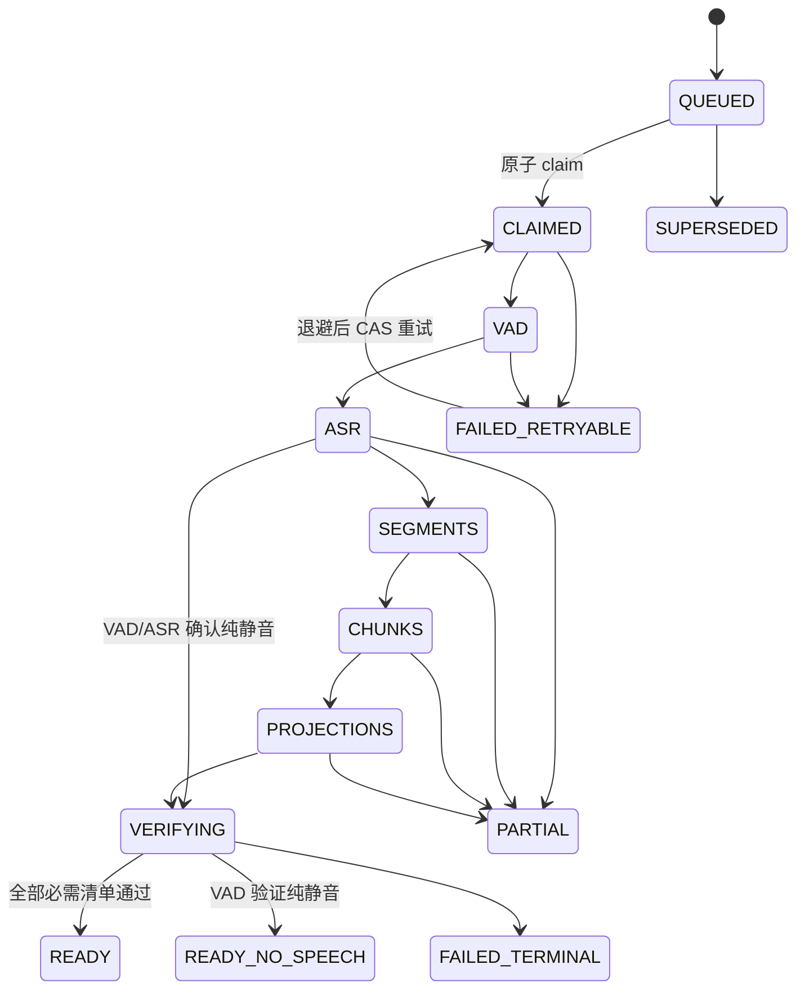
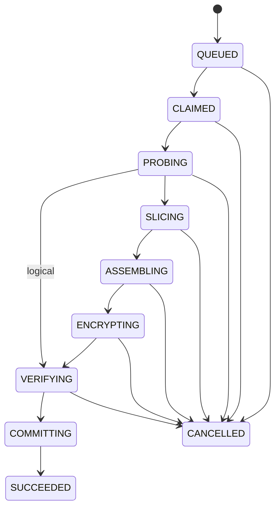

# 音频切分、合并与全链路状态空间

> 审计快照：2026-07-29。本文是实现账本，不是愿景说明。
> 标记约定：**现状**表示当前工作区代码路径；**目标**表示必须达到的最终契约；**已验证**只表示对应自动化测试在本工作区通过；**发布缺口**表示仍不能据此打开生产 feature flag 的事项。局部测试通过不等同于全量 CI、覆盖率、全媒体矩阵或生产灰度已经完成。

## 审计结论

- **现状**：录音 generation、不可变接待时间线、Artifact、持久化 Streaming、Speaker 审核、删除 outbox 与独立无语音状态及其 schema 已分别由 `0029`、`0030`、`0031` 和运行时服务接线；不再属于“只有模型、缺少迁移”的状态。
- **已验证**：原子 claim/旧新 generation 竞速、显式合法跃迁与非法跳转拒绝、七个处理中阶段的过期租约 CAS 回收、FileIndex/GraphML 持久化失败不产生假 projection ack 或假 indexed、Artifact 崩溃窗口与 reconciler、真实 WAV/MP3/AAC 裁剪与样本网格、Streaming durable 链、Speaker 审核前零 canonical 修改、DSAR 提交/外部清理故障、`dialogue-hybrid-v2` 小型金标门禁、前端交互及浏览器真实 WAV 旅程均有专项测试；后端默认全量门禁为 `2995 passed, 4 skipped`，分支感知总覆盖率 `85.81%`，已达到 `85%` 阈值。
- **发布缺口**：可恢复的历史媒体/bootstrap backfill 与 shadow compare、所有格式 × 加密 × 混合参数 × 磁盘/进程故障的笛卡尔媒体矩阵、所有外部投影消费者及 drift 对账、生产分租户灰度观察窗尚未形成完整证据。

## 1. 范围与权威边界

本状态空间覆盖离线上传与索引、接待切片、逻辑时间线、物理音频、Dialogue/Tag/Speaker 派生、WebSocket 实时采集、前端编辑以及删除/回收。核心原则是：

1. MySQL 中的活动指针和不可变 manifest 是发布真值。
2. 原始音频、时间线 revision、处理 generation 都不可原地改写。
3. GraphML、FileIndex、Vector、Cache 是可重建投影，不能反向决定业务状态。
4. 客户端只提交意图、映射 ID、期望版本和幂等键，最终几何必须由服务端计算。
5. 任何“完成”状态都必须能证明其依赖已经持久化；进程内对象、临时文件和 WebSocket 事件都不是完成证明。

### 1.1 名词

| 名词 | 精确定义 |
|---|---|
| `recording_id` | 不可变源录音的业务身份；用于播放、Segment 和证据溯源 |
| `mapping_id` | 一条 `ReceptionRecording` 映射的身份；用于接待内排序、空档和切片计划 |
| `generation` | 同一源录音的一次隔离处理代际 |
| `timeline_revision` | 同一接待的一版不可变几何 |
| `active_*` | 唯一对外可见的、已经验证并原子发布的指针 |
| staging | 尚未获得活动指针的可回收数据；不得被普通读路径看到 |
| projection | 可从同代 source/segment/chunk 重建的数据 |
| durable | 数据库事务已经提交，且事件携带真实持久化 ID；不等同于 ASR “final” |

## 2. 存储真值矩阵

| 数据域 | 目标权威事实 | 当前实现 | 发布/读取规则 | 已验证与缺口 |
|---|---|---|---|---|
| 原始录音 | `Recording` 的 `audio_sha256/size/duration_ms/sample_rate/channels/source_revision` | ORM 与 `0029_audio_consistency_runs` 已完成可空 expand；新注册路径在 DB 预留前探测/hash，并以幂等 run 绑定事实；接待发现不再用 `max(Segment.end_sec)` 代替媒体时长 | 时长只能来自解码/媒体探测；探测失败保持未知并进入 review，不能猜测 | 新上传事实、源变更拒绝、缺时长 review 和尾部静音覆盖已有测试；历史媒体可恢复回填、非空约束与 shadow audit 仍是发布缺口 |
| 离线处理 | `recording_pipeline_runs`，活动指针只指向通过完整性检查的 run | `IndexingService` 已按 generation staging Segment/Chunk/投影，只有 FileIndex checkpoint flush 和 strict GraphML save 成功后才确认对应 outbox，再校验 required/completed 清单并以最新 generation CAS 发布；合法跃迁由单一模型约束，Worker 使用数据库 claim/lease，并可将 `CLAIMED/VAD/ASR/SEGMENTS/CHUNKS/PROJECTIONS/VERIFYING` 任一过期 run 以 CAS 重新 claim 到同一 generation；每次状态、投影和失败写入还校验 `lease_owner + attempt_count` fence，旧 Worker 失租后不能破坏新 claim；`0031` 将纯静音持久化为独立 Recording 状态并修复旧假 indexed 行 | `indexed ⇔ active_run=READY ∧ required_projections ⊆ succeeded_projections`；projection 的 `SUCCEEDED` 必须晚于其 durable checkpoint；`READY_NO_SPEECH` 是可用但非普通 indexed 的独立终态；回收不得新建 generation 或跳过阶段验证 | 成功重试只留一个活动代、双 Worker 只 claim 一次、合法/非法跃迁、七阶段租约回收和旧 Worker fence、FileIndex/GraphML 故障不 ack、纯静音不 indexed、ASR/Embedding 失败不 indexed 已验证；历史 bootstrap/backfill、全 MySQL 竞速/逐提交点宕机矩阵仍缺 |
| Segment | `(recording_id, generation, idx)` 唯一 | ORM 与 `0029` 已加入 generation、pipeline run FK 和新唯一键；离线与 Streaming 写入均携带 generation | 新路径只读取活动 READY/READY_NO_SPEECH generation；流式 confirmed 必须先 INSERT 再发送 durable 事件 | 活动 generation 筛选、流式 durable 写入已有测试；旧 generation `0` 的 bootstrap 审计与全局 cutover 仍待完成 |
| Chunk | `(recording_id, generation, ordinal)` 唯一；规范化 Chunk–Segment 关联 | ORM 与 `0029` 已取消 `content_hash` 实体唯一性并加入 `chunk_segments`；兼容 JSON `segment_ids` 仍保留 | `content_hash` 只能作为缓存键，不能跨录音成为实体身份 | 同事务真实 Segment ID 关联、同代 ordinal 结构已验证；旧 Chunk 回填、双读 shadow compare 和真实 MySQL 跨录音重复文本数据门禁仍缺 |
| 接待时间线 | 不可变 `reception_timeline_revision` + 活动指针 | `AudioTimelinePlanner`、签名 plan、异步 operation、活动指针、revision FK 与整数毫秒列已实现；`0030` 提供 expand/backfill 迁移 | 普通读路径只读 active revision；staging revision 不可见 | Planner、API CAS/幂等以及 `0030` 真实 MySQL 升降级/非法旧几何拒绝已验证；大数据 resumable backfill、shadow compare 与 contract 尚未验证 |
| 接待映射 | 每条映射绑定 timeline revision，并同时保存 `mapping_id`、`recording_id` | 后端 Workspace 返回两个 ID、毫秒坐标、邻接单元、capabilities 与活动 operation；前端 normalize 和交互均消费新字段，旧 `id`/秒字段仍兼容 | 排序/空档请求用 mapping ID；播放/证据用 recording ID | 后端 Workspace 与前端契约/恢复轮询测试已验证；旧字段关闭需等待双读指标 |
| 物理音频 | 不可变 artifact manifest，状态和 timeline revision 绑定 | operation 在构建前落 `PREPARING`，验证后落 `READY`；活动 revision、`ATTACHED`、旧 `RETIRED` 和 operation 成功在一笔事务发布；lifespan 周期 dispatcher 会回收失租任务、捞取 DB 已提交的 `QUEUED` 行，并由 operation CAS 保证多实例只有一个执行；artifact reconciler 可修复指针、回收受限目录内孤儿 | 只有 manifest 完整且源快照复验通过才可 attached；DB 指针权威，旧文件异步回收 | 精确裁剪/gap/源变化/取消/超时、lease 心跳、提交故障、提交后崩溃恢复入口与 reconciler 安全边界已有专项测试；磁盘不足与全媒体 crash 矩阵仍缺 |
| Dialogue | 绑定 timeline revision 和输入 generation，保留独立 `stage_confidence` | 自动切分只读活动 READY/READY_NO_SPEECH 代，保存算法/config/启用信号/输入代际；embedding 失败显式 `rules-only`；人工编辑重建证据与状态链 | 只允许活动 revision 的 current；人工编辑后重建状态链并失效旧 current | 代际 CAS、语义 provenance、规则降级、相邻/跨窗编辑与小型金标门禁已验证；更大规模领域金标与外部投影对账仍缺 |
| Tag Current/Fact | 同租户、同活动 timeline/generation 的可追溯事实 | 时间线/人工编辑路径会失效旧 canonical current 并创建重算意图；DSAR 在数据库事务内删除 Tag/Dialogue/Speaker 等引用并创建 erasure outbox | current 必须存在有效父 Fact，父对象属于同租户且未失效 | DSAR commit 失败不启动外部清理、提交后外部失败可重试和无路径审计回执已验证；悬空 current/跨租户父子全库审计及所有投影清零对账仍缺 |
| Speaker | observation 在审核前独立保存，不改 canonical node/vector/link | 模糊候选以加密 staging payload 进入 `PENDING_REVIEW`；确认用行锁事务更新 node/vector/link，拒绝只关闭 observation；`0030` 已迁移新字段 | 只有 `APPLIED` 事务可创建 canonical 关系；`REJECTED` 无副作用 | 审核前 canonical 不变、确认应用、拒绝无副作用与迁移回填已验证；生产写入当前直接落 `PENDING_REVIEW`，独立持久化 `OBSERVED` 中间态及大规模并发审核仍缺 |
| 流式会话 | tenant-scoped `session_id + epoch`、generation、水位、租约和终态 | 服务端 durable staging 后 ACK；重连递增 epoch 并恢复未消费 PCM；confirmed 同事务写 Segment、Chunk、关联与 outbox；前端维护 256 帧 pending 和 ACK 水位；`0030` 已迁移表/列 | `frame_ack` 表示服务端已持久接管该序号；`segment_confirmed` 只有在 Segment/Chunk/outbox 事务提交后才能标 `durable=true` | 重复/倒序、跨 epoch 撤销、持久重放、真实 WS 路由到 outbox 和 ASR finalize 释放已有测试；消费者到 Tag/Graph 的确认、池耗尽全部出口和生产长时故障矩阵仍缺 |
| WS ticket | 短期、一次性、租户/录音/用户/consent 绑定 | HTTP 发 ticket、行锁单次消费和前端 ticket URL 已实现；`0030` 已创建 ticket 表；长期 JWT query 默认关闭，仅保留显式紧急兼容开关 | 新前端不把长期 JWT 放 URL；兼容开关必须受监控、限时启用 | ticket 绑定/单次消费、默认拒绝长期 JWT 与迁移已验证；生产侧兼容入口调用量归零的观察窗仍缺 |
| 删除 outbox | 不依赖已删除父记录的 tenant-scoped 不可变删除意图 | `0030` 已建 `erasure_outbox`；数据库 canonical 删除、无 PII 审计计数和 outbox 同事务，lease/CAS processor 清理 Graph/FileIndex/cache/audio/artifact，lifespan 周期 drain | DB commit 前不得做外部删除；重复执行必须幂等；失败保留重试状态，不能复活 DB 数据 | commit failure、外部失败重试、Graph save failure、租约 drain 与生命周期接线已有测试；DSAR 全投影零残留扫描及生产 SLA 监控仍缺 |
| 外部投影 | 事务 outbox + generation/revision provenance | `0029` 已加入 projection outbox；离线 pipeline 对 FileIndex 先执行持久 checkpoint flush，对 GraphBuilder 开启 `strict_persistence` 并等待 GraphML save，任一步失败均不确认相应 outbox；流式 confirmed 创建 Vector/Graph/FileIndex/Tag 任务；各历史生产写入与消费者尚未全部统一 | 投影 `SUCCEEDED` 只能位于 durable side effect 之后；FileIndex/GraphML 失败令 run `PARTIAL/FAILED_RETRYABLE`，不得令 recording `indexed` | outbox 创建、必需投影清单、FileIndex flush/GraphML save 故障注入和幂等 confirmed 已验证；统一消费者 lease/replay、Tag/Graph 流式端到端完成确认、lag/drift 和更多逐崩溃点测试仍是发布缺口 |

## 3. 公式化时间线不变量

所有服务端规范几何使用整数毫秒。对第 `i` 个源切片定义：

```text
Sᵢ = [source_start_msᵢ, source_end_msᵢ)
Tᵢ = [timeline_start_msᵢ, timeline_end_msᵢ)
Gᵢ = gap_before_msᵢ
Dᵢ = source_end_msᵢ - source_start_msᵢ
Vᵢ = verified_duration_ms(recordingᵢ)
```

必须同时满足：

```text
0 ≤ source_start_msᵢ < source_end_msᵢ ≤ Vᵢ
sequence_noᵢ = i
G₀ = 0
Gᵢ ≥ 0
timeline_start_ms₀ = 0
timeline_start_msᵢ = timeline_end_msᵢ₋₁ + Gᵢ, i > 0
timeline_end_msᵢ = timeline_start_msᵢ + Dᵢ
|Tᵢ| = |Sᵢ|
total_duration_ms = timeline_end_msₙ₋₁
```

因此逻辑时间线是切片与显式静音空档的串联，不存在隐式洞：

```text
[0, total_duration_ms)
= S₀' ⊕ silence(G₁) ⊕ S₁' ⊕ … ⊕ silence(Gₙ₋₁) ⊕ Sₙ₋₁'
```

标准物理格式固定为 16 kHz、单声道、16-bit PCM WAV。由于 `16_000 / 1_000 = 16`，毫秒网格与样本网格严格同构：

```text
samples(t_ms) = 16 × t_ms
output_samples
= Σᵢ 16 × (source_end_msᵢ - source_start_msᵢ)
 + Σᵢ 16 × gap_before_msᵢ
= 16 × total_duration_ms
```

物理产物验证必须读取解码后样本数，不能只相信 ffmpeg 命令成功或容器 metadata。允许的误差是 `0 sample`；旧秒接口的浮点序列化误差不得进入上述计算。

### 3.1 跨接待区间

对同一 `recording_id` 的任意两个活动映射 `A`、`B`：

```text
interior(A.source_interval) ∩ interior(B.source_interval) = ∅
```

只有同一拆分操作创建的两个互不重叠子区间可同时发布。端点相接合法，内部重叠非法。检测必须在提交活动指针时加锁重验，不能只在预览时检查。

### 3.2 长录音完整覆盖

默认拆分提案必须满足：

```text
sort(intervals)
first.start = 0
last.end = verified_duration_ms
intervalᵢ.end = intervalᵢ₊₁.start
union(intervals) = [0, verified_duration_ms)
```

尾部静音也属于源事实。任何丢弃区间都必须是显式、签名且可审计的人工决策。

### 3.3 跨域 provenance 不变量

对任意普通读路径返回的 current 对象 `x`，必须可沿 FK/manifest 追溯到同租户活动代：

```text
tenant(x) = tenant(parent(x)) = tenant(recording/reception)

current_segment.generation
= recording.active_run.generation

chunk.recording_id = segment.recording_id
∧ chunk.generation = segment.generation
∧ chunk.pipeline_run_id = segment.pipeline_run_id

current_dialogue.timeline_revision_id
= reception.active_timeline_revision_id

current_dialogue_tag.timeline_revision_id
= current_dialogue.timeline_revision_id

published_projection.tenant_id = recording.tenant_id
∧ published_projection.recording_id = recording.id
∧ published_projection.generation = recording.active_run.generation
∧ published_projection.outbox_status = SUCCEEDED

canonical_speaker_link.recording_id = observation.recording_id
∧ canonical_speaker_link.tenant_id = observation.tenant_id
∧ observation.state = APPLIED

attached_artifact.timeline_revision_id
= reception.active_timeline_revision_id
∧ reception.merged_audio_path = attached_artifact.path
```

兼容 generation `0`/NULL revision 只允许在显式 legacy 读开关下出现，且不能与新活动指针混读。`content_hash` 相同不推出 Chunk 相同；只有 `(recording_id, generation, ordinal)` 才定义 Chunk 实体。任何等式不成立都必须 fail closed、计入 drift，并触发重建或 `needs_review`，不能在读取时静默“修正”。

## 4. 状态机

### 4.1 离线 Recording Pipeline（现状模型与目标门禁）



当前合法边由 `pipeline_run_transition_allowed` 集中定义，`IndexingService` 在推进阶段、发布和失败落态前统一校验。Scheduler 的回收边是：

```text
expired(CLAIMED | VAD | ASR | SEGMENTS | CHUNKS |
        PROJECTIONS | VERIFYING)
    --CAS(state + lease expiry)-->
CLAIMED(same run_id, same generation, attempt_count + 1, new lease)
```

因此 Worker 在任一处理中阶段崩溃都不会把 run 永久搁置；并发回收者只有一个能满足 CAS 谓词，legacy queued-run 补建逻辑也会识别该旧 run，不会误建新 generation。重新 claim 表示同代任务从受控入口重跑，仍须逐边通过 VAD、ASR、投影和 VERIFYING 门禁。

非法跃迁包括：跳过 `VERIFYING` 进入 READY；从 `QUEUED` 直跳 ASR/READY；缺 ASR/Embedding 进入 READY；旧 generation READY 后覆盖新活动指针；没有活动 run 却把 `Recording.status` 设为 `indexed`；把 `READY_NO_SPEECH` 展示成普通 indexed。模型级测试枚举允许边并拒绝未声明跳转，服务级参数测试覆盖上述七个阶段的租约过期回收。

发布谓词：

```text
recording.indexed
⇔ active_pipeline_run_id IS NOT NULL
∧ active_run.recording_id = recording.id
∧ active_run.tenant_id = recording.tenant_id
∧ active_run.status = READY
∧ set(active_run.required_projections) ⊆ set(active_run.completed_projections)
∧ ∀ p ∈ active_run.required_projections:
      projection_outbox(run=active_run, type=p).status = SUCCEEDED
```

`READY_NO_SPEECH` 只表达“VAD 已验证为纯静音且该结论可用”，不伪造 ASR、Embedding 或普通 indexed。`PARTIAL/FAILED_*` 均不能成为活动 indexed generation。当前 generation 服务已执行 required/completed 清单、最新 generation 和源指纹校验；历史 bootstrap 代和跨全库双向谓词审计仍属于发布前工作。

Projection outbox 的持久化状态为：

```text
PENDING → PROCESSING → SUCCEEDED
PENDING|PROCESSING → FAILED → PROCESSING
FAILED → DEAD_LETTER   # schema 终态；统一消费者的耗尽策略尚未接线
```

同一 `(tenant, idempotency_key)` 只允许一个任务；只有 `SUCCEEDED` 可进入 run 的 completed 清单。当前离线 pipeline 在 FileIndex checkpoint flush 返回成功、GraphML strict save 返回成功后，才分别确认 `file_index/graph` outbox；任一持久化异常会传播到 run 失败路径，活动指针保持不变。流式链会创建待消费任务；统一的多投影 lease consumer、重放和 drift reconciler 尚未全链路验证。

### 4.2 接待时间线 revision

```text
STAGING → ACTIVE
STAGING → CANCELLED | FAILED
ACTIVE  → SUPERSEDED
```

约束：

- 同一接待最多一个 ACTIVE revision。
- revision 单调递增，`plan_signature` 对规范化 mapping/gap/source snapshot 计算。
- `ACTIVE → STAGING`、修改已 ACTIVE manifest、复活 SUPERSEDED 都非法。
- 409 CAS 冲突保留草稿，但必须重新请求 plan；旧 token 不得跨 reception version 使用。

### 4.3 音频 operation



任意非终态都可因可重试故障回到 `QUEUED`，但必须增加 attempt 并更换租约；终态为 `SUCCEEDED/FAILED/CANCELLED`。进入 `COMMITTING` 后取消只记录请求，不得打断已经开始的原子提交。

模式语义：

| mode | 时间线指针 | 物理 artifact |
|---|---|---|
| `logical` | 发布 plan revision | 不生成 |
| `physical` | 保持当前活动时间线 | 按当前 revision 重建 |
| `both` | 新 revision 与 artifact 同一提交点发布 | 必须已验证 |

### 4.4 Artifact

```text
PREPARING → READY → ATTACHED → RETIRED → DELETED
PREPARING → FAILED
READY → ORPHANED
ATTACHED → ORPHANED   # 仅审计发现指针不一致时
ORPHANED → DELETED
```

`READY` 代表 hash、size、duration、sample rate、channels 已验证；`ATTACHED` 代表活动时间线事务已提交。文件存在本身不允许推导 `ATTACHED`。

### 4.5 流式会话

```text
RESERVING → ACTIVE → DRAINING → COMMITTING → CLOSED
RESERVING|ACTIVE|DRAINING|COMMITTING → INCOMPLETE | FAILED
```

协议不变量：

- `(tenant_id, session_id, epoch)` 唯一；同一次采集始终复用 `session_id`，每条新网络连接由服务端分配递增 epoch，未消费 PCM 以 tenant/session/recording 键跨 epoch 恢复；新采集创建新 `session_id`。
- 帧序号单调；每个正常接收的 binary 帧返回 `frame_ack {seq, duplicate:false}`；重复序号返回同水位 ACK 且不重复送入 VAD/ASR，低于水位的序号拒绝。
- 客户端只在收到 ACK 后清理 pending frame；重连复用 session ID、携带 `resume_from_seq=ack+1` 并按序重放全部未确认帧。服务端必须恢复同一活动会话/epoch 的 VAD/ASR 接收责任，不能把 ACK 过但未 durable 的 PCM 静默丢弃。
- pending buffer 有界为 256 帧；达到上限或收到 `OUT_OF_ORDER_SEQ` 时明确失败并停止麦克风，禁止丢掉最旧帧后假装连续。
- `durable_segment_high_watermark` 只能在 Segment 事务提交后推进。
- 所有 `disconnect/timeout/backpressure/error/finalize` 出口统一 drain，且 `finally` 释放 ASR 池。
- 临时字幕永远不能渲染成“已持久化”；只有 `durable=true + segment_id + generation` 才能。

### 4.6 Speaker observation

```text
OBSERVED → PENDING_REVIEW → APPLIED
PENDING_REVIEW → REJECTED
```

审核前 candidate vector/link 只能存在于 observation staging；`APPLIED` 必须在一笔带行锁事务中创建 canonical node/vector/link 并关闭 observation；`REJECTED` 不得产生 canonical 副作用。当前生产持久化边界直接创建 `PENDING_REVIEW`，`OBSERVED` 是 schema 中保留但尚未作为独立 durable checkpoint 运行的目标中间态。

### 4.7 删除 outbox

```text
PENDING → PROCESSING → SUCCEEDED
PENDING|PROCESSING → FAILED → PROCESSING
FAILED → DEAD_LETTER   # schema 终态；当前 processor 尚未自动推进到此状态
```

数据库 canonical 删除、删除清单、无 PII 审计回执与 `PENDING` 行必须在一笔事务提交。`PROCESSING` 由 lease token 做 CAS；租约丢失的旧 Worker 不得把新 claim 标为完成。外部 GraphML、FileIndex、LLM cache、源音频和接待 artifact 的清理均为幂等操作；失败只推进 `attempts/available_at/last_error`，不能回滚已经提交的 PII 删除。

### 4.8 前端统一几何操作

```text
idle → drafting → previewing → submitting → waiting
waiting → succeeded | conflict | failed
conflict → drafting       # 保留草稿，刷新 revision 后重放
failed → drafting
```

当前前端已实现的保护：

- 自动切分、人工切分/合并、来源几何和音频 operation 全局互斥。
- 新异步接口只在后端 capability 开启时出现；旧服务继续走 `/merge` 兼容层。
- 来源顺序支持鼠标拖放、键盘上下移和非负 gap 编辑。
- 计划请求使用 mapping ID；源播放使用 recording ID。
- 409 刷新服务器数据但保留来源顺序、gap 和编辑原因。

## 5. 事务边界与崩溃窗口

物理发布的唯一安全顺序：

```text
预留业务身份/幂等键
→ 创建 staging revision/operation
→ 探测并冻结 source snapshot(hash,size,revision,duration)
→ DB 提交 PREPARING artifact manifest（唯一 generation 路径）
→ 写 generation 临时文件
→ 解码验证 manifest 与样本数并提交 READY
→ 提交前重验 source snapshot
→ 单笔 DB CAS：活动 revision/文件指针
              + READY→ATTACHED
              + 旧 ATTACHED→RETIRED
              + operation→SUCCEEDED
              + 失效 current + outbox
→ commit
→ reconciler 回收旧 artifact 和孤儿 staging
```

| 故障点 | 不允许出现 | 可接受残留 | 恢复动作 |
|---|---|---|---|
| DB 预留前崩溃 | 无身份文件 | 无 | 客户端以同幂等键重试 |
| 预留后、写文件前 | 覆盖旧密文 | QUEUED/PREPARING 行 | 租约过期后重新 claim |
| ffprobe/ffmpeg 超时 | 子进程泄漏、半文件发布 | FAILED + 临时目录 | kill/wait，删除临时目录 |
| 写完文件、验证前崩溃 | 普通读路径看到新文件 | PREPARING 文件 | reconciler 标 ORPHANED 并删 |
| READY 后、DB commit 前崩溃 | active 指针变化 | READY staging | 超时回收或幂等继续提交 |
| CAS 失败 | 新 artifact 覆盖旧 artifact | 唯一 generation 文件 | 立即清理；失败时 reconciler 兜底 |
| 发布事务提交结果未知 | 指针已提交但 artifact 仍是 PREPARING，或 artifact ATTACHED 但 operation 未成功 | 原子事务只会整体旧态或整体新态；历史/异常 READY 指针 | 以 DB 指针为权威重读；reconciler 只在 manifest 完整、租户/reception/revision 一致且文件 hash 通过时补 ATTACHED |
| FileIndex 内存写入后 checkpoint 失败 | `file_index` outbox 被标成功或 Recording indexed | 未确认 outbox、同代 staging；单个 JSON 只会旧文件或原子替换后的完整新文件，但跨多个 store 不宣称一笔文件事务 | flush 异常传播；run 进入 `PARTIAL/FAILED_RETRYABLE`，未确认 generation 不发布，租约回收后幂等重跑 |
| Graph 内存更新后 GraphML save 失败 | `graph` outbox 被标成功或 Recording indexed | 未确认 outbox、未发布 GraphML 和可丢弃内存状态 | production GraphBuilder 以 strict 模式传播异常；run 失败并重试，不发布活动指针 |
| outbox 提交后 Worker 崩溃 | 投影被视为完成 | 未消费 outbox | 幂等重放 |
| Pipeline 任一处理中阶段崩溃并过租约 | run 永久停在 `CLAIMED/VAD/ASR/SEGMENTS/CHUNKS/PROJECTIONS/VERIFYING`，或为同一输入误建新 generation | 原 run 的同代 staging 与过期 lease | Scheduler 以 `state + lease expiry` CAS 回收到 `CLAIMED`，增加 attempt、换租约并从受控入口重跑；旧 Worker 的后续状态、投影确认和失败写入均因 `owner + attempt` fence 被拒绝 |
| 旧 run 晚完成 | 覆盖新 generation | SUPERSEDED 旧数据 | CAS 拒绝活动指针更新 |
| 两 Worker 同时取任务 | 双重物理发布 | 一个 claim 成功 | `SKIP LOCKED`/条件 UPDATE + lease token |
| WebSocket 断开 | temporary 字幕标 durable | INCOMPLETE 会话 | drain/finalize，保留最后确认水位 |
| 前端麦克风初始化迟到 | draining 后重新采集 | 无 | 连接 epoch 校验并立即 stop 迟到 handle |
| 409 revision 冲突 | 静默覆盖服务器时间线 | 本地草稿 | 刷新、展示新旧 revision、重新 preview |
| DSAR commit 失败 | 一半 PII 被删除、一半 current 仍可读 | 未提交事务、未消费删除 outbox | 全事务回滚；重试同删除 operation |
| DSAR commit 后外部删除失败 | DB 数据复活或把删除回执写入路径/PII | FAILED outbox + 已删除 canonical DB | 退避后 lease/CAS 幂等重放；lifespan reconciler 持续 drain |

## 6. 工况矩阵

| 工况 | 期望几何/状态 | 必测断言 |
|---|---|---|
| 完整 WAV | `[0,V)` | 可直接 Range；样本数等于 `16V_ms` |
| MP3/AAC 有编码延迟 | 以解码后时长为准 | 不信任文件名/Segment 尾点 |
| 前缀裁剪 | `[a,V)` | 输出不含 `[0,a)`，禁止 concat-copy 全源 |
| 后缀裁剪 | `[0,b)` | 输出不含 `[b,V)` |
| 中间裁剪 | `[a,b)` | 接待播放无法读取区间外样本 |
| 多源 + gap | 显式静音 | 输出样本守恒，逻辑播放器播放真实静音 |
| 混合采样率/声道 | 统一 16k mono PCM | 物理产物 deterministic |
| 纯静音 | `READY_NO_SPEECH` | 不创建假 ASR/Embedding，不显示普通 indexed |
| 末尾长静音 | 拆分覆盖到 `V` | 尾部不得被 `max(segment.end)` 截断 |
| 同一签名 split proposal 重放 | 返回同一对子接待 | 不重复创建 mapping/provenance/自动化任务 |
| Segment 重复/乱序 | 批处理排序去重；流式按 epoch/seq 幂等 | 同 confirmed 输入批流输出一致 |
| Segment overlap | 输入拒绝或显式规范化 | 不产生负时长/重复证据 |
| 人工切点穿过 Segment | 原 Segment 不变，两侧证据 `partial` | 两侧坐标裁剪且可回跳 |
| force-split 传递冲突 | 整个 component 禁止 union | `a-b,b-c` 也不能让 `a,c` 同组 |
| 同文本跨录音 | 两个独立 Chunk provenance | 只允许 embedding cache 命中 |
| 重复上传、同幂等键重放 | 返回同一业务身份/run | 不覆盖旧密文；同 key 不同 payload 必须冲突 |
| 双 Worker 同时 claim | 只有一个租约持有者 | pipeline/audio/删除任务均不得执行两次发布 |
| Pipeline 在七个处理中阶段任一失租 | 原 run CAS 回到 `CLAIMED` | 保持 `run_id/generation`，attempt 增加且不得补建新 generation |
| 旧 generation 晚完成 | `SUPERSEDED` | 不覆盖更新的 active generation |
| 必需投影缺失 | `PARTIAL` | active 指针和普通 indexed 均不得发布 |
| FileIndex checkpoint 失败 | `file_index` 保持未确认 | Recording 不 indexed；任何已原子替换的单文件也不能令未确认 generation 对外发布 |
| GraphML save 失败 | `graph` 保持未确认 | strict persistence 传播故障，内存图不得冒充已发布投影 |
| 源文件处理中变化 | 提交前 hash/size/revision 不一致 | operation 失败，旧状态保持 |
| 磁盘不足/空输出 | 不发布 | 临时文件回收，旧 artifact 可用 |
| Artifact 路径越界/符号链接 | 不删除、不附着 | reconciler 只能操作 tenant/reception generation 目录 |
| Artifact READY 后崩溃 | 不凭文件存在发布 | 仅 manifest、活动指针和完整性校验共同允许修复 |
| 过期/篡改播放凭证 | 401/403 | 不泄露租户或源存在性 |
| 部分接待播放 | 服务端裁剪产物 | 即使构造 Range 也无法读区间外 |
| 播放跨 10 分钟窗口 | 自动预取下一窗 | timeline 时间连续，不回到 0 |
| 深链源坐标 | 先换窗再 seek | seek 被 clamp 到合法源区间 |
| 跨窗口相邻 Dialogue | 邻接 metadata 参与选择 | 仍校验相邻 index/version |
| Pointer Capture API 缺失 | 降级拖动 | 无 unhandled error |
| 重复 WS 帧 | ACK 同水位 | 不重复 ASR/Segment，客户端清理到 ACK 水位 |
| 倒序 WS 帧 | 明确拒绝 | 不回退水位，客户端终止错误会话 |
| WS 断线 | 同 session 重新取 ticket | pending 帧按序重放，next seq 不重置 |
| WS pending 达 256 帧 | 明确失败并停采集 | 不静默丢弃任何未确认 PCM |
| ASR 先于 VAD | 暂存文本 | 只有配对真实 VAD 几何后 confirmed |
| ASR 池耗尽/异常退出 | 明确失败 | 所有出口恰好释放一次 |
| 迟到旧 socket 回调 | 忽略 | 不得把新会话改为 failed |
| Dialogue embedding 不可用 | `rules-only` | provenance 不得声明 `semantic_shift` 已启用 |
| Speaker 模糊候选待审核 | `PENDING_REVIEW` | canonical node/vector/link 均保持不变 |
| Speaker 拒绝 | `REJECTED` | canonical 快照与拒绝前完全相同 |
| DSAR 数据库提交失败 | 原数据全部保留 | 不启动 Graph/FileIndex/cache/audio 外部删除 |
| DSAR 外部删除失败 | canonical DB 已删除，outbox FAILED | 同 subject 幂等重试，不在审计中泄露路径 |
| 页面重载时 operation 未终态 | 从 Workspace 恢复 `waiting` | 继续轮询同一 operation，不重复提交 |

## 7. 迁移与回滚

| 阶段 | 写路径 | 读路径 | 门禁 | 回滚 |
|---|---|---|---|---|
| Expand | 新列/表可空；旧列继续写 | 旧读 | Alembic MySQL 升级通过 | downgrade 只删未使用新结构 |
| Backfill/Audit | 管理任务分批探测媒体、建 bootstrap run | 旧读 | 可恢复水位；输出非法、跨租户、悬空、重叠清单 | 停任务，不影响旧读 |
| Dual write | 同事务写旧字段和新 generation/revision | 旧读为主 | 失败计数为零；幂等重放 | 关新写 flag |
| Shadow compare | 新旧读并行，不对外切换 | 旧读 | 几何、current、投影 hash 差异可解释 | 关 shadow |
| Validate | 修复或标记 `needs_review` | 旧读 | NOT NULL/FK/unique/check 验证 | 保留约束为 not enforced 或延后 |
| Cutover | active pointer 新读 | 新读，旧兼容 | drift/orphan/partial/越界稳定 | 切回旧活动指针 |
| Contract | 停旧写，随后删兼容列/路由 | 新读 | 至少一个完整观察窗口 | 只能通过前向迁移恢复 |

媒体探测、hash 计算和大表回填不得放进 Alembic 事务。任何不能自动证明正确的数据进入 `needs_review`，不得用猜测补 active 指针。

当前迁移账本：

1. **现状**：`0029_audio_consistency_runs` 已 expand Recording 源事实、pipeline run、Segment/Chunk generation、规范化关联与 projection outbox。
2. **现状**：`0030_audio_stream_consistency` 已创建 reception timeline/audio operation/artifact、streaming ticket/PCM/receipt、erasure outbox，增加映射毫秒坐标、Dialogue revision/stage confidence、streaming epoch/水位/租约/generation 和 Speaker observation 字段。
3. **现状**：`0031_recording_no_speech` 扩展 `recordings.status` CHECK，将活动 run 为 `READY_NO_SPEECH` 的旧假 indexed 行修复为 `ready_no_speech/indexed_at=NULL`；downgrade 安全映射为 `queued/pending`，不伪装成 indexed。
4. **已验证**：`backend/tests/models/test_alembic_roundtrip.py` 与 `backend/tests/models/test_audio_stream_consistency_migration.py` 覆盖真实 MySQL `0029 → 0030 → 0031/head → downgrade`、旧秒坐标回填、旧 Streaming/Speaker 状态映射、无语音状态修复、非法旧几何前置拒绝和不安全 downgrade 阻断。
5. **发布缺口**：迁移中的 backfill 只处理可确定的结构/坐标/状态，不运行 ffprobe。历史媒体事实、bootstrap run、旧 Chunk–Segment 关联、非法/跨租户/悬空/重叠全量审计仍需可恢复管理任务。
6. **发布缺口**：dual-read/write、shadow compare、约束 validate、active pointer 分租户 cutover 和最终 contract 尚未完成生产观察窗；回滚目前只能依赖保留的旧读和活动指针，不能声称已演练全量数据回切。

## 8. 公共契约与兼容状态

| 契约 | 当前 | 目标 |
|---|---|---|
| 重索引 `202 OperationRef` + `Idempotency-Key` | 已返回 `operation_id/generation/state`，并提供 run 查询的清单、错误和租约字段；同 key 重放有契约测试 | 旧客户端稳定后移除同步完成语义 |
| `POST /receptions/{id}/audio-plans` | 后端按 mapping 加载源事实、签名并返回整数几何/风险/总时长；缺 verified duration 直接拒绝，不能用 mapping/Segment 尾点冒充；前端预览已接入；`0030` 已迁移持久表 | 生产 shadow compare 归零后关闭客户端秒字段兼容 |
| `POST /receptions/{id}/audio-operations` | 幂等 create/query/cancel、数据库 claim/lease/续租、原子发布与 reconciler 已实现；`BackgroundTask` 负责低延迟快速 dispatch，lifespan 周期任务负责进程重启后捞取已提交 `QUEUED` 和回收失租/孤儿 | 若部署要求 API 副本全部离线时仍执行，则把同一 dispatcher 再部署为独立 Worker |
| 旧 `/merge` | 兼容路径仍可用，尚未证明所有旧请求都委托新 operation | 委托新 operation，指标稳定后废弃 |
| Workspace `mapping_id/recording_id/ms/capabilities/neighbors/active_operation` | 后端与前端 normalize 均已实现，页面重载可恢复活动 operation 轮询 | 后端持续作为唯一 capability/permission 来源，旧字段待 contract |
| 部分源播放 | 返回服务端物化裁剪 WAV；Workspace 提供合法区间、时间原点和 `playback_expires_at`，完整源才走原始 Range；完整/206 响应以 `X-Audio-Grant-Expires-At` 回显同一时刻，过期、篡改、跨租户 grant 均拒绝 | 补齐 MP3/AAC/加密源与跨窗口生产 CDN/Range 组合矩阵，并验证前端临近过期时重新获取 Workspace/grant |
| WS `/ws/tickets` | 代码、测试及 `0030` 迁移已实现；长期 JWT query 默认拒绝，仅显式兼容配置可开启 | 兼容调用量归零后删除旧入口 |
| WS ACK/重连 | 前端已实现逐帧 ACK 水位、256 帧 pending、同 session 新 ticket 重连和未确认帧按序重放；服务端先持久化 PCM 再 ACK，并按 session 恢复 staging；表/列已由 `0030` 迁移 | ACK 后服务端承担跨连接恢复责任，倒序为明确终止 |
| WS durable event | 生产 WS 路由已在发送前同事务写 Segment、Chunk、关联和 projection outbox，并返回真实 ID/generation；消费者到 Tag/Graph 的完成确认尚未闭环 | 真实 `segment_id/chunk_id/generation/durable=true` |
| Dialogue segmentation | 新请求默认 `dialogue-hybrid-v2`，保存 config hash、实际信号、能力模式与输入 generation；generation 改变会 CAS 拒绝发布 | 扩展领域金标与线上无回归灰度后再视为生产默认已验证 |

前端不得因为 client 方法存在就展示新功能；只有服务端明确返回 capability 才启用异步 plan/operation 和实时采集。

## 9. 监控与对账

以下是**目标监控契约**，不是“当前全部指标已经上线”的声明。当前可从 pipeline run、operation、artifact、streaming session、Speaker observation、projection/erasure outbox 表进行离线对账；生产指标导出、告警阈值和灰度看板仍需在发布前验证。

至少暴露以下 tenant-scoped 指标，并为 active 指针不一致设置告警：

- `recording_pipeline_run_total{status,stage}`、`recording_partial_active_total`
- `pipeline_claim_conflict_total`、`pipeline_lease_lost_total`
- `active_generation_mismatch_total`
- `outbox_lag_seconds{projection}`、`projection_drift_total{projection}`
- `audio_operation_total{status,mode}`、`audio_operation_duration_seconds`
- `orphan_audio_artifact_total`、`artifact_manifest_mismatch_total`
- `timeline_overlap_rejected_total`、`timeline_geometry_violation_total`
- `playback_out_of_bounds_rejected_total`
- `streaming_sessions_active`、`streaming_incomplete_total`
- `streaming_asr_pool_checked_out`、`streaming_asr_release_error_total`
- `ws_duplicate_frame_total`、`ws_out_of_order_frame_total`
- `speaker_observation_total{state}`
- `frontend_audio_operation_conflict_total`

每日 reconciler 必做：

1. active run 与 Recording indexed 谓词双向核对；
2. active timeline、映射、Dialogue、Tag、Speaker、artifact 的 tenant/revision 一致性；
3. READY/ATTACHED artifact 的 hash、size、duration、样本数抽检；
4. 超租约 staging、未消费 outbox、孤儿文件和过期 ticket 清理；
5. DSAR 删除回执计数与所有投影零残留验证。

## 10. 需求—测试追踪

| 需求 | 自动化证据 | 当前结论 |
|---|---|---|
| 时长只来自媒体事实，不回退到 Segment 尾点 | `backend/tests/api/test_reception_automation.py`、`backend/tests/api/test_receptions.py` | discover 缺时长进入 `duration_review`；split/merge accept 即使存在 Segment 也拒绝缺时长；尾部静音覆盖已验证；历史媒体探测 backfill 待补 |
| 整数毫秒几何、首 gap、越界、重复 source | `backend/tests/core/test_audio_timeline.py` | 已验证 |
| 前/后/中间裁剪、gap、越界、确定性转码 | `backend/tests/core/test_audio_assembler.py` | 已验证 |
| 真实 ffmpeg/ffprobe 的 WAV/MP3/AAC 中间裁剪、gap 与样本网格同构 | `backend/tests/integration/test_real_audio_media_matrix.py` | 三种格式均通过：两段中间裁剪 + `375 ms` gap，输出确定为 16 kHz、单声道、16-bit PCM、`42,000` 样本（总长 `2.625 s`）；不等同于格式 × 加密 × 故障全组合 |
| ffmpeg/ffprobe 失败、取消、超时不覆盖旧文件 | `backend/tests/core/test_audio_assembler.py` | 已验证 |
| 部分接待不能读取完整源及播放凭证有界 | `backend/tests/api/test_receptions.py::TestReceptionAudioStreaming` | WAV 裁剪、合法区间/时间原点、显式过期时刻、完整/206 响应 header、过期/篡改/跨租户拒绝已验证；MP3/AAC/加密 Range 组合矩阵待补 |
| force-split 传递约束、客户身份 component 隔离 | `backend/tests/core/test_reception_merge.py` | 已验证 |
| 客户变化只使用 turn/Segment 证据，不复制 recording customer hash | `backend/tests/api/test_reception_automation.py` | 已验证；无 turn 证据时信号保持 unavailable |
| 重复上传/加密失败不覆盖已发布密文 | `backend/tests/services/test_ingestion_security.py` | generation 临时密文、失败清理和旧密文保持已验证 |
| Pipeline 合法跃迁、非法跳转拒绝、七阶段过期租约回收、失租旧 Worker fence、最新 generation CAS、AI 失败不假 indexed、双 Worker claim | `backend/tests/services/test_pipeline_generation.py`、`backend/tests/models/test_audio_pipeline_generation.py` | 状态模型、服务与七阶段参数矩阵已验证；回收保持同一 run/generation；模拟重分配后旧 attempt 不能修改新 claim；真实 MySQL 逐 commit 故障矩阵与历史 bootstrap 待补 |
| FileIndex/GraphML 只有 durable checkpoint 后才确认 projection | `backend/tests/services/test_pipeline_generation.py::test_file_index_is_not_acknowledged_until_its_checkpoint_is_durable`、`backend/tests/services/test_pipeline_generation.py::test_graph_projection_is_not_acknowledged_when_graphml_publish_fails` | 两个故障注入均验证 outbox 未确认、活动指针为空且 Recording 不 indexed；其余外部投影消费者与逐提交点矩阵待补 |
| 纯静音独立终态、API/前端可见且不伪装 indexed | `backend/tests/services/test_pipeline_generation.py`、`backend/tests/api/test_recordings_happy.py`、`backend/tests/models/test_audio_stream_consistency_migration.py` | 服务、严格状态筛选及真实 MySQL `0031` 升降级已验证 |
| Segment/Chunk generation 与真实关联 | `backend/tests/models/test_audio_pipeline_generation.py`、`backend/tests/services/test_streaming_durability.py` | 新写路径已验证；旧数据回填/shadow compare 待补 |
| `202` 重索引、幂等键与 run 查询 | `backend/tests/api/test_recordings_happy.py` | 已验证 |
| Artifact PREPARING/READY/ATTACHED 原子发布、lease、取消及 reconciler | `backend/tests/services/test_reception_audio_artifacts.py`、`backend/tests/test_main.py` | 关键崩溃窗口、路径约束、提交队列发现和 lifespan 周期恢复已验证；独立 Worker 部署与全媒体故障矩阵待补 |
| plan/operation 整数几何、verified duration fail-closed、CAS、幂等、权限 | `backend/tests/api/test_receptions.py::TestReceptionAudioPlanOperations` | 已验证 |
| Dialogue 只读活动代、semantic provenance、rules-only 和发布前 CAS | `backend/tests/services/test_reception_segmentation_provenance.py` | 已验证 |
| `dialogue-hybrid-v2` 输入校验、边界/阶段规则 | `backend/tests/core/test_dialogue_segmentation.py` | 已验证 |
| `dialogue-hybrid-v2` 金标门禁 | `backend/tests/eval/test_dialogue_segmentation_release.py`、`backend/tests/fixtures/dialogue_segmentation_gold.json` | 4 cases/19 segments 上 boundary F1 与 stage macro-F1 均为 1.0，且两场景不低于 v1；样本规模和生产代表性仍需扩大 |
| Speaker 审核前零 canonical 修改、确认/拒绝状态 | `backend/tests/core/test_speaker_linker_m9_layer2.py`、`backend/tests/api/test_speakers_merge_pending.py` | 已验证；持久化 `OBSERVED` 中间 checkpoint 与大规模并发审核待补 |
| WS 重复/倒序帧与正常帧 ACK | `backend/tests/core/test_m8_stream_session.py` | 已验证 |
| 一次性 ticket、consent/recording 绑定及默认拒绝长期 JWT query | `backend/tests/api/test_m8_ws_stream.py`、`backend/tests/core/test_ws_ticket.py` | 已验证；生产兼容调用量归零待观察 |
| ASR 池所有退出路径释放 | `backend/tests/api/test_m8_ws_stream.py` | finalize 路径已验证；全退出矩阵待补 |
| Pointer Capture 缺失不抛异常 | `frontend/src/components/dialogue/MultiTrackTimeline.drag.test.tsx` | 已验证，无 unhandled error |
| 来源排序、gap、plan、operation、409、权限、跨窗编辑、重载恢复轮询 | `frontend/src/pages/ReceptionWorkspace/index.test.tsx`、`frontend/src/api/services.reception.test.ts` | 已验证 |
| 播放边界、自动换源/换窗、深链定位 | `frontend/src/pages/ReceptionWorkspace/index.test.tsx` | 已验证 |
| ticket URL、16k PCM、ACK 水位、有界 pending、三次重连上限、同 session 重连重放、倒序终止、临时/持久字幕、迟到资源和旧回调 | `frontend/src/pages/ReceptionWorkspace/LiveAudioCapturePanel.test.tsx`、`frontend/src/pages/ReceptionWorkspace/liveCapture.test.ts` | 前端已验证 |
| 正常 WS→durable PCM→Segment→Chunk→关联→outbox | `backend/tests/api/test_m8_ws_stream.py`、`backend/tests/services/test_streaming_durability.py` | SQLite 服务链已验证，`0030` schema 的真实 MySQL 迁移另有验证；WS 服务链在真实 MySQL 运行及 outbox 消费待补 |
| DSAR canonical 删除与删除 outbox 同事务 | `backend/tests/api/test_dsar.py`、`backend/tests/api/test_dsar_gaps.py`、`backend/tests/services/test_reception_erasure.py`、`backend/tests/test_main.py` | commit failure、外部失败重试、Graph/FileIndex/cache/audio/artifact 和周期 drain 已验证；生产零残留/SLA 对账待补 |
| 真实 WS→Segment→Chunk→outbox→Tag/Graph | WS 到 outbox 已证明；outbox 消费、投影确认及 Tag/Graph 对账未证明 | 阻断 durable streaming flag |
| 浏览器音频全旅程 | `frontend/e2e/audio-timeline-operation.spec.ts`、`frontend/worker/index.test.ts` | Worker 生成的合法 PCM WAV 上已验证候选接受、边界播放、plan、异步 physical、切分/合并和审计回跳；真实后端三格式媒体门禁另有证据，但浏览器旅程不替代格式 × 加密 × 故障组合矩阵 |
| Alembic MySQL 升降级与结构回填 | `backend/tests/models/test_alembic_roundtrip.py`、`backend/tests/models/test_audio_stream_consistency_migration.py` | `0029/0030/0031` schema、坐标/状态回填和安全阻断已验证；媒体/bootstrap resumable backfill、shadow compare、constraint contract 待补 |
| 全量后端覆盖率 `≥85%` | 默认全量门禁 `2995 passed, 4 skipped`；`33,686` statements、`4,781` miss，分支感知总覆盖率 `85.81%` | 已验证 |
| ffmpeg 全媒体与磁盘/进程故障矩阵 | WAV/MP3/AAC 真实中间裁剪、gap、样本数已有 3 项集成证据，加密 at-rest/回放另有接待测试，超时/取消等已有单元故障注入；尚未形成格式 × 加密 × 混合参数 × 磁盘/进程故障的笛卡尔矩阵 | 发布缺口 |
| 分租户生产灰度与指标观察窗 | 尚无生产指标证据 | 发布缺口 |

## 11. 发布门禁

只有全部满足才可将对应租户 feature flag 打开：

1. Ruff、mypy、后端全量测试、覆盖率门槛通过。
2. MySQL 真实升降级、bootstrap/backfill 中断续跑和非法数据审计通过。
3. 前端 ESLint、Vitest、TypeScript/Vite build 通过，Vitest 无 unhandled error。
4. Playwright 使用真实音频走完候选/拆分、preview、异步 physical、精确回放、人工编辑和审计回跳。
5. ffmpeg WAV/MP3/AAC/加密/混合采样率/超时/磁盘不足矩阵通过。
6. `indexed` 谓词、active generation、active revision、projection drift 对账为零。
7. 灰度期 outbox lag、orphan artifact、partial run、重复 claim、播放越界和流式资源泄漏稳定在阈值内。

在这些门禁完成前，可以合入已经验证的局部一致性修复，但不得把目标状态写成生产保证。
