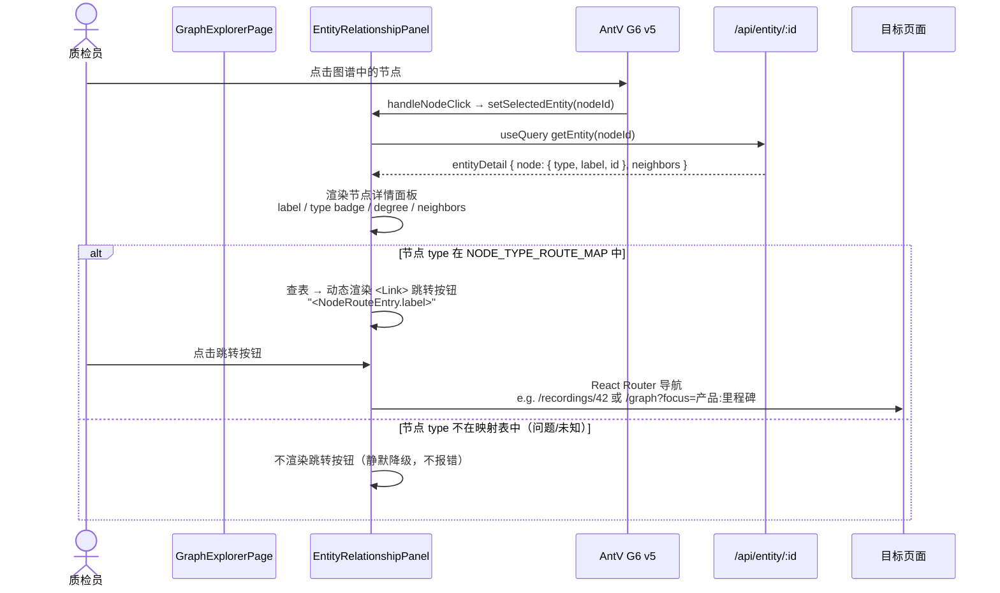
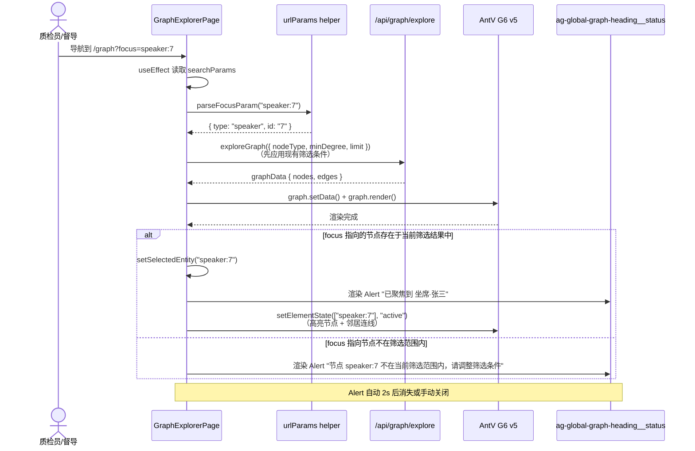
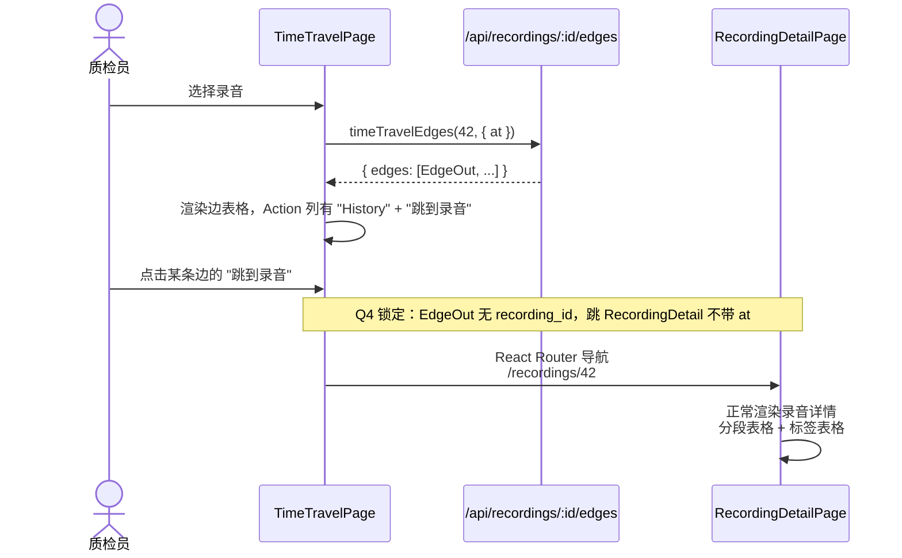
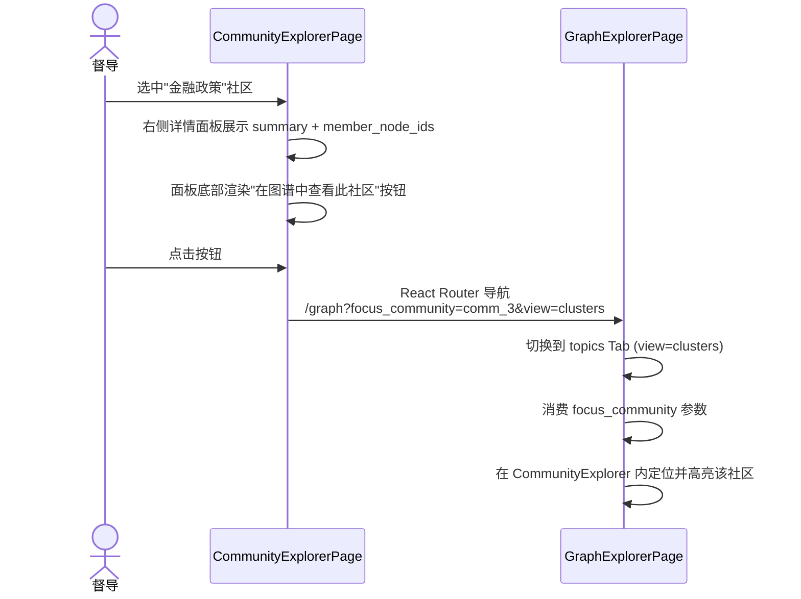
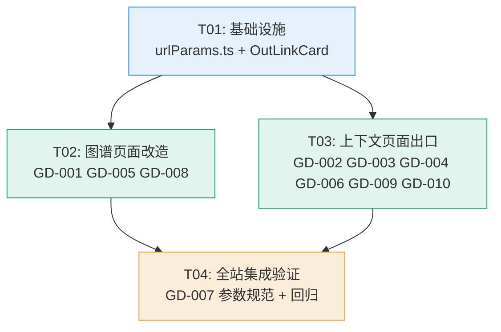

# 系统设计 · 图谱→下钻闭环（Graph Drilldown Closed Loop）

> **版本**：v1.0  
> **基线**：M1-M9 已交付，1892 测试 / 90.98% 覆盖率  
> **定位**：纯前端增量，零后端改动，零新页面，零新依赖

---

## 1. 实现方案 + 框架选型

### 1.1 总体策略

**URL 参数驱动 + 节点 type 路由表 + Tab 入口卡片模式**

```
用户点击图谱节点 → nodeTypeRouteMap 查表得跳转目标 → <Link> 带统一 URL 参数 → 目标页面消费参数执行聚焦/定位
```

三条核心原则：

| 原则 | 说明 |
|------|------|
| **URL 参数驱动** | 所有跨页面跳转通过规范的 5 个 URL 参数（focus/at/from/to/focus_community）传递上下文 |
| **节点 type 路由表** | 硬编码在 `GraphExplorerPage.tsx` 内（P0，不提取为独立模块），8 种 type 映射到 4 类目标页面 |
| **Tab 入口卡片模式** | RecordingDetail 的 4 个新 Tab 不内嵌完整功能，仅渲染说明卡片 + 跳转链接（避免页面复杂度爆炸） |

### 1.2 不引入新依赖

全部使用现有栈：
- **路由**：React Router v6（`useSearchParams` / `useNavigate` / `<Link>`）
- **UI**：@arco-design/web-react（`Tabs.TabPane` / `Button` / `Alert` / `AutoComplete` / `Card` / `Descriptions`）
- **数据**：@tanstack/react-query（`useQuery` 已有 `listRecordings` / `getEntity` / `getSpeaker`）
- **图谱**：AntV G6 v5（不变，仅改事件处理后的导航逻辑）

### 1.3 共享代码识别

| 共享件 | 位置 | 说明 |
|--------|------|------|
| URL 参数解析 helper | `src/utils/urlParams.ts`（**新增**） | parseFocusParam / parseAtParam / buildFocusParam 等，全站统一调用 |
| 入口卡片组件 | `src/components/OutLinkCard.tsx`（**新增**） | RecordingDetail 4 个出口 Tab 复用同一个卡片组件 |
| 节点 type 路由表 | `GraphExplorerPage.tsx` 内部常量 | 硬编码不提取（Q2 锁定决策） |
| 图谱视觉基准 | MEMORY.md §图谱视觉基准 | Alert 提示条、跳转按钮沿用现有 `--ag-*` CSS 变量和玻璃拟态风格 |

---

## 2. 文件列表及相对路径

| 操作 | 文件路径 | 改动摘要 |
|------|---------|---------|
| **新增** | `frontend/src/utils/urlParams.ts` | 5 个 URL 参数解析/构建 helper 函数 |
| **新增** | `frontend/src/components/OutLinkCard.tsx` | 入口卡片组件（图标 + 标题 + 说明 + `<Link>` 按钮） |
| **新增** | `frontend/src/components/OutLinkCard.css` | 入口卡片样式（沿用 `--ag-*` 变量） |
| 修改 | `frontend/src/pages/GraphExplorerPage.tsx` | GD-001: nodeTypeRouteMap + 详情面板"跳到 X"按钮；GD-008: 消费 focus / focus_community URL 参数 |
| 修改 | `frontend/src/pages/graphExplorerPage.css` | 跳转按钮行样式 + focus Alert 样式 |
| 修改 | `frontend/src/pages/TimeTravel/index.tsx` | GD-002: InputNumber → AutoComplete recording picker；GD-003: Action 列增加"跳到录音"链接；GD-009: 消费 recording URL 参数 |
| 修改 | `frontend/src/pages/RecordingDetailPage.tsx` | GD-004: 追加 4 个出口 TabPane；GD-010: 消费 at 参数高亮分段行 |
| 修改 | `frontend/src/pages/CommunityExplorer/index.tsx` | GD-005: 详情面板底部增加"在图谱中查看此社区"按钮 |
| 修改 | `frontend/src/pages/CommunityExplorer/communityExplorer.css` | 社区跳转按钮样式 |
| 修改 | `frontend/src/pages/SpeakerProfile/Detail.tsx` | GD-006: header 区域增加"在图谱中查看此说话人"按钮 |
| 修改 | `frontend/src/pages/GraphExplorerPage.test.tsx` | 新增：节点跳转按钮渲染测试 + focus/focus_community 参数消费测试 |
| 修改 | `frontend/src/pages/CommunityExplorer/index.test.tsx` | 新增：社区跳转按钮渲染测试 |
| 修改 | `frontend/src/pages/SpeakerProfile/Detail.test.tsx` | 新增："在图谱中查看"按钮渲染测试 |

**统计**：新增 3 个文件，修改 10 个文件（含 3 个测试文件），零文件删除。

---

## 3. 数据结构和接口

### 3.1 URL 参数 Helper（`src/utils/urlParams.ts`）

```typescript
/**
 * URL 参数规范统一 helper。
 * 所有跨页面跳转链接必须使用 buildFocusParam 构建；消费页面统一调用 parseFocusParam 解析。
 */

/** 解析 focus 参数 "<type>:<id>" → { type, id } 或 null */
export function parseFocusParam(raw: string | null): { type: string; id: string } | null;

/** 解析 at 参数（毫秒字符串） → number 或 null */
export function parseAtParam(raw: string | null): number | null;

/** 解析 from/to 时间窗参数（毫秒） */
export function parseTimeRangeParams(
  fromRaw: string | null,
  toRaw: string | null,
): { from: number | null; to: number | null };

/** 构建 focus 参数值 "<type>:<id>"，id 做 encodeURIComponent */
export function buildFocusParam(type: string, id: string | number): string;
```

### 3.2 入口卡片组件（`src/components/OutLinkCard.tsx`）

```typescript
export interface OutLinkCardProps {
  /** Arco Design icon component (e.g. <IconBranch />) */
  icon: React.ReactNode;
  /** Card title (e.g. "图谱关系") */
  title: string;
  /** Description text below title */
  description: string;
  /** React Router target path */
  to: string;
  /** Button label (default "查看详情 →") */
  buttonLabel?: string;
}
```

### 3.3 节点 type 路由映射表（`GraphExplorerPage.tsx` 内部常量）

```typescript
interface NodeRouteEntry {
  /** 按钮上显示的文字 */
  label: string;
  /** 根据节点 id 生成跳转路径（含 URL 参数） */
  to: (id: string) => string;
}

const NODE_TYPE_ROUTE_MAP: Record<string, NodeRouteEntry> = {
  '产品': { label: '在图谱中聚焦', to: (id) => `/graph?focus=${buildFocusParam('产品', id)}` },
  '品牌': { label: '在图谱中聚焦', to: (id) => `/graph?focus=${buildFocusParam('品牌', id)}` },
  '竞品': { label: '在图谱中聚焦', to: (id) => `/graph?focus=${buildFocusParam('竞品', id)}` },
  '客户': { label: '查看说话人画像', to: (id) => `/speakers?focus=${buildFocusParam('客户', id)}` },
  '坐席': { label: '查看说话人画像', to: (id) => `/speakers?focus=${buildFocusParam('坐席', id)}` },
  '录音': { label: '查看录音详情',   to: (id) => `/recordings/${encodeURIComponent(id)}` },
  '门店': { label: '查看接待中心',   to: (id) => `/receptions?focus=${buildFocusParam('门店', id)}` },
  // 问题 / 未知 — 无映射，不渲染按钮（静默降级）
};
```

### 3.4 类图

```mermaid
classDiagram
    class urlParams {
        <<utility>>
        +parseFocusParam(raw: string|null) {type, id} | null
        +parseAtParam(raw: string|null) number | null
        +parseTimeRangeParams(from, to) {from, to}
        +buildFocusParam(type, id) string
    }

    class OutLinkCard {
        <<component>>
        +icon: ReactNode
        +title: string
        +description: string
        +to: string
        +buttonLabel?: string
    }

    class NodeRouteEntry {
        <<interface>>
        +label: string
        +to: (id: string) => string
    }

    class GraphExplorerPage {
        -NODE_TYPE_ROUTE_MAP: Record~string, NodeRouteEntry~
        +consumeFocusParam(): void
        +consumeFocusCommunityParam(): void
        +renderJumpButton(type, id): JSX.Element | null
    }

    class TimeTravelPage {
        -recordingId: number
        +recordingPicker: AutoComplete
        +consumeRecordingParam(): void
        +renderJumpToRecordingLink(edge): JSX.Element
    }

    class RecordingDetailPage {
        +renderExportTabs(): TabPane[]
        +consumeAtParam(): void
        +highlightSegmentRow(at: number): void
    }

    class CommunityExplorerPage {
        +renderJumpToGraphButton(): JSX.Element
    }

    class SpeakerProfileDetailPage {
        +renderViewInGraphButton(): JSX.Element
    }

    GraphExplorerPage --> NodeRouteEntry : uses
    GraphExplorerPage --> urlParams : uses
    TimeTravelPage --> urlParams : uses
    RecordingDetailPage --> urlParams : uses
    RecordingDetailPage --> OutLinkCard : renders ×4
```

---

## 4. 程序调用流程

### 4.1 主闭环：GraphExplorer 节点点击 → 目标页面跳转



### 4.2 GraphExplorer 消费 focus / focus_community 参数



### 4.3 TimeTravel 边 → 录音详情跳转



### 4.4 CommunityExplorer → GraphExplorer 社区高亮



---

## 5. 任务列表

| 任务 ID | 描述 | 涉及文件 | 依赖 | 估时 |
|---------|------|---------|------|------|
| T01 | **基础设施层**：URL 参数 helper + 入口卡片组件 | 新增 `src/utils/urlParams.ts`、`src/components/OutLinkCard.tsx`、`src/components/OutLinkCard.css` | 无 | S |
| T02 | **图谱页面改造**（GD-001 + GD-005 + GD-008）：GraphExplorer nodeTypeRouteMap + 跳转按钮 + focus/focus_community 参数消费；CommunityExplorer 社区跳转按钮 | 修改 `src/pages/GraphExplorerPage.tsx`、`src/pages/graphExplorerPage.css`、`src/pages/CommunityExplorer/index.tsx`、`src/pages/CommunityExplorer/communityExplorer.css` | T01 | M |
| T03 | **上下文页面出口改造**（GD-002 + GD-003 + GD-004 + GD-006 + GD-009 + GD-010）：TimeTravel recording picker + 边跳转链接 + recording 参数消费；RecordingDetail 4 个出口 Tab + at 参数消费；SpeakerProfile "在图谱中查看"按钮 | 修改 `src/pages/TimeTravel/index.tsx`、`src/pages/RecordingDetailPage.tsx`、`src/pages/SpeakerProfile/Detail.tsx` | T01 | M |
| T04 | **全站集成与回归验证**（GD-007 参数规范统一 + 测试）：跨页面跳转集成验证、回归测试更新、新增测试用例 | 修改 `src/pages/GraphExplorerPage.test.tsx`、`src/pages/CommunityExplorer/index.test.tsx`、`src/pages/SpeakerProfile/Detail.test.tsx` | T02, T03 | S |

### 任务详情

#### T01：基础设施层

- `src/utils/urlParams.ts`（新增）：实现 `parseFocusParam` / `parseAtParam` / `parseTimeRangeParams` / `buildFocusParam` 四个函数
- `src/components/OutLinkCard.tsx`（新增）：`<OutLinkCard icon={} title={} description={} to={} />` 组件，渲染说明卡片 + `<Link>` 跳转按钮
- `src/components/OutLinkCard.css`（新增）：卡片样式，沿用 `--ag-*` CSS 变量和玻璃拟态风格

#### T02：图谱页面改造

- `GraphExplorerPage.tsx`：
  - 新增 `NODE_TYPE_ROUTE_MAP` 常量（8 种 type 映射）
  - `EntityRelationshipPanel` 详情面板 neighbors 区域下方新增跳转按钮行，按 `entityDetail.node.type` 查表动态渲染 `<Link>`
  - `GraphExplorerPage` 组件 `useEffect` 读取 `focus` / `focus_community` 参数，调用 `parseFocusParam` 解析，设置 `selectedEntity` + 渲染 Alert 提示
  - 与筛选参数共存：先应用筛选 → 渲染完成后读取 focus → 查找节点
- `CommunityExplorer/index.tsx`：`ag-topic-cluster-detail` 底部新增 `<Link to={/graph?focus_community=...}>` 按钮
- `CommunityExplorer/communityExplorer.css`：社区跳转按钮样式
- CSS 文件（`graphExplorerPage.css`）：跳转按钮行样式、focus Alert 样式

#### T03：上下文页面出口改造

- `TimeTravel/index.tsx`：
  - 新增 `useQuery(listRecordings)` 获取录音列表数据
  - `InputNumber` 替换为 Arco `AutoComplete`，options 来自录音列表
  - 边表格 Action 列新增 `<Link to={/recordings/${recordingId}}>` 按钮
  - `useEffect` 消费 `searchParams.get("recording")` 预填 picker
- `RecordingDetailPage.tsx`：
  - 现有 `<Tabs>` 内追加 4 个 `<TabPane>`（图谱关系/说话人/接待/时间演化）
  - 每个 TabPane 渲染 `<OutLinkCard>` 组件 + 对应跳转路径
  - `useEffect` 消费 `searchParams.get("at")` 高亮分段表格对应行
- `SpeakerProfile/Detail.tsx`：header 区域（返回按钮旁）新增 `<Link to={/graph?focus=speaker:${id}}>` 按钮

#### T04：全站集成与回归验证

- 验证所有 P0 跳转链路端到端可通
- 验证 URL 参数格式统一（focus=`<type>:<id>`，at 毫秒）
- 回归测试：确保现有功能不受影响
- 测试文件新增用例覆盖新增按钮渲染和参数消费

---

## 6. 依赖包列表

**无需新增任何依赖。** 全部使用现有栈：

| 使用项 | 已有版本 | 用途 |
|--------|---------|------|
| `react-router-dom` | ^6.x | `<Link>` / `useSearchParams` / `useNavigate` |
| `@arco-design/web-react` | latest | Tabs.TabPane / AutoComplete / Alert / Button / Card |
| `@tanstack/react-query` | latest | `useQuery`（listRecordings 已在 RecordingsPage 使用） |

---

## 7. 共享知识（跨文件约定）

### 7.1 URL 参数解析统一入口

- **所有消费页面**必须通过 `src/utils/urlParams.ts` 的 helper 解析 URL 参数，禁止手写 `searchParams.get("focus")?.split(":")` 等重复逻辑
- **所有跳转链接**必须通过 `buildFocusParam(type, id)` 构建 focus 参数值

### 7.2 节点 type 字符串

- 全小写中文字符（如 `"产品"` `"品牌"`），与后端返回的 `entityDetail.node.type` 一致
- 未映射的 type（`"问题"` `"未知"`）不渲染跳转按钮，静默降级不报错

### 7.3 focus 参数格式

- 格式：`<type>:<id>`（如 `recording:42`、`speaker:7`、`产品:里程碑`）
- id 内允许中文字符，构建时做 `encodeURIComponent`，消费时自动解码
- 解析结果 `{ type, id }` 中 id 已解码

### 7.4 时间参数单位

- `at` / `from` / `to` 统一使用**毫秒**（与 ReceptionWorkspace、TagInsightGraph 一致）
- 存储为 `number`，URL 上为数字字符串

### 7.5 Tab 入口卡片

- RecordingDetail 的 4 个出口 Tab 统一使用 `<OutLinkCard>` 组件
- 不在 Tab 内嵌完整功能（图谱/说话人/接待页面），仅入口跳转

### 7.6 跳转按钮样式

- 参考 TagInsightGraph 证据 Link 样式：Arco `Button type="text"` + 蓝色文字 + `<Link>` 包裹
- 按钮行在实体详情面板 neighbors 区域下方，类名 `ag-entity-detail-actions`

### 7.7 图谱视觉基准

- 所有新增 UI（Alert 提示条、跳转按钮、入口卡片）沿用 MEMORY.md §图谱视觉基准：
  - `--ag-primary` / `--ag-border` / `--ag-radius` / `--ag-text` / `--ag-text-muted` / `--ag-shadow`
  - Alert 使用 `type="info"` 蓝色主题
  - 卡片使用玻璃拟态浮层样式

---

## 8. 待明确事项

| # | 事项 | 当前处理 | 风险 |
|---|------|---------|------|
| 1 | CommunityExplorer `focus_community` 参数在 `view=clusters` 模式下的具体高亮行为 | 将 `focus_community` 传递给 `CommunityExplorerPage`，由其内部 `setSelectedClusterKey` + 滚动定位 | 低——CommunityExplorer 已有 `selectedClusterKey` 状态 |
| 2 | RecordingDetail `at` 参数消费时，`recordingId` 来自 `useParams`，与 at 定位的时间戳如何关联到分段行 | `at` 毫秒 / 1000 → 秒数，匹配 `segments[].start_sec <= atSec <= end_sec`，高亮匹配行 | 低——分段数据已有 start_sec/end_sec |
| 3 | 跳转到 `/speakers?focus=recording:{id}` 后 /speakers 列表页如何消费 focus 参数 | 本次不实现消费（超出 P0 范围），仅保留参数在 URL 上供未来使用。P0 范围聚焦图谱页面闭环。 | 中——用户点击后跳转到说话人列表但无自动筛选。如需改善可作为 P2 补充。 |
| 4 | `TimeTravel` 的 `AutoComplete` 录音搜索体验 | 用户输入录音 ID 数字即可匹配；选项格式 `"#42 · 门店001 · 张三 · indexed"`。使用 Arco `AutoComplete` 的 `filterOption` 做本地匹配。 | 低 |

---

## 9. 全局一致性审查

- [x] 覆盖所有 8 个 P0：GD-001 ✓ / GD-002 ✓ / GD-003 ✓ / GD-004 ✓ / GD-005 ✓ / GD-006 ✓ / GD-007 ✓ / GD-008 ✓
- [x] 覆盖 2 个 P1：GD-009 ✓ / GD-010 ✓（内嵌在 T03 中）
- [x] 任务依赖完整：T01 → T02/T03 → T04
- [x] 跨文件约定显式说明：§7 共 7 条
- [x] 遵守零新依赖：§6 确认
- [x] 遵守零新页面：所有改动在现有 5 个页面内
- [x] 遵守零后端改动：纯前端 URL 参数
- [x] 引用锁定决策：Q1-Q4 全部按锁定方案实现
- [x] 最小变更原则：13 个文件（3 新增 + 10 修改，零删除）

### 关键路径图



---

## 10. 需求覆盖矩阵

| 需求 ID | 实现任务 | 实现方式 |
|---------|---------|---------|
| GD-001 | T02 | `EntityRelationshipPanel` 内 nodeTypeRouteMap + `<Link>` 按钮 |
| GD-002 | T03 | TimeTravel `InputNumber` → `AutoComplete` + `listRecordings` |
| GD-003 | T03 | Edge 表格 Action 列追加 `<Link to=/recordings/:id>` |
| GD-004 | T03 | `RecordingDetailPage` `<Tabs>` 追加 4 个 `<TabPane>` + `<OutLinkCard>` |
| GD-005 | T02 | `CommunityExplorer` 详情面板追加 `<Link to=/graph?focus_community=...>` |
| GD-006 | T03 | `SpeakerProfile/Detail` header 追加 `<Link to=/graph?focus=speaker:...>` |
| GD-007 | T01+T04 | `urlParams.ts` helper + 全站统一调用 |
| GD-008 | T02 | `GraphExplorerPage` useEffect 消费 focus/focus_community + Alert |
| GD-009 | T03 | `TimeTravel` useEffect 消费 recording → 预填 picker |
| GD-010 | T03 | `RecordingDetailPage` useEffect 消费 at → 高亮分段行 |
