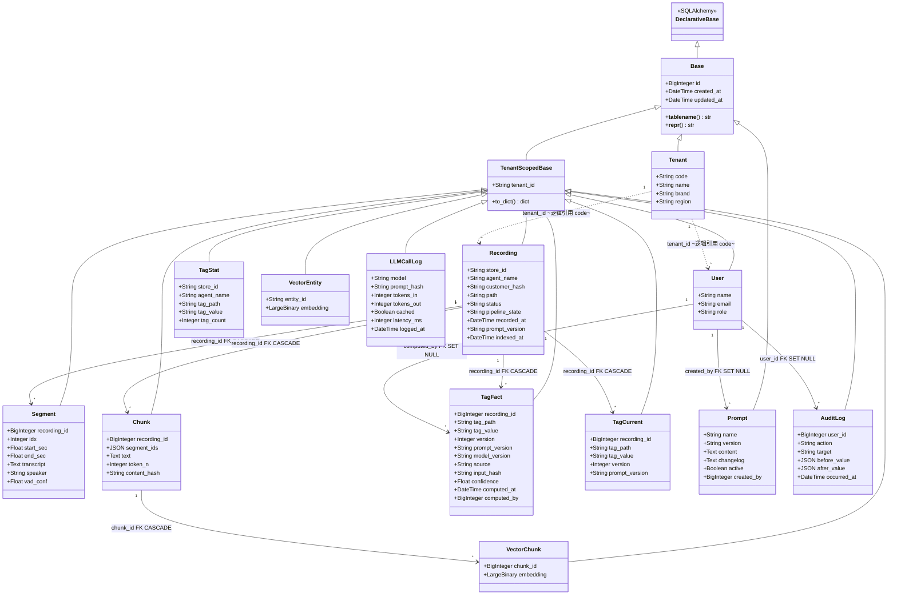
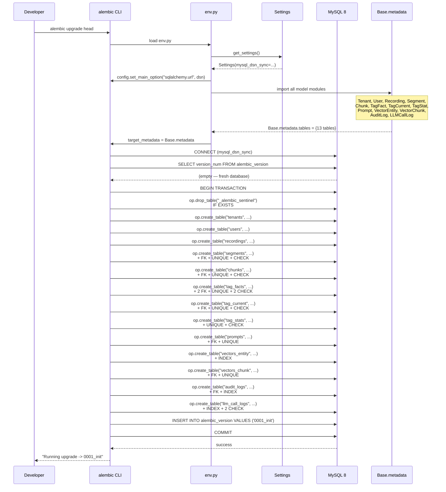
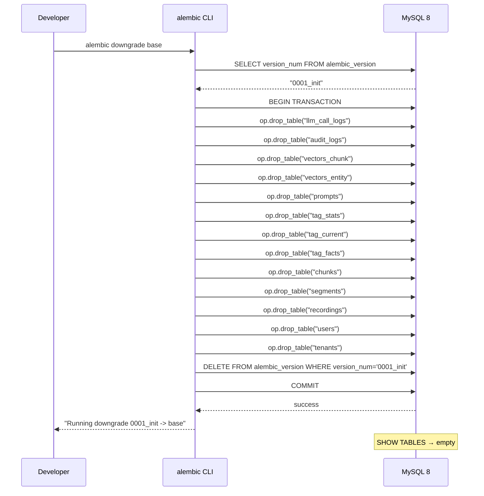
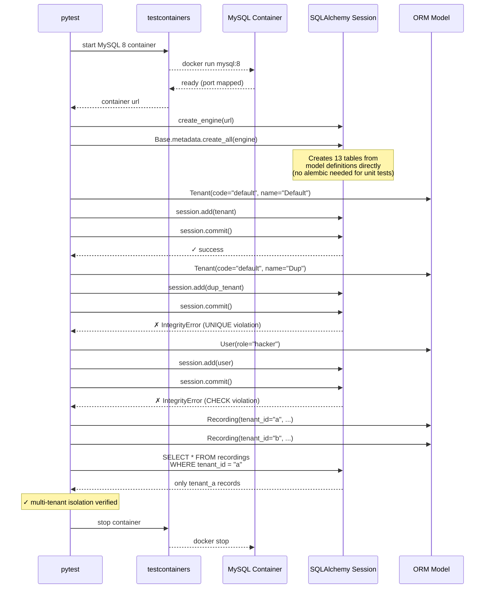
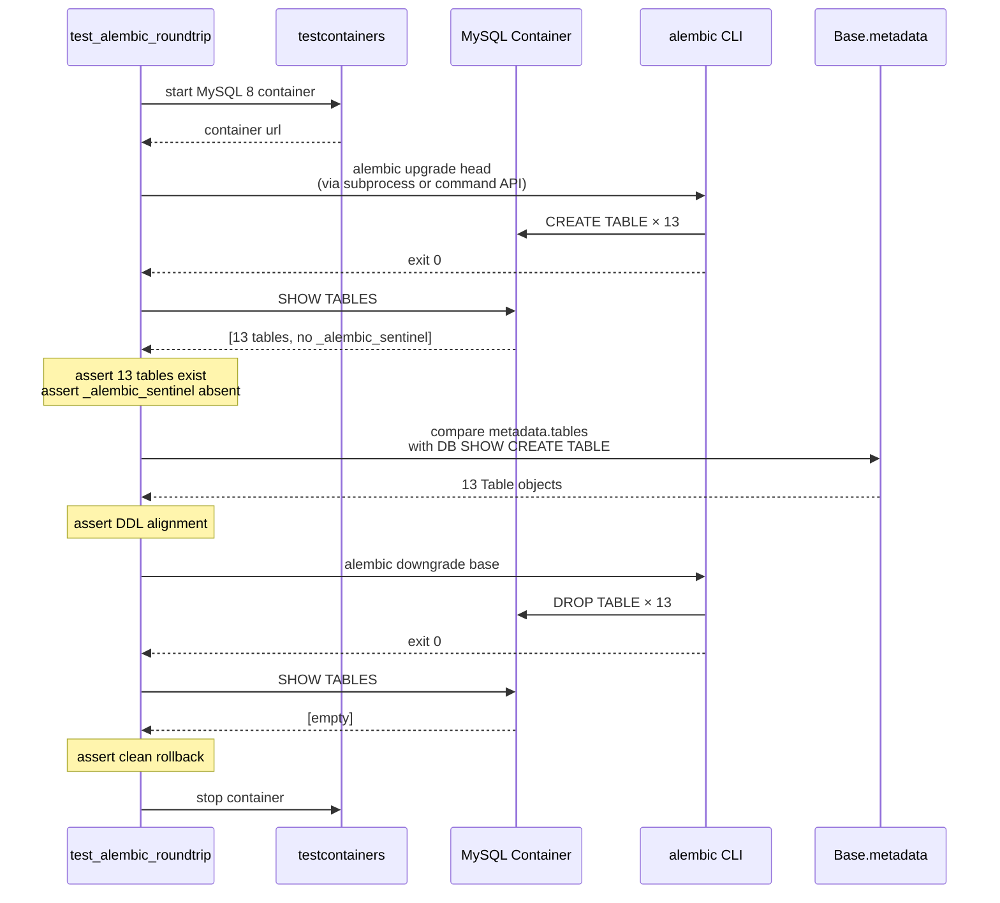
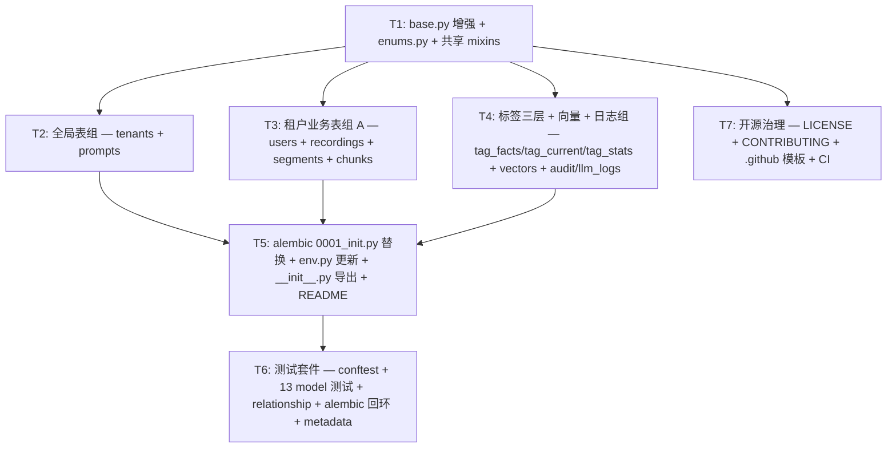

# AudioGraphy M1.4 架构设计文档 — System Design & Task Decomposition

> **里程碑**: M1.4 · SQLAlchemy 全量 ORM Models + Alembic Migration
> **架构师**: 高见远 (Gao) · Architect
> **日期**: 2026-07-22
> **输入**: `docs/m1.4-prd.md`（772 行 PRD · 13 张表完整规格）
> **状态**: Final — 待工程师实现

---

## 目录

1. [实现方案与框架选型](#1-实现方案与框架选型)
2. [文件列表及路径](#2-文件列表及路径)
3. [数据结构与接口（类图）](#3-数据结构与接口类图)
4. [程序调用流程（时序图）](#4-程序调用流程时序图)
5. [任务列表](#5-任务列表)
6. [依赖包列表](#6-依赖包列表)
7. [共享知识（跨文件约定）](#7-共享知识跨文件约定)
8. [待明确事项](#8-待明确事项)

---

## 1. 实现方案与框架选型

### 1.1 核心技术挑战

| # | 挑战 | 解决方案 |
|---|------|----------|
| C1 | 13 张表的 ORM model 统一管理 + 继承复用 | `Base → TenantScopedBase` 继承树（已有），11 个业务表继承 TSB，2 个全局表继承 Base |
| C2 | 枚举列的类型安全 + 迁移友好 | `String(N)` + `CheckConstraint`（非 SQL ENUM），配合 Python `enum.Enum` 做应用层校验 |
| C3 | MySQL 8 JSON 列（chunks.segment_ids, audit_logs.before/after_value） | `sqlalchemy.JSON`，MySQL 8 原生支持 JSON 类型 |
| C4 | 向量 BLOB 列（vectors_*.embedding） | `sqlalchemy.LargeBinary`，应用层负责 numpy ↔ bytes 序列化 |
| C5 | 多租户行级隔离在数据层可验证 | 所有业务表继承 TSB（含 4 张反范式加 tenant_id 的表），测试覆盖跨租户隔离 |
| C6 | tag_current / tag_stats 非物化视图 | M1.4 实现为**普通表**，应用层 upsert/refresh（P0），P2 可改 SQL VIEW |
| C7 | Alembic 0001_init.py 从哨兵到真实 schema 的原地替换 | 删除 `_alembic_sentinel` 表，写入 13 张表的 `op.create_table()` + 约束 + 索引 |
| C8 | tag_facts append-only 语义 | 数据层无特殊约束（updated_at 列存在但不更新），由应用层保证仅 INSERT；测试验证不可更新语义 |
| C9 | prompts 唯一活跃版本约束 | MySQL 8 不支持部分唯一索引 → 应用层保证（activate 时先 deactivate 旧版本）；P2 可用生成列 trick |
| C10 | 开源就绪：docstring / 类型注解 / LICENSE / CONTRIBUTING | 所有 model 文件模块级 + 类级 docstring，mypy strict 100% 覆盖，MIT LICENSE |

### 1.2 框架与库选型

| 组件 | 选型 | 版本 | 理由 |
|------|------|------|------|
| ORM 框架 | SQLAlchemy 2.0 | `>=2.0.36` | 项目已用，`Mapped` / `mapped_column` 声明式风格，类型安全 |
| 迁移工具 | Alembic | `>=1.14.0` | 项目已用，`op.create_table()` 生成 DDL |
| 数据库 | MySQL 8 | docker-compose | 项目已用，JSON / CHECK / 索引全支持 |
| Python | 3.13 | `requires-python >= 3.13` | 项目已定 |
| 测试 DB | testcontainers MySQL | `>=4.8.0` | dev 依赖已有，无需外部 DB |
| 枚举类型 | `enum.Enum` + `String + CheckConstraint` | — | 避免 SQL ENUM 的 ALTER 迁移痛点 |
| JSON 列 | `sqlalchemy.JSON` | — | MySQL 8 原生 JSON 类型 |
| BLOB 列 | `sqlalchemy.LargeBinary` | — | MySQL BLOB，应用层 numpy 序列化 |
| 代码风格 | ruff + black + mypy strict | pyproject.toml 已配 | — |

### 1.3 架构模式

```
DeclarativeBase
  └── Base (id, created_at, updated_at, __tablename__ auto CamelCase→snake_case)
        ├── TenantScopedBase (+ tenant_id, to_dict())
        │     └── 11 个业务表 (users, recordings, segments, chunks, tag_facts,
        │                       tag_current, tag_stats, vectors_entity,
        │                       vectors_chunk, audit_logs, llm_call_logs)
        ├── tenants (全局，无 tenant_id)
        └── prompts (全局，无 tenant_id)
```

**ORM 声明风格**：SQLAlchemy 2.0 `Mapped[Type]` + `mapped_column(...)` 类型注解驱动，mypy strict 兼容。

**枚举实现策略**（String + CheckConstraint）：

```python
# models/enums.py — Python enum 做应用层 type-safe
class UserRole(enum.Enum):
    ADMIN = "admin"
    INSPECTOR = "inspector"
    AGENT = "agent"
    VIEWER = "viewer"

# models/users.py — DB 层 String + CHECK
role: Mapped[str] = mapped_column(String(32), nullable=False, default="viewer")
__table_args__ = (
    CheckConstraint(
        "role IN ('admin', 'inspector', 'agent', 'viewer')",
        name="ck_users_role",
    ),
)
```

> **理由**：SQL ENUM 修改需要 `ALTER TABLE ... MODIFY COLUMN`，在 MySQL 中需全表锁；String + CHECK 只需修改 CHECK 约束，迁移成本低。Python `enum.Enum` 提供应用层 type-safe，IDE 补全友好。

### 1.4 关键设计决策（主理人已确认）

| 决策 | 内容 | 理由 |
|------|------|------|
| Q1 ✅ | tenants 新增 `code: String(64), UNIQUE, NOT NULL` | tenant_id 为 String(64)，用业务可读标识逻辑引用，不建物理 FK |
| Q2 ✅ | segments/chunks/tag_facts/tag_current 继承 TenantScopedBase | §14.2 要求所有业务表带 tenant_id，中间件强制 WHERE 不需 JOIN |
| Q3 ✅ | 枚举值按 PRD 推断 | status/pipeline_state/source 值确认采纳 |
| Q4 ✅ | 保留字重命名 | after→after_value, count→tag_count, at→occurred_at/logged_at, latency→latency_ms |
| Q5 ✅ | computed_by = BigInteger nullable FK users.id | LLM 时 NULL，manual 时操作人 user_id |
| Q6 ✅ | tag_current 普通表 | 应用层 upsert/refresh |
| Q7 ✅ | prompts active 应用层保证 | MySQL 无部分唯一索引 |
| Q8 ✅ | store_id = String(64) | 门店业务代码 |
| Q9 ✅ | 0001_init.py 原地替换 | M1 阶段无生产数据 |
| Q10 ✅ | vectors_chunk UNIQUE(tenant_id, chunk_id), vectors_entity INDEX(tenant_id, entity_id) | — |

---

## 2. 文件列表及路径

### 2.1 Model 文件（13 个 model + 枚举 + __init__ + README）

| # | 文件路径 | 操作 | 说明 |
|---|---------|------|------|
| 1 | `backend/audio_graphy/models/base.py` | **修改** | 补充 `to_dict()` 到 Base（当前只在 TSB），增强 docstring |
| 2 | `backend/audio_graphy/models/enums.py` | **新建** | Python `enum.Enum`：UserRole, RecordingStatus, PipelineState, TagSource |
| 3 | `backend/audio_graphy/models/tenant.py` | **新建** | `Tenant` model（继承 Base） |
| 4 | `backend/audio_graphy/models/user.py` | **新建** | `User` model（继承 TSB） |
| 5 | `backend/audio_graphy/models/recording.py` | **新建** | `Recording` model（继承 TSB） |
| 6 | `backend/audio_graphy/models/segment.py` | **新建** | `Segment` model（继承 TSB，反范式 tenant_id） |
| 7 | `backend/audio_graphy/models/chunk.py` | **新建** | `Chunk` model（继承 TSB，反范式 tenant_id，JSON segment_ids） |
| 8 | `backend/audio_graphy/models/tag_fact.py` | **新建** | `TagFact` model（继承 TSB，append-only，反范式 tenant_id） |
| 9 | `backend/audio_graphy/models/tag_current.py` | **新建** | `TagCurrent` model（继承 TSB，反范式 tenant_id） |
| 10 | `backend/audio_graphy/models/tag_stat.py` | **新建** | `TagStat` model（继承 TSB） |
| 11 | `backend/audio_graphy/models/prompt.py` | **新建** | `Prompt` model（继承 Base，全局资源） |
| 12 | `backend/audio_graphy/models/vector_entity.py` | **新建** | `VectorEntity` model（继承 TSB，LargeBinary embedding） |
| 13 | `backend/audio_graphy/models/vector_chunk.py` | **新建** | `VectorChunk` model（继承 TSB，LargeBinary embedding） |
| 14 | `backend/audio_graphy/models/audit_log.py` | **新建** | `AuditLog` model（继承 TSB，JSON before/after_value） |
| 15 | `backend/audio_graphy/models/llm_call_log.py` | **新建** | `LLMCallLog` model（继承 TSB） |
| 16 | `backend/audio_graphy/models/__init__.py` | **修改** | 导出全部 13 个 model class + Base + TenantScopedBase + enums |
| 17 | `backend/audio_graphy/models/README.md` | **新建** | models 包说明文档（开源就绪） |

### 2.2 Alembic 迁移

| # | 文件路径 | 操作 | 说明 |
|---|---------|------|------|
| 18 | `backend/alembic/versions/0001_init.py` | **替换** | 删除哨兵表，写入 13 张表的 `op.create_table()` + 约束 + 索引 |
| 19 | `backend/alembic/env.py` | **修改** | 添加全部 model 模块的显式 import（确保 metadata 注册） |

### 2.3 测试文件

| # | 文件路径 | 操作 | 说明 |
|---|---------|------|------|
| 20 | `backend/tests/models/__init__.py` | **新建** | 测试包初始化 |
| 21 | `backend/tests/models/conftest.py` | **新建** | testcontainers MySQL engine fixture，db_session fixture |
| 22 | `backend/tests/models/test_tenant.py` | **新建** | tenants CRUD + UNIQUE(code) 约束 |
| 23 | `backend/tests/models/test_user.py` | **新建** | users CRUD + CHECK(role) + UNIQUE(tenant_id, email) + 多租户隔离 |
| 24 | `backend/tests/models/test_recording.py` | **新建** | recordings CRUD + CHECK(status/pipeline_state) + 多租户隔离 |
| 25 | `backend/tests/models/test_segment.py` | **新建** | segments CRUD + FK(recordings) + UNIQUE(recording_id, idx) + CHECK(end>start) + 多租户 |
| 26 | `backend/tests/models/test_chunk.py` | **新建** | chunks CRUD + JSON(segment_ids) + UNIQUE(tenant_id, content_hash) + FK + 多租户 |
| 27 | `backend/tests/models/test_tag_fact.py` | **新建** | tag_facts CRUD + FK + CHECK(source) + UNIQUE(recording_id, tag_path, version) + append-only + 多租户 |
| 28 | `backend/tests/models/test_tag_current.py` | **新建** | tag_current CRUD + FK + UNIQUE(recording_id, tag_path) + 多租户 |
| 29 | `backend/tests/models/test_tag_stat.py` | **新建** | tag_stats CRUD + UNIQUE(dim) + CHECK(tag_count>=0) + 多租户 |
| 30 | `backend/tests/models/test_prompt.py` | **新建** | prompts CRUD + UNIQUE(name, version) + FK(users) |
| 31 | `backend/tests/models/test_vector_entity.py` | **新建** | vectors_entity CRUD + LargeBinary embedding 读写 + INDEX(tenant_id, entity_id) + 多租户 |
| 32 | `backend/tests/models/test_vector_chunk.py` | **新建** | vectors_chunk CRUD + LargeBinary + UNIQUE(tenant_id, chunk_id) + FK(chunks) + 多租户 |
| 33 | `backend/tests/models/test_audit_log.py` | **新建** | audit_logs CRUD + JSON(before/after_value) + FK(users) + 多租户 |
| 34 | `backend/tests/models/test_llm_call_log.py` | **新建** | llm_call_logs CRUD + CHECK(tokens/latency) + 多租户 |
| 35 | `backend/tests/models/test_relationships.py` | **新建** | ORM relationship 测试（recording.segments, segment.recording 等） |
| 36 | `backend/tests/models/test_alembic_roundtrip.py` | **新建** | alembic upgrade head → downgrade base 回环测试 |
| 37 | `backend/tests/models/test_metadata.py` | **新建** | Base.metadata.tables 包含 13 张表 + __init__ 导出测试 |

### 2.4 开源治理文件

| # | 文件路径 | 操作 | 说明 |
|---|---------|------|------|
| 38 | `LICENSE` | **新建** | MIT License 全文（项目根） |
| 39 | `CONTRIBUTING.md` | **新建** | 贡献指南（开发环境、测试命令、代码风格、PR 流程） |
| 40 | `.github/ISSUE_TEMPLATE/bug_report.md` | **新建** | Bug 报告模板 |
| 41 | `.github/ISSUE_TEMPLATE/feature_request.md` | **新建** | Feature 请求模板 |
| 42 | `.github/PULL_REQUEST_TEMPLATE.md` | **新建** | PR 模板 |
| 43 | `.github/workflows/ci.yml` | **新建** | GitHub Actions CI（ruff + mypy + pytest + coverage） |

---

## 3. 数据结构与接口（类图）

### 3.1 继承关系总览



### 3.2 约束与索引汇总

> 完整索引清单见 PRD §附录 C。以下为**非 TSB 自动生成**的关键约束/索引。

| 表 | 约束名 | 类型 | 定义 |
|---|--------|------|------|
| tenants | `ux_tenants_code` | UNIQUE | `code` |
| users | `ux_users_tenant_email` | UNIQUE | `(tenant_id, email)` |
| users | `ck_users_role` | CHECK | `role IN ('admin','inspector','agent','viewer')` |
| recordings | `ix_recordings_tenant_store` | INDEX | `(tenant_id, store_id)` |
| recordings | `ix_recordings_tenant_status` | INDEX | `(tenant_id, status)` |
| recordings | `ix_recordings_recorded_at` | INDEX | `recorded_at` |
| recordings | `ix_recordings_prompt_version` | INDEX | `prompt_version` |
| recordings | `ck_recordings_status` | CHECK | `status IN ('queued','processing','indexed','failed','archived')` |
| recordings | `ck_recordings_pipeline_state` | CHECK | `pipeline_state IN ('pending','vad','asr','chunking','embedding','extraction','graph_merge','tagging','done','error')` |
| segments | `ux_segments_recording_idx` | UNIQUE | `(recording_id, idx)` |
| segments | `fk_segments_recording_id` | FK | `recording_id → recordings.id ON DELETE CASCADE` |
| segments | `ck_segments_time_order` | CHECK | `end_sec > start_sec` |
| chunks | `ux_chunks_content_hash` | UNIQUE | `(tenant_id, content_hash)` |
| chunks | `fk_chunks_recording_id` | FK | `recording_id → recordings.id ON DELETE CASCADE` |
| chunks | `ck_chunks_token_n` | CHECK | `token_n > 0` |
| tag_facts | `ux_tag_facts_recording_path_version` | UNIQUE | `(recording_id, tag_path, version)` |
| tag_facts | `ix_tag_facts_recording_path` | INDEX | `(recording_id, tag_path)` |
| tag_facts | `ix_tag_facts_prompt_version` | INDEX | `prompt_version` |
| tag_facts | `fk_tag_facts_recording_id` | FK | `recording_id → recordings.id ON DELETE CASCADE` |
| tag_facts | `fk_tag_facts_computed_by` | FK | `computed_by → users.id ON DELETE SET NULL` |
| tag_facts | `ck_tag_facts_source` | CHECK | `source IN ('llm','manual')` |
| tag_facts | `ck_tag_facts_version` | CHECK | `version > 0` |
| tag_current | `ux_tag_current_recording_path` | UNIQUE | `(recording_id, tag_path)` |
| tag_current | `fk_tag_current_recording_id` | FK | `recording_id → recordings.id ON DELETE CASCADE` |
| tag_current | `ck_tag_current_version` | CHECK | `version > 0` |
| tag_stats | `ux_tag_stats_dim` | UNIQUE | `(tenant_id, store_id, agent_name, tag_path, tag_value)` |
| tag_stats | `ix_tag_stats_tenant_store` | INDEX | `(tenant_id, store_id)` |
| tag_stats | `ck_tag_stats_count` | CHECK | `tag_count >= 0` |
| prompts | `ux_prompts_name_version` | UNIQUE | `(name, version)` |
| prompts | `ix_prompts_active` | INDEX | `active` |
| prompts | `fk_prompts_created_by` | FK | `created_by → users.id ON DELETE SET NULL` |
| vectors_entity | `ix_vectors_entity_entity_id` | INDEX | `(tenant_id, entity_id)` |
| vectors_chunk | `ux_vectors_chunk_chunk_id` | UNIQUE | `(tenant_id, chunk_id)` |
| vectors_chunk | `ix_vectors_chunk_chunk_id` | INDEX | `chunk_id` |
| vectors_chunk | `fk_vectors_chunk_chunk_id` | FK | `chunk_id → chunks.id ON DELETE CASCADE` |
| audit_logs | `ix_audit_logs_tenant_user` | INDEX | `(tenant_id, user_id)` |
| audit_logs | `ix_audit_logs_occurred_at` | INDEX | `occurred_at` |
| audit_logs | `fk_audit_logs_user_id` | FK | `user_id → users.id ON DELETE SET NULL` |
| llm_call_logs | `ix_llm_call_logs_tenant_model` | INDEX | `(tenant_id, model)` |
| llm_call_logs | `ix_llm_call_logs_logged_at` | INDEX | `logged_at` |
| llm_call_logs | `ix_llm_call_logs_prompt_hash` | INDEX | `prompt_hash` |
| llm_call_logs | `ck_llm_call_logs_tokens` | CHECK | `tokens_in >= 0 AND tokens_out >= 0` |
| llm_call_logs | `ck_llm_call_logs_latency` | CHECK | `latency_ms >= 0` |

### 3.3 物理外键 vs 逻辑引用

| 关系 | 类型 | 说明 |
|------|------|------|
| `tenant_id → tenants.code` | **逻辑引用**（无物理 FK） | 所有 TSB 表的 tenant_id 逻辑引用 tenants.code，不建物理 FK（避免 DDL 膨胀） |
| `segments.recording_id → recordings.id` | **物理 FK** CASCADE | 录音删除时级联删除分段 |
| `chunks.recording_id → recordings.id` | **物理 FK** CASCADE | 同上 |
| `tag_facts.recording_id → recordings.id` | **物理 FK** CASCADE | 同上 |
| `tag_current.recording_id → recordings.id` | **物理 FK** CASCADE | 同上 |
| `tag_facts.computed_by → users.id` | **物理 FK** SET NULL | 用户删除时置 NULL |
| `prompts.created_by → users.id` | **物理 FK** SET NULL | 同上 |
| `audit_logs.user_id → users.id` | **物理 FK** SET NULL | 同上 |
| `vectors_chunk.chunk_id → chunks.id` | **物理 FK** CASCADE | chunk 删除时级联删除向量 |
| `vectors_entity.entity_id` | **无 FK** | 实体存储在 NetworkX 文件，不进 MySQL |

---

## 4. 程序调用流程（时序图）

### 4.1 Alembic upgrade head 执行流程



### 4.2 Alembic downgrade base 回滚流程



### 4.3 测试中 Model 创建 + 约束验证流程



### 4.4 Alembic 回环测试流程（test_alembic_roundtrip.py）



---

## 5. 任务列表

### 任务依赖图



### T1: base.py 增强 + enums.py + 共享 mixins

| 属性 | 值 |
|------|-----|
| **任务编号** | T1 |
| **任务名** | 项目基础设施：base.py 增强 + 枚举定义 |
| **涉及文件** | `backend/audio_graphy/models/base.py`（修改）<br/>`backend/audio_graphy/models/enums.py`（新建） |
| **依赖** | 无 |
| **优先级** | P0 |
| **复杂度** | 简单 |
| **验收标准** | 1. `Base` 类补充 `to_dict()` 方法（当前只在 TSB 上）<br/>2. `enums.py` 定义 4 个 Enum：`UserRole`, `RecordingStatus`, `PipelineState`, `TagSource`<br/>3. 所有 enum 值与 PRD §5 CHECK 约束一致<br/>4. mypy strict 通过<br/>5. ruff 通过 |

### T2: 全局表组 — tenants + prompts

| 属性 | 值 |
|------|-----|
| **任务编号** | T2 |
| **任务名** | 全局表 model 实现（继承 Base，无 tenant_id） |
| **涉及文件** | `backend/audio_graphy/models/tenant.py`（新建）<br/>`backend/audio_graphy/models/prompt.py`（新建） |
| **依赖** | T1 |
| **优先级** | P0 |
| **复杂度** | 简单 |
| **验收标准** | 1. `Tenant` 继承 `Base`，显式 `__tablename__ = "tenants"`，列：code(UNIQUE) / name / brand / region<br/>2. `Prompt` 继承 `Base`，显式 `__tablename__ = "prompts"`，列：name / version / content / changelog / active / created_by(FK→users.id SET NULL)<br/>3. 约束：ux_tenants_code, ux_prompts_name_version, ix_prompts_active, fk_prompts_created_by<br/>4. 模块级 + 类级 docstring（英文为主）<br/>5. mypy strict + ruff 通过 |

### T3: 租户业务表组 A — users + recordings + segments + chunks

| 属性 | 值 |
|------|-----|
| **任务编号** | T3 |
| **任务名** | 核心租户业务表 model 实现（录音流水线） |
| **涉及文件** | `backend/audio_graphy/models/user.py`（新建）<br/>`backend/audio_graphy/models/recording.py`（新建）<br/>`backend/audio_graphy/models/segment.py`（新建）<br/>`backend/audio_graphy/models/chunk.py`（新建） |
| **依赖** | T1 |
| **优先级** | P0 |
| **复杂度** | 中等 |
| **验收标准** | 1. 4 个 model 均继承 `TenantScopedBase`，显式 `__tablename__`<br/>2. `User`：role CHECK, UNIQUE(tenant_id, email)<br/>3. `Recording`：status/pipeline_state CHECK, 4 个复合索引<br/>4. `Segment`：FK→recordings CASCADE, UNIQUE(recording_id, idx), CHECK(end_sec>start_sec)<br/>5. `Chunk`：FK→recordings CASCADE, JSON segment_ids, UNIQUE(tenant_id, content_hash), CHECK(token_n>0)<br/>6. 反范式 tenant_id 在 Segment/Chunk 上存在（TSB 自动）<br/>7. docstring + mypy strict + ruff 通过 |

### T4: 标签三层 + 向量 + 日志组

| 属性 | 值 |
|------|-----|
| **任务编号** | T4 |
| **任务名** | 标签三层数据模型 + 向量表 + 审计/日志表 model 实现 |
| **涉及文件** | `backend/audio_graphy/models/tag_fact.py`（新建）<br/>`backend/audio_graphy/models/tag_current.py`（新建）<br/>`backend/audio_graphy/models/tag_stat.py`（新建）<br/>`backend/audio_graphy/models/vector_entity.py`（新建）<br/>`backend/audio_graphy/models/vector_chunk.py`（新建）<br/>`backend/audio_graphy/models/audit_log.py`（新建）<br/>`backend/audio_graphy/models/llm_call_log.py`（新建） |
| **依赖** | T1 |
| **优先级** | P0 |
| **复杂度** | 中等 |
| **验收标准** | 1. 7 个 model 均继承 `TenantScopedBase`，显式 `__tablename__`<br/>2. `TagFact`：2 FK(recording CASCADE + computed_by SET NULL), UNIQUE(recording_id, tag_path, version), CHECK(source), CHECK(version>0)<br/>3. `TagCurrent`：FK(recording CASCADE), UNIQUE(recording_id, tag_path), CHECK(version>0)<br/>4. `TagStat`：UNIQUE(tenant_id, store_id, agent_name, tag_path, tag_value), CHECK(tag_count>=0), 列名 tag_count（非 count）<br/>5. `VectorEntity`：LargeBinary embedding, INDEX(tenant_id, entity_id), 无 FK<br/>6. `VectorChunk`：LargeBinary embedding, UNIQUE(tenant_id, chunk_id), FK→chunks CASCADE<br/>7. `AuditLog`：JSON before_value/after_value（非 before/after）, FK→users SET NULL, occurred_at（非 at）<br/>8. `LLMCallLog`：latency_ms（非 latency）, logged_at（非 at）, CHECK(tokens>=0), CHECK(latency_ms>=0)<br/>9. 反范式 tenant_id 在 TagFact/TagCurrent 上存在<br/>10. docstring + mypy strict + ruff 通过 |

### T5: Alembic 迁移 + 导出 + README

| 属性 | 值 |
|------|-----|
| **任务编号** | T5 |
| **任务名** | alembic 0001_init.py 替换 + env.py 更新 + __init__.py 导出 + README |
| **涉及文件** | `backend/alembic/versions/0001_init.py`（替换）<br/>`backend/alembic/env.py`（修改）<br/>`backend/audio_graphy/models/__init__.py`（修改）<br/>`backend/audio_graphy/models/README.md`（新建） |
| **依赖** | T2, T3, T4 |
| **优先级** | P0 |
| **复杂度** | 中等 |
| **验收标准** | 1. `0001_init.py`：删除哨兵表，写入 13 张 `op.create_table()`，按 FK 依赖排序（tenants → users → recordings → segments → chunks → tag_facts → tag_current → tag_stats → prompts → vectors_entity → vectors_chunk → audit_logs → llm_call_logs）<br/>2. `downgrade()`：按逆序 `op.drop_table()` 全部 13 张表<br/>3. `env.py`：添加 `from audio_graphy.models import *` 确保全部 model 注册到 metadata<br/>4. `__init__.py`：`__all__` 导出全部 13 个 model class + Base + TenantScopedBase<br/>5. `README.md`：models 包说明（表清单、继承关系、命名规范、使用示例）<br/>6. `alembic upgrade head --sql` 生成合法 DDL（offline 模式） |

### T6: 测试套件

| 属性 | 值 |
|------|-----|
| **任务编号** | T6 |
| **任务名** | 完整测试套件：CRUD + 约束 + 多租户 + relationship + alembic 回环 |
| **涉及文件** | `backend/tests/models/__init__.py`（新建）<br/>`backend/tests/models/conftest.py`（新建）<br/>`backend/tests/models/test_tenant.py`（新建）<br/>`backend/tests/models/test_user.py`（新建）<br/>`backend/tests/models/test_recording.py`（新建）<br/>`backend/tests/models/test_segment.py`（新建）<br/>`backend/tests/models/test_chunk.py`（新建）<br/>`backend/tests/models/test_tag_fact.py`（新建）<br/>`backend/tests/models/test_tag_current.py`（新建）<br/>`backend/tests/models/test_tag_stat.py`（新建）<br/>`backend/tests/models/test_prompt.py`（新建）<br/>`backend/tests/models/test_vector_entity.py`（新建）<br/>`backend/tests/models/test_vector_chunk.py`（新建）<br/>`backend/tests/models/test_audit_log.py`（新建）<br/>`backend/tests/models/test_llm_call_log.py`（新建）<br/>`backend/tests/models/test_relationships.py`（新建）<br/>`backend/tests/models/test_alembic_roundtrip.py`（新建）<br/>`backend/tests/models/test_metadata.py`（新建） |
| **依赖** | T5 |
| **优先级** | P0 |
| **复杂度** | 复杂 |
| **验收标准** | 1. `conftest.py`：testcontainers MySQL engine fixture + db_session fixture（每测试自动建表+回滚）<br/>2. 每张表测试覆盖：CRUD 回环 + NOT NULL + UNIQUE + CHECK + FK 违规<br/>3. 多租户隔离测试：tenant_a 数据对 tenant_b 不可见（至少 recordings / segments / tag_facts 3 张表）<br/>4. `test_relationships.py`：ORM relationship 双向查询（recording.segments, segment.recording 等）<br/>5. `test_alembic_roundtrip.py`：upgrade head → 验证 13 表 → downgrade base → 验证空库<br/>6. `test_metadata.py`：`Base.metadata.tables` 含 13 表 + `from audio_graphy.models import *` 导出 13 class<br/>7. `pytest --cov-fail-under=85` 通过<br/>8. 所有测试标记为 `@pytest.mark.integration`（testcontainers） |

### T7: 开源治理文件

| 属性 | 值 |
|------|-----|
| **任务编号** | T7 |
| **任务名** | 开源就绪治理文件（LICENSE / CONTRIBUTING / .github 模板 / CI） |
| **涉及文件** | `LICENSE`（新建，项目根）<br/>`CONTRIBUTING.md`（新建，项目根）<br/>`.github/ISSUE_TEMPLATE/bug_report.md`（新建）<br/>`.github/ISSUE_TEMPLATE/feature_request.md`（新建）<br/>`.github/PULL_REQUEST_TEMPLATE.md`（新建）<br/>`.github/workflows/ci.yml`（新建） |
| **依赖** | T1（仅依赖 base.py 存在，确保 CI 能跑） |
| **优先级** | P0 |
| **复杂度** | 简单 |
| **验收标准** | 1. `LICENSE`：MIT 全文，年份 2026，版权 AudioGraphy Team<br/>2. `CONTRIBUTING.md`：开发环境（venv 路径）、测试命令（`pytest`）、代码风格（ruff/black/mypy）、PR 流程<br/>3. Issue 模板：bug_report（复现步骤 / 预期 / 实际 / 环境）+ feature_request（动机 / 方案 / 替代）<br/>4. PR 模板：变更摘要 / 关联 issue / 检查清单（测试通过 / lint 通过 / 文档更新）<br/>5. `ci.yml`：on push+PR → ruff check + ruff format --check + mypy + pytest --cov<br/>6. CI 使用 `python:3.13` + MySQL 8 service container |

---

## 6. 依赖包列表

### 6.1 已有依赖（无需新增）

| 包 | 版本 | 用途 |
|---|---|---|
| `sqlalchemy[asyncio]` | `>=2.0.36` | ORM framework（已装） |
| `alembic` | `>=1.14.0` | 迁移工具（已装） |
| `aiomysql` | `>=0.2.0` | MySQL async driver（已装） |
| `pymysql` | — | MySQL sync driver（alembic 用，aiomysql 依赖自带） |
| `pytest` | `>=8.3.0` | 测试框架（dev，已装） |
| `pytest-cov` | `>=6.0.0` | 覆盖率（dev，已装） |
| `testcontainers[mysql]` | `>=4.8.0` | 测试 MySQL 容器（dev，已装） |

### 6.2 结论

**无需新增任何 pip 依赖。** 所有必需的包已在 `pyproject.toml` 中声明。

---

## 7. 共享知识（跨文件约定）

### 7.1 命名规范

| 对象 | 规范 | 示例 |
|------|------|------|
| **表名** | snake_case，复数 | `tag_facts`, `audit_logs` |
| **类名** | PascalCase，单数 | `TagFact`, `AuditLog` |
| **列名** | snake_case | `tenant_id`, `created_at` |
| **UNIQUE 约束** | `ux_<table>_<cols>` | `ux_users_tenant_email` |
| **INDEX 约束** | `ix_<table>_<cols>` | `ix_recordings_tenant_store` |
| **CHECK 约束** | `ck_<table>_<col_or_rule>` | `ck_users_role` |
| **FK 约束** | `fk_<table>_<col>` | `fk_segments_recording_id` |
| **Python Enum** | PascalCase | `UserRole`, `RecordingStatus` |
| **Enum 值** | snake_case 小写 | `admin`, `queued`, `graph_merge` |

### 7.2 `__tablename__` 显式声明

所有 model class **必须**显式声明 `__tablename__`，不依赖 Base 的 CamelCase→snake_case 自动生成。原因：

- Base 自动生成的是单数（`User → user`），DESIGN.md 用复数（`users`）
- 显式声明避免歧义，对开源贡献者更友好

### 7.3 Docstring 模板

```python
"""<Model class name> ORM model.

<One-line description of the table's purpose in English>.

Inherits from <Base | TenantScopedBase>.
Table: <tablename>
"""

class ModelName(Base):
    """<Chinese name> | <English name>.

    <Detailed description, 2-3 lines, covering:
    - What the table stores
    - Key constraints (UNIQUE / FK / CHECK)
    - Special semantics (append-only, denormalized, etc.)
    >
    """
```

### 7.4 枚举使用约定

```python
# models/enums.py
import enum

class UserRole(enum.Enum):
    """RBAC roles for AudioGraphy users (DESIGN.md §14.1)."""
    ADMIN = "admin"
    INSPECTOR = "inspector"
    AGENT = "agent"
    VIEWER = "viewer"

# models/user.py — DB 列用 String，不用 SQLAlchemy Enum 类型
role: Mapped[str] = mapped_column(
    String(32), nullable=False, default=UserRole.VIEWER.value,
)

# __table_args__ 中显式 CHECK
CheckConstraint(
    f"role IN {tuple(e.value for e in UserRole)}",
    name="ck_users_role",
)
```

### 7.5 JSON 列约定

```python
# chunks.segment_ids — 存储为 MySQL JSON 数组
segment_ids: Mapped[list[int]] = mapped_column(JSON, nullable=False)
# 插入: segment_ids=[1, 2, 3]
# 查询: chunks.c.segment_ids.contains([1])
```

### 7.6 LargeBinary 列约定

```python
# vectors_*.embedding — numpy float32 → bytes
embedding: Mapped[bytes] = mapped_column(LargeBinary, nullable=False)
# 写入: embedding=np.float32(vec).tobytes()
# 读取: vec = np.frombuffer(row.embedding, dtype=np.float32)
```

### 7.7 测试组织规范

| 规范 | 说明 |
|------|------|
| **目录结构** | `tests/models/test_<model_name>.py` 一一对应 |
| **标记** | 所有 model 测试标记 `@pytest.mark.integration`（需要 testcontainers MySQL） |
| **Fixture 层次** | `conftest.py` 提供 `mysql_container` → `db_engine` → `db_session` |
| **测试命名** | `test_<table>_<scenario>`，如 `test_user_unique_email_per_tenant` |
| **约束测试** | 使用 `pytest.raises(IntegrityError)` 断言违规拦截 |
| **多租户测试** | 插入两个 tenant_id 的数据，验证 `WHERE tenant_id = ?` 互不可见 |

### 7.8 Alembic 迁移约定

| 规范 | 说明 |
|------|------|
| **表创建顺序** | 按 FK 依赖排序：tenants → users → recordings → segments → chunks → tag_facts → tag_current → tag_stats → prompts → vectors_entity → vectors_chunk → audit_logs → llm_call_logs |
| **表删除顺序** | 逆序（反向依赖） |
| **约束创建** | 在 `op.create_table()` 内通过 `sa.CheckConstraint()` / `sa.UniqueConstraint()` 内联，或单独 `op.create_index()` |
| **revision ID** | 保持 `0001_init`（原地替换，不改 revision ID） |
| **down_revision** | `None`（基线迁移） |

---

## 8. 待明确事项

| # | 事项 | 当前处理 | 建议 |
|---|------|----------|------|
| 1 | **ORM relationship 的 lazy 策略** | T3/T4 中定义 `relationship()` 时默认 `lazy="select"`（标准 lazy load） | 如后续 async session 有 N+1 问题，改为 `lazy="selectin"` 或 `lazy="raise"`（强制 eager load） |
| 2 | **Base.to_dict() 是否需要递归序列化** | 当前 TSB 的 `to_dict()` 只做浅层 `{column: value}` | 后续 API 层可能需要 Pydantic schema 做深层序列化，M1.4 保持浅层即可 |
| 3 | **testcontainers MySQL 版本对齐** | 使用 `mysql:8.0`（与 docker-compose 一致） | 确认 testcontainers 默认拉取的 tag 与 docker-compose 的 `mysql:8` 一致 |
| 4 | **CI 中 testcontainers 的 Docker-in-Docker** | `ci.yml` 需要 Docker service | GitHub Actions runner 默认有 Docker，但需确认 `services` 配置正确 |
| 5 | **prompt_version 列 vs prompts 表的关联** | `recordings.prompt_version` 和 `tag_facts.prompt_version` 为 String(64)，无 FK 到 prompts 表 | 主理人已在 Q7 确认 prompts 的 active 约束由应用层保证；prompt_version 字符串引用 prompts.version 但不建 FK（prompt 可能被删除但历史标签保留版本号） |
| 6 | **tenants.code 的初始数据** | M1.4 不做 seed data | 建议在 M1.5 的应用初始化中 seed `("default", "Default Tenant")` |

---

**文档结束**
