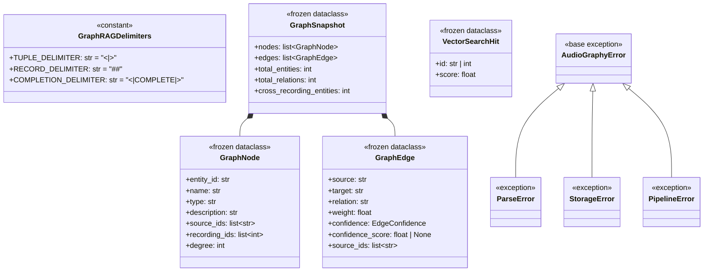
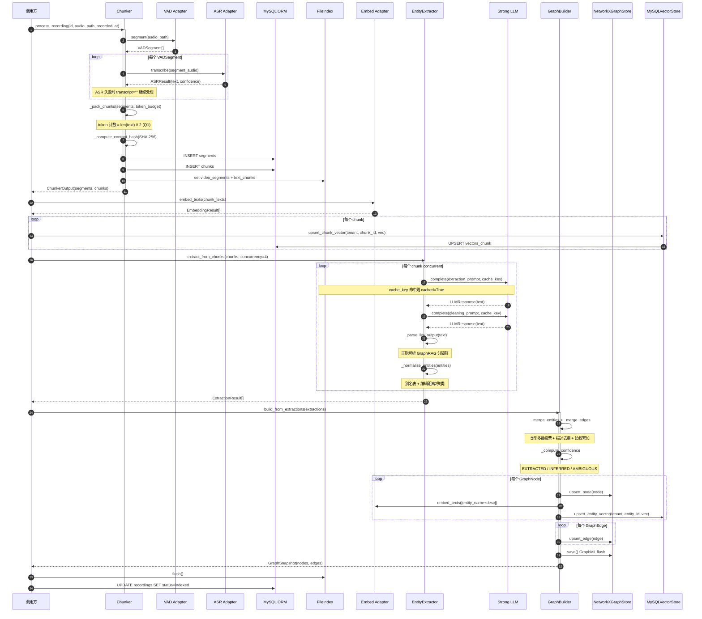
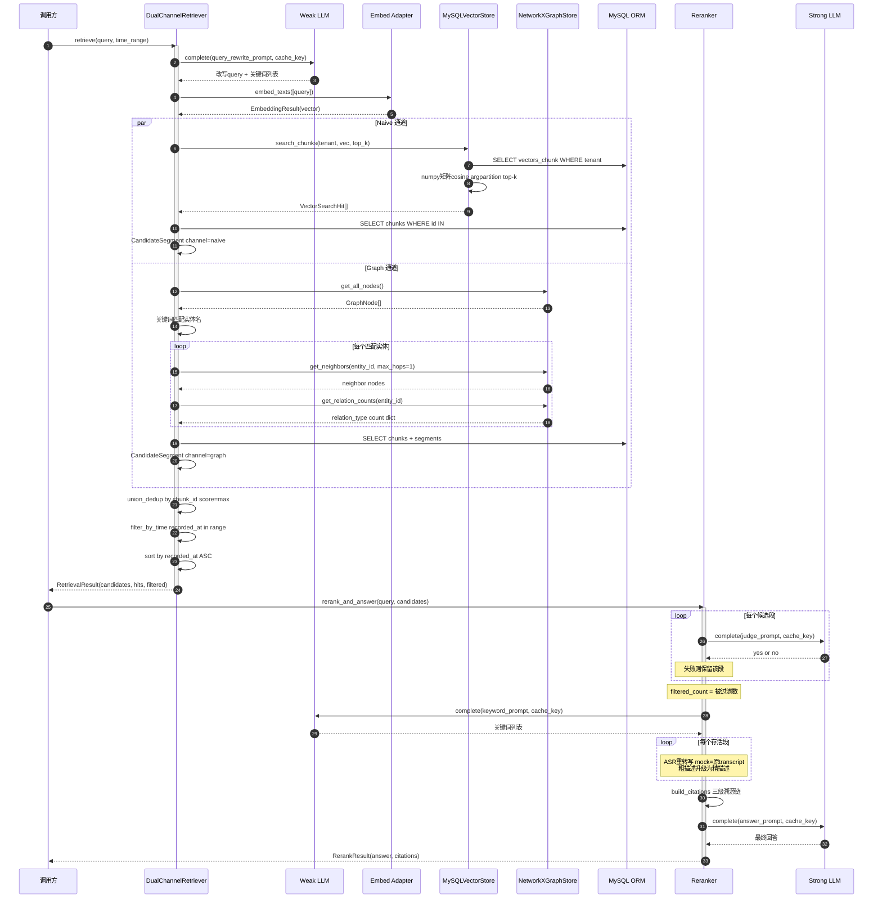
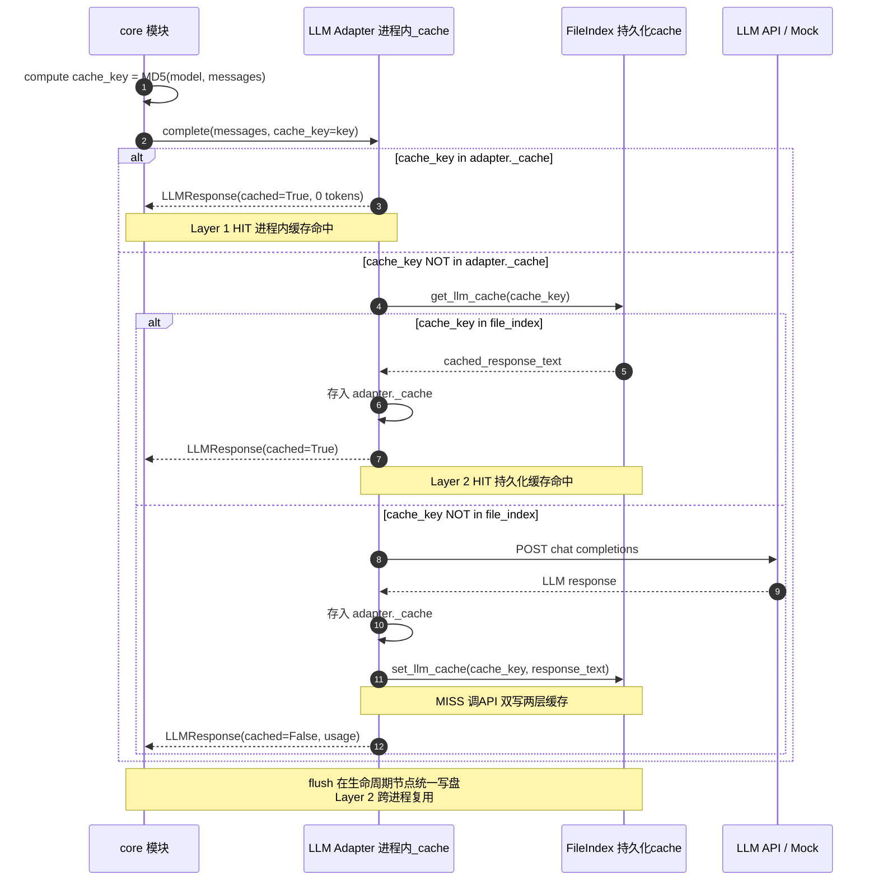
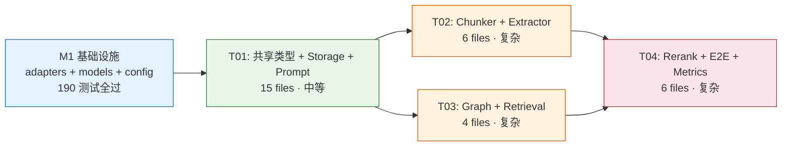

# AudioGraphy M2 架构设计文档 — core/ 算法模块 + storage/ 存储模块

> **里程碑**: M2 · Phase 1 核心算法层
> **版本**: v1.0 · 2026-07
> **作者**: 高见远 (Gao) · 架构师
> **权威源**: `docs/DESIGN.md` §3-5, §7 · `docs/m2-prd.md` v1.0
> **前置**: M1.1-M1.5（13 ORM models / 4 mock adapters / Protocol 契约 / 190 测试全过）

---

## 目录

1. [实现方案 + 框架选型](#1-实现方案--框架选型)
2. [文件列表及相对路径](#2-文件列表及相对路径)
3. [数据结构和接口（类图）](#3-数据结构和接口类图)
4. [程序调用流程（时序图）](#4-程序调用流程时序图)
5. [任务列表（有序、含依赖关系）](#5-任务列表)
6. [依赖包列表](#6-依赖包列表)
7. [共享知识（跨文件约定）](#7-共享知识跨文件约定)
8. [待明确事项](#8-待明确事项)

---

## 1. 实现方案 + 框架选型

### 1.1 核心技术挑战与对策

| # | 挑战 | 对策 | 决策依据 |
|---|---|---|---|
| C1 | GraphRAG 分隔符协议解析鲁棒性 | **正则 + split 混合策略**（非状态机） | 分隔符协议结构简单（tuple/record/completion 三级），正则 + split 足够；状态机过度工程化 |
| C2 | NetworkX 图数据结构选择 | **MultiDiGraph**（非 DiGraph） | 同一实体对可有多种关系（如 `(客户)-[询问]→(CS75 Plus)` + `(客户)-[对比]→(CS75 Plus)`），MultiDiGraph 原生支持平行边，edge key = relation 字符串 |
| C3 | 暴力余弦检索性能 | **numpy 矩阵运算**（非逐行计算） | 全表加载为 `np.ndarray (N×dim)`，单次矩阵乘法计算 cosine，`np.argpartition` 取 top-k；O(N) 但常数因子远低于 Python 循环 |
| C4 | 三级溯源链数据结构 | **frozen dataclass 嵌套** | 与 `adapters/protocols.py` 风格一致（`frozen=True, slots=True`）；溯源信息层层嵌套，不可变 |
| C5 | LLM 缓存双层协作 | **adapter 进程内 cache + file_index 持久化 cache 互补** | adapter cache 快但进程退出即失；file_index cache 跨进程复用但需 load/flush；core 模块通过 `cache_key` 参数让 adapter 自行缓存 |
| C6 | 跨模块共享类型与循环导入 | **core/types.py 集中定义** | GraphNode/GraphEdge 被 core/graph.py 和 storage/graph_networkx.py 共用；VectorSearchHit 被 storage/mysql_vector.py 和 core/retrieval.py 共用；放 core/types.py 避免循环导入 |
| C7 | GraphML 多重图持久化 | **MultiDiGraph → write_graphml** | NetworkX 原生支持 MultiDiGraph 的 GraphML 读写；edge key 自动序列化，relation 作为边属性保留 |
| C8 | async/await 与同步代码混用 | **全链路 async** | 所有 core 公共 API 用 `async def`，与 adapter Protocol 一致；MySQL 操作用 `AsyncSession`；文件 I/O 用 `asyncio.to_thread` 包装（避免新增 aiofiles 依赖） |

### 1.2 框架与库选型

| 库 | 版本 | 用途 | 选型理由 |
|---|---|---|---|
| **networkx** | ≥3.4 | 知识图谱数据结构 + GraphML 持久化 | M1 已安装；DESIGN.md §7.2 权威指定；原生支持 MultiDiGraph + GraphML |
| **numpy** | ≥2.1 | 暴力余弦矩阵运算 + float32 BLOB 序列化 | M1 已安装；`np.ndarray.tobytes()` / `np.frombuffer()` 实现 float32↔BLOB |
| **SQLAlchemy 2.0** | ≥2.0.36 | 异步 ORM（vectors_entity / vectors_chunk 表 CRUD） | M1 已安装；`AsyncSession` + `async_sessionmaker` |
| **tiktoken** | ≥0.8 | **M2 不使用**（Q1 决策：字符数/2 近似） | 已在 pyproject.toml 但 M2 不调用；Phase 2 接真模型时启用 |

### 1.3 架构模式

```
┌─────────────────────────────────────────────────────────────┐
│                     core/ (算法层)                           │
│  ┌──────────┐  ┌───────────┐  ┌─────────┐  ┌──────────┐    │
│  │ chunker  │→ │ extractor │→ │  graph  │  │retrieval │    │
│  └──────────┘  └───────────┘  └────┬────┘  └────┬─────┘    │
│                                    │             │          │
│  ┌─────────────────────────────────┘             │          │
│  │ core/types.py (共享 dataclass + 异常)         │          │
│  └───────────────────────────────────────────────┘          │
│  ┌──────────┐                                               │
│  │  rerank  │←── CandidateSegment                           │
│  └──────────┘                                               │
└──────────────────────────┬──────────────────────────────────┘
                           │ 依赖注入
┌──────────────────────────┴──────────────────────────────────┐
│                   storage/ (存储层)                           │
│  ┌──────────────┐  ┌─────────────────┐  ┌────────────┐      │
│  │ file_index   │  │ mysql_vector    │  │graph_netx  │      │
│  │ (JSON KV)    │  │ (暴力余弦)       │  │(GraphML)   │      │
│  └──────────────┘  └─────────────────┘  └────────────┘      │
└──────────────────────────┬──────────────────────────────────┘
                           │ 依赖注入
┌──────────────────────────┴──────────────────────────────────┐
│              adapters/ (模型适配层 · M1 已完成)               │
│  ┌─────┐ ┌─────┐ ┌──────────┐ ┌──────────┐ ┌───────┐       │
│  │ VAD │ │ ASR │ │strong_llm│ │ weak_llm │ │ embed │       │
│  └─────┘ └─────┘ └──────────┘ └──────────┘ └───────┘       │
│              AdapterBundle (DI 容器)                         │
└──────────────────────────────────────────────────────────────┘
```

**分层依赖规则**（严格执行）：

| 规则 | 说明 |
|---|---|
| `core/` → `adapters/` | 通过 AdapterBundle 依赖注入 |
| `core/` → `storage/` | 通过构造函数注入 store 实例 |
| `core/` → `models/` | ORM 模型，用于 MySQL 读写 |
| `storage/` → `models/` | ORM 模型，用于 MySQL 读写 |
| `storage/` → `core/types.py` | 共享 dataclass，**仅此一个文件** |
| **禁止** `storage/` → `core/` | 除 `core/types.py` 外不得依赖 core |
| **禁止** `adapters/` → `core/` 或 `storage/` | adapters 是最底层，无反向依赖 |

### 1.4 GraphRAG 分隔符协议解析策略

**分隔符常量**（定义在 `core/types.py`）：

```python
TUPLE_DELIMITER = "<|>"
RECORD_DELIMITER = "##"
COMPLETION_DELIMITER = "<|COMPLETE|>"
```

**解析流程**（三步 split + 字段提取）：

| 步骤 | 操作 | 输入 | 输出 |
|---|---|---|---|
| 1 | 按 `COMPLETION_DELIMITER` 截取有效内容 | LLM 原始输出 | 有效内容字符串（截掉 `<|COMPLETE|>` 之后的部分） |
| 2 | 按 `RECORD_DELIMITER` 拆分记录 | 有效内容 | `list[str]`（每条记录） |
| 3 | 对每条记录，按 `TUPLE_DELIMITER` 拆分字段 | 单条记录 | `list[str]`（字段列表），首字段判断 entity / relation |

**LLM 输出样例与解析结果**：

```
输入: ("实体"<|>CS75 Plus<|>车型<|>长安CS75 Plus是...)<|>##("关系"<|>坐席<|>推荐<|>CS75 Plus<|>坐席推荐了CS75 Plus...)<|COMPLETE|>

解析:
  ExtractedEntity(name="CS75 Plus", type="车型", description="长安CS75 Plus是...")
  ExtractedRelation(source_name="坐席", target_name="CS75 Plus", relation="推荐", description="坐席推荐了CS75 Plus...")
```

**容错降级**：宽松正则 `r'\(["\']?实体["\']?\s*[,<\|>]\s*["\']?([^"<\|>]+)'` 提取能解析的部分，`parse_success=False` 标记降级，不阻塞流程。

### 1.5 暴力余弦 numpy 矩阵运算

**实现思路**（非最终代码）：

```python
import numpy as np

# 1. 全表加载 → numpy 矩阵 (N × dim)
rows = await session.execute(select(VectorChunk).where(...))
matrix = np.stack([np.frombuffer(row.embedding, dtype=np.float32) for row in rows])  # (N, 1024)

# 2. 归一化
norms = np.linalg.norm(matrix, axis=1, keepdims=True)  # (N, 1)
normalized = matrix / np.clip(norms, 1e-12, None)      # (N, 1024)
query_norm = query_vec / max(np.linalg.norm(query_vec), 1e-12)  # (1024,)

# 3. 单次矩阵乘法 → cosine scores
scores = normalized @ query_norm  # (N,) — 全部 cosine 相似度

# 4. top-k via argpartition (O(N), 不完全排序)
top_k_idx = np.argpartition(scores, -top_k)[-top_k:]
top_k_sorted = top_k_idx[np.argsort(scores[top_k_idx])[::-1]]
```

| 指标 | 值 |
|---|---|
| 复杂度 | O(N × dim) — 全表扫描，无 ANN 索引 |
| 10⁴ 向量 | ~10ms（numpy 矩阵乘） |
| 10⁵ 向量 | ~100ms（可接受，离线质检场景） |
| 10⁶ 向量 | ~1s（Phase 3 升级触发点） |

### 1.6 三级溯源链数据结构

```
Citation (rerank 产出，最终溯源链完整表达)
  ├─ entity: str                    ← 命中实体名
  ├─ chunk_id: int                  ← 溯源 1: entity → chunk
  ├─ segment_ids: list[int]         ← 溯源 2: chunk → segments
  ├─ recording_id: int              ← 溯源 3: segment → recording
  ├─ recorded_at: datetime | None   ← 录制时间
  ├─ transcript_snippet: str        ← 段级原文摘要
  └─ confidence: EdgeConfidence     ← 关联边置信度 (EXTRACTED/INFERRED/AMBIGUOUS)
```

溯源链反查路径：`Citation.entity → GraphNode.source_ids → chunk_id → ChunkRecord.segment_ids → SegmentRecord.transcript + Recording.recorded_at`

### 1.7 NetworkX MultiDiGraph 边合并策略

**问题**：同一实体对可存在多种关系，如 `(客户)-[询问]→(CS75 Plus)` 和 `(客户)-[对比]→(CS75 Plus)`。DiGraph 仅允许每对节点一条边，会丢失关系类型。

**方案**：使用 `MultiDiGraph`，edge key = `relation` 字符串。

```python
# upsert_edge 合并逻辑
if graph.has_edge(source, target, key=relation):
    # 已有同关系类型边 → 权重累加 + source_ids 追加
    existing = graph[source][target][relation]
    existing["weight"] += edge.weight
    existing["source_ids"].extend(edge.source_ids)
    # confidence 升级规则：EXTRACTED > INFERRED > AMBIGUOUS
    existing["confidence"] = _upgrade_confidence(existing["confidence"], edge.confidence)
else:
    # 新关系类型 → 添加新边
    graph.add_edge(source, target, key=relation, **edge_attrs)
```

**置信度升级规则**：

| 现有 | 新增 | 结果 |
|---|---|---|
| INFERRED | EXTRACTED | EXTRACTED（首轮抽取更可信） |
| AMBIGUOUS | EXTRACTED | EXTRACTED |
| AMBIGUOUS | INFERRED | INFERRED |
| EXTRACTED | * | EXTRACTED（不降级） |

---

## 2. 文件列表及相对路径

> 所有路径相对于 `backend/audio_graphy/`

### 2.1 core/ — 5 个算法模块 + 共享类型

| 文件 | 职责 | PRD 对应 |
|---|---|---|
| `core/__init__.py` | 包初始化，导出公共 API | — |
| `core/types.py` | **共享 dataclass** + GraphRAG 分隔符常量 + 异常层次 | §4.3, §4.6 跨模块共用 |
| `core/chunker.py` | VAD → ASR → chunking + 三级溯源链第一环 | P0-1, §4.1 |
| `core/extractor.py` | GraphRAG 实体抽取 + Gleaning + 中文归一 | P0-2, §4.2 |
| `core/graph.py` | 跨 chunk/跨录音合并 + 边置信度标签 | P0-3, §4.3 |
| `core/retrieval.py` | 双通道检索 + union 去重 + 时间过滤 | P0-4, §4.4 |
| `core/rerank.py` | LLM as-judge 过滤 + 精化重排 + 回答生成 | P0-5, §4.5 |

### 2.2 storage/ — 3 个存储模块

| 文件 | 职责 | PRD 对应 |
|---|---|---|
| `storage/__init__.py` | 包初始化 | — |
| `storage/file_index.py` | working_dir JSON 读写 + LLM 响应缓存 + checkpoint flush | P0-8, §4.8 |
| `storage/mysql_vector.py` | 暴力余弦 top-k 检索 + float32↔BLOB 序列化 | P0-6, §4.6 |
| `storage/graph_networkx.py` | NetworkX 图 CRUD + GraphML 持久化 + 邻居/relation_counts 查询 | P0-7, §4.7 |

### 2.3 prompts/ — Prompt 模板

| 文件 | 职责 | PRD 对应 |
|---|---|---|
| `prompts/entity_zh.md` | 中文实体抽取 prompt（汽车销售领域，含 GraphRAG 分隔符协议 + few-shot） | P1-1, §5.1, Q10 |
| `prompts/versions.yaml` | prompt_version 注册表（版本号 → 文件路径映射） | P1-2 |

### 2.4 tests/ — 测试文件

| 文件 | 职责 | PRD 对应 |
|---|---|---|
| `tests/core/__init__.py` | 包初始化 | — |
| `tests/core/conftest.py` | core 测试 fixtures（mock bundle, testcontainers MySQL, tmp working_dir） | AC-25 |
| `tests/core/test_chunker.py` | chunker 单测（token 预算打包、溯源链、错误处理） | P0-9, AC-2, AC-3 |
| `tests/core/test_extractor.py` | extractor 单测（分隔符解析、Gleaning、缓存命中） | P0-9, AC-23 |
| `tests/core/test_graph.py` | graph 单测（跨 chunk 合并、边置信度、GraphML 往返） | P0-9, AC-18~20 |
| `tests/core/test_retrieval.py` | retrieval 单测（双通道召回、去重、时间过滤） | P0-9, AC-10~12, AC-21~22 |
| `tests/core/test_rerank.py` | rerank 单测（LLM 过滤、精化重排、溯源链完整） | P0-9, AC-13, AC-16~17 |
| `tests/core/test_e2e_index.py` | 端到端索引集成测试 | AC-1~8 |
| `tests/core/test_e2e_query.py` | 端到端查询集成测试 | AC-9~17 |
| `tests/core/test_metrics.py` | A0 评估指标（parse 成功率 / 空抽取率 / 近重名实体率） | P1-4 |
| `tests/storage/__init__.py` | 包初始化 | — |
| `tests/storage/conftest.py` | storage 测试 fixtures | — |
| `tests/storage/test_file_index.py` | file_index 单测（KV CRUD、LLM cache、flush/load） | P0-9 |
| `tests/storage/test_mysql_vector.py` | mysql_vector 单测（序列化、top-k、租户隔离） | P0-9, AC-4~5 |
| `tests/storage/test_graph_networkx.py` | graph_networkx 单测（CRUD、GraphML 往返、邻居查询） | P0-9, AC-6 |

### 2.5 文件总数统计

| 目录 | 文件数 |
|---|---|
| `core/` | 7（含 `__init__.py` + `types.py`） |
| `storage/` | 4（含 `__init__.py`） |
| `prompts/` | 2 |
| `tests/core/` | 10（含 `__init__.py` + `conftest.py`） |
| `tests/storage/` | 5（含 `__init__.py` + `conftest.py`） |
| **合计** | **28 个新文件** |

---

## 3. 数据结构和接口（类图）

### 3.1 共享类型 — `core/types.py`



### 3.2 完整类图 — 所有模块

```mermaid
classDiagram
    direction TB

    %% ========== Shared Types ==========
    class GraphNode {
        <<frozen, core/types.py>>
        +entity_id: str
        +name: str
        +type: str
        +description: str
        +source_ids: list~str~
        +recording_ids: list~int~
        +degree: int
    }
    class GraphEdge {
        <<frozen, core/types.py>>
        +source: str
        +target: str
        +relation: str
        +weight: float
        +confidence: EdgeConfidence
        +confidence_score: float | None
        +source_ids: list~str~
    }
    class GraphSnapshot {
        <<frozen, core/types.py>>
        +nodes: list~GraphNode~
        +edges: list~GraphEdge~
        +total_entities: int
        +total_relations: int
        +cross_recording_entities: int
    }
    class VectorSearchHit {
        <<frozen, core/types.py>>
        +id: str | int
        +score: float
    }

    %% ========== Chunker ==========
    class SegmentRecord {
        <<frozen, core/chunker.py>>
        +idx: int
        +start_sec: float
        +end_sec: float
        +transcript: str
        +speaker: str | None
        +vad_conf: float
    }
    class ChunkRecord {
        <<frozen, core/chunker.py>>
        +segment_ids: list~int~
        +text: str
        +token_n: int
        +content_hash: str
    }
    class ChunkerOutput {
        <<frozen, core/chunker.py>>
        +recording_id: int
        +segments: list~SegmentRecord~
        +chunks: list~ChunkRecord~
    }
    class Chunker {
        <<core/chunker.py>>
        -bundle: AdapterBundle
        -token_budget: int
        -overlap_tokens: int
        +__init__(bundle, token_budget, overlap_tokens)
        +async process_recording(recording_id, audio_path, recorded_at, tenant_id) ChunkerOutput
        -_estimate_tokens(text) int
        -_pack_chunks(segments) list~ChunkRecord~
        -_compute_content_hash(text) str
    }
    ChunkerOutput *-- SegmentRecord
    ChunkerOutput *-- ChunkRecord

    %% ========== Extractor ==========
    class ExtractedEntity {
        <<frozen, core/extractor.py>>
        +name: str
        +type: str
        +description: str
        +chunk_id: int
        +recording_id: int
    }
    class ExtractedRelation {
        <<frozen, core/extractor.py>>
        +source_name: str
        +target_name: str
        +relation: str
        +description: str
        +weight: float
        +confidence: EdgeConfidence
        +chunk_id: int
        +recording_id: int
    }
    class ExtractionResult {
        <<frozen, core/extractor.py>>
        +chunk_id: int
        +recording_id: int
        +entities: list~ExtractedEntity~
        +relations: list~ExtractedRelation~
        +parse_success: bool
        +gleaning_rounds: int
    }
    class EntityExtractor {
        <<core/extractor.py>>
        -bundle: AdapterBundle
        -prompt_template: str
        -gleaning_rounds: int
        -entity_types: tuple~str~
        -max_gleaning_retry: int
        +__init__(bundle, prompt_template, gleaning_rounds, entity_types, max_gleaning_retry)
        +async extract_from_chunk(chunk_id, chunk_text, recording_id) ExtractionResult
        +async extract_from_chunks(chunks, concurrency) list~ExtractionResult~
        -_parse_llm_output(text) tuple
        -_build_prompt(chunk_text) str
        -_glean(entities, relations, chunk_text) tuple
        -_normalize_entities(entities) list
    }
    ExtractionResult *-- ExtractedEntity
    ExtractionResult *-- ExtractedRelation

    %% ========== Graph Builder ==========
    class GraphBuilder {
        <<core/graph.py>>
        -graph_store: NetworkXGraphStore
        -bundle: AdapterBundle
        +__init__(graph_store, bundle)
        +async build_from_extractions(extractions, tenant_id) GraphSnapshot
        -_merge_entities(extractions) dict
        -_merge_edges(extractions, node_map) list~GraphEdge~
        -_vote_type(types) str
        -_dedup_descriptions(descriptions) str
        -_compute_confidence(relations) EdgeConfidence
    }
    GraphBuilder --> NetworkXGraphStore : uses
    GraphBuilder ..> ExtractionResult : input

    %% ========== Retrieval ==========
    class CandidateSegment {
        <<frozen, core/retrieval.py>>
        +chunk_id: int
        +recording_id: int
        +segment_ids: list~int~
        +text: str
        +recorded_at: datetime | None
        +score: float
        +source_channel: str
    }
    class RetrievalResult {
        <<frozen, core/retrieval.py>>
        +query: str
        +candidates: list~CandidateSegment~
        +naive_hits: int
        +graph_hits: int
        +filtered_by_time: int
    }
    class DualChannelRetriever {
        <<core/retrieval.py>>
        -bundle: AdapterBundle
        -vector_store: MySQLVectorStore
        -graph_store: NetworkXGraphStore
        +__init__(bundle, vector_store, graph_store)
        +async retrieve(query, tenant_id, top_k, time_range) RetrievalResult
        -_naive_channel(query_vec, tenant_id, top_k) list~CandidateSegment~
        -_graph_channel(keywords, tenant_id, top_k) list~CandidateSegment~
        -_union_dedup(naive, graph) list~CandidateSegment~
        -_filter_by_time(candidates, time_range) tuple
    }
    RetrievalResult *-- CandidateSegment
    DualChannelRetriever --> MySQLVectorStore : uses
    DualChannelRetriever --> NetworkXGraphStore : uses
    DualChannelRetriever ..> VectorSearchHit : input

    %% ========== Rerank ==========
    class Citation {
        <<frozen, core/rerank.py>>
        +entity: str
        +chunk_id: int
        +segment_ids: list~int~
        +recording_id: int
        +recorded_at: datetime | None
        +transcript_snippet: str
        +confidence: EdgeConfidence
    }
    class RerankResult {
        <<frozen, core/rerank.py>>
        +answer: str
        +citations: list~Citation~
        +filtered_count: int
        +refined_count: int
    }
    class Reranker {
        <<core/rerank.py>>
        -bundle: AdapterBundle
        +__init__(bundle)
        +async rerank_and_answer(query, candidates, time_range) RerankResult
        -_llm_judge_filter(query, candidates) tuple
        -_extract_keywords(query) list~str~
        -_refine_descriptions(candidates, keywords) list
        -_generate_answer(query, refined, citations) str
        -_build_citations(candidates) list~Citation~
    }
    RerankResult *-- Citation
    Reranker ..> CandidateSegment : input

    %% ========== Storage: FileIndex ==========
    class FileIndex {
        <<storage/file_index.py>>
        -working_dir: Path
        -tenant_id: str
        -_stores: dict
        +__init__(working_dir, tenant_id)
        +async get(store_name, key) Any | None
        +async set(store_name, key, value) None
        +async get_all(store_name) dict
        +async delete(store_name, key) bool
        +async get_llm_cache(cache_key) str | None
        +async set_llm_cache(cache_key, response_text) None
        +async llm_cache_hit(cache_key) bool
        +async flush() None
        +async load() None
        +working_path Path
    }

    %% ========== Storage: MySQLVectorStore ==========
    class MySQLVectorStore {
        <<storage/mysql_vector.py>>
        -session_factory: async_sessionmaker
        -dim: int
        +__init__(session_factory, dim)
        +async upsert_entity_vector(tenant_id, entity_id, embedding) None
        +async search_entities(tenant_id, query_vec, top_k) list~VectorSearchHit~
        +async upsert_chunk_vector(tenant_id, chunk_id, embedding) None
        +async search_chunks(tenant_id, query_vec, top_k) list~VectorSearchHit~
        +_serialize(vec) bytes
        +_deserialize(blob) tuple
        -_brute_cosine(matrix, query_vec, top_k) list~VectorSearchHit~
    }
    MySQLVectorStore ..> VectorSearchHit : produces

    %% ========== Storage: NetworkXGraphStore ==========
    class NetworkXGraphStore {
        <<storage/graph_networkx.py>>
        -working_dir: Path
        -tenant_id: str
        -_graph: nx.MultiDiGraph
        +__init__(working_dir, tenant_id)
        +async upsert_node(node) None
        +async get_node(entity_id) GraphNode | None
        +async get_all_nodes() list~GraphNode~
        +async upsert_edge(edge) None
        +async get_edges(entity_id) list~GraphEdge~
        +async get_neighbors(entity_id, max_hops) list~GraphNode~
        +async get_relation_counts(entity_id) dict
        +async get_node_degree(entity_id) int
        +async save() None
        +async load() None
        +async has_graph() bool
        -_node_to_attrs(node) dict
        -_attrs_to_node(attrs) GraphNode
        -_edge_to_attrs(edge) dict
        -_attrs_to_edge(attrs) GraphEdge
    }
    NetworkXGraphStore ..> GraphNode : manages
    NetworkXGraphStore ..> GraphEdge : manages
```



### 3.3 模块间依赖关系图

```mermaid
graph TB
    subgraph "adapters/ (M1 已完成)"
        AB[AdapterBundle]
        PRT["protocols.py<br/>EdgeConfidence, VADSegment,<br/>ASRResult, LLMResponse, EmbeddingResult"]
    end

    subgraph "core/types.py (共享层)"
        CT["GraphNode, GraphEdge, GraphSnapshot<br/>VectorSearchHit, Delimiters, Exceptions"]
    end

    subgraph "core/ (算法层)"
        CHK["chunker.py<br/>SegmentRecord, ChunkRecord, ChunkerOutput"]
        EXT["extractor.py<br/>ExtractedEntity, ExtractedRelation, ExtractionResult"]
        GRP["graph.py<br/>GraphBuilder"]
        RET["retrieval.py<br/>CandidateSegment, RetrievalResult"]
        RNK["rerank.py<br/>Citation, RerankResult"]
    end

    subgraph "storage/ (存储层)"
        FI["file_index.py<br/>FileIndex"]
        MV["mysql_vector.py<br/>MySQLVectorStore"]
        GN["graph_networkx.py<br/>NetworkXGraphStore"]
    end

    subgraph "models/ (M1 已完成)"
        ORM["Segment, Chunk, VectorEntity,<br/>VectorChunk, Recording"]
    end

    AB --> PRT
    CHK --> AB
    CHK --> ORM
    CHK --> FI
    EXT --> AB
    EXT --> FI
    EXT --> CT
    GRP --> AB
    GRP --> CT
    GRP --> GN
    GRP --> MV
    GRP ..> EXT
    RET --> AB
    RET --> CT
    RET --> MV
    RET --> GN
    RNK --> AB
    RNK ..> RET
    RNK --> FI
    FI -.-> CT
    MV -.-> CT
    MV --> ORM
    GN -.-> CT

    style CT fill:#e8f5e9,stroke:#2e7d32
    style AB fill:#e3f2fd,stroke:#1565c0
    style ORM fill:#e3f2fd,stroke:#1565c0
```

> **图例**：实线 = 直接依赖（import / 构造注入）；虚线 = 共享类型引用（仅 core/types.py）；点划线 = 仅引用 dataclass 定义

---

## 4. 程序调用流程（时序图）

### 4.1 端到端索引时序



### 4.2 端到端查询时序



### 4.3 LLM 缓存命中/未命中流程



> **缓存策略说明**（Q6 决策）：
>
> | 层级 | 位置 | 命中速度 | 生命周期 | 职责方 |
> |---|---|---|---|---|
> | Layer 1 | adapter `_cache` dict | 纳秒级 | 进程内 | adapter 自行管理 |
> | Layer 2 | file_index `kv_store_llm_response_cache.json` | 毫秒级（文件 I/O） | 持久化 | 调用方 `flush()` 写盘 |
>
> - **core 模块职责**：调用 `adapter.complete()` 时传 `cache_key = prompt_hash`
> - **adapter 职责**：先查 `_cache`（Layer 1），未命中时查 file_index（Layer 2），最终调 API
> - **M2 实现**：MockLLMAdapter 已有 `_cache`；core 模块通过 `cache_key` 驱动；file_index 的 LLM cache 作为持久化层

---

## 5. 任务列表

### 5.1 任务总览

| 任务 ID | 标题 | 涉及文件数 | 依赖 | 优先级 | 复杂度 |
|---|---|---|---|---|---|
| T01 | 共享类型 + Storage 三件套 + Prompt 模板 | 15 | M1（已完成） | P0 | 中等 |
| T02 | Chunker + Extractor（索引前段流水线） | 6 | T01 | P0 | 复杂 |
| T03 | Graph Builder + Retrieval（图谱构建 + 双通道检索） | 4 | T01 | P0 | 复杂 |
| T04 | Rerank + 端到端集成测试 + 评估指标 | 6 | T01, T02, T03 | P0 | 复杂 |

### 5.2 任务依赖图



> **并行机会**：T02 和 T03 均仅依赖 T01，可并行开发。T04 依赖 T02 + T03 完成后才能开始。

---

### T01: 共享类型 + Storage 三件套 + Prompt 模板

| 属性 | 值 |
|---|---|
| **任务编号** | T01 |
| **标题** | 共享类型 + Storage 三件套 + Prompt 模板（项目基础设施） |
| **优先级** | P0 |
| **复杂度** | 中等 |
| **依赖** | M1（adapters / models / config 已完成） |

**涉及文件**（15 个）：

| 文件 | 类型 | 说明 |
|---|---|---|
| `core/__init__.py` | 新建 | 包初始化 |
| `core/types.py` | 新建 | GraphNode / GraphEdge / GraphSnapshot / VectorSearchHit / 分隔符常量 / 异常层次 |
| `storage/__init__.py` | 新建 | 包初始化 |
| `storage/file_index.py` | 新建 | FileIndex — working_dir JSON KV + LLM cache + flush/load |
| `storage/mysql_vector.py` | 新建 | MySQLVectorStore — 暴力余弦 + float32↔BLOB |
| `storage/graph_networkx.py` | 新建 | NetworkXGraphStore — MultiDiGraph CRUD + GraphML |
| `prompts/entity_zh.md` | 新建 | 中文实体抽取 prompt 模板（GraphRAG 分隔符 + few-shot） |
| `prompts/versions.yaml` | 新建 | prompt 版本注册表 |
| `tests/core/__init__.py` | 新建 | 包初始化 |
| `tests/core/conftest.py` | 新建 | core 测试 fixtures |
| `tests/storage/__init__.py` | 新建 | 包初始化 |
| `tests/storage/conftest.py` | 新建 | storage 测试 fixtures（testcontainers MySQL + tmp working_dir） |
| `tests/storage/test_file_index.py` | 新建 | FileIndex 单测 |
| `tests/storage/test_mysql_vector.py` | 新建 | MySQLVectorStore 单测 |
| `tests/storage/test_graph_networkx.py` | 新建 | NetworkXGraphStore 单测 |

**验收标准**：

- [ ] `core/types.py` 中所有 dataclass 使用 `@dataclass(frozen=True, slots=True)`，与 `adapters/protocols.py` 风格一致
- [ ] `storage/file_index.py` 的 KV CRUD + LLM cache + flush/load 全部可单测，JSON 文件读写正确
- [ ] `storage/mysql_vector.py` 的 `_serialize` / `_deserialize` 可往返（1024-dim float32 → 4096 bytes → 还原一致）
- [ ] `storage/mysql_vector.py` 的暴力余弦 top-k 结果与手算 cosine 一致
- [ ] `storage/graph_networkx.py` 的 MultiDiGraph CRUD + GraphML save/load 往返无损
- [ ] `storage/graph_networkx.py` 的 `get_neighbors` / `get_relation_counts` 正确
- [ ] `prompts/entity_zh.md` 包含 `{tuple_delimiter}` / `{record_delimiter}` / `{completion_delimiter}` / `{entity_types}` / `{input_text}` 占位符
- [ ] 所有 storage 测试使用 testcontainers MySQL 8（AC-31）
- [ ] `ruff check && ruff format --check` 全过
- [ ] `mypy audio_graphy/core/types audio_graphy/storage` strict 全过

---

### T02: Chunker + Extractor（索引前段流水线）

| 属性 | 值 |
|---|---|
| **任务编号** | T02 |
| **标题** | Chunker + Extractor — VAD/ASR/Chunking + 实体抽取/Gleaning |
| **优先级** | P0 |
| **复杂度** | 复杂 |
| **依赖** | T01 |

**涉及文件**（6 个）：

| 文件 | 类型 | 说明 |
|---|---|---|
| `core/chunker.py` | 新建 | Chunker — VAD → ASR → token 预算打包 → 三级溯源链第一环 |
| `core/extractor.py` | 新建 | EntityExtractor — GraphRAG 分隔符解析 + Gleaning + 中文归一 |
| `tests/core/test_chunker.py` | 新建 | chunker 单测（token 预算、溯源链、ASR 失败容错） |
| `tests/core/test_extractor.py` | 新建 | extractor 单测（分隔符解析、Gleaning、缓存命中、空文本降级） |
| `tests/core/conftest.py` | 修改 | 添加 chunker/extractor 专用 fixtures（可能已在 T01 创建，此处补充） |
| `prompts/entity_zh.md` | 修改 | 根据 extractor 实际需求调整 prompt 占位符（可能已在 T01 创建） |

**验收标准**：

- [ ] `Chunker.process_recording()` 调用 `bundle.vad.segment()` + `bundle.asr.transcribe()`，产出 `ChunkerOutput`
- [ ] token 计数使用 `len(text) // 2`（Q1 决策），不调用 tiktoken
- [ ] chunk 打包按 `token_budget` 累加，超出则截断开新 chunk，每个 chunk 记录 `segment_ids[]`
- [ ] `content_hash = SHA-256(text)`，幂等去重
- [ ] ASR 单段失败时 `transcript=""` 继续处理，不阻塞整条录音
- [ ] `EntityExtractor.extract_from_chunk()` 调用 `bundle.strong_llm.complete()` 并传 `cache_key`
- [ ] GraphRAG 分隔符解析：`<|>` / `##` / `<|COMPLETE|>` 三级 split + 字段提取
- [ ] Gleaning 补抽：首轮 + 1 轮强制补抽，补抽关系 confidence = INFERRED
- [ ] LLM 输出无法解析时 `parse_success=False`，返回空结果不抛异常
- [ ] `extract_from_chunks()` 支持并发（`asyncio.gather` + `concurrency` 控制）
- [ ] 中文实体归一：别名表查表 + 编辑距离 ≤ 2 聚类（P1，可降级为不做但接口预留）
- [ ] `ruff check && mypy strict` 全过

---

### T03: Graph Builder + Retrieval（图谱构建 + 双通道检索）

| 属性 | 值 |
|---|---|
| **任务编号** | T03 |
| **标题** | Graph Builder + Dual-Channel Retriever — 跨录音合并 + 双通道检索 + 时间过滤 |
| **优先级** | P0 |
| **复杂度** | 复杂 |
| **依赖** | T01 |

**涉及文件**（4 个）：

| 文件 | 类型 | 说明 |
|---|---|---|
| `core/graph.py` | 新建 | GraphBuilder — 跨 chunk/跨录音合并 + 边置信度 + 实体向量存储 |
| `core/retrieval.py` | 新建 | DualChannelRetriever — naive + 图谱双通道 + union 去重 + 时间过滤 |
| `tests/core/test_graph.py` | 新建 | graph 单测（跨 chunk 合并、类型多数投票、边置信度标签、GraphML 往返） |
| `tests/core/test_retrieval.py` | 新建 | retrieval 单测（naive 通道、图谱通道、union 去重、时间过滤、双通道均空降级） |

**验收标准**：

- [ ] `GraphBuilder.build_from_extractions()` 接收 `ExtractionResult[]`，产出 `GraphSnapshot`
- [ ] 实体类型多数投票：同名实体多 chunk 类型不一致时取 `Counter.most_common(1)`
- [ ] 描述去重拼接：同名实体多个描述去重后拼接，超 512 字符则截断（M2 mock 下降级为截断，不调 LLM 摘要）
- [ ] 边权重累加：同一 (source, target, relation) 在多 chunk 出现 → weight 累加
- [ ] 边置信度标签：首轮抽取 = EXTRACTED (score=1.0)；Gleaning 补抽 = INFERRED (0<score<1.0)；归一碰撞 = AMBIGUOUS (score=None)
- [ ] 跨录音合并：实体按 entity_id 全局合并，source_ids 追加多录音 chunk 引用
- [ ] 实体向量写入 MySQLVectorStore（通过 `bundle.embed.embed_texts()`）
- [ ] `DualChannelRetriever.retrieve()` 双通道并发召回
- [ ] naive 通道：`vector_store.search_chunks()` → `CandidateSegment(source_channel="naive")`
- [ ] 图谱通道：关键词匹配实体名 → `graph_store.get_neighbors()` → `get_relation_counts()` 排序 → 反查 chunk
- [ ] union 去重：按 chunk_id 去重，score 取 max
- [ ] 时间过滤：`time_range` 非空时过滤 `recorded_at` 不在范围内的候选
- [ ] `time_range=None` 时不过滤（AC-22）
- [ ] 双通道均空时返回空 RetrievalResult，不抛异常
- [ ] `ruff check && mypy strict` 全过

---

### T04: Rerank + 端到端集成测试 + 评估指标

| 属性 | 值 |
|---|---|
| **任务编号** | T04 |
| **标题** | Reranker + E2E 集成测试 + A0 评估指标 |
| **优先级** | P0 |
| **复杂度** | 复杂 |
| **依赖** | T01, T02, T03 |

**涉及文件**（6 个）：

| 文件 | 类型 | 说明 |
|---|---|---|
| `core/rerank.py` | 新建 | Reranker — LLM as-judge 过滤 + 精化重排 + 回答生成 + 三级溯源 Citation |
| `tests/core/test_rerank.py` | 新建 | rerank 单测（LLM 过滤、精化、溯源链完整、空候选降级） |
| `tests/core/test_e2e_index.py` | 新建 | 端到端索引：recording → chunker → extractor → graph → storage 全链路 |
| `tests/core/test_e2e_query.py` | 新建 | 端到端查询：query → retrieval → rerank → answer + citations |
| `tests/core/test_metrics.py` | 新建 | A0 指标：parse 成功率 / 空抽取率 / 近重名实体率 |
| `tests/core/conftest.py` | 修改 | 补充 E2E fixtures（完整 mock bundle + testcontainers + working_dir） |

**验收标准**：

- [ ] `Reranker.rerank_and_answer()` 对每个候选段调 `strong_llm.complete()` 做 yes/no 判断
- [ ] LLM judge 失败时保留该段（保守策略，宁多勿少）
- [ ] 关键词提取调 `weak_llm.complete()`，失败时降级为原始 query
- [ ] 精化重排：ASR 重转写 mock 下返回原 transcript（Q5 决策），接口预留
- [ ] 回答生成 LLM 失败时 `answer="（生成失败）"`，citations 仍返回
- [ ] candidates 为空时 `answer="未找到相关录音片段"`
- [ ] `Citation` 携带完整三级溯源链：entity → chunk_id → segment_ids → recording_id → recorded_at → transcript_snippet
- [ ] AC-1: 1 条录音 → VAD → ASR → chunks → entities → graph 全链路跑通，GraphSnapshot 非空
- [ ] AC-9: 1 个问题 → 双通道检索 → LLM 过滤 → 精化 → 回答 + 溯源，RerankResult.answer 非空
- [ ] AC-14~17: 三级溯源链完整且可反查
- [ ] AC-25: `pytest` 一条命令全过（M1 的 190 + M2 新增全部通过）
- [ ] AC-26: 覆盖率 ≥ 85%
- [ ] AC-27~28: `ruff check && ruff format --check && mypy strict` 全过

---

## 6. 依赖包列表

### 6.1 新增依赖

| 包 | 版本 | 用途 | 是否必须 |
|---|---|---|---|
| — | — | — | **M2 无需新增 pip 依赖** |

### 6.2 已有依赖确认

| 包 | pyproject.toml 版本 | M2 用途 | 状态 |
|---|---|---|---|
| `networkx` | ≥3.4 | MultiDiGraph + GraphML 读写 | ✅ 已安装 |
| `numpy` | ≥2.1 | 暴力余弦矩阵运算 + float32 BLOB 序列化 | ✅ 已安装 |
| `sqlalchemy[asyncio]` | ≥2.0.36 | AsyncSession + ORM 查询 | ✅ 已安装 |
| `aiomysql` | ≥0.2.0 | MySQL 异步驱动 | ✅ 已安装 |
| `pydantic` | ≥2.10.0 | 配置 + 数据验证 | ✅ 已安装 |
| `tiktoken` | ≥0.8 | **M2 不使用**（Q1: 字符数/2 近似） | ⚠️ 已安装但不调用 |
| `testcontainers[mysql]` | ≥4.8.0 | 测试用 MySQL 8 容器 | ✅ 已在 dev 依赖 |
| `pytest-asyncio` | ≥0.24.0 | 异步测试支持 | ✅ 已在 dev 依赖 |

### 6.3 文件 I/O 策略

文件 I/O（`file_index.py` 的 JSON 读写、`graph_networkx.py` 的 GraphML 读写）使用 `asyncio.to_thread()` 包装同步 I/O 函数，避免引入 `aiofiles` 新依赖：

```python
# 示例：异步包装同步文件写入
async def flush(self) -> None:
    await asyncio.to_thread(self._sync_flush)

def _sync_flush(self) -> None:
    for store_name, data in self._stores.items():
        path = self.working_path / f"{store_name}.json"
        path.write_text(json.dumps(data, ensure_ascii=False, indent=2))
```

---

## 7. 共享知识（跨文件约定）

### 7.1 命名规范

| 约定 | 示例 | 来源 |
|---|---|---|
| dataclass 风格 | `@dataclass(frozen=True, slots=True)` | 与 `adapters/protocols.py` 一致 |
| 异步公共 API | `async def process_recording(...)` | 与 adapter Protocol 一致 |
| 私有方法前缀 | `_pack_chunks`, `_parse_llm_output` | Python 惯例 |
| 常量全大写 | `TUPLE_DELIMITER`, `RECORD_DELIMITER` | Python 惯例 |
| EdgeConfidence 类型 | `Literal["EXTRACTED", "INFERRED", "AMBIGUOUS"]` | `adapters/protocols.py` 已定义 |
| source_id 格式 | `"{recording_id}_{chunk_id}"` | DESIGN.md §3.2 溯源链 |
| 测试标记 | `@pytest.mark.unit` / `@pytest.mark.integration` / `@pytest.mark.e2e` | pyproject.toml 已注册 |

### 7.2 dataclass 风格（与 M1 一致）

```python
from __future__ import annotations
from dataclasses import dataclass

@dataclass(frozen=True, slots=True)
class GraphNode:
    """图谱节点（合并后）。

    Attributes:
        entity_id: 归一化后的实体名（作为节点 ID）。
        name: 实体显示名。
        type: 多数投票后的领域类型。
        description: 去重拼接后的描述。
        source_ids: 溯源到 chunks，格式 "{recording_id}_{chunk_id}"。
        recording_ids: 出现在哪些录音。
        degree: 连接数（god node 排序用）。
    """
    entity_id: str
    name: str
    type: str
    description: str
    source_ids: list[str]
    recording_ids: list[int]
    degree: int
```

**关键约定**：

- 所有 dataclass 使用 `frozen=True, slots=True`（不可变 + 内存优化）
- `from __future__ import annotations` 延迟注解求值（Python 3.13 标配）
- `list[str]` 而非 `List[str]`（PEP 585）
- `str | None` 而非 `Optional[str]`（PEP 604）

### 7.3 异常层次

```python
# core/types.py

class AudioGraphyError(Exception):
    """AudioGraphy 所有自定义异常的基类。"""

class ParseError(AudioGraphyError):
    """LLM 输出解析失败（GraphRAG 分隔符协议）。"""

class StorageError(AudioGraphyError):
    """存储层错误（file_index / mysql_vector / graph_networkx）。"""

class PipelineError(AudioGraphyError):
    """流水线阶段错误（chunker / extractor / graph / retrieval / rerank）。"""
```

**错误处理原则**（与 PRD §4 一致）：

| 场景 | 策略 | 异常类型 |
|---|---|---|
| LLM 输出无法解析 | 降级返回空结果 + `parse_success=False` | 不抛异常 |
| ASR 单段失败 | `transcript=""` 继续处理 | 不抛异常 |
| MySQL 连接失败 | 向上传播 | `StorageError` |
| GraphML 文件损坏 | 初始化空图 + warning | 不抛异常 |
| 图谱检索图为空 | 返回空列表 | 不抛异常 |
| 双通道均空 | 返回空 RetrievalResult | 不抛异常 |
| 回答生成 LLM 失败 | `answer="（生成失败）"` + citations 仍返回 | 不抛异常 |

### 7.4 测试组织规范

| 测试类型 | 标记 | 数据库 | 说明 |
|---|---|---|---|
| 单元测试 | `@pytest.mark.unit` | 无（mock 所有外部依赖） | 纯算法逻辑验证 |
| 存储测试 | `@pytest.mark.integration` | testcontainers MySQL 8 | 真实 DB + mock adapters |
| 端到端测试 | `@pytest.mark.e2e` | testcontainers MySQL 8 | 完整流水线 + mock adapters |

**conftest.py fixtures 约定**：

| Fixture | 作用域 | 用途 |
|---|---|---|
| `mock_bundle` | function | 构建 MockLLMAdapter + MockVADAdapter + MockASRAdapter + MockEmbedAdapter 的 AdapterBundle |
| `mysql_session` | function | testcontainers MySQL 8 → async_sessionmaker |
| `tmp_working_dir` | function | `tmp_path / "working_dir"` 临时目录 |
| `graph_store` | function | NetworkXGraphStore(tmp_working_dir) |
| `vector_store` | function | MySQLVectorStore(mysql_session) |
| `file_index` | function | FileIndex(tmp_working_dir) |

### 7.5 GraphRAG 分隔符协议常量

```python
# core/types.py — 所有模块共用

TUPLE_DELIMITER = "<|>"
RECORD_DELIMITER = "##"
COMPLETION_DELIMITER = "<|COMPLETE|>"

# 实体类型默认值（汽车销售领域）
DEFAULT_ENTITY_TYPES: tuple[str, ...] = (
    "客户", "坐席", "车型", "价格方案",
    "金融政策", "优惠权益", "竞品", "预约事件",
)
```

### 7.6 source_id 格式约定

```
source_id = "{recording_id}_{chunk_id}"

示例: "1_3" → recording_id=1, chunk_id=3

反查路径:
  source_id "1_3"
    → split("_") → recording_id=1, chunk_id=3
    → Chunk.segment_ids → [0, 1, 2]
    → Segment.transcript + Recording.recorded_at
```

### 7.7 LLM cache_key 约定

```python
# cache_key = MD5(model, messages) — 与 MockLLMAdapter.compute_prompt_hash 一致
cache_key = hashlib.md5(
    json.dumps({"model": model, "messages": list(messages)}, ensure_ascii=False).encode()
).hexdigest()

# 调用 adapter 时传入
response = await bundle.strong_llm.complete(
    messages=messages,
    cache_key=cache_key,
)
```

---

## 8. 待明确事项

| # | 问题 | 影响模块 | 当前假设 | 需确认方 |
|---|---|---|---|---|
| A1 | **GraphML 对 MultiDiGraph 的 edge key 处理**：`nx.write_graphml()` 对 MultiDiGraph 的 edge key 序列化方式在不同 NetworkX 版本可能有差异 | graph_networkx | 假设 NetworkX ≥3.4 正确处理 MultiDiGraph GraphML；若发现 edge key 丢失，降级为 DiGraph + 边属性存 relation list | 工程师实现时验证 |
| A2 | **描述摘要 LLM 调用**：PRD §4.3 提到"超长描述调 weak_llm 摘要"，但 M2 mock 下 weak_llm 无法做真实摘要 | graph | M2 mock 下直接截断（取前 512 字符），不调 LLM；Phase 2 接真 LLM 后启用摘要 | 已确认（PRD §4.3 错误处理"降级为截断"） |
| A3 | **图谱检索反查段的具体实现**：Q4 决策"通过 entity.source_ids 反查 chunk → segment"，但 source_ids 格式是 `"{recording_id}_{chunk_id}"`，需要从 chunk_id 反查 chunk.segment_ids | retrieval | 约定 source_id 格式 = `"{recording_id}_{chunk_id}"`，反查时 split("_") 取 chunk_id → 查 chunks 表取 segment_ids → 查 segments 表取 transcript | 已确认（Q4 默认） |
| A4 | **prompt 模板占位符格式**：prompt 文件用 `{tuple_delimiter}` 还是 `<|>` 硬编码 | extractor | prompt 模板中使用占位符 `{tuple_delimiter}` / `{record_delimiter}` / `{completion_delimiter}` / `{entity_types}` / `{input_text}`，运行时 `.format()` 替换为实际分隔符 | PM 提供 prompt 初版后确认 |
| A5 | **Gleaning prompt 具体措辞**：Q2 决策"PM 提供初版，架构师审校" | extractor | `prompts/entity_zh.md` 中预留 Gleaning 段落占位，PM 填充具体措辞；架构师审校后定稿 | PM（许清楚） |
| A6 | **testcontainers MySQL 启动耗时**：CI 环境 testcontainers 首次拉取 MySQL 8 镜像可能超时 | 测试 | 假设 CI 环境预缓存 MySQL 8 镜像；若首次拉取超时，改用 GitHub Actions services 预启动 MySQL | 工程师 CI 配置时确认 |

---

## 附录 A · Prompt 模板设计规范

### `prompts/entity_zh.md` 结构要求

```markdown
# 中文实体抽取 Prompt — 汽车销售领域

## 版本: v1.0

## System Prompt

你是一个专业的汽车销售对话分析助手。请从以下对话文本中抽取实体和关系。

### 实体类型

{entity_types}

### 输出格式

使用以下分隔符协议输出：
- 字段分隔符: {tuple_delimiter}
- 记录分隔符: {record_delimiter}
- 完成标记: {completion_delimiter}

实体格式: ("实体"{tuple_delimiter}名称{tuple_delimiter}类型{tuple_delimiter}描述)
关系格式: ("关系"{tuple_delimiter}源实体{tuple_delimiter}关系描述{tuple_delimiter}目标实体{tuple_delimiter}关系详情)

### Few-shot 示例

（中文汽车销售对话示例，含完整实体/关系输出）

## Gleaning Prompt

（PM 提供：问 LLM 是否遗漏了实体/关系）

## 输入

{input_text}
```

### `prompts/versions.yaml` 结构要求

```yaml
prompts:
  entity_zh:
    v1.0:
      file: entity_zh.md
      changelog: "初始版本，汽车销售领域"
      active: true
    # v1.1:
    #   file: entity_zh_v1.1.md
    #   changelog: "优化 few-shot 示例"
    #   active: false
```

---

## 附录 B · EdgeConfidence 判定规则速查

| 标签 | 判定条件 | confidence_score | 场景示例 |
|---|---|---|---|
| `EXTRACTED` | 首轮抽取、transcript 中明确存在的关系 | 1.0 | "坐席推荐了CS75 Plus" → (坐席)-[推荐]→(CS75 Plus) |
| `INFERRED` | Gleaning 补抽、或跨段合并推断的关系 | 0.0 < score < 1.0（= weight 归一化） | Gleaning 补抽出"客户对比了竞品" → (客户)-[对比]→(竞品) |
| `AMBIGUOUS` | 实体归一后碰撞（同名不同实体被合并） | None | 两个不同"客户"被合并到同一节点 → 关联边标 AMBIGUOUS |

**置信度升级规则**（边合并时）：

```
EXTRACTED > INFERRED > AMBIGUOUS
已有 EXTRACTED → 不降级
已有 INFERRED + 新增 EXTRACTED → 升级为 EXTRACTED
已有 AMBIGUOUS + 新增 EXTRACTED/INFERRED → 升级
```

---

**文档结束**

> 本架构设计文档是 M2 工程实现（M2-S3）的设计权威源。工程师寇豆码实现时以本文档 + PRD `docs/m2-prd.md` 为准。任何偏离需经架构师确认后更新本文档。
