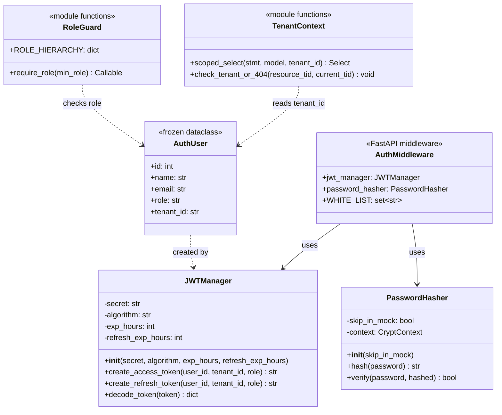
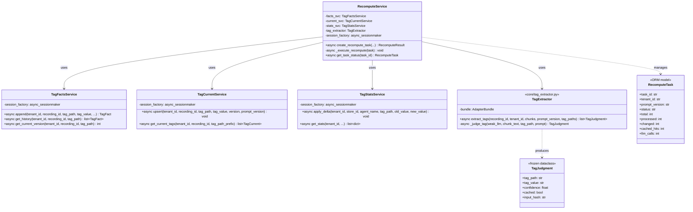
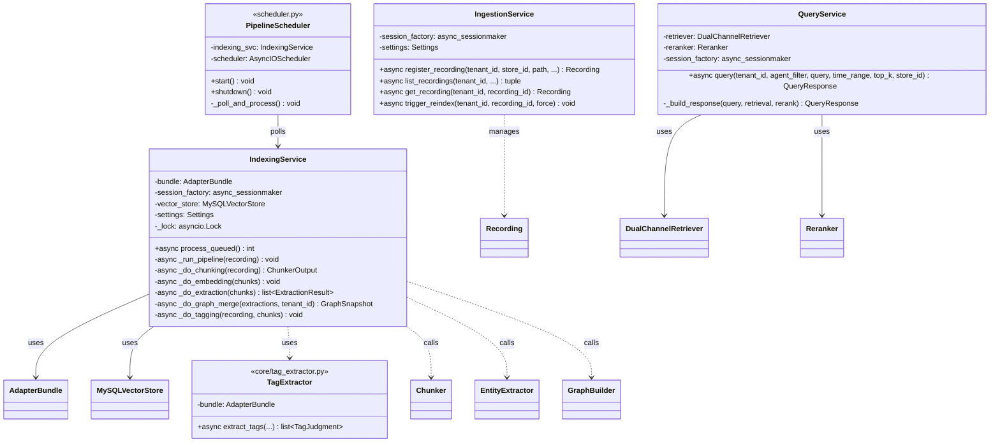
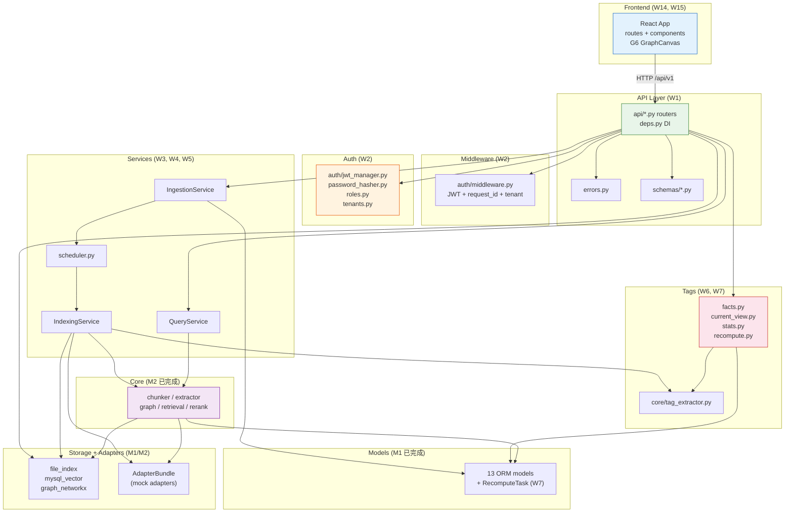
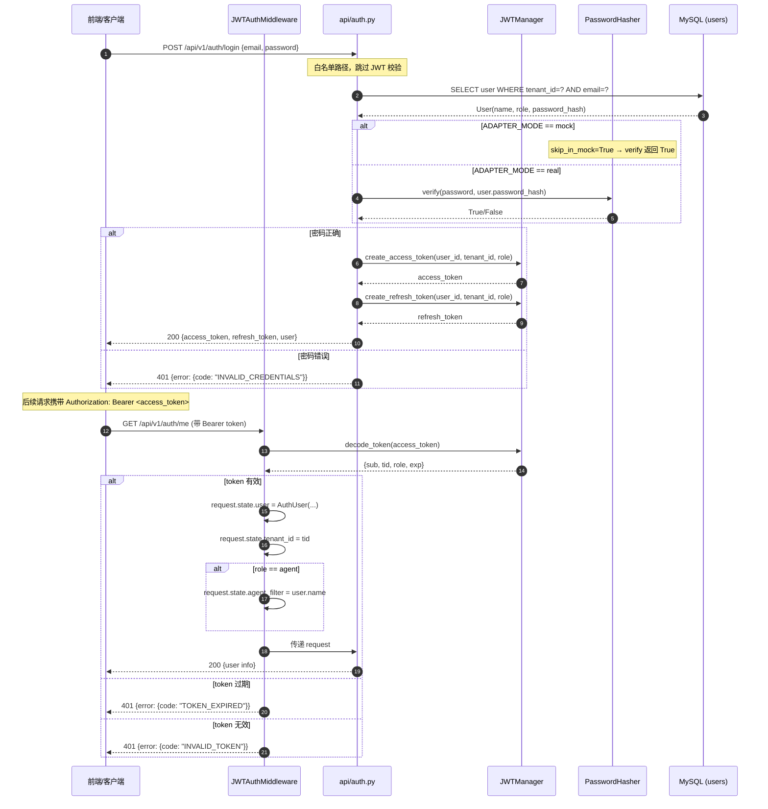
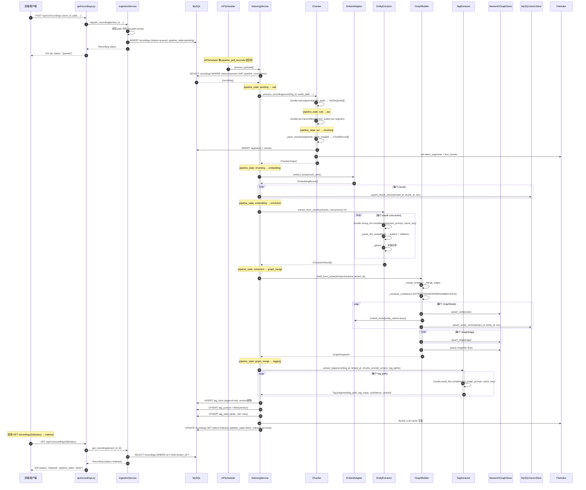
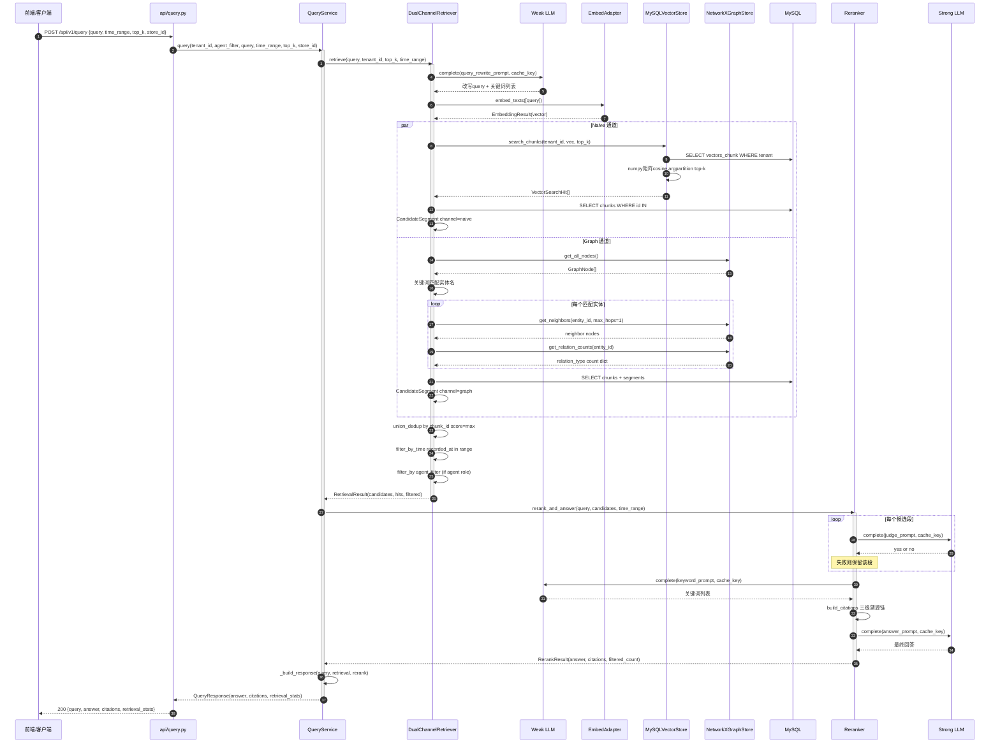
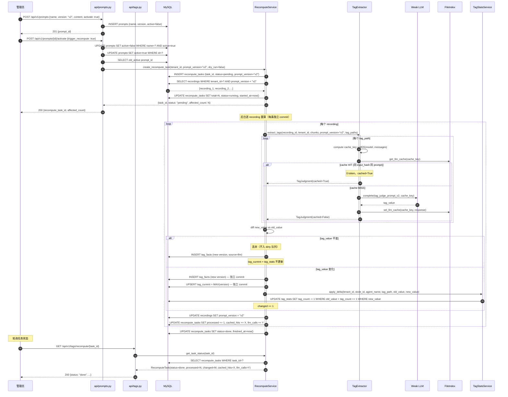
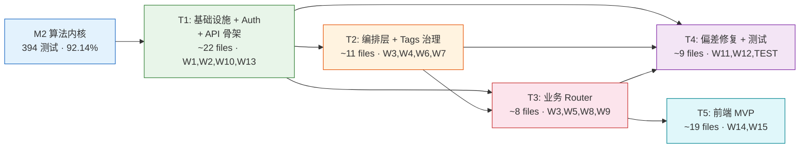

# AudioGraphy M3 架构设计文档 — 完整闭环 MVP（多租户 HTTP 服务 + 前端 + 偏差修复）

> **里程碑**: M3 · 完整闭环 MVP（upload → index → query → tag → recompute → view）
> **版本**: v2.0 · 2026-07 · **范围扩大版（深度审计后重写）**
> **作者**: 高见远 (Gao) · 架构师
> **权威源**: `docs/DESIGN.md` §2, §6, §12, §13, §14 · `docs/m3-prd.md` v1.0 · `docs/m3-gap-audit.md`
> **前置**: M1（基础设施 · 190 测试）+ M2（算法内核 · 394 测试 · 92.14% 覆盖率）

---

## 目录

1. [实现方案概览](#1-实现方案概览)
2. [文件列表（含相对路径）](#2-文件列表含相对路径)
3. [后端模块详细设计](#3-后端模块详细设计)
4. [数据库变更](#4-数据库变更)
5. [数据结构和接口（类图）](#5-数据结构和接口类图)
6. [程序调用流程（时序图）](#6-程序调用流程时序图)
7. [任务列表（CRITICAL — 实现顺序）](#7-任务列表critical--实现顺序)
8. [前端架构](#8-前端架构)
9. [依赖包列表](#9-依赖包列表)
10. [共享知识（跨文件约定）](#10-共享知识跨文件约定)
11. [待明确事项](#11-待明确事项)

---

## 1. 实现方案概览

### 1.1 核心技术挑战与对策

| # | 挑战 | 对策 | 决策依据 |
|---|------|------|---------|
| C1 | M2 算法内核无 HTTP 入口 | **FastAPI Router + deps.py DI 容器** | FastAPI 原生支持 async；deps.py 统一 get_db / get_current_user / get_adapters / get_stores，与 M2 的 async API 无缝衔接 |
| C2 | 多租户行级隔离遗漏风险 | **FastAPI Dependency 注入 tenant_id + 统一查询 helper** | 所有 DB 查询走 `scoped_query(session, model, tenant_id)` helper，强制 WHERE tenant_id；中间件注入 `request.state.tenant_id` |
| C3 | RBAC 矩阵覆盖度（≥ 20 组合） | **require_role() decorator 工厂 + agent_filter 中间件** | `Depends(require_role("admin"))` 声明式权限；agent 角色额外注入 `request.state.agent_filter = user.name` |
| C4 | Ingestion pipeline 编排（状态机） | **APScheduler 进程内拉队列 + IndexingService 状态机** | pipeline_concurrency=1 + asyncio.Lock 保证并发安全；状态机 pending→vad→asr→chunking→embedding→extraction→graph_merge→tagging→done |
| C5 | tag 三层 delta 重算 | **facts append + current upsert + stats delta(-old +new)** | facts 只 INSERT 不改；current 取 MAX(version)；stats 增量聚合避免全量扫描 |
| C6 | LLM 缓存幂等 + prompt 切换原子性 | **recompute_tasks 表跟踪 + 每条独立 commit** | 长任务可失败重试；recompute_tasks 表记录 status/processed/changed/cached_hits/llm_calls |
| C7 | Graph API 从 NetworkX 文件桥接 | **per-tenant NetworkXGraphStore 内存图 + GraphML load** | M2 的 graph_store 已支持 load/save；API 层从 GraphML 加载到内存，查询时读内存图 |
| C8 | 统一错误格式 | **errors.py 自定义异常 + FastAPI exception_handler** | 所有 4xx/5xx 返回 `{error: {code, message, detail}}`，HTTPException 被 wrapper 统一格式 |
| C9 | 前端图谱可视化性能（2000+ 节点） | **AntV G6 v5 force layout + LOD + Web Worker** | 节点 ≥ 2000 开 LOD 聚合；布局计算放 Worker 避免阻塞主线程 |

### 1.2 技术选型

| 层 | 技术 | 状态 |
|----|------|------|
| Web 框架 | FastAPI + Uvicorn（M1 已装） | ✅ 已有 |
| ORM | SQLAlchemy 2.0 async + aiomysql（M1 已装） | ✅ 已有 |
| JWT 鉴权 | **pyjwt[crypto]** ≥2.10（M1 已装） | ✅ 已有 |
| 密码哈希 | **passlib[bcrypt]** ≥1.7.4（M1 已装） | ✅ 已有 |
| Pipeline Worker | **apscheduler** ≥3.10（M1 已装） | ✅ 已有 |
| Token 估算 | **tiktoken** ≥0.8（M1 已装，M2 未用，M3 启用） | ✅ 已有 |
| 验证 | Pydantic ≥2.10（M1 已装） | ✅ 已有 |
| 前端 UI | React 18 + Vite 6 + Arco Design Web（已有骨架） | ✅ 已有 |
| 前端图谱 | **@antv/g6** v5（已装） | ✅ 已有 |
| 前端路由 | **react-router-dom** v7（已装） | ✅ 已有 |
| 前端状态 | **zustand** + **@tanstack/react-query**（已装） | ✅ 已有 |
| 前端 HTTP | **axios**（已装） | ✅ 已有 |

> **零新增依赖**：所有 M3 所需包在 M1 pyproject.toml 和 frontend/package.json 中已声明安装。

### 1.3 模块拓扑（按 W1-W15 工作项分组）

```
┌─────────────────────────────────────────────────────────────────────┐
│                     API Layer (api/) — W1, W13                      │
│  ┌────────┐┌─────────┐┌───────┐┌────────┐┌──────┐┌──────┐┌──────┐ │
│  │auth.py ││recordings││query ││ graph  ││tags  ││prompts││admin │ │
│  └───┬────┘└────┬────┘└──┬───┘└───┬────┘└──┬───┘└──┬───┘└──┬───┘ │
│      └─────────┴───────┴────┬───┴────┬────┴────┬───┴────┬───┘      │
│                    deps.py (共享 DI)  errors.py (统一错误)           │
│                    middleware (JWT+request_id+tenant) — W2           │
└───────────────────────────────┬─────────────────────────────────────┘
                                │
┌───────────────────────────────┴─────────────────────────────────────┐
│                  Service Layer (services/) — W3, W4, W5            │
│  ┌──────────────┐  ┌───────────────┐  ┌────────────┐               │
│  │ IngestionSvc │  │ IndexingSvc   │  │  QuerySvc  │               │
│  │ (W3 注册)     │  │ (W4 编排)      │  │ (W5 检索)   │               │
│  └──────┬───────┘  └───────┬───────┘  └─────┬──────┘               │
│         │                  │                 │                      │
│         │    ┌─────────────┘                 │                      │
│         ▼    ▼                               ▼                      │
│  scheduler.py (APScheduler — W4)    DualChannelRetriever + Reranker │
│         │                           (M2 已实现)                      │
└─────────┼───────────────────────────────────┬──────────────────────┘
          │                                    │
┌─────────┴──────────────┐    ┌────────────────┴─────────────────────┐
│  Tags Layer (tags/)    │    │  Core Layer (core/) — M2 已完成       │
│  ┌────────┐┌──────────┐│    │  chunker / extractor / graph /        │
│  │facts.py││current_  ││    │  retrieval / rerank / tag_extractor   │
│  │        ││view.py   ││    │  (W6 新增 tag_extractor)               │
│  └────────┘└──────────┘│    └───────────────────────────────────────┘
│  ┌────────┐┌──────────┐│
│  │stats.py││recompute ││    ┌───────────────────────────────────────┐
│  │        ││.py      ││    │  Storage + Adapters — M1/M2 已完成      │
│  └────────┘└──────────┘│    │  file_index / mysql_vector /           │
│  (W6, W7)               │    │  graph_networkx + mock adapters        │
└─────────────────────────┘    └───────────────────────────────────────┘

┌─────────────────────────────────────────────────────────────────────┐
│                    Auth Layer (auth/) — W2                         │
│  jwt_manager.py / password_hasher.py / roles.py / middleware.py     │
│  tenants.py                                                        │
└─────────────────────────────────────────────────────────────────────┘

┌─────────────────────────────────────────────────────────────────────┐
│              Frontend (frontend/src/) — W14, W15                  │
│  routes/dashboard / recordings / graph                              │
│  components/GraphCanvas (G6 v5) / EntityPropertyPanel / RecordingList│
│  api/ (axios client) / stores/ (zustand)                            │
└─────────────────────────────────────────────────────────────────────┘
```

### 1.4 与 M2 现有代码的衔接点

| M2 模块 | M3 衔接方式 |
|---------|-------------|
| `core/chunker.py` | IndexingService 调用 `Chunker.process_recording()`；W11 升级 `_estimate_tokens` 用 tiktoken；W12 改 `_transcribe_segments` 传段级时间戳 |
| `core/extractor.py` | IndexingService 调用 `EntityExtractor.extract_from_chunks()` |
| `core/graph.py` | IndexingService 调用 `GraphBuilder.build_from_extractions()` |
| `core/retrieval.py` | QueryService 调用 `DualChannelRetriever.retrieve()` |
| `core/rerank.py` | QueryService 调用 `Reranker.rerank_and_answer()` |
| `storage/file_index.py` | IndexingService 管理 working_dir lifecycle；tags/recompute 查 LLM cache |
| `storage/mysql_vector.py` | IndexingService 写入 vectors；QueryService 检索 |
| `storage/graph_networkx.py` | IndexingService 写图；Graph API 查图（per-tenant load） |
| `adapters/bundle.py` | deps.py 的 `get_adapters()` 返回全局单例 AdapterBundle |
| `models/*` | 所有 ORM 模型直接复用（W12 新增 password_hash 列） |

---

## 2. 文件列表（含相对路径）

> 所有后端路径相对于 `backend/audio_graphy/`，前端路径相对于 `frontend/src/`

### 2.1 新增后端文件

#### auth/ — 鉴权子系统（W2）

| 文件 | 职责 | W 项 |
|------|------|------|
| `auth/__init__.py` | 包初始化 | W2 |
| `auth/jwt_manager.py` | JWT 签发/校验（HS256，payload: sub/tid/role/exp） | W2 |
| `auth/password_hasher.py` | bcrypt 密码哈希（passlib），mock 模式可跳过 | W2 |
| `auth/roles.py` | 4 角色 RBAC 矩阵 + require_role() 依赖工厂 | W2 |
| `auth/middleware.py` | JWT 校验中间件 + tenant_id 注入 + request_id 注入 + agent_filter | W2 |
| `auth/tenants.py` | 跨租户隔离 helper（404 而非 403） | W2 |

#### errors/ — 统一错误处理（W1）

| 文件 | 职责 | W 项 |
|------|------|------|
| `errors.py` | AudioGraphyHTTPError 基类 + 子类 + FastAPI exception_handler 注册 | W1 |

#### schemas/ — Pydantic 请求/响应模型（W1）

| 文件 | 职责 | W 项 |
|------|------|------|
| `schemas/__init__.py` | 包初始化 | W1 |
| `schemas/auth.py` | LoginRequest / TokenResponse / UserInfo | W1 |
| `schemas/recordings.py` | RecordingCreate / RecordingResponse / RecordingListResponse / StatusResponse | W1 |
| `schemas/query.py` | QueryRequest / QueryResponse / CitationSchema / RetrievalStats | W1 |
| `schemas/graph.py` | GraphData / GraphNodeSchema / GraphEdgeSchema / EntityDetail | W1 |
| `schemas/tags.py` | TagView / TagCreateRequest / TagResult / RecomputeRequest / RecomputeStatus | W1 |
| `schemas/prompts.py` | PromptCreate / PromptResponse / ActivateRequest | W1 |
| `schemas/stats.py` | StatsQuery / StatsResponse | W1 |
| `schemas/common.py` | PaginatedResponse / ErrorResponse / HealthResponse | W1 |

#### api/ — FastAPI Router（W1, W3, W5, W8, W9, W10, W13）

| 文件 | 职责 | W 项 |
|------|------|------|
| `api/__init__.py` | 包初始化 | W1 |
| `api/deps.py` | 共享依赖：get_db / get_current_user / get_adapters / get_stores / get_graph_store | W1 |
| `api/auth.py` | POST /login · POST /refresh · GET /me | W2 |
| `api/recordings.py` | POST /recordings · GET /recordings · GET /recordings/{id} · GET /recordings/{id}/status · POST /recordings/{id}/reindex · GET /recordings/{id}/segments | W3 |
| `api/query.py` | POST /query | W5 |
| `api/graph.py` | GET /graph/explore · GET /graph/entity/{name} · GET /graph/subgraph | W9 |
| `api/tags.py` | GET /recordings/{id}/tags · POST /recordings/{id}/tags · POST /tags/recompute · GET /tags/recompute/{task_id} | W8 |
| `api/prompts.py` | GET /prompts · POST /prompts · GET /prompts/{id} · POST /prompts/{id}/activate | W8 |
| `api/stats.py` | GET /tags/stats | W8 |
| `api/admin.py` | GET /admin/tenants · GET /admin/users | W10 |
| `api/health.py` | GET /health · GET /api/v1/health/readiness | W13 |

#### services/ — 编排层（W3, W4, W5）

| 文件 | 职责 | W 项 |
|------|------|------|
| `services/__init__.py` | 包初始化 | W4 |
| `services/ingestion.py` | IngestionService：录音注册 + 状态查询 + reindex 触发 | W3 |
| `services/indexing.py` | IndexingService：pipeline 编排（VAD→ASR→chunk→embed→extract→graph→tag） | W4 |
| `services/query.py` | QueryService：调 DualChannelRetriever + Reranker，组装 response | W5 |

#### scheduler/ — Pipeline Worker（W4）

| 文件 | 职责 | W 项 |
|------|------|------|
| `scheduler.py` | APScheduler pipeline worker（拉队列 + IndexingService 执行） | W4 |

#### tags/ — 标签治理（W6, W7）

| 文件 | 职责 | W 项 |
|------|------|------|
| `tags/__init__.py` | 包初始化 | W7 |
| `tags/facts.py` | TagFactsService：append-only 写入 + version 递增 | W7 |
| `tags/current_view.py` | TagCurrentService：upsert MAX(version) | W7 |
| `tags/stats.py` | TagStatsService：delta 聚合（-old +new） | W7 |
| `tags/recompute.py` | RecomputeService：prompt 切换 diff + 增量重算 + recompute_tasks 跟踪 | W7 |

#### core/ 新增（W6）

| 文件 | 职责 | W 项 |
|------|------|------|
| `core/tag_extractor.py` | TagExtractor：用 weak_llm 判定 tag_value | W6 |

#### models/ 修改

| 文件 | 修改 | W 项 |
|------|------|------|
| `models/user.py` | 新增 `password_hash: Mapped[str \| None]` VARCHAR(128) | W2 |
| `models/recompute_task.py` | **新建** RecomputeTask ORM 模型 | W7 |

### 2.2 修改后端文件

| 文件 | 修改内容 | W 项 |
|------|---------|------|
| `main.py` | 注册所有 router + 中间件链 + lifespan 启动 scheduler + exception_handler | W1, W4, W13 |
| `core/chunker.py:299-314` | `_estimate_tokens` 从 `len//2` 升级为 tiktoken（W11） | W11 |
| `core/chunker.py:207` | `_transcribe_segments` 传段级 start_sec/end_sec 给 ASR（W12） | W12 |
| `adapters/protocols.py:82-90` | ASRResult 新增 `start_sec` / `end_sec` 可选字段（W12） | W12 |
| `config.py` | 新增 `jwt_refresh_exp_hours` / `bcrypt_rounds` 配置项 | W2 |

### 2.3 新增前端文件

| 文件 | 职责 | W 项 |
|------|------|------|
| `App.tsx` | 改写：Arco Layout + react-router 路由 + QueryClientProvider | W14 |
| `main.tsx` | 改写：ArcoProvider + BrowserRouter 挂载 | W14 |
| `routes/__init__.py` | — | W14 |
| `routes/Dashboard.tsx` | 仪表盘页面（KPI 卡片） | W14 |
| `routes/Recordings.tsx` | 录音列表（Table + 筛选） | W14 |
| `routes/RecordingDetail.tsx` | 录音详情（Tabs + 段级 transcript + tags） | W14 |
| `routes/GraphExplorer.tsx` | 图谱浏览器页面（G6 画布 + 属性面板） | W15 |
| `components/Layout.tsx` | 主布局（Header + Sider + Content） | W14 |
| `components/GraphCanvas/index.tsx` | G6 v5 图谱画布（force + LOD + confidence 染色） | W15 |
| `components/GraphCanvas/types.ts` | 图数据 TS 类型 | W15 |
| `components/EntityPropertyPanel/index.tsx` | 实体属性侧栏 | W15 |
| `components/RecordingList/index.tsx` | 录音列表组件（Arco Table） | W14 |
| `api/client.ts` | axios 实例（baseURL + interceptor 注入 JWT） | W14 |
| `api/auth.ts` | 登录/me API | W14 |
| `api/recordings.ts` | 录音 CRUD API | W14 |
| `api/graph.ts` | 图谱 API | W15 |
| `stores/authStore.ts` | zustand auth store（token / user / login / logout） | W14 |
| `stores/graphStore.ts` | zustand graph store（选中节点 / 过滤条件） | W15 |
| `types/graph.ts` | 前端共享类型 | W14 |

### 2.4 新增测试文件

| 文件 | 职责 | W 项 |
|------|------|------|
| `tests/test_auth_flow.py` | login → token → /me → 跨租户 404 → 过期 401 → 角色越权 403 | W2 |
| `tests/test_ingest_pipeline.py` | upload → status 轮询 → indexed → segments → tags | W3, W4 |
| `tests/test_query_retrieve.py` | query → answer + citations → 时间过滤 → 双通道 | W5 |
| `tests/test_tags_recompute.py` | 打标 → activate v2 → recompute → stats delta → 缓存命中 | W7 |
| `tests/test_rbac_matrix.py` | 4 角色 × 关键端点 ≥ 20 组合 | W2 |
| `tests/test_graph_api.py` | explore → entity → subgraph | W9 |
| `tests/test_scheduler.py` | APScheduler 拉队列 + 状态机推进 | W4 |

### 2.5 文件总数统计

| 目录 | 新建 .py | 修改 .py | 新建 .tsx/.ts | 合计 |
|------|---------|---------|-------------|------|
| `auth/` | 6 | 0 | 0 | 6 |
| `errors.py` | 1 | 0 | 0 | 1 |
| `schemas/` | 9 | 0 | 0 | 9 |
| `api/` | 12 | 0 | 0 | 12 |
| `services/` | 4 | 0 | 0 | 4 |
| `scheduler.py` | 1 | 0 | 0 | 1 |
| `tags/` | 5 | 0 | 0 | 5 |
| `core/tag_extractor.py` | 1 | 0 | 0 | 1 |
| `core/chunker.py` | 0 | 1 | 0 | 1 |
| `core/` (protocols) | 0 | 1 | 0 | 1 |
| `models/` | 1 | 1 | 0 | 2 |
| `main.py` | 0 | 1 | 0 | 1 |
| `config.py` | 0 | 1 | 0 | 1 |
| `alembic/` | 1 | 0 | 0 | 1 |
| `frontend/src/` | 0 | 0 | 19 | 19 |
| `tests/` | 7 | 0 | 0 | 7 |
| **合计** | **48** | **5** | **19** | **72** |

---

## 3. 后端模块详细设计

### 3.1 auth/ 模块

#### 3.1.1 JWTManager (`auth/jwt_manager.py`)

```python
class JWTManager:
    """JWT 签发与校验。

    - HS256 签名（对称密钥，jwt_secret）
    - access_token payload: {sub, tid, role, exp, iat, type="access"}
    - refresh_token payload: {sub, tid, role, exp, iat, type="refresh"}
    - refresh 有效期 = access × 7
    """
    def __init__(self, secret: str, algorithm: str, exp_hours: int, refresh_exp_hours: int): ...
    def create_access_token(self, user_id: int, tenant_id: str, role: str) -> str: ...
    def create_refresh_token(self, user_id: int, tenant_id: str, role: str) -> str: ...
    def decode_token(self, token: str) -> dict: ...  # raises JWTError on invalid/expired
```

#### 3.1.2 PasswordHasher (`auth/password_hasher.py`)

```python
class PasswordHasher:
    """bcrypt 密码哈希。

    ADAPTER_MODE=mock 时可跳过密码校验（返回 True），
    方便开发/测试。real 模式强制 bcrypt 验证。
    """
    def __init__(self, skip_in_mock: bool = True): ...
    def hash(self, password: str) -> str: ...
    def verify(self, password: str, hashed: str | None) -> bool: ...
```

#### 3.1.3 RoleGuard (`auth/roles.py`)

```python
ROLE_HIERARCHY = {"admin": 4, "inspector": 3, "agent": 2, "viewer": 1}

def require_role(min_role: str) -> Callable:
    """FastAPI 依赖工厂：校验当前用户角色 >= min_role。

    Usage:
        @router.post("/recordings", dependencies=[Depends(require_role("admin"))])
    """
    async def _check(user: AuthUser = Depends(get_current_user)) -> AuthUser: ...
    return _check
```

#### 3.1.4 TenantContext (`auth/tenants.py`)

```python
def scoped_select(stmt, model: type, tenant_id: str):
    """给 SELECT 语句自动加 WHERE tenant_id = :tenant_id。

    所有 TenantScopedBase 子类的查询必须走此 helper。
    """

def check_tenant_or_404(resource_tenant_id: str, current_tenant_id: str):
    """跨租户访问统一返回 404（不暴露存在性）。"""
    if resource_tenant_id != current_tenant_id:
        raise NotFoundError("RESOURCE_NOT_FOUND", "资源不存在")
```

#### 3.1.5 中间件链 (`auth/middleware.py`)

中间件执行顺序（从外到内）：

```
Request → CORSMiddleware → RequestIDMiddleware → JWTAuthMiddleware → Router
```

| 中间件 | 注入 | 说明 |
|--------|------|------|
| RequestIDMiddleware | `request.state.request_id` + 响应头 `X-Request-ID` | UUID4 per request |
| JWTAuthMiddleware | `request.state.user` (AuthUser) + `request.state.tenant_id` + `request.state.agent_filter` | 白名单路径（/health, /api/v1/auth/login）跳过 JWT |

**AuthUser dataclass**（中间件产出，注入 request.state）：

```python
@dataclass(frozen=True, slots=True)
class AuthUser:
    id: int
    name: str
    email: str
    role: str           # admin/inspector/agent/viewer
    tenant_id: str      # 租户 ID
```

### 3.2 services/ 编排层

#### 3.2.1 IngestionService (`services/ingestion.py`)

```python
class IngestionService:
    """录音注册 + 状态查询 + reindex 触发。

    POST /recordings → 注册路径 → status=queued → scheduler 拉取
    """
    def __init__(self, session_factory, settings): ...

    async def register_recording(
        self, tenant_id: str, store_id: str, path: str,
        agent_name: str | None, customer_hash: str | None,
        recorded_at: datetime | None, prompt_version: str | None,
    ) -> Recording:
        """注册新录音。校验 path 存在、查重、INSERT → status=queued。"""
        ...

    async def list_recordings(
        self, tenant_id: str, *, page: int, page_size: int,
        store_id: str | None, status: str | None,
        agent_name: str | None, recorded_from: datetime | None,
        recorded_to: datetime | None, sort: str,
    ) -> tuple[list[Recording], int]:
        """录音列表（含 tenant + agent_filter 筛选）。"""
        ...

    async def get_recording(self, tenant_id: str, recording_id: int) -> Recording:
        """录音详情。跨租户 → 404。"""
        ...

    async def trigger_reindex(self, tenant_id: str, recording_id: int, force: bool) -> None:
        """重置 status=queued, pipeline_state=pending。"""
        ...
```

#### 3.2.2 IndexingService (`services/indexing.py`)

**状态机**（pipeline_state 字段驱动）：

```
pending → vad → asr → chunking → embedding → extraction → graph_merge → tagging → done
                                                                                   ↘ error
```

```python
class IndexingService:
    """Pipeline 编排 — 串联 M2 核心算法模块。

    被 APScheduler 拉队列调用（pipeline_concurrency=1 + asyncio.Lock）。
    """
    def __init__(self, bundle: AdapterBundle, session_factory,
                 vector_store: MySQLVectorStore, settings): ...

    async def process_queued(self) -> int:
        """拉取 status=queued 的录音，逐条执行 pipeline。返回处理数。"""
        async with self._lock:  # pipeline_concurrency=1
            recordings = await self._fetch_queued()
            for rec in recordings:
                await self._run_pipeline(rec)

    async def _run_pipeline(self, recording: Recording) -> None:
        """执行完整 pipeline：更新 pipeline_state 各阶段。"""
        # 1. chunker.process_recording() → segments + chunks
        # 2. embed.embed_texts(chunk_texts) → vector_store.upsert_chunk_vector()
        # 3. extractor.extract_from_chunks() → ExtractionResult[]
        # 4. graph_builder.build_from_extractions() → GraphSnapshot
        # 5. graph_store.save() → GraphML flush
        # 6. tag_extractor.extract_tags() → tag_facts + tag_current + tag_stats
        # 7. recording.status = indexed, pipeline_state = done
        ...
```

#### 3.2.3 QueryService (`services/query.py`)

```python
class QueryService:
    """问答检索编排 — 调 DualChannelRetriever + Reranker。

    POST /query → 组装 RetrievalResult + RerankResult → QueryResponse
    """
    def __init__(self, retriever: DualChannelRetriever, reranker: Reranker,
                 session_factory, settings): ...

    async def query(
        self, tenant_id: str, agent_filter: str | None,
        query: str, time_range: tuple[datetime, datetime] | None,
        top_k: int, store_id: str | None,
    ) -> QueryResponse:
        """执行双通道检索 + 重排 + 回答生成。"""
        retrieval = await self._retriever.retrieve(
            query=query, tenant_id=tenant_id, top_k=top_k, time_range=time_range
        )
        rerank = await self._reranker.rerank_and_answer(
            query=query, candidates=retrieval.candidates, time_range=time_range
        )
        return self._build_response(query, retrieval, rerank)
```

### 3.3 tags/ 三层服务

#### 3.3.1 TagFactsService (`tags/facts.py`)

```python
class TagFactsService:
    """Layer 1 — tag_facts append-only 写入。

    每次 INSERT 新 version 行（version = MAX(version) + 1），
    携带完整配方（prompt_version / model_version / input_hash / confidence）。
    """
    async def append(
        self, tenant_id: str, recording_id: int, tag_path: str,
        tag_value: str, prompt_version: str, model_version: str,
        source: str, input_hash: str, confidence: float | None,
        computed_by: int | None,
    ) -> TagFact: ...

    async def get_history(
        self, tenant_id: str, recording_id: int, tag_path: str | None,
    ) -> list[TagFact]: ...

    async def get_current_version(
        self, tenant_id: str, recording_id: int, tag_path: str,
    ) -> int:
        """返回当前 MAX(version)。"""
        ...
```

#### 3.3.2 TagCurrentService (`tags/current_view.py`)

```python
class TagCurrentService:
    """Layer 2 — tag_current upsert（MAX(version) 视图）。

    每次 tag_facts INSERT 后 upsert tag_current = 最新 version。
    """
    async def upsert(
        self, tenant_id: str, recording_id: int, tag_path: str,
        tag_value: str, version: int, prompt_version: str,
    ) -> None: ...

    async def get_current_tags(
        self, tenant_id: str, recording_id: int, tag_path_prefix: str | None,
    ) -> list[TagCurrent]: ...
```

#### 3.3.3 TagStatsService (`tags/stats.py`)

```python
class TagStatsService:
    """Layer 3 — tag_stats delta 增量聚合。

    tag_value 变化时：-old_value_count +new_value_count。
    """
    async def apply_delta(
        self, tenant_id: str, store_id: str, agent_name: str | None,
        tag_path: str, old_value: str | None, new_value: str,
    ) -> None:
        """-old +new 增量更新。old_value=None 表示新增，new_value=None 表示删除。"""
        ...

    async def get_stats(
        self, tenant_id: str, store_id: str | None, agent_name: str | None,
        tag_path_prefix: str | None, tag_value: str | None, group_by: str,
    ) -> list[dict]: ...
```

#### 3.3.4 RecomputeService (`tags/recompute.py`)

```python
class RecomputeService:
    """Prompt 版本切换 → diff → 增量重算。

    流程：
    1. 查 prompt_version < target 的 recording 列表
    2. 逐 recording 重打（LLM cache 幂等）
    3. diff v_new vs v_old
    4. 只 commit 变化的 tag_facts
    5. delta 更新 tag_current + tag_stats
    6. recompute_tasks 表跟踪进度
    """
    def __init__(self, facts_svc, current_svc, stats_svc,
                 tag_extractor, session_factory): ...

    async def create_recompute_task(
        self, tenant_id: str, prompt_version: str,
        tag_paths: list[str] | None, dry_run: bool,
        recording_ids: list[int] | None,
    ) -> RecomputeResult: ...

    async def _execute_recompute(self, task: RecomputeTask) -> None:
        """后台执行重算（每条独立 commit，可失败重试）。"""
        ...

    async def get_task_status(self, tenant_id: str, task_id: str) -> RecomputeTask: ...
```

### 3.4 api/deps.py 共享依赖

```python
# 全局单例（lifespan 初始化）
_bundle: AdapterBundle | None = None
_vector_store: MySQLVectorStore | None = None
_settings: Settings | None = None
_session_factory: async_sessionmaker | None = None

async def get_db() -> AsyncIterator[AsyncSession]:
    """获取 DB session（yield + auto close）。"""
    async with _session_factory() as session:
        yield session

def get_settings_dep() -> Settings: ...
def get_adapters() -> AdapterBundle: ...
def get_vector_store() -> MySQLVectorStore: ...

async def get_current_user(request: Request) -> AuthUser:
    """从 request.state.user 获取已认证用户（中间件已注入）。"""
    user = getattr(request.state, "user", None)
    if user is None:
        raise UnauthorizedError("MISSING_TOKEN")
    return user

def get_graph_store(tenant_id: str) -> NetworkXGraphStore:
    """per-tenant NetworkXGraphStore（从 GraphML load 到内存）。"""
    ...

def get_tenant_id(request: Request) -> str:
    """从中间件注入的 request.state.tenant_id 获取。"""
    return request.state.tenant_id

def get_agent_filter(request: Request) -> str | None:
    """agent 角色的数据范围限制。"""
    return getattr(request.state, "agent_filter", None)
```

---

## 4. 数据库变更

### 4.1 alembic 0002 migration

```sql
-- Migration: 0002_m3_auth_recompute
-- Description: M3 新增 password_hash 列 + recompute_tasks 表

-- 1. users 表新增 password_hash
ALTER TABLE users
    ADD COLUMN password_hash VARCHAR(128) NULL COMMENT 'bcrypt password hash (null in mock mode)';

-- 2. 新建 recompute_tasks 表
CREATE TABLE recompute_tasks (
    id              VARCHAR(128)   NOT NULL COMMENT 'task_id (如 recompute-20260716-001)',
    tenant_id       VARCHAR(64)    NOT NULL,
    prompt_version  VARCHAR(64)    NOT NULL COMMENT '目标 prompt 版本',
    status          VARCHAR(32)    NOT NULL DEFAULT 'pending'
                    COMMENT 'pending/running/done/failed',
    tag_paths       JSON           NULL     COMMENT '限定重算路径 (null=全量)',
    total           INT            NOT NULL DEFAULT 0 COMMENT '待处理总数',
    processed       INT            NOT NULL DEFAULT 0 COMMENT '已处理数',
    changed         INT            NOT NULL DEFAULT 0 COMMENT '有变化数',
    cached_hits     INT            NOT NULL DEFAULT 0 COMMENT 'LLM 缓存命中数',
    llm_calls       INT            NOT NULL DEFAULT 0 COMMENT '实际 LLM 调用数',
    started_at      DATETIME(3)    NULL     COMMENT '开始执行时间',
    finished_at     DATETIME(3)    NULL     COMMENT '完成/失败时间',
    error_message   TEXT           NULL     COMMENT '失败原因',
    created_at      DATETIME(3)    NOT NULL DEFAULT CURRENT_TIMESTAMP(3),
    updated_at      DATETIME(3)    NOT NULL DEFAULT CURRENT_TIMESTAMP(3) ON UPDATE CURRENT_TIMESTAMP(3),
    PRIMARY KEY (id),
    INDEX ix_recompute_tasks_tenant_status (tenant_id, status),
    INDEX ix_recompute_tasks_prompt (prompt_version),
    CONSTRAINT ck_recompute_tasks_status CHECK (
        status IN ('pending', 'running', 'done', 'failed')
    )
) ENGINE=InnoDB DEFAULT CHARSET=utf8mb4 COLLATE=utf8mb4_unicode_ci;
```

### 4.2 新增 ORM 模型：RecomputeTask

```python
# models/recompute_task.py

class RecomputeTask(Base):
    """重算任务跟踪表 | Recompute task tracker."""
    __tablename__ = "recompute_tasks"

    task_id: Mapped[str] = mapped_column(String(128), primary_key=True)  # 注意：不用 Base.id
    tenant_id: Mapped[str] = mapped_column(String(64), nullable=False, index=True)
    prompt_version: Mapped[str] = mapped_column(String(64), nullable=False)
    status: Mapped[str] = mapped_column(String(32), nullable=False, default="pending")
    tag_paths: Mapped[list[str] | None] = mapped_column(JSON, nullable=True)
    total: Mapped[int] = mapped_column(Integer, nullable=False, default=0)
    processed: Mapped[int] = mapped_column(Integer, nullable=False, default=0)
    changed: Mapped[int] = mapped_column(Integer, nullable=False, default=0)
    cached_hits: Mapped[int] = mapped_column(Integer, nullable=False, default=0)
    llm_calls: Mapped[int] = mapped_column(Integer, nullable=False, default=0)
    started_at: Mapped[datetime | None] = mapped_column(DateTime(timezone=True), nullable=True)
    finished_at: Mapped[datetime | None] = mapped_column(DateTime(timezone=True), nullable=True)
    error_message: Mapped[str | None] = mapped_column(Text, nullable=True)
```

> **注意**：RecomputeTask 使用 `task_id` (VARCHAR) 作主键，而非 Base 的 BigInteger `id`。需覆写 `__table_args__` 移除 Base 的 id 列，或单独继承 `DeclarativeBase`。

### 4.3 索引调整

无需额外索引调整。M1 建表时已预留的索引覆盖 M3 全部查询路径：
- `ix_recordings_tenant_status` — pipeline worker 拉队列
- `ix_recordings_prompt_version` — recompute 查影响范围
- `ux_tag_facts_recording_path_version` — version 查询
- `ux_tag_current_recording_path` — current tags 查询
- `ux_tag_stats_dim` — stats 聚合查询

### 4.4 测试种子数据

```sql
-- 2 租户 × 4 用户
INSERT INTO tenants (code, name, brand) VALUES
    ('chang_an', '长安汽车测试租户', '长安汽车'),
    ('byd_test', '比亚迪测试租户', '比亚迪');

INSERT INTO users (tenant_id, name, email, role, password_hash) VALUES
    ('chang_an', '张管理', 'admin@changantest.com', 'admin', '$2b$12$...'),
    ('chang_an', '李质检', 'inspector@changantest.com', 'inspector', '$2b$12$...'),
    ('chang_an', '王坐席', 'agent@changantest.com', 'agent', '$2b$12$...'),
    ('chang_an', '赵查看', 'viewer@changantest.com', 'viewer', '$2b$12$...'),
    ('byd_test', '管理B', 'admin@bydtest.com', 'admin', '$2b$12$...'),
    ('byd_test', '质检B', 'inspector@bydtest.com', 'inspector', '$2b$12$...'),
    ('byd_test', '坐席B', 'agent@bydtest.com', 'agent', '$2b$12$...'),
    ('byd_test', '查看B', 'viewer@bydtest.com', 'viewer', '$2b$12$...');
```

> mock 模式下 password_hash 可设为固定值，PasswordHasher.verify 跳过。

---

## 5. 数据结构和接口（类图）

### 5.1 auth 模块类图



### 5.2 tags 模块类图



### 5.3 services 模块类图



### 5.4 完整模块依赖关系图



---

## 6. 程序调用流程（时序图）

### 6.1 登录 + 后续认证流



### 6.2 录音入库流



### 6.3 问答检索流



### 6.4 Prompt 切换重算流



---

## 7. 任务列表（CRITICAL — 实现顺序）

> 按依赖关系排序，每组是寇豆码的一个实现 turn。

### 7.1 任务总览

| ID | 标题 | 对应 W 项 | 涉及文件数 | 依赖 | 优先级 |
|----|------|----------|-----------|------|--------|
| T1 | 基础设施：errors + schemas + alembic 0002 + config | W1 | 14 | M2 | P0 |
| T2 | Auth 子系统：JWT + 密码 + RBAC + 中间件 | W2 | 7 | T1 | P0 |
| T3 | API 骨架 + deps + main.py + /ready | W1, W13 | 3 | T1, T2 | P0 |
| T4 | 编排层：IngestionService + IndexingService + scheduler | W3, W4 | 4 | T3 | P0 |
| T5 | 业务 router 后端：recordings + segments + query + graph + tags + prompts + stats + admin | W3, W5, W8, W9, W10 | 8 | T3, T4 | P0 |
| T6 | Tags 治理：facts + current + stats + recompute + tag_extractor | W6, W7 | 6 | T4 | P0 |

> **注意**：受限于 ≤ 5 任务硬上限，以下将 W11/W12 偏差修复合入 T1（tiktoken 已在依赖），前端合入独立 task。

### 7.2 修正任务列表（≤ 5 任务）

| ID | 标题 | 对应 W 项 | 涉及文件 | 依赖 |
|----|------|----------|---------|------|
| **T1** | 项目基础设施：errors + schemas + alembic 0002 + auth 子系统 + config + API 骨架 + main.py + /ready | W1, W2, W10(admin), W13 | errors.py + schemas/*.py(9) + auth/*.py(6) + api/deps.py + api/__init__.py + api/health.py + api/admin.py + models/recompute_task.py + models/user.py(改) + alembic/0002 + config.py(改) + main.py(改) | M2 |
| **T2** | 编排层 + tag_extractor + tags 三层服务：IngestionService + IndexingService + scheduler + TagExtractor + facts/current/stats/recompute | W3, W4, W6, W7 | services/ingestion.py + services/indexing.py + services/query.py + services/__init__.py + scheduler.py + core/tag_extractor.py + tags/*.py(5) | T1 |
| **T3** | 业务 router：recordings + segments + query + graph + tags + prompts + stats API | W3, W5, W8, W9 | api/recordings.py + api/segments(合入recordings) + api/query.py + api/graph.py + api/tags.py + api/prompts.py + api/stats.py + api/auth.py | T1, T2 |
| **T4** | 偏差修复 + 集成测试：tiktoken 升级 + ASR Protocol 段级签名 + RBAC 矩阵测试 + E2E 测试 | W11, W12, TEST | core/chunker.py(改) + adapters/protocols.py(改) + tests/*.py(7) | T1, T2, T3 |
| **T5** | 前端 MVP：骨架铺开 + dashboard + recordings list + 图谱浏览器 | W14, W15 | frontend/src/ 全部(19 个 .tsx/.ts) | T3 |

### 7.3 任务详情

---

#### T1: 项目基础设施 + Auth 子系统 + API 骨架

| 属性 | 值 |
|------|------|
| **对应 W 项** | W1, W2, W10, W13 |
| **优先级** | P0 |
| **依赖** | M2（已完成） |

**涉及文件**（~22 个）：

| 文件 | 类型 |
|------|------|
| `errors.py` | 新建 |
| `schemas/__init__.py` | 新建 |
| `schemas/auth.py` | 新建 |
| `schemas/recordings.py` | 新建 |
| `schemas/query.py` | 新建 |
| `schemas/graph.py` | 新建 |
| `schemas/tags.py` | 新建 |
| `schemas/prompts.py` | 新建 |
| `schemas/stats.py` | 新建 |
| `schemas/common.py` | 新建 |
| `auth/__init__.py` | 新建 |
| `auth/jwt_manager.py` | 新建 |
| `auth/password_hasher.py` | 新建 |
| `auth/roles.py` | 新建 |
| `auth/middleware.py` | 新建 |
| `auth/tenants.py` | 新建 |
| `api/__init__.py` | 新建 |
| `api/deps.py` | 新建 |
| `api/health.py` | 新建 |
| `api/admin.py` | 新建 |
| `models/recompute_task.py` | 新建 |
| `models/user.py` | 修改（加 password_hash） |
| `alembic/versions/0002_m3_auth_recompute.py` | 新建 |
| `config.py` | 修改（加 jwt_refresh_exp_hours / bcrypt_rounds） |
| `main.py` | 修改（注册中间件 + health + admin router） |

**验收要点**：
- [ ] `errors.py` 定义 AudioGraphyHTTPError 基类 + 子类（NotFoundError / UnauthorizedError / ForbiddenError / ConflictError / ValidationError），FastAPI exception_handler 统一返回 `{error: {code, message, detail}}`
- [ ] `schemas/*.py` 所有请求/响应模型用 Pydantic v2 BaseModel，字段类型注解完整
- [ ] `auth/jwt_manager.py`：create_access_token / create_refresh_token / decode_token，HS256 签名
- [ ] `auth/password_hasher.py`：bcrypt 哈希 + mock 模式跳过
- [ ] `auth/roles.py`：require_role() 依赖工厂，4 角色层级 admin > inspector > agent > viewer
- [ ] `auth/middleware.py`：RequestIDMiddleware + JWTAuthMiddleware，注入 request.state.user / tenant_id / agent_filter
- [ ] `auth/tenants.py`：scoped_select() + check_tenant_or_404()
- [ ] `api/deps.py`：get_db / get_current_user / get_adapters / get_vector_store / get_graph_store / get_tenant_id / get_agent_filter
- [ ] `api/health.py`：GET /health（存活）+ GET /api/v1/health/readiness（DB + adapters 连通性）
- [ ] `api/admin.py`：GET /admin/tenants + GET /admin/users（admin only）
- [ ] `models/recompute_task.py`：RecomputeTask ORM，task_id VARCHAR 主键
- [ ] `alembic/0002`：users 加 password_hash + 新建 recompute_tasks 表
- [ ] `main.py`：注册中间件链 + CORS + health router + admin router
- [ ] `ruff check && mypy strict` 全过

---

#### T2: 编排层 + Tag 治理

| 属性 | 值 |
|------|------|
| **对应 W 项** | W3, W4, W6, W7 |
| **优先级** | P0 |
| **依赖** | T1 |

**涉及文件**（~11 个）：

| 文件 | 类型 |
|------|------|
| `services/__init__.py` | 新建 |
| `services/ingestion.py` | 新建 |
| `services/indexing.py` | 新建 |
| `services/query.py` | 新建 |
| `scheduler.py` | 新建 |
| `core/tag_extractor.py` | 新建 |
| `tags/__init__.py` | 新建 |
| `tags/facts.py` | 新建 |
| `tags/current_view.py` | 新建 |
| `tags/stats.py` | 新建 |
| `tags/recompute.py` | 新建 |

**验收要点**：
- [ ] `services/ingestion.py`：register_recording（校验 path、查重、INSERT status=queued）+ list_recordings（tenant + agent_filter 筛选）+ get_recording（跨租户 404）+ trigger_reindex
- [ ] `services/indexing.py`：process_queued（asyncio.Lock + 拉 queued 列表）+ _run_pipeline（状态机 pending→...→done）串联 chunker/extractor/graph_builder/vector_store/tag_extractor
- [ ] `services/query.py`：调 DualChannelRetriever + Reranker，组装 QueryResponse
- [ ] `scheduler.py`：APScheduler AsyncIOScheduler，interval=pipeline_poll_seconds，调 IndexingService.process_queued
- [ ] `core/tag_extractor.py`：用 weak_llm 判定 tag_value，LLM cache 幂等（cache_key = MD5(model, messages)）
- [ ] `tags/facts.py`：append-only INSERT + version = MAX(version)+1 + 携带配方（prompt_version / model_version / input_hash / confidence）
- [ ] `tags/current_view.py`：upsert = MAX(version)
- [ ] `tags/stats.py`：apply_delta(-old +new) 增量聚合
- [ ] `tags/recompute.py`：create_recompute_task + _execute_recompute（逐 recording 重打→diff→只 commit 变化→delta 聚合→recompute_tasks 跟踪）+ get_task_status
- [ ] `ruff check && mypy strict` 全过

---

#### T3: 业务 Router

| 属性 | 值 |
|------|------|
| **对应 W 项** | W3(partial), W5, W8, W9 |
| **优先级** | P0 |
| **依赖** | T1, T2 |

**涉及文件**（~8 个）：

| 文件 | 类型 |
|------|------|
| `api/auth.py` | 新建 |
| `api/recordings.py` | 新建（含 segments endpoint） |
| `api/query.py` | 新建 |
| `api/graph.py` | 新建 |
| `api/tags.py` | 新建 |
| `api/prompts.py` | 新建 |
| `api/stats.py` | 新建 |
| `main.py` | 修改（注册所有 router） |

**验收要点**：
- [ ] `api/auth.py`：POST /login（密码校验→签 JWT）+ POST /refresh + GET /me
- [ ] `api/recordings.py`：POST /recordings（admin）+ GET /recordings（分页+筛选）+ GET /recordings/{id}（详情+segments_count+current_tags）+ GET /recordings/{id}/status + POST /recordings/{id}/reindex（admin）+ GET /recordings/{id}/segments
- [ ] `api/query.py`：POST /query → QueryService
- [ ] `api/graph.py`：GET /graph/explore + GET /graph/entity/{name} + GET /graph/subgraph（per-tenant graph_store）
- [ ] `api/tags.py`：GET /recordings/{id}/tags（view=current/history/facts）+ POST /recordings/{id}/tags（mode=auto/manual）+ POST /tags/recompute + GET /tags/recompute/{task_id}
- [ ] `api/prompts.py`：GET /prompts + POST /prompts + GET /prompts/{id} + POST /prompts/{id}/activate
- [ ] `api/stats.py`：GET /tags/stats（多维聚合下钻）
- [ ] 所有端点 RBAC 矩阵正确（Depends(require_role(...))）
- [ ] 跨租户访问统一 404
- [ ] agent 角色数据范围限制（agent_filter 生效）
- [ ] `ruff check && mypy strict` 全过

---

#### T4: 偏差修复 + 集成测试

| 属性 | 值 |
|------|------|
| **对应 W 项** | W11, W12 |
| **优先级** | P0 |
| **依赖** | T1, T2, T3 |

**涉及文件**（~9 个）：

| 文件 | 类型 |
|------|------|
| `core/chunker.py` | 修改（W11: tiktoken；W12: 段级时间戳） |
| `adapters/protocols.py` | 修改（W12: ASRResult 加 start_sec/end_sec） |
| `tests/test_auth_flow.py` | 新建 |
| `tests/test_ingest_pipeline.py` | 新建 |
| `tests/test_query_retrieve.py` | 新建 |
| `tests/test_tags_recompute.py` | 新建 |
| `tests/test_rbac_matrix.py` | 新建 |
| `tests/test_graph_api.py` | 新建 |
| `tests/test_scheduler.py` | 新建 |

**验收要点**：
- [ ] W11：`core/chunker.py:_estimate_tokens` 从 `len(text)//2` 改为 `tiktoken.encoding_for_model("gpt-4").encode(text)` 长度，保留空文本返回 0
- [ ] W12：`adapters/protocols.py:ASRResult` 新增 `start_sec: float | None = None` + `end_sec: float | None = None`
- [ ] W12：`core/chunker.py:_transcribe_segments` 传 `start_sec=seg.start_sec, end_sec=seg.end_sec` 给 ASR（mock adapter 兼容：不传也能工作）
- [ ] test_auth_flow：login→token→/me→跨租户 404→过期 401→角色越权 403
- [ ] test_ingest_pipeline：upload→status 轮询→indexed→segments 可查→tags 可查
- [ ] test_query_retrieve：query→answer+citations→时间过滤→双通道命中
- [ ] test_tags_recompute：打标→activate v2→recompute→stats delta→缓存命中
- [ ] test_rbac_matrix：4 角色×关键端点 ≥ 20 组合
- [ ] M1+M2+M3 全部测试通过（pytest 0 failed）
- [ ] M3 新增代码覆盖率 ≥ 85%

---

#### T5: 前端 MVP

| 属性 | 值 |
|------|------|
| **对应 W 项** | W14, W15 |
| **优先级** | P0 |
| **依赖** | T3（后端 API 就绪） |

**涉及文件**（~19 个）：

| 文件 | 类型 |
|------|------|
| `App.tsx` | 改写 |
| `main.tsx` | 改写 |
| `routes/Dashboard.tsx` | 新建 |
| `routes/Recordings.tsx` | 新建 |
| `routes/RecordingDetail.tsx` | 新建 |
| `routes/GraphExplorer.tsx` | 新建 |
| `components/Layout.tsx` | 新建 |
| `components/GraphCanvas/index.tsx` | 新建 |
| `components/GraphCanvas/types.ts` | 新建 |
| `components/EntityPropertyPanel/index.tsx` | 新建 |
| `components/RecordingList/index.tsx` | 新建 |
| `api/client.ts` | 新建 |
| `api/auth.ts` | 新建 |
| `api/recordings.ts` | 新建 |
| `api/graph.ts` | 新建 |
| `stores/authStore.ts` | 新建 |
| `stores/graphStore.ts` | 新建 |
| `types/graph.ts` | 新建 |
| `styles/global.css` | 修改 |

**验收要点**：
- [ ] Arco Layout（Header + Sider + Content）+ react-router v7 路由
- [ ] Dashboard：KPI 卡片（录音数 / 待标 / 已索引 / 重算任务）
- [ ] Recordings List：Arco Table + 筛选（store_id / status / agent_name / 时间范围）+ 分页
- [ ] Recording Detail：Tabs（元信息 / 段级 transcript / tags）
- [ ] GraphExplorer：G6 v5 force layout + confidence 染色（EXTRACTED 实线 / INFERRED 虚线 / AMBIGUOUS 灰色点线）+ god node 高亮 + EntityPropertyPanel
- [ ] LOD：节点 ≥ 2000 开聚类合并
- [ ] axios client：baseURL + interceptor 注入 JWT Bearer token
- [ ] zustand authStore：token / user / login / logout
- [ ] 对接后端 /api/v1/graph/explore + /api/v1/recordings + /api/v1/auth/login

### 7.4 任务依赖图



> **并行机会**：T2 和 T3 都依赖 T1。T3 依赖 T2（因为 router 调 service），但 T3 的 schema/auth router 部分可以先行。T5 依赖 T3（API 就绪），但前端骨架（Layout + 路由）可在 T1 完成后并行启动。

---

## 8. 前端架构

### 8.1 路由结构（react-router v7）

```
/                        → 重定向到 /dashboard
/login                   → 登录页（无 JWT 时）
/dashboard               → 仪表盘
/recordings              → 录音列表
/recordings/:id          → 录音详情
/graph                   → ★ 图谱浏览器（核心卖点）
/tags                    → 标签统计（P1 推迟）
/prompts                 → Prompt 管理（P1 推迟）
/admin                   → 用户管理（P1 推迟）
```

### 8.2 状态管理（zustand）

```typescript
// stores/authStore.ts
interface AuthState {
  token: string | null;
  user: UserInfo | null;
  login: (email: string, password: string) => Promise<void>;
  logout: () => void;
  isAuthenticated: () => boolean;
}

// stores/graphStore.ts
interface GraphState {
  selectedNode: string | null;
  filters: {
    nodeType: string | null;
    minDegree: number;
    confidenceFilter: EdgeConfidence[];
  };
  setSelectedNode: (id: string | null) => void;
  setFilters: (filters: Partial<GraphFilters>) => void;
}
```

### 8.3 API 客户端（axios + tanstack-query）

```typescript
// api/client.ts
const client = axios.create({
  baseURL: '/api/v1',
  timeout: 30000,
});

// 请求拦截器：注入 JWT
client.interceptors.request.use((config) => {
  const token = useAuthStore.getState().token;
  if (token) {
    config.headers.Authorization = `Bearer ${token}`;
  }
  return config;
});

// 响应拦截器：统一错误处理 + token 过期跳转
client.interceptors.response.use(
  (response) => response,
  (error) => {
    if (error.response?.status === 401) {
      useAuthStore.getState().logout();
      window.location.href = '/login';
    }
    return Promise.reject(error);
  }
);
```

### 8.4 组件清单（按页面）

| 页面 | 组件 | 说明 |
|------|------|------|
| 全局 | `Layout` | Arco Layout（Header + Sider Menu + Content） |
| Dashboard | `Statistic` / `Card` / `Grid` | KPI 卡片 |
| Recordings | `RecordingList` | Arco Table + Tag + DatePicker + Form |
| RecordingDetail | `Tabs` / `Timeline` / `Collapse` | 元数据 + 段级 transcript + tags |
| **Graph** | `GraphCanvas` | **AntV G6 v5 画布（核心）** |
| Graph | `EntityPropertyPanel` | 实体属性侧栏 |
| Graph | `Input.Search` | 双搜索框 |

### 8.5 AntV G6 v5 集成方案

#### 力导向布局 + LOD

```typescript
// components/GraphCanvas/index.tsx 核心逻辑

import { Graph } from '@antv/g6';

const graph = new Graph({
  container: 'graph-container',
  width: 1200,
  height: 800,
  layout: {
    type: 'force',           // 力导向
    preventOverlap: true,
    nodeStrength: -50,
    edgeStrength: 0.7,
    linkDistance: 100,
  },
  node: {
    style: (node) => ({
      // 按类型着色
      fill: NODE_TYPE_COLORS[node.data.type] || '#999',
      // god node 放大
      size: node.data.degree > 10 ? 40 : 20,
    }),
  },
  edge: {
    style: (edge) => {
      // confidence 染色
      const styles = {
        EXTRACTED: { stroke: '#52c41a', lineWidth: 2, lineDash: [] },
        INFERRED:  { stroke: '#faad14', lineWidth: 1.5, lineDash: [5, 5] },
        AMBIGUOUS: { stroke: '#bfbfbf', lineWidth: 1, lineDash: [2, 2] },
      };
      return styles[edge.data.confidence] || styles.AMBIGUOUS;
    },
  },
  behaviors: ['zoom-canvas', 'drag-canvas', 'drag-element', 'click-select'],
});

// LOD：节点 ≥ 2000 时聚类
if (data.nodes.length >= 2000) {
  // 开启 LOD：合并社区为大节点，点击展开
  graph.setLayout({ type: 'clustering', ... });
}
```

#### confidence 染色规则

| confidence | 样式 | 含义 |
|------------|------|------|
| EXTRACTED | 绿色实线 (2px) | 原文中直接存在 |
| INFERRED | 橙色虚线 (1.5px, dash) | 跨段合并推断 |
| AMBIGUOUS | 灰色点线 (1px, dot) | 不确定待审核 |

#### god node 高亮

```typescript
// degree > 阈值的节点特殊标记
if (node.data.degree > GOD_NODE_THRESHOLD) {
  node.style = {
    ...node.style,
    size: 40,
    shadowColor: '#1890ff',
    shadowBlur: 20,
    labelText: node.data.label,
    labelPosition: 'bottom',
  };
}
```

---

## 9. 依赖包列表

### 9.1 后端（backend/pyproject.toml）

**零新增依赖**——所有 M3 所需包在 M1 已安装：

| 包 | pyproject.toml 版本 | M3 用途 | 状态 |
|----|-------------------|---------|------|
| `pyjwt[crypto]` | ≥2.10.0 | JWT 签发/校验（W2） | ✅ 已安装 |
| `passlib[bcrypt]` | ≥1.7.4 | 密码哈希（W2） | ✅ 已安装 |
| `apscheduler` | ≥3.10.4 | Pipeline worker（W4） | ✅ 已安装 |
| `tiktoken` | ≥0.8.0 | chunker token 估算升级（W11） | ✅ 已安装 |
| `fastapi` | ≥0.115.0 | Web 框架 | ✅ 已安装 |
| `pydantic` | ≥2.10.0 | schemas 请求/响应模型 | ✅ 已安装 |
| `structlog` | ≥24.4.0 | 结构化日志 | ✅ 已安装 |

### 9.2 前端（frontend/package.json）

**零新增依赖**——所有 M3 所需包在已有 package.json 中：

| 包 | 版本 | M3 用途 | 状态 |
|----|------|---------|------|
| `react-router-dom` | ^7.1.1 | 前端路由（W14） | ✅ 已安装 |
| `axios` | ^1.7.9 | HTTP 客户端（W14） | ✅ 已安装 |
| `@tanstack/react-query` | ^5.62.0 | 数据获取缓存（W14） | ✅ 已安装 |
| `zustand` | ^5.0.2 | 状态管理（W14） | ✅ 已安装 |
| `@antv/g6` | ^5.0.50 | 图谱可视化（W15） | ✅ 已安装 |
| `@arco-design/web-react` | ^2.66.3 | UI 组件库 | ✅ 已安装 |
| `dayjs` | ^1.11.13 | 日期处理 | ✅ 已安装 |

---

## 10. 共享知识（跨文件约定）

### 10.1 统一错误格式

```python
# errors.py

class AudioGraphyHTTPError(Exception):
    """所有 HTTP 异常基类。"""
    status_code: int = 500
    code: str = "INTERNAL_ERROR"

    def __init__(self, code: str | None = None, message: str = "", detail: dict | None = None):
        self.code = code or self.code
        self.message = message
        self.detail = detail or {}
        super().__init__(message)

# 子类
class NotFoundError(AudioGraphyHTTPError):
    status_code = 404
    code = "NOT_FOUND"

class UnauthorizedError(AudioGraphyHTTPError):
    status_code = 401
    code = "UNAUTHORIZED"

class ForbiddenError(AudioGraphyHTTPError):
    status_code = 403
    code = "FORBIDDEN"

class ConflictError(AudioGraphyHTTPError):
    status_code = 409
    code = "CONFLICT"

class ValidationError(AudioGraphyHTTPError):
    status_code = 422
    code = "VALIDATION_ERROR"
```

**FastAPI exception_handler 注册**：

```python
# main.py
@app.exception_handler(AudioGraphyHTTPError)
async def audiography_error_handler(request: Request, exc: AudioGraphyHTTPError):
    return JSONResponse(
        status_code=exc.status_code,
        content={
            "error": {
                "code": exc.code,
                "message": exc.message,
                "detail": exc.detail,
            }
        },
        headers={"X-Request-ID": getattr(request.state, "request_id", "")},
    )
```

**统一响应格式**（所有 4xx/5xx）：

```json
{
  "error": {
    "code": "RECORDING_NOT_FOUND",
    "message": "录音不存在",
    "detail": {"recording_id": 1001}
  }
}
```

### 10.2 request_id 中间件

```python
# auth/middleware.py

@app.middleware("http")
async def request_id_middleware(request: Request, call_next):
    request_id = request.headers.get("X-Request-ID") or str(uuid.uuid4())
    request.state.request_id = request_id

    response = await call_next(request)
    response.headers["X-Request-ID"] = request_id
    return response
```

- 每个请求注入 UUID4
- 贯穿日志（structlog bind `request_id`）
- 响应头返回 `X-Request-ID`

### 10.3 DB session 管理

```python
# api/deps.py

async def get_db() -> AsyncIterator[AsyncSession]:
    """获取 DB session。

    - 每次 request 获取独立 session
    - request 结束自动 close
    - 异常时自动 rollback
    """
    async with _session_factory() as session:
        try:
            yield session
            await session.commit()
        except Exception:
            await session.rollback()
            raise
```

### 10.4 tenant_id 注入 helper

```python
# auth/tenants.py

from sqlalchemy import select

def scoped_select(stmt, model, tenant_id: str):
    """给 SELECT 自动加 tenant_id 条件。

    所有 TenantScopedBase 子类查询必须走此 helper。
    """
    if hasattr(model, "tenant_id"):
        return stmt.where(model.tenant_id == tenant_id)
    return stmt
```

### 10.5 agent_filter helper

```python
# api/deps.py

def get_agent_filter(request: Request) -> str | None:
    """获取 agent 角色的数据范围限制。

    中间件已注入 request.state.agent_filter（仅 agent 角色有值）。
    其他角色返回 None（无限制）。
    """
    return getattr(request.state, "agent_filter", None)

# router 中使用
@router.get("/recordings")
async def list_recordings(
    tenant_id: str = Depends(get_tenant_id),
    agent_filter: str | None = Depends(get_agent_filter),
    ingestion_svc: IngestionService = Depends(get_ingestion_service),
):
    # agent_filter 非空时，查询自动加 WHERE agent_name = agent_filter
    return await ingestion_svc.list_recordings(tenant_id, agent_filter=agent_filter, ...)
```

### 10.6 前后端 API 契约同步策略

- 后端 FastAPI 自动生成 `/openapi.json` + `/docs`（Swagger UI）
- 前端可直接从 `/openapi.json` 读取端点 schema
- **M3 策略**：前端手写 TypeScript 类型（`types/graph.ts`），与后端 Pydantic schema 手动对齐
- **Phase 4 升级**：引入 `openapi-typescript` 自动生成 TS 类型

### 10.7 source_id 格式约定（沿用 M2）

```
source_id = "{recording_id}_{chunk_id}"

示例: "1_3" → recording_id=1, chunk_id=3

反查路径:
  source_id "1_3"
    → split("_") → recording_id=1, chunk_id=3
    → Chunk.segment_ids → [0, 1, 2]
    → Segment.transcript + Recording.recorded_at
```

### 10.8 LLM cache_key 约定（沿用 M2）

```python
cache_key = hashlib.md5(
    json.dumps({"model": model, "messages": list(messages)}, ensure_ascii=False).encode()
).hexdigest()

response = await bundle.weak_llm.complete(
    messages=messages,
    cache_key=cache_key,
)
```

### 10.9 working_dir per-tenant 布局

```
working_dir/
  {tenant_id}/                           # 租户隔离
    kv_store_llm_response_cache.json     # LLM 缓存
    kv_store_video_segments.json         # 段级原文
    kv_store_text_chunks.json            # chunk + 溯源
    graph_chunk_entity_relation.graphml  # 知识图谱
```

---

## 11. 待明确事项

| # | 问题 | 影响模块 | 当前假设 | 需确认方 |
|---|------|---------|---------|---------|
| A1 | **RecomputeTask 主键策略**：Base 类自带 BigInteger `id`，但 PRD 要求 task_id (VARCHAR) 作主键。是否单独继承 DeclarativeBase 跳过 Base.id？ | models | 假设 RecomputeTask 继承 DeclarativeBase（不用 Base），task_id 作 PK；created_at/updated_at 手动声明 | 工程师实现时验证 |
| A2 | **APScheduler 持久化**：jobstore 用 MemoryJobStore（进程内）还是 SQLAlchemyJobStore（持久化）？ | scheduler | M3 用 MemoryJobStore（进程重启后重新拉 queued 录音，幂等安全） | 架构师确认 |
| A3 | **Graph API per-tenant 图加载时机**：启动时全量 load 所有租户图，还是首次访问时懒加载？ | api/graph | 首次访问懒加载 + LRU 缓存（避免启动慢 + 内存浪费） | 工程师实现时决策 |
| A4 | **前端 G6 v5 API 兼容性**：G6 v5 与 v4 API 差异较大，文档中 force layout / node style 的写法需验证 | frontend | 假设 G6 v5.0.50 的 API 与文档一致；如有差异查 G6 v5 migration guide | 前端实现时验证 |
| A5 | **tiktoken encoding 选择**：用 `cl100k_base` 还是 `o200k_base`？中文 token 计数差异较大 | core/chunker | 用 `cl100k_base`（GPT-4 系列 encoding，中文场景验证充分） | 工程师实现时验证 |
| A6 | **mock 模式密码跳过的安全边界**：ADAPTER_MODE=mock 时 skip_in_mock=True 完全跳过密码。是否需要至少校验 email 存在？ | auth | mock 模式：email 必须存在 + 密码任意 → 返回 token（方便测试）；real 模式：严格 bcrypt 校验 | 已确认（PRD Q1 默认） |

---

**文档结束**

> 本架构设计文档是 M3 工程实现的设计权威源。工程师寇豆码实现时以本文档 + PRD `docs/m3-prd.md` 为准。任何偏离需经架构师确认后更新本文档。
