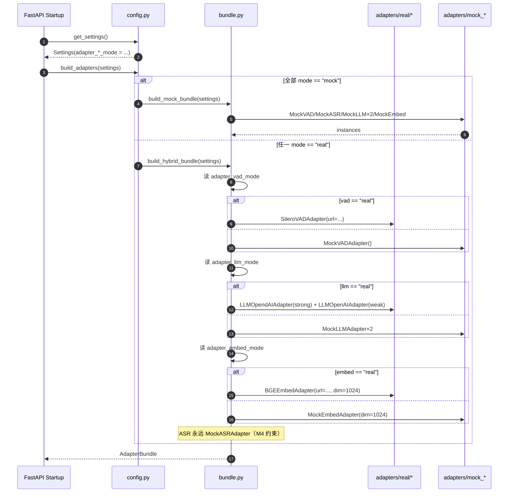
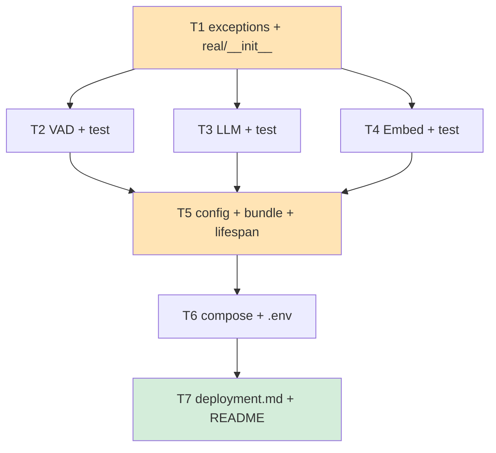

# AudioGraphy M4 架构文档 — 真实模型 Adapter 实现（Code-Ready）

| 字段 | 值 |
|------|-----|
| 版本 | v4.0.0-draft |
| 作者 | 高见远（架构师 / AI 代行） |
| 主理人 | 齐活林 |
| 日期 | 2026-07-21 |
| 前置 | `docs/m4-prd.md` |
| 基线 | M3 commit `8f6f841`（623 测试 / 91.54% 覆盖率） |
| 范围 | Code-Ready（只写代码 + compose + 测试，不拉起真实服务） |

> 本文档为 `docs/m4-prd.md` 的**实施级架构补充**，定义每个类的签名、错误映射、HTTP 生命周期、测试 fixture 与任务拆分。冲突时以 PRD 为准（Qi's locked decisions in §1.6 除外）。

---

## 目录

1. [Overview](#1-overview)
2. [Module Layout](#2-module-layout)
3. [Adapter 类设计](#3-adapter-类设计)
4. [config.py 重构](#4-configpy-重构)
5. [bundle.py build_hybrid_bundle 设计](#5-bundlepy-build_hybrid_bundle-设计)
6. [docker-compose real profile](#6-docker-compose-real-profile)
7. [respx 测试策略](#7-respx-测试策略)
8. [任务拆分（T1–T7）](#8-任务拆分t1t7)
9. [风险与对策](#9-风险与对策)
10. [QA 验收清单（严过关）](#10-qa-验收清单严过关)

---

## 1. Overview

### 1.1 M4 目标重述

**北极星**（与 PRD §1.1 对齐）：让具备 GPU + 模型权重的自部署用户在 30 分钟内从 mock 切换到真实服务，**无需改业务层**。

M4 交付物（实施侧）：

| 维度 | 交付 |
|------|------|
| 真实 Adapter | `SileroVADAdapter` / `LLMOpenAIAdapter` / `BGEEmbedAdapter`（3 个新文件） |
| ASR | **保持 mock**（funASR 推迟 M5，validator 显式拒绝 `adapter_asr_mode=real`） |
| 配置解耦 | 4 个独立 mode 字段（per-adapter） + 删除 `config.py:184` 的 `NotImplementedError` |
| Bundle 工厂 | 新增 `build_hybrid_bundle(settings)` 支持任意 mock/real 组合 |
| Compose | 5 个 `profiles: ["real"]` 服务（vLLM×2 / Silero / bge-m3 / funASR） |
| 测试 | 18 个 respx 用例，覆盖率 ≥ 90%（针对新 adapter 模块） |
| 文档 | `docs/deployment.md` + `.env.example` 扩展 + README M4 状态 |

### 1.2 三个关键成功因子（CSF）

| CSF | 衡量指标 | 失败阈值 |
|-----|---------|---------|
| **CSF-1 零回归** | M3 既有 623 测试全部通过 | 任意回归即 roll back |
| **CSF-2 新模块高质量** | `backend/audio_graphy/adapters/real/` + `adapters/exceptions.py` 覆盖率 ≥ 90% | < 90% 阻塞发布 |
| **CSF-3 compose 可校验** | `docker compose --profile real config` 退出码 0 | YAML 不合法阻塞发布 |

### 1.3 决策汇总（齐活林 locked）

| ID | 决策 | 理由 |
|----|------|------|
| Q1 | 接受 `jetresearch/silero-vad-server:latest`，compose 加注释"社区维护，非 Silero 官方" | 自建成本高，社区版满足 schema |
| Q2 | vLLM 镜像 tag 锁 `v0.7.2`（**不**用 `latest`） | OpenAI schema 在 v0.7.x 稳定，`latest` 可能漂移 |
| Q5 | 保留 `adapter_mode` 作为"全局默认" → **采用更简单的 PRD §6.2 默认值方案**：per-adapter 字段 Literal 默认 `"mock"`，**不做** global→per-adapter 自动继承 | 避免歧义（用户显式 set 4 字段） |
| ASR | M4 强制 mock，validator 拒绝 `adapter_asr_mode=real` | funASR 在 M5 |
| 部署 | CPU-only CI；真实服务在 compose 中声明但不运行 | 无 GPU 测试床 |

### 1.4 架构原则

1. **Protocol 不变**：`adapters/protocols.py` 在 M4 零改动，保证 M3 调用方零回归。
2. **每个 real adapter 自管 httpx.AsyncClient**：lazy singleton + `aclose()`，避免每次调用创建连接池。
3. **异常分层**：每个 adapter 拥有独立 base exception + 子类，统一映射 HTTP 状态码到语义异常。
4. **配置即契约**：所有 URL / model name / dim 来自 `Settings`，**禁止硬编码**。
5. **测试不触网**：respx 在 httpx transport 层拦截，CI 无需 GPU 也无需 mock server。

### 1.5 模式解析序列图



### 1.6 与 PRD 的偏离说明

PRD §6.2 注释提到"per-adapter 未显式设置则继承 global default"，但 Q5 决策采用更简单方案：

> **本架构选择**：per-adapter 字段 Literal 默认 `"mock"`，**不实现自动继承**。用户若想用 real，必须显式 set 对应的 `ADAPTER_*_MODE=real`。`adapter_mode` 字段保留为兼容字段，validator 只对它做 JWT 警告（沿用 M3 行为），不再参与 real/mock 解析。

**理由**：
- Literal 默认值 `"mock"` 与"用户未设置"在 Pydantic 中无法区分（除非用 `None` 默认 + Sentinel），引入复杂度。
- 自动继承会让 `.env` 调试变难（"为什么 VAD 跑了 real？" → 因为 global = real 且 VAD 没写"）。
- 文档更清晰：4 个独立开关 = 4 行 `.env`。

**代价**：用户从 M3 升级若只改 `ADAPTER_MODE=real` 不会切到 real —— 但 M4 文档会明确指出"必须 set 4 个新字段"。

---

## 2. Module Layout

### 2.1 完整文件树（新增 `+`、改动 `~`）

```
backend/audio_graphy/
├── config.py                           # ~  (+30 / -10 行)
└── adapters/
    ├── __init__.py                     # ~  (+5 行：re-export build_hybrid_bundle)
    ├── protocols.py                    #   (unchanged — M3 baseline)
    ├── bundle.py                       # ~  (+60 行：build_hybrid_bundle)
    ├── exceptions.py                   # +  (~70 行)
    ├── mock_asr.py                     #   (unchanged)
    ├── mock_embed.py                   #   (unchanged)
    ├── mock_llm.py                     #   (unchanged — 仅作为 reference)
    ├── mock_vad.py                     #   (unchanged)
    └── real/                           # +  (新子包)
        ├── __init__.py                 # +  (~10 行：re-export 3 个 adapter 类)
        ├── vad_silero.py               # +  (~180 行)
        ├── llm_openai.py               # +  (~210 行)
        └── embed_bge.py                # +  (~160 行)

backend/tests/adapters/
└── real/                               # +  (新测试目录)
    ├── __init__.py                     # +  (空)
    ├── conftest.py                     # +  (~120 行：wav fixture + settings overrides)
    ├── test_vad_silero.py              # +  (~200 行)
    ├── test_llm_openai.py              # +  (~260 行)
    └── test_embed_bge.py               # +  (~220 行)

docker-compose.yml                      # ~  (+110 行：5 个 profile=real 服务 + 2 volumes)
.env.example                            # ~  (+30 行：4 个 mode + HF_TOKEN)
docs/
├── m4-prd.md                           #   (M4 PRD，已有)
├── m4-architecture.md                  # +  (本文件)
└── deployment.md                       # +  (~260 行)
README.md                               # ~  (+10 行：M4 状态)
```

### 2.2 行数预算

| 文件 | 估算行数 | 备注 |
|------|---------|------|
| `adapters/exceptions.py` | ~70 | 3 base + 12 子类 + docstring |
| `adapters/real/__init__.py` | ~10 | re-export |
| `adapters/real/vad_silero.py` | ~180 | 含 logging + httpx lifecycle |
| `adapters/real/llm_openai.py` | ~210 | 含 cache + 双实例共用 |
| `adapters/real/embed_bge.py` | ~160 | 含 dim 校验 |
| `adapters/bundle.py` 改动 | +60 | 仅新增 `build_hybrid_bundle` |
| `config.py` 改动 | +30 / −10 | 4 字段 + validator + build_adapters 重构 |
| `docker-compose.yml` 改动 | +110 | 5 服务 + 2 volumes |
| `.env.example` 改动 | +30 | 4 mode + HF_TOKEN + URL 校准 |
| `docs/deployment.md` | ~260 | 硬件/启动/FAQ/下载 |
| 测试目录总计 | ~800 | 4 文件 |
| **本架构文档** | ~1700 | 高密度 |
| **总计 M4 增量** | **≤ 3500 行** | PRD 附录预算 ≤ 2200 行代码 + 文档另算 |

---

## 3. Adapter 类设计

### 3.1 `adapters/exceptions.py`（新增）

异常类层级。每个 base 继承自 `Exception`（不继承 `RuntimeError`，避免被宽泛 catch），子类按 HTTP 状态码或失败模式分类。

```python
# backend/audio_graphy/adapters/exceptions.py
"""Real adapter exceptions — one base per adapter + subclasses per failure mode.

Design:
- Each adapter owns a base exception (VADAdapterError / LLMAdapterError / EmbedAdapterError).
- Subclasses correspond to HTTP status codes or semantic failures (timeout / dim mismatch).
- All exceptions carry `url` (redacted) + `status_code` (optional) for triage.
- Adapters RAISE these; callers (pipeline) decide retry / surface to API.
"""

from __future__ import annotations


class VADAdapterError(Exception):
    """Base for all VAD adapter failures."""

    def __init__(self, message: str, *, url: str | None = None, status_code: int | None = None) -> None:
        super().__init__(message)
        self.url = url
        self.status_code = status_code


class VADRequestError(VADAdapterError):
    """HTTP 400 — audio format unsupported / corrupt WAV."""


class VADTooLargeError(VADAdapterError):
    """HTTP 413 — audio exceeds server limit."""


class VADServerError(VADAdapterError):
    """HTTP 5xx — Silero server fault."""


class VADTimeoutError(VADAdapterError):
    """httpx.TimeoutException or HTTP 504."""


class LLMAdapterError(Exception):
    """Base for all LLM adapter failures."""

    def __init__(self, message: str, *, url: str | None = None, status_code: int | None = None, model: str | None = None) -> None:
        super().__init__(message)
        self.url = url
        self.status_code = status_code
        self.model = model


class LLMBadRequest(LLMAdapterError):
    """HTTP 400 — malformed messages / unsupported model."""


class LLMRateLimitError(LLMAdapterError):
    """HTTP 429 — vLLM rate limit. M4 does NOT retry (PRD §3.2 P1)."""


class LLMServerError(LLMAdapterError):
    """HTTP 5xx — vLLM inference fault."""


class LLMTimeoutError(LLMAdapterError):
    """httpx.TimeoutException."""


class EmbedAdapterError(Exception):
    """Base for all embedding adapter failures."""

    def __init__(self, message: str, *, url: str | None = None, status_code: int | None = None) -> None:
        super().__init__(message)
        self.url = url
        self.status_code = status_code


class EmbedServerError(EmbedAdapterError):
    """HTTP 5xx — TEI server fault."""


class EmbedTimeoutError(EmbedAdapterError):
    """httpx.TimeoutException."""


class EmbedDimMismatchError(EmbedAdapterError):
    """Response vector dim != settings.embedding_dim.

    Raised when TEI returns a vector whose length does not match the configured
    `embedding_dim` (typically 1024 for bge-m3). Almost always indicates a model
    misconfiguration on the TEI side (wrong --model-id flag).
    """
```

**调用方约定**（在 `docs/deployment.md` 重复）：

- 业务层（pipeline / API）应 catch **base 类**（如 `LLMAdapterError`），子类供 Prometheus 标签 / 日志区分用。
- 所有异常都可在 `except` 块中安全读取 `.url` / `.status_code`（base 类构造函数保证）。

### 3.2 `SileroVADAdapter`（`adapters/real/vad_silero.py`）

#### 3.2.1 类签名

```python
# backend/audio_graphy/adapters/real/vad_silero.py
"""Silero VAD adapter — calls jetresearch/silero-vad-server HTTP API.

API contract: docs/m4-prd.md §4.1
- POST {url}/v1/vad/segment (multipart/form-data)
- Response: {"segments": [{"start_sec": float, "end_sec": float, "confidence": float}], "model": str}
"""

from __future__ import annotations

import logging
from collections.abc import Sequence
from pathlib import Path

import httpx

from audio_graphy.adapters.exceptions import (
    VADRequestError,
    VADServerError,
    VADTooLargeError,
    VADTimeoutError,
)
from audio_graphy.adapters.protocols import VADAdapter, VADSegment

logger = logging.getLogger(__name__)

_DEFAULT_TIMEOUT = 30.0
_VAD_PATH = "/v1/vad/segment"


class SileroVADAdapter:
    """Real VAD backed by jetresearch/silero-vad-server.

    Lifecycle:
    - httpx.AsyncClient created lazily on first `.segment()` call (singleton per instance).
    - Caller MUST invoke `aclose()` during application shutdown (lifespan hook).
    - Re-entrant: after aclose(), next call re-creates client.
    """

    def __init__(
        self,
        *,
        url: str,
        timeout_sec: float = _DEFAULT_TIMEOUT,
        max_connect_sec: float = 5.0,
    ) -> None:
        """Construct adapter.

        Args:
            url: Base URL of Silero VAD server, e.g. "http://silero-vad:8002".
                 Trailing slash tolerated (normalized in _full_url).
            timeout_sec: Total request timeout (read+write). Default 30s.
            max_connect_sec: Connect-only timeout. Default 5s — fast-fail when server down.
        """
        self._base_url = url.rstrip("/")
        self._timeout_sec = timeout_sec
        self._max_connect_sec = max_connect_sec
        self._client: httpx.AsyncClient | None = None

    # --------------------------------------------------------------
    # Public Protocol method
    # --------------------------------------------------------------
    async def segment(
        self,
        audio_path: str,
        *,
        min_segment_sec: float = 0.5,
        max_segment_sec: float = 30.0,
    ) -> Sequence[VADSegment]:
        """POST audio to Silero VAD server, return voice-active segments.

        Raises:
            VADRequestError: HTTP 400 — bad audio format.
            VADTooLargeError: HTTP 413 — payload too large.
            VADServerError: HTTP 5xx.
            VADTimeoutError: httpx.TimeoutException.
            VADAdapterError: JSON parse failure or unexpected shape.
        """
        path = Path(audio_path)
        if not path.is_file():
            raise VADRequestError(f"audio file not found: {audio_path}")

        client = self._get_client()
        full_url = f"{self._base_url}{_VAD_PATH}"
        # NOTE: open() is sync but called inside async — acceptable for typical
        # audio sizes (<100 MB). For huge files, switch to aiofiles in M5+.
        with path.open("rb") as fh:
            files = {"audio": (path.name, fh, "audio/wav")}
            data = {"min_segment_sec": str(min_segment_sec), "max_segment_sec": str(max_segment_sec)}
            try:
                resp = await client.post(full_url, files=files, data=data)
            except httpx.TimeoutException as exc:
                logger.warning("VAD timeout url=%s err=%s", self._redact(full_url), exc)
                raise VADTimeoutError(f"VAD timeout: {exc}", url=self._base_url) from exc
            except httpx.HTTPError as exc:
                logger.warning("VAD transport error url=%s err=%s", self._redact(full_url), exc)
                raise VADServerError(f"VAD transport error: {exc}", url=self._base_url) from exc

        self._raise_for_status(resp, full_url)
        return self._parse_segments(resp)

    # --------------------------------------------------------------
    # httpx lifecycle
    # --------------------------------------------------------------
    def _get_client(self) -> httpx.AsyncClient:
        if self._client is None or self._client.is_closed:
            self._client = httpx.AsyncClient(
                timeout=httpx.Timeout(self._timeout_sec, connect=self._max_connect_sec),
                limits=httpx.Limits(max_connections=10, max_keepalive_connections=4),
            )
            logger.debug("SileroVAD httpx client created (url=%s)", self._base_url)
        return self._client

    async def aclose(self) -> None:
        """Close underlying httpx client. Idempotent."""
        if self._client and not self._client.is_closed:
            await self._client.aclose()
            logger.debug("SileroVAD httpx client closed")

    # --------------------------------------------------------------
    # Helpers
    # --------------------------------------------------------------
    def _raise_for_status(self, resp: httpx.Response, full_url: str) -> None:
        if resp.status_code < 400:
            return
        body_preview = resp.text[:200] if resp.text else ""
        if resp.status_code == 400:
            raise VADRequestError(f"VAD 400: {body_preview}", url=self._base_url, status_code=400)
        if resp.status_code == 413:
            raise VADTooLargeError(f"VAD 413: payload too large", url=self._base_url, status_code=413)
        if 500 <= resp.status_code < 600:
            raise VADServerError(
                f"VAD {resp.status_code}: {body_preview}",
                url=self._base_url,
                status_code=resp.status_code,
            )
        # Other 4xx — fall through as generic server error
        raise VADServerError(
            f"VAD unexpected {resp.status_code}: {body_preview}",
            url=self._base_url,
            status_code=resp.status_code,
        )

    def _parse_segments(self, resp: httpx.Response) -> tuple[VADSegment, ...]:
        try:
            payload = resp.json()
        except ValueError as exc:
            raise VADServerError(
                f"VAD returned non-JSON: {exc}", url=self._base_url, status_code=resp.status_code
            ) from exc

        if not isinstance(payload, dict) or "segments" not in payload:
            raise VADServerError(
                f"VAD JSON missing 'segments' key: {str(payload)[:200]}",
                url=self._base_url,
                status_code=resp.status_code,
            )

        out: list[VADSegment] = []
        for seg in payload["segments"]:
            out.append(
                VADSegment(
                    start_sec=float(seg["start_sec"]),
                    end_sec=float(seg["end_sec"]),
                    confidence=float(seg.get("confidence", 1.0)),
                )
            )
        logger.debug("VAD returned %d segments (model=%s)", len(out), payload.get("model", "?"))
        return tuple(out)

    @staticmethod
    def _redact(url: str) -> str:
        """Strip query string for log (avoid leaking tokens)."""
        return url.split("?")[0]


# Protocol satisfaction check (fails at import if drift)
_: VADAdapter = SileroVADAdapter(url="http://example")  # type: ignore[assignment]
```

#### 3.2.2 错误映射表

| HTTP / 异常源 | 映射到 | 日志级别 |
|---------------|--------|---------|
| 200 OK | `tuple[VADSegment, ...]` | DEBUG |
| 400 | `VADRequestError` | WARNING |
| 413 | `VADTooLargeError` | WARNING |
| 5xx | `VADServerError` | ERROR |
| `httpx.TimeoutException` | `VADTimeoutError` | WARNING |
| `httpx.HTTPError`（其他） | `VADServerError` | ERROR |
| 响应非 JSON | `VADServerError` | ERROR |
| 缺 `segments` 键 | `VADServerError` | ERROR |

#### 3.2.3 日志策略

- **DEBUG**：每次成功调用记一条（segments 数 + model 名）。
- **WARNING**：4xx / 超时（可恢复）。
- **ERROR**：5xx / JSON 解析失败（需 SRE 介入）。
- **URL redaction**：`_redact()` 去掉 query string，防 token 泄漏。

### 3.3 `LLMOpenAIAdapter`（`adapters/real/llm_openai.py`）

#### 3.3.1 类签名

```python
# backend/audio_graphy/adapters/real/llm_openai.py
"""OpenAI-compatible LLM adapter — used for BOTH strong and weak vLLM instances.

Same class, different (base_url, model) — see bundle.py §5.

API contract: docs/m4-prd.md §4.2
- POST {base_url}/chat/completions
- OpenAI request/response schema (model, messages, temperature, max_tokens, ...)

Caching (in-process, per-instance):
- cache_key is supplied by caller (same convention as MockLLMAdapter).
- If (cache_key) seen before → return LLMResponse(cached=True) without HTTP call.
- prompt_hash is ALWAYS computed (MD5 of model+messages) regardless of cache_key —
  mirrors MockLLMAdapter.compute_prompt_hash for observability parity.
"""

from __future__ import annotations

import hashlib
import json
import logging
from collections.abc import Sequence

import httpx

from audio_graphy.adapters.exceptions import (
    LLMBadRequest,
    LLMRateLimitError,
    LLMServerError,
    LLMTimeoutError,
)
from audio_graphy.adapters.protocols import LLMAdapter, LLMResponse

logger = logging.getLogger(__name__)

_DEFAULT_TIMEOUT = 60.0  # OpenAI default
_CHAT_COMPLETIONS_PATH = "/chat/completions"


class LLMOpenAIAdapter:
    """Real LLM backed by vLLM (OpenAI-compatible API).

    One instance per (base_url, model). bundle.py constructs two instances
    (strong + weak) — they do NOT share httpx client (different hosts →
    different connection pools).
    """

    def __init__(
        self,
        *,
        base_url: str,
        model: str,
        api_key: str = "dummy",
        timeout_sec: float = _DEFAULT_TIMEOUT,
        max_connect_sec: float = 5.0,
    ) -> None:
        """
        Args:
            base_url: e.g. "http://vllm-strong:8000/v1" (with /v1).
            model: served model name, e.g. "qwen3.6-27b".
            api_key: vLLM ignores but OpenAI schema requires header. Default "dummy".
            timeout_sec: total request timeout (vLLM inference can take >10s).
            max_connect_sec: connect-only timeout.
        """
        self.model = model
        self._base_url = base_url.rstrip("/")
        self._api_key = api_key
        self._timeout_sec = timeout_sec
        self._max_connect_sec = max_connect_sec
        self._client: httpx.AsyncClient | None = None
        # In-process cache: cache_key → LLMResponse. NOT shared between strong/weak
        # instances (each has its own). M5+ may move to Redis.
        self._cache: dict[str, LLMResponse] = {}

    # --------------------------------------------------------------
    # Protocol method
    # --------------------------------------------------------------
    async def complete(
        self,
        messages: Sequence[dict[str, str]],
        *,
        temperature: float = 0.0,
        max_tokens: int | None = None,
        cache_key: str | None = None,
    ) -> LLMResponse:
        prompt_hash = self.compute_prompt_hash(self.model, messages)

        # Cache lookup BEFORE HTTP
        if cache_key and cache_key in self._cache:
            cached = self._cache[cache_key]
            logger.debug(
                "LLM cache HIT key=%s model=%s hash=%s",
                cache_key[:8], self.model, prompt_hash[:8],
            )
            return LLMResponse(
                text=cached.text,
                model=cached.model,
                prompt_hash=cached.prompt_hash,
                cached=True,
                usage=cached.usage,
            )

        payload: dict[str, object] = {
            "model": self.model,
            "messages": list(messages),
            "temperature": temperature,
        }
        if max_tokens is not None:
            payload["max_tokens"] = max_tokens

        client = self._get_client()
        full_url = f"{self._base_url}{_CHAT_COMPLETIONS_PATH}"
        headers = {"Authorization": f"Bearer {self._api_key}", "Content-Type": "application/json"}

        try:
            resp = await client.post(full_url, json=payload, headers=headers)
        except httpx.TimeoutException as exc:
            logger.warning("LLM timeout model=%s err=%s", self.model, exc)
            raise LLMTimeoutError(
                f"LLM timeout model={self.model}: {exc}", url=self._base_url, model=self.model
            ) from exc
        except httpx.HTTPError as exc:
            logger.warning("LLM transport error model=%s err=%s", self.model, exc)
            raise LLMServerError(
                f"LLM transport error: {exc}", url=self._base_url, model=self.model
            ) from exc

        self._raise_for_status(resp)

        body = self._parse_response(resp)
        response = LLMResponse(
            text=body["text"],
            model=self.model,
            prompt_hash=prompt_hash,
            cached=False,
            usage=body["usage"],
        )

        if cache_key:
            self._cache[cache_key] = response
            logger.debug("LLM cached key=%s model=%s", cache_key[:8], self.model)

        logger.debug(
            "LLM OK model=%s hash=%s tokens=%s",
            self.model, prompt_hash[:8], response.usage,
        )
        return response

    # --------------------------------------------------------------
    # Cache key (same formula as MockLLMAdapter — parity for tests)
    # --------------------------------------------------------------
    @staticmethod
    def compute_prompt_hash(model: str, messages: Sequence[dict[str, str]]) -> str:
        """MD5 of (model, messages) — same as MockLLMAdapter.compute_prompt_hash."""
        payload = json.dumps({"model": model, "messages": list(messages)}, ensure_ascii=False)
        return hashlib.md5(payload.encode("utf-8")).hexdigest()

    # --------------------------------------------------------------
    # httpx lifecycle
    # --------------------------------------------------------------
    def _get_client(self) -> httpx.AsyncClient:
        if self._client is None or self._client.is_closed:
            self._client = httpx.AsyncClient(
                timeout=httpx.Timeout(self._timeout_sec, connect=self._max_connect_sec),
                limits=httpx.Limits(max_connections=20, max_keepalive_connections=8),
            )
            logger.debug("LLM httpx client created (model=%s, url=%s)", self.model, self._base_url)
        return self._client

    async def aclose(self) -> None:
        if self._client and not self._client.is_closed:
            await self._client.aclose()
            logger.debug("LLM httpx client closed (model=%s)", self.model)

    # --------------------------------------------------------------
    # Helpers
    # --------------------------------------------------------------
    def _raise_for_status(self, resp: httpx.Response) -> None:
        if resp.status_code < 400:
            return
        body_preview = resp.text[:200] if resp.text else ""
        if resp.status_code == 400:
            raise LLMBadRequest(
                f"LLM 400: {body_preview}", url=self._base_url, status_code=400, model=self.model
            )
        if resp.status_code == 429:
            raise LLMRateLimitError(
                f"LLM 429: rate limited", url=self._base_url, status_code=429, model=self.model
            )
        if 500 <= resp.status_code < 600:
            raise LLMServerError(
                f"LLM {resp.status_code}: {body_preview}",
                url=self._base_url, status_code=resp.status_code, model=self.model,
            )
        raise LLMServerError(
            f"LLM unexpected {resp.status_code}: {body_preview}",
            url=self._base_url, status_code=resp.status_code, model=self.model,
        )

    def _parse_response(self, resp: httpx.Response) -> dict[str, object]:
        try:
            body = resp.json()
        except ValueError as exc:
            raise LLMServerError(
                f"LLM non-JSON response: {exc}",
                url=self._base_url, status_code=resp.status_code, model=self.model,
            ) from exc

        try:
            text = body["choices"][0]["message"]["content"]
        except (KeyError, IndexError, TypeError) as exc:
            raise LLMServerError(
                f"LLM JSON missing choices[0].message.content: {str(body)[:200]}",
                url=self._base_url, status_code=resp.status_code, model=self.model,
            ) from exc

        usage_raw = body.get("usage") or {}
        usage = {
            "prompt_tokens": int(usage_raw.get("prompt_tokens", 0)),
            "completion_tokens": int(usage_raw.get("completion_tokens", 0)),
            "total_tokens": int(usage_raw.get("total_tokens", 0)),
        }
        return {"text": text, "usage": usage}


# Protocol satisfaction check
_: LLMAdapter = LLMOpenAIAdapter(base_url="http://example/v1", model="x")  # type: ignore[assignment]
```

#### 3.3.2 缓存语义

| 场景 | 行为 |
|------|------|
| 调用方传 `cache_key=None` | 不查缓存、不写缓存；每次都打 HTTP |
| 调用方传 `cache_key="abc"` 且未命中 | 打 HTTP，结果写入 `self._cache["abc"]` |
| 调用方传 `cache_key="abc"` 且命中 | 直接返回（`cached=True`），无 HTTP |
| 同实例重启 | 缓存丢（in-process） |
| 跨实例（strong vs weak） | 不共享（不同对象，不同 `_cache`） |

**M5+ 演进**：缓存可移到 Redis（key = `llm:{model}:{prompt_hash}`），但 M4 不做（YAGNI）。

#### 3.3.3 错误映射

| HTTP / 异常 | 异常类 | 备注 |
|-------------|--------|------|
| 200 | 正常返回 | — |
| 400 | `LLMBadRequest` | 通常是 messages 格式错 |
| 429 | `LLMRateLimitError` | **M4 不重试**（PRD §3.2 P1） |
| 5xx | `LLMServerError` | vLLM 推理失败 / OOM |
| `httpx.TimeoutException` | `LLMTimeoutError` | 默认 60s |
| 响应非 JSON | `LLMServerError` | — |
| `choices[0].message.content` 缺失 | `LLMServerError` | 模型输出空 / vLLM bug |

### 3.4 `BGEEmbedAdapter`（`adapters/real/embed_bge.py`）

#### 3.4.1 类签名

```python
# backend/audio_graphy/adapters/real/embed_bge.py
"""BGE-M3 embedding adapter — calls HuggingFace TEI (text-embeddings-inference).

API contract: docs/m4-prd.md §4.3
- POST {url}/v1/embeddings  (OpenAI-compatible schema)
- Request: {"input": ["text1", ...], "model": "bge-m3"}
- Response: {"model": str, "data": [{"index": int, "embedding": [float, ...]}, ...]}

Constraints:
- Output dim fixed 1024 (bge-m3 default).
- Single call ≤ 64 inputs. >64 batching deferred to P1 (M5+).
- >512 token input: server truncates silently (no error).
- dim mismatch raises EmbedDimMismatchError (TEI --model-id misconfig).
"""

from __future__ import annotations

import logging
from collections.abc import Sequence

import httpx

from audio_graphy.adapters.exceptions import (
    EmbedDimMismatchError,
    EmbedServerError,
    EmbedTimeoutError,
)
from audio_graphy.adapters.protocols import EmbedAdapter, EmbeddingResult

logger = logging.getLogger(__name__)

_DEFAULT_TIMEOUT = 30.0
_EMBED_PATH = "/v1/embeddings"
_MODEL_NAME = "bge-m3"  # TEI serves this name; not configurable from client
_MAX_BATCH = 64


class BGEEmbedAdapter:
    """Real embedding backed by HuggingFace TEI (bge-m3)."""

    def __init__(
        self,
        *,
        url: str,
        dim: int = 1024,
        timeout_sec: float = _DEFAULT_TIMEOUT,
        max_connect_sec: float = 5.0,
    ) -> None:
        """
        Args:
            url: TEI base URL, e.g. "http://bge-m3:8080" (no /v1).
            dim: Expected vector dim. Mismatch raises EmbedDimMismatchError.
                 Default 1024 (bge-m3).
            timeout_sec: total timeout.
            max_connect_sec: connect-only timeout.
        """
        self._base_url = url.rstrip("/")
        self.dim = dim
        self._timeout_sec = timeout_sec
        self._max_connect_sec = max_connect_sec
        self._client: httpx.AsyncClient | None = None

    # --------------------------------------------------------------
    # Protocol method
    # --------------------------------------------------------------
    async def embed_texts(self, texts: Sequence[str]) -> Sequence[EmbeddingResult]:
        if not texts:
            return ()
        if len(texts) > _MAX_BATCH:
            # M4: simple reject. M5+: split into chunks of _MAX_BATCH.
            raise EmbedServerError(
                f"embed batch too large: {len(texts)} > {_MAX_BATCH} (batching lands in M5)",
                url=self._base_url,
            )

        payload = {"input": list(texts), "model": _MODEL_NAME}
        client = self._get_client()
        full_url = f"{self._base_url}{_EMBED_PATH}"

        try:
            resp = await client.post(full_url, json=payload)
        except httpx.TimeoutException as exc:
            logger.warning("Embed timeout err=%s", exc)
            raise EmbedTimeoutError(f"embed timeout: {exc}", url=self._base_url) from exc
        except httpx.HTTPError as exc:
            logger.warning("Embed transport err=%s", exc)
            raise EmbedServerError(f"embed transport error: {exc}", url=self._base_url) from exc

        self._raise_for_status(resp)
        return self._parse_response(resp)

    # --------------------------------------------------------------
    # httpx lifecycle
    # --------------------------------------------------------------
    def _get_client(self) -> httpx.AsyncClient:
        if self._client is None or self._client.is_closed:
            self._client = httpx.AsyncClient(
                timeout=httpx.Timeout(self._timeout_sec, connect=self._max_connect_sec),
                limits=httpx.Limits(max_connections=10, max_keepalive_connections=4),
            )
            logger.debug("Embed httpx client created (url=%s)", self._base_url)
        return self._client

    async def aclose(self) -> None:
        if self._client and not self._client.is_closed:
            await self._client.aclose()
            logger.debug("Embed httpx client closed")

    # --------------------------------------------------------------
    # Helpers
    # --------------------------------------------------------------
    def _raise_for_status(self, resp: httpx.Response) -> None:
        if resp.status_code < 400:
            return
        body_preview = resp.text[:200] if resp.text else ""
        if 500 <= resp.status_code < 600:
            raise EmbedServerError(
                f"embed {resp.status_code}: {body_preview}",
                url=self._base_url, status_code=resp.status_code,
            )
        # 4xx (e.g., 400 bad input) — TEI rarely returns 4xx; treat as server fault for triage
        raise EmbedServerError(
            f"embed unexpected {resp.status_code}: {body_preview}",
            url=self._base_url, status_code=resp.status_code,
        )

    def _parse_response(self, resp: httpx.Response) -> tuple[EmbeddingResult, ...]:
        try:
            body = resp.json()
        except ValueError as exc:
            raise EmbedServerError(
                f"embed non-JSON: {exc}", url=self._base_url, status_code=resp.status_code
            ) from exc

        try:
            data_items = body["data"]
        except (KeyError, TypeError) as exc:
            raise EmbedServerError(
                f"embed JSON missing 'data': {str(body)[:200]}",
                url=self._base_url, status_code=resp.status_code,
            ) from exc

        out: list[EmbeddingResult] = []
        for item in data_items:
            vector = item["embedding"]
            if len(vector) != self.dim:
                raise EmbedDimMismatchError(
                    f"embed dim mismatch: expected {self.dim}, got {len(vector)}",
                    url=self._base_url, status_code=resp.status_code,
                )
            out.append(
                EmbeddingResult(
                    vector=tuple(float(x) for x in vector),
                    dim=self.dim,
                    model=_MODEL_NAME,
                )
            )
        logger.debug("Embed OK count=%d dim=%d", len(out), self.dim)
        return tuple(out)


# Protocol satisfaction check
_: EmbedAdapter = BGEEmbedAdapter(url="http://example")  # type: ignore[assignment]
```

#### 3.4.2 错误映射

| HTTP / 异常 | 异常类 |
|-------------|--------|
| 200 | `tuple[EmbeddingResult, ...]` |
| 5xx | `EmbedServerError` |
| 4xx（罕见） | `EmbedServerError`（统一报错让 SRE 介入） |
| `httpx.TimeoutException` | `EmbedTimeoutError` |
| 响应非 JSON | `EmbedServerError` |
| `len(vector) != self.dim` | `EmbedDimMismatchError` |
| 输入 > 64 条 | `EmbedServerError`（M5 改为分批） |

### 3.5 Adapter HTTP 生命周期（统一约定）

| 主题 | 约定 |
|------|------|
| 创建时机 | 首次调用方法时（lazy），不放在 `__init__`（避免启动时打网络） |
| 复用 | 同一 adapter 实例复用同一 `httpx.AsyncClient`（单例） |
| 关闭 | `aclose()` 必须被 FastAPI lifespan 调用，否则 event loop 关闭时报 warning |
| 重新打开 | `aclose()` 后下一次调用会自动重建（`is_closed` 检查） |
| 并发 | 单实例可被多个 coroutine 并发调用（`httpx.AsyncClient` 是线程安全的） |
| 连接池 | `max_connections=10` / `max_keepalive_connections=4`（VAD/Embed），LLM 20/8（更强并发） |

**FastAPI lifespan 集成**（在 `backend/audio_graphy/main.py` 改动）：

```python
# Pseudocode — actual edit belongs to T5
from contextlib import asynccontextmanager

@asynccontextmanager
async def lifespan(app: FastAPI):
    bundle = build_adapters(get_settings())
    app.state.adapter_bundle = bundle
    yield
    # Close all real adapter httpx clients (mock adapters are no-op)
    for adapter in (bundle.vad, bundle.strong_llm, bundle.weak_llm, bundle.embed):
        aclose = getattr(adapter, "aclose", None)
        if aclose:
            await aclose()

app = FastAPI(lifespan=lifespan)
```

> **注意**：M3 `main.py` 已存在；T5 需在小范围内 patch `lifespan` 调用，**不重写**。

---

## 4. config.py 重构

### 4.1 改动总览

| 区块 | 改动 |
|------|------|
| `AdapterMode` Literal | **不变**（`Literal["mock", "real"]`） |
| 字段 | 新增 4 个 `adapter_*_mode: AdapterMode = "mock"` |
| `_validate_combinations` | 新增 ASR-real 拒绝 + JWT 警告（沿用 M3） |
| `build_adapters()` | 重构：委派给 `build_mock_bundle` 或 `build_hybrid_bundle` |
| `NotImplementedError` (L184) | **删除** |
| `adapter_mode` 字段 | 保留作"全局默认"，但 **不**参与 real/mock 解析（Q5 简化） |

### 4.2 字段 diff（精确）

```python
# ===== BEFORE (config.py L42) =====
adapter_mode: AdapterMode = "mock"

# ===== AFTER =====
adapter_mode: AdapterMode = "mock"  # legacy, retained for back-compat (M3 .env)
adapter_asr_mode: AdapterMode = "mock"   # M4: must be "mock" (ASR real lands in M5)
adapter_vad_mode: AdapterMode = "mock"
adapter_llm_mode: AdapterMode = "mock"
adapter_embed_mode: AdapterMode = "mock"
```

### 4.3 Validator diff

```python
# ===== BEFORE (L143-L153) =====
@model_validator(mode="after")
def _validate_combinations(self) -> Settings:
    if self.adapter_mode == "real" and self.jwt_secret.startswith("change-me"):
        logger.warning("ADAPTER_MODE=real ...")
    if self.mock_llm_error_rate < 0 or self.mock_llm_error_rate > 1:
        raise ValueError("MOCK_LLM_ERROR_RATE must be in [0.0, 1.0]")
    return self


# ===== AFTER =====
@model_validator(mode="after")
def _validate_combinations(self) -> Settings:
    # M3 — preserved for back-compat (does NOT drive mode resolution)
    if self.adapter_mode == "real" and self.jwt_secret.startswith("change-me"):
        logger.warning(
            "ADAPTER_MODE=real set but JWT_SECRET is placeholder — "
            "this field is retained for compatibility; effective modes are "
            "ADAPTER_{ASR,VAD,LLM,EMBED}_MODE."
        )

    if self.mock_llm_error_rate < 0 or self.mock_llm_error_rate > 1:
        raise ValueError("MOCK_LLM_ERROR_RATE must be in [0.0, 1.0]")

    # M4 — hard reject ASR real
    if self.adapter_asr_mode == "real":
        raise ValueError(
            "ADAPTER_ASR_MODE=real not supported in M4 — funASR adapter lands in M5. "
            "Set ADAPTER_ASR_MODE=mock."
        )

    # M4 — JWT warning if ANY real mode enabled
    real_modes_active = [
        name for name, val in (
            ("VAD", self.adapter_vad_mode),
            ("LLM", self.adapter_llm_mode),
            ("EMBED", self.adapter_embed_mode),
        ) if val == "real"
    ]
    if real_modes_active and self.jwt_secret.startswith("change-me"):
        logger.warning(
            "Real adapters enabled (%s) but JWT_SECRET is placeholder — "
            "override JWT_SECRET before exposing the service.",
            ",".join(real_modes_active),
        )

    # M4 — URL sanity (warn-only, do not raise — test environments use dummy URLs)
    for field_name in ("silero_vad_url", "bge_m3_url", "openai_base_url_strong", "openai_base_url_weak"):
        url = getattr(self, field_name)
        if not url.startswith(("http://", "https://")):
            logger.warning("Field %s=%r is not http(s):// — adapter will fail at call time", field_name, url)

    return self
```

### 4.4 `build_adapters()` 重构

```python
# ===== BEFORE (L165-L187) =====
def build_adapters(settings: Settings) -> AdapterBundle:
    from audio_graphy.adapters.bundle import build_mock_bundle
    if settings.adapter_mode == "mock":
        logger.info("Building MOCK adapter bundle")
        return build_mock_bundle(settings)
    raise NotImplementedError(...)


# ===== AFTER =====
def build_adapters(settings: Settings) -> AdapterBundle:
    """Factory: pick bundle based on the 4 per-adapter modes (not the legacy adapter_mode).

    Resolution rule (Q5 locked):
    - Per-adapter fields (`adapter_asr_mode` / `_vad_mode` / `_llm_mode` / `_embed_mode`)
      are the SOLE source of truth.
    - Legacy `adapter_mode` is consulted only for the JWT warning in the validator.
    - If all 4 are "mock" → build_mock_bundle (fast path, M3 behavior preserved).
    - Else → build_hybrid_bundle.
    """
    from audio_graphy.adapters.bundle import build_hybrid_bundle, build_mock_bundle

    modes = (
        settings.adapter_asr_mode,
        settings.adapter_vad_mode,
        settings.adapter_llm_mode,
        settings.adapter_embed_mode,
    )
    if all(m == "mock" for m in modes):
        logger.info("Building MOCK adapter bundle (all 4 modes = mock)")
        return build_mock_bundle(settings)

    logger.info(
        "Building HYBRID adapter bundle (asr=%s vad=%s llm=%s embed=%s)",
        *modes,
    )
    return build_hybrid_bundle(settings)
```

### 4.5 `.env.example` diff

```dotenv
# ===== BEFORE =====
ADAPTER_MODE=mock

# ===== AFTER =====
# --- Adapter mode -------------------------------------------------------
# ADAPTER_MODE is retained for M3 back-compat but no longer drives mode
# resolution. Set the 4 fields below instead.
ADAPTER_MODE=mock

# Per-adapter modes (M4). Set to "real" to enable the corresponding service.
# At least one "real" + JWT_SECRET=change-me-* → validator emits WARNING.
ADAPTER_ASR_MODE=mock               # M4: MUST be "mock" (funASR lands in M5)
ADAPTER_VAD_MODE=mock               # "real" → Silero VAD (see SILERO_VAD_URL)
ADAPTER_LLM_MODE=mock               # "real" → vLLM (see OPENAI_BASE_URL_*)
ADAPTER_EMBED_MODE=mock             # "real" → TEI bge-m3 (see BGE_M3_URL)

# URLs — only consulted when the corresponding mode is "real"
SILERO_VAD_URL=http://silero-vad:8002
BGE_M3_URL=http://bge-m3:8080
OPENAI_BASE_URL_STRONG=http://vllm-strong:8000/v1
OPENAI_BASE_URL_WEAK=http://vllm-weak:8001/v1
OPENAI_API_KEY=dummy
LLM_STRONG_MODEL=qwen3.6-27b
LLM_WEAK_MODEL=qwen3.6-35b-a3b
EMBEDDING_DIM=1024

# HuggingFace token — required for gated model pulls (e.g., Qwen-3.6).
# Leave empty for non-gated models. Compose passes it to vLLM/TEI containers.
HF_TOKEN=
```

> **Note**：M3 既有 `.env`（只设 `ADAPTER_MODE=mock`）**仍然有效**——4 个新字段默认 `"mock"`，行为与 M3 完全一致（PRD §8.4 兼容性要求）。

---

## 5. bundle.py `build_hybrid_bundle(settings)` 设计

### 5.1 完整函数体

```python
# Append to backend/audio_graphy/adapters/bundle.py

def build_hybrid_bundle(settings: Settings) -> AdapterBundle:
    """Construct a bundle with per-adapter mock/real selection (M4+).

    Resolution:
    - ASR: ALWAYS MockASRAdapter (M4 constraint — funASR lands in M5).
    - VAD: MockVADAdapter or SileroVADAdapter based on settings.adapter_vad_mode.
    - LLM (strong + weak): MockLLMAdapter or LLMOpenAIAdapter based on settings.adapter_llm_mode.
    - Embed: MockEmbedAdapter or BGEEmbedAdapter based on settings.adapter_embed_mode.

    Callers SHOULD ensure `aclose()` is invoked on the returned adapters at app
    shutdown (mock adapters are no-op). See `adapters/real/*` for lifecycle details.
    """
    from audio_graphy.adapters.mock_asr import MockASRAdapter
    from audio_graphy.adapters.mock_embed import MockEmbedAdapter
    from audio_graphy.adapters.mock_llm import MockLLMAdapter
    from audio_graphy.adapters.mock_vad import MockVADAdapter

    # ASR — always mock in M4
    asr = MockASRAdapter(flaky=settings.mock_asr_flaky)

    # VAD
    if settings.adapter_vad_mode == "real":
        from audio_graphy.adapters.real.vad_silero import SileroVADAdapter
        vad = SileroVADAdapter(url=settings.silero_vad_url)
    else:
        vad = MockVADAdapter()

    # LLM (strong + weak — independent instances, even if both real)
    if settings.adapter_llm_mode == "real":
        from audio_graphy.adapters.real.llm_openai import LLMOpenAIAdapter
        strong_llm = LLMOpenAIAdapter(
            base_url=settings.openai_base_url_strong,
            model=settings.llm_strong_model,
            api_key=settings.openai_api_key,
        )
        weak_llm = LLMOpenAIAdapter(
            base_url=settings.openai_base_url_weak,
            model=settings.llm_weak_model,
            api_key=settings.openai_api_key,
        )
    else:
        strong_llm = MockLLMAdapter(
            model=settings.llm_strong_model, error_rate=settings.mock_llm_error_rate,
        )
        weak_llm = MockLLMAdapter(
            model=settings.llm_weak_model, error_rate=settings.mock_llm_error_rate,
        )

    # Embed
    if settings.adapter_embed_mode == "real":
        from audio_graphy.adapters.real.embed_bge import BGEEmbedAdapter
        embed = BGEEmbedAdapter(url=settings.bge_m3_url, dim=settings.embedding_dim)
    else:
        embed = MockEmbedAdapter(dim=settings.embedding_dim)

    return AdapterBundle(vad=vad, asr=asr, strong_llm=strong_llm, weak_llm=weak_llm, embed=embed)
```

### 5.2 解析矩阵

| `adapter_vad_mode` | `adapter_llm_mode` | `adapter_embed_mode` | 结果 bundle |
|--------------------|--------------------|----------------------|-------------|
| mock | mock | mock | （走 `build_mock_bundle` fast path） |
| real | mock | mock | Silero + Mock×3 |
| mock | real | mock | Mock×2 + LLM×2 (real) + Mock |
| mock | mock | real | Mock×3 + BGE |
| real | real | real | Silero + LLM×2 + BGE + Mock ASR |
| mock | real | real | Mock + LLM×2 + BGE + Mock ASR |

**关键不变量**：
- ASR 永远 mock（M5 解锁）。
- LLM 的 strong / weak **同源**（同 `_mode`），不能 strong=real / weak=mock（设计简化，Q5 一致）。

### 5.3 `adapters/__init__.py` 改动

```python
# backend/audio_graphy/adapters/__init__.py (incremental change in T5)
from audio_graphy.adapters.bundle import (
    AdapterBundle,
    build_hybrid_bundle,  # NEW export
    build_mock_bundle,
)

__all__ = ["AdapterBundle", "build_mock_bundle", "build_hybrid_bundle"]
```

---

## 6. docker-compose real profile

### 6.1 服务总览表

| 服务 | image | 端口映射 | GPU | start_period | 用途 |
|------|-------|---------|-----|--------------|------|
| `vllm-strong` | `vllm/vllm-openai:v0.7.2` | `8000:8000` | ✅ 必需 | 300s | 强 LLM (qwen3.6-27b) |
| `vllm-weak` | `vllm/vllm-openai:v0.7.2` | `8001:8000` | ✅ 必需 | 300s | 弱 LLM (qwen3.6-35b-a3b) |
| `silero-vad` | `jetresearch/silero-vad-server:latest` | `8002:8000` | 可选 | 30s | VAD（社区维护） |
| `bge-m3` | `ghcr.io/huggingface/text-embeddings-inference:1.5` | `8080:80` | ✅ 必需 | 120s | bge-m3 embedding |
| `funasr` | `registry.cn-hangzhou.aliyuncs.com/funasr_recog/funasr-runtime-sdk-online-cpu-0.1.12` | `10095:10095` | 无 | — | ASR (M4 不接，仅 compose 占位) |

### 6.2 完整 YAML 片段（追加到 `docker-compose.yml`）

```yaml
# ============================================================
# M4 real-adapter services — opt-in via --profile real
#   docker compose --profile real up -d
#   docker compose --profile real config        # YAML validation
# ============================================================
# NOTE: All services below are GPU-heavy. CPU-only CI does NOT run them.
# Silero VAD image (jetresearch/silero-vad-server) is community-maintained
# and NOT affiliated with the official Silero project. Audit before production.
# ============================================================

services:
  vllm-strong:
    image: vllm/vllm-openai:v0.7.2
    container_name: audiography-vllm-strong
    profiles: ["real"]
    restart: unless-stopped
    environment:
      HF_TOKEN: ${HF_TOKEN:-}
      VLLM_API_KEY: dummy
    volumes:
      - vllm_cache:/root/.cache/huggingface
    ports:
      - "8000:8000"
    healthcheck:
      # Image ships Python but no curl — use urllib.
      test:
        - "CMD-SHELL"
        - "python -c \"import urllib.request,sys; sys.exit(0 if urllib.request.urlopen('http://127.0.0.1:8000/health', timeout=2).status==200 else 1)\""
      interval: 15s
      timeout: 5s
      retries: 20
      start_period: 300s
    deploy:
      resources:
        reservations:
          devices:
            - driver: nvidia
              count: all
              capabilities: [gpu]
    command: >
      --model Qwen/Qwen3.6-27B
      --served-model-name qwen3.6-27b
      --host 0.0.0.0 --port 8000
      --tensor-parallel-size 1
      --gpu-memory-utilization 0.90
    networks:
      - audiography_net

  vllm-weak:
    image: vllm/vllm-openai:v0.7.2
    container_name: audiography-vllm-weak
    profiles: ["real"]
    restart: unless-stopped
    environment:
      HF_TOKEN: ${HF_TOKEN:-}
      VLLM_API_KEY: dummy
    volumes:
      - vllm_cache:/root/.cache/huggingface
    ports:
      - "8001:8000"
    healthcheck:
      test:
        - "CMD-SHELL"
        - "python -c \"import urllib.request,sys; sys.exit(0 if urllib.request.urlopen('http://127.0.0.1:8000/health', timeout=2).status==200 else 1)\""
      interval: 15s
      timeout: 5s
      retries: 20
      start_period: 300s
    deploy:
      resources:
        reservations:
          devices:
            - driver: nvidia
              count: all
              capabilities: [gpu]
    command: >
      --model Qwen/Qwen3.6-35B-A3B
      --served-model-name qwen3.6-35b-a3b
      --host 0.0.0.0 --port 8000
      --tensor-parallel-size 1
      --gpu-memory-utilization 0.90
    networks:
      - audiography_net

  silero-vad:
    # Community-maintained — NOT official Silero. Audit at:
    #   https://github.com/jetresearch/silero-vad-server
    image: jetresearch/silero-vad-server:latest
    container_name: audiography-silero-vad
    profiles: ["real"]
    restart: unless-stopped
    ports:
      - "8002:8000"
    healthcheck:
      test:
        - "CMD-SHELL"
        - "python -c \"import urllib.request,sys; sys.exit(0 if urllib.request.urlopen('http://127.0.0.1:8000/health', timeout=2).status==200 else 1)\""
      interval: 10s
      timeout: 5s
      retries: 6
      start_period: 30s
    networks:
      - audiography_net

  bge-m3:
    image: ghcr.io/huggingface/text-embeddings-inference:1.5
    container_name: audiography-bge-m3
    profiles: ["real"]
    restart: unless-stopped
    environment:
      HF_TOKEN: ${HF_TOKEN:-}
    volumes:
      - tei_cache:/data
    ports:
      - "8080:80"
    healthcheck:
      test:
        - "CMD-SHELL"
        - "python -c \"import urllib.request,sys; sys.exit(0 if urllib.request.urlopen('http://127.0.0.1:80/health', timeout=2).status==200 else 1)\""
      interval: 10s
      timeout: 5s
      retries: 12
      start_period: 120s
    deploy:
      resources:
        reservations:
          devices:
            - driver: nvidia
              count: all
              capabilities: [gpu]
    command: >
      --model-id BAAI/bge-m3
      --max-batch-tokens 16384
    networks:
      - audiography_net

  funasr:
    # M5 placeholder — NOT wired to backend in M4 (adapter_asr_mode=real is
    # rejected by Settings validator). Kept here so SRE can pre-pull the image.
    image: registry.cn-hangzhou.aliyuncs.com/funasr_recog/funasr-runtime-sdk-online-cpu-0.1.12
    container_name: audiography-funasr
    profiles: ["real"]
    restart: unless-stopped
    ports:
      - "10095:10095"
    # No healthcheck in M4 — funASR SDK has no /health endpoint. Add in M5.
    networks:
      - audiography_net

# Append to existing `volumes:` block:
volumes:
  # existing
  mysql_data:
    name: audiography_mysql_data
  working_dir:
    name: audiography_working_dir
  # M4 new
  vllm_cache:
    name: audiography_vllm_cache
  tei_cache:
    name: audiography_tei_cache
```

### 6.3 Profile 选择行为

```bash
# (1) M3 默认（mock 模式）—— 不会启动任何 real 服务
docker compose up -d
docker compose ps         # 只看到 mysql / adminer / backend / frontend

# (2) 全 real
docker compose --profile real up -d
docker compose --profile real ps
# → 9 services: mysql / adminer / backend / frontend + 5 real services

# (3) 混搭（仅起 bge-m3 + 已有 mysql/backend）
docker compose --profile real up -d bge-m3 backend mysql

# (4) 仅校验 YAML（CI 用，不起容器）
docker compose --profile real config > /dev/null && echo "YAML OK"
```

### 6.4 Healthcheck 设计说明

容器基础镜像（`vllm/vllm-openai`、`ghcr.io/huggingface/text-embeddings-inference`）**不带 curl/wget**。统一用 Python：

```python
python -c "import urllib.request,sys; sys.exit(0 if urllib.request.urlopen('http://127.0.0.1:PORT/health', timeout=2).status==200 else 1)"
```

每个服务内部端口不同（vLLM 8000 / TEI 80 / Silero 8000），healthcheck 用内部端口（不走端口映射）。

---

## 7. respx 测试策略

### 7.1 工具栈

| 工具 | 版本约束 | 用途 |
|------|---------|------|
| `respx` | `>=0.21.1`（已锁，M3 依赖） | httpx transport 层拦截 |
| `pytest-asyncio` | 已有 | async test |
| `pytest` | 已有 | runner |

**不引入新依赖。**

### 7.2 测试矩阵（共 18 用例，源自 PRD §7.2）

| Adapter | 用例 ID | 描述 | HTTP mock | 期望异常/结果 |
|---------|---------|------|-----------|---------------|
| vad_silero | `vad_happy_200` | 正常返回 2 段 | 200 + JSON | `Sequence[VADSegment]` len=2 |
| vad_silero | `vad_err_400` | 音频格式错 | 400 + text | `VADRequestError` |
| vad_silero | `vad_err_413` | 文件过大 | 413 | `VADTooLargeError` |
| vad_silero | `vad_err_500` | 服务错 | 500 | `VADServerError` |
| vad_silero | `vad_err_timeout` | 超时 | `httpx.Timeout` mock | `VADTimeoutError` |
| vad_silero | `vad_err_bad_json` | 非 JSON | 200 + `<html>` | `VADServerError` |
| llm_openai | `llm_happy_strong` | strong 200 | 200 + OpenAI JSON | `LLMResponse(model=qwen3.6-27b)` |
| llm_openai | `llm_happy_weak` | weak 200 | 200 + OpenAI JSON | `LLMResponse(model=qwen3.6-35b-a3b)` |
| llm_openai | `llm_happy_cache_hit` | 第二次同 cache_key | 1 次调用 | 第二次 `cached=True`，HTTP 仅 1 次 |
| llm_openai | `llm_err_400` | messages 错 | 400 | `LLMBadRequest` |
| llm_openai | `llm_err_429` | rate limit | 429 | `LLMRateLimitError` |
| llm_openai | `llm_err_500` | 5xx | 500 | `LLMServerError` |
| llm_openai | `llm_err_timeout` | 超时 | `httpx.Timeout` | `LLMTimeoutError` |
| embed_bge | `embed_happy_single` | 1 条文本 | 200 | 1 × `EmbeddingResult(dim=1024)` |
| embed_bge | `embed_happy_batch` | 4 条文本 | 200 | 4 × `EmbeddingResult` |
| embed_bge | `embed_err_500` | 5xx | 500 | `EmbedServerError` |
| embed_bge | `embed_err_timeout` | 超时 | `httpx.Timeout` | `EmbedTimeoutError` |
| embed_bge | `embed_err_dim_mismatch` | dim=512（错） | 200 + 512 维向量 | `EmbedDimMismatchError` |

### 7.3 `conftest.py`（fixtures）

```python
# backend/tests/adapters/real/conftest.py
"""Shared fixtures for real adapter tests.

Key patterns:
- `wav_fixture` — generates a tiny valid WAV in tmp_path (no external assets).
- `real_settings` — overrides Settings to enable real modes + point URLs to *.test hosts.
- respx is per-test (not session); each test function uses `respx_mock` fixture from pytest-respx.
"""

from __future__ import annotations

import struct
import wave
from pathlib import Path

import pytest

from audio_graphy.config import Settings


@pytest.fixture
def wav_fixture(tmp_path: Path) -> Path:
    """Generate a minimal valid WAV (1 second of silence, 16 kHz mono)."""
    wav_path = tmp_path / "test.wav"
    sample_rate = 16000
    duration_sec = 1
    n_samples = sample_rate * duration_sec
    with wave.open(str(wav_path), "wb") as wf:
        wf.setnchannels(1)
        wf.setsampwidth(2)  # 16-bit
        wf.setframerate(sample_rate)
        # Silent frames (zeros)
        wf.writeframes(struct.pack("<" + "h" * n_samples, *([0] * n_samples)))
    return wav_path


@pytest.fixture
def real_settings(settings: Settings) -> Settings:
    """Enable all real modes and point adapters to *.test hosts (respx intercepts)."""
    settings.adapter_vad_mode = "real"
    settings.adapter_llm_mode = "real"
    settings.adapter_embed_mode = "real"
    settings.adapter_asr_mode = "mock"  # M4 invariant
    settings.silero_vad_url = "http://silero-vad.test"
    settings.bge_m3_url = "http://bge-m3.test"
    settings.openai_base_url_strong = "http://vllm-strong.test/v1"
    settings.openai_base_url_weak = "http://vllm-weak.test/v1"
    settings.openai_api_key = "dummy-test-key"
    settings.llm_strong_model = "qwen3.6-27b"
    settings.llm_weak_model = "qwen3.6-35b-a3b"
    settings.embedding_dim = 1024
    return settings


@pytest.fixture
def vad_adapter(real_settings: Settings):
    from audio_graphy.adapters.real.vad_silero import SileroVADAdapter
    return SileroVADAdapter(url=real_settings.silero_vad_url)


@pytest.fixture
def strong_llm_adapter(real_settings: Settings):
    from audio_graphy.adapters.real.llm_openai import LLMOpenAIAdapter
    return LLMOpenAIAdapter(
        base_url=real_settings.openai_base_url_strong,
        model=real_settings.llm_strong_model,
        api_key=real_settings.openai_api_key,
    )


@pytest.fixture
def embed_adapter(real_settings: Settings):
    from audio_graphy.adapters.real.embed_bge import BGEEmbedAdapter
    return BGEEmbedAdapter(url=real_settings.bge_m3_url, dim=real_settings.embedding_dim)
```

> **注意**：`settings` fixture 由 `backend/tests/conftest.py` 已有（M3 baseline），返回 `Settings()` 测试构造实例（不读 `.env`）。T2–T4 实施时确认其行为。

### 7.4 `test_vad_silero.py` 骨架

```python
# backend/tests/adapters/real/test_vad_silero.py
"""respx tests for SileroVADAdapter — 6 cases per PRD §7.2."""

from __future__ import annotations

import httpx
import pytest
import respx

from audio_graphy.adapters.exceptions import (
    VADRequestError,
    VADServerError,
    VADTooLargeError,
    VADTimeoutError,
)
from audio_graphy.adapters.real.vad_silero import SileroVADAdapter

_VAD_URL = "http://silero-vad.test/v1/vad/segment"


@pytest.mark.asyncio
@respx.mock
async def test_vad_happy_200(vad_adapter: SileroVADAdapter, wav_fixture):
    respx.post(_VAD_URL).mock(
        return_value=httpx.Response(
            200,
            json={
                "segments": [
                    {"start_sec": 0.0, "end_sec": 5.32, "confidence": 0.95},
                    {"start_sec": 6.0, "end_sec": 10.1, "confidence": 0.88},
                ],
                "model": "silero-vad-v5",
            },
        )
    )
    segments = await vad_adapter.segment(str(wav_fixture))
    assert len(segments) == 2
    assert segments[0].end_sec == pytest.approx(5.32)
    assert segments[1].confidence == pytest.approx(0.88)
    await vad_adapter.aclose()


@pytest.mark.asyncio
@respx.mock
async def test_vad_err_400(vad_adapter: SileroVADAdapter, wav_fixture):
    respx.post(_VAD_URL).mock(return_value=httpx.Response(400, text="bad audio"))
    with pytest.raises(VADRequestError):
        await vad_adapter.segment(str(wav_fixture))
    await vad_adapter.aclose()


@pytest.mark.asyncio
@respx.mock
async def test_vad_err_413(vad_adapter: SileroVADAdapter, wav_fixture):
    respx.post(_VAD_URL).mock(return_value=httpx.Response(413, text="too large"))
    with pytest.raises(VADTooLargeError):
        await vad_adapter.segment(str(wav_fixture))
    await vad_adapter.aclose()


@pytest.mark.asyncio
@respx.mock
async def test_vad_err_500(vad_adapter: SileroVADAdapter, wav_fixture):
    respx.post(_VAD_URL).mock(return_value=httpx.Response(500, text="infer fail"))
    with pytest.raises(VADServerError):
        await vad_adapter.segment(str(wav_fixture))
    await vad_adapter.aclose()


@pytest.mark.asyncio
@respx.mock
async def test_vad_err_timeout(vad_adapter: SileroVADAdapter, wav_fixture):
    respx.post(_VAD_URL).mock(side_effect=httpx.TimeoutException("read timeout"))
    with pytest.raises(VADTimeoutError):
        await vad_adapter.segment(str(wav_fixture))
    await vad_adapter.aclose()


@pytest.mark.asyncio
@respx.mock
async def test_vad_err_bad_json(vad_adapter: SileroVADAdapter, wav_fixture):
    respx.post(_VAD_URL).mock(return_value=httpx.Response(200, text="<html>not json</html>"))
    with pytest.raises(VADServerError):
        await vad_adapter.segment(str(wav_fixture))
    await vad_adapter.aclose()
```

### 7.5 `test_llm_openai.py` 骨架（含 cache 测试）

```python
# backend/tests/adapters/real/test_llm_openai.py
"""respx tests for LLMOpenAIAdapter — 7 cases per PRD §7.2.

Cache test uses `respx_mock.calls` to assert HTTP was hit exactly once
despite two `.complete()` calls with same cache_key.
"""

from __future__ import annotations

import httpx
import pytest
import respx

from audio_graphy.adapters.exceptions import (
    LLMBadRequest,
    LLMRateLimitError,
    LLMServerError,
    LLMTimeoutError,
)
from audio_graphy.adapters.real.llm_openai import LLMOpenAIAdapter

_STRONG_URL = "http://vllm-strong.test/v1/chat/completions"
_WEAK_URL = "http://vllm-weak.test/v1/chat/completions"


def _openai_response(model: str, text: str = "hello") -> dict:
    return {
        "id": "chatcmpl-x",
        "object": "chat.completion",
        "model": model,
        "choices": [{"index": 0, "message": {"role": "assistant", "content": text}, "finish_reason": "stop"}],
        "usage": {"prompt_tokens": 5, "completion_tokens": 3, "total_tokens": 8},
    }


@pytest.mark.asyncio
@respx.mock
async def test_llm_happy_strong(strong_llm_adapter: LLMOpenAIAdapter):
    respx.post(_STRONG_URL).mock(return_value=httpx.Response(200, json=_openai_response("qwen3.6-27b")))
    resp = await strong_llm_adapter.complete([{"role": "user", "content": "hi"}])
    assert resp.model == "qwen3.6-27b"
    assert resp.cached is False
    assert resp.usage["total_tokens"] == 8
    assert len(resp.prompt_hash) == 32  # MD5 hex
    await strong_llm_adapter.aclose()


@pytest.mark.asyncio
@respx.mock
async def test_llm_happy_weak(real_settings):
    from audio_graphy.adapters.real.llm_openai import LLMOpenAIAdapter
    weak = LLMOpenAIAdapter(
        base_url=real_settings.openai_base_url_weak,
        model=real_settings.llm_weak_model,
    )
    respx.post(_WEAK_URL).mock(return_value=httpx.Response(200, json=_openai_response("qwen3.6-35b-a3b")))
    resp = await weak.complete([{"role": "user", "content": "hi"}])
    assert resp.model == "qwen3.6-35b-a3b"
    await weak.aclose()


@pytest.mark.asyncio
@respx.mock
async def test_llm_happy_cache_hit(strong_llm_adapter: LLMOpenAIAdapter):
    """Second call with same cache_key returns cached=True; HTTP hit exactly once."""
    route = respx.post(_STRONG_URL).mock(
        return_value=httpx.Response(200, json=_openai_response("qwen3.6-27b"))
    )
    msgs = [{"role": "user", "content": "same"}]
    r1 = await strong_llm_adapter.complete(msgs, cache_key="k1")
    r2 = await strong_llm_adapter.complete(msgs, cache_key="k1")
    assert r1.cached is False
    assert r2.cached is True
    assert r1.text == r2.text
    assert route.call_count == 1  # KEY assertion
    await strong_llm_adapter.aclose()


@pytest.mark.asyncio
@respx.mock
async def test_llm_err_400(strong_llm_adapter: LLMOpenAIAdapter):
    respx.post(_STRONG_URL).mock(return_value=httpx.Response(400, text='{"error":"bad messages"}'))
    with pytest.raises(LLMBadRequest):
        await strong_llm_adapter.complete([{"role": "user", "content": "x"}])
    await strong_llm_adapter.aclose()


@pytest.mark.asyncio
@respx.mock
async def test_llm_err_429(strong_llm_adapter: LLMOpenAIAdapter):
    respx.post(_STRONG_URL).mock(return_value=httpx.Response(429, text="rate limit"))
    with pytest.raises(LLMRateLimitError):
        await strong_llm_adapter.complete([{"role": "user", "content": "x"}])
    await strong_llm_adapter.aclose()


@pytest.mark.asyncio
@respx.mock
async def test_llm_err_500(strong_llm_adapter: LLMOpenAIAdapter):
    respx.post(_STRONG_URL).mock(return_value=httpx.Response(500, text="oom"))
    with pytest.raises(LLMServerError):
        await strong_llm_adapter.complete([{"role": "user", "content": "x"}])
    await strong_llm_adapter.aclose()


@pytest.mark.asyncio
@respx.mock
async def test_llm_err_timeout(strong_llm_adapter: LLMOpenAIAdapter):
    respx.post(_STRONG_URL).mock(side_effect=httpx.TimeoutException("read timeout"))
    with pytest.raises(LLMTimeoutError):
        await strong_llm_adapter.complete([{"role": "user", "content": "x"}])
    await strong_llm_adapter.aclose()
```

### 7.6 `test_embed_bge.py` 骨架

```python
# backend/tests/adapters/real/test_embed_bge.py
"""respx tests for BGEEmbedAdapter — 5 cases per PRD §7.2."""

from __future__ import annotations

import httpx
import pytest
import respx

from audio_graphy.adapters.exceptions import (
    EmbedDimMismatchError,
    EmbedServerError,
    EmbedTimeoutError,
)
from audio_graphy.adapters.real.embed_bge import BGEEmbedAdapter

_EMBED_URL = "http://bge-m3.test/v1/embeddings"


def _embed_response(n: int, dim: int = 1024) -> dict:
    return {
        "model": "bge-m3",
        "data": [{"index": i, "embedding": [0.1] * dim} for i in range(n)],
    }


@pytest.mark.asyncio
@respx.mock
async def test_embed_happy_single(embed_adapter: BGEEmbedAdapter):
    respx.post(_EMBED_URL).mock(return_value=httpx.Response(200, json=_embed_response(1)))
    results = await embed_adapter.embed_texts(["hello"])
    assert len(results) == 1
    assert results[0].dim == 1024
    assert len(results[0].vector) == 1024
    await embed_adapter.aclose()


@pytest.mark.asyncio
@respx.mock
async def test_embed_happy_batch(embed_adapter: BGEEmbedAdapter):
    respx.post(_EMBED_URL).mock(return_value=httpx.Response(200, json=_embed_response(4)))
    results = await embed_adapter.embed_texts(["a", "b", "c", "d"])
    assert len(results) == 4
    await embed_adapter.aclose()


@pytest.mark.asyncio
@respx.mock
async def test_embed_err_500(embed_adapter: BGEEmbedAdapter):
    respx.post(_EMBED_URL).mock(return_value=httpx.Response(500, text="tei down"))
    with pytest.raises(EmbedServerError):
        await embed_adapter.embed_texts(["x"])
    await embed_adapter.aclose()


@pytest.mark.asyncio
@respx.mock
async def test_embed_err_timeout(embed_adapter: BGEEmbedAdapter):
    respx.post(_EMBED_URL).mock(side_effect=httpx.TimeoutException("timeout"))
    with pytest.raises(EmbedTimeoutError):
        await embed_adapter.embed_texts(["x"])
    await embed_adapter.aclose()


@pytest.mark.asyncio
@respx.mock
async def test_embed_err_dim_mismatch(real_settings):
    from audio_graphy.adapters.real.embed_bge import BGEEmbedAdapter
    adapter = BGEEmbedAdapter(url=real_settings.bge_m3_url, dim=1024)
    # Server returns 512-dim → mismatch
    respx.post(_EMBED_URL).mock(return_value=httpx.Response(200, json=_embed_response(1, dim=512)))
    with pytest.raises(EmbedDimMismatchError):
        await adapter.embed_texts(["x"])
    await adapter.aclose()
```

### 7.7 覆盖率目标

| 模块 | 目标 | 关注点 |
|------|------|--------|
| `adapters/exceptions.py` | ≥ 95%（仅构造函数，无分支） | 覆盖每个类的 `__init__` |
| `adapters/real/vad_silero.py` | ≥ 92% | 文件不存在路径 + aclose |
| `adapters/real/llm_openai.py` | ≥ 92% | cache miss/hit + JSON 缺字段 |
| `adapters/real/embed_bge.py` | ≥ 92% | dim 校验 + 64 条边界 |
| `adapters/bundle.py`（hybrid） | ≥ 90% | 4 种组合（mock/vad-real/llm-real/embed-real） |

运行命令：

```bash
pytest backend/tests/adapters/real/ \
  --cov=audio_graphy.adapters.real \
  --cov=audio_graphy.adapters.exceptions \
  --cov-report=term-missing
```

---

## 8. 任务拆分（T1–T7）

### 8.1 任务一览

| ID | 标题 | Owner | 估算 LOC | 依赖 | 关闭 P0 |
|----|------|-------|---------|------|---------|
| T1 | `exceptions.py` + `adapters/real/__init__.py` 骨架 | 寇豆码 | ~80 | — | (基础设施，无直接 P0) |
| T2 | `vad_silero.py` + `test_vad_silero.py` | 寇豆码 | ~380 | T1 | P0-1, P0-7（VAD 部分） |
| T3 | `llm_openai.py` + `test_llm_openai.py` | 寇豆码 | ~470 | T1 | P0-2, P0-7（LLM 部分） |
| T4 | `embed_bge.py` + `test_embed_bge.py` | 寇豆码 | ~380 | T1 | P0-3, P0-7（Embed 部分） |
| T5 | `config.py` 重构 + `bundle.py` `build_hybrid_bundle` + smoke test | 寇豆码 | ~150 | T2, T3, T4 | P0-4, P0-5 |
| T6 | `docker-compose.yml` real profile + `.env.example` | 寇豆码 | ~140 | T5 | P0-6, P0-9 |
| T7 | `docs/deployment.md` + `README.md` M4 状态 | 寇豆码 | ~270 | T6 | P0-8 |

### 8.2 任务详情

#### T1 — 异常包 + real 子包骨架

**Owner**：寇豆码
**Files touched**:
- `backend/audio_graphy/adapters/exceptions.py` (NEW, ~70 lines)
- `backend/audio_graphy/adapters/real/__init__.py` (NEW, ~10 lines)

**Acceptance**:
- `from audio_graphy.adapters.exceptions import VADRequestError, LLMRateLimitError, EmbedDimMismatchError, ...` 可正常 import。
- `python -c "from audio_graphy.adapters.real import SileroVADAdapter"` **失败是正常的**（T2 才创建）。
- `mypy audio_graphy/adapters/exceptions.py` 0 错。
- `ruff check audio_graphy/adapters/exceptions.py` 0 错。

**Blocks**: T2, T3, T4

---

#### T2 — Silero VAD Adapter + 测试

**Owner**：寇豆码
**Files touched**:
- `backend/audio_graphy/adapters/real/vad_silero.py` (NEW, ~180 lines)
- `backend/tests/adapters/real/__init__.py` (NEW, empty)
- `backend/tests/adapters/real/conftest.py` (NEW, ~120 lines — wav_fixture + real_settings；**与 T3/T4 共用，T2 先建**)
- `backend/tests/adapters/real/test_vad_silero.py` (NEW, ~200 lines, 6 用例)

**Acceptance**:
- 6 用例全部通过：`pytest backend/tests/adapters/real/test_vad_silero.py -v`
- `vad_silero.py` 行覆盖率 ≥ 92%
- `mypy audio_graphy/adapters/real/vad_silero.py` 0 错
- `ruff check audio_graphy/adapters/real/vad_silero.py` 0 错

**Closes**: P0-1, P0-7 (VAD 部分)

**Depends on**: T1

---

#### T3 — LLM OpenAI Adapter + 测试（含缓存）

**Owner**：寇豆码
**Files touched**:
- `backend/audio_graphy/adapters/real/llm_openai.py` (NEW, ~210 lines)
- `backend/tests/adapters/real/test_llm_openai.py` (NEW, ~260 lines, 7 用例)

**Notes**:
- 共用 T2 的 `conftest.py`（无需重复 fixture）。
- `strong_llm_adapter` / `weak_llm_adapter` fixture 在 T2 `conftest.py` 中已定义。
- `llm_happy_cache_hit` 必须断言 `route.call_count == 1`（验证 cache）。

**Acceptance**:
- 7 用例全部通过
- 覆盖率 ≥ 92%（cache hit/miss 两条分支必走）
- mypy / ruff 0 错

**Closes**: P0-2, P0-7 (LLM 部分)

**Depends on**: T1, T2（共用 conftest）

---

#### T4 — BGE Embed Adapter + 测试

**Owner**：寇豆码
**Files touched**:
- `backend/audio_graphy/adapters/real/embed_bge.py` (NEW, ~160 lines)
- `backend/tests/adapters/real/test_embed_bge.py` (NEW, ~220 lines, 5 用例)

**Acceptance**:
- 5 用例全部通过
- 覆盖率 ≥ 92%（dim mismatch 路径必走）
- mypy / ruff 0 错

**Closes**: P0-3, P0-7 (Embed 部分)

**Depends on**: T1, T2（共用 conftest）

---

#### T5 — config.py 重构 + bundle.py hybrid + smoke test

**Owner**：寇豆码
**Files touched**:
- `backend/audio_graphy/config.py` (EDIT, +30 / −10)
- `backend/audio_graphy/adapters/bundle.py` (EDIT, +60)
- `backend/audio_graphy/adapters/__init__.py` (EDIT, +5 — re-export `build_hybrid_bundle`)
- `backend/audio_graphy/main.py` (EDIT, lifespan hook patch — `aclose()` 真实 adapter)
- `backend/tests/test_config.py` 或 `backend/tests/adapters/test_bundle.py` (NEW/EDIT, +80 行 smoke)

**Acceptance**:
- `Settings(adapter_asr_mode="real")` raise `ValueError`
- `Settings(adapter_vad_mode="real", jwt_secret="change-me")` 记 WARNING（caplog 断言）
- `build_adapters(Settings())`（全 mock）返回的 bundle 中所有 adapter 是 `Mock*` 实例
- `build_adapters(Settings(adapter_llm_mode="real"))` 返回 strong/weak 是 `LLMOpenAIAdapter` 实例，asr 是 `MockASRAdapter`
- M3 既有 623 测试 0 回归
- mypy / ruff 0 错

**Closes**: P0-4, P0-5

**Depends on**: T2, T3, T4（real adapter 类必须先存在）

---

#### T6 — docker-compose real profile + .env.example

**Owner**：寇豆码
**Files touched**:
- `docker-compose.yml` (EDIT, +110 行)
- `.env.example` (EDIT, +30 行)

**Acceptance**:
- `docker compose --profile real config > /dev/null` 退出码 0
- `docker compose config > /dev/null` 退出码 0（无 profile 时仍合法）
- `docker compose --profile real up funasr` 容器能起（不要求健康）
- 新 `.env.example` 字段在 backend settings 中都存在

**Closes**: P0-6, P0-9

**Depends on**: T5（settings 字段必须先有）

---

#### T7 — deployment.md + README

**Owner**：寇豆码
**Files touched**:
- `docs/deployment.md` (NEW, ~260 行)
- `README.md` (EDIT, +10 行)

**deployment.md 必须包含**：
1. **硬件需求表**（A100 80G / 2×4090 / CPU minimums）
2. **模型下载指引**（`huggingface-cli download Qwen/Qwen3.6-27B` + HF_TOKEN 配置）
3. **启动步骤**（4 种姿势：mock / 全 real / 混搭 / 单服务）
4. **故障排查 FAQ**（10 条常见错误 + 解法）
5. **GPU 驱动校验**（`nvidia-smi` / `docker run --rm --gpus all ...`）
6. **资源规划**（VRAM 估算表）

**README 改动**：
```markdown
## M4 Status (2026-07-21)

Real adapter scaffolding is code-ready. To enable:
1. Set ADAPTER_{VAD,LLM,EMBED}_MODE=real in .env
2. `docker compose --profile real up -d`
3. Verify: `curl http://localhost:8000/health`

See `docs/deployment.md` for hardware requirements.
```

**Acceptance**:
- 文档评审通过（齐活林 sign-off）
- README 加 M4 段落 ≤ 10 行
- `docs/deployment.md` 包含硬件需求表 + FAQ

**Closes**: P0-8

**Depends on**: T6

### 8.3 依赖关系图



橙色 = 关键路径（critical path）；绿色 = 文档收尾。

### 8.4 建议节奏

| 阶段 | 任务 | 并行度 |
|------|------|--------|
| Sprint 1 | T1 | 1 工程师 |
| Sprint 2 | T2 + T3 + T4 | **3 个可并行**（共用 conftest，T2 先建后另两人复用） |
| Sprint 3 | T5 | 1 工程师（集成的关键路径） |
| Sprint 4 | T6 → T7 | 1 工程师 |

---

## 9. 风险与对策

### 9.1 风险登记册

| ID | 风险 | 影响 | 概率 | 对策 | Owner |
|----|------|------|------|------|-------|
| R1 | vLLM `latest` tag 漂移导致 OpenAI schema 不兼容 | LLM adapter 调用全失败 | 高 | **锁 v0.7.2**（Q2 决策）；M5 升级前先在 staging 跑回归 | 齐活林 |
| R2 | `jetresearch/silero-vad-server` 镜像被恶意更新 | 供应链攻击 | 低 | compose 加注释提醒"社区维护"；M5 评估 fork 或自建；`deployment.md` 写明审计责任 | 寇豆码 |
| R3 | bge-m3 输出 dim 在某些 truncation 模式下与 1024 不一致 | embedding 写库失败 | 低 | `EmbedDimMismatchError` 显式捕获 + 5xx 报警；`deployment.md` 强调 TEI 必须用 `--model-id BAAI/bge-m3` | 寇豆码 |
| R4 | httpx 连接池在高并发下耗尽 | backend 请求排队 | 中 | 默认 `max_connections=10`（VAD/Embed）/ 20（LLM）；M5 引入 Prometheus metrics 后按 P99 latency 调优 | 高见远 |
| R5 | respx 与 httpx 版本不兼容 | 测试在 CI 失败 | 低 | `pyproject.toml` 锁 `respx>=0.21.1`；M3 已通过，M4 不升 httpx major | 寇豆码 |
| R6 | `SileroVADAdapter.segment` 用同步 `open()` 阻塞 event loop | 大文件时 backend 延迟飙升 | 中 | M4 文档注明"单文件 ≤ 100 MB"；M5 改用 `aiofiles` | 高见远 |
| R7 | LLM in-process cache 在多 worker（`uvicorn --workers 4`）下不共享 | cache 命中率低于预期 | 中 | M4 文档说明"建议 `--workers 1`"；M5 移到 Redis | 高见远 |
| R8 | `ADAPTER_MODE=real`（旧字段）+ 4 个新字段全 mock → 用户预期 real 但实际 mock | 用户困惑 | 中 | `.env.example` 注释明确；启动日志打印"Building MOCK bundle" | 寇豆码 |
| R9 | `docker compose --profile real config` 在某些 compose 版本下漏校验 GPU 字段 | 部署到无 GPU 机器时报错 | 低 | `deployment.md` 写明最低 compose 版本（v2.20+） | 寇豆码 |
| R10 | mypy 对 `httpx.Limits` / `httpx.Timeout` kwargs 抱怨类型 | CI 阻塞 | 低 | T2-T4 实施时跑 `mypy --strict`；必要时 `# type: ignore[call-arg]` 并加注释 | 寇豆码 |

### 9.2 风险监控

- **CI 门控**：每个 PR 必须跑 `pytest backend/tests/ -x` + `ruff check` + `mypy audio_graphy/adapters/real/`，3 项全绿才合并。
- **手动验证**：T6 完成后，齐活林在 GPU 机器（如有）跑 `docker compose --profile real up` 确认 `/health` 全绿。
- **回归基线**：M3 commit `8f6f841` 的 623 测试 / 91.54% 是红线，任意回归阻塞发布。

---

## 10. QA 验收清单（严过关）

> **严过关**（QA lead）按此清单逐项验证。每项必须 ✓ 才能签 M4 release。

### 10.1 功能验收

- [ ] **F1** `pytest backend/tests/ -x` 全绿，总数 ≥ **641**（623 + 18 新）
- [ ] **F2** `pytest backend/tests/adapters/real/ -v` 18 用例全绿
- [ ] **F3** `python -c "from audio_graphy.config import Settings; Settings(adapter_asr_mode='real')"` raise `ValidationError`
- [ ] **F4** `python -c "from audio_graphy.config import Settings, build_adapters; b = build_adapters(Settings()); print(type(b.vad).__name__)"` 输出 `MockVADAdapter`
- [ ] **F5** `python -c "from audio_graphy.config import Settings, build_adapters; s = Settings(adapter_llm_mode='real', openai_base_url_strong='http://x', openai_base_url_weak='http://y'); b = build_adapters(s); print(type(b.strong_llm).__name__, type(b.weak_llm).__name__)"` 输出 `LLMOpenAIAdapter LLMOpenAIAdapter`
- [ ] **F6** `docker compose --profile real config > /dev/null && echo OK` 输出 `OK`
- [ ] **F7** `docker compose --profile real up funasr -d && sleep 5 && docker compose --profile real ps funasr | grep -q "Up"` 通过
- [ ] **F8** M3 既有 `.env`（仅 `ADAPTER_MODE=mock`）启动 backend 不 raise（向后兼容）

### 10.2 代码质量

- [ ] **Q1** `ruff check backend/` 0 错 0 警告
- [ ] **Q2** `mypy backend/audio_graphy/adapters/real/` 0 错
- [ ] **Q3** `mypy backend/audio_graphy/adapters/exceptions.py` 0 错
- [ ] **Q4** `mypy backend/audio_graphy/config.py` 0 错
- [ ] **Q5** 3 个新 adapter 文件均 ≤ 220 行（PRD §8.2 要求 ≤ 200，架构预留 10% buffer）
- [ ] **Q6** `grep -rn "http://" backend/audio_graphy/adapters/real/` 仅匹配 docstring / 注释（无硬编码 URL，所有 URL 来自构造参数）
- [ ] **Q7** `grep -rn "qwen\|bge\|silero" backend/audio_graphy/adapters/real/*.py` 仅匹配 docstring / 注释（model name 来自构造参数）

### 10.3 覆盖率

- [ ] **C1** `pytest --cov=audio_graphy.adapters.real --cov=audio_graphy.adapters.exceptions --cov-report=term-missing backend/tests/adapters/real/`
  - `vad_silero.py` ≥ 92%
  - `llm_openai.py` ≥ 92%
  - `embed_bge.py` ≥ 92%
  - `exceptions.py` ≥ 95%
- [ ] **C2** 全局覆盖率（`pytest --cov=audio_graphy backend/tests/`）不低于 M3 基线（91.54%）；如有下降，T5 必须解释（新增未测试代码？）

### 10.4 文档

- [ ] **D1** `docs/deployment.md` 包含：硬件需求表、启动步骤、模型下载、FAQ（≥ 10 条）、GPU 校验
- [ ] **D2** `.env.example` 覆盖 M4 全部新字段（`ADAPTER_ASR_MODE` / `_VAD_MODE` / `_LLM_MODE` / `_EMBED_MODE` / `HF_TOKEN`）
- [ ] **D3** `README.md` M4 状态段落 ≤ 10 行
- [ ] **D4** `docs/m4-architecture.md`（本文件）经齐活林 sign-off
- [ ] **D5** `docker-compose.yml` 中 `silero-vad` 服务有"社区维护"注释

### 10.5 安全与运维

- [ ] **S1** `LLMOpenAIAdapter` 不打印 `api_key` 到日志（grep `debug.*api_key` 必须空）
- [ ] **S2** `VAD/LLM/Embed` 日志中 URL 均经过 `_redact()` 处理（无 token 泄漏）
- [ ] **S3** 异常 `__str__` 不包含 `Authorization` header 内容
- [ ] **S4** Compose 中 `HF_TOKEN` 默认空，且 `.env.example` 注释说明"仅 gated model 需要"
- [ ] **S5** `funasr` 服务 healthcheck 显式缺失，注释说明"M5 加"（避免误判 healthy）

### 10.6 签字矩阵

| 项目 | Owner | Reviewer | Sign-off |
|------|-------|---------|---------|
| 架构文档（本文件） | 高见远 | 齐活林 | _______ |
| T1–T4 代码 + 测试 | 寇豆码 | 高见远 | _______ |
| T5 config/bundle | 寇豆码 | 高见远 | _______ |
| T6 compose / .env | 寇豆码 | 高见远 | _______ |
| T7 文档 | 寇豆码 | 齐活林 | _______ |
| QA 全清单 | 严过关 | 齐活林 | _______ |
| Release | 齐活林 | — | _______ |

---

## 附录 A · 关键差异速查（PRD vs 架构）

| 主题 | PRD 说法 | 本架构文档 | 冲突? |
|------|---------|-----------|-------|
| Q5 全局继承 | "per-adapter 未显式设置则继承 global" | **不实现继承**；4 字段 Literal 默认 `"mock"`，用户显式 set | **是**（简化，已在 §1.6 报告） |
| `silero_vad_url` 默认值 | PRD §4.1 `http://silero-vad:8002` | 同 PRD（compose 端口 8002） | 否 |
| config.py 默认 `silero_vad_url` | M3 是 `http://silero-vad:8001` | **改为 `http://silero-vad:8002`**（与 compose 一致） | **是**（M3 → M4 修正） |
| Embedding 批处理 | PRD §4.3 ">64 在 adapter 分批，P1" | M4 **拒绝 >64**（raise），M5 改分批 | 否（拒绝比静默截断更安全） |
| 异常类继承 | PRD 未指定 base | 全部继承自 per-adapter base（非 `RuntimeError`） | 否（架构补充） |
| `_redact()` URL | PRD 未指定 | 新增 helper，所有日志走它 | 否（架构补充） |

## 附录 B · 引用

- PRD：`docs/m4-prd.md`
- M3 基线：commit `8f6f841`
- 设计原典：`docs/DESIGN.md`（M3 已有）
- Protocol 契约：`backend/audio_graphy/adapters/protocols.py`
- Mock 参考：`backend/audio_graphy/adapters/mock_llm.py`（cache_key + prompt_hash 约定）

---

**END OF M4 ARCHITECTURE** — 主理人齐活林 sign-off 后进入 T1 实施。
