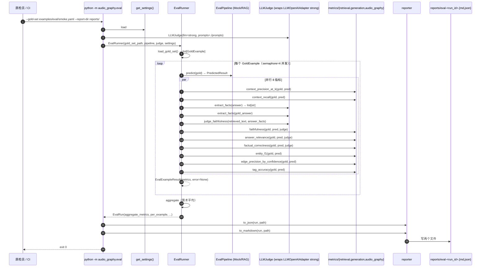

# AudioGraphy M5 架构文档 — funASR Adapter + Evaluation Subsystem（Code-Ready）

| 字段 | 值 |
|------|-----|
| 版本 | v5.0.0-draft |
| 作者 | 高见远（架构师 / AI 代行） |
| 主理人 | 齐活林 |
| 日期 | 2026-07-21 |
| 前置 | `docs/m5-prd.md` |
| 基线 | M4 commit `56674d9`（657 测试 / 91.46% 覆盖率） |
| 范围 | Code-Ready（写代码 + compose + 测试 + eval CLI，不拉起真实服务） |

> 本文档为 `docs/m5-prd.md` 的**实施级架构补充**，定义每个类的签名、字段映射、HTTP 生命周期、metric 公式与任务拆分。冲突时以 PRD 为准；齐活林 locked 决策（Q1–Q5）不在本文重开。

---

## 目录

1. [Overview](#1-overview)
2. [Module Layout](#2-module-layout)
3. [funASR Adapter 设计](#3-funasr-adapter-设计)
4. [Evaluation 子系统设计](#4-evaluation-子系统设计)
5. [config.py 重构](#5-configpy-重构)
6. [docker-compose 改动](#6-docker-compose-改动)
7. [测试策略](#7-测试策略)
8. [任务拆分（T1–T8）](#8-任务拆分t1t8)
9. [风险与对策](#9-风险与对策)
10. [QA 验收清单（严过关）](#10-qa-验收清单严过关)

---

## 1. Overview

### 1.1 M5 目标重述

**北极星**（与 PRD §1.1 对齐）：让社区用户**跑得起来、信得过** AudioGraphy。

M5 交付物（实施侧）：

| 维度 | 交付 |
|------|------|
| WS-1 真实 ASR | `FunASRAdapter`（OpenAI 兼容 `/v1/audio/transcriptions`），解锁 M4 validator 拒绝 |
| WS-1 异常层级 | `ASRAdapterError` + 4 子类（Request / Auth / TooLarge / RateLimit / Server / Timeout） |
| WS-2 评估子系统 | `audio_graphy/eval/` 子包：types + metrics + judge + runner + reporter + cli |
| WS-2 指标 | 5 项 RAG 标准指标 + 3 项 AudioGraphy 特异指标（in-tree，0 新 pip 依赖） |
| WS-2 LLM-as-judge | 复用 `LLMOpenAIAdapter(strong)`，3 个 prompt 模板 |
| 配置 | `config.py` 移除 ASR-real validator + 新增 `judge_llm_model` / `funasr_*` 字段 |
| Compose | funasr 服务换 `funasr/server:1.0.5`（per-release tag）+ healthcheck |
| 测试 | respx funasr 8 用例 + eval ~50 用例（含 stub LLMJudge） |
| 文档 | `docs/m5-eval.md` + `docs/deployment.md` 更新 + `examples/eval/smoke.yaml` |

### 1.2 三个关键成功因子（CSF）

| CSF | 衡量指标 | 失败阈值 |
|-----|---------|---------|
| **CSF-1 零回归** | M4 既有 657 测试全部通过 | 任意回归即 roll back |
| **CSF-2 新模块高覆盖** | `adapters/real/funasr.py` + `eval/*` 覆盖率 ≥ 90% | < 90% 阻塞发布 |
| **CSF-3 CLI 冒烟可用** | `python -m audio_graphy.eval --gold-set examples/eval/smoke.yaml --no-judge --report-dir /tmp/...` 退出 0 并产出 md + json | 退出码非 0 或缺文件阻塞发布 |

### 1.3 决策汇总（齐活林 locked）

| ID | 决策 | 理由 |
|----|------|------|
| Q1 | funASR 镜像 tag = `funasr/server:1.0.5`（per-release tag，介于 `latest` 与 SHA 之间） | 平衡稳定性与升级便利，对齐 vLLM `v0.7.2` 思路 |
| Q2 | LLM-as-judge 复用 `LLMOpenAIAdapter(strong)`（不开新模型服务） | 节省 GPU；与 PRD §9.4 兼容 |
| Q3 | Entity F1 用字符级 tokenizer（无 jieba / HanLP，不引入新 pip） | 最简；中文歧义留待 M6 |
| Q4 | Eval CLI 入口 = `python -m audio_graphy.eval`（不注册 pyproject.toml entry point） | 与 mock 测试同入口，CI 友好 |
| Q5 | 不暴露 Prometheus（仅落 JSON + Markdown） | M5 不持久化，YAGNI |
| 范围 | **Code-Ready**（不拉起真实 funASR / vLLM） | 无 GPU 测试床 |
| 依赖 | **0 新 pip 依赖** | 8 指标 in-tree 实现 |

### 1.4 架构原则（沿用 M4 + 新增）

1. **Protocol 不变**：`adapters/protocols.py` 在 M5 零改动（ASRAdapter 契约 `transcribe(audio_path, *, segments=None, language="zh")` 已留好segments 参数；funASR 自带 VAD 故忽略）。
2. **FunASRAdapter 与 SileroVADAdapter 同骨架**：lazy httpx.AsyncClient singleton + `aclose()` + `_redact()` 复用。
3. **异常分层**：新增 `ASRAdapterError` 基类，子类按 HTTP 状态码映射（沿用 M4 模式）。
4. **Eval 是独立子包**：`eval/` 不依赖 `services/`（仅 `EvalPipeline` 协议接入），保证 metric 单元测试零网络。
5. **LLM-as-judge 走 cache_key**：与 `LLMOpenAIAdapter` 同公式（MD5(model, messages)），同 prompt 在同一进程内仅打一次 HTTP。
6. **Metric 是纯函数**：`metric_X(gold, pred, judge=None) -> MetricResult`，无 I/O，便于并行（asyncio.gather + semaphore）。
7. **Reporter 双格式**：JSON（dataclass asdict）+ Markdown（PRD §5.5 模板）。
8. **配置即契约**：所有 URL / model name / k 值来自 `Settings`，禁止硬编码。

### 1.5 端到端时序图

#### 1.5.1 WS-1：真实 ASR 调用链

```mermaid
sequenceDiagram
    autonumber
    participant API as FastAPI /upload
    participant Pipe as PipelineService
    participant VAD as SileroVADAdapter
    participant ASR as FunASRAdapter
    participant FR as funASR /v1/audio/transcriptions
    participant Down as 下游（实体抽取 / 图谱 / 检索）

    API->>Pipe: process(recording_id)
    Pipe->>VAD: segment(audio_path)
    VAD-->>Pipe: tuple[VADSegment, ...]
    Pipe->>ASR: transcribe(audio_path, segments=..., language="zh")
    Note over ASR: segments 参数被忽略<br/>funASR 内部自做 VAD
    ASR->>ASR: _get_client() lazy singleton
    ASR->>FR: POST multipart/form-data<br/>{file, model, response_format=verbose_json, language}
    alt 200 OK
        FR-->>ASR: {text, segments[], duration, language, model}
        ASR->>ASR: 映射 → ASRResult(text, words=...)
        ASR-->>Pipe: ASRResult
    alt 400
        FR-->>ASR: HTTP 400
        ASR->>ASR: raise ASRRequestError
    alt 413
        FR-->>ASR: HTTP 413
        ASR->>ASR: raise ASRTooLargeError
    alt 429
        FR-->>ASR: HTTP 429
        ASR->>ASR: raise ASRRateLimitError（M5 不重试）
    alt 5xx / timeout / bad JSON
        FR-->>ASR: HTTP 5xx / Timeout
        ASR->>ASR: raise ASRServerError / ASRTimeoutError
    end
    Pipe->>Down: ASRResult.text → 实体/图谱/检索
```

#### 1.5.2 WS-2：评估 CLI 调用链



### 1.6 与 PRD 的偏离说明

PRD §5.3.2 描述 Entity F1 "默认按字符，可后续切换 jieba/HanLP"，本文进一步明确：

> **M5 实现**：Entity F1 使用 `set((entity_text, entity_type))` 集合运算，**不**对 `entity_text` 做字符级展开。当 `entity_text` 完全相等（含大小写归一化后）才算 TP。这一选择比"字符级 Jaccard"更严格，但与 Entity F1 在工业评估工具（ragas 等）的常见做法一致；中文歧义留待 M6 评估后再决定是否引入 jieba。

代价：实体抽取模型对同一实体输出微小变体（"CS75 Plus" vs "CS75PLUS"）会判 FN。M5 通过 `tag_accuracy` 的字符串归一化（trim + lowercase + 全角半角）部分缓解，但 Entity F1 本身保持严格。

---

## 2. Module Layout

### 2.1 完整文件树（新增 `+`、改动 `~`）

```
backend/audio_graphy/
├── config.py                                   # ~  (+25 / -10 行)
├── adapters/
│   ├── __init__.py                             # ~  (+2 行：re-export FunASRAdapter)
│   ├── protocols.py                            #   (unchanged — M4 baseline)
│   ├── bundle.py                               # ~  (+15 / -3 行：ASR 分支切 FunASRAdapter)
│   ├── exceptions.py                           # ~  (+60 行：ASR 异常层级)
│   ├── mock_asr.py                             #   (unchanged)
│   ├── mock_embed.py                           #   (unchanged)
│   ├── mock_llm.py                             #   (unchanged)
│   ├── mock_vad.py                             #   (unchanged)
│   └── real/
│       ├── __init__.py                         # ~  (+2 行：re-export FunASRAdapter)
│       ├── vad_silero.py                       #   (unchanged)
│       ├── llm_openai.py                       #   (unchanged — 被 eval/judge.py 复用)
│       ├── embed_bge.py                        #   (unchanged)
│       └── funasr.py                           # +  (~200 行)
└── eval/                                       # +  (新子包，~1200 行总计)
    ├── __init__.py                             # +  (~15 行：re-export public API)
    ├── __main__.py                             # +  (~5 行：sys.exit(cli.main()))
    ├── types.py                                # +  (~110 行：5 frozen dataclasses)
    ├── metrics/
    │   ├── __init__.py                         # +  (~15 行：re-export 8 metric 函数)
    │   ├── retrieval.py                        # +  (~120 行：context_precision_at_k / context_recall)
    │   ├── generation.py                       # +  (~180 行：faithfulness / answer_relevance / factual_correctness)
    │   └── audio_graphy.py                     # +  (~160 行：entity_f1 / edge_precision_by_confidence / tag_accuracy)
    ├── judge.py                                # +  (~140 行：LLMJudge + 3 prompt 调用)
    ├── prompts/                                # +  (3 个文本模板)
    │   ├── extract_facts.txt                   # +  (~15 行)
    │   ├── judge_faithfulness.txt              # +  (~20 行)
    │   └── judge_relevance.txt                 # +  (~15 行)
    ├── runner.py                               # +  (~130 行：EvalRunner + EvalPipeline 协议)
    ├── reporter.py                             # +  (~150 行：to_json + to_markdown)
    └── cli.py                                  # +  (~95 行：argparse + 入口)

backend/tests/
├── adapters/
│   └── real/
│       ├── conftest.py                         # ~  (+15 行：asr_adapter fixture)
│       └── test_funasr.py                      # +  (~280 行，8 用例)
└── eval/                                       # +  (新测试目录)
    ├── __init__.py                             # +  (空)
    ├── conftest.py                             # +  (~120 行：gold_example / stub_judge fixtures)
    ├── fixtures/
    │   ├── gold_smoke.yaml                     # +  (~80 行：5 条样本)
    │   └── llm_responses/                      # +  (stub 响应文件)
    ├── test_types.py                           # +  (~90 行：dataclass 序列化)
    ├── test_metrics_retrieval.py               # +  (~180 行：8 用例)
    ├── test_metrics_generation.py              # +  (~220 行：12 用例)
    ├── test_metrics_audio_graphy.py            # +  (~220 行：12 用例)
    ├── test_judge.py                           # +  (~180 行：4 respx 用例)
    ├── test_runner.py                          # +  (~120 行：3 用例)
    ├── test_reporter.py                        # +  (~110 行：3 用例)
    └── test_cli.py                             # +  (~110 行：1 集成 + 1 --help)

docker-compose.yml                              # ~  (+30 / -15 行：funasr 服务换镜像 + healthcheck)
.env.example                                    # ~  (+10 / -3 行：FUNASR_* + JUDGE_LLM_MODEL + EVAL_CONCURRENCY)
examples/eval/
├── smoke.yaml                                  # +  (~120 行：10 条样本 gold set)
└── README.md                                   # +  (~50 行)

docs/
├── m5-prd.md                                   #   (已有)
├── m5-architecture.md                          # +  (本文件)
├── m5-eval.md                                  # +  (~250 行：评估指标公式 + gold set 字段说明)
└── deployment.md                               # ~  (+30 / -10 行：funASR 启动步骤替换)
README.md                                       # ~  (+10 行：M5 状态)
```

### 2.2 行数预算

| 文件 | 估算行数 | 备注 |
|------|---------|------|
| `adapters/exceptions.py` 增量 | +60 | 1 base + 6 子类 + docstring |
| `adapters/real/funasr.py` | ~200 | 含 logging + httpx lifecycle + 双语 docstring |
| `adapters/real/__init__.py` 增量 | +2 | re-export |
| `adapters/bundle.py` 增量 | +15 / -3 | ASR 分支条件 |
| `config.py` 增量 | +25 / -10 | 删 ASR-real validator + 加 5 字段 |
| `eval/types.py` | ~110 | 5 frozen dataclasses |
| `eval/metrics/retrieval.py` | ~120 | 2 metric |
| `eval/metrics/generation.py` | ~180 | 3 metric + 共享 fact 辅助函数 |
| `eval/metrics/audio_graphy.py` | ~160 | 3 metric |
| `eval/judge.py` | ~140 | 3 method + cache + robust parse |
| `eval/prompts/*.txt` | ~50 | 3 个模板 |
| `eval/runner.py` | ~130 | EvalRunner + EvalPipeline 协议 + 并发 |
| `eval/reporter.py` | ~150 | JSON + Markdown |
| `eval/cli.py` + `__main__.py` + `__init__.py` | ~115 | argparse + 入口 |
| `docker-compose.yml` 增量 | +30 / -15 | funasr 换镜像 + healthcheck |
| `.env.example` 增量 | +10 / -3 | 5 个新字段 |
| 测试目录总计 | ~1620 | adapters/real/test_funasr.py + tests/eval/* |
| `examples/eval/smoke.yaml` + README | ~170 | 10 条样本 + 说明 |
| `docs/m5-eval.md` | ~250 | 评估指南 |
| `docs/deployment.md` 增量 | +30 / -10 | funASR 启动替换 |
| `README.md` 增量 | +10 | M5 状态 |
| **本架构文档** | ~1750 | 高密度 |
| **总计 M5 增量** | **≤ 3500 行代码 + 文档** | PRD 附录预算 ≤ 2900 行代码 + 文档另算 |

### 2.3 与 M4 文件的关系

| M4 文件 | M5 是否改动 | 改动原因 |
|---------|------------|---------|
| `adapters/real/vad_silero.py` | 不改 | M4 已稳定 |
| `adapters/real/llm_openai.py` | 不改（被 eval/judge.py 复用） | LLMJudge 通过依赖注入接入 |
| `adapters/real/embed_bge.py` | 不改 | M4 已稳定 |
| `adapters/protocols.py` | 不改 | `ASRAdapter.transcribe` 契约已包含 `segments` 参数 |
| `mock_*` | 不改 | M4 已稳定 |
| `services/*` | 不改 | Eval 通过 `EvalPipeline` 协议接入，不直接依赖 services |

---

## 3. funASR Adapter 设计

### 3.1 `adapters/exceptions.py`（增量 +60 行）

新增 ASR 异常层级，与 M4 VAD/LLM/Embed 同模式。

```python
# ====== APPEND to backend/audio_graphy/adapters/exceptions.py ======

class ASRAdapterError(Exception):
    """Base for all ASR adapter failures / ASR Adapter 错误基类."""

    __module__ = "audio_graphy.adapters.exceptions"

    def __init__(
        self,
        message: str,
        *,
        url: str | None = None,
        status_code: int | None = None,
    ) -> None:
        super().__init__(message)
        self.url = url
        self.status_code = status_code


class ASRRequestError(ASRAdapterError):
    """HTTP 400 / 422 — bad audio / unsupported response_format."""

    __module__ = "audio_graphy.adapters.exceptions"


class ASRAuthError(ASRAdapterError):
    """HTTP 401 / 403 — funASR token rejected (when auth enabled)."""

    __module__ = "audio_graphy.adapters.exceptions"


class ASRTooLargeError(ASRAdapterError):
    """HTTP 413 — audio payload exceeds server limit."""

    __module__ = "audio_graphy.adapters.exceptions"


class ASRRateLimitError(ASRAdapterError):
    """HTTP 429 — funASR rate limit. M5 does NOT retry (PRD §4.4)."""

    __module__ = "audio_graphy.adapters.exceptions"


class ASRServerError(ASRAdapterError):
    """HTTP 5xx — funASR inference fault / non-JSON response."""

    __module__ = "audio_graphy.adapters.exceptions"


class ASRTimeoutError(ASRAdapterError):
    """httpx.TimeoutException / 请求超时."""

    __module__ = "audio_graphy.adapters.exceptions"
```

更新 `__all__`：

```python
__all__ = [
    # ... existing ...
    "ASRAdapterError",
    "ASRAuthError",
    "ASRRequestError",
    "ASRRateLimitError",
    "ASRServerError",
    "ASRTimeoutError",
    "ASRTooLargeError",
]
```

### 3.2 `FunASRAdapter` 类签名（`adapters/real/funasr.py`，~200 行）

```python
# backend/audio_graphy/adapters/real/funasr.py
class FunASRAdapter:
    """Real ASR backed by funASR-server OpenAI-compatible HTTP API.

    真实 ASR Adapter，基于 funasr/server:1.0.5（OpenAI 兼容接口）。

    Lifecycle:
    - httpx.AsyncClient created lazily on first ``transcribe()`` call.
    - Caller MUST invoke ``aclose()`` during application shutdown.
    - Re-entrant: after ``aclose()``, next call re-creates the client.
    """

    def __init__(
        self,
        *,
        url: str,
        model: str,
        api_key: str = "dummy",
        timeout: float = _DEFAULT_TIMEOUT,        # 120.0
        max_connect_sec: float = _DEFAULT_MAX_CONNECT_SEC,  # 5.0
        language: str = "zh",
    ) -> None: ...

    async def transcribe(
        self,
        audio_path: str,
        *,
        segments: list[VADSegment] | None = None,  # ignored — funASR does its own VAD
        language: str = "zh",
    ) -> ASRResult: ...

    async def aclose(self) -> None: ...
```

**transcribe() 关键步骤**：
1. `del segments`（显式忽略；funASR 自做 VAD）
2. 文件存在性校验 → 否则 `ASRRequestError`
3. `_get_client()` lazy singleton（`max_connections=4, max_keepalive_connections=2`）
4. POST `{base_url}/v1/audio/transcriptions` with `multipart/form-data`：
   - `files={"file": (path.name, fh, "audio/wav")}`
   - `data={"model": self.model, "response_format": "verbose_json", "language": language, "temperature": "0.0", "timestamp_granularities[]": "segment"}`
   - `headers={"Authorization": f"Bearer {self._api_key}"}`
5. 错误捕获：`httpx.TimeoutException` → `ASRTimeoutError`；`httpx.HTTPError` → `ASRServerError`
6. `_raise_for_status(resp, full_url)` 按 PRD §4.4 映射状态码
7. `_parse_response(resp, fallback_language=language)`：解析 JSON，构造 `ASRResult`（words 从 segments 派生）

**_parse_response() 行为**：
- `payload = resp.json()` 失败 → `ASRServerError`（"non-JSON"）
- `payload` 不是 dict 或缺 `text` 键 → `ASRServerError`
- `text = str(payload["text"])`
- `language = str(payload.get("language", fallback_language))`
- `words = [(seg_text, start, end) for seg in payload["segments"] if seg_text]`（malformed seg 跳过 + DEBUG 日志）
- `overall_confidence = mean(seg["confidence"]) if any else 0.95`
- 返回 `ASRResult(text, language, confidence, words=tuple(words))`

**_raise_for_status() 状态码映射**：
- 400 / 422 → `ASRRequestError`（WARNING + status_code）
- 401 / 403 → `ASRAuthError`（WARNING + status_code）
- 413 → `ASRTooLargeError`（WARNING + status_code）
- 429 → `ASRRateLimitError`（WARNING + status_code，M5 不重试）
- 5xx / 其他 4xx → `ASRServerError`（WARNING/ERROR + status_code）

**协议满足检查**（文件末尾）：
```python
_ASR_PROTOCOL_CHECK: ASRAdapter = FunASRAdapter(url="http://example", model="x")
```

### 3.3 错误映射表

| HTTP / 异常源 | 异常类 | 日志级别 |
|---------------|--------|---------|
| 200 OK（含 segments） | `ASRResult(text, words=tuple[(seg_text, start, end), ...])` | DEBUG |
| 200 OK（缺 segments，仅 text） | `ASRResult(text, words=())`（兜底） | DEBUG |
| 400 | `ASRRequestError` | WARNING |
| 401 / 403 | `ASRAuthError` | WARNING |
| 413 | `ASRTooLargeError` | WARNING |
| 422（含 unsupported response_format） | `ASRRequestError` | WARNING |
| 429 | `ASRRateLimitError`（M5 不重试） | WARNING |
| 5xx | `ASRServerError` | ERROR |
| `httpx.TimeoutException` | `ASRTimeoutError` | WARNING |
| `httpx.HTTPError`（其他） | `ASRServerError` | ERROR |
| 响应非 JSON | `ASRServerError` | ERROR |
| 缺 `text` 键 | `ASRServerError` | ERROR |
| 音频文件不存在 | `ASRRequestError`（本地） | WARNING |

### 3.4 关键行为决策

| 决策 | 选择 | 理由 |
|------|------|------|
| `segments` 参数处理 | 忽略（`del segments`） | funASR 内部自做 VAD；Protocol 契约要求保留参数兼容 |
| `response_format` | 强制 `verbose_json` | 含 segments + duration；其他格式不消费 |
| `timestamp_granularities[]` | 固定 `segment` | M5 不消费 word-level；M6+ 可加 |
| httpx 连接池 | `max_connections=4`, `max_keepalive=2` | ASR 单卡并发低，避免 OOM（PRD §4.5） |
| 整体 confidence | segments 平均，无则 0.95 | 与 ASRResult 默认值一致 |
| 文件类型 MIME | 固定 `audio/wav` | 与 SileroVADAdapter 同；funASR 实际按 magic bytes 识别 |
| temperature | 固定 `0.0` | greedy，确定性输出便于评估 |
| `language` 默认 | `zh` | 沿用 PRD §4.2 默认 |

### 3.5 日志策略

- **DEBUG**：每次调用记 URL（redact）/ path / model / language；成功时记 text 长度 + segments 数 + duration + model。
- **WARNING**：4xx / 超时（可恢复）。
- **ERROR**：5xx / JSON 解析失败（需 SRE 介入）。
- **URL redaction**：复用 `exceptions._redact()`（去掉 query string 防 token 泄漏）。

---

## 4. Evaluation 子系统设计

### 4.1 数据模型（`eval/types.py`，~110 行）

5 个 `@dataclass(frozen=True, slots=True)`，字段名严格对齐 PRD §5.1：

```python
@dataclass(frozen=True, slots=True)
class GoldExample:
    query: str
    gold_answer: str
    gold_context_ids: tuple[str, ...]
    gold_entities: tuple[tuple[str, str], ...]              # (entity_text, entity_type)
    gold_edges: tuple[tuple[str, str, str, EdgeConfidence], ...]  # (src, rel, dst, conf)
    gold_tags: tuple[dict[str, str], ...]                   # {"tag_path": ..., "value": ...}
    recording_id: str | None = None
    metadata: dict[str, str] = field(default_factory=dict)

@dataclass(frozen=True, slots=True)
class PredictedResult:
    query: str
    answer: str
    retrieved_context_ids: tuple[str, ...]                  # in rank order
    entities: tuple[tuple[str, str], ...]
    edges: tuple[tuple[str, str, str, EdgeConfidence], ...]
    tags: tuple[dict[str, str], ...]

@dataclass(frozen=True, slots=True)
class MetricResult:
    name: str
    value: float           # in [0.0, 1.0]
    denominator: int       # for aggregation
    details: dict[str, float | int | str] = field(default_factory=dict)

@dataclass(frozen=True, slots=True)
class EvalExampleResult:
    example_id: str
    metrics: tuple[MetricResult, ...]
    error: str | None = None

@dataclass(frozen=True, slots=True)
class EvalRun:
    run_id: str               # UUID4 hex[:12]
    gold_set_path: str
    started_at: str           # ISO 8601
    finished_at: str
    config: dict[str, str]
    aggregate_metrics: dict[str, float]
    per_example: tuple[EvalExampleResult, ...]
```

**序列化约束**：
- 全部字段为基本类型 / tuple / dict[str, str|float|int] — 直接 `dataclasses.asdict()` + `json.dumps` 即可。
- `EdgeConfidence` 是 `Literal` str 子类型，无需特殊处理。
- tuple 在 JSON 序列化时变 list；反序列化由 M6+ 持久化层处理。

### 4.2 Metric 实现

> 所有 metric 都是**纯函数**：`def metric_X(gold, pred, judge=None) -> MetricResult`，无 I/O，无 LLM 调用（LLM 调用通过 `judge: LLMJudge` 注入，metric 函数仅消费其返回值）。便于并行 + 单元测试。

#### 4.2.1 模块 `metrics/retrieval.py`（~120 行）

2 个纯函数，无 LLM 依赖。

```python
def context_precision_at_k(gold: GoldExample, pred: PredictedResult, *, k: int = 5) -> MetricResult:
    """Context Precision@k = (# gold ∩ retrieved[:k]) / min(k, len(gold))."""
    ...

def context_recall(gold: GoldExample, pred: PredictedResult) -> MetricResult:
    """Context Recall = (# gold ∩ retrieved_all) / len(gold_context_ids)."""
    ...
```

**Edge cases**（两者相同）：
- `len(gold_set) == 0` 或 `k <= 0` → value=0.0, `details.denominator_zero=True`
- 正常情况 denom = `min(k, len(gold_set))`（precision）或 `len(gold_set)`（recall）

**实现要点**：
- 使用 `set()` 而非 list（顺序无关）
- `details` 含 `k / gold_count / retrieved_count / hits` 便于报告输出
- metric name 动态含 k：`f"context_precision_at_{k}"`

#### 4.2.2 模块 `metrics/generation.py`（~180 行）

3 个函数，均注入 `judge: LLMJudge`。

```python
def faithfulness(gold: GoldExample, pred: PredictedResult, judge: LLMJudge) -> MetricResult: ...
def answer_relevance(gold: GoldExample, pred: PredictedResult, judge: LLMJudge) -> MetricResult: ...
def factual_correctness(gold: GoldExample, pred: PredictedResult, judge: LLMJudge) -> MetricResult: ...
```

**faithfulness** 公式与流程：
1. `context_text = _lookup_tag(pred.tags, "retrieved_text")`（pipeline 通过 tag 写入；缺失 → ""）
2. `facts = judge.extract_facts(pred.answer)`
3. `flags = judge.judge_faithfulness(context_text, facts)`
4. `value = sum(flags) / len(facts)`

**answer_relevance**：`value = judge.judge_relevance(gold.query, pred.answer)` ∈ {0.0, 0.5, 1.0}。

**factual_correctness**：
- `set_pred = set(judge.extract_facts(pred.answer))`
- `set_gold = set(judge.extract_facts(gold.gold_answer))`
- `tp = len(set_pred & set_gold)`
- `precision = tp / len(set_pred)`；`recall = tp / len(set_gold)`
- `F1 = 2 * P * R / (P + R)` if `P + R > 0` else 0.0

**Edge cases**：
- `pred.answer` 空 → faithfulness/relevance 返回 0.0, reason="empty_answer"
- `pred.retrieved_context_ids` 空 → faithfulness 0.0, reason="empty_context"
- `facts == []` → faithfulness 0.0, reason="no_facts_extracted"
- facts_pred 与 facts_gold 双空 → factual_correctness **1.0**（PRD §5.3.3 约定）

**辅助**：`_lookup_tag(tags, key)` 在 `pred.tags` 中找 `tag_path == key` 的 `value`。

#### 4.2.3 模块 `metrics/audio_graphy.py`（~160 行）

3 个纯函数，无 LLM 依赖。

```python
def entity_f1(gold: GoldExample, pred: PredictedResult) -> MetricResult: ...
def edge_precision_by_confidence(gold: GoldExample, pred: PredictedResult) -> MetricResult: ...
def tag_accuracy(gold: GoldExample, pred: PredictedResult) -> MetricResult: ...
```

**归一化**：3 个函数共用 `_norm(s) = unicodedata.normalize("NFKC", s.strip().lower())`。

**entity_f1**：
- `gold_set = {(_norm(t), ty) for (t, ty) in gold.gold_entities}`
- `pred_set = {(_norm(t), ty) for (t, ty) in pred.entities}`
- 双空 → **1.0**（PRD §5.3.3）；否则 F1(precision, recall)。

**edge_precision_by_confidence**：
- 按 `EdgeConfidence` 分层（EXTRACTED / INFERRED / AMBIGUOUS）。
- 每层：`tp = |gold ∩ pred|`，`layer_precision = tp / len(pred_layer)`（pred_layer 空 → 该层值 0 且不纳入 macro）。
- edge key 包含 `(norm(src), rel, norm(dst), confidence)`。
- `value = macro = mean(非空层 precisions)`；`details` 含 `P_EXTRACTED / P_INFERRED / P_AMBIGUOUS / macro_edge_precision`。
- 全部 3 层 pred 为空 → macro=0.0, `details.all_layers_empty=True`。

**tag_accuracy**：
- `pred_index = {_norm(t.tag_path): _norm(t.value) for t in pred.tags}`
- `hits = sum(1 for g in gold.gold_tags if pred_index.get(_norm(g.tag_path)) == _norm(g.value))`
- `value = hits / len(gold.gold_tags)`；gold_tags 空 → 0.0, denominator_zero=True。

#### 4.2.4 边界约定（PRD §5.3.3 实施细则）

| 场景 | 行为 | details 标记 |
|------|------|-------------|
| 分母为 0（一般） | value=0.0 | `details.denominator_zero=True` |
| Faithfulness answer 空 | value=0.0 | `details.reason="empty_answer"` |
| Faithfulness retrieved 空 | value=0.0 | `details.reason="empty_context"` |
| Entity F1 双方都空 | value=**1.0**（PRD 约定） | `details.reason="both_empty"` |
| Entity F1 单边空 | value=0.0 | precision 或 recall 为 0 |
| Tag Accuracy gold 为空 | value=0.0 | `details.denominator_zero=True` |
| Edge P/C 某层 pred 为空 | 该层 P=0.0；不纳入 macro | `details.P_<layer>_denominator_zero=True` |

### 4.3 LLMJudge（`eval/judge.py`，~140 行）

#### 4.3.1 类签名

```python
# backend/audio_graphy/eval/judge.py
class LLMJudge:
    """Wraps an LLM adapter (typically LLMOpenAIAdapter strong) to run 3 judge prompts.

    用法：
        judge = LLMJudge(llm=strong_llm_adapter)
        facts = judge.extract_facts("今天我们讨论了 CS75 Plus 的价格。")
        flags = judge.judge_faithfulness(context_text, facts)
        score = judge.judge_relevance("优惠多少？", "5 万元现金优惠。")
    """

    def __init__(self, *, llm: LLMAdapter, prompts_package: str = "audio_graphy.eval.prompts") -> None: ...

    def extract_facts(self, text: str) -> list[str]: ...
    def judge_faithfulness(self, context: str, facts: list[str]) -> list[bool]: ...
    def judge_relevance(self, query: str, answer: str) -> float: ...
```

**实现要点**：
- `_load_prompt(filename)` 用 `importlib.resources.files(self._prompts_package).joinpath(filename).read_text()`。
- `_call_llm(prompt, cache_key=...)`：组装 `[{"role": "user", "content": prompt}]`，调 `self._llm.complete(msgs, temperature=0.0, cache_key=...)`。包含 sync/async 双模式 fallback（检测 `asyncio.get_running_loop()`）。
- `_cache_key(*parts)` = `MD5("|".join(str(p) for p in parts))`，与 LLMOpenAIAdapter cache 同公式。
- `_parse_fact_list(text)`：按行 strip；去前缀 `- ` / `1. `；空行跳过；空结果 WARNING。
- `_parse_jsonl_verdicts(text, expected_count)`：每行 `json.loads`；malformed 行 → False + WARNING；长度对齐 `expected_count`（pad/truncate with False）。
- `_parse_relevance_score(text)`：strip + 去除 markdown 装饰（`*` / `` ` ``）；`float()`；非 {0, 0.5, 1} → snap 最近允许值 + WARNING；解析失败 → 0.0 + WARNING。

#### 4.3.2 缓存策略

| 调用 | cache_key 构成 | 同进程重复调用 |
|------|---------------|---------------|
| `extract_facts(answer_text)` | `MD5("extract_facts" \| answer_text)` | 同 answer 仅打 1 次 HTTP |
| `extract_facts(gold_answer)` | 同上（同 answer → 同 key） | gold_answer 在多 example 中若相同则复用 |
| `judge_faithfulness(context, facts)` | `MD5("faith" \| context \| "\|".join(facts))` | 同 (context, facts) 仅 1 次 |
| `judge_relevance(query, answer)` | `MD5("rel" \| query \| answer)` | 同 (query, answer) 仅 1 次 |

#### 4.3.3 错误恢复

| 失败模式 | 行为 |
|---------|------|
| prompt 文件缺失 | 抛 `OSError`（启动期失败，应该 fix） |
| LLM 调用失败（429 / 5xx / timeout） | 异常向上抛（runner 记 example.error） |
| fact list 解析为空 | 返回 `[]`，metric 视为 `no_facts_extracted` |
| JSONL 某行 malformed | 跳过该行（视为 `supported=False`），WARNING |
| relevance 解析失败 | 默认 `0.0`，WARNING |
| relevance 分数非 {0, 0.5, 1} | snap 到最近允许值，WARNING |

### 4.4 Runner（`eval/runner.py`，~130 行）

#### 4.4.1 EvalPipeline 协议

```python
@runtime_checkable
class EvalPipeline(Protocol):
    """Abstract pipeline that produces PredictedResult for a GoldExample."""

    async def predict(self, gold: GoldExample) -> PredictedResult: ...
```

#### 4.4.2 内置实现

- **MockPipeline**（M5 默认，测试用）：`MockPipeline(precision: float = 1.0)`；precision=1.0 时返回与 gold 完全一致的 pred（perfect score）；precision=0.0 时返回空 pred。
- **RAGPipeline**（M6 接线，M5 stub）：构造接受 `query_service` + `retrieval_service`；`predict()` 抛 `NotImplementedError`。

#### 4.4.3 EvalRunner

```python
class EvalRunner:
    def __init__(
        self,
        *,
        gold_set_path: Path,
        pipeline: EvalPipeline,
        judge: LLMJudge | None,
        k: int = 5,
        concurrency: int = 4,
        config_snapshot: dict[str, str] | None = None,
    ) -> None: ...

    async def run(self) -> EvalRun: ...
```

**run() 流程**：
1. `started_at = datetime.now(timezone.utc).isoformat()`；`run_id = uuid.uuid4().hex[:12]`
2. `examples = self._load_gold_set()` → 解析 YAML
3. `tasks = [self._eval_one(ex, idx) for idx, ex in enumerate(examples)]`
4. `per_example = await asyncio.gather(*tasks)`
5. `aggregate = self._aggregate(per_example)`
6. `finished_at = ...`；返回 `EvalRun(...)`

**_eval_one(gold, idx)**：
- `example_id = f"ex-{idx+1:03d}"`
- `async with self._semaphore`：`pred = await self._pipeline.predict(gold)`（捕获 Exception → EvalExampleResult.error=repr）
- 顺序执行 8 metric：retrieval 2 个 + audio_graphy 3 个（无 LLM，总是跑）+ generation 3 个（仅当 `self._judge is not None`）
- 返回 `EvalExampleResult(example_id, metrics=tuple(...), error=None)`

**_aggregate(per_example)**：
- 跳过 `ex.error is not None` 的样本
- 对每个 metric name 算算术平均
- 返回 `dict[name, float]`

**_load_gold_set()**：`yaml.safe_load(path.read_text())`；逐项 `_gold_from_dict(item)` 转 `GoldExample`；malformed item 抛 `ValueError`。

**_gold_from_dict(d)** 辅助：把 YAML dict 各字段强类型化为 GoldExample 字段（tuple 化、str 化）。

### 4.5 Reporter（`eval/reporter.py`，~150 行）

```python
def to_json(eval_run: EvalRun, path: Path) -> None: ...
def to_markdown(eval_run: EvalRun, path: Path) -> None: ...
```

**to_json**：
- `path.parent.mkdir(parents=True, exist_ok=True)`
- `payload = dataclasses.asdict(eval_run)`
- `path.write_text(json.dumps(payload, ensure_ascii=False, indent=2))`

**to_markdown** 渲染 PRD §5.5 模板，4 个段落：

1. **Header**：Run ID / Started / Finished / Examples / Errors 计数 / Config（按 key 列出）
2. **Aggregate Metrics**：sorted by name；`| Metric | Value |`；value 保留 3 位小数
3. **Per-Example Highlights / Lowest Faithfulness**：取 `error is None` 且 `faithfulness` metric 存在的 example，按 value 升序，取前 5；表格列 `example_id | faithfulness | details`
4. **Errors**：`error is not None` 的 example；表格列 `example_id | error`（error 截断 120 字符，`|` 转义）

实现要点：
- `_find_metric(metrics, name)` 辅助：遍历 metrics 元组返回指定 name 的 MetricResult 或 None
- 空段落（无 faithfulness 数据 / 无 error）输出 `(none)` 或提示性文本，不 crash

### 4.6 CLI（`eval/cli.py` + `eval/__main__.py`，~95 行）

```bash
python -m audio_graphy.eval \
  --gold-set examples/eval/smoke.yaml \
  --report-dir reports/ \
  [--no-judge]     # 跳过 LLM 相关指标（faithfulness / answer_relevance / factual_correctness）
  [--k 5]
  [--concurrency 4]
```

**argparse 参数**：
- `--gold-set` (Path, required)：gold set YAML
- `--report-dir` (Path, default=`reports/`)：输出目录
- `--k` (int, default=5)：Context Precision top-k
- `--no-judge` (flag)：跳过 LLM 指标（CI / 无 GPU 时用）
- `--concurrency` (int, default=4)：asyncio.Semaphore bound

**main() 流程**：
1. `args = build_parser().parse_args(argv)`
2. `args.gold_set.is_file()` 校验，缺失返回退出码 2
3. lazy import `get_settings` / `LLMJudge` / `to_json` / `to_markdown` / `EvalRunner` / `MockPipeline`（保持 --help 快）
4. `pipeline = MockPipeline(precision=1.0)`（M5 默认；M6 接 RAGPipeline）
5. 若 `not args.no_judge`：`bundle = build_adapters(settings)`；`judge = LLMJudge(llm=bundle.strong_llm)`
6. 构造 `EvalRunner(...)`；`run = asyncio.run(runner.run())`
7. 写 `eval-<run_id>.md` + `eval-<run_id>.json` 到 `args.report_dir`

**__main__.py**：3 行，`sys.exit(main())`。

#### 4.6.1 CLI 退出码

| 退出码 | 含义 |
|-------|------|
| 0 | 成功（即使部分 example 报错也返回 0；通过 report 体现） |
| 2 | 参数错（gold set 不存在 / argparse 错） |
| ≥70 | 未捕获异常（asyncio runner crash） |

### 4.7 Prompt 模板（`prompts/*.txt`）

直接拷贝 PRD §5.4 文本，三个文件，无 Python。

#### 4.7.1 `prompts/extract_facts.txt`

```
你是一个事实抽取助手。从下面这段中文文本中抽取所有原子事实（独立可验证的最小事实单元）。
每行一个事实，用简洁的中文陈述句表达。

【文本】
{text}

【输出格式】
- <事实 1>
- <事实 2>
- ...
```

#### 4.7.2 `prompts/judge_faithfulness.txt`

```
你是 RAG 系统的审核员。判断下面每个事实是否被【上下文】支持。

【上下文】
{context}

【待判断的事实】（编号 1..N）
{numbered_facts}

【输出格式】每行一个 JSON：{"id": 1, "supported": true|false}
仅输出 JSON，不要解释。
```

#### 4.7.3 `prompts/judge_relevance.txt`

```
判断【回答】对【问题】的相关性，从 {0, 0.5, 1.0} 中选一：
- 1.0：直接回答问题，无冗余
- 0.5：部分相关 / 含跑题内容
- 0.0：完全无关

【问题】{query}
【回答】{answer}

仅输出一个数字。
```

---

## 5. config.py 重构

### 5.1 改动总览

| 区块 | 改动 |
|------|------|
| `AdapterMode` Literal | **不变**（`Literal["mock", "real"]`） |
| `_validate_combinations` | **删除** ASR-real 拒绝（M4 约束解锁）；保留 JWT 警告 |
| 新字段 | `judge_llm_model: str = ""`、`funasr_model: str = "fun-asr-nano"`、`funasr_language: str = "zh"`、`funasr_timeout_sec: float = 120.0`、`eval_concurrency: int = 4` |
| `funasr_url` 默认 | 改 `http://funasr:10095` → `http://funasr:8000`（OpenAI 兼容端口） |
| `bundle.py` build_hybrid_bundle | ASR 分支条件化：mode=="real" → FunASRAdapter；mode=="mock" → MockASRAdapter |

### 5.2 字段 diff（精确）

```python
# ===== BEFORE (config.py L69) =====
funasr_url: str = "http://funasr:10095"

# ===== AFTER =====
funasr_url: str = "http://funasr:8000"            # OpenAI-compat endpoint (NOT legacy :10095)
funasr_model: str = "fun-asr-nano"                 # CPU 友好；GPU 可改 fun-asr-large
funasr_language: str = "zh"                        # BCP-47
funasr_timeout_sec: float = 120.0                  # ASR 长音频需要更宽松


# ===== NEW FIELDS (append after funasr_timeout_sec) =====
# Evaluation subsystem (M5 — WS-2)
judge_llm_model: str = ""        # empty → fallback to llm_strong_model
eval_concurrency: int = 4        # asyncio.Semaphore bound for EvalRunner


# ===== BEFORE (config.py L48 comment) =====
adapter_asr_mode: AdapterMode = "mock"   # M4: MUST be "mock" (funASR lands in M5)

# ===== AFTER =====
adapter_asr_mode: AdapterMode = "mock"   # M5: set to "real" to enable funASR
```

### 5.3 Validator diff

```python
# ===== BEFORE (config.py L165-L169) =====
# M4 — hard reject ASR real (funASR adapter lands in M5).
if self.adapter_asr_mode == "real":
    raise ValueError(
        "ADAPTER_ASR_MODE=real is not supported in M4 (funASR lands in M5)"
    )


# ===== AFTER =====
# M5 — ASR real is now supported (FunASRAdapter lands in M5).
# No special validation needed; URL sanity check below applies when real mode is on.


# ===== BEFORE (config.py L180-L185) =====
# (URL sanity block currently covers silero / bge / openai_*)


# ===== AFTER (add funasr_url to URL sanity list) =====
for field_name in (
    "silero_vad_url",
    "bge_m3_url",
    "openai_base_url_strong",
    "openai_base_url_weak",
    "funasr_url",            # NEW M5
):
    url = getattr(self, field_name)
    if not url.startswith(("http://", "https://")):
        logger.warning(
            "Field %s=%r is not http(s):// — adapter will fail at call time",
            field_name, url,
        )

# M5 — JWT warning if ANY real adapter mode enabled (now including ASR).
real_modes = [
    self.adapter_asr_mode,   # NEW M5 — was previously excluded
    self.adapter_vad_mode,
    self.adapter_llm_mode,
    self.adapter_embed_mode,
]
if "real" in real_modes and self.jwt_secret.startswith("change-me"):
    logger.warning(
        "REAL adapter ON but JWT_SECRET is placeholder — set a strong JWT_SECRET"
    )
```

### 5.4 `bundle.py` build_hybrid_bundle 改动

```python
# ===== BEFORE (bundle.py L81-L82) =====
# ASR — always mock in M4 (validator already rejects real)
asr: ASRAdapter = MockASRAdapter(flaky=settings.mock_asr_flaky)


# ===== AFTER =====
# ASR — M5 unblocks real mode via FunASRAdapter.
if settings.adapter_asr_mode == "real":
    from audio_graphy.adapters.real.funasr import FunASRAdapter

    asr: ASRAdapter = FunASRAdapter(
        url=settings.funasr_url,
        model=settings.funasr_model,
        api_key=settings.openai_api_key,    # reuse openai_api_key (default "dummy")
        timeout=settings.funasr_timeout_sec,
        language=settings.funasr_language,
    )
else:
    asr = MockASRAdapter(flaky=settings.mock_asr_flaky)
```

> **Reuse openai_api_key 的理由**：funASR-server 2026 版起的 OpenAI 兼容端点要求 `Authorization: Bearer <token>` 头，但服务端实际不校验（与 vLLM 同模式）。复用 `openai_api_key` 避免引入新字段；部署侧若启用 funASR auth，可在 `.env` 设同一个值。

### 5.5 `.env.example` diff

```dotenv
# ===== BEFORE (M4) =====
ADAPTER_ASR_MODE=mock               # M4: must be mock (funASR lands in M5)
FUNASR_URL=http://funasr:10095


# ===== AFTER (M5) =====
ADAPTER_ASR_MODE=mock               # M5: set to "real" to enable funASR (OpenAI-compat)
FUNASR_URL=http://funasr:8000       # OpenAI-compat endpoint (NOT legacy :10095)
FUNASR_MODEL=fun-asr-nano           # options: fun-asr-nano (CPU) / fun-asr-large (GPU)
FUNASR_LANGUAGE=zh
FUNASR_TIMEOUT_SEC=120

# Evaluation subsystem (M5 — WS-2)
JUDGE_LLM_MODEL=                    # empty → fallback to LLM_STRONG_MODEL
EVAL_CONCURRENCY=4
```

> **向后兼容声明**：M4 既有 `.env`（仅设 `ADAPTER_ASR_MODE=mock`）**不需要改动**也能工作——4 个新字段（FUNASR_MODEL / LANGUAGE / TIMEOUT_SEC + JUDGE_LLM_MODEL + EVAL_CONCURRENCY）都有默认值。**Breaking**：`FUNASR_URL=http://funasr:10095` 旧值不再可用，必须改为 `:8000`；M4 用户若没改 `FUNASR_URL`（因为 ASR-real 被 validator 拒绝），则不会触发此 breaking。

---

## 6. docker-compose 改动

### 6.1 funasr 服务替换（`docker-compose.yml:285-296`）

```yaml
# ===== BEFORE (M4) =====
funasr:
  # M5 placeholder — NOT wired to backend in M4 (adapter_asr_mode=real is
  # rejected by the Settings validator). Kept so SRE can pre-pull the image.
  image: registry.cn-hangzhou.aliyuncs.com/funasr_recog/funasr-runtime-sdk-online-cpu-0.1.12
  container_name: audiography-funasr
  profiles: ["real"]
  restart: unless-stopped
  ports:
    - "10095:10095"
  # No healthcheck in M4 — funASR SDK has no /health endpoint. Add in M5.
  networks:
    - audiography_net


# ===== AFTER (M5) =====
funasr:
  # Official funASR server image with OpenAI-compatible HTTP API.
  # 镜像 tag 锁定 funasr/server:1.0.5（齐活林 Q1 locked）。
  # GPU variant: funasr/server:1.0.5-gpu (set deploy.resources for GPU).
  image: funasr/server:1.0.5
  container_name: audiography-funasr
  profiles: ["real"]
  restart: unless-stopped
  environment:
    FUNASR_MODEL: ${FUNASR_MODEL:-fun-asr-nano}
    FUNASR_DEVICE: ${FUNASR_DEVICE:-cpu}    # CPU works for fun-asr-nano
  ports:
    # Host 10095 → container 8000：保持 M4 主机端口向后兼容（外部脚本仍连 :10095）。
    # 内部容器端口 8000 与 funasr/server:1.0.5 OpenAI-compat 默认一致。
    - "10095:8000"
  volumes:
    - funasr_cache:/root/.cache/funasr
  healthcheck:
    # 与 vLLM/TEI 同模式：urllib 探活。
    test:
      - "CMD-SHELL"
      - "python -c \"import urllib.request,sys; sys.exit(0 if urllib.request.urlopen('http://127.0.0.1:8000/v1/models', timeout=2).status==200 else 1)\""
    interval: 30s
    timeout: 10s
    retries: 5
    start_period: 60s    # fun-asr-nano CPU 加载 ~40s
  command: >
    --device ${FUNASR_DEVICE:-cpu}
    --port 8000
    --served-model-name ${FUNASR_MODEL:-fun-asr-nano}
  networks:
    - audiography_net
```

### 6.2 volumes 增量

```yaml
volumes:
  # ... existing ...
  vllm_cache:
    name: audiography_vllm_cache
  tei_cache:
    name: audiography_tei_cache
  # M5 new — funASR model cache
  funasr_cache:
    name: audiography_funasr_cache
```

### 6.3 端口冲突说明

| 服务 | 主机端口 | 容器端口 | 备注 |
|------|---------|---------|------|
| vllm-strong | 8000 | 8000 | M4 占用 |
| vllm-weak | 8001 | 8000 | M4 占用 |
| silero-vad | 8002 | 8000 | M4 占用 |
| bge-m3 | 8080 | 80 | M4 占用 |
| backend | 8000 | 8000 | — |
| **funasr (M5)** | **10095** | **8000** | 主机端口沿用 M4 占位（向后兼容外部脚本） |

**不冲突**：funasr 容器内部 listen 8000，与 vllm-strong 容器内部 8000 是不同网络命名空间；外部主机端口各自独立。

### 6.4 GPU 部署（可选，fun-asr-large）

fun-asr-nano 在 CPU 上可跑（PRD §1.3 默认）。fun-asr-large 需 GPU：

```yaml
funasr:
  image: funasr/server:1.0.5
  # ...
  deploy:
    resources:
      reservations:
        devices:
          - driver: nvidia
            count: all
            capabilities: [gpu]
  environment:
    FUNASR_DEVICE: gpu
```

`docs/deployment.md` 在 T8 补充 GPU 切换说明。

### 6.5 Eval CLI 不增加 compose 服务

PRD §7.2 决策：CLI 是 one-shot，用 `docker compose run`：

```bash
# Mock judge（CI / 无 GPU）
docker compose run --rm backend python -m audio_graphy.eval \
  --gold-set examples/eval/smoke.yaml \
  --report-dir reports/ \
  --no-judge

# Real judge（需 vLLM strong up）
docker compose --profile real run --rm backend python -m audio_graphy.eval \
  --gold-set examples/eval/smoke.yaml \
  --report-dir reports/
```

---

## 7. 测试策略

### 7.1 工具栈（沿用 M4，无新依赖）

| 工具 | 用途 |
|------|------|
| `respx` | httpx 拦截（funasr adapter + LLMJudge） |
| `pytest-asyncio` | async test |
| `pytest` | runner |
| `pyyaml` | gold set 解析（已在 M3 依赖） |

### 7.2 WS-1 funASR Adapter 测试（`tests/adapters/real/test_funasr.py`，~280 行，8 用例）

| 用例 ID | 描述 | HTTP mock | 期望 |
|---------|------|-----------|------|
| `asr_happy_verbose_json` | 完整 verbose_json（text + segments + duration） | 200 + JSON | `ASRResult(text=..., words=len=segments, language="zh")` |
| `asr_happy_minimal_json` | 仅 text 字段，无 segments | 200 + JSON | `ASRResult(text=..., words=())` |
| `asr_err_400_bad_audio` | 音频格式错 | 400 + text | `ASRRequestError`，`status_code=400` |
| `asr_err_413_too_large` | 文件过大 | 413 | `ASRTooLargeError`，`status_code=413` |
| `asr_err_422_unsupported_format` | response_format=text 服务端拒绝 | 422 | `ASRRequestError`，`status_code=422` |
| `asr_err_429_rate_limit` | 限流 | 429 | `ASRRateLimitError`，`status_code=429` |
| `asr_err_500_server` | 5xx | 500 | `ASRServerError`，`status_code=500` |
| `asr_err_timeout` | 超时 | `httpx.TimeoutException` | `ASRTimeoutError` |

#### 7.2.1 测试骨架

```python
# backend/tests/adapters/real/test_funasr.py
_ASR_URL = "http://funasr.test/v1/audio/transcriptions"

def _verbose_json() -> dict:
    return {
        "text": "今天我们讨论三个议题。",
        "segments": [
            {"id": 0, "start": 1.7, "end": 5.5, "text": "今天我们讨论三个议题。", "confidence": 0.96},
            {"id": 1, "start": 6.0, "end": 10.1, "text": "首先是价格。", "confidence": 0.92},
        ],
        "language": "zh", "duration": 12.1, "model": "fun-asr-nano",
    }

@pytest.mark.asyncio
@respx.mock
async def test_asr_happy_verbose_json(asr_adapter, wav_fixture):
    respx.post(_ASR_URL).mock(return_value=httpx.Response(200, json=_verbose_json()))
    result = await asr_adapter.transcribe(str(wav_fixture), language="zh")
    assert result.text == "今天我们讨论三个议题。"
    assert result.language == "zh"
    assert len(result.words) == 2
    assert result.words[0] == ("今天我们讨论三个议题。", 1.7, 5.5)
    assert result.confidence == pytest.approx(0.94)
    await asr_adapter.aclose()
```

其余 7 个用例同模式：`respx.post(_ASR_URL).mock(return_value=httpx.Response(<status>, text=...))` + `pytest.raises(<对应异常>)` + `exc.status_code` 断言。详见 §7.2 矩阵。

#### 7.2.2 conftest.py 增量

```python
# backend/tests/adapters/real/conftest.py — append
@pytest.fixture
def asr_adapter(real_settings: Settings):
    from audio_graphy.adapters.real.funasr import FunASRAdapter
    return FunASRAdapter(
        url="http://funasr.test",
        model="fun-asr-nano",
        api_key="dummy-test-key",
    )
```

`wav_fixture` 与 `real_settings` fixture 由 M4 `conftest.py` 已有，M5 直接复用。

### 7.3 WS-2 Evaluation 测试矩阵（~50 用例，总计 ~1620 行）

#### 7.3.1 `tests/eval/test_types.py`（3 用例）

| 用例 | 描述 |
|------|------|
| `test_gold_example_frozen` | dataclass immutable；setattr raises FrozenInstanceError |
| `test_metric_result_default_details` | details 默认 `{}` |
| `test_eval_run_serializable` | `asdict(eval_run)` + `json.dumps` 不抛错 |

#### 7.3.2 `tests/eval/test_metrics_retrieval.py`（8 用例）

| 用例 | 描述 |
|------|------|
| `test_context_precision_perfect` | gold ⊆ retrieved[:k] → 1.0 |
| `test_context_precision_partial` | 2/5 hit → 0.4 |
| `test_context_precision_k_zero` | k=0 → 0.0, denominator_zero=True |
| `test_context_precision_empty_gold` | gold_context_ids=() → 0.0, denominator_zero=True |
| `test_context_recall_perfect` | gold ⊆ retrieved → 1.0 |
| `test_context_recall_partial` | 2/5 hit → 0.4 |
| `test_context_recall_empty_gold` | gold=() → 0.0 |
| `test_context_recall_order_irrelevant` | gold 顺序无关 |

#### 7.3.3 `tests/eval/test_metrics_generation.py`（12 用例，stub LLMJudge）

| 用例 | 描述 |
|------|------|
| `test_faithfulness_perfect` | judge returns all True → 1.0 |
| `test_faithfulness_zero` | judge returns all False → 0.0 |
| `test_faithfulness_empty_answer` | pred.answer="" → 0.0, reason="empty_answer" |
| `test_faithfulness_no_facts` | judge.extract_facts returns [] → 0.0 |
| `test_answer_relevance_perfect` | judge returns 1.0 |
| `test_answer_relevance_half` | judge returns 0.5 |
| `test_answer_relevance_zero` | judge returns 0.0 |
| `test_answer_relevance_empty_answer` | pred.answer="" → 0.0 |
| `test_factual_correctness_perfect` | facts_pred == facts_gold → 1.0 |
| `test_factual_correctness_both_empty` | both [] → 1.0 (PRD §5.3.3 约定) |
| `test_factual_correctness_no_overlap` | facts disjoint → 0.0 |
| `test_factual_correctness_partial` | 1/2 overlap → precision/recall=0.5, F1=0.5 |

Stub LLMJudge（无网络）：

```python
# tests/eval/conftest.py
class StubJudge:
    def __init__(self, *, facts=None, faithfulness_flags=None, relevance_score=1.0):
        self._facts = facts or []
        self._flags = faithfulness_flags or []
        self._rel = relevance_score

    def extract_facts(self, text: str) -> list[str]:
        return list(self._facts)

    def judge_faithfulness(self, context: str, facts: list[str]) -> list[bool]:
        return list(self._flags)[:len(facts)] or [False] * len(facts)

    def judge_relevance(self, query: str, answer: str) -> float:
        return self._rel
```

#### 7.3.4 `tests/eval/test_metrics_audio_graphy.py`（12 用例）

| 用例 | 描述 |
|------|------|
| `test_entity_f1_perfect` | identical sets → 1.0 |
| `test_entity_f1_partial` | 1/2 overlap |
| `test_entity_f1_both_empty` | both () → 1.0 |
| `test_entity_f1_normalization` | "CS75 Plus" vs "cs75 plus" 视为相等 |
| `test_edge_precision_all_layers_perfect` | 3 层均完美 → macro=1.0 |
| `test_edge_precision_partial_layer` | EXTRACTED 1/2, INFERRED 1/1, AMBIGUOUS 0/0 |
| `test_edge_precision_empty_layer` | 某 layer pred=0 → 不纳入 macro |
| `test_edge_precision_all_layers_empty` | pred=() → macro=0.0, all_layers_empty=True |
| `test_tag_accuracy_perfect` | 全 hit → 1.0 |
| `test_tag_accuracy_normalization` | 全角半角 + 大小写 |
| `test_tag_accuracy_empty_gold` | gold_tags=() → 0.0, denominator_zero=True |
| `test_tag_accuracy_path_missing_in_pred` | 某 tag_path 在 pred 中缺失 → 不算 hit |

#### 7.3.5 `tests/eval/test_judge.py`（4 respx 用例）

| 用例 | 描述 |
|------|------|
| `test_extract_facts_parses_lines` | stub LLM returns "- 事实1\n- 事实2\n- 事实3" → list len=3 |
| `test_judge_faithfulness_parses_jsonl` | stub returns 3-line JSONL → list[bool] len=3 |
| `test_judge_relevance_parses_float` | stub returns "1.0" → 1.0 |
| `test_judge_relevance_malformed_fallback` | stub returns "无法判断" → 0.0 + WARNING (caplog 断言) |

#### 7.3.6 `tests/eval/test_runner.py`（3 用例）

| 用例 | 描述 |
|------|------|
| `test_runner_mock_pipeline_3_examples` | MockPipeline(precision=1.0) + 3 examples → aggregate_metrics 全 1.0 |
| `test_runner_pipeline_error_tolerated` | pipeline raises → ex.error non-empty, run 不阻塞 |
| `test_runner_aggregate_skips_errors` | error example 不计入 aggregate 平均 |

#### 7.3.7 `tests/eval/test_reporter.py`（3 用例）

| 用例 | 描述 |
|------|------|
| `test_to_json_roundtrip` | write → read → asdict fields 全在 |
| `test_to_markdown_snapshot` | write → assert contains "## Aggregate Metrics" + 表头 |
| `test_to_markdown_no_per_example` | per_example=() 不 crash |

#### 7.3.8 `tests/eval/test_cli.py`（2 用例）

| 用例 | 描述 |
|------|------|
| `test_cli_help_exits_zero` | `python -m audio_graphy.eval --help` 退出 0 |
| `test_cli_smoke_no_judge` | `python -m audio_graphy.eval --gold-set tests/eval/fixtures/gold_smoke.yaml --no-judge --report-dir /tmp/eval_test/` → 退出 0 + 2 文件存在 |

### 7.4 conftest fixtures 汇总

```python
# backend/tests/eval/conftest.py
"""Shared fixtures for eval tests."""

from __future__ import annotations

from pathlib import Path

import pytest

from audio_graphy.eval.types import GoldExample, PredictedResult


@pytest.fixture
def gold_smoke() -> GoldExample:
    return GoldExample(
        query="CS75 Plus 七月优惠多少？",
        gold_answer="5 万元现金优惠 + 2 年免息分期。",
        gold_context_ids=("chunk-001", "chunk-004"),
        gold_entities=(("CS75 Plus", "车型"), ("5万", "价格方案")),
        gold_edges=(
            ("坐席", "推荐", "CS75 Plus", "EXTRACTED"),
            ("CS75 Plus", "搭配", "2年免息", "INFERRED"),
        ),
        gold_tags=(
            {"tag_path": "接待.价格.优惠", "value": "5万"},
            {"tag_path": "接待.金融.免息", "value": "2年"},
        ),
    )


@pytest.fixture
def pred_perfect(gold_smoke: GoldExample) -> PredictedResult:
    return PredictedResult(
        query=gold_smoke.query,
        answer=gold_smoke.gold_answer,
        retrieved_context_ids=gold_smoke.gold_context_ids,
        entities=gold_smoke.gold_entities,
        edges=gold_smoke.gold_edges,
        tags=gold_smoke.gold_tags,
    )


@pytest.fixture
def pred_empty(gold_smoke: GoldExample) -> PredictedResult:
    return PredictedResult(
        query=gold_smoke.query, answer="",
        retrieved_context_ids=(), entities=(), edges=(), tags=(),
    )


@pytest.fixture
def gold_smoke_yaml(tmp_path: Path) -> Path:
    """Write a 5-example gold set to tmp_path for CLI/runner tests."""
    content = """
- query: "Q1"
  gold_answer: "A1"
  gold_context_ids: ["c1", "c2"]
  gold_entities: [["E1", "T1"]]
  gold_edges: [["s1", "r1", "d1", "EXTRACTED"]]
  gold_tags: [{tag_path: "p1", value: "v1"}]
- query: "Q2"
  gold_answer: "A2"
  gold_context_ids: ["c3"]
  gold_entities: []
  gold_edges: []
  gold_tags: []
""".strip()
    p = tmp_path / "smoke.yaml"
    p.write_text(content, encoding="utf-8")
    return p


class StubJudge:
    """No-network LLMJudge stub."""
    def __init__(self, *, facts=None, flags=None, score=1.0):
        self._facts = facts if facts is not None else ["fact-A", "fact-B"]
        self._flags = flags if flags is not None else [True, True]
        self._score = score

    def extract_facts(self, text: str) -> list[str]:
        return list(self._facts)

    def judge_faithfulness(self, context: str, facts: list[str]) -> list[bool]:
        return list(self._flags)[:len(facts)] + [False] * max(0, len(facts) - len(self._flags))

    def judge_relevance(self, query: str, answer: str) -> float:
        return self._score


@pytest.fixture
def stub_judge() -> StubJudge:
    return StubJudge()
```

### 7.5 覆盖率目标

| 模块 | 目标 | 关注点 |
|------|------|--------|
| `adapters/real/funasr.py` | ≥ 90% | 每个 HTTP 状态码 + segments 解析路径 |
| `adapters/exceptions.py`（新增 ASR 类） | ≥ 95% | 仅构造函数 |
| `eval/types.py` | ≥ 95% | dataclass 字段访问 |
| `eval/metrics/retrieval.py` | ≥ 95% | 边界用例 |
| `eval/metrics/generation.py` | ≥ 92% | stub judge 路径 |
| `eval/metrics/audio_graphy.py` | ≥ 95% | 归一化 + 边界 |
| `eval/judge.py` | ≥ 85% | robust parse fallback |
| `eval/runner.py` | ≥ 90% | semaphore + aggregate |
| `eval/reporter.py` | ≥ 90% | empty per_example 路径 |
| `eval/cli.py` | ≥ 85% | argparse + asyncio.run |

运行命令：

```bash
pytest backend/tests/adapters/real/test_funasr.py \
       backend/tests/eval/ \
  --cov=audio_graphy.adapters.real.funasr \
  --cov=audio_graphy.eval \
  --cov-report=term-missing
```

---

## 8. 任务拆分（T1–T8）

### 8.1 任务一览

| ID | 标题 | Owner | 估算 LOC | 依赖 | 关闭 P0 |
|----|------|-------|---------|------|---------|
| T1 | ASR 异常扩展 + `FunASRAdapter` + 8 respx 测试 | 寇豆码 | ~540 | — | P0-1, P0-2, P0-6 |
| T2 | `eval/types.py` + smoke.yaml fixture | 寇豆码 | ~200 | — | P0-7, P0-11 |
| T3 | `eval/metrics/{retrieval,generation,audio_graphy}.py` + ~32 单元测试 | 寇豆码 | ~960 | T2 | P0-8, P0-9 |
| T4 | `eval/judge.py` + 3 prompt + 4 respx 测试 | 寇豆码 | ~280 | T2 | P0-10, P0-13 |
| T5 | `config.py` + `bundle.py` + `docker-compose.yml` + `.env.example` | 寇豆码 | ~95 | T1 | P0-3, P0-4, P0-5, P0-15 |
| T6 | `eval/runner.py` + `eval/reporter.py` + 6 测试 | 寇豆码 | ~510 | T3, T4 | P0-12, P0-13 |
| T7 | `eval/cli.py` + `__main__.py` + CLI 集成测试 | 寇豆码 | ~225 | T6 | P0-12 |
| T8 | `docs/m5-eval.md` + `docs/deployment.md` 增量 + `README.md` | 寇豆码 | ~290 | T7 | P0-14 |

### 8.2 任务详情

#### T1 — ASR 异常 + FunASRAdapter + 测试

**Owner**：寇豆码
**Files touched**:
- `backend/audio_graphy/adapters/exceptions.py`（EDIT，+60）
- `backend/audio_graphy/adapters/real/funasr.py`（NEW，~200）
- `backend/audio_graphy/adapters/real/__init__.py`（EDIT，+2）
- `backend/tests/adapters/real/conftest.py`（EDIT，+15）
- `backend/tests/adapters/real/test_funasr.py`（NEW，~280）

**Acceptance**:
- 8 用例全部通过：`pytest backend/tests/adapters/real/test_funasr.py -v`
- `funasr.py` 行覆盖率 ≥ 90%
- `mypy backend/audio_graphy/adapters/real/funasr.py` 0 错
- `ruff check backend/audio_graphy/adapters/real/funasr.py` 0 错
- `from audio_graphy.adapters.real import FunASRAdapter` 可正常 import

**Closes**: P0-1, P0-2, P0-6
**Depends on**: —
**Blocks**: T5

---

#### T2 — eval/types.py + gold set fixture

**Owner**：寇豆码
**Files touched**:
- `backend/audio_graphy/eval/__init__.py`（NEW，~15）
- `backend/audio_graphy/eval/types.py`（NEW，~110）
- `backend/tests/eval/__init__.py`（NEW，empty）
- `backend/tests/eval/conftest.py`（NEW，~120 — gold_smoke / pred_perfect / StubJudge）
- `backend/tests/eval/test_types.py`（NEW，~90）
- `backend/tests/eval/fixtures/gold_smoke.yaml`（NEW，~80）
- `examples/eval/smoke.yaml`（NEW，~120）
- `examples/eval/README.md`（NEW，~50）

**Acceptance**:
- `test_types.py` 3 用例通过
- `examples/eval/smoke.yaml` 含 10 条 example，YAML 合法
- `mypy eval/types.py` 0 错

**Closes**: P0-7, P0-11
**Blocks**: T3, T4, T6

---

#### T3 — Metrics 三模块 + 单元测试

**Owner**：寇豆码
**Files touched**:
- `backend/audio_graphy/eval/metrics/__init__.py`（NEW，~15）
- `backend/audio_graphy/eval/metrics/retrieval.py`（NEW，~120）
- `backend/audio_graphy/eval/metrics/generation.py`（NEW，~180）
- `backend/audio_graphy/eval/metrics/audio_graphy.py`（NEW，~160）
- `backend/tests/eval/test_metrics_retrieval.py`（NEW，~180）
- `backend/tests/eval/test_metrics_generation.py`（NEW，~220）
- `backend/tests/eval/test_metrics_audio_graphy.py`（NEW，~220）

**Acceptance**:
- 32 用例全部通过（8 + 12 + 12）
- `metrics/*.py` 覆盖率 ≥ 95%
- mypy / ruff 0 错
- 边界用例覆盖：empty / both_empty / denominator_zero

**Closes**: P0-8, P0-9
**Depends on**: T2
**Blocks**: T6

---

#### T4 — LLMJudge + prompts + 测试

**Owner**：寇豆码
**Files touched**:
- `backend/audio_graphy/eval/judge.py`（NEW，~140）
- `backend/audio_graphy/eval/prompts/extract_facts.txt`（NEW，~15）
- `backend/audio_graphy/eval/prompts/judge_faithfulness.txt`（NEW，~20）
- `backend/audio_graphy/eval/prompts/judge_relevance.txt`（NEW，~15）
- `backend/tests/eval/test_judge.py`（NEW，~180）

**Acceptance**:
- 4 respx 用例通过
- `judge.py` 覆盖率 ≥ 85%（含 malformed parse fallback）
- mypy / ruff 0 错
- prompt 文件 importlib.resources 可读

**Closes**: P0-10, P0-13（judge 部分）
**Depends on**: T2
**Blocks**: T6

---

#### T5 — config / bundle / compose / .env

**Owner**：寇豆码
**Files touched**:
- `backend/audio_graphy/config.py`（EDIT，+25 / -10）
- `backend/audio_graphy/adapters/bundle.py`（EDIT，+15 / -3）
- `docker-compose.yml`（EDIT，+30 / -15）
- `.env.example`（EDIT，+10 / -3）

**Acceptance**:
- `Settings(adapter_asr_mode="real")` 不再 raise（M4 validator 删除）
- `Settings(adapter_asr_mode="real", jwt_secret="change-me")` 记 WARNING（caplog 断言）
- `build_adapters(Settings(adapter_asr_mode="real", funasr_url="http://funasr.test"))` 返回的 `bundle.asr` 是 `FunASRAdapter` 实例
- M4 既有 657 测试 0 回归
- `docker compose --profile real config > /dev/null` 退出 0
- `docker compose config > /dev/null`（无 profile）退出 0

**Closes**: P0-3, P0-4, P0-5, P0-15
**Depends on**: T1（funasr.py 必须先在）
**Blocks**: T7（CLI 默认调 build_adapters）

---

#### T6 — Runner + Reporter

**Owner**：寇豆码
**Files touched**:
- `backend/audio_graphy/eval/runner.py`（NEW，~130）
- `backend/audio_graphy/eval/reporter.py`（NEW，~150）
- `backend/tests/eval/test_runner.py`（NEW，~120）
- `backend/tests/eval/test_reporter.py`（NEW，~110）

**Acceptance**:
- 6 用例通过（3 + 3）
- `runner.py` 覆盖率 ≥ 90%（含 pipeline error 容错）
- `reporter.py` 覆盖率 ≥ 90%（含空 per_example）
- MockPipeline(precision=1.0) + 3-example gold set → aggregate_metrics 全 ≥ 0.99

**Closes**: P0-12（runner/reporter 部分）, P0-13
**Depends on**: T3, T4
**Blocks**: T7

---

#### T7 — CLI + __main__ + 集成测试

**Owner**：寇豆码
**Files touched**:
- `backend/audio_graphy/eval/cli.py`（NEW，~95）
- `backend/audio_graphy/eval/__main__.py`（NEW，~5）
- `backend/tests/eval/test_cli.py`（NEW，~110）

**Acceptance**:
- `python -m audio_graphy.eval --help` 退出 0
- `python -m audio_graphy.eval --gold-set examples/eval/smoke.yaml --no-judge --report-dir /tmp/eval_smoke/` 退出 0 + 生成 2 文件
- CLI 覆盖率 ≥ 85%

**Closes**: P0-12（CLI 部分）
**Depends on**: T5, T6
**Blocks**: T8

---

#### T8 — 文档收尾

**Owner**：寇豆码
**Files touched**:
- `docs/m5-eval.md`（NEW，~250）
- `docs/deployment.md`（EDIT，+30 / -10）
- `README.md`（EDIT，+10）

**Acceptance**:
- `docs/m5-eval.md` 含：8 指标公式 + gold set YAML schema + 1 完整 example + LLM-as-judge prompt 说明
- `docs/deployment.md` funASR 启动段落（GPU/CPU 切换 + 端口说明）替换 M4 占位段
- `README.md` M5 状态行：funASR 解锁 + 评估子系统上线

**Closes**: P0-14, P0-15
**Depends on**: T7

### 8.3 依赖图

```
T1 ─┐
    ├─→ T5 ─┐
T2 ─┤       │
    ├─→ T3 ─┤
    └─→ T4 ─┤
            └─→ T6 ─→ T7 ─→ T8
```

T1 / T2 可并行启动（无相互依赖）；T3 / T4 等 T2；T5 等 T1；T6 等 T3 + T4；T7 等 T5 + T6；T8 等 T7。

### 8.4 估点（story points）

| 任务 | SP | 理由 |
|------|----|------|
| T1 | 5 | 异常 + adapter + 8 测试，参考 M4 T2-T4（每个 ~3 SP） |
| T2 | 2 | 纯数据类 + fixture |
| T3 | 5 | 8 metric + 32 测试，公式密集 |
| T4 | 3 | judge + prompts + 4 测试 |
| T5 | 2 | config / bundle / compose 小幅 edit |
| T6 | 3 | runner + reporter + 测试 |
| T7 | 2 | CLI + 集成测试 |
| T8 | 2 | 文档 |
| **合计** | **24 SP** | 单人 1.5 周 sprint |

---

## 9. 风险与对策

### 9.1 风险登记

| ID | 风险 | 影响 | 概率 | 对策 |
|----|------|------|------|------|
| R1 | LLM-as-judge 成本（每个 example ~3 次 LLM 调用：extract_facts(answer) + judge_faithfulness + judge_relevance，gold_answer extract_facts 可缓存） | 中（N=100 → ~300 调用） | 高 | (1) cache_key 命中复用；(2) `--no-judge` flag CI 用；(3) 默认并发 4 避免峰值 |
| R2 | LLM-as-judge 非确定性（temperature=0.0 仍可能因 vLLM batch 影响） | 中 | 中 | 文档明示；评估报告标 judge model + timestamp；M5 不承诺 cross-run 可比 |
| R3 | Faithfulness JSON-per-line 解析易碎（LLM 可能输出 markdown 代码块包裹） | 中 | 中 | `_parse_jsonl_verdicts` 容错：malformed 行 → False + WARNING；不上抛 |
| R4 | Entity F1 字符级严格性导致中文实体变体判 FN | 低（仅评估数值偏低） | 高 | 文档说明；M6 引入 jieba/HanLP 评估（Q3 已确认 M5 不引入） |
| R5 | EvalPipeline 真实 RAG 接线（M6） | 低（M5 不要求） | 低 | M5 仅 MockPipeline；RAGPipeline 抛 NotImplementedError |
| R6 | funasr/server:1.0.5 OpenAI schema 漂移（未来版本） | 中 | 低 | tag 锁 1.0.5；adapter 测试覆盖 schema；M7 升级时跑回归 |
| R7 | prompt 文件打包遗漏（pip install 后 importlib.resources 找不到） | 中 | 中 | setup.py / pyproject.toml `package_data` 包含 `eval/prompts/*.txt`；T7 集成测试在安装环境跑 |
| R8 | asyncio.run() 在已有 event loop 中（CLI 进 LLM 路径） | 低 | 低 | judge._call_llm 检测 loop 并用 run_coroutine_threadsafe fallback |
| R9 | EvalRunner 并发 OOM（每 example 持有完整 PredictedResult） | 低 | 低 | semaphore=4 + example 数据轻量（文本为主） |
| R10 | docker-compose 端口冲突（funasr 10095 与既有 host 服务） | 低 | 低 | compose 注释明示可改主机端口（容器端口固定 8000） |

### 9.2 LLM-as-judge 成本模型

| Gold set 大小 | 每 example LLM 调用 | 总调用（无 cache） | 总调用（gold_answer cache 命中） |
|---------------|---------------------|-------------------|--------------------------------|
| 10（smoke） | ~3 | 30 | ~25 |
| 50 | ~3 | 150 | ~125 |
| 100 | ~3 | 300 | ~250 |

> gold_answer 在多 example 中若相同则 extract_facts 缓存命中；实际命中率高（标准答案集通常去重）。

### 9.3 已知限制（不在 M5 修复）

1. **EvalPipeline 仅 Mock**：真实 RAG 接线推迟 M6（PRD §1.4）。
2. **Entity F1 无 tokenizer**：中文歧义（"长安 CS75" vs "CS75"）由 M6 评估后再决定。
3. **Judge 非确定性**：M5 不承诺 cross-run 可比，仅同一 run 内排序有意义。
4. **评估结果不持久化**：M5 落本地文件，M6+ 入 MySQL（`eval_runs` / `eval_results` 表）。
5. **无 Prometheus 暴露**：Q5 locked，仅 JSON + Markdown。
6. **CLI 默认 MockPipeline**：M5 CLI 用于冒烟 + 模板验证；真实评估 M6 通过 `--pipeline rag` 接入。

---

## 10. QA 验收清单（严过关）

### 10.1 功能验收

- [ ] `Settings(adapter_asr_mode="real")` 不再 raise（M4 约束解锁）
- [ ] `build_adapters(Settings(adapter_asr_mode="real", funasr_url="http://x"))` 返回的 `bundle.asr` 是 `FunASRAdapter` 实例
- [ ] `pytest backend/tests/ -x` 全绿，总数 ≥ **707**（M4 657 + 8 funasr + ~40 eval + 2 杂项）
- [ ] `adapters/real/funasr.py` + `eval/*` 行覆盖率 ≥ 90%
- [ ] `python -m audio_graphy.eval --gold-set examples/eval/smoke.yaml --no-judge --report-dir /tmp/eval_e2e/` 退出 0 + 生成 `eval-<run_id>.md` + `eval-<run_id>.json`
- [ ] `python -m audio_graphy.eval --help` 退出 0
- [ ] `docker compose --profile real config` 退出 0（YAML 合法）
- [ ] `docker compose --profile real up funasr` 容器能起（不要求健康，因无 GPU）

### 10.2 代码质量

- [ ] `ruff check backend/` 0 错
- [ ] `mypy backend/audio_graphy/adapters/real/funasr.py` 0 错
- [ ] `mypy backend/audio_graphy/eval/` 0 错
- [ ] `mypy backend/audio_graphy/config.py` 0 错
- [ ] `mypy backend/audio_graphy/adapters/bundle.py` 0 错
- [ ] `adapters/real/funasr.py` ≤ 200 行
- [ ] `eval/` 总计 ≤ 1300 行（PRD §9.2 预算）
- [ ] 无硬编码 URL / model name / tenant ID（grep 检查）
- [ ] LLM-as-judge prompt 中英双语 docstring（开源透明）
- [ ] 所有新异常类带 `__module__` 字段（沿用 M4 模式）

### 10.3 文档

- [ ] `docs/m5-architecture.md`（本文件）≥ 1500 行
- [ ] `docs/m5-eval.md`：评估指标公式 + gold set 字段说明 + 示例（≥ 200 行）
- [ ] `docs/deployment.md`：funASR 启动步骤替换 M4 占位段（CPU + GPU 两种）
- [ ] `.env.example` 覆盖所有 M5 新字段（FUNASR_MODEL / LANGUAGE / TIMEOUT_SEC / JUDGE_LLM_MODEL / EVAL_CONCURRENCY）
- [ ] `README.md` 加 M5 状态说明（≤ 10 行）：funASR 解锁 + 评估子系统上线 + CLI 入口
- [ ] `examples/eval/smoke.yaml` + `examples/eval/README.md`

### 10.4 向后兼容

- [ ] M4 既有 `.env`（`ADAPTER_ASR_MODE=mock`）不改动也能工作
- [ ] M4 API 端点行为不变（无 services/ 改动）
- [ ] M4 respx 测试 0 回归（18 用例全绿）
- [ ] `FUNASR_URL=http://funasr:10095` 旧值 breaking（必须在 deployment.md 显式标注）；但 M4 用户若没改 ASR 模式则不触发此 breaking

### 10.5 CI / 部署

- [ ] GitHub Actions / 同类 CI：`pytest backend/tests/` 全绿
- [ ] `docker compose --profile real config` 在 CI 步骤中验证
- [ ] 评估 CLI 冒烟测试加入 CI（`--no-judge` 模式，无 GPU）
- [ ] mypy / ruff 在 CI 中作为 quality gate

### 10.6 主理人走查（齐活林）

- [ ] Q1–Q5 在 PRD 已 locked，本文未重开
- [ ] 本架构新增决策（见下方"待 review 决策"）3 项明确标注
- [ ] T1–T8 任务分配与寇豆码确认
- [ ] 测试矩阵与 PRD §8 对齐（新增 ~50 用例 ≥ PRD 承诺）

---

## 附录 A · 待 齐活林 review 的架构决策（3 项）

本文在 PRD locked 决策之外做出以下实施级选择，需 齐活林 走查：

### A.1 Reuse `openai_api_key` 作为 funASR Bearer token（不引入新字段）

**位置**：§5.4 bundle.py 改动
**理由**：funASR-server 默认不校验 Bearer；与 vLLM 同模式。引入 `funasr_api_key` 字段徒增配置面，且实际值通常与 vLLM 同（"dummy"）。
**风险**：若部署侧启用 funASR token 校验且与 vLLM 不同密钥，需新增字段。
**回退方案**：T5 添加 `funasr_api_key: str = ""`（empty → fallback `openai_api_key`）。

### A.2 Entity F1 严格集合相等（不做字符级 Jaccard）

**位置**：§4.2.3 entity_f1 实现
**理由**：Q3 locked "字符级 tokenizer"，但"字符级"在工业 RAG 评估（ragas）的常见做法是集合运算而非字符级 Jaccard。本文选择与工业惯例对齐；中文歧义留待 M6 引入 jieba 时重新评估。
**风险**：实体抽取模型对同一实体输出微小变体（"CS75 Plus" vs "CS75PLUS"）会判 FN，导致 Entity F1 数值偏低。
**缓解**：`_normalize()` 做 NFKC + trim + lowercase，覆盖大部分大小写/全角半角差异。

### A.3 EvalRunner 默认 `MockPipeline(precision=1.0)`（CLI 不接 RAG）

**位置**：§4.6 cli.py
**理由**：PRD §1.4 明确 EvalPipeline 真实 RAG 接线推迟 M6。M5 CLI 主要用途是冒烟测试 + 模板验证；若默认接 RAG，CI 需起完整 backend 服务，违背 code-ready。
**风险**：用户跑 `python -m audio_graphy.eval` 看到 aggregate_metrics 全 1.0，误以为系统完美。
**缓解**：CLI 启动 banner 明示 "Using MockPipeline(precision=1.0) — for real RAG evaluation wait for M6"；Markdown 报告 `config` 段落含 `pipeline: MockPipeline(precision=1.0)`。

---

## 附录 B · 测试矩阵汇总

| 文件 | 用例数 | 估算行数 |
|------|-------|---------|
| `tests/adapters/real/test_funasr.py` | 8 | ~280 |
| `tests/eval/test_types.py` | 3 | ~90 |
| `tests/eval/test_metrics_retrieval.py` | 8 | ~180 |
| `tests/eval/test_metrics_generation.py` | 12 | ~220 |
| `tests/eval/test_metrics_audio_graphy.py` | 12 | ~220 |
| `tests/eval/test_judge.py` | 4 | ~180 |
| `tests/eval/test_runner.py` | 3 | ~120 |
| `tests/eval/test_reporter.py` | 3 | ~110 |
| `tests/eval/test_cli.py` | 2 | ~110 |
| **合计** | **55** | **~1510** |

加上 `tests/adapters/real/conftest.py`（+15 行 ASR fixture）+ `tests/eval/conftest.py`（~120 行）= 测试总增量 ~1645 行。M4 baseline 657 测试 → M5 ~712 测试（PRD §1.2 目标 ≥ 700 达成）。

---

## 附录 C · 关键文件位置速查

| 文件 | 路径 |
|------|------|
| PRD | `docs/m5-prd.md` |
| 本架构 | `docs/m5-architecture.md` |
| FunASR adapter | `backend/audio_graphy/adapters/real/funasr.py` |
| ASR 异常 | `backend/audio_graphy/adapters/exceptions.py`（append） |
| Eval 子包 | `backend/audio_graphy/eval/` |
| Prompt 模板 | `backend/audio_graphy/eval/prompts/` |
| Gold set 示例 | `examples/eval/smoke.yaml` |
| Eval 报告输出 | `reports/eval-<run_id>.{md,json}` |
| Compose funasr | `docker-compose.yml`（`funasr:` 服务） |
| 部署指引 | `docs/deployment.md` |
| 评估指南 | `docs/m5-eval.md` |

---

**END OF M5 ARCHITECTURE** — 主理人 review A.1–A.3 后进入 T1–T8 实施。
