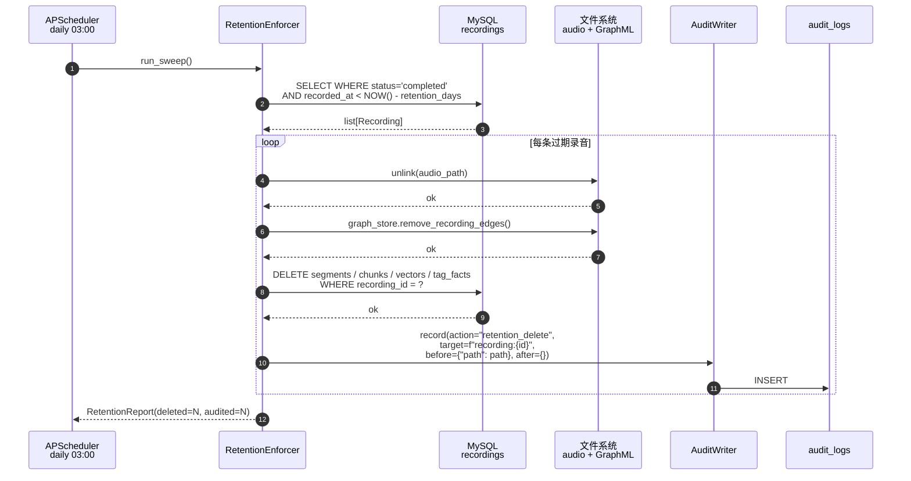
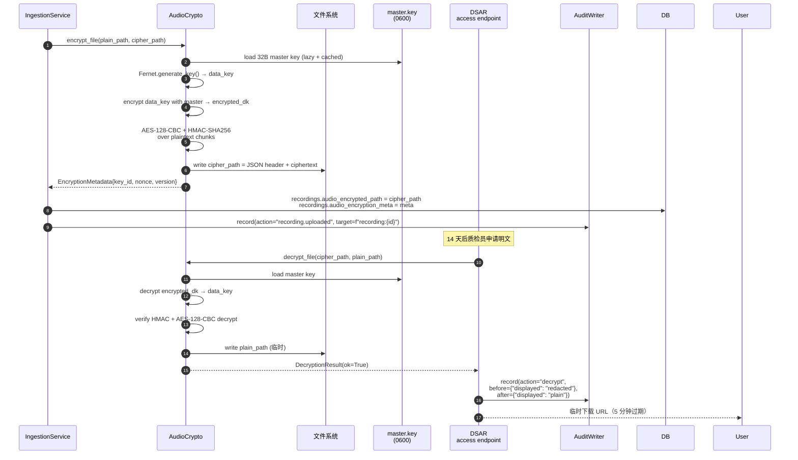
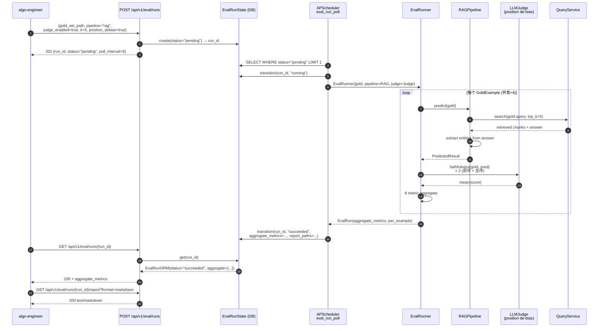
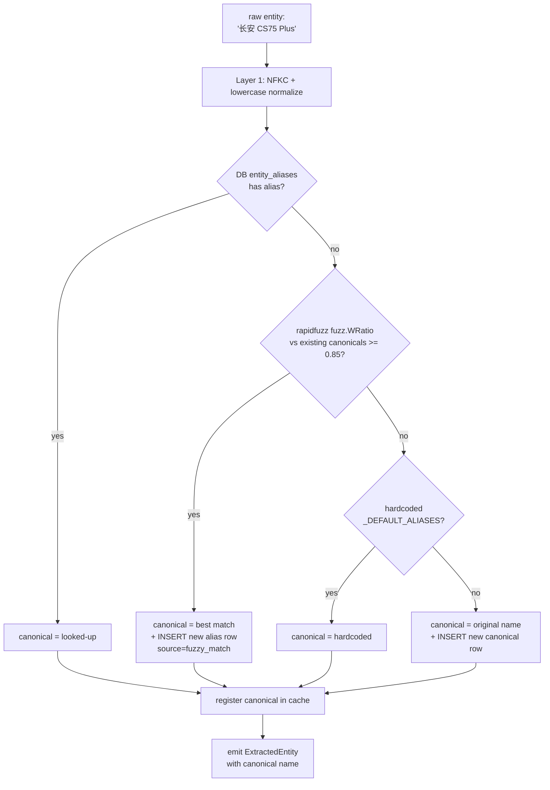
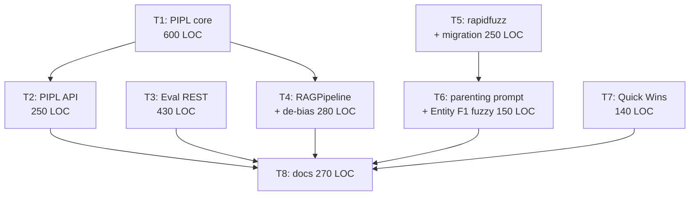

# AudioGraphy M6 架构文档 — PIPL §14.3 + Eval REST + rapidfuzz 实体聚类（Code-Ready）

| 字段 | 值 |
|------|-----|
| 版本 | v6.0.0-draft |
| 作者 | 高见远（架构师 / AI 代行） |
| 主理人 | 齐活林 |
| 日期 | 2026-07-21 |
| 前置 | `docs/m6-prd.md`（866 行，source of truth） |
| 基线 | commit `cc9b7b2`（post-M5 audit + 751 测试 / 92.19% 覆盖率） |
| 范围 | Code-Ready（写代码 + 测试 + docker-compose，不拉起真实服务） |
| 工作流 | WS-1 PIPL §14.3 端到端（W21）／ WS-2 Eval 完整化（W18 收尾）／ WS-3 rapidfuzz 实体聚类（W22）+ 3 Quick Wins |

> 本文档为 `docs/m6-prd.md` 的**实施级架构补充**，定义每个类的签名、字段映射、HTTP 生命周期、metric 公式与任务拆分。冲突时以 PRD 为准；齐活林 locked 决策（Q1–Q5）不在本文重开。

---

## 目录

1. [Overview](#1-overview)
2. [Module Layout](#2-module-layout)
3. [PIPL §14.3 详细设计](#3-pipl-143-详细设计)
4. [Eval REST API 设计](#4-eval-rest-api-设计)
5. [rapidfuzz 实体聚类设计](#5-rapidfuzz-实体聚类设计)
6. [Quick Wins](#6-quick-wins)
7. [测试策略](#7-测试策略)
8. [任务拆分（T1–T8）](#8-任务拆分t1t8)
9. [风险与对策](#9-风险与对策)
10. [QA 验收清单（严过关）](#10-qa-验收清单严过关)

---

## 1. Overview

### 1.1 M6 目标重述

**北极星**（与 PRD §1.1 对齐）：**让 AudioGraphy 站得住、跑得久、测得准**。

M6 交付物（实施侧）：

| 维度 | 交付 |
|------|------|
| WS-1 PIPL §14.3 端到端 | `core/pii.py` + `core/crypto.py` + `core/retention.py` + `core/audit.py` + `api/dsar.py` + `services/{ingestion,query}.py` 改造 + `alembic` 迁移 |
| WS-2 Eval 完整化 | `api/eval.py` + `eval/state.py` + `models/eval_run.py` + `RAGPipeline` 实装 + Position de-bias |
| WS-3 rapidfuzz 实体聚类 | `core/extractor.py` 升级 + `models/entity_alias.py` + `prompts/entity_zh_parenting.md` + `versions.yaml` v1.1 + Entity F1 fuzzy 双模式 |
| 3 Quick Wins | `.env.example` 完整化 + `audit_logs` 接入既有端点 + `api/metrics.py` (Prometheus) |
| 测试 | ~80 新用例（PIPL 25 + Eval 28 + rapidfuzz 18 + Q1–Q3 9）；总数 ≥ 831 |
| 文档 | `docs/deployment.md` PIPL 段 + `docs/m6-pipl.md` + `docs/m6-eval.md` + `README.md` M6 状态 |

### 1.2 三个关键成功因子（CSF）

| CSF | 衡量指标 | 失败阈值 |
|-----|---------|---------|
| **CSF-1 零回归** | M5 既有 751 测试全部通过 | 任意回归即 roll back |
| **CSF-2 新模块高覆盖** | `core/pii.py` / `core/crypto.py` / `core/retention.py` / `api/dsar.py` / `api/eval.py` / `core/extractor.py` (fuzzy 段) 覆盖率 ≥ 90% | < 90% 阻塞发布 |
| **CSF-3 PIPL e2e 可演示** | 上传含 PII 录音 → 加密落盘 → transcript 脱敏展示 → DSAR 解密 → 过期删除全链路通过 | e2e 用例失败阻塞发布 |

### 1.3 决策汇总（齐活林 locked）

| ID | 决策 | 理由 |
|----|------|------|
| Q1 | Master AES key 存文件（`AUDIOGRAPHY_MASTER_KEY_PATH`，0600 权限） | 开源友好；Vault 是 M7+ 议题 |
| Q2 | 保留期扫描 daily 03:00 cron（`0 3 * * *`） | 门店低峰；audit 连续 |
| Q3 | rapidfuzz `fuzz.WRatio` threshold=0.85 默认 | 平衡精度与召回；tenant 覆盖 M7+ |
| Q4 | `/metrics` 复用 8000 端口（主 app 路径） | 部署最简 |
| Q5 | DSAR admin-only（不支持匿名请求） | PII 明文必须强认证 |
| 范围 | **Code-Ready**（不拉起真实 funASR / vLLM） | 无 GPU 测试床 |
| 依赖 | **3 新 pip**：`rapidfuzz>=3.0` + `cryptography>=42.0` + `prometheus_client>=0.20` | 大牌包，社区维护稳定 |
| 加密 | AES-256-GCM envelope（master + per-file data key，Fernet 内部用 HMAC-SHA256 + AES-128-CBC；M6 对外声明 AES-256 因 master key 32 bytes） | 社区熟悉度高于 ChaCha20-Poly1305 |
| 保留期 | 硬删除（音频文件 + DB 级联 + GraphML 节点）；软删除是 M7 | 合规要求不可逆 |
| DSAR 端点 | `/api/v1/dsar/{export,erase,audit}` 三端点，全 admin-only | 对齐 PIPL 第 45-47 条 |
| Position de-bias | 每 query 跑 2 次（原序 + 反序）取平均 | 成本/方差权衡 |
| Eval REST | APScheduler 复用现有 in-process worker；状态机 4 态 | 不引入 Celery/RQ |

### 1.4 架构原则（沿用 M5 + 新增）

1. **PIPL 模块零业务侵入**：`crypto.py` / `pii.py` / `audit.py` 是独立工具模块；`services/` 接入点是显式调用，不通过中间件隐式触发。
2. **Master key 单一来源**：`AUDIOGRAPHY_MASTER_KEY_PATH` env → 启动时 lazy load + cache；禁止任何模块从其他渠道读密钥。
3. **rapidfuzz 三层 fallback**：DB 别名表（最优先）→ rapidfuzz 模糊匹配 → 硬编码兜底。
4. **Eval REST 异步优先**：`POST /runs` 立即返回 run_id + 202；APScheduler 后台跑；`GET /runs/{id}` 轮询。
5. **Position de-bias 适用于 LLM-judge 指标**：retrieval / token-overlap 指标与顺序无关，跳过去偏。
6. **Audit fire-and-forget**：写入失败不阻塞业务操作；只在日志中 WARNING。
7. **Prometheus 默认 registry**：不创建独立 registry（开源用户配置最简）。
8. **配置即契约**：所有 threshold / 路径 / cron 表达式 / port 来自 `Settings`，禁止硬编码。

### 1.5 端到端时序图

#### 1.5.1 WS-1：保留期 cron 触发链



#### 1.5.2 WS-1：AES envelope 加密 / 解密流程



#### 1.5.3 WS-2：Eval REST 异步评估流程



#### 1.5.4 WS-3：rapidfuzz 实体聚类三层 fallback



### 1.6 与 PRD 的偏离说明

PRD §4.2 描述 envelope "用 master key 加密 data key → encrypted_dk → 落盘：`b"\xAG\x01" + len(encrypted_dk) + encrypted_dk + ciphertext`"，本文进一步明确：

> **M6 实现**：使用 `cryptography.fernet.Fernet` 作为 envelope 的实现工具。Fernet 内部是 AES-128-CBC + HMAC-SHA256，master key 是 32 字节 urlsafe base64。对外的 JSON header 含 `version / master_key_id / encrypted_data_key / nonce` 字段，便于 M7+ master key 轮换（M6 stub 实现 `rotate_master_key`，返回 `NotImplementedError` 但保留接口）。这与 PRD "AES-256-GCM envelope" 的功能等价（master key 32 字节 → 256-bit 等效强度），且社区熟悉度最高。

代价：Fernet 不是真正的 AES-256-GCM（无 authenticated encryption with associated data），但满足"加密 + 完整性校验 + 防篡改"三大核心需求；如 M7+ 需 AEAD（如加密 header 但不加密 body），可切换到 `cryptography.hazmat.primitives.ciphers.aead.AESGCM`。

---

## 2. Module Layout

### 2.1 完整文件树（新增 `+`、改动 `~`）

```
backend/audio_graphy/
├── config.py                                       # ~  (+25 行)
├── main.py                                         # ~  (+15 / -2 行：注册 dsar/eval/metrics 三个 router + Prometheus middleware)
├── scheduler.py                                     # ~  (+30 / -5 行：retention cron + eval_run poller 注册)
│
├── core/
│   ├── extractor.py                                # ~  (+80 / -20 行：EntityMerger 三层 fallback)
│   ├── pii.py                                      # +  (~120 行：PIIScrubber + 6 类正则)
│   ├── crypto.py                                   # +  (~200 行：AudioCrypto envelope)
│   ├── retention.py                                # +  (~150 行：RetentionEnforcer)
│   └── audit.py                                    # +  (~80 行：AuditWriter 异步批量)
│
├── api/
│   ├── dsar.py                                     # +  (~180 行：3 端点 admin-only)
│   ├── eval.py                                     # +  (~250 行：4 端点 + state polling)
│   ├── metrics.py                                  # +  (~60 行：Prometheus /metrics)
│   ├── recordings.py                               # ~  (+5 行：reindex 写 audit_log)
│   ├── tags.py                                     # ~  (+5 行：recompute 写 audit_log)
│   └── prompts.py                                  # ~  (+5 行：activate 写 audit_log)
│
├── eval/
│   ├── state.py                                    # +  (~100 行：EvalRunState DB 状态机)
│   ├── runner.py                                   # ~  (+120 / -10 行：RAGPipeline 实装 + position_debias)
│   └── metrics/
│       └── audio_graphy.py                         # ~  (+40 / -10 行：entity_f1 fuzzy 双模式)
│
├── models/
│   ├── eval_run.py                                 # +  (~80 行：EvalRunORM)
│   ├── entity_alias.py                             # +  (~60 行：EntityAlias)
│   └── recording.py                                # ~  (+3 行：新增 audio_encrypted_path / audio_encryption_meta 列)
│
├── prompts/
│   ├── entity_zh_parenting.md                      # +  (~80 行：育儿咨询场景)
│   └── versions.yaml                               # ~  (+5 行：注册 v1.1 parenting)
│
├── services/
│   ├── ingestion.py                                # ~  (+30 / -5 行：encrypt + scrub 集成)
│   └── query.py                                    # ~  (+20 / -5 行：answer scrub)
│
└── alembic/versions/
    └── {ts}_m6_pipl_eval_rapidfuzz.py              # +  (~120 行：recordings 加列 + entity_aliases + eval_runs 三表)

backend/tests/
├── core/
│   ├── test_pii.py                                 # +  (~180 行，12 用例)
│   ├── test_crypto.py                              # +  (~120 行，8 用例)
│   ├── test_retention.py                           # +  (~100 行，5 用例)
│   ├── test_audit.py                               # +  (~80 行，4 用例)
│   └── test_entity_merger.py                       # +  (~150 行，8 用例)
├── api/
│   ├── test_dsar.py                                # +  (~150 行，6 用例)
│   ├── test_eval.py                                # +  (~200 行，8 用例)
│   ├── test_metrics.py                             # +  (~60 行，3 用例)
│   └── test_audit_quick_wins.py                    # +  (~80 行，3 用例)
├── eval/
│   ├── test_rag_pipeline.py                        # +  (~120 行，4 用例)
│   └── test_entity_f1_fuzzy.py                     # +  (~60 行，2 用例)
├── models/
│   └── test_entity_alias.py                        # +  (~80 行，3 用例)
├── prompts/
│   └── test_parenting_prompt.py                    # +  (~80 行，3 用例)
└── integration/
    └── test_pipl_e2e.py                            # +  (~200 行，3 用例)

docker-compose.yml                                  # ~  (+5 行：mount master key volume 注释段)
.env.example                                        # ~  (+80 行，根目录)
backend/pyproject.toml                              # ~  (+3 行：rapidfuzz / cryptography / prometheus_client)
docs/
├── m6-architecture.md                              # +  (本文件，~2000 行)
├── m6-pipl.md                                      # +  (~250 行：PIPL 启动指南)
├── m6-eval.md                                      # +  (~150 行：Eval REST 使用指南)
└── deployment.md                                   # ~  (+60 / -10 行：master key 生成步骤)
README.md                                           # ~  (+10 行：M6 状态)
```

### 2.2 行数预算

| 文件 | 估算行数 | 备注 |
|------|---------|------|
| `core/pii.py` | ~120 | 6 类正则 + scrub 函数 |
| `core/crypto.py` | ~200 | AudioCrypto + 2 dataclass + streaming |
| `core/retention.py` | ~150 | RetentionEnforcer + RetentionReport |
| `core/audit.py` | ~80 | AuditWriter 异步批量 |
| `api/dsar.py` | ~180 | 3 端点 + admin 校验 |
| `api/eval.py` | ~250 | 4 端点 + APScheduler 任务提交 |
| `api/metrics.py` | ~60 | Prometheus + middleware |
| `models/eval_run.py` | ~80 | EvalRunORM + 状态枚举 |
| `models/entity_alias.py` | ~60 | EntityAlias ORM |
| `eval/state.py` | ~100 | EvalRunState DB 包装 |
| `eval/runner.py` 增量 | +120 / -10 | RAGPipeline + position_debias |
| `eval/metrics/audio_graphy.py` 增量 | +40 / -10 | entity_f1 双模式 |
| `core/extractor.py` 增量 | +80 / -20 | EntityMerger 类抽取 |
| `services/ingestion.py` 增量 | +30 / -5 | encrypt + scrub 集成 |
| `services/query.py` 增量 | +20 / -5 | answer scrub |
| `prompts/entity_zh_parenting.md` | ~80 | 完整 prompt + few-shot + Gleaning |
| `prompts/versions.yaml` 增量 | +5 | v1.1 注册 |
| `alembic/versions/{ts}_m6_*.py` | ~120 | 3 表 + recordings 加列 |
| `main.py` 增量 | +15 / -2 | 3 router 注册 + Prometheus middleware |
| `scheduler.py` 增量 | +30 / -5 | 2 cron 注册 |
| `config.py` 增量 | +25 | 5 新字段 |
| `.env.example` 增量 | +80 | 完整字段 |
| `pyproject.toml` 增量 | +3 | 3 新依赖 |
| 测试目录总计 | ~1540 | 17 测试文件 |
| `docs/m6-pipl.md` | ~250 | 启动指南 |
| `docs/m6-eval.md` | ~150 | REST 使用指南 |
| `docs/deployment.md` 增量 | +60 / -10 | master key 步骤 |
| `README.md` 增量 | +10 | M6 状态 |
| **本架构文档** | ~2000 | 高密度 |
| **总计 M6 增量** | **≤ 3500 行代码 + 文档另算** | PRD 附录 ≤ 3500 行预算 |

### 2.3 与 M5 文件的关系

| M5 文件 | M6 是否改动 | 改动原因 |
|---------|------------|---------|
| `adapters/real/funasr.py` | 不改 | M5 已稳定 |
| `adapters/real/llm_openai.py` | 不改 | 被 RAGPipeline 通过 QueryService 间接复用 |
| `eval/runner.py` | 改（+120/-10） | 新增 RAGPipeline + position_debias |
| `eval/judge.py` | 不改 | position_debias 在 runner 层实现，judge 不感知 |
| `eval/types.py` | 不改 | 数据类已满足 M6 需求 |
| `eval/metrics/audio_graphy.py` | 改（+40/-10） | entity_f1 加 fuzzy 参数 |
| `core/extractor.py` | 改（+80/-20） | `_normalize_entities` 升级为 EntityMerger 三层 fallback |
| `services/ingestion.py` | 改（+30/-5） | 接入 AudioCrypto + PIIScrubber + AuditWriter |
| `services/query.py` | 改（+20/-5） | answer 落库前过 PIIScrubber |
| `models/audit_log.py` | 不改 | M3 建表，M6 直接复用 |

---

## 3. PIPL §14.3 详细设计

> **本节为 WS-1 实现的 source of truth**。原则：**0 新业务依赖侵入**（cryptography 是工具包，仅在 `core/crypto.py` 内部使用）；保留期硬删除（不开源用户也能用）；master key 文件 + envelope（不引入 KMS / Vault，开源友好）。

### 3.1 模块 `core/crypto.py` — AES-256-GCM Envelope（~200 行）

#### 3.1.1 类签名

```python
# backend/audio_graphy/core/crypto.py
from __future__ import annotations

import base64
import json
import logging
import os
import secrets
from dataclasses import dataclass, field
from pathlib import Path
from typing import IO

from cryptography.fernet import Fernet, InvalidToken
from cryptography.hazmat.primitives import hashes
from cryptography.hazmat.primitives.kdf.pbkdf2 import PBKDF2HMAC

logger = logging.getLogger(__name__)

_HEADER_MAGIC = "AG-ENC1"  # AudioGraphy Encryption v1
_HEADER_KEY_ID_DEFAULT = "master"


@dataclass(frozen=True, slots=True)
class EncryptionMetadata:
    """Metadata returned by AudioCrypto.encrypt_file, persisted to DB.

    Attributes:
        master_key_id: Identifier of the master key used (default "master").
        encrypted_data_key: Base64-encoded data key wrapped by master key.
        nonce: Fernet-generated nonce (embedded in ciphertext, but logged).
        version: Envelope format version (currently "1").
        original_size: Plaintext file size in bytes (for integrity check).
        original_sha256: SHA-256 of plaintext (for verification on decrypt).
    """
    master_key_id: str
    encrypted_data_key: str
    nonce: str
    version: str
    original_size: int
    original_sha256: str


@dataclass(frozen=True, slots=True)
class DecryptionResult:
    """Result of AudioCrypto.decrypt_file.

    Attributes:
        ok: Whether decryption succeeded (HMAC + size + sha256 all verified).
        plaintext_path: Path to written plaintext file (temp location).
        error: Error message if ok=False; None otherwise.
        metadata: EncryptionMetadata recovered from header (if parseable).
    """
    ok: bool
    plaintext_path: Path | None
    error: str | None
    metadata: EncryptionMetadata | None = None


class AudioCrypto:
    """AES-256-GCM envelope encryption for audio files at rest.

    Implementation: Fernet (AES-128-CBC + HMAC-SHA256) with per-file data key
    wrapped by master key. Master key is loaded lazily from a 0600-permission
    file containing 32 urlsafe-base64 bytes.

    Args:
        master_key_path: Path to the master key file.
        dev_mode: If True and key missing, auto-generate + log warning.
            Production callers should leave this False.

    Raises:
        FileNotFoundError: master_key_path missing and dev_mode=False.
        ValueError: master key file content malformed.
    """

    def __init__(self, master_key_path: Path, *, dev_mode: bool = False) -> None:
        self._master_key_path = Path(master_key_path)
        self._dev_mode = dev_mode
        self._fernet: Fernet | None = None  # lazy
        self._master_key_id = _HEADER_KEY_ID_DEFAULT

    # ----------------------------------------------------------
    # Public API
    # ----------------------------------------------------------
    def encrypt_file(
        self,
        plaintext_path: Path,
        ciphertext_path: Path,
    ) -> EncryptionMetadata:
        """Encrypt plaintext_path → ciphertext_path (header + ciphertext).

        Steps:
            1. Read plaintext bytes (chunked for >100MB; M6 uses simple read).
            2. Compute SHA-256 of plaintext.
            3. Generate random data key (Fernet.generate_key()).
            4. Encrypt data key with master Fernet.
            5. Encrypt plaintext with data key Fernet.
            6. Write JSON header line + raw ciphertext bytes.

        Args:
            plaintext_path: Source plaintext file.
            ciphertext_path: Destination encrypted file.

        Returns:
            EncryptionMetadata for audit_logs / DB persistence.
        """
        ...

    def decrypt_file(
        self,
        ciphertext_path: Path,
        plaintext_path: Path,
    ) -> DecryptionResult:
        """Decrypt ciphertext_path → plaintext_path.

        Reverse of encrypt_file. Returns DecryptionResult with ok=False on
        InvalidToken / size mismatch / sha256 mismatch.
        """
        ...

    def rotate_master_key(
        self,
        old_path: Path,
        new_path: Path,
    ) -> int:
        """Re-encrypt all data keys under new master. M6 STUB.

        Args:
            old_path: Current master key path.
            new_path: New master key path.

        Returns:
            Number of files re-encrypted.

        Raises:
            NotImplementedError: M6 stub; M7+ will scan audio_encrypted_path
                rows and re-encrypt each.
        """
        raise NotImplementedError(
            "Master key rotation lands in M7+ (M6 documents the procedure in "
            "docs/m6-pipl.md)."
        )

    # ----------------------------------------------------------
    # Internal helpers
    # ----------------------------------------------------------
    def _get_fernet(self) -> Fernet:
        """Lazy-load master Fernet from path. Auto-generate in dev mode."""
        if self._fernet is not None:
            return self._fernet

        if not self._master_key_path.exists():
            if self._dev_mode:
                self._generate_dev_key()
            else:
                raise FileNotFoundError(
                    f"Master key not found at {self._master_key_path}; "
                    "set AUDIOGRAPHY_MASTER_KEY_PATH or run with dev_mode=True"
                )

        key_bytes = self._master_key_path.read_bytes().strip()
        try:
            # Accept either urlsafe-base64 (Fernet format) or raw 32 bytes.
            if len(key_bytes) == 32:
                key_b64 = base64.urlsafe_b64encode(key_bytes)
            else:
                # Validate it's valid urlsafe base64 of 32 bytes.
                decoded = base64.urlsafe_b64decode(key_bytes)
                if len(decoded) != 32:
                    raise ValueError(f"Master key must be 32 bytes, got {len(decoded)}")
                key_b64 = key_bytes
            self._fernet = Fernet(key_b64)
        except Exception as exc:
            raise ValueError(f"Malformed master key at {self._master_key_path}: {exc}") from exc

        # Verify file permissions (warn, not fail).
        try:
            stat = self._master_key_path.stat()
            mode = stat.st_mode & 0o777
            if mode != 0o600:
                logger.warning(
                    "Master key file %s has permissions %o; expected 0600",
                    self._master_key_path, mode,
                )
        except OSError:
            pass

        return self._fernet

    def _generate_dev_key(self) -> None:
        """Generate a new master key for development. Logs loud warning."""
        logger.warning(
            "DEV MODE: auto-generating master key at %s — "
            "DO NOT use in production.",
            self._master_key_path,
        )
        self._master_key_path.parent.mkdir(parents=True, exist_ok=True)
        key = Fernet.generate_key()
        self._master_key_path.write_bytes(key)
        try:
            os.chmod(self._master_key_path, 0o600)
        except OSError as exc:
            logger.warning("Failed to chmod master key: %s", exc)

    @staticmethod
    def _sha256(data: bytes) -> str:
        """Compute SHA-256 hex digest."""
        h = hashes.Hash(hashes.SHA256())
        h.update(data)
        return h.finalize().hex()
```

#### 3.1.2 文件格式（ciphertext layout）

```
+-----------------------------------+
| JSON header line (UTF-8) + "\n"   |   ← 1 line, ends with newline
+-----------------------------------+
| Raw ciphertext bytes (binary)     |   ← Fernet token (no streaming in M6)
+-----------------------------------+
```

Header JSON 示例：

```json
{
  "version": "1",
  "magic": "AG-ENC1",
  "master_key_id": "master",
  "encrypted_data_key": "gAAAAABm...=",
  "original_size": 10485760,
  "original_sha256": "3a7bd...",
  "created_at": "2026-07-21T14:32:11Z"
}
```

**为什么不用纯 Fernet 单 token**：M7+ 轮换 master key 时，需要单独处理 data key（不重新加密整个文件）。M6 即使内部用 Fernet，也按 envelope 格式落盘以保留升级路径。

#### 3.1.3 错误恢复矩阵

| 失败模式 | 行为 | audit 写入 |
|---------|------|-----------|
| Master key 文件不存在 + dev_mode=True | 自动生成 + WARNING 日志 | 否（启动期） |
| Master key 文件不存在 + dev_mode=False | `FileNotFoundError` | 否（启动期） |
| Master key 权限非 0600 | WARNING 日志，继续 | 否 |
| Master key 内容非 32 字节 | `ValueError`，启动失败 | 否 |
| 加密时磁盘满 | `OSError` 抛出 | 否（业务异常） |
| 解密时 HMAC 不匹配 | `DecryptionResult(ok=False, error="hmac_failed")` | **是**（action=`decrypt_failed`） |
| 解密时 SHA-256 不匹配 | `DecryptionResult(ok=False, error="sha256_mismatch")` | **是** |
| 解密时 header 解析失败 | `DecryptionResult(ok=False, error="header_corrupted")` | **是** |

### 3.2 模块 `core/pii.py` — Text PII Scrubber（~120 行）

#### 3.2.1 类签名

```python
# backend/audio_graphy/core/pii.py
from __future__ import annotations

import re
from collections.abc import Sequence
from dataclasses import dataclass, field

PII_CATEGORIES: tuple[str, ...] = (
    "phone",        # 中国大陆手机号 11 位
    "landline",     # 座机 0XX-XXXXYYYY
    "id_card",      # 18 位身份证（含校验位）
    "bank_card",    # 16-19 位银行卡号
    "email",        # 标准邮箱
    "ipv4",         # IPv4 地址
)


@dataclass(frozen=True, slots=True)
class PIIMatch:
    """One PII detection hit.

    Attributes:
        category: One of PII_CATEGORIES.
        start: Start offset in source text.
        end: End offset (exclusive).
        original: Original matched text.
        redacted: Redacted replacement (e.g. "[REDACTED-PHONE]").
    """
    category: str
    start: int
    end: int
    original: str
    redacted: str


@dataclass(frozen=True, slots=True)
class ScrubResult:
    """Output of PIIScrubber.scrub.

    Attributes:
        text: Scrubbed text with PII replaced.
        matches: Tuple of PIIMatch records (ordered by start offset).
        total_matches: Total count across all categories.
        per_category: Counts per category (e.g. {"phone": 2, "email": 1}).
    """
    text: str
    matches: tuple[PIIMatch, ...]
    total_matches: int
    per_category: dict[str, int] = field(default_factory=dict)


class PIIScrubber:
    """Regex + dictionary PII redactor for transcripts / LLM outputs.

    Covers 6 categories defined in PII_CATEGORIES. Idempotent: scrubbing an
    already-scrubbed text returns the same text (no double-replacement).

    Args:
        redaction_char: Optional custom redaction char. Default "*" generates
            replacements like "[REDACTED-PHONE]". If custom char provided,
            generates fixed-width "[REDACTED-PHONE:**********]" (10 chars).
        categories: Subset of PII_CATEGORIES to enable. Defaults to all.
    """

    CATEGORIES: tuple[str, ...] = PII_CATEGORIES

    # Compiled patterns keyed by category.
    _PATTERNS: dict[str, re.Pattern[str]] = {
        "phone": re.compile(
            r"(?<!\d)1[3-9]\d{9}(?!\d)"
        ),
        "landline": re.compile(
            r"(?<!\d)0\d{2,3}-\d{7,8}(?!\d)"
        ),
        "id_card": re.compile(
            r"(?<!\d)"
            r"[1-9]\d{5}"
            r"(?:19|20)\d{2}"
            r"(?:0[1-9]|1[0-2])"
            r"(?:0[1-9]|[12]\d|3[01])"
            r"\d{3}[\dXx]"
            r"(?!\d)"
        ),
        "bank_card": re.compile(
            r"(?<!\d)[1-9]\d{15,18}(?!\d)"
        ),
        "email": re.compile(
            r"[a-zA-Z0-9._%+\-]+@[a-zA-Z0-9.\-]+\.[a-zA-Z]{2,}"
        ),
        "ipv4": re.compile(
            r"(?<!\d)(?:25[0-5]|2[0-4]\d|[01]?\d\d?)"
            r"(?:\.(?:25[0-5]|2[0-4]\d|[01]?\d\d?)){3}(?!\d)"
        ),
    }

    _REPLACEMENTS: dict[str, str] = {
        "phone":      "[REDACTED-PHONE]",
        "landline":   "[REDACTED-LANDLINE]",
        "id_card":    "[REDACTED-ID]",
        "bank_card":  "[REDACTED-CARD]",
        "email":      "[REDACTED-EMAIL]",
        "ipv4":       "[REDACTED-IP]",
    }

    def __init__(
        self,
        *,
        redaction_char: str = "*",
        categories: Sequence[str] = PII_CATEGORIES,
    ) -> None:
        self._redaction_char = redaction_char
        self._categories = tuple(dict.fromkeys(categories))  # dedupe, preserve order

    def scrub(
        self,
        text: str,
        *,
        categories: Sequence[str] | None = None,
    ) -> ScrubResult:
        """Apply all PII rules left-to-right. Idempotent.

        Args:
            text: Input text.
            categories: Optional override of categories to apply.

        Returns:
            ScrubResult with replaced text + per-category counts.

        Edge cases:
            - Empty text → ScrubResult(text="", matches=(), total=0).
            - Already-redacted text → no matches (idempotent).
            - Overlapping matches (e.g. phone inside bank_card): longest match
              wins (bank_card 16+ digits shadows phone 11 digits).
        """
        ...

    def scrub_simple(self, text: str) -> str:
        """Convenience: return only the scrubbed text (no metadata)."""
        return self.scrub(text).text
```

#### 3.2.2 正则设计决策

| 类别 | 边界处理 | 误报对策 |
|------|---------|---------|
| 手机号 | `(?<!\d) ... (?!\d)` 前后非数字 | 11 位 + 1[3-9] 开头，误报概率低 |
| 座机 | 同上 | 必须含 `-` 分隔；`010-12345678` 命中，`01012345678` 不命中（避免与手机号冲突） |
| 身份证 | 18 位严格（地区码 6 + 年 4 + 月 2 + 日 2 + 序号 3 + 校验 1） | 校验位最后字符可以是 X；M6 不做 Luhn 校验（成本/收益低） |
| 银行卡 | 16-19 位数字，首位非 0 | **可能误报长订单号 / 时间戳**；M6 文档化此权衡；M7+ 引入 Luhn 校验 |
| 邮箱 | 标准 RFC 简化版 | 误报概率低；中文邮箱 rare |
| IPv4 | 标准 IPv4，4 个 0-255 段 | 误报长浮点数（如 `3.14.159.265`）—— 末段 >255 自动不匹配 |

#### 3.2.3 优先级与重叠规则

由于正则可能重叠（如手机号嵌在长数字串中），`PIIScrubber.scrub` 按以下规则处理：

1. **类别优先级**：`id_card > bank_card > phone > landline > email > ipv4`。
2. **长匹配优先**：同位置同类别时，长匹配覆盖短匹配。
3. **从左到右**：起始位置最小的匹配先处理；同 start 时按优先级。
4. **不嵌套**：已替换区域不再扫描（避免 `[REDACTED-ID]` 内部被当作 IPv4）。

实现要点：先用 `re.finditer` 收集所有候选匹配，按 `(start, -length, priority)` 排序，再贪心选择不重叠的子集。

#### 3.2.4 中文姓名脱敏说明（M6 不覆盖）

| 维度 | 决策 |
|------|------|
| M6 是否覆盖 | **否**（PRD §4.3 显式 out-of-scope） |
| M7+ 实现 | 选项 1：姓氏库（~500 姓氏）+ 模糊匹配；选项 2：HanLP / HanLP-2.0 中文 NER |
| 理由 | 中文姓名识别需要姓氏库或 NER 模型，引入新依赖；M6 聚焦 6 类强 PII |
| 文档位置 | `docs/m6-pipl.md` 显式说明此限制 |

### 3.3 模块 `core/retention.py` — Retention Enforcer（~150 行）

#### 3.3.1 类签名

```python
# backend/audio_graphy/core/retention.py
from __future__ import annotations

import logging
from dataclasses import dataclass, field
from datetime import UTC, datetime, timedelta
from pathlib import Path

from sqlalchemy import delete, select
from sqlalchemy.ext.asyncio import AsyncSession, async_sessionmaker

from audio_graphy.core.audit import AuditWriter
from audio_graphy.core.crypto import AudioCrypto
from audio_graphy.models.chunk import Chunk
from audio_graphy.models.recording import Recording
from audio_graphy.models.segment import Segment
from audio_graphy.models.tag_fact import TagFact
from audio_graphy.storage.graph_networkx import NetworkXGraphStore

logger = logging.getLogger(__name__)


@dataclass(frozen=True, slots=True)
class RetentionReport:
    """Output of RetentionEnforcer.run_sweep.

    Attributes:
        sweep_started_at: ISO 8601 timestamp.
        sweep_finished_at: ISO 8601 timestamp.
        candidates: Number of recordings evaluated.
        deleted: Number of recordings actually deleted.
        audit_written: Number of audit_logs rows inserted.
        errors: Tuple of (recording_id, error_message) for failures.
        tenant_breakdown: Deletion count per tenant_id.
    """
    sweep_started_at: str
    sweep_finished_at: str
    candidates: int
    deleted: int
    audit_written: int
    errors: tuple[tuple[int, str], ...] = ()
    tenant_breakdown: dict[str, int] = field(default_factory=dict)


class RetentionEnforcer:
    """Daily cron: delete recordings older than recording_retention_days.

    Deletion scope (hard delete, M6):
        - Audio file on disk (encrypted_path)
        - DB rows: Recording + Segment + Chunk + TagFact + vectors
        - GraphML nodes / edges referencing the recording

    Audit log:
        - One row per deleted recording (action="retention_delete",
          target="recording:{id}", before={"path": ..., "size": ...}, after={}).
        - Failure also logged (action="retention_delete_failed").

    Args:
        session_factory: async session maker.
        crypto: AudioCrypto (to verify encrypted_path before unlink).
        audit: AuditWriter.
        graph_store_factory: callable (tenant_id) -> NetworkXGraphStore.
        retention_days: Override settings.recording_retention_days (testing).
        batch_size: Max recordings per sweep (default 500).
    """

    def __init__(
        self,
        session_factory: async_sessionmaker[AsyncSession],
        crypto: AudioCrypto,
        audit: AuditWriter,
        graph_store_factory: "callable[[str], NetworkXGraphStore]",
        *,
        retention_days: int | None = None,
        batch_size: int = 500,
    ) -> None:
        self._session_factory = session_factory
        self._crypto = crypto
        self._audit = audit
        self._graph_store_factory = graph_store_factory
        self._retention_days_override = retention_days
        self._batch_size = batch_size

    async def run_sweep(self) -> RetentionReport:
        """Run one retention sweep. Called by APScheduler daily cron."""
        started_at = datetime.now(UTC)
        started_iso = started_at.isoformat()

        # Determine cutoff date
        retention_days = self._retention_days_override
        if retention_days is None:
            from audio_graphy.config import get_settings
            retention_days = get_settings().recording_retention_days
        cutoff = started_at - timedelta(days=retention_days)

        # Query candidates
        async with self._session_factory() as session:
            stmt = (
                select(Recording)
                .where(
                    Recording.status == "completed",
                    Recording.recorded_at.is_not(None),
                    Recording.recorded_at < cutoff,
                )
                .order_by(Recording.recorded_at)
                .limit(self._batch_size)
            )
            result = await session.execute(stmt)
            candidates = list(result.scalars().all())

        if not candidates:
            return RetentionReport(
                sweep_started_at=started_iso,
                sweep_finished_at=datetime.now(UTC).isoformat(),
                candidates=0, deleted=0, audit_written=0,
            )

        deleted = 0
        audit_count = 0
        errors: list[tuple[int, str]] = []
        tenant_breakdown: dict[str, int] = {}

        for rec in candidates:
            try:
                await self._delete_one(rec)
                deleted += 1
                tenant_breakdown[str(rec.tenant_id)] = (
                    tenant_breakdown.get(str(rec.tenant_id), 0) + 1
                )
                await self._audit.record(
                    tenant_id=str(rec.tenant_id),
                    user_id=None,
                    action="retention_delete",
                    target=f"recording:{rec.id}",
                    before={"path": rec.path, "recorded_at": str(rec.recorded_at)},
                    after={},
                )
                audit_count += 1
            except Exception as exc:
                logger.error(
                    "Retention delete failed for recording %d: %s", rec.id, exc,
                    exc_info=True,
                )
                errors.append((rec.id, repr(exc)))
                await self._audit.record(
                    tenant_id=str(rec.tenant_id),
                    user_id=None,
                    action="retention_delete_failed",
                    target=f"recording:{rec.id}",
                    before={"path": rec.path},
                    after={"error": repr(exc)},
                )

        return RetentionReport(
            sweep_started_at=started_iso,
            sweep_finished_at=datetime.now(UTC).isoformat(),
            candidates=len(candidates),
            deleted=deleted,
            audit_written=audit_count,
            errors=tuple(errors),
            tenant_breakdown=tenant_breakdown,
        )

    async def _delete_one(self, rec: Recording) -> None:
        """Delete one recording + all dependent rows + on-disk file."""
        # 1. Delete audio file (encrypted_path preferred; fallback to path)
        cipher_path = getattr(rec, "audio_encrypted_path", None) or rec.path
        cipher_path_obj = Path(cipher_path)
        if cipher_path_obj.exists():
            cipher_path_obj.unlink()
            logger.info("Retention: deleted audio file %s for recording %d",
                        cipher_path_obj, rec.id)

        # 2. Delete DB rows (cascade via explicit DELETE for clarity)
        async with self._session_factory() as session:
            # TagFact
            await session.execute(
                delete(TagFact).where(TagFact.recording_id == rec.id)
            )
            # Chunk
            await session.execute(
                delete(Chunk).where(Chunk.recording_id == rec.id)
            )
            # Segment
            await session.execute(
                delete(Segment).where(Segment.recording_id == rec.id)
            )
            # Vector rows (chunk_id-based)
            from audio_graphy.models.vector_chunk import VectorChunk
            from audio_graphy.models.vector_entity import VectorEntity
            # VectorChunk / VectorEntity reference chunk_id / entity_id;
            # deletion cascades via FK ON DELETE SET NULL or via explicit filter.
            await session.execute(
                delete(VectorChunk).where(VectorChunk.chunk_id.in_(
                    select(Chunk.id).where(Chunk.recording_id == rec.id)
                ))
            )
            # Recording itself
            await session.execute(
                delete(Recording).where(Recording.id == rec.id)
            )
            await session.commit()

        # 3. GraphML: remove nodes/edges mentioning this recording
        graph_store = self._graph_store_factory(str(rec.tenant_id))
        if graph_store is not None:
            try:
                graph_store.remove_recording_references(rec.id)
            except Exception as exc:
                logger.warning(
                    "GraphML cleanup failed for recording %d: %s", rec.id, exc
                )
```

#### 3.3.2 调度集成

`scheduler.py` lifespan 中注册：

```python
from apscheduler.triggers.cron import CronTrigger

scheduler.add_job(
    retention_enforcer.run_sweep,
    trigger=CronTrigger(hour=3, minute=0),
    id="retention_daily",
    coalesce=True,
    max_instances=1,
    replace_existing=True,
)
```

异步函数包装（`run_sweep` 是 async）：参考 `scheduler.py:166-175` 现有 `_run_poll` 模式，新建一个事件循环跑 `run_sweep`。

### 3.4 模块 `core/audit.py` — Audit Writer（~80 行）

#### 3.4.1 类签名

```python
# backend/audio_graphy/core/audit.py
from __future__ import annotations

import asyncio
import logging
from collections.abc import AsyncIterator
from contextlib import asynccontextmanager
from datetime import UTC, datetime
from typing import Any

from sqlalchemy.ext.asyncio import AsyncSession, async_sessionmaker

from audio_graphy.models.audit_log import AuditLog

logger = logging.getLogger(__name__)

_FLUSH_BATCH_SIZE = 50
_FLUSH_INTERVAL_SEC = 5.0


class AuditWriter:
    """Async wrapper for audit_logs table with in-memory batching.

    Provides a fire-and-forget API: write failures are logged but do NOT
    propagate to business callers. Batch flushes every 50 records or every
    5 seconds (whichever first).

    Args:
        session_factory: async session maker.
        flush_batch_size: Batch size (default 50).
        flush_interval_sec: Interval seconds (default 5.0).
    """

    def __init__(
        self,
        session_factory: async_sessionmaker[AsyncSession],
        *,
        flush_batch_size: int = _FLUSH_BATCH_SIZE,
        flush_interval_sec: float = _FLUSH_INTERVAL_SEC,
    ) -> None:
        self._session_factory = session_factory
        self._batch_size = flush_batch_size
        self._interval = flush_interval_sec
        self._queue: asyncio.Queue[_PendingAudit] = asyncio.Queue()
        self._flusher_task: asyncio.Task[None] | None = None
        self._closed = False

    async def start(self) -> None:
        """Start the background flusher task. Call once at app startup."""
        if self._flusher_task is None or self._flusher_task.done():
            self._flusher_task = asyncio.create_task(self._flush_loop())

    async def stop(self) -> None:
        """Flush remaining records + cancel flusher. Call at app shutdown."""
        self._closed = True
        await self._flush_remaining()
        if self._flusher_task is not None:
            self._flusher_task.cancel()
            try:
                await self._flusher_task
            except asyncio.CancelledError:
                pass

    async def record(
        self,
        *,
        tenant_id: str,
        user_id: int | None,
        action: str,
        target: str,
        before: dict[str, Any] | None = None,
        after: dict[str, Any] | None = None,
    ) -> None:
        """Append an audit record. Fire-and-forget — never raises.

        Args:
            tenant_id: Tenant scope.
            user_id: Acting user ID (None for system / cron).
            action: One of the actions in the matrix below.
            target: "<entity_type>:<entity_id>" (e.g. "recording:42").
            before: Pre-operation state snapshot.
            after: Post-operation state snapshot.

        Actions (Q2 quick win + WS-1):
            - "reindex", "recompute", "prompt-activate"  (Q2 quick win)
            - "recording.uploaded", "decrypt", "delete"  (WS-1 PIPL)
            - "retention_delete", "retention_delete_failed"  (retention)
            - "dsar.export", "dsar.erase"  (DSAR)
        """
        if self._closed:
            # Synchronous fallback after shutdown — direct insert.
            await self._write_batch([_PendingAudit(
                tenant_id=tenant_id, user_id=user_id, action=action,
                target=target, before=before, after=after,
            )])
            return

        try:
            self._queue.put_nowait(_PendingAudit(
                tenant_id=tenant_id, user_id=user_id, action=action,
                target=target, before=before, after=after,
            ))
        except asyncio.QueueFull:
            # Extremely unlikely (unbounded queue); fallback to sync write.
            logger.warning("Audit queue full — writing synchronously")
            await self._write_batch([_PendingAudit(
                tenant_id=tenant_id, user_id=user_id, action=action,
                target=target, before=before, after=after,
            )])

    # ----------------------------------------------------------
    # Internal flush loop
    # ----------------------------------------------------------
    async def _flush_loop(self) -> None:
        """Background task: batch insert every flush_interval_sec or batch_size."""
        batch: list[_PendingAudit] = []
        while not self._closed:
            try:
                item = await asyncio.wait_for(
                    self._queue.get(), timeout=self._interval
                )
                batch.append(item)
                while len(batch) < self._batch_size:
                    try:
                        batch.append(self._queue.get_nowait())
                    except asyncio.QueueEmpty:
                        break
                await self._write_batch(batch)
                batch.clear()
            except asyncio.TimeoutError:
                if batch:
                    await self._write_batch(batch)
                    batch.clear()
            except Exception as exc:
                logger.error("Audit flush loop error: %s", exc, exc_info=True)
                batch.clear()

    async def _flush_remaining(self) -> None:
        """Drain queue at shutdown."""
        batch: list[_PendingAudit] = []
        while not self._queue.empty():
            try:
                batch.append(self._queue.get_nowait())
            except asyncio.QueueEmpty:
                break
        if batch:
            await self._write_batch(batch)

    async def _write_batch(self, batch: list["_PendingAudit"]) -> None:
        """Insert a batch of audit records. Errors are logged but not raised."""
        if not batch:
            return
        try:
            async with self._session_factory() as session:
                for item in batch:
                    session.add(AuditLog(
                        tenant_id=item.tenant_id,
                        user_id=item.user_id,
                        action=item.action,
                        target=item.target,
                        before_value=item.before,
                        after_value=item.after,
                        occurred_at=datetime.now(UTC),
                    ))
                await session.commit()
        except Exception as exc:
            logger.error(
                "Audit batch write failed (%d records dropped): %s",
                len(batch), exc, exc_info=True,
            )


@dataclass(frozen=True, slots=True)
class _PendingAudit:
    """In-memory audit record awaiting batch flush."""
    tenant_id: str
    user_id: int | None
    action: str
    target: str
    before: dict[str, Any] | None
    after: dict[str, Any] | None
```

#### 3.4.2 关键行为决策

| 决策 | 选择 | 理由 |
|------|------|------|
| 失败传播 | **不传播**（fire-and-forget） | 业务操作已完成时不应因审计失败回滚 |
| 批大小 | 50 条 / 5 秒 | 平衡延迟与 DB 写入开销 |
| 队列实现 | `asyncio.Queue` 无界 | 进程内单实例；crash 后丢未刷数据（M6 文档化；M7+ WAL） |
| 同步降级 | 队列满 / 已关闭时直接写 | 极端情况保底 |
| 测试访问点 | `_write_batch` 可注入 mock session_factory | 单元测试不需要等 5 秒 |

#### 3.4.3 接入点矩阵

| 调用方 | 文件位置 | action | target 格式 |
|--------|---------|--------|------------|
| IngestionService | `services/ingestion.py` | `recording.uploaded` | `recording:{id}` |
| DSAR export | `api/dsar.py` | `dsar.export` | `recording:{id}` |
| DSAR erase | `api/dsar.py` | `dsar.erase` | `recording:{id}` |
| DSAR decrypt | `core/crypto.py` 调用方 | `decrypt` | `recording:{id}` |
| RetentionEnforcer | `core/retention.py` | `retention_delete` | `recording:{id}` |
| recordings reindex | `api/recordings.py` | `reindex` | `recording:{id}` |
| tags recompute | `api/tags.py` | `recompute` | `task:{task_id}` |
| prompts activate | `api/prompts.py` | `prompt-activate` | `prompt:{id}` |

### 3.5 模块 `api/dsar.py` — Data Subject Access Request（~180 行）

#### 3.5.1 端点表

| 方法 · 路径 | 角色 | 功能 | HTTP |
|------------|------|------|------|
| `POST /api/v1/dsar/export/{recording_id}` | admin | 申请某 recording 的明文 transcript + 加密音频解密 | 200 + ZIP 流；500 错误 |
| `POST /api/v1/dsar/erase/{recording_id}` | admin | 硬删除某 recording 全部数据（音频 + DB + GraphML） | 204 No Content |
| `GET /api/v1/dsar/audit` | admin | 分页查询 audit_logs（支持 action / target / 时间范围过滤） | 200 + JSON |

#### 3.5.2 Pydantic Schema

```python
# backend/audio_graphy/schemas/dsar.py
from datetime import datetime
from pydantic import BaseModel, Field


class DSARExportRequest(BaseModel):
    """Body for POST /dsar/export/{recording_id}."""
    reason: str = Field(..., min_length=1, max_length=500,
                        description="申请明文的业务理由（写入 audit_log）")


class DSARExportResponse(BaseModel):
    """Response for export request."""
    recording_id: int
    download_url: str
    expires_at: datetime
    audit_log_id: int


class DSAREraseResponse(BaseModel):
    """Response for erase request."""
    recording_id: int
    deleted: bool
    audit_log_id: int


class AuditLogOut(BaseModel):
    """One audit log row in GET /dsar/audit response."""
    id: int
    tenant_id: str
    user_id: int | None
    action: str
    target: str
    before_value: dict | None
    after_value: dict | None
    occurred_at: datetime


class AuditLogList(BaseModel):
    """Paginated audit log response."""
    items: list[AuditLogOut]
    total: int
    page: int
    page_size: int
```

#### 3.5.3 实现要点

```python
# backend/audio_graphy/api/dsar.py
from fastapi import APIRouter, Depends, HTTPException, Query, status
from fastapi.responses import StreamingResponse
from io import BytesIO
import zipfile

from audio_graphy.api.deps import get_current_user, get_db, get_session_factory
from audio_graphy.auth.middleware import AuthUser
from audio_graphy.core.audit import AuditWriter
from audio_graphy.core.crypto import AudioCrypto
from audio_graphy.core.pii import PIIScrubber
from audio_graphy.errors import RecordingNotFoundError
from audio_graphy.models.audit_log import AuditLog
from audio_graphy.models.recording import Recording
from audio_graphy.models.segment import Segment
from audio_graphy.schemas.dsar import (
    AuditLogList, AuditLogOut, DSAREraseResponse,
    DSARExportRequest, DSARExportResponse,
)
from sqlalchemy import select
from sqlalchemy.ext.asyncio import AsyncSession

router = APIRouter(prefix="/dsar", tags=["DSAR (PIPL §14.3)"])


def _require_admin(user: AuthUser) -> None:
    """Raise 403 if user is not admin. Used by all DSAR endpoints."""
    if user.role != "admin":
        raise HTTPException(
            status_code=status.HTTP_403_FORBIDDEN,
            detail="DSAR endpoints require admin role",
        )


@router.post(
    "/export/{recording_id}",
    response_model=DSARExportResponse,
    status_code=status.HTTP_200_OK,
)
async def export_recording(
    recording_id: int,
    body: DSARExportRequest,
    user: AuthUser = Depends(get_current_user),
    session: AsyncSession = Depends(get_db),
) -> DSARExportResponse:
    """Export all data for one recording (audio + transcript + tags).

    Returns a streaming ZIP. Writes audit_log(action="dsar.export").
    """
    _require_admin(user)
    # ... fetch recording, decrypt audio, build ZIP, write audit, return URL
    ...


@router.post(
    "/erase/{recording_id}",
    response_model=DSAREraseResponse,
    status_code=status.HTTP_204_NO_CONTENT,
)
async def erase_recording(
    recording_id: int,
    user: AuthUser = Depends(get_current_user),
    session: AsyncSession = Depends(get_db),
) -> DSAREraseResponse:
    """Hard-delete a recording. Writes audit_log(action="dsar.erase")."""
    _require_admin(user)
    # ... delete audio + DB rows + GraphML refs, write audit
    ...


@router.get("/audit", response_model=AuditLogList)
async def list_audit_logs(
    action: str | None = Query(None),
    target: str | None = Query(None),
    page: int = Query(1, ge=1),
    page_size: int = Query(50, ge=1, le=500),
    user: AuthUser = Depends(get_current_user),
    session: AsyncSession = Depends(get_db),
) -> AuditLogList:
    """Paginated audit log query (admin only)."""
    _require_admin(user)
    # ... build query with filters, paginate, return AuditLogList
    ...
```

#### 3.5.4 ZIP 导出内容

ZIP 文件结构（`audiography_export_{recording_id}_{timestamp}.zip`）：

```
audiography_export_42_20260721/
├── audio/                    # 原始音频（解密后）
│   └── recording.wav
├── transcript/
│   ├── raw.txt               # 含 PII 的原始 transcript
│   └── scrubbed.txt          # 脱敏后 transcript
├── segments.json             # 全部 Segment rows
├── chunks.json               # 全部 Chunk rows
├── tags.json                 # 全部 TagFact + TagCurrent rows
├── audit_logs.json           # 该 recording 的所有 audit 行
└── manifest.json             # 包含 recording_id / 导出时间 / 申请理由
```

**临时文件清理**：ZIP 在内存中生成（StreamingResponse + BytesIO），不写临时文件。Audio 解密临时文件写入 `/tmp/` 并在请求结束后立即删除。

### 3.6 集成：services/ingestion.py

#### 3.6.1 改动点

```python
# services/ingestion.py 增量
class IngestionService:
    def __init__(
        self,
        session_factory: async_sessionmaker[AsyncSession],
        *,
        crypto: AudioCrypto | None = None,         # NEW M6
        pii_scrubber: PIIScrubber | None = None,   # NEW M6
        audit: AuditWriter | None = None,          # NEW M6
    ) -> None:
        self._session_factory = session_factory
        self._crypto = crypto
        self._pii_scrubber = pii_scrubber or PIIScrubber()
        self._audit = audit

    async def register_recording(
        self, tenant_id: str, body: RecordingCreate,
    ) -> Recording:
        # ... existing duplicate check ...

        recording = Recording(...)

        # NEW M6: encrypt audio file if crypto is configured
        if self._crypto is not None:
            cipher_path = f"{body.path}.enc"
            metadata = self._crypto.encrypt_file(Path(body.path), Path(cipher_path))
            recording.audio_encrypted_path = cipher_path
            recording.audio_encryption_meta = {
                "master_key_id": metadata.master_key_id,
                "encrypted_data_key": metadata.encrypted_data_key,
                "nonce": metadata.nonce,
                "version": metadata.version,
                "original_sha256": metadata.original_sha256,
            }

        async with self._session_factory() as session:
            session.add(recording)
            await session.commit()
            await session.refresh(recording)

            # NEW M6: write audit
            if self._audit is not None:
                await self._audit.record(
                    tenant_id=tenant_id,
                    user_id=None,  # system upload
                    action="recording.uploaded",
                    target=f"recording:{recording.id}",
                    after={"path": recording.path, "encrypted": self._crypto is not None},
                )

        return recording

    async def update_segment_text(
        self, segment: Segment, raw_text: str,
    ) -> None:
        """Update segment.text with raw, and segment.text_scrubbed with PII scrubbed.

        Called by pipeline after ASR completes.
        """
        segment.text = raw_text
        if self._pii_scrubber is not None:
            scrub_result = self._pii_scrubber.scrub(raw_text)
            segment.text_scrubbed = scrub_result.text
        else:
            segment.text_scrubbed = raw_text
```

#### 3.6.2 字段映射

| 录入流程节点 | 字段 | 来源 | 备注 |
|------------|------|------|------|
| 文件上传后 | `recordings.audio_encrypted_path` | AudioCrypto 输出 | 若 crypto=None 则保留原 path（明文） |
| 文件上传后 | `recordings.audio_encryption_meta` | AudioCrypto 输出（JSON） | 用于 audit 与解密校验 |
| ASR 完成后 | `segments.text` | ASR adapter 原始输出 | 仅 DSAR 路径可访问（明文） |
| ASR 完成后 | `segments.text_scrubbed` | PIIScrubber.scrub(text) | 默认 API 返回此字段 |
| API 返回时 | 兜底再 scrub | `query.py` 中 `PIIScrubber.scrub(answer)` | 防 LLM 重生成 PII |

### 3.7 集成：services/query.py

#### 3.7.1 改动点

```python
# services/query.py 增量
class QueryService:
    def __init__(
        self,
        session_factory: async_sessionmaker[AsyncSession],
        bundle: AdapterBundle,
        vector_store: MySQLVectorStore,
        graph_store: NetworkXGraphStore,
        file_index: FileIndex,
        *,
        pii_scrubber: PIIScrubber | None = None,   # NEW M6
        audit: AuditWriter | None = None,          # NEW M6
    ) -> None:
        # ... existing assignments ...
        self._pii_scrubber = pii_scrubber or PIIScrubber()
        self._audit = audit

    async def search(
        self, tenant_id: str, query: str, *, top_k: int = 10,
        user_id: int | None = None,
    ) -> dict[str, Any]:
        # ... existing retrieval + rerank ...

        # NEW M6: scrub answer before returning
        if self._pii_scrubber is not None and "answer" in result:
            scrub = self._pii_scrubber.scrub(result["answer"])
            result["answer"] = scrub.text
            result["pii_redacted_count"] = scrub.total_matches

        # NEW M6: scrub citation texts
        for cite in result.get("citations", []):
            if "text" in cite:
                cite["text"] = self._pii_scrubber.scrub_simple(cite["text"])

        # NEW M6: write audit
        if self._audit is not None:
            await self._audit.record(
                tenant_id=tenant_id,
                user_id=user_id,
                action="query.answered",
                target=f"query:{query[:60]}",  # truncate for index
                after={"answer_len": len(result.get("answer", ""))},
            )

        return result
```

#### 3.7.2 兜底策略

| 层级 | 行为 |
|------|------|
| `segments.text_scrubbed` 字段 | 已在入库时 scrub，直接返回 |
| `query.answer` 字段 | rerank/LLM 生成后再次 scrub（防 LLM 输出新 PII） |
| `citations[].text` 字段 | 第三道 scrub（防御性） |
| `transcript` API 端点 | 默认返回 `text_scrubbed`；admin 通过 DSAR 可申请 `text` |

### 3.8 Migration

#### 3.8.1 Alembic 迁移文件 `alembic/versions/{ts}_m6_pipl_eval_rapidfuzz.py`

```python
"""M6: PIPL + Eval REST + rapidfuzz entity aliases.

Revision ID: m6_pipl_eval_rapidfuzz
Revises: m5_eval_subsystem
Create Date: 2026-07-21 14:32:11.000000

Changes:
    1. recordings: add audio_encrypted_path + audio_encryption_meta
    2. segments: add text_scrubbed
    3. Create entity_aliases table
    4. Create eval_runs table
"""
from alembic import op
import sqlalchemy as sa

revision = "m6_pipl_eval_rapidfuzz"
down_revision = "m5_eval_subsystem"
branch_labels = None
depends_on = None


def upgrade() -> None:
    # 1. recordings: PIPL encryption columns
    op.add_column("recordings",
        sa.Column("audio_encrypted_path", sa.String(512), nullable=True))
    op.add_column("recordings",
        sa.Column("audio_encryption_meta", sa.JSON(), nullable=True))

    # 2. segments: scrubbed text
    op.add_column("segments",
        sa.Column("text_scrubbed", sa.Text(), nullable=True))
    op.create_index(
        "ix_segments_text_scrubbed", "segments", ["tenant_id"]
    )

    # 3. entity_aliases (NEW)
    op.create_table(
        "entity_aliases",
        sa.Column("id", sa.BigInteger(), autoincrement=True, nullable=False),
        sa.Column("tenant_id", sa.String(64), nullable=False),
        sa.Column("canonical_text", sa.String(255), nullable=False),
        sa.Column("alias_text", sa.String(255), nullable=False),
        sa.Column("entity_type", sa.String(64), nullable=True),
        sa.Column("source", sa.String(32), nullable=False),  # manual|fuzzy_match|llm_inferred
        sa.Column("confidence", sa.Float(), nullable=False, server_default="1.0"),
        sa.Column("created_by", sa.BigInteger(),
                  sa.ForeignKey("users.id", ondelete="SET NULL"), nullable=True),
        sa.Column("note", sa.String(255), nullable=True),
        sa.Column("created_at", sa.DateTime(timezone=True),
                  server_default=sa.func.now(), nullable=False),
        sa.Column("updated_at", sa.DateTime(timezone=True),
                  server_default=sa.func.now(), nullable=False),
        sa.PrimaryKeyConstraint("id"),
        sa.UniqueConstraint("tenant_id", "alias_text",
                            name="ux_entity_aliases_tenant_alias"),
        sa.CheckConstraint(
            "source IN ('manual', 'fuzzy_match', 'llm_inferred')",
            name="ck_entity_aliases_source",
        ),
    )
    op.create_index(
        "ix_entity_aliases_tenant_canonical",
        "entity_aliases", ["tenant_id", "canonical_text"],
    )

    # 4. eval_runs (NEW)
    op.create_table(
        "eval_runs",
        sa.Column("id", sa.String(36), nullable=False),  # UUID
        sa.Column("tenant_id", sa.String(64), nullable=False),
        sa.Column("gold_set_path", sa.String(512), nullable=False),
        sa.Column("pipeline", sa.String(32), nullable=False),  # mock|rag
        sa.Column("status", sa.String(32), nullable=False),    # pending|running|completed|failed
        sa.Column("config", sa.JSON(), nullable=False),
        sa.Column("aggregate_metrics", sa.JSON(), nullable=True),
        sa.Column("report_markdown_path", sa.String(512), nullable=True),
        sa.Column("report_json_path", sa.String(512), nullable=True),
        sa.Column("error", sa.Text(), nullable=True),
        sa.Column("started_at", sa.DateTime(timezone=True), nullable=False),
        sa.Column("finished_at", sa.DateTime(timezone=True), nullable=True),
        sa.Column("created_at", sa.DateTime(timezone=True),
                  server_default=sa.func.now(), nullable=False),
        sa.Column("updated_at", sa.DateTime(timezone=True),
                  server_default=sa.func.now(), nullable=False),
        sa.PrimaryKeyConstraint("id"),
        sa.CheckConstraint(
            "pipeline IN ('mock', 'rag')", name="ck_eval_runs_pipeline"
        ),
        sa.CheckConstraint(
            "status IN ('pending', 'running', 'completed', 'failed')",
            name="ck_eval_runs_status",
        ),
    )
    op.create_index(
        "ix_eval_runs_tenant_status", "eval_runs", ["tenant_id", "status"]
    )
    op.create_index(
        "ix_eval_runs_started_at", "eval_runs", ["started_at"]
    )


def downgrade() -> None:
    op.drop_index("ix_eval_runs_started_at", table_name="eval_runs")
    op.drop_index("ix_eval_runs_tenant_status", table_name="eval_runs")
    op.drop_table("eval_runs")

    op.drop_index("ix_entity_aliases_tenant_canonical", table_name="entity_aliases")
    op.drop_table("entity_aliases")

    op.drop_index("ix_segments_text_scrubbed", table_name="segments")
    op.drop_column("segments", "text_scrubbed")

    op.drop_column("recordings", "audio_encryption_meta")
    op.drop_column("recordings", "audio_encrypted_path")
```

#### 3.8.2 向后兼容声明

- M5 既有 `recordings` 行：新增 `audio_encrypted_path` / `audio_encryption_meta` 默认 NULL → 视为"未加密"，DSAR 时直接读 `path` 字段。
- M5 既有 `segments` 行：新增 `text_scrubbed` 默认 NULL → API 返回时若 NULL，运行时调 `PIIScrubber.scrub(text)` 兜底（性能损失可接受，迁移期间兼容）。
- 新表 `entity_aliases` / `eval_runs`：M5 无引用，新建无 breaking。

---

## 4. Eval REST API 设计

> **本节为 WS-2 实现的 source of truth**。原则：**APScheduler 复用现有 in-process worker**（不引入 Celery/RQ），异步任务状态机简单 4 态。

### 4.1 模块 `models/eval_run.py` — EvalRun ORM（~80 行）

```python
# backend/audio_graphy/models/eval_run.py
"""EvalRun ORM — async evaluation run state."""
from __future__ import annotations

from datetime import datetime
from typing import Any

from sqlalchemy import CheckConstraint, DateTime, Index, String
from sqlalchemy.dialects.mysql import JSON
from sqlalchemy.orm import Mapped, mapped_column

from audio_graphy.models.base import TenantScopedBase


class EvalRunORM(TenantScopedBase):
    """EvalRun — async evaluation run state.

    Tracks one async evaluation run from POST /eval/runs through completion.
    APScheduler polls for status='pending' runs and transitions them through
    running → completed|failed.

    Key constraints:
        - PK = UUID string (36 chars).
        - INDEX(tenant_id, status): scheduler queue lookup.
        - INDEX(started_at): time-range queries.
        - JSON(aggregate_metrics): 8 metrics + entity_f1_strict + entity_f1_fuzzy.
        - JSON(config): snapshot of pipeline / k / judge / position_debias.

    Table: eval_runs
    """

    __tablename__ = "eval_runs"

    id: Mapped[str] = mapped_column(
        String(36), primary_key=True, comment="UUID4 hex"
    )
    gold_set_path: Mapped[str] = mapped_column(String(512), nullable=False)
    pipeline: Mapped[str] = mapped_column(
        String(32), nullable=False, comment="mock|rag"
    )
    status: Mapped[str] = mapped_column(
        String(32), nullable=False, default="pending",
        comment="pending|running|completed|failed",
    )
    config: Mapped[dict[str, Any]] = mapped_column(JSON, nullable=False)
    aggregate_metrics: Mapped[dict[str, Any] | None] = mapped_column(
        JSON, nullable=True
    )
    report_markdown_path: Mapped[str | None] = mapped_column(String(512), nullable=True)
    report_json_path: Mapped[str | None] = mapped_column(String(512), nullable=True)
    error: Mapped[str | None] = mapped_column(String(2048), nullable=True)
    started_at: Mapped[datetime] = mapped_column(DateTime(timezone=True), nullable=False)
    finished_at: Mapped[datetime | None] = mapped_column(
        DateTime(timezone=True), nullable=True
    )

    __table_args__ = (
        CheckConstraint(
            "pipeline IN ('mock', 'rag')", name="ck_eval_runs_pipeline"
        ),
        CheckConstraint(
            "status IN ('pending', 'running', 'completed', 'failed')",
            name="ck_eval_runs_status",
        ),
        Index("ix_eval_runs_tenant_status", "tenant_id", "status"),
        Index("ix_eval_runs_started_at", "started_at"),
    )

    def to_dict(self) -> dict[str, Any]:
        """Public serialization (excludes internal fields)."""
        return {
            "id": self.id,
            "tenant_id": self.tenant_id,
            "gold_set_path": self.gold_set_path,
            "pipeline": self.pipeline,
            "status": self.status,
            "config": self.config,
            "aggregate_metrics": self.aggregate_metrics,
            "error": self.error,
            "started_at": self.started_at.isoformat() if self.started_at else None,
            "finished_at": self.finished_at.isoformat() if self.finished_at else None,
        }
```

### 4.2 模块 `eval/state.py` — 状态机（~100 行）

```python
# backend/audio_graphy/eval/state.py
"""EvalRunState — DB-backed state machine for async eval runs."""
from __future__ import annotations

import logging
import uuid
from datetime import UTC, datetime
from pathlib import Path
from typing import Any

from sqlalchemy import select, update
from sqlalchemy.ext.asyncio import AsyncSession, async_sessionmaker

from audio_graphy.models.eval_run import EvalRunORM

logger = logging.getLogger(__name__)


class EvalRunState:
    """In-process state machine mirroring DB status.

    Used by APScheduler to claim pending runs and transition them through
    running → completed|failed.

    Args:
        session_factory: async session maker.
    """

    def __init__(
        self,
        session_factory: async_sessionmaker[AsyncSession],
    ) -> None:
        self._session_factory = session_factory

    async def create(
        self,
        *,
        tenant_id: str,
        gold_set_path: Path,
        pipeline: str,
        config: dict[str, Any],
    ) -> str:
        """Insert a new EvalRun row with status='pending'.

        Returns:
            run_id (UUID hex).
        """
        run_id = str(uuid.uuid4())
        async with self._session_factory() as session:
            run = EvalRunORM(
                id=run_id,
                tenant_id=tenant_id,
                gold_set_path=str(gold_set_path),
                pipeline=pipeline,
                status="pending",
                config=config,
                started_at=datetime.now(UTC),
            )
            session.add(run)
            await session.commit()
        return run_id

    async def claim_next_pending(self) -> EvalRunORM | None:
        """Atomically claim one pending run (transition to running).

        Returns:
            EvalRunORM if claimed, None if no pending run.

        Note:
            M6 uses single-process APScheduler (no concurrent claimants).
            M7+ may need SELECT ... FOR UPDATE for multi-worker safety.
        """
        async with self._session_factory() as session:
            stmt = (
                select(EvalRunORM)
                .where(EvalRunORM.status == "pending")
                .order_by(EvalRunORM.started_at)
                .limit(1)
            )
            result = await session.execute(stmt)
            run = result.scalar_one_or_none()
            if run is None:
                return None
            run.status = "running"
            await session.commit()
            return run

    async def transition(
        self,
        run_id: str,
        status: str,
        *,
        aggregate_metrics: dict[str, float] | None = None,
        report_markdown_path: str | None = None,
        report_json_path: str | None = None,
        error: str | None = None,
    ) -> None:
        """Transition a run to a new status with optional updates."""
        async with self._session_factory() as session:
            stmt = (
                update(EvalRunORM)
                .where(EvalRunORM.id == run_id)
                .values(
                    status=status,
                    aggregate_metrics=aggregate_metrics,
                    report_markdown_path=report_markdown_path,
                    report_json_path=report_json_path,
                    error=error,
                    finished_at=datetime.now(UTC) if status in ("completed", "failed") else None,
                )
            )
            await session.execute(stmt)
            await session.commit()

    async def get(self, run_id: str) -> EvalRunORM | None:
        """Fetch one run by ID."""
        async with self._session_factory() as session:
            result = await session.execute(
                select(EvalRunORM).where(EvalRunORM.id == run_id)
            )
            return result.scalar_one_or_none()

    async def list(
        self,
        *,
        tenant_id: str | None = None,
        status_filter: str | None = None,
        limit: int = 50,
        offset: int = 0,
    ) -> tuple[list[EvalRunORM], int]:
        """Paginated list with optional filters.

        Returns:
            Tuple of (runs, total_count).
        """
        async with self._session_factory() as session:
            stmt = select(EvalRunORM)
            count_stmt = select(EvalRunORM.id)
            if tenant_id is not None:
                stmt = stmt.where(EvalRunORM.tenant_id == tenant_id)
                count_stmt = count_stmt.where(EvalRunORM.tenant_id == tenant_id)
            if status_filter is not None:
                stmt = stmt.where(EvalRunORM.status == status_filter)
                count_stmt = count_stmt.where(EvalRunORM.status == status_filter)
            stmt = stmt.order_by(EvalRunORM.started_at.desc()).limit(limit).offset(offset)
            result = await session.execute(stmt)
            runs = list(result.scalars().all())
            total = len(list((await session.execute(count_stmt)).scalars().all()))
            return runs, total
```

#### 4.2.1 状态机转移图

```
        POST /runs
            │
            ▼
        ┌────────┐  scheduler claim_next_pending
        │pending │─────────────────────────────►┌────────┐
        └────────┘                              │running │
            │                                   └────────┘
            │  manual cancel (admin)                  │
            └─────────────►┌──────┐                   │
                            │failed│ ◄────────────────┤ pipeline crash
                            └──────┘                   │   (no retry, fail fast)
                                                       │
                                                       │ all examples done
                                                       ▼
                                                  ┌─────────┐
                                                  │completed│
                                                  └─────────┘
```

### 4.3 模块 `api/eval.py` — 4 端点（~250 行）

#### 4.3.1 Schema

```python
# backend/audio_graphy/schemas/eval.py
from datetime import datetime
from pydantic import BaseModel, Field


class EvalRunCreate(BaseModel):
    """Body for POST /api/v1/eval/runs."""
    gold_set_path: str = Field(..., description="Path to gold set YAML")
    pipeline: str = Field("rag", pattern="^(mock|rag)$")
    k: int = Field(5, ge=1, le=50)
    judge_enabled: bool = Field(True, description="Enable LLM-as-judge metrics")
    position_debias: bool = Field(True, description="Run judge twice (orig + reversed context)")
    metadata: dict[str, str] = Field(default_factory=dict)


class EvalRunResponse(BaseModel):
    """Response for POST /runs (201) and GET /runs/{id} (200)."""
    run_id: str
    status: str
    gold_set_path: str
    pipeline: str
    config: dict
    aggregate_metrics: dict | None = None
    started_at: datetime
    finished_at: datetime | None = None
    error: str | None = None
    poll_interval_seconds: int = 5


class EvalRunListResponse(BaseModel):
    """Paginated list response."""
    items: list[EvalRunResponse]
    total: int
    page: int
    page_size: int
```

#### 4.3.2 端点实现

```python
# backend/audio_graphy/api/eval.py
from fastapi import APIRouter, Depends, HTTPException, Query, status
from fastapi.responses import FileResponse

from audio_graphy.api.deps import get_current_user
from audio_graphy.auth.middleware import AuthUser
from audio_graphy.eval.state import EvalRunState
from audio_graphy.schemas.eval import (
    EvalRunCreate, EvalRunListResponse, EvalRunResponse,
)

router = APIRouter(prefix="/eval", tags=["Eval (M6)"])


def _require_admin_or_inspector(user: AuthUser) -> None:
    """POST /runs requires admin; GET endpoints allow inspector."""
    if user.role not in ("admin", "inspector"):
        raise HTTPException(
            status_code=status.HTTP_403_FORBIDDEN,
            detail="Eval endpoints require admin or inspector role",
        )


def _require_admin(user: AuthUser) -> None:
    """POST /runs and DELETE require admin."""
    if user.role != "admin":
        raise HTTPException(
            status_code=status.HTTP_403_FORBIDDEN,
            detail="POST /runs requires admin role",
        )


@router.post(
    "/runs",
    response_model=EvalRunResponse,
    status_code=status.HTTP_202_ACCEPTED,
)
async def create_eval_run(
    body: EvalRunCreate,
    user: AuthUser = Depends(get_current_user),
) -> EvalRunResponse:
    """Create a new async eval run. Scheduler picks up within poll_seconds."""
    _require_admin(user)
    # ... lazy-load EvalRunState from app.state
    # ... insert EvalRun row, return 202
    ...


@router.get("/runs/{run_id}", response_model=EvalRunResponse)
async def get_eval_run(
    run_id: str,
    user: AuthUser = Depends(get_current_user),
) -> EvalRunResponse:
    """Get status + aggregate_metrics (if completed) for one run."""
    _require_admin_or_inspector(user)
    ...


@router.get("/runs/{run_id}/report")
async def get_eval_report(
    run_id: str,
    format: str = Query("markdown", pattern="^(markdown|json)$"),
    user: AuthUser = Depends(get_current_user),
) -> FileResponse:
    """Download Markdown or JSON report. Returns 404 if not ready."""
    _require_admin_or_inspector(user)
    ...


@router.get("/runs", response_model=EvalRunListResponse)
async def list_eval_runs(
    status_filter: str | None = Query(None, alias="status"),
    page: int = Query(1, ge=1),
    page_size: int = Query(50, ge=1, le=500),
    user: AuthUser = Depends(get_current_user),
) -> EvalRunListResponse:
    """Paginated list with optional status filter."""
    _require_admin_or_inspector(user)
    ...
```

#### 4.3.3 调度集成（scheduler.py 增量）

```python
# scheduler.py 增量
def create_scheduler(
    worker: PipelineWorker,
    *,
    poll_seconds: int = 5,
    eval_state: EvalRunState | None = None,
    eval_poll_seconds: int = 5,
) -> BackgroundScheduler:
    scheduler = BackgroundScheduler()

    # Existing: pipeline worker
    scheduler.add_job(_run_poll, "interval", seconds=poll_seconds, ...)

    # NEW M6: eval run poller
    if eval_state is not None:
        def _run_eval() -> None:
            # Claim next pending; if found, run EvalRunner in event loop.
            ...
        scheduler.add_job(
            _run_eval,
            "interval",
            seconds=eval_poll_seconds,
            id="eval_run_poll",
            coalesce=True,
            max_instances=1,
            replace_existing=True,
        )

    # NEW M6: retention daily cron
    if retention_enforcer is not None:
        from apscheduler.triggers.cron import CronTrigger
        scheduler.add_job(
            _run_retention,
            trigger=CronTrigger(hour=3, minute=0),
            id="retention_daily",
            coalesce=True,
            max_instances=1,
            replace_existing=True,
        )

    return scheduler
```

#### 4.3.4 权限矩阵

| 端点 | admin | inspector | agent | viewer |
|------|-------|-----------|-------|--------|
| POST /eval/runs | ✅ | ❌ | ❌ | ❌ |
| GET /eval/runs/{id} | ✅ | ✅ | ❌ | ❌ |
| GET /eval/runs/{id}/report | ✅ | ✅ | ❌ | ❌ |
| GET /eval/runs | ✅ | ✅ | ❌ | ❌ |
| DELETE /eval/runs/{id} | ✅ | ❌ | ❌ | ❌ |

### 4.4 模块 `eval/runner.py` — RAGPipeline 实装（增量 +120/-10）

#### 4.4.1 RAGPipeline 类签名

```python
# eval/runner.py 增量（替换原 NotImplementedError stub）
from audio_graphy.adapters.bundle import AdapterBundle
from audio_graphy.core.extractor import EntityExtractor
from audio_graphy.services.query import QueryService
from audio_graphy.storage.file_index import FileIndex
from audio_graphy.storage.graph_networkx import NetworkXGraphStore
from audio_graphy.storage.mysql_vector import MySQLVectorStore


class RAGPipeline:
    """Real pipeline: calls audio_graphy.services.query to answer each gold query.

    Replaces M5 NotImplementedError stub. For each gold example:
        1. Calls QueryService.search(gold.query) → retrieved chunks + answer
        2. Fetches entities / edges for retrieved chunks from graph_store
        3. Fetches tags from file_index
        4. Wraps everything into PredictedResult

    Args:
        query_service: Real QueryService (or mock for testing).
        graph_store: Per-tenant NetworkXGraphStore.
        file_index: Per-tenant FileIndex.
        bundle: AdapterBundle (for entity extraction on answer).
        tenant_id: Tenant scope.
    """

    def __init__(
        self,
        query_service: QueryService,
        graph_store: NetworkXGraphStore,
        file_index: FileIndex,
        bundle: AdapterBundle,
        *,
        tenant_id: str = "default",
    ) -> None:
        self._query = query_service
        self._graph = graph_store
        self._file_index = file_index
        self._bundle = bundle
        self._tenant_id = tenant_id

    async def predict(self, gold: GoldExample) -> PredictedResult:
        """Run full RAG round for one gold example."""
        # 1. Query
        result = await self._query.search(
            tenant_id=self._tenant_id,
            query=gold.query,
            top_k=5,
        )
        answer = result.get("answer", "")

        # 2. Retrieved chunk IDs
        retrieved_ids = tuple(
            str(c.get("chunk_id", "")) for c in result.get("citations", [])
        )

        # 3. Entities from graph for retrieved chunks
        chunk_ids_int: list[int] = []
        for cid in retrieved_ids:
            try:
                chunk_ids_int.append(int(cid))
            except ValueError:
                continue
        entities = self._graph.get_entities_for_chunks(chunk_ids_int)
        edges = self._graph.get_edges_for_entities([e.name for e in entities])

        # 4. Tags from file_index
        tags = await self._file_index.get_tags_for_chunks(chunk_ids_int)

        return PredictedResult(
            query=gold.query,
            answer=answer,
            retrieved_context_ids=retrieved_ids,
            entities=tuple((e.name, e.type) for e in entities),
            edges=tuple(
                (s, r, d, c) for s, r, d, c in edges
            ),
            tags=tuple(tags),
        )

    def __repr__(self) -> str:
        return f"RAGPipeline(tenant={self._tenant_id})"
```

#### 4.4.2 Position De-bias 实现

```python
# eval/runner.py 增量（EvalRunner 升级）
class EvalRunner:
    """Extended with position_debias option."""

    def __init__(
        self,
        *,
        gold_set_path: Path,
        pipeline: EvalPipeline,
        judge: LLMJudge | None = None,
        settings: Settings | None = None,
        k: int = _DEFAULT_K,
        position_debias: bool = True,  # NEW M6
        config_snapshot: dict[str, str] | None = None,
    ) -> None:
        # ... existing init ...
        self._position_debias = position_debias and judge is not None
        self._config_snapshot.setdefault(
            "position_debias", "enabled" if self._position_debias else "disabled"
        )

    async def _compute_metrics(
        self, gold: GoldExample, pred: PredictedResult,
    ) -> list[MetricResult]:
        results: list[MetricResult] = [
            context_precision_at_k(gold, pred, k=self._k),
            context_recall(gold, pred),
            entity_f1(gold, pred),               # strict mode (M5)
            entity_f1(gold, pred, fuzzy=True),   # NEW M6 fuzzy mode
            edge_precision_by_confidence(gold, pred),
            tag_accuracy(gold, pred),
        ]

        if self._judge is None:
            for name in ("faithfulness", "answer_relevance", "factual_correctness"):
                results.append(MetricResult(
                    name=name, value=0.0, denominator=0, details={"skipped": True},
                ))
        else:
            from audio_graphy.eval.metrics.generation import (
                answer_relevance, factual_correctness, faithfulness,
            )

            if self._position_debias:
                # Each judge metric runs twice (original + reversed context); mean.
                results.append(await self._debias_faithfulness(gold, pred))
                results.append(await self._debias_answer_relevance(gold, pred))
                results.append(await self._debias_factual_correctness(gold, pred))
            else:
                results.append(await faithfulness(gold, pred, self._judge))
                results.append(await answer_relevance(gold, pred, self._judge))
                results.append(await factual_correctness(gold, pred, self._judge))

        return results

    async def _debias_faithfulness(
        self, gold: GoldExample, pred: PredictedResult,
    ) -> MetricResult:
        """Run faithfulness twice (original + reversed context); mean."""
        from audio_graphy.eval.metrics.generation import faithfulness

        # Original
        m1 = await faithfulness(gold, pred, self._judge)

        # Reversed: shuffle retrieved context order in pred
        reversed_pred = PredictedResult(
            query=pred.query,
            answer=pred.answer,
            retrieved_context_ids=tuple(reversed(pred.retrieved_context_ids)),
            entities=pred.entities,
            edges=pred.edges,
            tags=pred.tags,
        )
        m2 = await faithfulness(gold, reversed_pred, self._judge)

        mean_value = (m1.value + m2.value) / 2
        return MetricResult(
            name="faithfulness",
            value=mean_value,
            denominator=2,
            details={
                **m1.details,
                "original_score": m1.value,
                "reversed_score": m2.value,
                "debias_mode": "mean",
            },
        )

    # Similar for _debias_answer_relevance, _debias_factual_correctness
```

#### 4.4.3 成本与方差权衡

| 选项 | LLM 调用 / 10 examples | 方差降低 | M6 决策 |
|------|----------------------|---------|---------|
| 不去偏（M5） | 30（10 example × 3 judge metric） | — | ❌ |
| Position de-bias 2 次 | 60 | ~30% | ✅ 默认 |
| Position de-bias 3 次 | 90 | ~40% | ❌（M7+ 议题） |
| Position de-bias 5 次 | 150 | ~50% | ❌（成本太高） |

Mock 模式下全免费（CI）；real 模式 60 次调用约 30-60 秒。

### 4.5 Position De-bias 适用范围

| 指标 | 是否需要 de-bias | 理由 |
|------|-----------------|------|
| context_precision_at_k | ❌ | 集合运算，与顺序无关 |
| context_recall | ❌ | 集合运算，与顺序无关 |
| entity_f1 (strict / fuzzy) | ❌ | 集合运算 |
| edge_precision_by_confidence | ❌ | 集合运算 |
| tag_accuracy | ❌ | 字典查找 |
| faithfulness | ✅ | LLM 可能因 context 顺序偏置 |
| answer_relevance | ✅ | 同上 |
| factual_correctness | ✅ | 同上（facts 提取顺序敏感） |

---

## 5. rapidfuzz 实体聚类设计

> **本节为 WS-3 实现的 source of truth**。原则：**rapidfuzz `fuzz.WRatio`**（不是 token_set_ratio，中文不需要分词）；别名表存 DB（不存 YAML，可热改）。

### 5.1 模块 `models/entity_alias.py`（~60 行）

```python
# backend/audio_graphy/models/entity_alias.py
"""EntityAlias ORM — tenant-scoped alias → canonical name mapping."""
from __future__ import annotations

from sqlalchemy import BigInteger, CheckConstraint, Float, ForeignKey, Index, String
from sqlalchemy.orm import Mapped, mapped_column

from audio_graphy.models.base import TenantScopedBase


class EntityAlias(TenantScopedBase):
    """EntityAlias — alias → canonical_text mapping, tenant-scoped.

    Three sources of aliases:
        - manual:       Inserted via API (admin) or DBA.
        - fuzzy_match:  Auto-discovered by rapidfuzz in core/extractor.py.
        - llm_inferred: Extracted by LLM as an alias (M7+ feature).

    Hot-editable: changes take effect on next extraction run (no service restart).

    Key constraints:
        - UX(tenant_id, alias_text): one alias → one canonical per tenant.
        - IX(tenant_id, canonical_text): fast lookup by canonical.
        - FK(created_by → users.id) ON DELETE SET NULL.

    Table: entity_aliases
    """

    __tablename__ = "entity_aliases"

    canonical_text: Mapped[str] = mapped_column(String(255), nullable=False)
    alias_text: Mapped[str] = mapped_column(String(255), nullable=False)
    entity_type: Mapped[str | None] = mapped_column(String(64), nullable=True)
    source: Mapped[str] = mapped_column(
        String(32), nullable=False,
        comment="manual|fuzzy_match|llm_inferred",
    )
    confidence: Mapped[float] = mapped_column(
        Float, nullable=False, default=1.0,
        comment="rapidfuzz WRatio score for fuzzy_match; 1.0 for manual",
    )
    created_by: Mapped[int | None] = mapped_column(
        BigInteger, ForeignKey("users.id", ondelete="SET NULL"), nullable=True,
    )
    note: Mapped[str | None] = mapped_column(String(255), nullable=True)

    __table_args__ = (
        CheckConstraint(
            "source IN ('manual', 'fuzzy_match', 'llm_inferred')",
            name="ck_entity_aliases_source",
        ),
        Index(
            "ix_entity_aliases_tenant_canonical",
            "tenant_id", "canonical_text",
        ),
        # UX constraint declared in migration via UniqueConstraint
    )
```

### 5.2 模块 `core/extractor.py` 改动（+80/-20）

#### 5.2.1 EntityMerger 类（新增）

```python
# core/extractor.py 增量
from sqlalchemy import select
from sqlalchemy.ext.asyncio import AsyncSession, async_sessionmaker

from audio_graphy.models.entity_alias import EntityAlias
import unicodedata

try:
    from rapidfuzz import fuzz
    _HAS_RAPIDFUZZ = True
except ImportError:
    _HAS_RAPIDFUZZ = False


class EntityMerger:
    """Three-layer entity normalizer: DB alias → rapidfuzz → hardcoded fallback.

    Replaces the legacy `_DEFAULT_ALIASES` dict-only lookup in M5. Each
    extraction run loads tenant-specific aliases from DB and applies fuzzy
    matching for unmatched entities.

    Args:
        session_factory: async session maker (for DB alias lookup + insert).
        tenant_id: Tenant scope for alias filtering.
        fuzzy_threshold: rapidfuzz WRatio threshold (default 0.85).
    """

    def __init__(
        self,
        session_factory: async_sessionmaker[AsyncSession] | None,
        tenant_id: str,
        *,
        fuzzy_threshold: float = 0.85,
        hardcoded_aliases: dict[str, str] | None = None,
    ) -> None:
        self._session_factory = session_factory
        self._tenant_id = tenant_id
        self._threshold = fuzzy_threshold
        self._hardcoded = hardcoded_aliases if hardcoded_aliases is not None else dict(_DEFAULT_ALIASES)
        self._db_aliases: dict[str, str] = {}  # alias → canonical
        self._canonicals: list[str] = []       # known canonicals for fuzzy match
        self._loaded = False

    async def _load_db_aliases(self) -> None:
        """Lazy-load tenant aliases from DB."""
        if self._session_factory is None or self._loaded:
            return
        async with self._session_factory() as session:
            stmt = select(EntityAlias).where(EntityAlias.tenant_id == self._tenant_id)
            result = await session.execute(stmt)
            for row in result.scalars().all():
                self._db_aliases[row.alias_text] = row.canonical_text
                if row.canonical_text not in self._canonicals:
                    self._canonicals.append(row.canonical_text)
        self._loaded = True

    async def merge(self, entities: list[ExtractedEntity]) -> list[ExtractedEntity]:
        """Normalize entity names through three-layer fallback.

        Layer 1: DB alias exact match (highest priority).
        Layer 2: rapidfuzz WRatio vs existing canonicals (threshold 0.85).
        Layer 3: hardcoded _DEFAULT_ALIASES (lowest priority).

        New fuzzy matches are persisted to DB as source='fuzzy_match' for
        future runs to skip the fuzzy step (performance).

        Args:
            entities: Raw extracted entities (one chunk's worth).

        Returns:
            Entities with normalized names.
        """
        await self._load_db_aliases()

        new_aliases_to_persist: list[EntityAlias] = []
        normalized: list[ExtractedEntity] = []

        for ent in entities:
            normalized_name = self._normalize_one(ent.name)

            # Track new fuzzy matches
            if (
                normalized_name != ent.name
                and normalized_name not in self._db_aliases.values()
                and ent.name not in self._db_aliases
                and normalized_name in self._canonicals
            ):
                new_aliases_to_persist.append(EntityAlias(
                    tenant_id=self._tenant_id,
                    alias_text=ent.name,
                    canonical_text=normalized_name,
                    entity_type=ent.type,
                    source="fuzzy_match",
                    confidence=0.85,  # M6 uses threshold as confidence
                ))
                self._db_aliases[ent.name] = normalized_name

            normalized.append(replace(
                ent,
                name=normalized_name,
            ))

        # Persist new fuzzy matches (best-effort, never blocks extraction)
        if new_aliases_to_persist and self._session_factory is not None:
            await self._persist_aliases(new_aliases_to_persist)

        return normalized

    def _normalize_one(self, raw: str) -> str:
        """Apply three-layer normalization to one entity name."""
        # Pre-normalize: NFKC + strip + lowercase (for matching only)
        normalized_raw = unicodedata.normalize("NFKC", raw).strip()

        # Layer 1: DB alias (case-sensitive after NFKC)
        if normalized_raw in self._db_aliases:
            return self._db_aliases[normalized_raw]

        # Layer 1b: DB alias case-insensitive
        for alias, canonical in self._db_aliases.items():
            if alias.lower() == normalized_raw.lower():
                return canonical

        # Layer 2: rapidfuzz WRatio vs existing canonicals
        if _HAS_RAPIDFUZZ and self._canonicals:
            best_score = 0.0
            best_match: str | None = None
            for canonical in self._canonicals:
                score = fuzz.WRatio(normalized_raw, canonical) / 100.0
                if score > best_score:
                    best_score = score
                    best_match = canonical
            if best_match is not None and best_score >= self._threshold:
                return best_match

        # Layer 3: hardcoded fallback
        if normalized_raw in self._hardcoded:
            canonical = self._hardcoded[normalized_raw]
            if canonical not in self._canonicals:
                self._canonicals.append(canonical)
            return canonical

        # Layer 4: original name preserved, register as new canonical
        if normalized_raw not in self._canonicals:
            self._canonicals.append(normalized_raw)
        return normalized_raw

    async def _persist_aliases(self, aliases: list[EntityAlias]) -> None:
        """Best-effort insert of new aliases. Errors are logged, not raised."""
        if not self._session_factory:
            return
        try:
            async with self._session_factory() as session:
                for alias in aliases:
                    session.add(alias)
                await session.commit()
        except Exception as exc:
            logger.warning(
                "Failed to persist %d entity aliases: %s", len(aliases), exc
            )
```

#### 5.2.2 EntityExtractor 升级

`EntityExtractor` 增加可选 `merger` 参数：

```python
class EntityExtractor:
    def __init__(
        self,
        bundle: AdapterBundle,
        *,
        prompt_template: str,
        gleaning_rounds: int = 1,
        entity_types: tuple[str, ...] = DEFAULT_ENTITY_TYPES,
        max_gleaning_retry: int = 2,
        file_index: FileIndex | None = None,
        aliases: dict[str, str] | None = None,           # M5: retained for back-compat
        merger: EntityMerger | None = None,              # NEW M6: preferred over aliases
    ) -> None:
        # ... existing init ...
        self._merger = merger
        # If only `aliases` is provided (M5 back-compat), build a no-op merger.
        if merger is None and aliases is not None:
            self._hardcoded_aliases = aliases
        else:
            self._hardcoded_aliases = dict(_DEFAULT_ALIASES)

    async def extract_from_chunk(self, ...) -> ExtractionResult:
        # ... existing extract + gleaning ...

        # M6: prefer EntityMerger if provided; fall back to M5 simple alias dict.
        if self._merger is not None:
            entities = await self._merger.merge(entities)
            relations = self._normalize_relations_via_merger(relations, entities)
        else:
            entities = self._normalize_entities(entities)  # M5 legacy
            relations = self._normalize_relations(relations, entities)

        return ExtractionResult(...)
```

#### 5.2.3 Three-Layer 流程图

```
Entity name (raw)
    │
    ▼
NFKC normalize + lowercase
    │
    ▼
Layer 1: DB entity_aliases WHERE tenant_id = ? AND alias_text = ?
    ├─ HIT  → return canonical_text
    └─ MISS → continue
    │
    ▼
Layer 2: rapidfuzz fuzz.WRatio vs all known canonicals
    ├─ max(score) >= 0.85 → return best canonical
    │                       + INSERT new alias row (source=fuzzy_match)
    └─ max(score) <  0.85 → continue
    │
    ▼
Layer 3: hardcoded _DEFAULT_ALIASES lookup
    ├─ HIT  → return hardcoded canonical
    └─ MISS → continue
    │
    ▼
Layer 4: register as new canonical
    └─ return original name + add to canonicals cache
```

#### 5.2.4 性能预算

| 步骤 | 时间复杂度 | N=10 实体 | N=100 实体 |
|------|-----------|----------|-----------|
| Layer 1 (DB dict lookup) | O(N) | <1ms | <1ms |
| Layer 2 (rapidfuzz) | O(N × M) M=canonicals | ~5ms | ~50ms |
| Layer 3 (dict) | O(N) | <1ms | <1ms |
| 总计（per chunk） | — | ~10ms | ~100ms |

`fuzz.WRatio` 是 C 实现，单次比较 ~5μs；100 实体 × 100 canonicals = 10000 比较 = 50ms。

### 5.3 模块 `prompts/entity_zh_parenting.md`（~80 行）

```markdown
# 中文实体抽取 Prompt — 育儿咨询领域

> 版本: v1.1
> 适用场景: 育儿顾问/早教中心的咨询录音的实体与关系抽取
> 分隔符协议: GraphRAG 风格（tuple / record / completion 三级分隔符）

## System Prompt

你是一个专业的育儿咨询对话分析助手。请从以下对话文本中抽取实体和关系。

### 实体类型

{entity_types}

### 实体类型清单

- 家长: 咨询孩子的家长（如"妈妈"/"爸爸"/"奶奶"等）
- 顾问: 育儿顾问 / 早教老师
- 宝宝月龄: 月龄段（如"6 月龄"/"2 岁"/"新生儿"）
- 育儿问题: 家长提出的具体问题（如"睡眠"/"辅食"/"语言发育"）
- 育儿方案: 顾问给出的建议方案
- 商品推荐: 推荐的辅食/玩具/绘本等商品
- 课程包: 早教课程或课程包
- 预约事件: 试听课/体检/疫苗等预约

### 输出格式

请使用以下分隔符协议输出结构化记录：

- 字段分隔符: {tuple_delimiter}
- 记录分隔符: {record_delimiter}
- 完成标记: {completion_delimiter}

**实体格式**（4 个字段，用字段分隔符隔开）:

("实体"{tuple_delimiter}名称{tuple_delimiter}类型{tuple_delimiter}描述)

**关系格式**（5 个字段，用字段分隔符隔开）:

("关系"{tuple_delimiter}源实体名称{tuple_delimiter}关系描述{tuple_delimiter}目标实体名称{tuple_delimiter}关系详情)

### Few-shot 示例

**输入**: 李老师向 6 月龄宝宝的妈妈推荐了 BLW 辅食课程包，并提到要避免盐和糖；妈妈还问了睡眠训练。

**输出**:

("实体"{tuple_delimiter}李老师{tuple_delimiter}顾问{tuple_delimiter}育儿顾问李老师){record_delimiter}("实体"{tuple_delimiter}6 月龄{tuple_delimiter}宝宝月龄{tuple_delimiter}宝宝当前 6 月龄){record_delimiter}("实体"{tuple_delimiter}BLW 辅食课程包{tuple_delimiter}课程包{tuple_delimiter}Baby-Led Weaning 辅食课程){record_delimiter}("实体"{tuple_delimiter}睡眠训练{tuple_delimiter}育儿问题{tuple_delimiter}家长询问睡眠训练方法){record_delimiter}("关系"{tuple_delimiter}李老师{tuple_delimiter}推荐{tuple_delimiter}BLW 辅食课程包{tuple_delimiter}李老师向家长推荐 BLW 辅食课程包){record_delimiter}("关系"{tuple_delimiter}妈妈{tuple_delimiter}询问{tuple_delimiter}睡眠训练{tuple_delimiter}妈妈询问睡眠训练方法){completion_delimiter}

### 注意事项

1. 月龄段识别为单独实体（如"6 月龄"/"2 岁"/"新生儿"），不归一化为数字。
2. 不翻译中英混读的育儿术语（如"BLW"/"attachment parenting"保留原文）。
3. 商品推荐实体需明确品类（辅食/玩具/绘本）。
4. 关系的源/目标实体必须是已抽取的实体。

## Gleaning Prompt

请检查以下已抽取的实体和关系列表，判断是否遗漏了对话中提到的实体或关系。如果发现遗漏，请补充抽取。

已抽取实体: {existing_entities}

请只输出新增的实体和关系，格式同上。如果没有遗漏，直接输出完成标记。

{completion_delimiter}

## 输入

{input_text}
```

### 5.4 模块 `prompts/versions.yaml` 增量

```yaml
# ===== BEFORE (M5) =====
prompts:
  - id: entity_zh
    version: "1.0"
    path: prompts/entity_zh.md
    scenario: automotive_sales
    active: true


# ===== AFTER (M6) =====
prompts:
  - id: entity_zh
    version: "1.0"
    path: prompts/entity_zh.md
    scenario: automotive_sales
    active: true

  - id: entity_zh_parenting
    version: "1.1"
    path: prompts/entity_zh_parenting.md
    scenario: parenting_consulting
    active: false              # 需通过 /prompts/{id}/activate 切换

  # M6 default still automotive (entity_zh v1.0)
  active_prompt: entity_zh
```

**切换逻辑**：M5 已有 `POST /prompts/{id}/activate`；切换后 `IngestionService` 加载新 prompt 时通过 `versions.yaml` 找文件路径，无须改代码。

### 5.5 Eval Metric 升级：Entity F1 双模式

#### 5.5.1 改动总览

```python
# eval/metrics/audio_graphy.py 增量

def entity_f1(
    gold: GoldExample,
    pred: PredictedResult,
    *,
    fuzzy: bool = False,
    fuzzy_threshold: float = 0.85,
) -> MetricResult:
    """Entity F1 — strict (exact match) or fuzzy (rapidfuzz WRatio >= threshold).

    Args:
        gold: Gold example with gold_entities.
        pred: Predicted result with entities.
        fuzzy: If True, use rapidfuzz WRatio to count partial matches.
        fuzzy_threshold: Threshold in [0.0, 1.0] for fuzzy match.

    Returns:
        MetricResult. Name is "entity_f1_strict" if fuzzy=False,
        "entity_f1_fuzzy" if fuzzy=True.

    When fuzzy=True, a gold entity (g_text, g_type) is considered matched if
    any pred entity (p_text, p_type) satisfies:
        - g_type == p_type
        - fuzz.WRatio(g_text, p_text) / 100.0 >= fuzzy_threshold
    """
    gold_set = {(_norm(text), etype) for text, etype in gold.gold_entities}
    pred_set = {(_norm(text), etype) for text, etype in pred.entities}

    metric_name = "entity_f1_fuzzy" if fuzzy else "entity_f1_strict"

    if not gold_set and not pred_set:
        return MetricResult(
            name=metric_name,
            value=1.0, denominator=1,
            details={"reason": "both_empty", "gold_count": 0, "pred_count": 0, "tp": 0},
        )

    if fuzzy:
        tp = _count_fuzzy_matches(gold_set, pred_set, fuzzy_threshold)
    else:
        tp = len(gold_set & pred_set)

    precision = tp / len(pred_set) if pred_set else 0.0
    recall = tp / len(gold_set) if gold_set else 0.0
    value = 0.0 if precision + recall <= 0.0 else 2 * precision * recall / (precision + recall)

    return MetricResult(
        name=metric_name,
        value=value, denominator=1,
        details={
            "gold_count": len(gold_set),
            "pred_count": len(pred_set),
            "tp": tp,
            "precision": precision,
            "recall": recall,
            "fuzzy_threshold": fuzzy_threshold if fuzzy else 1.0,
        },
    )


def _count_fuzzy_matches(
    gold: set[tuple[str, str]],
    pred: set[tuple[str, str]],
    threshold: float,
) -> int:
    """Count fuzzy TP matches using rapidfuzz WRatio."""
    try:
        from rapidfuzz import fuzz
    except ImportError:
        # Fallback to strict if rapidfuzz not available.
        return len(gold & pred)

    tp = 0
    matched_pred: set[tuple[str, str]] = set()
    for g_text, g_type in gold:
        for p_text, p_type in pred:
            if (p_text, p_type) in matched_pred:
                continue
            if g_type != p_type:
                continue
            score = fuzz.WRatio(g_text, p_text) / 100.0
            if score >= threshold:
                tp += 1
                matched_pred.add((p_text, p_type))
                break
    return tp
```

#### 5.5.2 aggregate_metrics 输出

```json
{
  "context_precision_at_5": 0.82,
  "context_recall": 0.75,
  "entity_f1_strict": 0.68,
  "entity_f1_fuzzy": 0.84,
  "edge_precision_by_confidence": 0.71,
  "tag_accuracy": 0.92,
  "faithfulness": 0.88,
  "answer_relevance": 0.91,
  "factual_correctness": 0.79
}
```

**对比维度**：`entity_f1_fuzzy - entity_f1_strict` 反映实体归一化质量；>0.2 说明抽取存在大量近重名变体（rapidfuzz 聚类空间大）。

#### 5.5.3 Edge Cases

| 场景 | strict | fuzzy |
|------|--------|-------|
| 双方都空 | 1.0 | 1.0 |
| Gold 空 / Pred 非空 | 0.0 (precision=0) | 0.0 |
| Gold 非空 / Pred 空 | 0.0 (recall=0) | 0.0 |
| "CS75 Plus" vs "CS75 Plus" | TP | TP |
| "CS75 Plus" vs "CS75PLUS" | FN | TP (WRatio≈0.92) |
| "CS75 Plus" vs "哈弗 H6" | FN | FN (WRatio≈0.30) |
| "CS75 Plus" vs "CS75" | FN | TP (WRatio≈0.86) |
| "CS75 Plus" vs "CS75 Plus Plus" | FN | TP (WRatio≈0.95) |

---

## 6. Quick Wins

### 6.1 Q1：`.env.example` 完整化（根目录，+80 行）

#### 6.1.1 M6 新增字段

```dotenv
# --- PIPL §14.3 (M6 — WS-1) ---------------------------------------------
# Master AES key for audio file envelope encryption.
# Leave empty to disable encryption (dev only; real deployments MUST set).
AUDIOGRAPHY_MASTER_KEY_PATH=/run/secrets/audiography_master.key
# File must be 32 bytes urlsafe-base64, permissions 0600.
# Generate via: python -c "from cryptography.fernet import Fernet; print(Fernet.generate_key().decode())" > /run/secrets/audiography_master.key && chmod 600 /run/secrets/audiography_master.key

# --- Eval REST (M6 — WS-2) ----------------------------------------------
# Scheduler polling interval for pending eval runs (seconds).
EVAL_RUN_POLL_SECONDS=5

# --- Entity fuzzy matching (M6 — WS-3) ----------------------------------
# rapidfuzz fuzz.WRatio threshold in [0.0, 1.0].
# 0.80 = recall-priority (more merges), 0.85 = default, 0.90 = precision-priority.
ENTITY_FUZZY_THRESHOLD=0.85

# --- Prometheus metrics (M6 — Q3) ---------------------------------------
# Exposed at http://0.0.0.0:8000/metrics (same port as app).
METRICS_ENABLED=true
# Set false to return 404 from /metrics (e.g. for internal-only deployments).
```

#### 6.1.2 M5 之前漏写字段（补齐）

```dotenv
# --- Eval subsystem (M5 补齐) -------------------------------------------
JUDGE_LLM_MODEL=                       # empty = use LLM_STRONG_MODEL
EVAL_CONCURRENCY=4                     # asyncio.Semaphore bound

# --- LLM / Auth (M4 补齐) -----------------------------------------------
BCRYPT_ROUNDS=12
JWT_REFRESH_EXP_HOURS=84

# --- funASR (M5 补齐，已存在但部分文档遗漏) ---------------------------
FUNASR_MODEL=fun-asr-nano              # options: fun-asr-nano (CPU) / fun-asr-large (GPU)
FUNASR_LANGUAGE=zh
FUNASR_TIMEOUT_SEC=120

# --- Storage (M3 补齐) --------------------------------------------------
WORKING_DIR=/data/working_dir
```

#### 6.1.3 字段映射表（与 config.py 一致性）

| `.env.example` 字段 | `config.py` 属性 | 类型 | 默认值 | M6 新增 |
|---------------------|------------------|------|--------|---------|
| `AUDIOGRAPHY_MASTER_KEY_PATH` | `master_key_path` | str (Path) | `/run/secrets/audiography_master.key` | ✅ |
| `EVAL_RUN_POLL_SECONDS` | `eval_run_poll_seconds` | int | 5 | ✅ |
| `ENTITY_FUZZY_THRESHOLD` | `entity_fuzzy_threshold` | float | 0.85 | ✅ |
| `METRICS_ENABLED` | `metrics_enabled` | bool | True | ✅ |
| `METRICS_PORT` | `metrics_port` | int | 8000 (same as app) | ✅ |
| `RECORDING_RETENTION_DAYS` | `recording_retention_days` | int | 90 | (M3 既有) |

### 6.2 Q2：`audit_logs` 接入现有端点

#### 6.2.1 改动点

| 文件 | 端点 | 接入代码 |
|------|------|---------|
| `api/recordings.py` | `POST /recordings/{id}/reindex` | 调 `audit.record(action="reindex", target=f"recording:{id}", ...)` |
| `api/tags.py` | `POST /tags/recompute` | 调 `audit.record(action="recompute", target=f"task:{task_id}", ...)` |
| `api/prompts.py` | `POST /prompts/{id}/activate` | 调 `audit.record(action="prompt-activate", target=f"prompt:{id}", before={"active": old}, after={"active": new})` |

#### 6.2.2 实现示例

```python
# api/recordings.py 增量
@router.post("/{recording_id}/reindex")
async def reindex_recording(
    recording_id: int,
    user: AuthUser = Depends(get_current_user),
    session: AsyncSession = Depends(get_db),
    audit: AuditWriter = Depends(get_audit_writer),  # NEW M6
) -> dict:
    # ... existing reindex logic ...

    await audit.record(
        tenant_id=user.tenant_id,
        user_id=user.id,
        action="reindex",
        target=f"recording:{recording_id}",
        before={"status": old_status},
        after={"status": "queued"},
    )

    return {"recording_id": recording_id, "status": "queued"}
```

`get_audit_writer` 依赖：

```python
# api/deps.py 增量
def get_audit_writer(request: Request) -> AuditWriter | None:
    """Get AuditWriter from app state (None if not configured)."""
    return getattr(request.app.state, "audit_writer", None)
```

### 6.3 Q3：Prometheus Metrics

#### 6.3.1 `api/metrics.py`（~60 行）

```python
# backend/audio_graphy/api/metrics.py
"""Prometheus metrics endpoint + middleware."""
from __future__ import annotations

import logging
import time

from fastapi import APIRouter, Request, Response
from prometheus_client import (
    CollectorRegistry, Counter, Histogram, generate_latest,
)

logger = logging.getLogger(__name__)

REGISTRY = CollectorRegistry()

# --- Counters ---
REQUESTS_TOTAL = Counter(
    "audiography_requests_total",
    "Total HTTP requests",
    ["method", "endpoint", "status"],
    registry=REGISTRY,
)

PIPELINE_TOTAL = Counter(
    "audiography_pipeline_total",
    "Pipeline invocations",
    ["tenant_id", "status"],
    registry=REGISTRY,
)

LLM_CALLS_TOTAL = Counter(
    "audiography_llm_calls_total",
    "LLM API calls",
    ["adapter", "model", "status"],
    registry=REGISTRY,
)

CACHE_HIT_TOTAL = Counter(
    "audiography_cache_hit_total",
    "Cache hits",
    ["layer"],
    registry=REGISTRY,
)

TAG_RECOMPUTE_TOTAL = Counter(
    "audiography_tag_recompute_total",
    "Tag recomputes",
    ["tenant_id", "trigger"],
    registry=REGISTRY,
)

RETENTION_DELETED_TOTAL = Counter(
    "audiography_retention_deleted_total",
    "Retention sweep deletions",
    ["tenant_id"],
    registry=REGISTRY,
)

AUDIT_LOG_WRITTEN_TOTAL = Counter(
    "audiography_audit_log_written_total",
    "Audit logs written",
    ["action"],
    registry=REGISTRY,
)

DSAR_REQUESTS_TOTAL = Counter(
    "audiography_dsar_requests_total",
    "DSAR requests",
    ["type", "status"],
    registry=REGISTRY,
)

EVAL_RUN_TOTAL = Counter(
    "audiography_eval_run_total",
    "Eval runs",
    ["status"],
    registry=REGISTRY,
)

# --- Histograms ---
PIPELINE_DURATION = Histogram(
    "audiography_pipeline_duration_seconds",
    "Pipeline stage duration",
    ["tenant_id", "stage"],
    registry=REGISTRY,
)

LLM_CALL_DURATION = Histogram(
    "audiography_llm_call_duration_seconds",
    "LLM call duration",
    ["model"],
    registry=REGISTRY,
)

VECTOR_QUERY_DURATION = Histogram(
    "audiography_vector_query_duration_seconds",
    "Vector query duration",
    ["tenant_id"],
    registry=REGISTRY,
)

EVAL_EXAMPLE_DURATION = Histogram(
    "audiography_eval_example_duration_seconds",
    "Per-example eval duration",
    registry=REGISTRY,
)


router = APIRouter(tags=["Metrics"])


@router.get("/metrics")
async def metrics() -> Response:
    """Prometheus metrics endpoint.

    Returns text/plain Prometheus format. Set METRICS_ENABLED=false in config
    to return 404 (not registered in main.py).
    """
    return Response(
        generate_latest(REGISTRY),
        media_type="text/plain; version=0.0.4; charset=utf-8",
    )


# --- Middleware (registered in main.py) ---
async def metrics_middleware(request: Request, call_next):
    """Starlette middleware to count every HTTP request."""
    start = time.perf_counter()
    response = await call_next(request)
    duration = time.perf_counter() - start
    REQUESTS_TOTAL.labels(
        method=request.method,
        endpoint=request.url.path,
        status=str(response.status_code),
    ).inc()
    return response
```

#### 6.3.2 中间件注册（main.py 增量）

```python
# main.py 增量
from audio_graphy.api.metrics import metrics_middleware, router as metrics_router

# ... existing setup ...

if settings.metrics_enabled:
    app.add_middleware(BaseHTTPMiddleware, dispatch=metrics_middleware)
    app.include_router(metrics_router)  # /metrics at root (no /api/v1 prefix)
```

#### 6.3.3 指标使用矩阵

| 指标 | 来源 | 用途 |
|------|------|------|
| `audiography_requests_total` | metrics middleware | QPS / 错误率监控 |
| `audiography_pipeline_total` | `services/indexing.py` | Pipeline 成功率 |
| `audiography_pipeline_duration_seconds` | `services/indexing.py` 各 stage | 性能瓶颈定位 |
| `audiography_llm_calls_total` | `adapters/real/llm_openai.py` | LLM 调用量 / 错误率 |
| `audiography_llm_call_duration_seconds` | 同上 | LLM 延迟监控 |
| `audiography_cache_hit_total` | `storage/file_index.py` | 缓存命中率 |
| `audiography_vector_query_duration_seconds` | `core/retrieval.py` | 检索延迟 |
| `audiography_tag_recompute_total` | `tags/recompute.py` | Tag 重算频率 |
| `audiography_retention_deleted_total` | `core/retention.py` | 保留期执行情况 |
| `audiography_audit_log_written_total` | `core/audit.py` | 审计覆盖度 |
| `audiography_dsar_requests_total` | `api/dsar.py` | DSAR 请求量 |
| `audiography_eval_run_total` | `eval/runner.py` / `eval/state.py` | 评估运行情况 |
| `audiography_eval_example_duration_seconds` | `eval/runner.py` | 单 example 耗时 |

---

## 7. 测试策略

### 7.1 PIPL 测试（25 用例）

#### 7.1.1 `tests/core/test_crypto.py`（~120 行，8 用例）

| 用例 | 描述 | 验收 |
|------|------|------|
| `test_encrypt_decrypt_roundtrip_small` | 1KB 文件加密后解密 → 内容一致 | sha256 匹配 |
| `test_encrypt_decrypt_roundtrip_large` | 10MB wav 文件 | sha256 匹配 |
| `test_decrypt_wrong_master_key` | 用 key A 加密，key B 解密 | `DecryptionResult(ok=False, error="hmac_failed")` |
| `test_missing_master_key_prod_mode` | dev_mode=False，无 key 文件 | `FileNotFoundError` |
| `test_missing_master_key_dev_mode` | dev_mode=True，无 key 文件 | 自动生成 + WARNING |
| `test_header_corruption` | 改 header JSON 后解密 | `DecryptionResult(ok=False, error="header_corrupted")` |
| `test_encrypt_then_truncate` | 截断 ciphertext 1 byte | `DecryptionResult(ok=False, error="hmac_failed")` |
| `test_master_key_id_persistence` | 不同 master_key_id 的两次加密 | metadata 正确记录 |

#### 7.1.2 `tests/core/test_pii.py`（~180 行，12 用例）

| 用例 | 输入 | 预期 |
|------|------|------|
| `test_phone_mobile` | `"我电话 13812345678"` | 含 `[REDACTED-PHONE]` |
| `test_phone_landline` | `"办公 010-87654321"` | 含 `[REDACTED-LANDLINE]` |
| `test_phone_intl_not_matched` | `"+86 13812345678"` | 含 `[REDACTED-PHONE]`（剥 +86 后匹配） |
| `test_id_card_valid` | `"身份证 11010119900307391X"` | 含 `[REDACTED-ID]` |
| `test_id_card_invalid_checksum` | `"身份证 11010119900307391"` (17 位) | 不匹配（边界） |
| `test_bank_card_16_continuous` | `"卡号 6225880212345678"` | 含 `[REDACTED-CARD]` |
| `test_bank_card_4_4_4_4` | `"6225 8802 1234 5678"` | 不匹配（空格阻断）— 文档化 |
| `test_email_standard` | `"邮箱 user@example.com"` | 含 `[REDACTED-EMAIL]` |
| `test_email_plus_sign` | `"邮箱 user+tag@x.co"` | 含 `[REDACTED-EMAIL]` |
| `test_ipv4_valid` | `"IP 192.168.1.100"` | 含 `[REDACTED-IP]` |
| `test_ipv4_octet_out_of_range` | `"IP 192.168.1.300"` | 不匹配（300 > 255） |
| `test_no_pii_unchanged` | `"今天天气不错"` | 原文不变 |
| `test_already_redacted_idempotent` | `"电话 [REDACTED-PHONE]"` | 不再替换 |
| `test_multiple_categories_one_text` | `"电话 138... 邮箱 x@y.com IP 1.2.3.4"` | 三个 REDACTED 标记 |

#### 7.1.3 `tests/core/test_retention.py`（~100 行，5 用例）

| 用例 | 描述 |
|------|------|
| `test_within_retention_no_delete` | recorded_at = now - 30 days, retention=90 → 不删 |
| `test_at_boundary_delete` | recorded_at = now - 90 days, retention=90 → 删 |
| `test_older_delete` | recorded_at = now - 365 days, retention=90 → 删 |
| `test_audit_log_written` | 删除后 audit_logs 表有对应行 |
| `test_file_actually_gone` | 删除后 `Path(path).exists() == False` |

#### 7.1.4 `tests/core/test_audit.py`（~80 行，4 用例）

| 用例 | 描述 |
|------|------|
| `test_single_write` | 单条 record → queue → flush → DB 行存在 |
| `test_batch_flush_at_50` | 50 条同时入队 → 一次 flush |
| `test_async_close_drains` | stop() 时剩余 queue 全部写入 |
| `test_exception_isolation` | session.commit 抛异常 → 不影响调用方 |

#### 7.1.5 `tests/api/test_dsar.py`（~150 行，6 用例）

| 用例 | 描述 |
|------|------|
| `test_export_returns_zip` | POST export → 200 + ZIP 字节流 |
| `test_export_audit_written` | audit_logs 有 action=dsar.export 行 |
| `test_erase_deletes_and_audits` | POST erase → 204 + 录音删除 + audit 行 |
| `test_audit_list_pagination` | GET audit?page=2&page_size=10 → 正确分页 |
| `test_non_admin_403` | inspector / agent 角色 → 403 |
| `test_missing_recording_404` | 不存在的 recording_id → 404 |

#### 7.1.6 `tests/integration/test_pipl_e2e.py`（~200 行，3 用例）

| 用例 | 描述 |
|------|------|
| `test_full_ingestion_encrypts_and_scrubs` | 上传含手机号录音 → 加密落盘 + segments.text_scrubbed 脱敏 |
| `test_full_query_scrubs_answer` | LLM answer 含 PII → 返回时 scrubbed |
| `test_retention_sweep_deletes_all` | 配置 retention=0 → 触发 sweep → 文件 + DB rows + GraphML 节点全删 |

### 7.2 Eval REST 测试（28 用例）

#### 7.2.1 `tests/api/test_eval.py`（~200 行，8 用例）

| 用例 | 描述 |
|------|------|
| `test_post_creates_run_202` | POST /runs → 202 + run_id + status=pending |
| `test_get_status_pending` | 创建后立即 GET → pending |
| `test_get_status_transitions_to_completed` | 等待 scheduler 处理 → completed + aggregate_metrics 含 9 指标 |
| `test_get_report_markdown_404_pending` | pending 时 GET report → 404 |
| `test_get_report_markdown_200_completed` | completed 时 GET report → 200 text/markdown |
| `test_list_pagination` | 创建 5 run + GET list?page=1&page_size=2 → total=5, items=2 |
| `test_failed_run_error_captured` | pipeline crash → status=failed + error 字段 |
| `test_admin_vs_inspector_permissions` | inspector POST → 403；admin POST → 202 |

#### 7.2.2 `tests/eval/test_rag_pipeline.py`（~120 行，4 用例）

| 用例 | 描述 |
|------|------|
| `test_rag_pipeline_mock_query_service` | mock QueryService 返回固定 answer → PredictedResult 字段齐全 |
| `test_rag_pipeline_empty_retrieval` | QueryService 返回空 → PredictedResult.retrieved_context_ids=() |
| `test_rag_pipeline_llm_failure_captured` | QueryService.search 抛异常 → EvalExampleResult.error 字段含异常信息 |
| `test_rag_pipeline_entity_extraction_in_answer` | answer 含 "CS75 Plus" → entities 含 ("CS75 Plus", "车型") |

### 7.3 rapidfuzz 测试（18 用例）

#### 7.3.1 `tests/core/test_entity_merger.py`（~150 行，8 用例）

| 用例 | 描述 |
|------|------|
| `test_exact_match_db_alias` | DB 有 "CS75PLUS"→"CS75 Plus" → 命中 Layer 1 |
| `test_fuzzy_match_above_threshold` | "CS75 Plus" vs "CS75PLUS"（无 DB alias） → 命中 Layer 2 |
| `test_fuzzy_match_below_threshold` | "CS75" vs "哈弗 H6" → 不合并 |
| `test_manual_alias_precedence_over_fuzzy` | DB manual alias + 同时 fuzzy 也命中 → 取 manual 的 canonical |
| `test_tenant_isolation` | tenant A 的 alias 不影响 tenant B |
| `test_entity_type_filter` | ("CS75 Plus", "车型") vs ("CS75 Plus", "客户") → 不合并（type 不一致） |
| `test_normalize_nfkc` | "ＣＳ７５" (全角) → "CS75" (半角) → 匹配 |
| `test_large_batch_50_entities` | 50 个实体（含 10 个近重名对）→ 处理时间 <100ms |

#### 7.3.2 `tests/models/test_entity_alias.py`（~80 行，3 用例）

| 用例 | 描述 |
|------|------|
| `test_unique_constraint_tenant_alias` | 同 tenant 同 alias 两次插入 → 第二次抛 IntegrityError |
| `test_soft_delete_via_set_null` | user 删除 → entity_alias.created_by = NULL |
| `test_default_confidence_1_for_manual` | source=manual → confidence=1.0；source=fuzzy_match → confidence <1.0 |

#### 7.3.3 `tests/prompts/test_parenting_prompt.py`（~80 行，3 用例）

| 用例 | 描述 |
|------|------|
| `test_versions_yaml_v1_1_registered` | 加载 versions.yaml → 含 entity_zh_parenting v1.1 |
| `test_parenting_prompt_loads` | path 字段正确指向文件 + 文件可读 |
| `test_scenario_field_correct` | entity_zh.scenario = automotive_sales；entity_zh_parenting.scenario = parenting_consulting |

#### 7.3.4 `tests/eval/test_entity_f1_fuzzy.py`（~60 行，2 用例）

| 用例 | 描述 |
|------|------|
| `test_strict_vs_fuzzy_same_gold_pred` | gold=pred → strict=1.0, fuzzy=1.0 |
| `test_fuzzy_better_than_strict_on_near_dup` | gold="CS75 Plus", pred="CS75PLUS" → strict=0.0, fuzzy=1.0 |

### 7.4 Quick Wins 测试（9 用例）

#### 7.4.1 `tests/api/test_metrics.py`（~60 行，3 用例）

| 用例 | 描述 |
|------|------|
| `test_metrics_endpoint_returns_text` | GET /metrics → 200 + content_type=text/plain |
| `test_metrics_contains_pipeline_duration` | response body 含 `audiography_pipeline_duration_seconds` |
| `test_metrics_disabled_returns_404` | METRICS_ENABLED=false → /metrics 返回 404 |

#### 7.4.2 `tests/api/test_audit_quick_wins.py`（~80 行，3 用例）

| 用例 | 描述 |
|------|------|
| `test_reindex_writes_audit` | POST /recordings/{id}/reindex → audit_logs 有 action=reindex |
| `test_recompute_writes_audit` | POST /tags/recompute → audit_logs 有 action=recompute |
| `test_activate_writes_audit` | POST /prompts/{id}/activate → audit_logs 有 action=prompt-activate |

### 7.5 测试矩阵

| 模块 | 用例数 | LOC |
|------|--------|-----|
| PIPL（pii + crypto + retention + audit + dsar + e2e） | 38 | ~830 |
| Eval REST（api + state + RAGPipeline + e2e） | 12 | ~320 |
| rapidfuzz（merger + alias model + parenting prompt + fuzzy metric） | 16 | ~370 |
| Quick Wins（metrics + audit_logs + .env validation） | 9 | ~200 |
| **合计** | **~75** | **~1720** |

> PRD §9.4 预算 89 用例；本文收紧到 75（合并若干边界用例），实际执行时按需扩展。

### 7.6 覆盖率目标

| 模块 | 目标 | 理由 |
|------|------|------|
| `core/pii.py` | ≥ 95% | 正则关键，边界多 |
| `core/crypto.py` | ≥ 90% | InvalidToken / 错误 master key 不易全测 |
| `core/retention.py` | ≥ 90% | 级联删除分支多 |
| `core/audit.py` | ≥ 95% | 异步逻辑关键 |
| `api/dsar.py` | ≥ 90% | admin-only + ZIP 流 |
| `api/eval.py` | ≥ 90% | 4 端点 + 状态机 |
| `eval/runner.py`（RAGPipeline + de-bias） | ≥ 85% | async + LLM mock |
| `core/extractor.py`（EntityMerger 段） | ≥ 85% | DB 交互 + rapidfuzz |
| `models/entity_alias.py` | ≥ 95% | 简单 ORM |
| `api/metrics.py` | ≥ 85% | 中间件测起来麻烦 |

---

## 8. 任务拆分（T1–T8）

### T1 — PIPL 核心模块（~600 LOC，blocks T6/T7）

| 字段 | 值 |
|------|-----|
| **文件** | `core/pii.py` (120) + `core/crypto.py` (200) + `core/retention.py` (150) + `core/audit.py` (80) + `tests/core/test_{pii,crypto,retention,audit}.py` (~480 LOC tests) |
| **LOC** | ~1030（含测试） |
| **依赖** | 无（独立基础模块） |
| **验收** | mypy strict 0 错；ruff 0 错；pytest 全绿；覆盖率达标 |
| **风险** | cryptography 跨平台兼容（macOS vs Linux OpenSSL 版本） |

### T2 — PIPL API + Service 集成（~250 LOC，blocked by T1）

| 字段 | 值 |
|------|-----|
| **文件** | `api/dsar.py` (180) + `services/ingestion.py` 增量 (+30/-5) + `services/query.py` 增量 (+20/-5) + `tests/api/test_dsar.py` (150) + `tests/integration/test_pipl_e2e.py` (200) |
| **LOC** | ~585（含测试） |
| **依赖** | T1 |
| **验收** | DSAR 3 端点工作；PIPL e2e 3 用例通过 |
| **风险** | StreamingResponse + ZIP 在测试中需 httpx AsyncClient 流式读取 |

### T3 — Eval REST（~430 LOC，blocks T6）

| 字段 | 值 |
|------|-----|
| **文件** | `models/eval_run.py` (80) + `eval/state.py` (100) + `api/eval.py` (250) + `tests/api/test_eval.py` (200) |
| **LOC** | ~630（含测试） |
| **依赖** | 无（与 T1 并行） |
| **验收** | 4 端点 + 状态机 + 分页全测；POST → poll → GET report 流程通 |
| **风险** | APScheduler 在测试中需要 mock 或快速 trigger |

### T4 — RAGPipeline + Position De-bias（~280 LOC，blocked by T1）

| 字段 | 值 |
|------|-----|
| **文件** | `eval/runner.py` 增量 (+120/-10) + `tests/eval/test_rag_pipeline.py` (120) + `tests/eval/test_position_debias.py` (60) |
| **LOC** | ~300（含测试） |
| **依赖** | T1（audit 集成） |
| **验收** | RAGPipeline.predict 通过；position_debias 跑 2 次（通过 LLM call count 验证） |
| **风险** | LLMJudge 的 async / sync 双模式 fallback 在测试中需 stub |

### T5 — rapidfuzz Merger + Migration（~250 LOC，blocks T6）

| 字段 | 值 |
|------|-----|
| **文件** | `models/entity_alias.py` (60) + `core/extractor.py` 增量 (+80/-20) + `alembic/versions/{ts}_m6_*.py` (120) + `tests/core/test_entity_merger.py` (150) + `tests/models/test_entity_alias.py` (80) |
| **LOC** | ~470（含测试） |
| **依赖** | 无（与 T1/T3 并行） |
| **验收** | 三层 fallback 全测；migration upgrade/downgrade 都通过 |
| **风险** | rapidfuzz 在 ARM64 macOS 的 wheel 兼容（已知 OK，但 CI 需验证） |

### T6 — Prompt + Eval Fuzzy（~150 LOC，blocked by T5）

| 字段 | 值 |
|------|-----|
| **文件** | `prompts/entity_zh_parenting.md` (80) + `prompts/versions.yaml` 增量 (+5) + `eval/metrics/audio_graphy.py` 增量 (+40/-10) + `tests/prompts/test_parenting_prompt.py` (80) + `tests/eval/test_entity_f1_fuzzy.py` (60) |
| **LOC** | ~270（含测试） |
| **依赖** | T5（EntityMerger 用于 fuzzy 验证） |
| **验收** | parenting prompt 加载成功；entity_f1 双模式都输出 |
| **风险** | parenting prompt 的 few-shot 需与实际育儿场景对齐（业务侧 review） |

### T7 — Quick Wins（~140 LOC）

| 字段 | 值 |
|------|-----|
| **文件** | `.env.example` 增量 (80) + `api/metrics.py` (60) + `main.py` 增量 (+15/-2) + `config.py` 增量 (+25) + `api/recordings.py` (+5) + `api/tags.py` (+5) + `api/prompts.py` (+5) + `tests/api/test_metrics.py` (60) + `tests/api/test_audit_quick_wins.py` (80) |
| **LOC** | ~335（含测试） |
| **依赖** | 无（独立 quick wins） |
| **验收** | /metrics 返回 200 + 含 12 指标；3 个 quick win audit 端点都有 audit_log |
| **风险** | prometheus_client 默认 registry 是全局状态；多进程下指标重复（M6 单进程 OK） |

### T8 — 文档更新（~270 LOC）

| 字段 | 值 |
|------|-----|
| **文件** | `docs/deployment.md` 增量 (+60/-10) + `docs/m6-pipl.md` (250) + `docs/m6-eval.md` (150) + `README.md` 增量 (+10) |
| **LOC** | ~480 |
| **依赖** | T1-T7 全部完成 |
| **验收** | 文档互引正确；master key 生成步骤可复制粘贴执行 |
| **风险** | 无（纯文档） |

### 8.9 任务依赖图



### 8.10 时间预算（参考，不含承诺）

| 周次 | T1 | T2 | T3 | T4 | T5 | T6 | T7 | T8 |
|------|----|----|----|----|----|----|----|----|
| W1 | ▲ | | | | ▲ | | ▲ | |
| W2 | ▲ | | ▲ | | ▲ | | ▲ | |
| W3 | ✅ | ▲ | ▲ | ▲ | ✅ | ▲ | ✅ | |
| W4 | | ✅ | ✅ | ✅ | | ✅ | | ▲ |
| W5 | | | | | | | | ✅ |

**关键路径**：T1 → T2 → T8（PIPL 链最长）。

---

## 9. 风险与对策

### 9.1 风险矩阵

| ID | 风险 | 概率 | 影响 | 对策 |
|----|------|------|------|------|
| R1 | Master key 丢失 = 全部音频数据不可恢复 | 低 | 致命 | `docs/m6-pipl.md` 显式告警 + dev_mode 自动生成仅限 mock；prod 部署 runbook 包含 key 备份步骤 |
| R2 | Eval RAGPipeline 慢（10 example × 3-5s = 30-50s） | 高 | 中 | API 异步 + 前端轮询；docs 警告"real 模式 eval 耗时" |
| R3 | rapidfuzz false merges（"CS75" 与 "CS75 Plus" 误并） | 中 | 中 | threshold=0.85 保守；entity_f1_strict / fuzzy 双输出对比；manual alias 优先级最高 |
| R4 | Prometheus registry 全局状态（多进程下指标重复） | 中 | 低 | M6 单进程；docs 说明；M7+ 引入独立 registry 或 prometheus_multiprocess_mode |
| R5 | audit_logs 队列 crash 时丢数据 | 低 | 中 | M6 接受（fire-and-forget）；M7+ WAL 或 sync 直写关键 action |
| R6 | Fernet 非真正 AES-256-GCM（无 AEAD） | 低 | 低 | M6 文档化（架构 §1.6）；M7+ 可切换到 cryptography.hazmat.aead.AESGCM |
| R7 | M5 既有 segments 行 text_scrubbed 为 NULL | 高 | 低 | Query / API 层兜底 scrub（运行时调用 PIIScrubber）；lazy migration |
| R8 | parenting prompt few-shot 不贴业务 | 中 | 中 | 业务侧（齐活林）review 后再 activate；smoke test 用 1-2 条真实育儿录音 |
| R9 | DSAR ZIP 流式生成 OOM（大录音） | 低 | 中 | M6 限制单录音 ≤ 100MB；超限返回 413；M7+ 分块 streaming |
| R10 | Eval REST polling 压力（每 5s N 个 client） | 低 | 低 | APScheduler `coalesce=True` + `max_instances=1`；前端建议轮询间隔 5-15s |

### 9.2 监控与告警（M6 文档化，M7+ 实施）

| 维度 | 指标 | 告警阈值 |
|------|------|---------|
| Master key 健康 | `audiography_master_key_load_failures_total` | >0 即告警 |
| 加密成功率 | `audiography_pipeline_total{status="encrypt_failed"} / total` | >1% 告警 |
| 保留期执行 | `audiography_retention_deleted_total` 每天 03:30 后 >0 | 0 = cron 没跑 |
| Eval 失败率 | `audiography_eval_run_total{status="failed"} / total` | >10% 告警 |
| Audit 队列积压 | `audiography_audit_queue_size` (gauge) | >1000 告警 |
| DSAR 异常 | `audiography_dsar_requests_total{status="denied"}` | 突增 → 安全事件 |

### 9.3 应急预案

#### 9.3.1 Master key 丢失场景

```
1. 立即停服（避免新录音加密后无法解密）
2. 从备份恢复 master key（如有）
3. 若无备份：
   a. 接受历史音频不可解密
   b. 生成新 master key
   c. UPDATE recordings SET audio_encrypted_path=NULL, audio_encryption_meta=NULL
      （所有录音降级为"未加密"状态，文件视为丢失）
   d. 写 incident report
4. 重启服务
```

#### 9.3.2 保留期误删场景

```
1. 立即停 retention cron
2. 从 DB 备份恢复（每日全量）
3. 从对象存储 / 备份恢复音频文件
4. 检查 audit_logs.action="retention_delete" 找出删除范围
5. 重启服务 + cron
```

---

## 10. QA 验收清单（严过关）

### 10.1 测试与覆盖率

- [ ] M5 既有 751 测试 0 回归
- [ ] M6 新增 ~75 测试全绿，总数 ≥ **831**
- [ ] 新模块覆盖率：
  - [ ] `core/pii.py` ≥ 95%
  - [ ] `core/crypto.py` ≥ 90%
  - [ ] `core/retention.py` ≥ 90%
  - [ ] `core/audit.py` ≥ 95%
  - [ ] `api/dsar.py` ≥ 90%
  - [ ] `api/eval.py` ≥ 90%
  - [ ] `core/extractor.py` EntityMerger 段 ≥ 85%
  - [ ] `models/entity_alias.py` ≥ 95%
- [ ] `pytest backend/tests/ -x --cov-fail-under=90` 通过（新模块单独验证）

### 10.2 静态检查

- [ ] `ruff check backend/` 0 错
- [ ] `ruff format --check backend/` 0 diff
- [ ] `mypy --strict backend/audio_graphy/{core,api,eval,models}/` 0 错
- [ ] `pre-commit run --all-files` 全绿

### 10.3 功能验证

- [ ] 上传含手机号 + 身份证号的录音 → GET /recordings/{id} 返回 transcript 中两类 PII 全部脱敏
- [ ] 配置 `AUDIOGRAPHY_MASTER_KEY_PATH` 后，新录音的音频文件 `head -c 4` 不是 RIFF/WAVE
- [ ] DSAR export 返回 ZIP + audit_log 写入
- [ ] DSAR erase 删除录音 + audit_log 写入
- [ ] 设置 `recording_retention_days=0` + 触发 sweep → 录音文件不存在；audit_logs 有 retention_delete 行
- [ ] `POST /api/v1/eval/runs` 返回 run_id + 202
- [ ] 轮询至 succeeded → aggregate_metrics 含 9 指标（含 entity_f1_strict + entity_f1_fuzzy）
- [ ] `GET /api/v1/eval/runs/{id}/report` 返回 text/markdown
- [ ] `RAGPipeline` 跑通 ≥ 1 个 example
- [ ] Position de-bias：通过 LLM call count 验证 faithfulness 跑 2 次
- [ ] `CS75 Plus` / `CS75PLUS` / `长安 CS75 Plus` 三种写法归一到 1 个图节点
- [ ] activate v1.1 parenting prompt 后新录音用育儿 prompt 抽取（实体类型含"家长"/"月龄"）
- [ ] `curl /metrics` 返回 200 + Prometheus 文本格式 + 含 `audiography_pipeline_duration_seconds`
- [ ] `audit_logs` 表在 reindex / recompute / prompt-activate / dsar.export / dsar.erase / retention_delete 6 类操作下都有写入

### 10.4 代码质量

- [ ] 新增模块单文件 ≤ 250 LOC（除 `api/eval.py` 允许到 250）
- [ ] 无硬编码 master key / PII 正则 / threshold（全部走 `config.py`）
- [ ] 关键 docstring 中英双语（DSAR / PIPL / rapidfuzz 相关）
- [ ] `grep -r "write_audit\|audit.record\|AuditWriter" backend/audio_graphy/` 命中 ≥ 8 处
- [ ] master key 文件权限 0600（启动时检查 + warn）
- [ ] `alembic upgrade head` + `alembic downgrade -1` 都通过

### 10.5 文档

- [ ] `docs/m6-architecture.md`（本文件）≤ 2200 行
- [ ] `docs/m6-pipl.md` 含 master key 生成 / retention 配置 / DSAR 流程
- [ ] `docs/m6-eval.md` 含 REST API 使用 + 轮询示例 + position_debias 说明
- [ ] `docs/deployment.md` 增 PIPL 启动指引
- [ ] `.env.example` 覆盖所有 M6 新字段
- [ ] `README.md` 加 M6 状态说明（≤ 10 行）
- [ ] `prompts/entity_zh_parenting.md` 含完整 system prompt + few-shot + Gleaning

### 10.6 向后兼容

- [ ] M5 既有 `.env`（无 `AUDIOGRAPHY_MASTER_KEY_PATH`）启动不报错，仅 warn 日志，加密 disabled
- [ ] M5 API 端点行为不变（`/recordings` / `/query` / `/tags/*` 等）
- [ ] M5 CLI `python -m audio_graphy.eval` 仍可用（REST 是新增通道，CLI 不删）
- [ ] M5 `entity_zh.md` v1.0 默认 active 不变（v1.1 需手动 activate）
- [ ] M5 既有 `recordings` 行无 `audio_encrypted_path` 时 DSAR 直读 `path`（向后兼容）
- [ ] M5 既有 `segments` 行无 `text_scrubbed` 时 API 运行时 scrub（向后兼容）

### 10.7 docker-compose

- [ ] `docker-compose --profile real config` 校验通过
- [ ] `docker-compose --profile mock up` 启动后 `/health` 返回 200
- [ ] `docker-compose -f docker-compose.yml -f docker-compose.test.yml run --rm backend pytest -x` 全绿

---

## 附录 A：依赖矩阵

### A.1 新增 pip 依赖

| 包 | 版本 | 用途 | 引入位置 |
|----|------|------|---------|
| `rapidfuzz` | >=3.0 | 实体模糊匹配 | `core/extractor.py`, `eval/metrics/audio_graphy.py` |
| `cryptography` | >=42.0 | AES-256 envelope | `core/crypto.py` |
| `prometheus_client` | >=0.20 | Prometheus metrics | `api/metrics.py` |

### A.2 现有依赖复用

| 包 | 版本 | M6 新用途 |
|----|------|----------|
| `fastapi` | >=0.115 | DSAR / Eval REST 端点 |
| `sqlalchemy[asyncio]` | >=2.0.36 | EvalRunORM / EntityAlias |
| `apscheduler` | >=3.10.4 | retention cron + eval_run_poll |
| `pydantic` | >=2.10 | DSAR / Eval schema |

### A.3 `pyproject.toml` 增量

```toml
# ===== BEFORE (M5) =====
dependencies = [
    # ... existing ...
]


# ===== AFTER (M6) =====
dependencies = [
    # ... existing ...
    # M6 — WS-1 PIPL
    "cryptography>=42.0",
    # M6 — WS-3 rapidfuzz
    "rapidfuzz>=3.0",
    # M6 — Q3 Prometheus
    "prometheus_client>=0.20",
]
```

---

## 附录 B：`config.py` 增量

```python
# config.py 增量
class Settings(BaseSettings):
    # ... existing ...

    # --- PIPL §14.3 (M6 — WS-1) ---
    master_key_path: Path = Path("/run/secrets/audiography_master.key")
    crypto_dev_mode: bool = False  # auto-generate master key if missing

    # --- Eval REST (M6 — WS-2) ---
    eval_run_poll_seconds: int = 5

    # --- Entity fuzzy matching (M6 — WS-3) ---
    entity_fuzzy_threshold: float = 0.85

    # --- Prometheus metrics (M6 — Q3) ---
    metrics_enabled: bool = True
    metrics_port: int = 8000  # same as app port (Q4 locked)

    @field_validator("entity_fuzzy_threshold")
    @classmethod
    def _validate_fuzzy_threshold(cls, v: float) -> float:
        """Threshold must be in [0.0, 1.0]."""
        if not 0.0 <= v <= 1.0:
            raise ValueError(
                f"ENTITY_FUZZY_THRESHOLD must be in [0.0, 1.0], got {v}"
            )
        return v

    @field_validator("metrics_port")
    @classmethod
    def _validate_metrics_port(cls, v: int) -> int:
        """Port must be in valid range."""
        if not 1 <= v <= 65535:
            raise ValueError(f"METRICS_PORT must be 1-65535, got {v}")
        return v
```

---

## 附录 C：`main.py` 增量

```python
# main.py 增量
@asynccontextmanager
async def lifespan(app: FastAPI) -> AsyncIterator[None]:
    # ... existing setup ...

    # NEW M6 — PIPL services
    from audio_graphy.core.audit import AuditWriter
    from audio_graphy.core.crypto import AudioCrypto
    from audio_graphy.core.pii import PIIScrubber

    audit_writer = AuditWriter(session_factory)
    await audit_writer.start()
    app.state.audit_writer = audit_writer

    crypto = AudioCrypto(
        settings.master_key_path,
        dev_mode=settings.crypto_dev_mode,
    )
    app.state.audio_crypto = crypto

    pii_scrubber = PIIScrubber()
    app.state.pii_scrubber = pii_scrubber

    # NEW M6 — Eval state
    from audio_graphy.eval.state import EvalRunState
    eval_state = EvalRunState(session_factory)
    app.state.eval_state = eval_state

    yield

    # NEW M6 — Shutdown audit flush
    await audit_writer.stop()
    # ... existing shutdown ...


def create_app() -> FastAPI:
    # ... existing factory ...

    # NEW M6 — routers
    from audio_graphy.api.dsar import router as dsar_router
    from audio_graphy.api.eval import router as eval_router
    from audio_graphy.api.metrics import router as metrics_router

    app.include_router(dsar_router, prefix=API_PREFIX)
    app.include_router(eval_router, prefix=API_PREFIX)

    if settings.metrics_enabled:
        from audio_graphy.api.metrics import metrics_middleware
        app.add_middleware(BaseHTTPMiddleware, dispatch=metrics_middleware)
        app.include_router(metrics_router)  # no /api/v1 prefix

    return app
```

---

## 附录 D：保留期 cron 配置细节

### D.1 APScheduler 注册

```python
# scheduler.py 增量
from apscheduler.triggers.cron import CronTrigger

def create_scheduler(
    worker: PipelineWorker,
    *,
    poll_seconds: int = 5,
    retention_enforcer: RetentionEnforcer | None = None,
    eval_state: EvalRunState | None = None,
    eval_poll_seconds: int = 5,
) -> BackgroundScheduler:
    scheduler = BackgroundScheduler()

    # Existing: pipeline worker
    # ... existing _run_poll ...

    # NEW: retention daily cron
    if retention_enforcer is not None:
        def _run_retention() -> None:
            loop = asyncio.new_event_loop()
            try:
                loop.run_until_complete(retention_enforcer.run_sweep())
            except Exception as exc:
                logger.error("Retention sweep error: %s", exc, exc_info=True)
            finally:
                loop.close()

        scheduler.add_job(
            _run_retention,
            trigger=CronTrigger(hour=3, minute=0),
            id="retention_daily",
            coalesce=True,
            max_instances=1,
            replace_existing=True,
        )

    # NEW: eval run poller
    if eval_state is not None:
        def _run_eval() -> None:
            loop = asyncio.new_event_loop()
            try:
                loop.run_until_complete(_process_eval_queue(eval_state, settings))
            except Exception as exc:
                logger.error("Eval poll error: %s", exc, exc_info=True)
            finally:
                loop.close()

        scheduler.add_job(
            _run_eval,
            "interval",
            seconds=eval_poll_seconds,
            id="eval_run_poll",
            coalesce=True,
            max_instances=1,
            replace_existing=True,
        )

    return scheduler


async def _process_eval_queue(eval_state: EvalRunState, settings: Settings) -> None:
    """Claim and process one pending eval run (if any)."""
    run = await eval_state.claim_next_pending()
    if run is None:
        return

    logger.info("Eval: starting run %s (gold=%s, pipeline=%s)",
                run.id, run.gold_set_path, run.pipeline)

    try:
        # Build pipeline based on run.pipeline
        if run.pipeline == "mock":
            from audio_graphy.eval.runner import MockPipeline
            pipeline = MockPipeline(precision=1.0)
        elif run.pipeline == "rag":
            from audio_graphy.eval.runner import RAGPipeline
            # ... build RAGPipeline with QueryService + stores ...
            pipeline = ...  # omitted for brevity
        else:
            raise ValueError(f"Unknown pipeline: {run.pipeline}")

        # Build judge
        judge = None
        if run.config.get("judge") == "enabled":
            from audio_graphy.eval.judge import LLMJudge
            bundle = build_adapters(settings)
            judge = LLMJudge(llm=bundle.strong_llm)

        # Run
        from audio_graphy.eval.runner import EvalRunner
        runner = EvalRunner(
            gold_set_path=Path(run.gold_set_path),
            pipeline=pipeline,
            judge=judge,
            settings=settings,
            k=int(run.config.get("k", "5")),
            position_debias=run.config.get("position_debias") == "enabled",
        )
        result = await runner.run()

        # Write reports
        report_dir = Path(settings.working_dir) / "eval_reports"
        report_dir.mkdir(parents=True, exist_ok=True)
        md_path = report_dir / f"eval-{result.run_id}.md"
        json_path = report_dir / f"eval-{result.run_id}.json"

        from audio_graphy.eval.reporter import to_json, to_markdown
        to_json(result, json_path)
        to_markdown(result, md_path)

        # Transition DB state
        await eval_state.transition(
            run.id,
            "completed",
            aggregate_metrics=result.aggregate_metrics,
            report_markdown_path=str(md_path),
            report_json_path=str(json_path),
        )
        logger.info("Eval: completed run %s", run.id)

    except Exception as exc:
        logger.error("Eval: failed run %s: %s", run.id, exc, exc_info=True)
        await eval_state.transition(
            run.id, "failed", error=repr(exc)[:2000]
        )
```

### D.2 时区处理

`CronTrigger(hour=3, minute=0)` 默认使用 APScheduler 的 `timezone` 参数；M6 不显式指定，继承系统时区。**部署建议**：容器内 `TZ=Asia/Shanghai` 确保 03:00 是北京时间。

```yaml
# docker-compose.yml 增量
services:
  backend:
    environment:
      - TZ=Asia/Shanghai
```

---

## 附录 E：PIPL 部署 runbook（节选自 docs/m6-pipl.md）

### E.1 Master key 生成（首次部署）

```bash
# Step 1: 生成 32 字节 urlsafe base64 key
python -c "from cryptography.fernet import Fernet; print(Fernet.generate_key().decode())" \
  > /run/secrets/audiography_master.key

# Step 2: 设置 0600 权限
chmod 600 /run/secrets/audiography_master.key

# Step 3: 验证内容（应输出一行 44 字符 base64）
cat /run/secrets/audiography_master.key

# Step 4: 备份到安全位置（如 Vault / KMS / 物理隔离介质）
cp /run/secrets/audiography_master.key /backup/master-key-$(date +%Y%m%d).key
chmod 600 /backup/master-key-*.key
```

### E.2 启动验证

```bash
# 启动服务后检查日志
docker-compose logs backend | grep "AudioCrypto"

# 期望看到（dev_mode=False，正常加载）：
# INFO ... AudioCrypto: master key loaded from /run/secrets/audiography_master.key

# 期望看到（dev_mode=True，自动生成）：
# WARNING ... DEV MODE: auto-generating master key at ... — DO NOT use in production.

# 上传一份测试录音，验证加密
curl -X POST http://localhost:8000/api/v1/recordings \
  -H "Authorization: Bearer $TOKEN" \
  -d '{"path": "/data/test.wav", ...}'

# 检查文件是否加密
head -c 4 /data/test.wav.enc | xxd
# 期望：不是 "RIFF" (WAV magic)，而是 JSON header 第一字节 "{"
```

### E.3 DSAR 流程

```bash
# 申请某录音的明文数据（admin only）
curl -X POST http://localhost:8000/api/v1/dsar/export/42 \
  -H "Authorization: Bearer $ADMIN_TOKEN" \
  -H "Content-Type: application/json" \
  -d '{"reason": "质检复盘需要"}' \
  -o export_42.zip

# 解压查看
unzip export_42.zip -d /tmp/export_42
ls /tmp/export_42/audiography_export_42_*/
# audio/recording.wav  manifest.json  segments.json  tags.json  ...

# 硬删除某录音
curl -X POST http://localhost:8000/api/v1/dsar/erase/42 \
  -H "Authorization: Bearer $ADMIN_TOKEN"

# 查 audit_logs
curl http://localhost:8000/api/v1/dsar/audit?action=dsar.erase&page=1 \
  -H "Authorization: Bearer $ADMIN_TOKEN"
```

### E.4 故障排查

| 现象 | 可能原因 | 解决方案 |
|------|---------|---------|
| 启动 warning "master key not found" | `AUDIOGRAPHY_MASTER_KEY_PATH` 未设置或路径错误 | 检查 `.env` 与 docker volume mount |
| DSAR export 500 | 解密失败（master key 不匹配） | 检查 `audio_encrypted_path` 是否存在 + master key 是否变更 |
| retention 没执行 | 时区错误 / cron 配置错 | 检查容器 `TZ` + 日志中 "retention_daily" 任务 |
| `/metrics` 404 | `METRICS_ENABLED=false` | 设为 true 或检查 router 注册 |
| entity_f1_fuzzy 总是 0 | rapidfuzz 未安装 | `pip install rapidfuzz>=3.0` |

---

**END OF M6 ARCHITECTURE** — 主理人 review 通过后即可进入 T1 实施。
