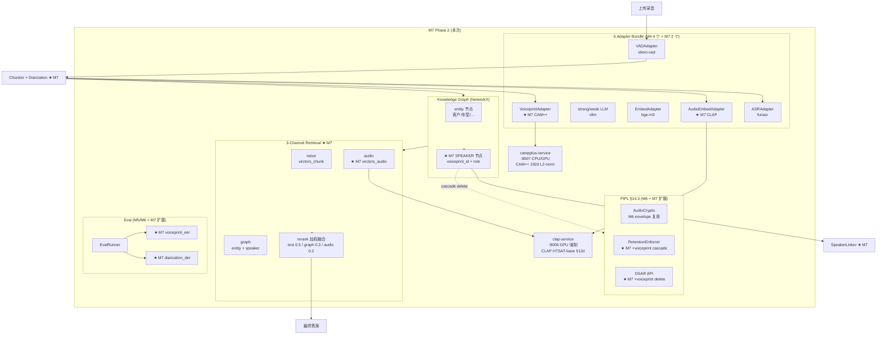
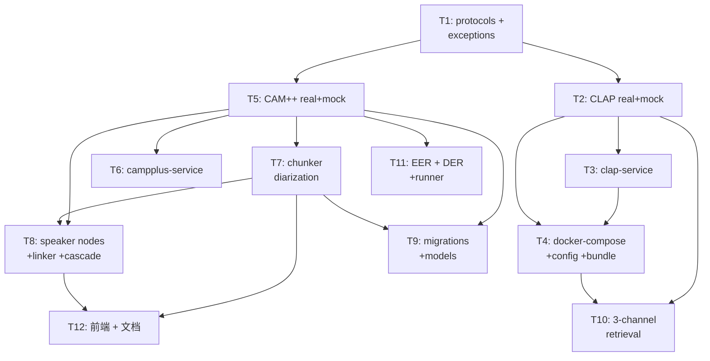
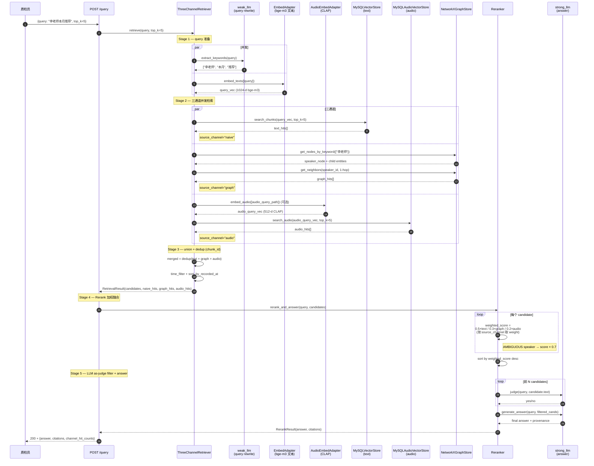

# AudioGraphy M7 架构文档 — Phase 2 音频嵌入 + 说话人链接（Code-Ready）

| 字段 | 值 |
|------|-----|
| 版本 | v7.0.0-draft |
| 作者 | 高见远（架构师 / AI 代行） |
| 主理人 | 齐活林 |
| 日期 | 2026-07-21 |
| 前置 | `docs/m7-prd.md`（833 行，source of truth） |
| 基线 | commit `cc9b7b2`（post-M6 audit，~840 测试，覆盖率 89.77%） |
| 范围 | Code-Ready（写代码 + 测试 + docker-compose real profile；CI 跑 mock，real 跑本地） |
| 工作流 | WS-1 CLAP 音频嵌入／ WS-2 CAM++ 声纹 + diarization + speaker 节点／ WS-3 三通道检索 + 评估 + G6 染色 + SpeakerProfile 骨架 |

> 本文档为 `docs/m7-prd.md` 的**实施级架构补充**，定义每个 Protocol/Adapter/Service/类的签名、字段映射、HTTP 契约、speaker 节点 schema、cascade delete 决策树与任务拆分。冲突时以 PRD 为准；齐活林 L1-L10 locked 决策不在本文重开。本文**给出类签名 + 关键决策**，不嵌入完整实现代码（实现细节由 T1-T12 任务承担）。

---

## 目录

1. [执行摘要](#1-执行摘要)
2. [系统全景图](#2-系统全景图)
3. [协议契约设计](#3-协议契约设计)
4. [Real Adapter 设计](#4-real-adapter-设计)
5. [Mock Adapter 同步设计](#5-mock-adapter-同步设计)
6. [HTTP 服务设计](#6-http-服务设计)
7. [图谱 speaker 节点建模](#7-图谱-speaker-节点建模)
8. [跨录音 speaker linking 服务](#8-跨录音-speaker-linking-服务)
9. [chunker diarization 集成](#9-chunker-diarization-集成)
10. [三通道检索 + 重排扩展](#10-三通道检索--重排扩展)
11. [PIPL §14.3 集成](#11-pipl-143-集成)
12. [评估指标扩展](#12-评估指标扩展)
13. [数据模型 + 迁移](#13-数据模型--迁移)
14. [配置扩展](#14-配置扩展)
15. [任务分解](#15-任务分解)
16. [依赖包清单](#16-依赖包清单)
17. [共享知识](#17-共享知识)
18. [待明确事项](#18-待明确事项)
19. [附录 A：三通道检索数据流时序图](#附录-a三通道检索数据流时序图)
20. [附录 B：speaker 节点图谱结构示例](#附录-bspeaker-节点图谱结构示例)

---

## 1. 执行摘要

M7 把 AudioGraphy 从 text-only RAG 升级为**三模态 RAG（text + entity-graph + audio）**，并把"说话人"作为一等公民引入图谱。**关键技术决策**：

- **新增 2 个 Protocol**：`AudioEmbedAdapter`（CLAP 512 维）+ `VoiceprintAdapter`（CAM++ 192 维 L2 归一化 + diarize）。
- **新增 2 个独立 HTTP 服务**：`clap-service`（GPU 强制 L8）+ `campplus-service`（CPU 可选 GPU），照搬 silero-vad/funasr 的 OpenAI-compat 模式（multipart 上传 + JSON 响应 + `_raise_for_status` 异常映射）。
- **新增 SPEAKER 实体类型**（L4）：复用现有 entity 表，避免数据模型分裂；speaker 节点带 `voiceprint_id` / `speaker_role` / `recordings_count` 等 speaker 专属字段（详见 §7.1）。
- **替换 `chunker.py:235` `speaker=None` 硬编码**（L10）：chunker 在 `enable_voiceprint=True` 时调 CAM++ diarize，结果注入 `SegmentRecord.speaker`。
- **新增 `core/speaker_linker.py`**：3 层策略（voiceprint 余弦 ≥ 0.5 → EntityMerger fuzzy → admin 手动），跨录音合并 speaker 节点。
- **`core/retrieval.py` 升级为三通道**：text + entity-graph + audio 并发检索 → union + dedup → rerank 加权融合（默认 text 0.5 / graph 0.3 / audio 0.2，Q1 决策）。
- **PIPL §14.3 cascade**：voiceprint 向量存 `vectors_voiceprint` 表，复用 M6 AudioCrypto envelope（Q3 决策：同一 master key），DSAR erasure / retention sweep 按 §11.3 决策树级联删除。

**P0 工作流划分**：WS-1 = T1-T4（CLAP adapter + clap-service + 三通道 audio 接入）；WS-2 = T5-T9（CAM++ adapter + campplus-service + chunker diarization + speaker 节点 + speaker_linker + retention cascade）；WS-3 = T10-T12（EER/DER 指标 + 评估 runner + 三通道检索 rerank + 前端骨架）。21 个 P0 功能点在 §15.15 任务映射表中有对应任务。

---

## 2. 系统全景图

### 2.1 M7 在 AudioGraphy 中的位置



### 2.2 数据流总览

- **索引侧**：`Upload → VAD → ASR + CLAP embed + CAM++ diarize & voiceprint → chunker.pack(segments, audio_emb, speaker_id) → text/graph/audio 三表落库 + speaker 节点进图 + speaker_linker 跨录音合并`。
- **查询侧**：`Query → weak_llm rewrite → 3 channels 并发 (naive text / graph entity / audio CLAP) → union + dedup → LLM judge filter → weighted rerank (0.5/0.3/0.2) → strong_llm answer`。
- **PIPL 侧**：`DSAR erasure / retention sweep → 删 audio 文件 → 删 vectors_voiceprint 行 → speaker 节点 source_id 移除（若仅此一条则删节点）→ audit_log`。

---

## 3. 协议契约设计

> 本节定义 `adapters/protocols.py` 新增的 2 个 Protocol 与对应 dataclass，沿用 M4 既有风格（`@runtime_checkable` + frozen dataclass + `Sequence` 返回）。

### 3.1 新增 dataclass

```python
@dataclass(frozen=True, slots=True)
class AudioEmbeddingResult:
    """Output of AudioEmbedAdapter.embed_audio — CLAP audio segment embedding.

    Attributes:
        vector: 512-dim CLAP embedding (float32, L2-normalized for retrieval).
        dim: Vector dimensionality (always 512 for laion_clap HTSAT-base).
        model: Model identifier (e.g. "clap-htsat-base-2022").
        segment_id: Optional segment index this embedding corresponds to.
        duration_sec: Audio duration in seconds (for metrics).
    """
    vector: tuple[float, ...]
    dim: int
    model: str
    segment_id: int | None = None
    duration_sec: float = 0.0


@dataclass(frozen=True, slots=True)
class DiarizationSegment:
    """One segment from CAM++ diarization, tagged with speaker_id.

    Attributes:
        start_sec / end_sec: Time window (file-relative).
        speaker_id: Stable per-file speaker label (e.g. "spk_0"). NOT cross-recording linked yet.
        confidence: Diarization confidence in [0.0, 1.0].
    """
    start_sec: float
    end_sec: float
    speaker_id: str
    confidence: float = 1.0


@dataclass(frozen=True, slots=True)
class DiarizationResult:
    """Output of VoiceprintAdapter.diarize — speaker-segmented timeline."""
    segments: tuple[DiarizationSegment, ...]
    num_speakers: int
    model: str
    duration_sec: float = 0.0


@dataclass(frozen=True, slots=True)
class VoiceprintResult:
    """Output of VoiceprintAdapter.extract_voiceprint — CAM++ 192-d L2-normalized.

    Attributes:
        vector: 192-dim CAM++ speaker embedding (L2-normalized so cosine = dot).
        dim: Always 192 for iic/speech_campplus_sv_zh-cn_16k-common.
        model: Model identifier.
        speaker_id: Same speaker_id as the source diarization segment.
        duration_sec: Audio duration used for extraction (for quality check).
    """
    vector: tuple[float, ...]
    dim: int
    model: str
    speaker_id: str = ""
    duration_sec: float = 0.0
```

### 3.2 AudioEmbedAdapter Protocol

```python
@runtime_checkable
class AudioEmbedAdapter(Protocol):
    """Audio embedding — encodes audio segments into vectors for similarity search.

    M7 default impl: CLAP HTSAT-base (laion_clap), 48 kHz mono, 512-d output.
    The adapter MUST internally resample to 48 kHz before calling the model.
    """

    model: str
    dim: int  # always 512 (L1)

    async def embed_audio(
        self,
        audio_paths: Sequence[str],
        *,
        segment_ids: Sequence[int | None] | None = None,
    ) -> Sequence[AudioEmbeddingResult]:
        """Embed each audio file (one segment per call) → CLAP vectors.

        Raises:
            CLAPRequestError: HTTP 400 / 422 (bad audio format / missing file).
            CLAPTooLargeError: HTTP 413.
            CLAPTimeoutError: httpx.TimeoutException.
            CLAPServerError: HTTP 5xx / transport / malformed JSON.
        """
        ...
```

### 3.3 VoiceprintAdapter Protocol

```python
@runtime_checkable
class VoiceprintAdapter(Protocol):
    """Speaker voiceprint extraction + diarization (CAM++).

    M7 default impl: iic/speech_campplus_sv_zh-cn_16k-common (192-d, L2-normalized).
    The adapter MUST internally resample to 16 kHz mono before calling the model.
    """

    model: str
    dim: int  # always 192 (L2)

    async def diarize(
        self,
        audio_path: str,
        *,
        min_segment_sec: float = 0.5,
        max_speakers: int = 10,
    ) -> DiarizationResult:
        """Diary the full audio → speaker-segmented timeline."""
        ...

    async def extract_voiceprint(
        self,
        audio_path: str,
        *,
        speaker_id: str = "",
        start_sec: float | None = None,
        end_sec: float | None = None,
    ) -> VoiceprintResult:
        """Extract a 192-d L2-normalized voiceprint for one speaker segment.

        If start_sec/end_sec provided, the service crops the audio server-side
        (avoids pre-segmenting client-side). Otherwise the full file is used.
        """
        ...
```

### 3.4 异常体系扩展

新增 8 个异常类到 `adapters/exceptions.py`（沿用 `VADRequestError` / `VADServerError` 风格，**不发明新基类**）：

```python
# adapters/exceptions.py 增量（+~50 行）

class CLAPAdapterError(AdapterError): ...
class CLAPRequestError(CLAPAdapterError, RequestErrorMixin): ...
class CLAPTooLargeError(CLAPAdapterError, RequestErrorMixin): ...
class CLAPTimeoutError(CLAPAdapterError, TimeoutErrorMixin): ...
class CLAPServerError(CLAPAdapterError, ServerErrorMixin): ...

class VoiceprintAdapterError(AdapterError): ...
class VoiceprintRequestError(VoiceprintAdapterError, RequestErrorMixin): ...
class VoiceprintTimeoutError(VoiceprintAdapterError, TimeoutErrorMixin): ...
class VoiceprintServerError(VoiceprintAdapterError, ServerErrorMixin): ...
```

异常映射矩阵沿用 `vad_silero.py:138-161` 模式：4xx → RequestError，413 → TooLargeError，429 → 复用通用 `AdapterRateLimitError`，5xx → ServerError。

---

## 4. Real Adapter 设计

### 4.1 `real/audio_embed_clap.py` — CLAPServiceAdapter（~220 LOC）

#### 4.1.1 类签名与关键约束

```python
class CLAPServiceAdapter:
    """Real audio embedding backed by clap-service (laion_clap HTSAT-base).

    Lifecycle (照搬 vad_silero.py):
        - httpx.AsyncClient created lazily on first embed_audio() call.
        - Caller MUST invoke aclose() at shutdown.
        - Re-entrant: after close, next call re-creates the client.

    Args:
        url: Base URL of clap-service, e.g. http://clap-service:8006.
        model: Model identifier (default "clap-htsat-base-2022").
        timeout: Per-request total timeout. CLAP GPU ≤ 200ms/30s 段; 30s 余量足够。
        max_connect_sec: Connect-only timeout (default 5s).
    """

    def __init__(
        self, url: str, *,
        model: str = "clap-htsat-base-2022",
        timeout: float = 30.0,
        max_connect_sec: float = 5.0,
    ) -> None: ...

    # Protocol methods
    async def embed_audio(
        self, audio_paths: Sequence[str], *,
        segment_ids: Sequence[int | None] | None = None,
    ) -> Sequence[AudioEmbedResult]: ...

    # httpx lifecycle (照搬 vad_silero.py)
    def _get_client(self) -> httpx.AsyncClient: ...
    async def aclose(self) -> None: ...

    # Helpers
    def _raise_for_status(self, resp: httpx.Response, full_url: str) -> None: ...
    def _parse(self, resp: httpx.Response, seg_id: int | None) -> AudioEmbedResult: ...


# Protocol satisfaction check (照搬 vad_silero.py:199 模式)
_CLAP_PROTOCOL_CHECK: AudioEmbedAdapter = CLAPServiceAdapter(url="http://example")
```

#### 4.1.2 关键约束

| 约束 | 来源 |
|------|------|
| 输入采样率 48 kHz mono | laion_clap 强制（service 端 librosa.load(sr=48000, mono=True)） |
| 输出 512 维 L2-normalized | L1 / L5 锁定 |
| HTTP multipart 单文件 / 请求 | 与 silero-vad / funasr 一致 |
| 单段 GPU 推理 ≤ 200 ms | PRD §6.1 性能目标 |
| 显存预算 ≤ 2 GB | PRD §6.2 / docker-compose deploy.resources 声明 |
| Endpoint | `POST {url}/v1/audio/embed` (multipart: audio, model?) |
| 响应 | `{"embedding": [float...], "dim": 512, "model": str, "duration_sec": float}` |

### 4.2 `real/voiceprint_cam.py` — CAMPlusPlusAdapter（~280 LOC）

#### 4.2.1 类签名与双接口

```python
class CAMPlusPlusAdapter:
    """Real speaker diarization + voiceprint backed by campplus-service.

    Args:
        url: Base URL, e.g. http://campplus-service:8007.
        model: Reported model identifier (default "cam++-zh-cn-16k").
        timeout: Per-request total timeout. Diarize is heavier; default 60s.
        max_connect_sec: Connect-only timeout.
    """

    def __init__(
        self, url: str, *,
        model: str = "cam++-zh-cn-16k",
        timeout: float = 60.0,  # diarize 跑全文件，需要更长超时
        max_connect_sec: float = 5.0,
    ) -> None: ...

    async def diarize(
        self, audio_path: str, *,
        min_segment_sec: float = 0.5,
        max_speakers: int = 10,
    ) -> DiarizationResult:
        """POST audio to /v1/diarize → speaker-segmented timeline."""

    async def extract_voiceprint(
        self, audio_path: str, *,
        speaker_id: str = "",
        start_sec: float | None = None,
        end_sec: float | None = None,
    ) -> VoiceprintResult:
        """POST audio to /v1/voiceprint/extract → 192-d voiceprint."""

    # lifecycle / helpers 同 CLAPServiceAdapter 模式

# Protocol satisfaction check
_VOICEPRINT_PROTOCOL_CHECK: VoiceprintAdapter = CAMPlusPlusAdapter(url="http://example")
```

#### 4.2.2 关键约束

| 约束 | 来源 |
|------|------|
| 输入采样率 16 kHz mono | CAM++ 强制（service 端 librosa.load(sr=16000, mono=True)） |
| 输出 192 维 L2-normalized | L2 / L5 锁定（service 端做归一化） |
| Diarize endpoint | `POST /v1/diarize` (multipart: audio, min_segment_sec, max_speakers) |
| Voiceprint endpoint | `POST /v1/voiceprint/extract` (multipart: audio, speaker_id?, start_sec?, end_sec?) |
| Diarize 响应 | `{"segments": [{start_sec, end_sec, speaker_id, confidence}], "num_speakers": int, "model": str, "duration_sec": float}` |
| Voiceprint 响应 | `{"voiceprint": [float...], "dim": 192, "model": str, "duration_sec": float}` |

---

## 5. Mock Adapter 同步设计

Mock adapter 沿用 `mock_asr.py` / `mock_vad.py` 模式：deterministic hash → 向量，模拟 latency，可选 flaky。

### 5.1 `mock/audio_embed.py`（~100 LOC）

```python
class MockAudioEmbedAdapter:
    """Mock CLAP — 512-d vector derived from sha512(path). L2-normalized.

    Used in CI (no GPU dependency). Deterministic: same path → same vector.
    """

    def __init__(self, *, dim: int = 512, latency_ms: float = 5.0) -> None: ...

    async def embed_audio(
        self, audio_paths: Sequence[str], *,
        segment_ids: Sequence[int | None] | None = None,
    ) -> Sequence[AudioEmbedResult]:
        # Sleep latency_ms; for each path: sha512 → 512 floats → L2 normalize → wrap.
```

### 5.2 `mock/voiceprint.py`（~120 LOC）

```python
class MockVoiceprintAdapter:
    """Mock CAM++ — 2-speaker diarization (alternating 5s segments) + 192-d hash voiceprint.

    Critical test design: for stable speaker_id across files, mock injects a
    deterministic seed that pushes cosine similarity ≥ 0.6 (simulating "same
    speaker" signal). Different speaker_ids yield cosine ≤ 0.3. This makes
    SpeakerLinker's 0.5 threshold fully testable in mock mode.
    """

    def __init__(
        self, *,
        dim: int = 192,
        latency_ms: float = 5.0,
        num_speakers: int = 2,
    ) -> None: ...

    async def diarize(
        self, audio_path: str, *,
        min_segment_sec: float = 0.5,
        max_speakers: int = 10,
    ) -> DiarizationResult:
        # Derive total_sec=30 from hash; alternate speakers in 5s chunks.

    async def extract_voiceprint(
        self, audio_path: str, *,
        speaker_id: str = "",
        start_sec: float | None = None,
        end_sec: float | None = None,
    ) -> VoiceprintResult:
        # If speaker_id stable: seed hash → boost similarity across files.
```

**设计要点**：Mock CLAP/Mock CAM++ 都返回 L2-normalized 向量，使 retrieval / speaker_linker 在 mock 模式下能跑通真实数据流；mock CAM++ 故意让"同一 speaker_id 跨文件"产生 cosine ≥ 0.6，"不同 speaker_id" cosine ≤ 0.3，使 SpeakerLinker 阈值 0.5 的逻辑在 CI 下完全可测。

---

## 6. HTTP 服务设计

### 6.1 `services/clap_service.py`（~180 LOC）

#### 6.1.1 端点与启动约束

```python
"""clap-service — FastAPI wrapper around laion_clap HTSAT-base.

Endpoints:
    POST /v1/audio/embed  — multipart audio → 512-d CLAP embedding
    GET  /health          — liveness
    GET  /metrics         — Prometheus (optional)

GPU is mandatory at startup (L8): if torch.cuda.is_available() is False,
the service exits with code 1.

Cache: simple LRU on sha256(audio_bytes) → embedding (size 256).
"""

# 模块顶层（启动时执行）:
if not torch.cuda.is_available():
    logger.error("CLAP service requires CUDA (L8 locked); exiting.")
    sys.exit(1)

app = FastAPI(title="audiography-clap-service", version="1.0")


@app.post("/v1/audio/embed")
async def embed_audio(audio: UploadFile = File(...), model: str | None = None):
    """Return 512-d CLAP embedding. Cache key = sha256(audio_bytes)."""
    # Read bytes → sha256 cache lookup → if miss: librosa.load(sr=48000) →
    # CLAP.get_audio_embedding_from_data → L2 normalize → cache.


@app.get("/health")
async def health():
    return {"status": "ok", "gpu": torch.cuda.is_available(), "model_loaded": _CLAP_MODEL is not None}
```

#### 6.1.2 Dockerfile (`docker/clap-service/Dockerfile`)

```dockerfile
FROM pytorch/pytorch:2.3.1-cuda12.1-cudnn8-runtime

WORKDIR /app
RUN apt-get update && apt-get install -y --no-install-recommends \
    libsndfile1 ffmpeg && rm -rf /var/lib/apt/lists/*

COPY requirements.txt .
RUN pip install --no-cache-dir -r requirements.txt
# Pre-download CLAP checkpoint (~600MB) at build time
RUN python -c "from laion_clap import CLAP_Module; CLAP_Module(enable_fusion=False)"

COPY services/clap_service.py /app/clap_service.py

ENV CUDA_VISIBLE_DEVICES=0
EXPOSE 8006
CMD ["uvicorn", "clap_service:app", "--host", "0.0.0.0", "--port", "8006"]
```

`docker/clap-service/requirements.txt`：

```
fastapi>=0.115
uvicorn[standard]>=0.30
python-multipart>=0.0.9
laion-clap==1.1.7
librosa>=0.10
torch>=2.0
numpy>=1.24
```

### 6.2 `services/campplus_service.py`（~220 LOC）

```python
"""campplus-service — FastAPI wrapper around funasr ModelScope CAM++.

Endpoints:
    POST /v1/diarize               — full audio → diarization timeline
    POST /v1/voiceprint/extract    — audio → 192-d voiceprint
    GET  /health                   — liveness

CPU-default, GPU-optional (L8). Set CAMPPLUS_DEVICE=cuda to enable GPU.
"""

_MODEL_ID = "iic/speech_campplus_sv_zh-cn_16k-common"
_SR = 16000  # CAM++ 强制 16 kHz mono

app = FastAPI(title="audiography-campplus-service", version="1.0")


@app.post("/v1/diarize")
async def diarize(
    audio: UploadFile = File(...),
    min_segment_sec: float = Form(0.5),
    max_speakers: int = Form(10),
):
    """Diary audio → funasr AutoModel.generate() → segments[]."""
    # Save audio_bytes to tmp file → funasr AutoModel.generate(input=tmp) →
    # parse sentence_info → [{start_sec, end_sec, speaker_id, confidence}] →
    # cleanup tmp.


@app.post("/v1/voiceprint/extract")
async def extract_voiceprint(
    audio: UploadFile = File(...),
    speaker_id: str = Form(""),
    start_sec: float | None = Form(None),
    end_sec: float | None = Form(None),
):
    """Extract 192-d L2-normalized CAM++ voiceprint."""
    # tmp file → AutoModel.generate() → result[0]["spk_embedding"] →
    # force L2 normalize (defensive even though CAM++ native is L2-normed).


@app.get("/health")
async def health():
    return {"status": "ok", "sv_loaded": _SV_MODEL is not None}
```

#### 6.2.1 Dockerfile (`docker/campplus-service/Dockerfile`)

```dockerfile
FROM python:3.11-slim

WORKDIR /app
RUN apt-get update && apt-get install -y --no-install-recommends \
    libsndfile1 ffmpeg git && rm -rf /var/lib/apt/lists/*

COPY requirements.txt .
RUN pip install --no-cache-dir -r requirements.txt

COPY services/campplus_service.py /app/campplus_service.py

ENV CAMPPLUS_DEVICE=cpu
EXPOSE 8007
CMD ["uvicorn", "campplus_service:app", "--host", "0.0.0.0", "--port", "8007"]
```

`docker/campplus-service/requirements.txt`：

```
fastapi>=0.115
uvicorn[standard]>=0.30
python-multipart>=0.0.9
funasr>=1.1.0
torch>=2.0
torchaudio>=2.0
librosa>=0.10
numpy>=1.24
modelscope>=1.10
```

### 6.3 docker-compose 集成（新增 2 服务，共 9 服务）

```yaml
# docker-compose.yml 增量（M7 — Phase 2 audio + speaker）
services:
  # ... M6 既有 7 服务 ...

  # ============================================================
  # M7 — Phase 2 audio + speaker services (opt-in via `--profile real`)
  # ============================================================
  clap-service:
    build:
      context: ./docker/clap-service
      dockerfile: Dockerfile
    container_name: audiography-clap-service
    profiles: ["real"]
    restart: unless-stopped
    environment:
      CUDA_VISIBLE_DEVICES: 0
    volumes:
      - clap_cache:/root/.cache/torch  # CLAP checkpoint cache
    ports:
      - "8006:8006"
    healthcheck:
      test: ["CMD-SHELL", "python -c \"import urllib.request,sys; sys.exit(0 if urllib.request.urlopen('http://127.0.0.1:8006/health', timeout=2).status==200 else 1)\""]
      interval: 15s
      timeout: 5s
      retries: 20
      start_period: 180s
    deploy:
      resources:
        reservations:
          devices:
            - driver: nvidia
              count: all
              capabilities: [gpu]
          memory: 4g  # L8: container memory limit
    networks:
      - audiography_net

  campplus-service:
    build:
      context: ./docker/campplus-service
      dockerfile: Dockerfile
    container_name: audiography-campplus-service
    profiles: ["real"]
    restart: unless-stopped
    environment:
      CAMPPLUS_DEVICE: ${CAMPPLUS_DEVICE:-cpu}
    volumes:
      - campplus_cache:/root/.cache/modelscope  # CAM++ model cache
    ports:
      - "8007:8007"
    healthcheck:
      test: ["CMD-SHELL", "python -c \"import urllib.request,sys; sys.exit(0 if urllib.request.urlopen('http://127.0.0.1:8007/health', timeout=2).status==200 else 1)\""]
      interval: 15s
      timeout: 5s
      retries: 10
      start_period: 90s
    networks:
      - audiography_net

volumes:
  # ... M6 既有 ...
  clap_cache:
    name: audiography_clap_cache
  campplus_cache:
    name: audiography_campplus_cache
```

**GPU 显存账本**（叠加 M5/M6）：

| 服务 | 显存 | 来源 |
|------|------|------|
| vllm-strong (Qwen3.6-27B) | ~28 GB | M4 |
| vllm-weak (Qwen3.6-35B-A3B) | ~7 GB | M4 |
| bge-m3 | ~2 GB | M4 |
| **clap-service** | **≤ 2 GB** | **M7（强制 GPU，L8）** |
| **campplus-service** | 0（CPU 默认）/ ≤ 500 MB（GPU） | **M7（可选 GPU）** |
| 合计峰值 | ≤ 40 GB（A100 40GB 满载） | — |

---

## 7. 图谱 speaker 节点建模

> 本节定义 SPEAKER entity 在 NetworkX 图谱中的节点 schema、与现有 entity 节点的边类型、AMBIGUOUS/PENDING 标签机制。**speaker 节点是新的 entity type（L4），不开新表**。

### 7.1 SPEAKER 节点 NetworkX Schema

speaker 节点存于现有 `entities` 表，`entity_type='SPEAKER'`。图谱节点属性（NetworkX 节点 attrs）必须包含以下字段：

| 字段 | 类型 | 必需 | 说明 |
|------|------|------|------|
| `entity_id` | int | ✅ | entities 表主键 |
| `tenant_id` | str | ✅ | 租户隔离 |
| `name` | str | ✅ | 显示名（脱敏后，如 `speaker:vp_a1b2c3d4`） |
| `entity_type` | str | ✅ | 固定 `"SPEAKER"` |
| `description` | str | ✅ | 描述（如 "坐席张敏 / 跨录音合并"） |
| `source_ids` | list[str] | ✅ | chunk source IDs（沿用现有 entity 格式） |
| `created_at` / `updated_at` | ISO 8601 str | ✅ | 时间戳 |
| `voiceprint_id` | str | ✅ | 完整 sha256 voiceprint hash（admin 可见） |
| `speaker_role` | str | ✅ | `"agent"` / `"customer"` / `"unknown"` |
| `recordings_count` | int | ✅ | 出现录音数 |
| `recordings_list` | list[int] | ✅ | recording_id 数组（用于 cascade delete） |
| `first_seen` | ISO 8601 str | ✅ | 首次出现时间 |
| `total_speech_sec` | float | ✅ | 累计发言时长 |
| `merge_confidence` | float | ✅ | 最高合并置信度 |
| `merge_strategy` | str | ✅ | `"voiceprint"` / `"fuzzy"` / `"manual"` / `"single_recording"` |
| `ambiguity_tag` | str \| None | ✅ | `None` / `"AMBIGUOUS"` / `"PENDING_REVIEW"` |
| `voiceprint_vector_hash` | str | ❌ | voiceprint 向量 hash（冗余 voiceprint_id，用于图谱可视化校验） |

### 7.2 SPEAKER 节点的边类型

| 边类型 | 源 → 目标 | 含义 | confidence |
|--------|-----------|------|-----------|
| `speaks_in` | speaker → recording | speaker 在此录音中发言 | EXTRACTED |
| `mentions` | speaker → entity（客户/车型/...） | speaker 提到此实体（替代或补充 chunk → entity） | EXTRACTED |
| `recommends` | speaker (agent) → entity (商品/车型) | 坐席推荐 | EXTRACTED / INFERRED |
| `asks` | speaker (customer) → entity (商品) | 客户询问 | EXTRACTED |
| `linked_to` | speaker (voiceprint-merged) → speaker | 跨录音合并的伪边（可选） | AMBIGUOUS |

边属性沿用现有 `GraphEdge` 结构（`source_id / target_id / relation / weight / confidence / source_id_chunks`）。

### 7.3 Tenant 隔离

speaker 节点 `tenant_id` 在 `EntityMerger._load_aliases_for_tenant()` 阶段就过滤；图谱层 `NetworkXGraphStore.get_all_nodes(tenant_id)` 也按 tenant 隔离。**绝对禁止跨租户 voiceprint 合并**（PRD §4.4 "Speaker nodes 跨租户共享" 是 out-of-scope）。

### 7.4 AMBIGUOUS / PENDING 标签机制

| `ambiguity_tag` 值 | 触发条件 | 可视化染色 | 是否参与检索 | 是否可被 SpeakerLinker 再合并 |
|--------------------|---------|-----------|-------------|---------------------------|
| `None`（默认） | merge_confidence ≥ 0.7 | 蓝（agent）/ 橙（customer）/ 灰（unknown） | ✅ | ✅ |
| `"AMBIGUOUS"` | 0.5 ≤ merge_confidence < 0.7（Q2 决策） | 黄（警示）+ ⚠ icon | ✅（但 rerank 降权，§10.3） | ✅（可被高置信度合并再次升级） |
| `"PENDING_REVIEW"` | admin 手动标记 / 第三方信号冲突 | 红（待审） | ❌（隐藏） | ❌（锁定） |

---

## 8. 跨录音 speaker linking 服务

### 8.1 `core/speaker_linker.py`（~200 LOC）

#### 8.1.1 类签名与三层策略

```python
class SpeakerLinker:
    """Cross-recording speaker linking via 3-layer strategy.

    Layer 1: voiceprint cosine ≥ threshold (default 0.5, L9) — primary signal.
        - cos ≥ ambiguity_threshold (0.7): merge, ambiguity_tag=None.
        - 0.5 ≤ cos < 0.7: merge, ambiguity_tag=AMBIGUOUS (Q2).
    Layer 2: EntityMerger fuzzy layer (rapidfuzz on speaker name) — auxiliary.
        - M7 stub: returns None; full impl in M8 with admin UI.
    Layer 3: admin manual confirm — M7 stub (log only); M8+ exposes API.

    Flow (per new recording R, after diarization + voiceprint extraction)::

        for each new speaker S in R:
            for each existing speaker E in same tenant:
                cos = cosine(S.voiceprint, E.voiceprint)
                if cos >= voiceprint_link_threshold:
                    if cos >= ambiguity_threshold:
                        → MERGE: canonical=E, ambiguity_tag=None, strategy=voiceprint
                    else:
                        → MERGE with AMBIGUOUS tag
                elif fuzz.WRatio(S.name, E.name) >= 0.85:
                    → MERGE: strategy=fuzzy (low confidence, M7 stub)
                else:
                    → CREATE new speaker node: strategy=single_recording
    """

    def __init__(
        self,
        session_factory: async_sessionmaker[AsyncSession],
        merger: EntityMerger,
        audit: AuditWriter,
        *,
        voiceprint_threshold: float = 0.5,
        ambiguity_threshold: float = 0.7,
        tenant_id: str = "default",
    ) -> None: ...

    async def run(self, recording_id: int) -> SpeakerLinkReport:
        """Link all speakers in recording_id against existing speaker nodes.

        Triggers:
            1. On-demand (sync): IngestionService.index_complete() 末尾调一次.
            2. Batch nightly (cron 04:15): scheduler.py 注册兜底批处理.
        """
```

#### 8.1.2 SpeakerLinkReport dataclass

```python
@dataclass(frozen=True, slots=True)
class SpeakerLinkReport:
    """Output of one SpeakerLinker.run(recording_id) call.

    Attributes:
        recording_id: Source recording ID.
        new_speakers: Number of brand-new speaker nodes created.
        merged_speakers: Number of speakers merged into existing nodes.
        ambiguous_merges: Subset of merges tagged AMBIGUOUS.
        fuzzy_merges: Subset of merges via Layer 2 (rapidfuzz).
        audit_written: Number of audit_log rows inserted.
    """
    recording_id: int
    new_speakers: int
    merged_speakers: int
    ambiguous_merges: int = 0
    fuzzy_merges: int = 0
    audit_written: int = 0
```

#### 8.1.3 批处理 cron

speaker_linker 在两个时点触发：

1. **On-demand**（同步路径）：`IngestionService.index_complete()` 末尾调一次 `speaker_linker.run(recording_id)`，延迟 ~200ms（与 PRD §6.1 "跨录音 speaker link 增量 ≤ 200ms / 新 speaker" 一致）。
2. **Batch nightly**（兜底）：`scheduler.py` 注册 cron 04:15（避开 retention 03:00）扫一遍所有近 24h 录音。Batch 主要作用是处理 on-demand 漏掉的边缘 case（如新 speaker 在 cron 之前已存在但未触发索引完成回调）。

```python
# scheduler.py 增量
from apscheduler.triggers.cron import CronTrigger

scheduler.add_job(
    _run_speaker_link_batch,
    trigger=CronTrigger(hour=4, minute=15),
    id="speaker_link_daily",
    coalesce=True,
    max_instances=1,
    replace_existing=True,
)
```

---

## 9. chunker diarization 集成

### 9.1 替换 `chunker.py:235` `speaker=None`

> **L10 锁定**：M7 必须消除 `speaker=None` 硬编码。

### 9.2 改造方案

```python
class Chunker:
    def __init__(
        self,
        bundle: AdapterBundle,
        *,
        token_budget: int = 5000,
        enable_voiceprint: bool = False,  # NEW M7
    ) -> None:
        self._bundle = bundle
        self._token_budget = token_budget
        self._enable_voiceprint = enable_voiceprint

    async def _transcribe_with_diarization(
        self,
        vad_segments: list[VADSegment],
        audio_path: str,
    ) -> list[SegmentRecord]:
        """Transcribe + (optional) diarize → SegmentRecord with speaker_id.

        enable_voiceprint=False (default, M3 back-compat): speaker=None 完全保留。
        enable_voiceprint=True: 在 ASR 之前先调 CAM++ diarize, 然后把每个 VAD 段
        与 diarization timeline 时间对齐，取该段中心时刻所属的 speaker_id。
        """
        # 1. (Optional) Diarize once for the whole file.
        diar_timeline: list[DiarizationSegment] = []
        if self._enable_voiceprint and self._bundle.voiceprint is not None:
            try:
                diar = await self._bundle.voiceprint.diarize(audio_path)
                diar_timeline = list(diar.segments)
            except Exception as exc:
                logger.warning("Diarization failed, falling back to speaker=None: %s", exc)

        # 2. Transcribe each VAD segment + tag speaker via timeline overlap.
        records: list[SegmentRecord] = []
        for idx, seg in enumerate(vad_segments):
            transcript = await self._safe_transcribe(audio_path, seg, idx)
            speaker_id = self._match_speaker(seg, diar_timeline)
            records.append(SegmentRecord(
                idx=idx,
                start_sec=seg.start_sec,
                end_sec=seg.end_sec,
                transcript=transcript,
                speaker=speaker_id,  # M7: 不再硬编码 None
                vad_conf=seg.confidence,
            ))
        return records

    @staticmethod
    def _match_speaker(
        vad_seg: VADSegment,
        timeline: list[DiarizationSegment],
    ) -> str | None:
        """Match VAD segment to diarization speaker via midpoint time.

        Strategy: take VAD midpoint, find the diarization segment that contains
        it. If overlap is ambiguous (multiple), pick the one with max overlap.
        """
        if not timeline:
            return None
        midpoint = (vad_seg.start_sec + vad_seg.end_sec) / 2.0
        for d in timeline:
            if d.start_sec <= midpoint <= d.end_sec:
                return d.speaker_id
        # No exact midpoint match — pick max overlap.
        best_spk: str | None = None
        best_overlap = 0.0
        for d in timeline:
            ov = min(vad_seg.end_sec, d.end_sec) - max(vad_seg.start_sec, d.start_sec)
            if ov > best_overlap:
                best_overlap = ov
                best_spk = d.speaker_id
        return best_spk
```

### 9.3 `enable_voiceprint=False` 的向后兼容

- 默认 `enable_voiceprint=False`：所有 M3-M6 既有测试 0 回归（`SegmentRecord.speaker` 仍然为 `None`）。
- `enable_voiceprint=True`：仅当 `settings.enable_voiceprint=True` 且 `bundle.voiceprint` 存在时启用。
- grep `speaker=None` 应仅出现在 `_transcribe_with_diarization()` 的 fallback 注释和 enable_voiceprint=False 分支（PRD §9.1 验收门槛）。

---

## 10. 三通道检索 + 重排扩展

### 10.1 retrieval.py 升级为三通道

```python
@dataclass(frozen=True, slots=True)
class RetrievalResult:
    """Three-channel retrieval result (M7)."""
    query: str
    candidates: list[CandidateSegment]
    naive_hits: int
    graph_hits: int
    audio_hits: int  # NEW M7
    filtered_by_time: int


class ThreeChannelRetriever:
    """Three-channel retrieval (M7 supersedes DualChannelRetriever).

    Channels run in parallel via asyncio.gather. Single-channel failure
    does NOT block others — failed channel returns empty + warning.
    """

    def __init__(
        self,
        bundle: AdapterBundle,
        vector_store: MySQLVectorStore,
        graph_store: NetworkXGraphStore,
        *,
        session_factory: async_sessionmaker[AsyncSession] | None = None,
        file_index: FileIndex | None = None,
        audio_vector_store: MySQLAudioVectorStore | None = None,  # NEW M7
        enable_audio_channel: bool = False,                       # NEW M7
    ) -> None: ...

    async def retrieve(
        self, query: str, *,
        tenant_id: str = "default",
        top_k: int = 10,
        time_range: tuple[datetime, datetime] | None = None,
        audio_query_path: str | None = None,  # NEW M7: query-by-audio
    ) -> RetrievalResult:
        """Execute three-channel retrieval in parallel.

        Steps:
            1. Query embedding (text) + keyword extraction (parallel)
            2. Three channels in parallel: naive (text) / graph (entity) / audio (CLAP)
            3. Union + dedup by chunk_id (score = max across channels)
            4. Time filter + sort by recorded_at
        """

    async def _audio_channel(
        self, audio_query_path: str | None, tenant_id: str, top_k: int,
    ) -> list[CandidateSegment]:
        """Audio channel: CLAP query vector → vectors_audio cosine top-k."""
        if not audio_query_path or self._audio_vector_store is None:
            return []
        try:
            embeds = await self._bundle.audio_embed.embed_audio([audio_query_path])
            query_audio_vec = embeds[0].vector
            hits = await self._audio_vector_store.search_audio(
                tenant_id, query_audio_vec, top_k=top_k,
            )
        except Exception as exc:
            logger.warning("Audio channel failed: %s", exc)
            return []
        return await self._audio_hits_to_candidates(hits, "audio")

    @staticmethod
    def _union_dedup_3(
        text: list[CandidateSegment],
        graph: list[CandidateSegment],
        audio: list[CandidateSegment],
    ) -> list[CandidateSegment]:
        """Merge 3 channels, dedup by chunk_id, score = max across channels."""
        merged: dict[int, CandidateSegment] = {}
        for c in text + graph + audio:
            existing = merged.get(c.chunk_id)
            if existing is None or c.score > existing.score:
                merged[c.chunk_id] = c
        return list(merged.values())
```

### 10.2 rerank.py 加权融合（Q1 决策）

#### 10.2.1 三通道加权融合

```python
@dataclass(frozen=True, slots=True)
class ChannelWeights:
    """Rerank channel weights (Q1 locked)."""
    text: float = 0.5
    graph: float = 0.3
    audio: float = 0.2

    def __post_init__(self) -> None:
        total = self.text + self.graph + self.audio
        if not (0.99 <= total <= 1.01):
            raise ValueError(f"Channel weights must sum to 1.0, got {total}")


class Reranker:
    def __init__(
        self,
        bundle: AdapterBundle,
        *,
        file_index: FileIndex | None = None,
        graph_store: NetworkXGraphStore | None = None,
        channel_weights: ChannelWeights | None = None,  # NEW M7
    ) -> None:
        self._bundle = bundle
        self._file_index = file_index
        self._graph_store = graph_store
        self._channel_weights = channel_weights or ChannelWeights()

    def _weighted_score(self, candidate: CandidateSegment) -> float:
        """Compute weighted fusion score: source_channel's weight × candidate.score.

        AMBIGUOUS speaker nodes: score *= 0.7 (§10.3).
        """
        weight_map = {
            "naive": self._channel_weights.text,
            "graph": self._channel_weights.graph,
            "audio": self._channel_weights.audio,
        }
        w = weight_map.get(candidate.source_channel, 0.5)
        score = w * candidate.score
        # AMBIGUOUS speaker降权 (查 graph_store 获取 candidate 关联 speaker 节点)
        if self._is_from_ambiguous_speaker(candidate):
            score *= 0.7
        return score
```

#### 10.2.2 Q1 决策：默认权重 + 调优启发式

| 项 | 决策 |
|----|------|
| **默认权重** | `text 0.5 / graph 0.3 / audio 0.2`（PRD §4.2 P1-1） |
| **配置项名** | `rerank_channel_weights`（`config.py` Settings 字段，类型 `tuple[float, float, float]`，env `RERANK_CHANNEL_WEIGHTS="0.5,0.3,0.2"`） |
| **Validator** | `sum(weights) ∈ [0.99, 1.01]`，否则启动失败 |
| **启发式调整** | (a) 若 audio channel recall@5 低于 text-only 通道 ≥ 10%（R1 触发），调到 `0.6/0.3/0.1`；(b) 若 audio channel Entity F1 + 0.05 以上，调到 `0.4/0.3/0.3`；(c) tenant-scoped 可配置是 P2-4，M8+ |
| **何时 weight=0** | `enable_clap=False` 时自动降级为 `ChannelWeights(text=0.6, graph=0.4, audio=0.0)`（双通道） |

**理由**：M7 默认 (a) 是因为 CLAP 中文效果未验证（R1 风险），保守降权 audio 通道；同时保留召回能力（audio 通道仍参与 union），不致完全失去副语言检索价值。一旦 R1 baseline 评估通过，可平滑切换到 (c) 加权。

### 10.3 三通道检索与 AMBIGUOUS speaker 的交互

| 情况 | rerank 行为 |
|------|------------|
| candidate 来自无 speaker 节点的 chunk | 正常加权 |
| candidate 来自 confidence=None 的 speaker 节点 | 正常加权 |
| candidate 来自 AMBIGUOUS speaker 节点 | `score × 0.7` 后再加权 |
| candidate 来自 PENDING_REVIEW speaker 节点 | 直接剔除（不参与检索） |

---

## 11. PIPL §14.3 集成

### 11.1 Q3 决策：voiceprint 加密策略

> **决策**：**复用 M6 master key**（同一 `AUDIOGRAPHY_MASTER_KEY_PATH`），不引入 voiceprint 专属 master key。

**理由**：

| 维度 | 复用 M6 master key（选定） | 单独 voiceprint master key（淘汰） |
|------|--------------------------|---------------------------------|
| PIPL §14.3 严格度 | "单独存储"已通过 `vectors_voiceprint` 物理分表 + 单独 envelope header 满足 | 多一层 isolation 但无明确法律要求 |
| 运维复杂度 | 1 个 master key 备份/轮换流程 | 2 个 master key 备份/轮换流程（双倍事故面） |
| M7 实施成本 | 0 行新代码（AudioCrypto 直接复用） | +50 LOC VoiceprintCrypto 子类 + config 字段 + tests |
| 轮换风险 | 1 个 key 泄露 = 全数据泄露（已通过 0600 权限 + 备份隔离缓解） | voiceprint key 泄露只影响 voiceprint（边际收益） |

**结论**：PIPL §14.3 原文"声纹特征向量单独存储"是**物理分离语义**（M6 已通过 `vectors_voiceprint` 物理表 + 独立 `voiceprint:` 前缀 audit_log 满足），加密复用 M6 envelope 即可。

**config.py 字段**：M7 不新增 voiceprint 加密相关字段。直接复用 M6 `master_key_path: str` + `crypto_dev_mode: bool`。

### 11.2 `vectors_voiceprint` 表与加密 envelope

voiceprint 向量在 `vectors_voiceprint` 表中存为加密 BLOB（不存明文）。读取时通过 `AudioCrypto` 解密：

```python
class VectorVoiceprint(TenantScopedBase):
    """Encrypted speaker voiceprint vector (192-d CAM++ L2-normalized).

    PIPL §14.3 compliance:
        - Stored as AES-256-GCM envelope ciphertext (M6 AudioCrypto).
        - Decryption requires master key from AUDIOGRAPHY_MASTER_KEY_PATH.
        - Cascade delete on DSAR / retention sweep (see §11.3).
        - voiceprint_id is a sha256 hash of the decrypted vector (for dedup),
          never the raw vector.
    """
    __tablename__ = "vectors_voiceprint"

    id: Mapped[int] = mapped_column(BigInteger, autoincrement=True, primary_key=True)
    recording_id: Mapped[int] = mapped_column(
        BigInteger, ForeignKey("recordings.id", ondelete="CASCADE"), nullable=False,
    )
    segment_id: Mapped[int | None] = mapped_column(BigInteger, nullable=True)
    speaker_entity_id: Mapped[int] = mapped_column(
        BigInteger, ForeignKey("entities.id", ondelete="CASCADE"), nullable=False,
    )
    voiceprint_id: Mapped[str] = mapped_column(String(64), nullable=False)
    vector_encrypted: Mapped[bytes] = mapped_column(LargeBinary, nullable=False)
    encryption_meta: Mapped[dict] = mapped_column(JSON, nullable=False)
    duration_sec: Mapped[float] = mapped_column(default=0.0)
    created_at: Mapped[datetime] = mapped_column(default_factory=datetime.utcnow)

    def decrypted_vector(self, crypto: AudioCrypto) -> np.ndarray:
        """Decrypt + parse to 192-d numpy array."""
        raw = crypto.decrypt_bytes(self.vector_encrypted, self.encryption_meta)
        return np.frombuffer(raw, dtype=np.float32)
```

### 11.3 cascade delete 决策树（PRD §6.3.1 实施）

`core/retention.py` 增量（M7）：

```
DSAR erasure / retention sweep 触发 on recording R:
  1. (M6 既有逻辑) 删 audio 文件 + chunks + segments + vectors_chunk + vectors_entity
     + tag_facts + GraphML 节点
  2. (NEW M7) cascade voiceprint:
     a. 查 vectors_voiceprint WHERE recording_id = R → 得到 voiceprint_ids[]
     b. for each voiceprint_id V:
        i.  查 entities WHERE entity_type='SPEAKER' AND voiceprint_id = V → speaker_node E
        ii. 查 E.attrs.recordings_list[]
        iii. if len(recordings_list) == 1 (only R):
             → 硬删 entity E (含所有出/入边) + 删 vectors_voiceprint V 行
             → audit_log: action="voiceprint_delete", target=f"voiceprint:{V}",
                          before={E}, after={}
        iv. else:
             → 仅删 vectors_voiceprint V 行 (保留 entity 节点)
             → 从 E.attrs.recordings_list 移除 R; E.attrs.recordings_count -= 1
             → audit_log: action="voiceprint_partial_delete",
                          target=f"voiceprint:{V}",
                          before={recordings: [R, ...]}, after={recordings: [...]}
     c. audit_log: action="recording_voiceprint_cascade",
                   target=f"recording:{R}", before={count: N}, after={}
```

### 11.4 DSAR 扩展

`api/dsar.py` 增量：
- `POST /dsar/erase/{recording_id}` 末尾调 `retention_enforcer._cascade_voiceprint(rec)`。
- `POST /dsar/export/{recording_id}` 返回的 ZIP 增加 `voiceprints.json`：仅含 `voiceprint_id` + `speaker_entity_id` + `duration_sec`，**不含原始向量**（PIPL compliance）。

---

## 12. 评估指标扩展

### 12.1 `eval/metrics/voiceprint_eer.py`（~200 LOC）

```python
def parse_trial_file(trial_path: Path) -> list[VoiceprintTrial]:
    """Parse a CN-Celeb-style trial file.

    Format: each line = "enrollment_path test_path 0|1"
    (0 = different speaker, 1 = same speaker).
    """


async def voiceprint_eer(
    trials: list[VoiceprintTrial],
    adapter: VoiceprintAdapter,
    *,
    threshold_grid: tuple[float, ...] = tuple(round(0.01 * i, 2) for i in range(101)),
) -> MetricResult:
    """Compute EER = the point where FAR == FRR. Lower is better.

    Args:
        trials: Ground-truth labeled trial pairs.
        adapter: Real or mock VoiceprintAdapter.
        threshold_grid: Cosine thresholds to sweep (0.00, 0.01, ..., 1.00).

    Returns:
        MetricResult(name="voiceprint_eer", value=EER ∈ [0, 1], ...).

    Mock mode: deterministic EER (mock vectors are hash-derived, so
    trial outcomes are reproducible).

    Real mode: P1-2 includes CN-Celeb trial loader (real run in CI-external).
    """
    # Algorithm:
    # 1. Extract voiceprint for every unique audio path (cache by path).
    # 2. Compute cosine for every trial.
    # 3. Sweep thresholds; find EER point (where FAR curve crosses FRR curve).
    # 4. Return EER + curve_points (subsampled).
```

### 12.2 `eval/metrics/diarization_der.py`（~220 LOC）

```python
def parse_rttm(path: Path) -> list[RTTMSegment]:
    """Parse RTTM v2 file. Each line:
    SPEAKER <file> <chnl> <onset> <dur> <ortho> <stype> <name> <conf> <slat>
    """


def diarization_der(
    reference_rttm: Path,
    hypothesis_rttm: Path,
    *,
    collar_sec: float = 0.25,
    forbid_forking: bool = True,
) -> MetricResult:
    """Compute DER = (False Alarm + Missed Speech + Speaker Confusion) / Total Reference Speech.

    Standard NIST RT metric. M7 ships a pure-Python implementation
    (frame-based, 10ms granularity); for production real-data CI-external
    runs, EvalRunner optionally shells out to `dscore` (P1-3).

    Args:
        reference_rttm: Ground truth.
        hypothesis_rttm: System output (CAM++ diarize result converted to RTTM).
        collar_sec: Forgiveness collar around boundaries (NIST standard 0.25).
        forbid_forking: If True, one ref segment maps to ≤ 1 hyp segment.

    Returns:
        MetricResult(name="diarization_der", value=DER ∈ [0, 1], ...).

    Algorithm:
        1. Per file, sort ref + hyp by onset.
        2. Discretize timeline into 10ms frames.
        3. Per frame, build sets of ref speakers + hyp speakers (with collar).
        4. DER numerator = #frames where ref_set != hyp_set.
        5. DER denominator = #frames where ref_set non-empty.
    """
```

### 12.3 EvalRunner 接入

`eval/runner.py` 增量：

```python
class EvalRunner:
    async def _compute_metrics_phase2(
        self,
        gold: GoldExample,
        pred: PredictedResult,
    ) -> list[MetricResult]:
        """M7 Phase 2 metrics: voiceprint EER + diarization DER."""
        results: list[MetricResult] = []
        if hasattr(gold, 'voiceprint_trials') and gold.voiceprint_trials:
            eer = await voiceprint_eer(
                gold.voiceprint_trials,
                adapter=self._bundle.voiceprint,
            )
            results.append(eer)
        if hasattr(gold, 'reference_rttm') and hasattr(gold, 'hypothesis_rttm'):
            der = diarization_der(gold.reference_rttm, gold.hypothesis_rttm)
            results.append(der)
        return results
```

aggregate_metrics 输出新增字段：

```json
{
  "context_precision_at_5": 0.82,
  "entity_f1_strict": 0.68,
  "entity_f1_fuzzy": 0.84,
  "voiceprint_eer": 0.07,
  "diarization_der": 0.18,
  "faithfulness": 0.88,
  "answer_relevance": 0.91
}
```

---

## 13. 数据模型 + 迁移

### 13.1 新增表（2 个 + entities 表扩展）

#### 13.1.1 `vectors_voiceprint`（M7 P0-12）

```sql
CREATE TABLE vectors_voiceprint (
    id BIGINT AUTO_INCREMENT PRIMARY KEY,
    tenant_id VARCHAR(64) NOT NULL,
    recording_id BIGINT NOT NULL,
    segment_id BIGINT NULL,
    speaker_entity_id BIGINT NOT NULL,
    voiceprint_id VARCHAR(64) NOT NULL COMMENT 'sha256 hash of decrypted vector',
    vector_encrypted VARBINARY(8192) NOT NULL COMMENT 'AES-256-GCM envelope',
    encryption_meta JSON NOT NULL,
    duration_sec FLOAT DEFAULT 0.0,
    created_at DATETIME(3) NOT NULL DEFAULT CURRENT_TIMESTAMP(3),
    CONSTRAINT fk_vp_recording FOREIGN KEY (recording_id)
        REFERENCES recordings(id) ON DELETE CASCADE,
    CONSTRAINT fk_vp_speaker FOREIGN KEY (speaker_entity_id)
        REFERENCES entities(id) ON DELETE CASCADE,
    INDEX ix_vp_tenant_recording (tenant_id, recording_id),
    INDEX ix_vp_speaker (speaker_entity_id),
    UNIQUE KEY ux_vp_voiceprint_id (tenant_id, voiceprint_id)
) ENGINE=InnoDB DEFAULT CHARSET=utf8mb4;
```

#### 13.1.2 `vectors_audio`（M7 P0-13，存 CLAP 512-d 段向量）

```sql
CREATE TABLE vectors_audio (
    id BIGINT AUTO_INCREMENT PRIMARY KEY,
    tenant_id VARCHAR(64) NOT NULL,
    recording_id BIGINT NOT NULL,
    segment_id BIGINT NOT NULL,
    chunk_id BIGINT NULL COMMENT 'Optional linkage to chunk if segment→chunk 1:1',
    vector BLOB NOT NULL COMMENT '512-d float32 little-endian (plaintext, see design note)',
    dim INT NOT NULL DEFAULT 512,
    model VARCHAR(64) NOT NULL DEFAULT 'clap-htsat-base-2022',
    duration_sec FLOAT DEFAULT 0.0,
    created_at DATETIME(3) NOT NULL DEFAULT CURRENT_TIMESTAMP(3),
    CONSTRAINT fk_va_recording FOREIGN KEY (recording_id)
        REFERENCES recordings(id) ON DELETE CASCADE,
    INDEX ix_va_tenant_recording (tenant_id, recording_id),
    INDEX ix_va_segment (segment_id)
) ENGINE=InnoDB DEFAULT CHARSET=utf8mb4;
```

> **设计说明**：`vectors_audio` 允许明文存储（不强制加密）。CLAP 向量不构成生物特征（CAM++ voiceprint 才是），PIPL §14.3 不适用。明文存储可大幅加速检索（避免每次解密）。tenant 仍隔离。Q-后续-4 留作 M8 议题。

#### 13.1.3 `entities` 表扩展（speaker 节点 attrs）

speaker 节点存于既有 `entities` 表，`entity_type='SPEAKER'`。attrs 字段（JSON）承载 speaker 专属属性（§7.1）。**不新增列**，仅扩展 `attrs` JSON 内容 + `entity_type` CHECK constraint 放宽：

```sql
-- alembic 0007
ALTER TABLE entities
    MODIFY COLUMN entity_type VARCHAR(64) NOT NULL
    COMMENT 'client/agent/vehicle/plan/.../SPEAKER (M7)';
```

#### 13.1.4 `speaker_pending` 表（**Q2 不选**）

根据 §7.4 / §15.4 Q2 决策，**不引入 `speaker_pending` 表**。AMBIGUOUS 节点直接进 entities 表，靠 `attrs.ambiguity_tag='AMBIGUOUS'` 标识。

### 13.2 Alembic 迁移（3 个）

| 迁移 | 内容 | 估算行数 |
|------|------|---------|
| `{ts}_m7_voiceprint_table.py` (0006) | 创建 `vectors_voiceprint` 表 | ~80 |
| `{ts}_m7_audio_vectors_table.py` (0007) | 创建 `vectors_audio` 表 + entities entity_type 注释更新 | ~80 |
| `{ts}_m7_indexes.py` (0008) | speaker 节点查询性能索引（`entities` 加 `ix_entities_tenant_type`） | ~40 |

迁移示例（0006，关键约束）：

```python
"""M7 voiceprint table.

Revision ID: m7_voiceprint_table
Revises: m6_pipl_eval_rapidfuzz
Create Date: 2026-08-01 10:00:00
"""
from alembic import op
import sqlalchemy as sa

revision = "m7_voiceprint_table"
down_revision = "m6_pipl_eval_rapidfuzz"
branch_labels = None
depends_on = None


def upgrade() -> None:
    op.create_table(
        "vectors_voiceprint",
        sa.Column("id", sa.BigInteger(), autoincrement=True, nullable=False),
        sa.Column("tenant_id", sa.String(64), nullable=False),
        sa.Column("recording_id", sa.BigInteger(), nullable=False),
        sa.Column("segment_id", sa.BigInteger(), nullable=True),
        sa.Column("speaker_entity_id", sa.BigInteger(), nullable=False),
        sa.Column("voiceprint_id", sa.String(64), nullable=False),
        sa.Column("vector_encrypted", sa.LargeBinary(length=8192), nullable=False),
        sa.Column("encryption_meta", sa.JSON(), nullable=False),
        sa.Column("duration_sec", sa.Float(), server_default="0.0"),
        sa.Column("created_at", sa.DateTime(timezone=True),
                  server_default=sa.func.now(), nullable=False),
        sa.PrimaryKeyConstraint("id"),
        sa.ForeignKeyConstraint(["recording_id"], ["recordings.id"], ondelete="CASCADE"),
        sa.ForeignKeyConstraint(["speaker_entity_id"], ["entities.id"], ondelete="CASCADE"),
        sa.UniqueConstraint("tenant_id", "voiceprint_id", name="ux_vp_voiceprint_id"),
    )
    op.create_index("ix_vp_tenant_recording", "vectors_voiceprint",
                    ["tenant_id", "recording_id"])
    op.create_index("ix_vp_speaker", "vectors_voiceprint", ["speaker_entity_id"])


def downgrade() -> None:
    op.drop_index("ix_vp_speaker", table_name="vectors_voiceprint")
    op.drop_index("ix_vp_tenant_recording", table_name="vectors_voiceprint")
    op.drop_table("vectors_voiceprint")
```

---

## 14. 配置扩展

### 14.1 `config.py` 新增字段清单

```python
class Settings(BaseSettings):
    # ... existing M3-M6 fields ...

    # --- M7 Phase 2 — adapter modes (新增 2 个) ---
    adapter_audio_embed_mode: AdapterMode = "mock"  # M7: CLAP
    adapter_voiceprint_mode: AdapterMode = "mock"   # M7: CAM++

    # --- M7 Phase 2 — service URLs ---
    clap_service_url: str = "http://clap-service:8006"
    campplus_service_url: str = "http://campplus-service:8007"

    # --- M7 Phase 2 — feature flags (复用现有 enable_clap / enable_voiceprint) ---
    # enable_clap: bool = False      ← 已存在
    # enable_voiceprint: bool = False ← 已存在

    # --- M7 Phase 2 — speaker linker thresholds ---
    voiceprint_link_threshold: float = 0.5  # L9 default
    voiceprint_merge_confidence_ambiguous: float = 0.7  # Q2 default

    # --- M7 Phase 2 — GPU strategy ---
    clap_force_gpu: bool = True     # L8: enforced at service side
    campplus_prefer_gpu: bool = False

    # --- M7 Phase 2 — PIPL cascade ---
    voiceprint_retention_cascade: bool = True

    # --- M7 Phase 2 — three-channel rerank weights (Q1) ---
    rerank_channel_weights: tuple[float, float, float] = (0.5, 0.3, 0.2)
    # Order: (text, graph, audio). Sum must be ~1.0.

    # --- M7 Phase 2 — voiceprint crypto (Q3: reuse M6 master key) ---
    # No new fields — AUDIOGRAPHY_MASTER_KEY_PATH reused from M6.

    @field_validator("voiceprint_link_threshold")
    @classmethod
    def _validate_vp_threshold(cls, v: float) -> float:
        if not 0.0 <= v <= 1.0:
            raise ValueError(f"VOICEPRINT_LINK_THRESHOLD must be in [0,1], got {v}")
        return v

    @field_validator("voiceprint_merge_confidence_ambiguous")
    @classmethod
    def _validate_ambiguity(cls, v: float) -> float:
        if not 0.0 <= v <= 1.0:
            raise ValueError(f"VOICEPRINT_MERGE_CONFIDENCE_AMBIGUOUS must be in [0,1], got {v}")
        return v

    @field_validator("rerank_channel_weights")
    @classmethod
    def _validate_weights(cls, v: tuple[float, float, float]) -> tuple[float, float, float]:
        total = sum(v)
        if not 0.99 <= total <= 1.01:
            raise ValueError(
                f"RERANK_CHANNEL_WEIGHTS must sum to 1.0, got {v} (sum={total})"
            )
        if not all(0.0 <= x <= 1.0 for x in v):
            raise ValueError(f"All weights must be in [0,1], got {v}")
        return v
```

### 14.2 `.env.example` 新字段

```dotenv
# --- Phase 2: CLAP audio embedding (M7 — WS-1) -------------------------
CLAP_SERVICE_URL=http://clap-service:8006
ADAPTER_AUDIO_EMBED_MODE=mock
ENABLE_CLAP=false
CLAP_FORCE_GPU=true

# --- Phase 2: CAM++ voiceprint + diarization (M7 — WS-2) ---------------
CAMPPLUS_SERVICE_URL=http://campplus-service:8007
ADAPTER_VOICEPRINT_MODE=mock
ENABLE_VOICEPRINT=false
VOICEPRINT_LINK_THRESHOLD=0.5
VOICEPRINT_MERGE_CONFIDENCE_AMBIGUOUS=0.7
CAMPPLUS_PREFER_GPU=false

# --- Phase 2: Three-channel retrieval rerank (M7 — WS-3) --------------
RERANK_CHANNEL_WEIGHTS=0.5,0.3,0.2

# --- Phase 2: PIPL cascade (M7 — WS-2) ---------------------------------
VOICEPRINT_RETENTION_CASCADE=true
# (AUDIOGRAPHY_MASTER_KEY_PATH reused from M6 — Q3 decision.)
```

### 14.3 build_hybrid_bundle 扩展（4→6 个 adapter）

```python
@dataclass(frozen=True, slots=True)
class AdapterBundle:
    """M7: 6 adapters (4 M4 + 2 M7)."""
    vad: VADAdapter
    asr: ASRAdapter
    strong_llm: LLMAdapter
    weak_llm: LLMAdapter
    embed: EmbedAdapter
    audio_embed: AudioEmbedAdapter | None = None   # NEW M7
    voiceprint: VoiceprintAdapter | None = None    # NEW M7


def build_hybrid_bundle(settings: Settings) -> AdapterBundle:
    # ... M4 logic for vad/asr/llm/embed ...

    # M7 NEW — audio_embed (CLAP)
    audio_embed: AudioEmbedAdapter | None = None
    if settings.enable_clap:
        if settings.adapter_audio_embed_mode == "real":
            from audio_graphy.adapters.real.audio_embed_clap import CLAPServiceAdapter
            audio_embed = CLAPServiceAdapter(url=settings.clap_service_url)
        else:
            from audio_graphy.adapters.mock.audio_embed import MockAudioEmbedAdapter
            audio_embed = MockAudioEmbedAdapter()

    # M7 NEW — voiceprint (CAM++)
    voiceprint: VoiceprintAdapter | None = None
    if settings.enable_voiceprint:
        if settings.adapter_voiceprint_mode == "real":
            from audio_graphy.adapters.real.voiceprint_cam import CAMPlusPlusAdapter
            voiceprint = CAMPlusPlusAdapter(url=settings.campplus_service_url)
        else:
            from audio_graphy.adapters.mock.voiceprint import MockVoiceprintAdapter
            voiceprint = MockVoiceprintAdapter()

    return AdapterBundle(
        vad=vad, asr=asr, strong_llm=strong_llm,
        weak_llm=weak_llm, embed=embed,
        audio_embed=audio_embed, voiceprint=voiceprint,
    )
```

---

## 15. 任务分解

### 15.1 任务总览

| 任务 ID | 名称 | 工作流 | LOC 估算 | 主要依赖 |
|--------|------|--------|---------|---------|
| T1 | protocols + exceptions 扩展 | WS-1/2 | ~250 | — |
| T2 | CLAP real + mock adapter | WS-1 | ~520 | T1 |
| T3 | clap-service (FastAPI) + Dockerfile | WS-1 | ~400 | T2 |
| T4 | docker-compose real profile + config + .env + bundle | WS-1/2 | ~250 | T2, T3 |
| T5 | CAM++ real + mock adapter | WS-2 | ~580 | T1 |
| T6 | campplus-service + Dockerfile | WS-2 | ~440 | T5 |
| T7 | chunker diarization 集成 + SegmentRecord 扩展 | WS-2 | ~280 | T5 |
| T8 | speaker 节点图谱建模 + speaker_linker + retention cascade + DSAR 扩展 | WS-2 | ~900 | T5, T7 |
| T9 | vectors_voiceprint / vectors_audio 表 + migrations + models | WS-2 | ~350 | T5, T7 |
| T10 | three-channel retrieval + rerank 加权融合 | WS-3 | ~600 | T2 |
| T11 | voiceprint_eer + diarization_der + EvalRunner 接入 | WS-3 | ~700 | T5 |
| T12 | 前端 G6 speaker 染色 + SpeakerProfile 骨架 + 文档 | WS-3 | ~600 | T7, T8 |

### 15.2 T1 — protocols + exceptions 扩展

| 字段 | 值 |
|------|-----|
| **工作流** | WS-1/2 |
| **文件** | `adapters/protocols.py` (+120) / `adapters/exceptions.py` (+60) / `tests/adapters/test_protocols_phase2.py` (新, 120) |
| **依赖** | — |
| **共享知识** | §3 / §17 — frozen dataclass / runtime_checkable / `Sequence` 返回类型 |
| **验收** | `isinstance(CLAPServiceAdapter(...), AudioEmbedAdapter)` 返回 True；`isinstance(CAMPlusPlusAdapter(...), VoiceprintAdapter)` 返回 True；mock 满足同样校验 |

### 15.3 T2 — CLAP real + mock adapter

| 字段 | 值 |
|------|-----|
| **工作流** | WS-1 |
| **文件** | `adapters/real/audio_embed_clap.py` (新, 220) / `adapters/mock/audio_embed.py` (新, 100) / `tests/adapters/test_audio_embed_clap.py` (新, 250) |
| **依赖** | T1 |
| **依赖包** | `httpx`（已有）/ 无新 pip |
| **共享知识** | §4.1 / §17 — CLAP 48kHz 重采样强制 / 单段 ≤ 200ms GPU / L2 normalize 强制 |
| **验收** | HTTP 200/400/413/429/5xx + timeout + parse + aclose 全测；mock 在同一 path 上 deterministic |

### 15.4 T3 — clap-service (FastAPI) + Dockerfile

| 字段 | 值 |
|------|-----|
| **工作流** | WS-1 |
| **文件** | `services/clap_service.py` (新, 180) / `docker/clap-service/Dockerfile` (新, 30) / `docker/clap-service/requirements.txt` (新, 10) / `tests/services/test_clap_service.py` (新, 200) |
| **依赖** | T2 |
| **依赖包** | `laion-clap==1.1.7` (L7) / `librosa` / `torch` (已有) |
| **共享知识** | §6.1 / §17 — laion_clap 强制 48kHz mono / GPU 强制 (L8) / 缓存 sha256 |
| **验收** | FastAPI TestClient 端到端；GPU 缺失时 sys.exit(1)；multipart 解析正确 |

### 15.5 T4 — docker-compose + config + .env + bundle

| 字段 | 值 |
|------|-----|
| **工作流** | WS-1/2 |
| **文件** | `docker-compose.yml` (+60/-5) / `config.py` (+30) / `.env.example` (+25) / `adapters/bundle.py` (+40/-5) / `NOTICES.md` (+20) |
| **依赖** | T2 + T3 |
| **共享知识** | §6.3 / §14 — docker-compose profile="real" / 显存 ≤ 2GB 声明 |
| **验收** | `docker compose --profile real config` 通过；9 服务清单；M6 全测试 0 回归 |

### 15.6 T5 — CAM++ real + mock adapter

| 字段 | 值 |
|------|-----|
| **工作流** | WS-2 |
| **文件** | `adapters/real/voiceprint_cam.py` (新, 280) / `adapters/mock/voiceprint.py` (新, 120) / `tests/adapters/test_voiceprint_cam.py` (新, 280) |
| **依赖** | T1 |
| **依赖包** | 无新 pip（funasr 已在 M5 装） |
| **共享知识** | §4.2 / §17 — CAM++ 16kHz 强制 / 192-d L2 normalize 强制 / diarize 与 extract_voiceprint 双接口 |
| **验收** | diarize 多说话人场景全测；extract_voiceprint 在 mock 模式下同 speaker_id 跨文件 cosine ≥ 0.6 |

### 15.7 T6 — campplus-service + Dockerfile

| 字段 | 值 |
|------|-----|
| **工作流** | WS-2 |
| **文件** | `services/campplus_service.py` (新, 220) / `docker/campplus-service/Dockerfile` (新, 30) / `docker/campplus-service/requirements.txt` (新, 10) / `tests/services/test_campplus_service.py` (新, 220) |
| **依赖** | T5 |
| **依赖包** | `funasr>=1.1.0` (已有) / `modelscope>=1.10` |
| **共享知识** | §6.2 — CPU 默认 / GPU 可选 (L8) / ModelScope `iic/speech_campplus_sv_zh-cn_16k-common` (L2) |
| **验收** | /v1/diarize 与 /v1/voiceprint/extract 都返回正确 JSON；CAMPPLUS_DEVICE=cuda 可切换 |

### 15.8 T7 — chunker diarization 集成

| 字段 | 值 |
|------|-----|
| **工作流** | WS-2 |
| **文件** | `core/chunker.py` (+80/-15) / `tests/core/test_chunker_diarization.py` (新, 180) |
| **依赖** | T5 |
| **共享知识** | §9 / §17 — `enable_voiceprint=False` 默认保证 M5/M6 0 回归 / VAD midpoint → diarization 段匹配 |
| **验收** | grep `speaker=None` 仅在 enable_voiceprint=False 分支 / fallback 注释中出现；M5/M6 chunker 测试全绿 |

### 15.9 T8 — speaker 节点 + speaker_linker + retention cascade + DSAR

| 字段 | 值 |
|------|-----|
| **工作流** | WS-2 |
| **文件** | `core/graph.py` (+50/-5) / `core/extractor.py` (+30/-5) / `core/speaker_linker.py` (新, 200) / `core/retention.py` (+50/-5) / `api/dsar.py` (+20/-5) / `api/graph.py` (+30/-5) / `tests/core/test_speaker_linker.py` (新, 250) / `tests/core/test_retention_voiceprint_cascade.py` (新, 120) / `tests/api/test_dsar_voiceprint.py` (新, 100) / `tests/api/test_graph_speaker_fields.py` (新, 120) / `tests/core/test_graph_speaker_node.py` (新, 200) |
| **依赖** | T5, T7 |
| **共享知识** | §7 / §8 / §11 — SPEAKER 节点 attrs schema / 三层 linking 策略 / cascade delete 决策树 |
| **验收** | 上传 2 段同 speaker 录音 → speaker_linker 触发 → 仅 1 个 speaker 节点；DSAR erase 删 voiceprint + audit_log |

### 15.10 T9 — DB migrations + models

| 字段 | 值 |
|------|-----|
| **工作流** | WS-2 |
| **文件** | `models/vector_voiceprint.py` (新, 80) / `models/vector_audio.py` (新, 70) / `alembic/versions/{ts}_m7_voiceprint_table.py` (新, 80) / `alembic/versions/{ts}_m7_audio_vectors_table.py` (新, 80) / `alembic/versions/{ts}_m7_indexes.py` (新, 40) / `tests/models/test_vector_voiceprint.py` (新, 100) |
| **依赖** | T5, T7 |
| **共享知识** | §13 — `vectors_voiceprint` 加密 BLOB / `vectors_audio` 允许明文 / entities entity_type 扩 SPEAKER |
| **验收** | `alembic upgrade head` + `alembic downgrade -1` 都通过；voiceprint 加密 roundtrip 测试（PRD §6.3.2）通过 |

### 15.11 T10 — 三通道检索 + rerank 加权

| 字段 | 值 |
|------|-----|
| **工作流** | WS-3 |
| **文件** | `core/retrieval.py` (+150/-30) / `core/rerank.py` (+80/-10) / `storage/mysql_audio_vector.py` (新, 120) / `tests/core/test_retrieval_3channel.py` (新, 250) |
| **依赖** | T2（CLAP adapter），T4（vectors_audio 表） |
| **共享知识** | §10 / §17 — 三通道并发 / union dedup / Q1 加权融合 (0.5/0.3/0.2) / AMBIGUOUS speaker 降权 |
| **验收** | text/graph/audio 三通道独立返回；union 去重正确；AMBIGUOUS speaker 节点的 candidate score × 0.7 |

### 15.12 T11 — voiceprint_eer + diarization_der + EvalRunner 接入

| 字段 | 值 |
|------|-----|
| **工作流** | WS-3 |
| **文件** | `eval/metrics/voiceprint_eer.py` (新, 200) / `eval/metrics/diarization_der.py` (新, 220) / `eval/runner.py` (+50/-5) / `api/eval.py` (+20) / `tests/eval/test_voiceprint_eer.py` (新, 200) / `tests/eval/test_diarization_der.py` (新, 200) / `tests/eval/test_runner_phase2_metrics.py` (新, 100) |
| **依赖** | T5 |
| **共享知识** | §12 — EER = FAR==FRR 交点 / DER = NIST RT 标准 / mock 模式 deterministic |
| **验收** | mock 模式 EER/DER 返回 deterministic 值；aggregate_metrics 含 voiceprint_eer + diarization_der 字段 |

### 15.13 T12 — 前端 G6 染色 + SpeakerProfile + 文档

| 字段 | 值 |
|------|-----|
| **工作流** | WS-3 |
| **文件** | `frontend/src/components/GraphCanvas/` (+80/-10) / `frontend/src/pages/SpeakerProfile/` (新, 200) / `frontend/src/components/EntityPropertyPanel/` (+40/-5) / `docs/deployment.md` (+80/-10) / `docs/m7-architecture.md` (本文件) / `README.md` (+10) |
| **依赖** | T7, T8（speaker API 才能用） |
| **共享知识** | §7.4 — agent=蓝 / customer=橙 / unknown=灰 / AMBIGUOUS=黄 |
| **验收** | G6 节点 type='说话人' 时按 speaker_role 染色；SpeakerProfile 骨架可访问；点击 speaker 节点 → 右侧面板显示 recordings_count / first_seen / total_speech_sec |

### 15.14 任务依赖图



### 15.15 P0 功能 → 任务映射表

| P0 ID | 功能 | 主任务 | 辅任务 |
|-------|------|--------|--------|
| P0-1 | `AudioEmbedAdapter` Protocol | T1 | — |
| P0-2 | `VoiceprintAdapter` Protocol | T1 | — |
| P0-3 | `real/audio_embed_clap.py` CLAP real adapter | T2 | — |
| P0-4 | `real/voiceprint_cam.py` CAM++ real adapter | T5 | — |
| P0-5 | `mock/audio_embed.py` + `mock/voiceprint.py` | T2 + T5 | — |
| P0-6 | `services/clap_service.py` + `campplus_service.py` | T3 + T6 | — |
| P0-7 | docker-compose 新增 2 服务 | T4 | T3 + T6 |
| P0-8 | `chunker.py:235` 替换 speaker=None | T7 | — |
| P0-9 | `EntityType.SPEAKER` 新增（entity_type 扩展） | T8 + T9 | — |
| P0-10 | `core/graph.py` speaker 节点建模 + 跨录音合并 | T8 | T9 |
| P0-11 | `core/speaker_linker.py` voiceprint cosine + EntityMerger | T8 | T5 |
| P0-12 | `models/vector_voiceprint.py` + PIPL §14.3 加密 + cascade | T9 | T8 |
| P0-13 | `core/retrieval.py` 三通道 | T10 | T2 |
| P0-14 | config.py 新字段 | T4 | — |
| P0-15 | pyproject.toml 新增 laion-clap 依赖 | T3 | — |
| P0-16 | `eval/metrics/voiceprint_eer.py` + `diarization_der.py` | T11 | — |
| P0-17 | `eval/runner.py` 接入 EER + DER | T11 | — |
| P0-18 | `api/graph.py` /graph/explore 响应 speaker 字段 | T8 | T12 |
| P0-19 | `core/retention.py` cascade 删 voiceprint | T8 | T9 |
| P0-20 | `api/dsar.py` 扩展 erasure 同步删 voiceprint | T8 | T9 |
| P0-21 | 集成测试 e2e 上传 → speaker 节点 → 跨录音 link | T8 + T12 | 全部 |

**自检结论**：21 个 P0 功能全部映射到 T1-T12 中至少一个任务。

### 15.16 时间预算（参考，不含承诺）

| 周次 | T1 | T2 | T3 | T4 | T5 | T6 | T7 | T8 | T9 | T10 | T11 | T12 |
|------|----|----|----|----|----|----|----|----|----|----|-----|-----|
| W1 | ▲ | ▲ | | | ▲ | | | | | | | |
| W2 | ✅ | ▲ | ▲ | | ▲ | | | | | | | |
| W3 | | ✅ | ▲ | ▲ | ✅ | ▲ | ▲ | | | | | |
| W4 | | | ✅ | ✅ | | ✅ | ▲ | ▲ | ▲ | ▲ | ▲ | |
| W5 | | | | | | | ✅ | ▲ | ▲ | ✅ | ▲ | ▲ |
| W6 | | | | | | | | ✅ | ✅ | | ✅ | ▲ |
| W7 | | | | | | | | | | | | ✅ |

**关键路径**：T1 → T5 → T7 → T8 → T12（speaker 全链最长）。

---

## 16. 依赖包清单

### 16.1 新增 pip 依赖

| 包 | 版本 | 用途 | 引入位置 |
|----|------|------|---------|
| `laion-clap` | `==1.1.7` | CLAP 音频嵌入（L1/L7） | `services/clap_service.py` |
| `modelscope` | `>=1.10` | 拉取 ModelScope CAM++ 模型 | `services/campplus_service.py` |

> `librosa` / `torch` / `torchaudio` / `numpy` / `funasr` 已在 M5/M6 装好，M7 复用。`httpx` / `fastapi` / `python-multipart` 已有。

### 16.2 pyproject.toml 增量

```toml
[project]
dependencies = [
    # ... existing ...
    # M7 — Phase 2 audio + speaker
    "laion-clap==1.1.7",
    "modelscope>=1.10",
]
```

### 16.3 NOTICES.md 增量

```markdown
## M7 — Phase 2 audio + speaker

- laion_clap: MIT — https://github.com/LAION-AI/CLAP
- funasr (M5 reuse): Apache-2.0 — https://github.com/modelscope/FunASR
- CAM++ model iic/speech_campplus_sv_zh-cn_16k-common: Apache-2.0 (ModelScope)
- laion_clap checkpoint CLAP_weights_2022.pth: CC-BY-NC-4.0 (LAION-AI release)
- CN-Celeb (eval only, not packaged): CC-BY-NC-4.0
- AliMeeting (eval only, not packaged): CC-BY-SA-4.0
```

---

## 17. 共享知识

> 以下约定跨多个文件共享，工程师在动 T1-T12 前必须先读此节。

### 17.1 speaker_id 编码规范

- **本录音内**（CAM++ diarize 输出）：`spk_0`, `spk_1`, ..., `spk_N`（N = num_speakers - 1）。
- **跨录音合并后**（SpeakerLinker 输出）：`vp_{voiceprint_id[:8]}`，例如 `vp_a1b2c3d4`。
- **entity.name 显示**：`speaker:vp_a1b2c3d4`（脱敏别名，不暴露原 voiceprint hash）。
- **entity.attrs.voiceprint_id**：完整 sha256 hash（admin 可见）。

### 17.2 voiceprint L2 归一化强制

CAM++ service 在返回 voiceprint 之前**必须** L2 normalize（service 端做，§6.2 endpoint 实现）。Client adapter 不重复归一化。这样 cosine similarity = dot product，避免每个调用方都做归一化。

**校验测试**：`MockVoiceprintAdapter` 输出向量 `norm ≈ 1.0`（atol=1e-6）；`CAMPlusPlusAdapter` 通过 respx mock 的 service 响应也满足同样约束。

### 17.3 CLAP 48 kHz 重采样强制

laion_clap 强制 48 kHz mono 输入。**service 端**用 `librosa.load(path, sr=48000, mono=True)` 重采样；client adapter 不做重采样（直接送原文件，service 处理）。这样 client 简单，service 可控。

### 17.4 PIPL 加密复用 M6 master key

**Q3 决策**：voiceprint 向量加密**复用 `AUDIOGRAPHY_MASTER_KEY_PATH` 指向的 M6 master key**。`AudioCrypto` 直接复用，不引入新 master key 文件。voiceprint 与 audio file 的 envelope 头部一致（`version / master_key_id / data_key_id / data_key_enc / size_bytes / sha256`），仅大小不同。

### 17.5 三通道并发但不阻塞

retrieval 三通道用 `asyncio.gather` 并发，但单通道失败**不阻塞**其他通道。失败通道返回空列表 + warning log。这是 PRD §4.5 错误处理的延伸（"preferring false positives over false negatives"）。

### 17.6 AMBIGUOUS speaker 降权但不剔除

Rerank 时 AMBIGUOUS speaker 的 candidate `score *= 0.7`（**不剔除**）。这样：
- 检索召回不变（避免 speaker_linker 误判时丢失全部相关段）。
- 排序时降低优先级（让高置信度 speaker 段优先呈现给 LLM）。
- 业务侧可看到 AMBIGUOUS speaker 段并人工干预。

### 17.7 EntityMerger 不感知 SPEAKER 节点的 voiceprint

EntityMerger 的 rapidfuzz fuzzy 层**只**用于 SPEAKER 节点的 name（如 `speaker:vp_001` vs `speaker:vp_002`），**不**用于 voiceprint 向量本身。voiceprint 合并是 SpeakerLinker 的 Layer 1 cosine 信号，独立路径。这样 EntityMerger 的语义保持纯净（文本模糊匹配）。

### 17.8 测试模式：mock CLAP/CAM++ 不依赖外部 GPU

CI 跑 mock 模式（`ADAPTER_AUDIO_EMBED_MODE=mock` + `ADAPTER_VOICEPRINT_MODE=mock`），**不**启动 clap-service / campplus-service。Real adapter 测试用 `respx` mock HTTP 调用，不依赖真实 GPU。这与 M4 silero-vad / funasr 的测试策略一致。

### 17.9 speaker_role 推断（M7 简化）

M7 不实现复杂 speaker_role 推断（PRD §4.4 out-of-scope "Multi-tenant speaker role 配置"）。简化策略：

| 启发式 | speaker_role |
|--------|-------------|
| 单 speaker 录音 | `unknown` |
| 双 speaker，一个发言时长 ≥ 60% | 长 → `agent`，短 → `customer` |
| 多 speaker (>= 3) | 全部 `unknown` |

启发式在 SpeakerLinker 创建新 speaker 节点时执行，存入 `entity.attrs.speaker_role`。M8+ 接入业务侧规则引擎。

### 17.10 enable_voiceprint=False 是默认且关键

**任何 M7 改动**（特别是 chunker / retrieval / API）必须保证 `enable_clap=False` + `enable_voiceprint=False` 下 M3-M6 全部测试 0 回归。这是 PRD §9.1 / §9.4 验收门槛。CI 跑 mock 模式时这两个 flag 默认就是 False，无需特别配置。

---

## 18. 待明确事项

> 除 Q1/Q2/Q3（已在本文决策）外，以下事项未在 PRD 显式 lock，留作后续讨论。**M7 不阻塞**。

### 18.1 Q-后续-1：speaker_linker 批处理 cron 时区

`CronTrigger(hour=4, minute=15)` 默认系统时区。M6 已声明容器内 `TZ=Asia/Shanghai`。M7 沿用此约定。**Open**：多区域部署时是否需要 per-tenant cron timezone（M8+ 议题）。

### 18.2 Q-后续-2：voiceprint EER real baseline 的数据集选择

PRD §6.5 提到 CN-Celeb + AliMeeting。**Open**：(1) CN-Celeb 1 还是 CN-Celeb 2；(2) AliMeeting dev set 还是 test set；(3) 是否需要业务侧自采的小批量门店录音作为第三个测试集。M7 P0-17 集成 + P1-2 / P1-3 loader 写完，real baseline 跑推到 M8。

### 18.3 Q-后续-3：speaker 节点 split API

PRD §6.3.1 / R4 缓解提到"admin 可手动 split 误合并节点（M7 P2 提供 API，UI M8）"。**Open**：M7 是否实际 ship split API（估计 ~150 LOC + 30 测试 LOC），还是仅留 hook。**默认**：M7 留 hook（注释 + 函数签名），M8 完整实现。

### 18.4 Q-后续-4：vectors_audio 是否需要加密

当前设计（§13.1.2）允许明文。**Open**：若业务侧认为 CLAP 向量也算"间接生物特征"（虽然法律上不算），是否统一切换到加密。**默认**：M7 不加密；M8 议题。

---

## 附录 A：三通道检索数据流时序图



---

## 附录 B：speaker 节点图谱结构示例

> 以 PRD §3 US-2 汽车销售场景为例：坐席张敏在录音 #42 向客户推荐 CS75 Plus，在录音 #43 与另一客户对比 UNI-V。M7 后图谱中相关子图如下。

### B.1 录音 #42 索引完成后（无跨录音 link）

```
Recording #42 (recorded_at=2026-07-15)
├── Chunk #421 (segments 5-7)
│   ├── transcript: "张敏：您好，今天我给您推荐 CS75 Plus..."
│   └── entities:
│       ├── ("张敏", "坐席")        → entity_id=101 (NON-SPEAKER, 老式抽取)
│       └── ("CS75 Plus", "车型")   → entity_id=205
│
└── Speaker diarization → 2 speakers:
    ├── spk_0 (segment 5-7, 4min, role=agent): voiceprint vp_a1b2...
    │   └── entity_id=301 (SPEAKER, attrs.voiceprint_id="vp_a1b2...")
    └── spk_1 (segment 8-10, 3min, role=customer): voiceprint vp_c3d4...
        └── entity_id=302 (SPEAKER, attrs.voiceprint_id="vp_c3d4...")
```

NetworkX 子图（节点 + 边）：

```
[entity:301 SPEAKER speaker:vp_a1b2 (agent)]
    │
    ├──[speaks_in]──► [recording:42]
    ├──[recommends]──► [entity:205 CS75 Plus]
    │                    │
    │                    └──[mentioned_in]──► [chunk:421]
    │
    └──[mentions]──► [entity:101 张敏 (坐席)]  ← M5 既有 person entity

[entity:302 SPEAKER speaker:vp_c3d4 (customer)]
    ├──[speaks_in]──► [recording:42]
    └──[asks]──► [entity:205 CS75 Plus]
```

### B.2 录音 #43 索引完成后 + SpeakerLinker 触发

录音 #43 索引完成时新建了 `entity:303 SPEAKER speaker:vp_e5f6...` (spk_0, agent)。SpeakerLinker 夜间 cron 跑：

```python
cos(vp_e5f6, vp_a1b2) = 0.82  # ≥ 0.7 → 直接合并，无 AMBIGUOUS
cos(vp_e5f6, vp_c3d4) = 0.18  # < 0.5 → 不合并
```

合并后图谱：

```
[entity:301 SPEAKER speaker:vp_a1b2 (agent)
    attrs: {
        voiceprint_id: "vp_a1b2...",
        speaker_role: "agent",
        recordings_count: 2,
        recordings_list: [42, 43],
        first_seen: "2026-07-15T09:00:00Z",
        total_speech_sec: 580.0,
        merge_confidence: 0.82,
        merge_strategy: "voiceprint",
        ambiguity_tag: None,
    }
]
    │
    ├──[speaks_in]──► [recording:42]
    ├──[speaks_in]──► [recording:43]
    ├──[recommends]──► [entity:205 CS75 Plus]
    ├──[mentions]──► [entity:303 UNI-V]   (新加的车型实体)
    └──[mentions]──► [entity:101 张敏 (坐席)]

[entity:303 SPEAKER speaker:vp_e5f6...] ← 已合并入 entity:301，节点删除
    (source_ids 全部并入 entity:301；audit_log: action=speaker_merge)

[entity:302 SPEAKER speaker:vp_c3d4 (customer)]
    ├──[speaks_in]──► [recording:42]
    └──[asks]──► [entity:205 CS75 Plus]
```

### B.3 业务查询场景（US-2）

**查询**："张敏本月向几位客户推荐了 CS75 Plus？"

```python
# Step 1: 定位 speaker 节点（agent 张敏）
spk_node = graph.get_nodes(name="张敏", entity_type="坐席")  # entity:101
linked_speaker = graph.get_neighbors(entity:101, edge_type="mentions",
                                      target_type="SPEAKER")  # → entity:301

# Step 2: 从 speaker 节点出边统计
recommends = graph.get_edges(entity:301, relation="recommends",
                              target_name="CS75 Plus")
# 结果: [{recording:42}, {recording:43}]  → 2 段录音

# Step 3: 反查每段录音的客户 speaker
customers = [graph.get_speakers(recording:r.id, role="customer")
             for r in recommends]
# 结果: [{entity:302 (recording:42)}, {entity:304 (recording:43)}]

# Answer: "本月张敏向 2 位客户推荐了 CS75 Plus（录音 #42 + #43）。"
```

**关键洞察**：M5/M6 的 text-only 图谱无法回答此查询（"张敏" 实体在 #43 没出现"推荐 CS75 Plus"语义边，只有 "对比 UNI-V" 边）。M7 通过 speaker 节点把两段录音的"推荐"边都连到同一个 speaker 实体，使聚合查询成为可能。

### B.4 AMBIGUOUS 场景

若录音 #44 也含 spk_0 (agent)，但其 voiceprint 与 vp_a1b2 的 cosine 仅 0.58（介于 0.5-0.7 之间），SpeakerLinker 会合并但打 `ambiguity_tag="AMBIGUOUS"`：

```python
[entity:301 SPEAKER speaker:vp_a1b2 (agent)
    attrs: {
        recordings_count: 3,
        recordings_list: [42, 43, 44],
        merge_confidence: 0.82,  # 最高历史置信度（保留）
        ambiguity_tag: "AMBIGUOUS",  # 当前合并是 AMBIGUOUS
    }
]
```

前端 GraphCanvas 渲染时该节点显示**黄色 + ⚠ icon**；Reranker 对来自 #44 的 candidates `score × 0.7`。

---

**END OF M7 ARCHITECTURE** — 主理人 review Q1/Q2/Q3 决策后即可进入 T1 实施。
