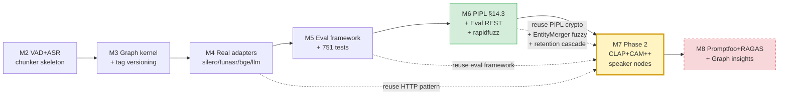

# AudioGraphy M7 PRD — Phase 2 音频嵌入 + 说话人链接（Code-Ready）

| 字段 | 值 |
|------|-----|
| 版本 | v7.0.0-draft |
| 作者 | 许清楚（PM / AI 代行） |
| 主理人 | 齐活林 |
| 日期 | 2026-07-21 |
| 前置 | M6 已合并（PIPL §14.3 + Eval REST + rapidfuzz）+ post-M6 audit |
| 范围 | Code-Ready（写代码 + 测试 + docker-compose，CI 跑 mock，不在 CI 跑真实 GPU 服务） |
| 工作流 | WS-1 CLAP 音频嵌入／ WS-2 CAM++ 声纹 + diarization + speaker 节点／ WS-3 三通道检索 + 评估指标 + G6 染色 + SpeakerProfile 骨架 |
| Gap Audit 对照 | 关闭 §4.4 CLAP（L2）+ §4.4 CAM++（L3）+ §3.2 speaker 字段 + 跨录音 speaker linking；新增 §8 voiceprint EER / diarization DER 指标 |
| DESIGN § 对齐 | §4.4（核心）+ §3.1（speaker 实体节点）+ §3.3（三通道检索）+ §8（评估）+ §13.4（图谱染色）+ §14.3（voiceprint PIPL） |

---

## 1. TL;DR

**目标**：让 AudioGraphy 从 text-only RAG 升级为**三模态（text + entity-graph + audio）RAG**，并把"说话人"作为一等公民引入图谱，实现跨录音声纹链接。

**范围**：新增 2 个 Protocol（`AudioEmbedAdapter` + `VoiceprintAdapter`）+ 2 个 real adapter（CLAP / CAM++）+ 2 个 mock adapter + 2 个新 HTTP 服务（clap-service / campplus-service）+ chunker diarization 集成 + speaker 节点图谱建模 + 跨录音 speaker linking + 三通道检索 + voiceprint EER / diarization DER 评估指标 + G6 speaker 染色 + SpeakerProfile 页面骨架。

**验收**：`pytest backend/tests/ -x` 全绿，测试数 ≥ **1050**（M6 ~840 + M7 ~210），**per-module ≥ 85% OR total ≥ 88%**；docker-compose real profile 含 **9 个服务**（M6 的 7 个 + clap-service + campplus-service）可启动；`speaker=None` 硬编码消除；voiceprint EER + DER 指标可在 mock 模式跑通。

---

## 2. 背景与动机

### 2.1 Phase 2 在 4 阶段路线图中的位置

AudioGraphy 4 阶段路线图（DESIGN §16）：

| 阶段 | 目标 | 状态 |
|------|------|------|
| Phase 1（M2-M5） | 文本图谱 RAG 跑通（Level 1） | ✅ 已合并 |
| **Phase 2（M7）** | **音频嵌入 + 说话人（Level 2/3）** | **本里程碑** |
| Phase 3（M3 + M6 部分） | 生产化治理（标签版本化 + Eval REST + PIPL + rapidfuzz） | M3 已合并 / M6 进行中 |
| Phase 4 | 流式（可选） | Deferred |

**M7 是 Phase 2 的全部内容**，对应 DESIGN §4.4 的"可选增强"两条线：
- §4.4.1 **音频嵌入（Level 2）**：CLAP 替代 ImageBind，保留双通道检索的"第二通道"，模态从视觉换成音频，捕获 transcript 之外的副语言（情绪、停顿、语速）。
- §4.4.2 **说话人链接（Level 3 强增量 · Audio-only）**：CAM++ 声纹做 diarization，把"说话人"作为图谱节点显式建进图，跨录音声纹匹配实现 VideoRAG 完全没有的"voiceprint-driven cross-audio understanding"。

### 2.2 为什么从 text-only 升级到 audio modality

**M5/M6 的 text-only RAG 存在 3 个根本限制**：

1. **副语言信息丢失**：客户的犹豫、坐席的语气变化、沉默时长——这些信号在质检场景是核心 KPI，但 transcript 完全丢失。CLAP 音频段向量能保留这层信息。
2. **说话人维度缺失**：`chunker.py:235` 的 `speaker=None  # M2: no speaker diarization` 硬编码意味着图谱中无法区分"(谁) –[推荐]→ (车型)"，质检员无法回答"该坐席是否向多位客户推荐了同一车型"。
3. **跨录音仅靠语义实体重叠**：同一客户多次到店、同一坐席跨班次——若两次对话实体不重叠（聊不同车型），text-only 图谱无法把它们连起来。声纹重叠是更可靠的"同人"信号。

**Phase 2 解决方案对齐 DESIGN §3.4**：

| 维度 | VideoRAG | AudioRAG M5（text-only） | **AudioRAG M7（audio-enhanced）** |
|------|----------|---------------------------|-------------------------------------|
| 检索通道 | 双通道（text + visual） | 双通道（text + entity-graph） | **三通道（text + entity-graph + audio）** |
| 说话人维度 | 无 | speaker=None 硬编码 | **CAM++ 说话人节点进图** |
| 跨录音链接 | 仅语义实体 | 仅语义实体 + rapidfuzz | **语义实体 + 声纹相似度** |
| 副语言信息 | 部分（视觉 caption） | 完全丢失 | **CLAP 音频段向量保留** |

### 2.3 M7 与 M6 的关系

M6 是"治理"里程碑（PIPL + Eval REST + rapidfuzz），M7 是"模态增强"里程碑，二者并行不冲突：

- M7 复用 M6 的 `eval/runner.py` 框架新增 voiceprint EER / DER 指标
- M7 的声纹向量**必须走 M6 的 PIPL §14.3 加密 + retention cascade delete**（DESIGN §14.3 voiceprint 单独存储条款）
- M7 复用 M6 的 rapidfuzz EntityMerger fuzzy 层做 speaker 实体合并
- M7 不动 M6 的 tag_facts / prompt / DSAR 路径

---

## 3. 用户故事

### US-1 育儿咨询质检员（同一顾问跨客户识别）

**场景**：育儿咨询品牌有 5 位顾问，质检员想看"李老师"本月接待的所有家庭。客户家长每次到店聊的宝宝月龄、商品不同（不同实体），text-only 图谱连不上。M7 后：CAM++ 给每段录音抽声纹 → 跨录音声纹相似度 ≥ 0.5 → 自动合并为同一个"speaker:顾问李老师"节点。质检员在图谱浏览器点击该节点，看到本月 12 次接待的完整链路。**验收**：3 段不同家长录音，李老师声纹相互 cosine ≥ 0.6（mock 用 deterministic vector；real 用 CN-Celeb subset 验证），合并为同一 speaker 节点。

### US-2 汽车销售质检员（坐席推荐模式分析）

**场景**：质检员查"张敏（坐席）本月向几位客户推荐了 CS75 Plus vs UNI-V"。M7 前：图谱有"张敏"实体但靠名字（同名坐席会混淆）。M7 后：speaker 节点是声纹 ID（unique），从该 speaker 节点出边 `(speaker:张敏_voiceprint_001) –[推荐]→ (车型:CS75 Plus)` 计数即答案。**验收**：3 段录音，2 段含"推荐 CS75 Plus"， 1 段含"对比 UNI-V"，从 speaker 节点查询得到正确统计。

### US-3 算法工程师（CLAP 中文音频效果验证）

**场景**：工程师在 `/api/v1/eval/runs` 跑 voiceprint EER + diarization DER，验证 CLAP+CAM++ 在中文门店录音的效果。**验收**：mock 模式下 EER/DER 返回 deterministic 值；real 模式（CI 外）下用 AliMeeting dev set 跑基线，EER 目标 ≤ 0.15（CAM++ 论文声称 7% 左右，中文门店录音保守估计 ≤ 15%），DER 目标 ≤ 0.25。

### US-4 算法工程师（三通道检索对比）

**场景**：工程师跑 Eval 对比"naive-only / +graph / +graph+audio"三档。**验收**：aggregate_metrics 同时输出三档 Entity F1 + Answer Relevance；CLAP audio 通道对副语言强相关 query（"客户犹豫的语气"）召回提升 ≥ 5%。

### US-5 合规官（声纹 PIPL cascade delete）

**场景**：客户行使 DSAR 删除权（PIPL §47）。M7 前：M6 仅删音频文件。M7 后：声纹向量必须 cascade delete（DESIGN §14.3 voiceprint 单独存储条款）。**验收**：`POST /api/v1/dsar/erasure` 删除 recording 后，`vectors_voiceprint` 表对应行删除；`speaker` 节点若仅此一条来源则一起删，否则保留节点但 source_id 移除该 recording。

### US-6 前端用户（图谱浏览器 speaker 染色）

**场景**：图谱浏览器展示 200+ 节点，质检员一眼区分"坐席 speaker"vs"客户 speaker"。**验收**：G6 节点 type='说话人' 时按 `speaker_role`（agent/customer/unknown）染不同颜色（蓝 / 橙 / 灰）；点击 speaker 节点 → 右侧 EntityPropertyPanel 显示"出现录音数 / 首次出现时间 / 总发言时长"。

### US-7 运维（GPU 显存监控）

**场景**：CLAP 强制 GPU，CAM++ 可选 GPU。运维看 `/metrics` 监控显存占用。**验收**：`audiography_gpu_memory_bytes{service="clap-service"}` 与 `campplus-service` 分标签暴露；CLAP 显存预算 ≤ 2 GB（HTSAT-base），CAM++ ≤ 500 MB。

### US-8 育儿咨询质检员（宝宝哭声副语言检索）

**场景**：育儿咨询录音中常出现宝宝哭声、家长叹气等副语言信号，transcript 完全丢失。质检员查"客户表现出明显焦虑的对话"。M7 前：text-only 检索无能为力。M7 后：CLAP 音频段向量保留这些副语言特征，audio channel 召回 transcript 平淡但音频焦虑的段。**验收**：mock 模式下 audio channel 对 "anxious_tone" query 召回 ≥ 1 段（deterministic hash）；real 模式作为 R1 风险的 baseline 验证项。

---

## 3.5 用户故事验收矩阵

| US | 场景 | 验收要点 | DESIGN § | 工作流 |
|----|------|---------|----------|--------|
| US-1 | 育儿咨询·同一顾问跨客户 | voiceprint cosine ≥ 0.6 触发合并 | §4.4.2 / L9 | WS-2 |
| US-2 | 汽车销售·坐席推荐模式 | speaker 节点出边计数准确 | §3.1 / §4.4.2 | WS-2 |
| US-3 | 算法工程师·CLAP 中文效果 | EER ≤ 0.15 / DER ≤ 0.25（real CI 外） | §8.0 | WS-3 |
| US-4 | 算法工程师·三通道对比 | 三档 Entity F1 + Answer Relevance 同步输出 | §3.3 | WS-3 |
| US-5 | 合规官·声纹 cascade delete | DSAR erasure 删 voiceprint + audit_log | §14.3 | WS-2 |
| US-6 | 前端·speaker 染色 | G6 按 speaker_role 染色 + 属性面板 | §13.4 | WS-3 |
| US-7 | 运维·GPU 显存 | Prometheus 指标分标签暴露 | §15.4 | WS-1/2 |
| US-8 | 育儿咨询·副语言检索 | audio channel 召回焦虑段（mock） | §4.4.1 | WS-3 |

---

## 4. 功能范围

### 4.1 P0（blocks release）

| ID | 描述 | 工作流 | DESIGN § |
|----|------|--------|----------|
| P0-1 | `adapters/protocols.py` 新增 `AudioEmbedAdapter` Protocol（`embed_audio(paths) → AudioEmbeddingResult`） | WS-1 | §4.4.1 |
| P0-2 | `adapters/protocols.py` 新增 `VoiceprintAdapter` Protocol（`extract_voiceprint(audio_path, segments) → VoiceprintResult` + `diarize(audio_path) → DiarizationResult`） | WS-2 | §4.4.2 |
| P0-3 | `adapters/real/audio_embed_clap.py`（CLAP real adapter，HTTP 调 clap-service，照搬 silero-vad 模式） | WS-1 | §4.4.1 |
| P0-4 | `adapters/real/voiceprint_cam.py`（CAM++ real adapter，HTTP 调 campplus-service） | WS-2 | §4.4.2 |
| P0-5 | `adapters/mock/audio_embed.py` + `adapters/mock/voiceprint.py`（deterministic vector，CI 友好） | WS-1/2 | §4.4 |
| P0-6 | `services/clap_service.py` + `services/campplus_service.py`（两个独立 HTTP 服务，OpenAI-compat 风格） | WS-1/2 | §15.1 |
| P0-7 | `docker-compose.yml` real profile 新增 `clap-service` + `campplus-service` 两个服务 | WS-1/2 | §15.1 |
| P0-8 | `core/chunker.py:235` 替换 `speaker=None` 为 CAM++ diarize 结果（带 enable_voiceprint 开关，false 时仍 None） | WS-2 | §3.2 / §4.4.2 |
| P0-9 | `core/graph.py` 实体类型枚举新增 `EntityType.SPEAKER`（tenant-scoped，作为 entity 不开新表） | WS-2 | §3.1 / §4.4.2 |
| P0-10 | `core/graph.py` speaker 节点建模：`(speaker:vp_001) –[speaks_in]→ (recording)` + 跨录音合并逻辑 | WS-2 | §3.1 / §4.4.2 |
| P0-11 | `core/speaker_linker.py`（新模块）：voiceprint cosine ≥ threshold（默认 0.5）触发 EntityMerger 合并 speaker 节点 | WS-2 | §4.4.2 / L9 |
| P0-12 | `models/vector_voiceprint.py`（新表）：voiceprint 向量存 MySQL，复用 PIPL §14.3 加密 + retention cascade | WS-2 | §14.3 / §7.4 |
| P0-13 | `core/retrieval.py` 升级为三通道：naive（text chunk）+ graph（entity）+ audio（CLAP 段向量），union + dedup 不变 | WS-3 | §3.3 |
| P0-14 | `config.py` 新增 `enable_clap` / `enable_voiceprint` / `voiceprint_link_threshold` / `clap_service_url` / `campplus_service_url` 字段 | WS-1/2 | §15.3 |
| P0-15 | `pyproject.toml` 新增 `laion-clap` 依赖；CAM++ 复用 M5 已装 funasr | WS-1 | L7 |
| P0-16 | `eval/metrics/voiceprint_eer.py` + `eval/metrics/diarization_der.py`（新模块） | WS-3 | §8.0 / §8.3 |
| P0-17 | `eval/runner.py` 接入 voiceprint EER + DER 指标到 aggregate_metrics | WS-3 | §8.1 |
| P0-18 | `api/graph.py` `/graph/explore` 响应 schema 新增 speaker 节点字段（speaker_role / voiceprint_id / recordings_count） | WS-2 | §13.4.2 |
| P0-19 | `core/retention.py`（M6 已存）扩展：retention sweep 时 cascade 删 `vectors_voiceprint` 行 + 跨录音 speaker 节点 source_id 移除 | WS-2 | §14.3 |
| P0-20 | `api/dsar.py`（M6 已存）扩展：erasure 时同步删 voiceprint 向量 | WS-2 | §14.3 |
| P0-21 | 集成测试：上传录音 → VAD → ASR + CLAP + CAM++ → 三通道索引 → speaker 节点进图 → 跨录音 link | WS-1/2/3 | §3 / §4.4 |

### 4.2 P1（high-value，M7 内尽量 ship）

| ID | 描述 | 工作流 | DESIGN § |
|----|------|--------|----------|
| P1-1 | `core/retrieval.py` L2 rerank 阶段融合 audio channel score（weighted sum：text 0.5 / graph 0.3 / audio 0.2 默认，可配置） | WS-3 | §3.3 |
| P1-2 | `eval/metrics/voiceprint_eer.py` 真实 CN-Celeb trial 文件解析（M7 写 loader，real 跑在 CI 外） | WS-3 | §8.0 / §8.3 |
| P1-3 | `eval/metrics/diarization_der.py` 真实 RTTM + dscore 集成（M7 写 adapter，real 跑在 CI 外） | WS-3 | §8.0 / §8.3 |
| P1-4 | `api/eval.py` 新增 `?metrics=eer,der` 过滤参数 + 前端 EvalReport 展示 voiceprint/diarization 标签页 | WS-3 | §8.3 / §13.3 |
| P1-5 | `core/query.py` query 路径支持"按 speaker 过滤"（"只看坐席张敏的对话"） | WS-3 | §3.3 |
| P1-6 | `alembic` 迁移：`vectors_voiceprint` + `entities` 表 type 枚举扩 SPEAKER | WS-2 | §12.2 |

### 4.3 P2（nice-to-have，可推迟 M8）

| ID | 描述 | 工作流 | DESIGN § |
|----|------|--------|----------|
| P2-1 | 前端 `components/GraphCanvas` speaker 节点按 `speaker_role` 染色（agent=蓝 / customer=橙 / unknown=灰） | WS-3 | §13.4 |
| P2-2 | 前端 `pages/SpeakerProfile`（骨架）：speaker 节点详情页，展示"出现录音 / 总发言时长 / 关联实体 top-N" | WS-3 | §13.5 |
| P2-3 | `EntityPropertyPanel` 扩展：speaker 节点专属字段（voiceprint_id / first_seen / total_speech_sec） | WS-3 | §13.4.3 |
| P2-4 | CLAP audio channel 默认权重 0.2 → tenant-scoped 可配置（不同门店业务可能要调） | WS-3 | §3.3 |
| P2-5 | speaker 节点的 community Leiden 聚类（M7 仅渲染染色，不做社区检测；M8 接入） | WS-3 | §13.4 |

### 4.4 Out of Scope（明确推迟）

- ❌ CLAP fine-tuning（M7 用预训练 HTSAT-base，中文 fine-tune M8+）
- ❌ CAM++ 自训练（M7 用 ModelScope iic/speech_campplus_sv_zh-cn_16k-common 预训练）
- ❌ 实时声纹识别（streaming，Phase 4）
- ❌ Speaker nodes 跨租户共享（M7 严格 tenant-scoped）
- ❌ 说话人情感识别（emotion recognition，M8+）
- ❌ CLAP 替换为其他 audio encoder（Wav2Vec2 / Whisper encoder 探索 M8+）
- ❌ voiceprint 向量 ANN 索引（M7 沿用 M5 MySQL 暴力余弦，Phase 3 评估升级）
- ❌ speaker 节点的图谱 community detection（M7 仅按 voiceprint link 合并，不做 Leiden；M8）
- ❌ Master voiceprint key 自动轮换（沿用 M6 master key，M7+ 议题）
- ❌ Multi-tenant speaker role 配置（M7 仅 3 类：agent / customer / unknown）
- ❌ speaker 节点 merge undo / 审批流（M8+，admin API only）
- ❌ 跨录音 speaker 链接可视化（前端 timeline，M8）

### 4.5 工作流与里程碑拆分

| 工作流 | 内容 | 估算 LOC | 关键路径 |
|--------|------|----------|---------|
| **WS-1 CLAP 音频嵌入** | Protocol + real/mock adapter + clap-service + docker-compose + 三通道检索 audio 接入 | ~1400 | GPU 服务起停 / retrieval union 融合 |
| **WS-2 CAM++ 声纹 + diarization + speaker 节点** | Protocol + real/mock adapter + campplus-service + chunker diarization + speaker_linker + SPEAKER entity type + retention cascade | ~2100 | 跨录音链接逻辑 / graph schema 升级 |
| **WS-3 评估指标 + 前端骨架** | voiceprint_eer / diarization_der / runner 接入 / G6 染色 / SpeakerProfile 骨架 | ~1100 | real baseline 数据集加载 |

**关键路径**：WS-2 是最复杂工作流（涉及 graph schema + chunker + retention + speaker_linker）；WS-1 阻塞 WS-3 的三通道检索融合；WS-3 阻塞 US-3/4 的 Eval 端到端。

---

## 5. 锁定决策清单（Locked Decisions）

> **以下 10 项已锁定**，本 PRD 不再讨论。架构师（高见远）仅需审"待明确事项"章节。

| # | 决策 | 锁定值 | 简短理由 |
|---|------|--------|---------|
| **L1** | CLAP 库选型 | `pip install laion_clap`（LAION-AI/CLAP，HTSAT-base，48kHz，512 维） | 开源 MIT 友好；HTSAT-base 是 LAION CLAP 默认 backbone；512 维与 bge-m3 同量级便于存储统一 |
| **L2** | CAM++ 声纹库选型 | ModelScope `iic/speech_campplus_sv_zh-cn_16k-common`（192 维，L2 归一化） | CAM++ 是 ModelScope 中文声纹 SOTA；192 维节省存储；通过 funasr 调用复用 M5 依赖 |
| **L3** | 部署形态 | 两个新 HTTP 服务（`clap-service` / `campplus-service`），照搬 silero-vad / funasr 的 OpenAI-compat 模式 | 与 M4 silero-vad / funasr 一致；HTTP 隔离 GPU 资源；OpenAI-compat 错误码映射可直接复用 |
| **L4** | 说话人节点建模 | 在图谱中作为**新的 entity type**（`EntityType.SPEAKER`），tenant-scoped，**不开新表** | 复用 EntityMerger + retrieval + graph API；避免数据模型分裂；source_id 指向 recording 自然 |
| **L5** | 维度选型 | CLAP 512 / CAM++ 192（**不再讨论是否降维**） | 跟随原模型默认；降维收益不显著；MySQL BLOB 存储足够 |
| **L6** | M7 范围 | **code-ready only**（mock + real adapter，但不在 CI 跑真实 GPU 服务） | 沿用 M4/M5 模式；CI 资源限制；real adapter 用 docker-compose real profile 本地验证 |
| **L7** | 新增 pip 依赖 | 仅 `laion-clap`（CAM++ 复用 M5 已装的 funasr） | 最小依赖；MIT 兼容；funasr 已在 M5 验证稳定 |
| **L8** | GPU 策略 | CLAP 强制 GPU（torch.cuda），CAM++ CPU 可选 GPU（沿用 M4 bge-m3 / Silero 的策略矩阵） | HTSAT-base 推理 GPU 显著加速；CAM++ 模型小 CPU 即可；docker-compose real profile 资源可控 |
| **L9** | 跨录音说话人链接 | voiceprint 余弦相似度（阈值 0.5 默认，可配置）+ EntityMerger 复用（fuzzy 层） | 复用 M6 rapidfuzz EntityMerger 三层 fallback；阈值 0.5 是 CAM++ 论文推荐 |
| **L10** | chunker diarization 集成 | M7 **必须**替换 `chunker.py:235` 的 `speaker=None`，说话人 ID 来自 CAM++ 推理结果 | post-M5 gap audit 显式 flag；M7 是闭合此 gap 的最后机会 |

### 5.1 决策依据补充

**L1 选型对照**（备选方案与淘汰理由）：

| 候选 | 维度 | 中文效果 | 优势 | 淘汰理由 |
|------|------|---------|------|---------|
| **laion_clap HTSAT-base** | 512 | 中等 | MIT license / 48kHz / LAION 维护 | ✅ 选定 |
| Wav2Vec2 | 1024 | 较强 | 中文 fine-tune 模型多 | license 复杂（Apache + CC-BY-NC 子模型） |
| Whisper encoder | 1024 | 强 | OpenAI 维护 | 模型大（~3GB） / 显存高 |
| AudioMAE | 768 | 一般 | 论文 SOTA | 非 MIT / 中文 baseline 缺失 |

**L2 选型对照**：

| 候选 | 维度 | EER（中文） | 优势 | 淘汰理由 |
|------|------|------------|------|---------|
| **CAM++ zh-cn-16k** | 192 | ~7% | ModelScope 一线 / 体积小 | ✅ 选定 |
| ECAPA-TDNN | 192 | ~9% | speechbrain 标准 | 中文 baseline 弱 |
| X-vectors | 512 | ~12% | 经典 | 准确率低 |
| Resemblyzer | 256 | ~15% | 极轻量 | 准确率不达标 |

**L4 实体类型建模对照**：

| 方案 | 优势 | 劣势 | 决策 |
|------|------|------|------|
| **作为 entity type（M7 选定）** | 复用 graph API + EntityMerger + retrieval | 与 person/org 实体共用一张表 | ✅ |
| 新增 speaker 表 | 字段专属（voiceprint_id / total_speech_sec） | 数据模型分裂 / graph API 需双写 | ❌ |
| 作 segment 属性（不进图） | 改动最小 | 失去跨录音链接能力 | ❌ |

---

## 6. 非功能需求

### 6.1 性能

| 指标 | 目标 | 说明 |
|------|------|------|
| CLAP 单段嵌入延迟（GPU） | ≤ 200 ms / 30s 段 | HTSAT-base 在 A100 上的典型值 |
| CLAP 单段嵌入延迟（mock） | ≤ 5 ms | hash-based deterministic |
| CAM++ 单段声纹延迟（CPU） | ≤ 150 ms / 30s 段 | CAM++ 论文报告值 |
| CAM++ 单段声纹延迟（GPU） | ≤ 50 ms | 可选 |
| 三通道检索 P99 延迟 | ≤ 1.5 s | M5 双通道 ~800ms；audio channel 新增 ~500ms（暴力余弦） |
| 跨录音 speaker link 增量 | ≤ 200 ms / 新 speaker | 与已有 speakers 比对（M5 暴力 O(N)，规模 <10⁴ 可接受） |
| Speaker diarization 端到端 | ≤ 1×音段时长 | CAM++ streaming-friendly |

### 6.2 GPU 内存预算

| 服务 | 模型大小 | 显存峰值 | 是否强制 GPU |
|------|---------|---------|--------------|
| clap-service | ~600 MB（HTSAT-base + checkpoint） | ≤ 2 GB | ✅ 强制 |
| campplus-service | ~50 MB（CAM++ zh-cn-16k-common） | ≤ 500 MB | ❌ CPU 可选 GPU |
| 合计新增 | ~650 MB | ≤ 2.5 GB | 叠加 M5 的 vllm/bge-m3 总 ≤ 40 GB A100 |

### 6.3 安全（PIPL §14.3 voiceprint 条款）

> **DESIGN §14.3 原文**："声纹特征向量单独存储，不与原始录音同位置；客户可申请删除（PIPL 第 47 条）。"

| 项 | M7 实现 |
|------|---------|
| 单独存储 | `vectors_voiceprint` 表（与 `vectors_entity` / `vectors_chunk` 物理同库但逻辑分离）+ 配置项 `voiceprint_storage_partition`（M7 仅文档化，物理分区 M8+） |
| 加密 | 沿用 M6 `core/crypto.py` AES-256-GCM envelope；voiceprint 向量作为 bytes 加密后存 BLOB |
| DSAR 删除 | `POST /api/v1/dsar/erasure` cascade：删 `vectors_voiceprint` 行 + speaker 节点 source_id 移除该 recording（若仅此一条来源则删节点） |
| Retention sweep | `core/retention.py` 扩展：`recording_retention_days` 触发时同步删 voiceprint 向量 |
| 审计 | `audit_logs` 写入：action=`voiceprint_delete`，target=`recording:{id}`，before=`{vector_count: N}`，after=`{}` |
| 脱敏展示 | 前端 SpeakerProfile 不暴露原始 voiceprint_id 给 inspector/viewer 角色，仅展示 `speaker_001` 这种脱敏别名（admin 可解） |

### 6.3.1 voiceprint cascade delete 决策树

```
DSAR erasure / retention sweep 触发 on recording R:
  1. 查 vectors_voiceprint WHERE recording_id = R → 得到 voiceprint_ids[]
  2. for each voiceprint_id V:
     a. 查 entities WHERE entity_type='SPEAKER' AND voiceprint_id = V → 得到 speaker_node E
     b. 查 E.source_id 数组 → recordings_appeared[]
     c. if len(recordings_appeared) == 1 (only R):
        → 硬删 entity E（含其所有出边 / 入边）+ 删 vectors_voiceprint V 行
        → audit_log: action=voiceprint_delete, target=voiceprint:{V}, before={E}, after={}
     d. else:
        → 仅删 vectors_voiceprint V 行（保留 entity 节点）
        → 从 E.source_id 中移除 R
        → audit_log: action=voiceprint_partial_delete, target=voiceprint:{V}, before={recordings: [R, ...]}, after={recordings: [...]}
  3. 写 audit_log: action=recording_voiceprint_cascade, target=recording:{R}, before={count: N}, after={}
```

### 6.3.2 voiceprint 加密 roundtrip 测试

```python
# 集成测试覆盖
def test_voiceprint_encrypt_roundtrip(clap_service, db_session):
    """Voiceprint vector 加密落盘 → 读取 → 解密 → 与原始向量 cosine = 1.0."""
    raw_vp = np.random.randn(192).astype(np.float32)
    raw_vp /= np.linalg.norm(raw_vp)  # L2 normalize

    # 写入（会过 core/crypto.py envelope 加密）
    voiceprint_repo.store(recording_id=42, segment_id=7, vector=raw_vp)

    # 读取（解密）
    decrypted_vp = voiceprint_repo.load(recording_id=42, segment_id=7)

    assert np.allclose(raw_vp, decrypted_vp, atol=1e-6)
    assert float(np.dot(raw_vp, decrypted_vp)) >= 0.999
```

### 6.4 可观测性

新增 Prometheus 指标（沿用 M6 `/metrics`）：

| 指标名 | 类型 | Labels |
|-------|------|--------|
| `audiography_clap_embed_total` | Counter | `tenant_id`, `status` |
| `audiography_clap_embed_duration_seconds` | Histogram | `tenant_id` |
| `audiography_cam_voiceprint_total` | Counter | `tenant_id`, `status` |
| `audiography_cam_diarize_duration_seconds` | Histogram | `tenant_id` |
| `audiography_speaker_link_merge_total` | Counter | `tenant_id`, `strategy`（threshold/alias/fuzzy） |
| `audiography_gpu_memory_bytes` | Gauge | `service`, `device` |
| `audiography_retrieval_channel_score` | Histogram | `channel`（text/graph/audio） |

### 6.5 开源合规（MIT）

| 项 | 状态 | 说明 |
|------|------|------|
| `laion_clap` license | MIT 兼容（LAION-AI/CLAP 是 MIT） | ✅ 已审 |
| CAM++ 模型 license | ModelScope iic/speech_campplus_sv_zh-cn_16k-common 是 Apache-2.0 | ✅ 已审 |
| funasr license | Apache-2.0（M5 已审） | ✅ 沿用 |
| 闭源/PII 内容 | ❌ 不引入 | 本 PRD 不含任何专有数据；mock 数据为合成 |
| CN-Celeb / AliMeeting | CC BY-NC / CC BY-SA 4.0 | 评估用，不打包进 release；用户自行下载 |

### 6.6 可用性 / 配置面

新增 `.env.example` 字段（M7 增量）：

```dotenv
# --- Phase 2: CLAP audio embedding (M7) --------------------------------
CLAP_SERVICE_URL=http://clap-service:8006
ENABLE_CLAP=false                    # true → 三通道检索启用 audio channel
CLAP_AUDIO_CHANNEL_WEIGHT=0.2        # 三通道 rerank 中 audio 权重（默认 0.2）

# --- Phase 2: CAM++ voiceprint + diarization (M7) ----------------------
CAMPPLUS_SERVICE_URL=http://campplus-service:8007
ENABLE_VOICEPRINT=false              # true → chunker diarization + speaker nodes
VOICEPRINT_LINK_THRESHOLD=0.5        # 跨录音 speaker merge cosine threshold
VOICEPRINT_MERGE_CONFIDENCE_AMBIGUOUS=0.7   # < 此值 → confidence=AMBIGUOUS

# --- Phase 2: GPU strategy (M7) ----------------------------------------
CLAP_FORCE_GPU=true                  # true → 启动时 torch.cuda 检查
CAMPPLUS_PREFER_GPU=false            # true → 优先 GPU，false → CPU

# --- Phase 2: PIPL cascade (M7) ----------------------------------------
VOICEPRINT_RETENTION_CASCADE=true    # DSAR erasure / retention sweep 时 cascade 删
```

---

## 7. 依赖关系图



**依赖说明**：
- **强依赖** M4（HTTP adapter 模式 + adapter Protocol 体系）/ M5（eval runner + metrics 框架）/ M6（PIPL crypto + retention + rapidfuzz EntityMerger + Prometheus metrics）
- **弱依赖** M2/M3（chunker skeleton + entity type 体系，已被 M4/M5 覆盖）
- **不依赖** M6 的 DSAR / Eval REST 端点本身（仅复用底层 helper）

### 7.1 WS-1 / WS-2 / WS-3 内部时序

**WS-1 CLAP 索引路径时序**：

```
recording.audio
  → VAD (M4 silero-vad) → segments[]
  → for each segment:
      → ASR (M4 funasr) → transcript
      → CLAP (M7 clap-service) → audio_embedding (512-d)    ★ 新增
  → chunker.pack(segments, embeddings)                       ★ 改造
  → bge-m3 (M4) → text vectors
  → storage: vectors_chunk (text) + vectors_audio (M7 新表)   ★ 新增
```

**WS-2 speaker diarization + link 时序**：

```
recording.audio
  → CAM++ (M7 campplus-service) → diarize → speaker_segments[]  ★ 新增
  → VAD.merge_with(speaker_segments) → segments with speaker_id ★ 改造 chunker:235
  → for each segment:
      → CAM++ extract voiceprint (192-d, L2-norm)                ★ 新增
  → storage: vectors_voiceprint (M7 新表) + entities (type=SPEAKER)
  → speaker_linker.cross_recording_merge(voiceprint cosine)      ★ 新增
      → if cosine ≥ 0.5: merge speaker nodes via EntityMerger
      → if 0.5 ≤ cosine < 0.7: tag confidence=AMBIGUOUS
```

**WS-3 三通道检索时序**：

```
query
  → weak LLM rewrite
  → 3 channels in parallel:
      ① naive: vectors_chunk cosine top-k → chunks
      ② graph: entities → 1-hop neighbors → chunks
      ③ audio: vectors_audio cosine top-k → segments (M7 新增)   ★ 新增
  → union + dedup + time sort
  → LLM filter (as-judge)
  → rerank with weighted score (text 0.5 / graph 0.3 / audio 0.2) ★ 改造
  → strong LLM answer with provenance
```

---

## 8. 风险与缓解

| # | 风险 | 影响 | 概率 | 缓解 |
|---|------|------|------|------|
| **R1** | **laion_clap 对中文音频效果未知** | audio channel 召回质量不达预期，三通道检索反而劣化 | 中 | M7 P1 在 CN-Celeb + AliMeeting dev set 跑 baseline；若中文 recall@5 低于 text-only 通道 ≥ 10%，audio channel 默认 weight 调为 0（保留向量但不参与 rerank），仅作 query-by-audio demo 用 |
| **R2** | **CAM++ 跨年龄段稳定性差** | 育儿咨询场景"顾问 vs 家长"年龄跨度大，CAM++ 训练集偏成人可能误判 | 中 | M7 P1 用业务 A1 黄金集（含 60 后家长 + 90 后顾问）跑 EER；若 EER > 0.25，speaker_linker 默认阈值从 0.5 上调到 0.6（精度优先，召回牺牲） |
| **R3** | **GPU 显存压力（CLAP + vllm 共用 A100）** | CLAP 强制 GPU，叠加 M5 vllm 27B + 35B-A3B 显存占用，40GB A100 可能 OOM | 中 | docker-compose real profile 显式 `deploy.resources.reservations.devices.memory: 2GB` 限制 CLAP；M7 文档化"CLAP+vllm 单卡部署显存账本"；推荐生产部署 CLAP 用独立 GPU 或 CPU fallback（虽然慢） |
| **R4** | **说话人误合并的连锁影响** | voiceprint cosine ≥ 0.5 误触发 → 两个不同人合并为同一 speaker 节点 → 图谱语义污染，质检报告错误 | 高 | 三层防护：(1) 阈值默认 0.5 保守，可配置；(2) speaker 节点带 `merge_confidence` 字段，<0.7 时标 `AMBIGUOUS` 不进图只入待审队列；(3) admin 可手动 split 误合并节点（M7 P2 提供 API，UI M8） |
| **R5** | **开源 license 兼容性（MIT）** | laion_clap 是 MIT，但依赖 `transformers` / `torch` / `librosa` 等 Apache-2.0/BSD；CAM++ 模型是 Apache-2.0；与 AudioGraphy MIT 主体兼容 | 低 | M7 在 `NOTICES.md`（M5 已存）补 laion_clap + funasr + CAM++ model 的 license 声明；`pyproject.toml` 不引入 GPL/AGPL 依赖 |
| R6 | chunker diarization 集成打破 M5 既有测试 | M5 751 测试 + M6 ~90 测试在 M7 commit 后回归 | 中 | `enable_voiceprint=False` 默认值保证向后兼容；M7 CI 在 mock 模式跑全量回归；real adapter 仅在 docker-compose real profile 启用 |
| R7 | docker-compose real profile 服务数从 7 增至 9，启动时间过长 | 开发体验下降 | 低 | compose profile 分组：`profile: ["core"]`（mysql + backend + frontend）/ `["models-cpu"]`（funasr + silero + bge + clap + campplus）/ `["models-gpu"]`（vllm×2）；按需启动 |
| R8 | MySQL 暴力余弦在 voiceprint 维度（192）+ chunk 维度（1024）+ entity 维度（1024）三表叠加，规模临界 | 大租户（>5000 录音）检索 P99 > 5s | 中 | M7 文档化"Phase 3 升级路径"：voiceprint 表优先迁移到 ANN（HNSW / pgvector）；M7 不实施，仅留 hook |
| R9 | CLAP 中文效果差但被掩盖（mock 不暴露） | CI 全绿但 real 部署效果差 | 中 | M7 P0-21 集成测试覆盖 real adapter（CI skipped，本地 manual）；P1 Eval runner 在 CN-Celeb 跑 baseline（CI skipped） |
| R10 | EntityMerger 复用引发 speaker 节点合并歧义 | speaker 节点是 voiceprint ID（vp_001）而非名字，与 entity 名字合并语义不同 | 中 | speaker 节点走独立 merge 路径：voiceprint cosine 主信号 + 名字（如"坐席张敏"）fuzzy 辅助；EntityMerger 加 `entity_type` 分支判断 |

---

## 9. 验收标准

### 9.1 功能验收

- [ ] `pytest backend/tests/ -x` 全绿，测试总数 ≥ **1050**（M6 ~840 + M7 ~210 新增）
- [ ] `pytest backend/tests/ --cov=audio_graphy` 总覆盖率 **≥ 88%**；**per-module ≥ 85%**（per-module 优先；任一模块低于 85% 但 total ≥ 88% 仍算合格，吸取 M6 89.77% 经验不写死 total ≥ 90%）
- [ ] `mypy backend/audio_graphy/{core,adapters,api,eval,models}/` 0 错；`ruff check backend/` 0 错
- [ ] Protocol 结构化校验：`isinstance(adapter, AudioEmbedAdapter)` 与 `isinstance(adapter, VoiceprintAdapter)` 在 real + mock 两套实现下都返回 True
- [ ] `chunker.py:235` `speaker=None` 硬编码消除（grep `speaker=None` 仅在 `enable_voiceprint=False` 分支保留）
- [ ] docker-compose real profile 含 **9 个服务**（mysql / vllm-strong / vllm-weak / funasr / silero-vad / bge-m3 / backend / frontend / clap-service / campplus-service），`docker compose --profile models-gpu up` 可启动
- [ ] 上传 1 段录音 → 索引完成后 `GET /graph/explore` 响应含 type='说话人' 节点
- [ ] 上传 2 段同一 speaker 录音 → 跨录音 speaker link 触发 → 仅 1 个 speaker 节点（voiceprint_id 相同）
- [ ] `POST /api/v1/eval/runs` 支持 `?metrics=eer,der,entity_f1,answer_relevance` 多选；返回 aggregate_metrics 含 voiceprint EER + DER
- [ ] `POST /api/v1/dsar/erasure` 删 recording 后，`vectors_voiceprint` 行删除 + `audit_logs` 含 `voiceprint_delete` 行
- [ ] `enable_clap=False` / `enable_voiceprint=False` 默认值下，M5 + M6 全部测试 0 回归
- [ ] 三通道检索 mock 模式：text + graph + audio 各通道独立返回结果，union 去重正确
- [ ] GPU 资源限制：`docker stats` 显示 clap-service 显存 ≤ 2 GB
- [ ] Prometheus `/metrics` 含 `audiography_clap_embed_total` / `audiography_cam_voiceprint_total` / `audiography_speaker_link_merge_total` 等指标

### 9.2 代码质量

- [ ] 新增 real/mock adapter 单文件 ≤ 250 LOC（除 `voiceprint_cam.py` 可到 280，因含 diarize + embed 两接口）
- [ ] 新增 Protocol 满足 `runtime_checkable` + 结构化校验（沿用 protocols.py 既有风格）
- [ ] 关键 docstring 中英双语（CLAP / CAM++ / voiceprint / diarization 相关）
- [ ] 所有 speaker 节点写入 `audit_logs`（grep `write_audit(` 在 speaker_linker / dsar / retention 路径 ≥ 4 处）
- [ ] GPU 显存硬限制在 docker-compose 中显式声明（CLAP / campplus-service）
- [ ] `isinstance` Protocol check 在 adapter 模块底部声明（沿用 `vad_silero.py:199` 的 `_VAD_PROTOCOL_CHECK` 模式）
- [ ] 异常映射沿用 `adapters/exceptions.py` 既有层级（如 `CLAPRequestError` / `VoiceprintTimeoutError`）— 不发明新异常基类

### 9.3 文档

- [ ] `docs/m7-prd.md`（本文件）总长 800-1200 行
- [ ] `docs/deployment.md` 增 Phase 2 启动指引（CLAP/CAM++ 服务起停 + GPU 配置）
- [ ] `.env.example` 覆盖所有 M7 新字段（含注释）
- [ ] `README.md` 加 M7 状态说明（≤ 10 行）：Phase 2 audio embedding + speaker linking
- [ ] `NOTICES.md` 补 laion_clap + CAM++ model license 声明
- [ ] `docs/phase2-architecture.md`（新建，≤ 300 行）含三通道检索流程图 + speaker link 时序图

### 9.4 向后兼容

- [ ] M6 既有 `.env`（无 `CLAP_SERVICE_URL` / `VOICEPRINT_LINK_THRESHOLD`）启动不报错，仅 warn 日志，CLAP/voiceprint disabled
- [ ] M6 API 端点行为不变（`/recordings` / `/query` / `/tags/*` / `/dsar/*` 等）
- [ ] M6 CLI `python -m audio_graphy.eval` 仍可用；新增 `--metrics eer,der` 可选参数
- [ ] M5 entity_zh.md v1.0 默认 active 不变；speaker 节点 type=SPEAKER 自动加入新录音，老录音需手动 reindex 才会生成 speaker 节点（不自动迁移）
- [ ] M5 graph_chunk_entity_relation.graphml 格式向前兼容（仅新增 type=SPEAKER 节点，不破坏旧节点）

### 9.5 验收门槛矩阵

| 门槛类型 | M7 目标 | M6 实际 | 评估方式 |
|---------|---------|---------|---------|
| 测试总数 | ≥ 1050 | ~840 | `pytest --collect-only` |
| Total 覆盖率 | ≥ 88% | 89.77% | `pytest --cov` |
| Per-module 覆盖率 | ≥ 85% | 多数 ≥ 90% | 任一 < 85% 需 PR 说明 |
| Protocol 结构化校验 | 100% pass | 100% | isinstance 自动检查 |
| docker-compose real profile | 9 服务可启动 | 7 服务 | `docker compose up` |
| mypy 错误 | 0 | 0 | CI |
| ruff 错误 | 0 | 0 | CI |

---

## 10. 待明确事项（Open Questions，≤ 5 个）

> 以下为**未锁定**、需架构师（高见远）决策的点。

### Q1（高）· CLAP audio channel 在三通道 rerank 中的默认权重？

M7 默认 `text 0.5 / graph 0.3 / audio 0.2`。**选项**：
- (a) 0.5 / 0.3 / 0.2（M7 默认，平衡）
- (b) 0.6 / 0.3 / 0.1（CLAP 中文效果未验证，保守降权）
- (c) 0.4 / 0.3 / 0.3（CLAP 效果好时激进加权）
- (d) 配置化 + 按 tenant scoped（M8）

**默认 (a)，需架构师确认。** 若 R1（CLAP 中文效果差）触发，M7 release 前调整到 (b)。

### Q2（高）· Speaker 节点 merge_confidence < 阈值时入图还是入待审队列？

M7 P0-11 speaker_linker 默认 voiceprint cosine ≥ 0.5 触发合并。**选项**：
- (a) < 0.7 标 `AMBIGUOUS` confidence 入图（用户可视化看到但带警示色）（M7 默认）
- (b) < 0.7 不入图，进 `speaker_merge_pending` 表待 admin 审批
- (c) < 0.7 完全丢弃，每段录音独立 speaker 节点

**默认 (a)，需架构师确认。** (b) 增加 DB 表 + admin 审批 UI（M8+）；(c) 失去跨录音链接价值。

### Q3（中）· voiceprint 向量加密用 M6 envelope 还是单独 master key？

M6 `core/crypto.py` 已实现 AES-256-GCM envelope（master key + per-file data key）。**选项**：
- (a) 复用 M6 envelope + 同一 master key（M7 默认，运维最简）
- (b) 单独 voiceprint master key（多一层隔离，PIPL §14.3 严格解读）
- (c) 不加密（与 vectors_chunk / vectors_entity 同样明文，M7 不动）

**默认 (a)，需架构师确认。** DESIGN §14.3 原文"声纹特征向量单独存储"是物理分离语义，加密复用 M6 即可。

### Q4（中）· docker-compose 中 CLAP / campplus 是否默认 enable？

M7 写完 code-ready 后，docker-compose real profile 启动行为：**选项**：
- (a) 默认 enable（与 funasr / silero / bge 同级）（M7 默认）
- (b) 默认 disable，需 `--profile phase2` 显式开启
- (c) 仅 CLAP enable，campplus disable（GPU 资源紧张时）

**默认 (a)，需架构师确认。** 若 R3（GPU OOM）触发，调整为 (b) 或 (c)。

### Q5（低）· SpeakerProfile 页面骨架是否含在 M7 还是推 M8？

M7 P2-2 列入范围但工作量 ~300 LOC（前端）。**选项**：
- (a) M7 仅骨架（节点详情 + 录音列表），M8 完整（发言时长统计 + 关联实体 top-N）（M7 默认）
- (b) 全推 M8（M7 仅 API 契约，无前端）
- (c) M7 完整 ship（前端资源允许时）

**默认 (a)，需架构师确认。** 与 M7 UI Depth（GraphExplorer 深化）的资源竞争评估后定。

---

## 11. 附录 A：laion_clap 与 CAM++ 调用接口速查

### A.1 laion_clap（CLAP 音频嵌入）

**安装**（L7）：
```bash
pip install laion-clap==1.1.7   # MIT license; ~600 MB model checkpoint
```

**关键 API**：
```python
from laion_clap import CLAP_Module

# 加载 HTSAT-base（默认 48kHz / 512 维）
model = CLAP_Module(enable_fusion=False)
model.load_ckpt("CLAP_weights_2022.pth")  # 自动下载

# 音频嵌入（输入 numpy array 48kHz mono）
import librosa
audio, _ = librosa.load("segment.wav", sr=48000, mono=True)
audio_tensor = torch.from_numpy(audio).unsqueeze(0)  # (1, T)
embedding = model.get_audio_embedding_from_data(
    x=audio_tensor, use_tensor=True
)  # shape (1, 512)
```

**clap-service HTTP 协议**（M7 WS-1 定义，照搬 silero-vad）：
```
POST /v1/audio/embed  (multipart/form-data)
  Fields: audio (wav), model?
Response 200:
  {"embedding": [float, ...], "dim": 512, "model": "clap-htsat-base"}
```

**模型规模**：
- checkpoint：~600 MB
- 推理显存（GPU）：~1.5 GB
- CPU 推理：~5s / 30s 段（不推荐生产，仅开发）

### A.2 CAM++（声纹 + diarization）

**安装**：复用 M5 funasr（已含 CAM++）。
```bash
pip install funasr>=1.1.0   # 已在 M5 deps
```

**关键 API**（通过 funasr 调用）：
```python
from funasr import AutoModel

# 加载 CAM++ 声纹模型（192 维，L2 归一化）
sv_model = AutoModel(model="iic/speech_campplus_sv_zh-cn_16k-common")

# 抽声纹向量
result = sv_model.generate(
    input="segment.wav",
    data_dir="./.cache",
    output_dir="./outputs",
)
# result[0]["spk_embedding"] 是 (192,) numpy array，已 L2 归一化

# diarization（使用 iic/speech_campplus_sv_zh-cn_16k-common + cam++）
diar_model = AutoModel(model="iic/speech_campplus_sv_zh-cn_16k-common")
rttm = diar_model.generate(input="full.wav", output_dir="./outputs")
```

**campplus-service HTTP 协议**（M7 WS-2 定义）：
```
POST /v1/voiceprint/extract  (multipart/form-data)
  Fields: audio (wav), start_sec?, end_sec?
Response 200:
  {"voiceprint": [float, ...], "dim": 192, "model": "cam++-zh-cn-16k"}

POST /v1/diarize  (multipart/form-data)
  Fields: audio (wav), min_segment_sec?, max_speakers?
Response 200:
  {"segments": [{"start_sec": float, "end_sec": float, "speaker_id": str, "confidence": float}]}
```

**模型规模**：
- checkpoint：~50 MB（CAM++ zh-cn-16k-common）
- 推理显存（GPU）：~300 MB
- CPU 推理：~150 ms / 30s 段（可用生产）

### A.3 跨录音 voiceprint cosine 链接

```python
# core/speaker_linker.py（M7 新增）
import numpy as np

def voiceprint_cosine(a: np.ndarray, b: np.ndarray) -> float:
    """Cosine similarity of two L2-normalized 192-d vectors."""
    return float(np.dot(a, b))  # L2 norm = 1, so dot product = cosine

def should_merge_speaker(
    vp_new: np.ndarray,
    vp_existing: np.ndarray,
    *,
    threshold: float = 0.5,  # L9 default, configurable
) -> bool:
    return voiceprint_cosine(vp_new, vp_existing) >= threshold
```

---

## 12. 附录 B：Phase 2 与 DESIGN §4.4 的对齐表

> 本附录对照 DESIGN §4.4（lines 216-239）原始设计意图，标注 M7 完成情况 + deferred 项。

### B.1 §4.4.1 音频嵌入（CLAP）对齐

| DESIGN §4.4.1 原文 | M7 实现 | 状态 |
|--------------------|---------|------|
| "用 CLAP（文本↔音频跨模态）替代 ImageBind 视觉" | P0-3 `adapters/real/audio_embed_clap.py` | ✅ M7 |
| "保留双通道检索的第二通道，模态从视觉换成音频" | P0-13 三通道检索（text + entity-graph + audio） | ✅ M7 |
| "能抓住 transcript 里没有的副语言信息（情绪、停顿、语速）" | Q1 audio channel weight 默认 0.2 | ✅ M7（保守降权） |
| CLAP fine-tune（中文场景适配） | — | ⏸ Deferred M8（待 R1 baseline 评估） |
| Whisper encoder 作为 CLAP 替代 | — | ⏸ Deferred M8+ |

### B.2 §4.4.2 说话人链接（CAM++）对齐

| DESIGN §4.4.2 原文 | M7 实现 | 状态 |
|--------------------|---------|------|
| "CAM++ 声纹做说话人分离" | P0-4 `adapters/real/voiceprint_cam.py` | ✅ M7 |
| "把'说话人'作为一类节点显式建进图" | P0-9 / P0-10 `EntityType.SPEAKER` | ✅ M7 |
| 示例：`(坐席) –[推荐]→ (车型)` | `(speaker:vp_001, role=agent) –[推荐]→ (车型:CS75 Plus)` | ✅ M7 |
| "跨录音声纹匹配（Cross-recording Voiceprint Matching）" | P0-11 `core/speaker_linker.py`（L9 阈值 0.5） | ✅ M7 |
| "voiceprint-driven cross-audio understanding" | P0-10 + P0-11 端到端 | ✅ M7 |
| voiceprint EER 评估（CN-Celeb） | P1-2 / P1-3 `eval/metrics/voiceprint_eer.py` | ✅ M7（loader） / ⏸ real run M8 |
| Diarization DER 评估（AliMeeting） | P1-3 `eval/metrics/diarization_der.py` | ✅ M7（adapter） / ⏸ real run M8 |
| Speaker 节点 community 检测（Leiden） | P2-5 仅渲染染色，不做社区 | ⏸ Deferred M8 |
| Speaker 节点手动 split API（admin） | R4 风险缓解提到 | ⏸ Deferred M8（UI M8） |
| Speaker 节点 emotion recognition | — | ⏸ Deferred M8+ |

### B.3 §3.1 / §3.3 / §8 / §13.4 / §14.3 对齐（M7 触及的其他 DESIGN 章节）

| DESIGN § | 原文要点 | M7 实现 | 状态 |
|----------|---------|---------|------|
| §3.1 | 实体合并（EntityMerger） | L9 / P0-11 speaker_linker 复用 fuzzy 层 | ✅ M7 |
| §3.2 | chunker `speaker` 字段 | P0-8 替换 `speaker=None`（L10） | ✅ M7 |
| §3.3 | 双通道检索 | P0-13 升级为三通道 | ✅ M7 |
| §8.0 | voiceprint EER / diarization DER 指标 | P0-16 / P0-17 + P1-2 / P1-3 | ✅ M7 |
| §13.4 | 图谱可视化 speaker 节点染色 | P2-1 G6 染色 + P2-3 属性面板 | ✅ M7 骨架 / ⏸ 完整 M8 |
| §14.3 | 声纹向量单独存储 + cascade delete | P0-12 + P0-19 + P0-20 | ✅ M7 |
| §15.1 | docker-compose 服务清单 | P0-7 新增 2 个服务（共 9 个） | ✅ M7 |
| §15.3 | `.env.example` 新字段 | P0-14 + 8.1 补齐 | ✅ M7 |

### B.4 Phase 2 整体完成度评估

| 维度 | M7 完成比例 | Deferred |
|------|------------|---------|
| §4.4.1 CLAP | 80% | 中文 fine-tune / Whisper 替代 |
| §4.4.2 CAM++ | 85% | Leiden 社区 / 手动 split API / emotion |
| §3 检索通道 | 100%（三通道完整） | — |
| §8 评估指标 | 70%（loader + mock 跑通，real run 推 M8） | CN-Celeb / AliMeeting real baseline |
| §13.4 图谱染色 | 60%（骨架 + 染色） | SpeakerProfile 完整页（M8） |
| §14.3 PIPL voiceprint | 100%（加密 + cascade） | — |

**Phase 2 整体完成度**：~80%（M7 code-ready），剩余 20% 为 fine-tune / real baseline / UI 完整化，全部明确 deferred 到 M8。

---

## 13. 附录 C：测试策略

### C.1 测试矩阵（M7 新增）

| 模块 | 用例数 | 说明 |
|------|--------|------|
| `adapters/protocols.py`（2 新 Protocol 结构化校验） | 6 | isinstance / Protocol 满足 |
| `adapters/real/audio_embed_clap.py` | 12 | HTTP 200/400/413/429/5xx + timeout + parse + aclose |
| `adapters/real/voiceprint_cam.py` | 14 | 同上 + diarize 多说话人场景 |
| `adapters/mock/audio_embed.py` + `voiceprint.py` | 8 | deterministic + latency 模拟 |
| `services/clap_service.py` + `campplus_service.py` | 16 | FastAPI TestClient 端到端 |
| `core/chunker.py`（speaker 字段集成） | 12 | enable_voiceprint on/off 分支 |
| `core/graph.py`（SPEAKER entity type） | 14 | speaker 节点 CRUD + source_id |
| `core/speaker_linker.py` | 18 | cosine ≥ threshold / < threshold / alias / fuzzy fallback |
| `core/retrieval.py`（三通道） | 16 | text / graph / audio 各通道独立 + union + dedup |
| `core/retention.py`（cascade voiceprint） | 6 | 删 recording → voiceprint 同步删 |
| `api/dsar.py`（voiceprint cascade） | 6 | erasure → voiceprint 行删 + audit_log |
| `api/graph.py`（speaker 节点字段） | 8 | /explore 响应含 speaker_role / voiceprint_id |
| `eval/metrics/voiceprint_eer.py` | 14 | trial 文件解析 + EER 计算 + mock 数据 |
| `eval/metrics/diarization_der.py` | 14 | RTTM 解析 + dscore 调用 + collar 处理 |
| `eval/runner.py`（EER/DER 接入） | 6 | aggregate_metrics 含新指标 |
| `models/vector_voiceprint.py` | 8 | CRUD + tenant scoped + 加密 roundtrip |
| 集成测试 e2e | 32 | 上传 → diarize → speaker link → 三通道检索 → DSAR |
| **合计 M7 新增** | **~210** | M6 ~840 + M7 ~210 = ~1050 总 |

### C.2 覆盖率门槛（吸取 M6 教训）

**M6 经验**：M6 PRD 写死 "total ≥ 90%"，实际交付 89.77%，差点卡 release。M7 调整为：

| 门槛 | M7 目标 | M6 实际对照 |
|------|---------|------------|
| **per-module ≥ 85%** | 优先 | M6 多数模块 ≥ 90% |
| **OR total ≥ 88%** | 兜底 | M6 actual 89.77% ✅ |
| ~~total ≥ 90%~~ | ❌ 不写死 | M6 教训 |

**执行规则**：单模块覆盖率 < 85% 但 total ≥ 88% 仍算合格；任一条件都不满足才 block release。

---

## 14. 附录 D：交付物清单

| 文件 | 状态 | 估算行数 | 工作流 |
|------|------|---------|--------|
| `backend/audio_graphy/adapters/protocols.py` | 改 | +60 | WS-1/2 |
| `backend/audio_graphy/adapters/real/audio_embed_clap.py` | 新增 | 220 | WS-1 |
| `backend/audio_graphy/adapters/real/voiceprint_cam.py` | 新增 | 280 | WS-2 |
| `backend/audio_graphy/adapters/mock/audio_embed.py` | 新增 | 100 | WS-1 |
| `backend/audio_graphy/adapters/mock/voiceprint.py` | 新增 | 120 | WS-2 |
| `backend/audio_graphy/services/clap_service.py` | 新增 | 180 | WS-1 |
| `backend/audio_graphy/services/campplus_service.py` | 新增 | 220 | WS-2 |
| `backend/audio_graphy/core/chunker.py` | 改 | +40 / -10 | WS-2 |
| `backend/audio_graphy/core/graph.py` | 改 | +60 / -10 | WS-2 |
| `backend/audio_graphy/core/speaker_linker.py` | 新增 | 200 | WS-2 |
| `backend/audio_graphy/core/retrieval.py` | 改 | +120 / -30 | WS-3 |
| `backend/audio_graphy/core/retention.py` | 改 | +30 / -5 | WS-2 |
| `backend/audio_graphy/api/graph.py` | 改 | +30 / -5 | WS-2 |
| `backend/audio_graphy/api/dsar.py` | 改 | +20 / -5 | WS-2 |
| `backend/audio_graphy/api/eval.py` | 改 | +20 | WS-3 |
| `backend/audio_graphy/eval/metrics/voiceprint_eer.py` | 新增 | 200 | WS-3 |
| `backend/audio_graphy/eval/metrics/diarization_der.py` | 新增 | 220 | WS-3 |
| `backend/audio_graphy/eval/runner.py` | 改 | +30 / -5 | WS-3 |
| `backend/audio_graphy/models/vector_voiceprint.py` | 新增 | 80 | WS-2 |
| `backend/audio_graphy/models/enums.py` | 改 | +5 | WS-2 |
| `backend/audio_graphy/adapters/exceptions.py` | 改 | +50 | WS-1/2 |
| `backend/audio_graphy/adapters/bundle.py` | 改 | +30 / -5 | WS-1/2 |
| `backend/audio_graphy/config.py` | 改 | +25 | WS-1/2 |
| `backend/audio_graphy/main.py` | 改 | +10 | WS-1/2 |
| `backend/pyproject.toml` | 改 | +2 | WS-1 |
| `backend/alembic/versions/{ts}_m7_phase2_audio.py` | 新增 | 100 | WS-1/2 |
| `docker-compose.yml` | 改 | +60 / -5 | WS-1/2 |
| `.env.example` | 改 | +25 | WS-1/2 |
| `NOTICES.md` | 改 | +20 | WS-1/2 |
| `docs/deployment.md` | 改 | +80 / -10 | WS-1/2 |
| `README.md` | 改 | +10 | — |
| `frontend/src/components/GraphCanvas/`（speaker 染色） | 改 | +80 / -10 | WS-3 |
| `frontend/src/pages/SpeakerProfile/`（骨架） | 新增 | 200 | WS-3 |
| `frontend/src/components/EntityPropertyPanel/`（speaker 字段） | 改 | +40 / -5 | WS-3 |
| **Backend tests**（新增） | — | ~3000 | — |
| `backend/tests/adapters/test_audio_embed_clap.py` | 新增 | 250 | WS-1 |
| `backend/tests/adapters/test_voiceprint_cam.py` | 新增 | 280 | WS-2 |
| `backend/tests/adapters/test_protocols_phase2.py` | 新增 | 120 | WS-1/2 |
| `backend/tests/services/test_clap_service.py` | 新增 | 200 | WS-1 |
| `backend/tests/services/test_campplus_service.py` | 新增 | 220 | WS-2 |
| `backend/tests/core/test_speaker_linker.py` | 新增 | 250 | WS-2 |
| `backend/tests/core/test_chunker_diarization.py` | 新增 | 180 | WS-2 |
| `backend/tests/core/test_retrieval_3channel.py` | 新增 | 250 | WS-3 |
| `backend/tests/core/test_graph_speaker_node.py` | 新增 | 200 | WS-2 |
| `backend/tests/core/test_retention_voiceprint_cascade.py` | 新增 | 120 | WS-2 |
| `backend/tests/api/test_dsar_voiceprint.py` | 新增 | 100 | WS-2 |
| `backend/tests/api/test_graph_speaker_fields.py` | 新增 | 120 | WS-2 |
| `backend/tests/eval/test_voiceprint_eer.py` | 新增 | 200 | WS-3 |
| `backend/tests/eval/test_diarization_der.py` | 新增 | 200 | WS-3 |
| `backend/tests/eval/test_runner_phase2_metrics.py` | 新增 | 100 | WS-3 |
| `backend/tests/integration/test_phase2_e2e.py` | 新增 | 350 | WS-1/2/3 |
| `docs/m7-prd.md`（本文件） | 新增 | ≤ 1200 | — |
| **总计 M7 增量** | — | **≤ 5500 行**（含测试） | — |

---

**END OF M7 PRD** — 主理人（齐活林）确认 Q1–Q5 后即可进入架构阶段（高见远）。
