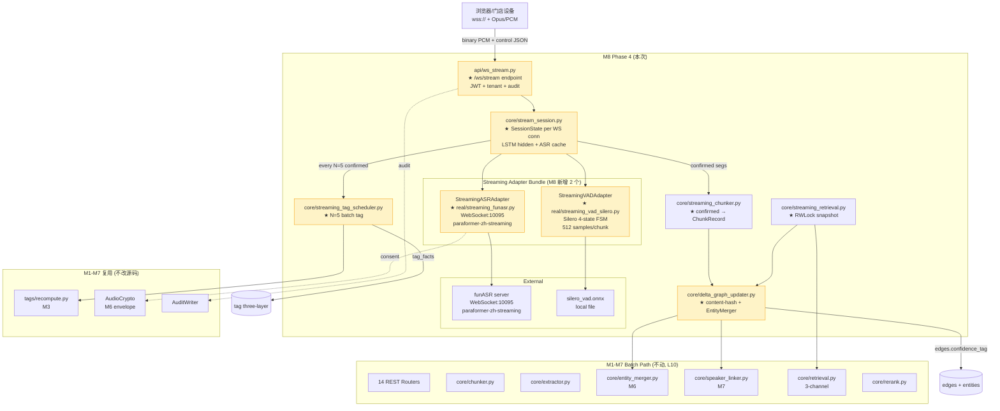
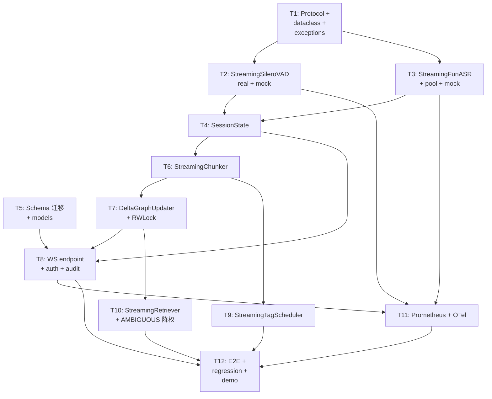

# AudioGraphy M8 架构文档 — Phase 4 流式扩展（Code-Ready）

| 字段 | 值 |
|------|-----|
| 版本 | v8.0.0-draft |
| 作者 | 高见远（架构师 / AI 代行） |
| 主理人 | 齐活林 |
| 日期 | 2026-07-22 |
| 前置 | `docs/m8-prd.md`（942 行，source of truth） |
| 基线 | commit `post-m7`（M7 shipped：CLAP + CAM++ + SpeakerLinker + 三通道检索） |
| 范围 | Code-Ready（写代码 + 测试 + mock 流式端到端；real 流式依赖 funASR WebSocket:10095，CI 跑 mock，real 跑本地） |
| 工作流 | WS-1 Streaming Adapter + Protocol + SessionState／ WS-2 WebSocket Endpoint + DeltaGraph + 流式标签／ WS-3 流式检索 + 埋点 + E2E + 回归 |

> 本文档为 `docs/m8-prd.md` 的**实施级架构补充**，定义每个 Protocol / Adapter / Service / 类的签名、字段映射、WebSocket 消息契约、SessionState 生命周期、增量图谱策略与任务拆分。冲突时以 PRD 为准；齐活林 L1-L10 locked 决策不在本文重开。本文**给出类签名 + 关键决策**，不嵌入完整实现代码（实现细节由 T1-T12 任务承担）。

---

## 目录

1. [执行摘要](#1-执行摘要)
2. [系统全景图](#2-系统全景图)
3. [协议契约设计](#3-协议契约设计)
4. [Real Streaming Adapter 设计](#4-real-streaming-adapter-设计)
5. [Mock Streaming Adapter 设计](#5-mock-streaming-adapter-设计)
6. [WebSocket Endpoint 设计](#6-websocket-endpoint-设计)
7. [SessionState 设计](#7-sessionstate-设计)
8. [流式 Chunker 设计](#8-流式-chunker-设计)
9. [DeltaGraphUpdater 设计](#9-deltagraphupdater-设计)
10. [流式标签调度器](#10-流式标签调度器)
11. [流式检索原型](#11-流式检索原型)
12. [异常体系扩展](#12-异常体系扩展)
13. [配置扩展](#13-配置扩展)
14. [数据模型 + 迁移](#14-数据模型--迁移)
15. [任务分解](#15-任务分解)
16. [依赖包清单](#16-依赖包清单)
17. [共享知识](#17-共享知识)
18. [待明确事项](#18-待明确事项)
19. [附加决策（Q1/Q2/Q3）](#19-附加决策)
20. [附录 A：WebSocket 消息协议规范](#附录-a-websocket-消息协议规范)
21. [附录 B：流式数据流时序图](#附录-b-流式数据流时序图)
22. [附录 C：增量图谱更新示例](#附录-c-增量图谱更新示例)

---

## 1. 执行摘要

M8 把 AudioGraphy 从**纯批处理**扩展为**批 + 流双模态**，在 M1-M7 REST 路径**不动**的前提下，新增 `WebSocket /ws/stream` 端点 + 流式 Silero VAD + 流式 funASR + 增量图谱更新 + 流式标签批处理。

**关键技术决策**：

- **新增 2 个 Protocol**：`StreamingVADAdapter`（async generator，512 样本/块，4 态 FSM）+ `StreamingASRAdapter`（confirmed/realtime 双态，async generator yield ASR events）。
- **新增 `api/ws_stream.py` WebSocket 端点**：与现有 14 个 REST router 共存（L1/L3）；JWT 鉴权走 query string + 首帧 `init` 双轨；上行 PCM 二进制 + 控制帧 JSON，下行 6 类事件（`session_opened` / `realtime_text` / `segment_confirmed` / `tags_updated` / `backpressure|error|vad_reset` / `session_closed`）。
- **新增 `core/stream_session.py` SessionState**：per WS connection；持有 Silero LSTM hidden state + ASR pending 队列 + confirmed 段缓存；生命周期 `create → active → drain → closed`；M8 内存 dict 存储，M9+ 可迁 Redis（hook 已留）。
- **DeltaGraphUpdater（`core/delta_graph_updater.py`）**：confirmed 段 → 流式 chunker → content-hash 去重 → EntityMerger + SpeakerLinker 复用（L5）；**不**重算 Leiden（L6）；新增边打 `confidence_tag`（EXTRACTED / INFERRED / AMBIGUOUS，L9）。
- **流式标签调度器（`core/streaming_tag_scheduler.py`）**：每 N=5 confirmed 段触发批 LLM 标签（L7），复用 M3 `tags/recompute.py`。
- **AMBIGUOUS 边降权策略**：流式检索时 confidence_tag=AMBIGUOUS 的边权重 × 0.5（Q3 决策），`min_confidence` 参数供严格模式（M8 暴露）。
- **funASR 多租户**：per-tenant 连接池（Q1 决策），单 tenant 默认池容量 8，超出排队。
- **Silero VAD reset**：seq 跳变 > 3 块（≈ 100ms）或显式 `reset` 控制消息触发（Q2 决策）；reset 后下发 `event=vad_reset` 通知前端。

**P0 工作流划分**：WS-1 = T1-T4（Protocol + Streaming Silero + Streaming funASR + SessionState + Mock）；WS-2 = T5-T8（schema 迁移 + WS endpoint + DeltaGraphUpdater + 流式标签调度器）；WS-3 = T9-T12（流式检索 + Prometheus/OTel 埋点 + E2E 集成测试 + 批处理回归套件）。13 个 P0 功能在 §15.14 任务映射表中均有对应任务。

---

## 2. 系统全景图

### 2.1 M8 在 AudioGraphy 中的位置



### 2.2 数据流总览

- **流式上行**：`Client mic → wss → WS endpoint → SessionState.push_pcm() → StreamingSileroVAD（yield VADEvent）→ StreamingFunASR（yield ASREvent realtime/confirmed）→ 下行 JSON`。
- **图谱增量**：`confirmed ASR event → StreamingChunker.pack() → DeltaGraphUpdater.update() → content-hash 去重 → EntityMerger + SpeakerLinker（复用 M6/M7）→ edges 写入（confidence_tag, streaming_origin=TRUE, source_session_id）`。
- **标签批处理**：`每 N=5 confirmed → StreamingTagScheduler.trigger() → tags/recompute.py → tag_facts append`。
- **流式检索**：`WS query frame → 流式 retrieval（基于 DeltaGraphUpdater 已更新的子图 + RWLock）→ 下行 JSON`。
- **批处理路径（L10 不变）**：`Upload → REST /recordings → Chunker → Extractor → Merger/Linker → 图谱`。

---

## 3. 协议契约设计

> 本节定义 `adapters/protocols.py` 新增的 2 个 Protocol + 对应 dataclass，沿用 M7 既有风格（`@runtime_checkable` + frozen dataclass + `Sequence` 返回）。

### 3.1 新增 dataclass

```python
# adapters/protocols.py 增量（+~120 行）

@dataclass(frozen=True, slots=True)
class VADEvent:
    """One event yielded by StreamingVADAdapter.push_chunk().

    Attributes:
        seq: Chunk sequence number (echoed from client).
        timestamp_sec: Wall-clock timestamp of the chunk arrival.
        onset_score: Silero raw onset probability ∈ [0.0, 1.0].
        state: Current FSM state — "SILENCE" / "PENDING_SPEECH" /
            "SPEECH" / "PENDING_SILENCE".
        transition: Event type — "chunk" (no boundary) /
            "segment_start" / "segment_end".
        segment: When transition == "segment_end", carries the just-closed
            SegmentRecord (start_sec, end_sec, pcm bytes ref). None otherwise.
        reset: True if the FSM was reset on this chunk (seq gap or explicit).
    """
    seq: int
    timestamp_sec: float
    onset_score: float
    state: str
    transition: str
    segment: "SegmentRecord | None" = None
    reset: bool = False


@dataclass(frozen=True, slots=True)
class ASRDeltaResult:
    """One delta yielded by StreamingASRAdapter.push_pcm().

    funASR returns two flavours of delta:
        - realtime (mode="2pass-online"): partial transcript, may be revised.
        - confirmed (mode="2pass-offline", is_final=True): sentence-final.

    Attributes:
        seq: Last PCM seq consumed by this delta.
        mode: "realtime" / "confirmed".
        text: Transcript text (incremental for realtime, full for confirmed).
        is_final: True when this finishes a confirmed sentence.
        sentence_id: funASR sentence index (for grouping realtime→confirmed).
        confidence: ASR confidence if reported by funASR (else 0.95).
    """
    seq: int
    mode: str  # "realtime" | "confirmed"
    text: str
    is_final: bool
    sentence_id: int
    confidence: float = 0.95


@dataclass(frozen=True, slots=True)
class StreamSessionId:
    """Opaque per-session identifier (UUID v4 generated client-side).

    Used for SessionState persistence/reconnect and audit trail. NOT the
    same as the DB row id (streaming_sessions.id BIGSERIAL).
    """
    value: str
```

### 3.2 StreamingVADAdapter Protocol

```python
@runtime_checkable
class StreamingVADAdapter(Protocol):
    """Streaming VAD — consumes PCM chunks, yields VAD events.

    M8 default impl: Silero VAD streaming (silero_vad.onnx), 512 samples /
    chunk (32 ms @ 16 kHz), 4-state FSM (PRD Appendix B). LSTM hidden state
    MUST be carried chunk-to-chunk inside the adapter instance.

    Lifecycle:
        - Adapter is bound to one SessionState (per WS connection).
        - ``reset_state()`` may be called between chunks if seq gap detected.
        - ``finalize()`` flushes any in-flight speech segment.

    Raises:
        StreamingVADChunkShapeError: PCM chunk not multiple of 512 samples.
        StreamingVADModelLoadError: silero_vad.onnx missing / corrupt.
    """

    async def push_chunk(
        self,
        pcm: bytes,
        *,
        seq: int,
    ) -> "VADEvent":
        """Feed one 512-sample PCM chunk, return the resulting VAD event.

        Args:
            pcm: 16-bit little-endian PCM, 16 kHz mono, length MUST be
                exactly 1024 bytes (512 samples × 2 bytes).
            seq: Client-supplied monotonic sequence number.
        """
        ...

    def reset_state(self) -> None:
        """Reset LSTM hidden state + FSM. Called on seq gap > 3 chunks
        or explicit client ``reset`` control message.
        """
        ...

    async def finalize(self) -> "tuple[SegmentRecord, ...]":
        """Flush any in-progress speech segment at connection close.

        Returns:
            Tuple of SegmentRecord (may be empty if no pending speech).
        """
        ...

    async def aclose(self) -> None: ...
```

### 3.3 StreamingASRAdapter Protocol

```python
@runtime_checkable
class StreamingASRAdapter(Protocol):
    """Streaming ASR — consumes PCM, yields realtime/confirmed deltas.

    M8 default impl: funASR paraformer-zh-streaming over WebSocket:10095
    (PRD Appendix A). Adapter owns ONE WebSocket per session.

    Behaviour:
        - ``connect()`` opens funASR WS, sends init JSON (mode=2pass,
          chunk_size=[5,10,5], hotwords from tenant entity_aliases).
        - ``push_pcm()`` sends binary, awaits next JSON delta, maps to
          ASRDeltaResult (realtime or confirmed).
        - ``finalize()`` sends {"is_speaking": false}, drains pending
          deltas until final confirmed arrives.
        - Tenant isolation: see §19 Q1 decision (per-tenant pool).
    """

    async def connect(
        self,
        *,
        session_id: str,
        tenant_id: str,
        hotwords: "Sequence[str]" = (),
    ) -> None:
        """Open funASR WebSocket and send init handshake."""
        ...

    async def push_pcm(
        self,
        pcm: bytes,
        *,
        seq: int,
    ) -> "ASRDeltaResult":
        """Send binary PCM chunk, await next delta from funASR."""
        ...

    async def finalize(self) -> "tuple[ASRDeltaResult, ...]":
        """Send is_speaking=false, drain remaining deltas (typically 0-2)."""
        ...

    async def aclose(self) -> None: ...
```

### 3.4 EdgeConfidence 沿用（M7 既有，复用不重定义）

`adapters/protocols.py:271` 的 `EdgeConfidence = Literal["EXTRACTED", "INFERRED", "AMBIGUOUS"]` 已在 M7 落地。M8 不重定义，仅在 `edges` 表新增 `confidence_tag` 列（§14）并写入流式产生的边。

---

## 4. Real Streaming Adapter 设计

### 4.1 `real/streaming_vad_silero.py` — StreamingSileroVADAdapter（~280 LOC）

#### 4.1.1 类签名与状态机

```python
class StreamingSileroVADAdapter:
    """Real streaming VAD backed by silero_vad.onnx (local file).

    Lifecycle (照批处理 vad_silero.py 模式):
        - ONNX model loaded lazily on first push_chunk().
        - LSTM hidden state carried in self._state (SileroHiddenState).
        - Caller MUST invoke aclose() at WS close (frees ONNX session).

    Args:
        model_path: Path to silero_vad.onnx (default /models/silero_vad.onnx).
        sample_rate: Always 16000 (Silero contract).
        chunk_samples: Always 512 (L3 locked, 32ms @ 16kHz).
        onset_threshold: 0.5 (L3 default, settings override).
        offset_threshold: 0.35 (L3 default).
        min_speech_sec: 0.25 (L3 default).
        min_silence_sec: 0.10 (L3 default).
    """

    def __init__(
        self,
        *,
        model_path: str = "/models/silero_vad.onnx",
        sample_rate: int = 16000,
        chunk_samples: int = 512,
        onset_threshold: float = 0.5,
        offset_threshold: float = 0.35,
        min_speech_sec: float = 0.25,
        min_silence_sec: float = 0.10,
    ) -> None: ...

    async def push_chunk(self, pcm: bytes, *, seq: int) -> VADEvent:
        """Decode int16 → run ONNX session → step FSM → emit event."""
        # samples = np.frombuffer(pcm, dtype=np.int16)
        # if len(samples) != 512: raise StreamingVADChunkShapeError(...)
        # onset, h_new, c_new = self._sess.run([samples, self._state])
        # self._state = SileroHiddenState(h_new, c_new)
        # transition = self._fsm.step(onset, current_ts)
        # if transition == "segment_end": return VADEvent(..., segment=...)
        # else: return VADEvent(..., segment=None)

    def reset_state(self) -> None:
        """Drop LSTM hidden state + reset FSM. Q2 决策触发条件."""
        # self._state = _initial_hidden_state()
        # self._fsm = VADFSM(thresholds...)

    async def finalize(self) -> tuple[SegmentRecord, ...]:
        """If FSM in SPEECH/PENDING_SILENCE: close segment."""
        # if self._fsm.state in {"SPEECH", "PENDING_SILENCE"}:
        #     return (self._close_segment(self._clock_now()),)
        # return ()

    async def aclose(self) -> None: ...

    # Protocol satisfaction check (照 vad_silero.py:199 模式)
_STREAMING_VAD_PROTOCOL_CHECK: StreamingVADAdapter = StreamingSileroVADAdapter()
```

#### 4.1.2 关键约束

| 约束 | 来源 |
|------|------|
| 采样率 16 kHz mono | Silero 强制（与批处理一致） |
| 单块 512 samples（1024 bytes） | L3 锁定（不可改） |
| LSTM hidden state 跨块 | PRD Appendix B + R3 缓解 |
| 4 态 FSM 状态转移 | PRD Appendix B 表（silence / pendingSpeech / speech / pendingSilence） |
| onset 0.5 / offset 0.35 / min_speech 0.25s / min_silence 0.10s | L3 默认 |
| CPU 推理 ≤ 20ms/块 | §5.1 性能预算（15ms P50 + 5ms buffer） |
| silero_vad.onnx 加载一次/进程 | 模型 ~5MB，懒加载 |
| reset_state 暴露给 SessionState | Q2 决策（§19） |

#### 4.1.3 FSM 状态转移表（沿用 PRD Appendix B）

| 当前态 | 输入 | 下一态 | 副作用 |
|---|---|---|---|
| `SILENCE` | onset ≥ 0.5 | `PENDING_SPEECH` | 记录 `pending_start` |
| `SILENCE` | onset < 0.5 | `SILENCE` | — |
| `PENDING_SPEECH` | 时间累积 ≥ 0.25s | `SPEECH` | emit `segment_start` |
| `PENDING_SPEECH` | onset < 0.5 | `SILENCE` | 清除 `pending_start` |
| `SPEECH` | onset ≥ 0.5 | `SPEECH` | — |
| `SPEECH` | onset < 0.35 | `PENDING_SILENCE` | 记录 `pending_silence_start` |
| `PENDING_SILENCE` | 时间累积 ≥ 0.10s | `SILENCE` | emit `segment_end` + 关闭 SegmentRecord |
| `PENDING_SILENCE` | onset ≥ 0.5 | `SPEECH` | 清除 `pending_silence_start` |

### 4.2 `real/streaming_funasr.py` — StreamingFunASRAdapter（~320 LOC）

#### 4.2.1 类签名

```python
class StreamingFunASRAdapter:
    """Real streaming ASR backed by funASR WebSocket:10095.

    Lifecycle:
        - connect() opens WS, sends init JSON, awaits "ok" handshake.
        - push_pcm() sends binary + awaits next JSON delta.
        - finalize() sends {"is_speaking": false}, drains 0-2 trailing deltas.
        - aclose() closes WS (idempotent).

    Connection pool:
        - Per-tenant pool of size N (Q1 decision, default 8).
        - On pool exhaustion, push_pcm() awaits asyncio.Semaphore.

    Args:
        ws_url: funASR server URL, e.g. "ws://funasr:10095".
        model: paraformer-zh-streaming (L2 locked).
        chunk_size: [5, 10, 5] (L2 locked — 600ms lookahead).
        chunk_interval: 10 (funASR default).
        connect_timeout_sec: 5.0.
        push_timeout_sec: 30.0 (funASR may hold for chunk_interval).
        tenant_id: Tenant scope (Q1 — pool key).
    """

    def __init__(
        self,
        *,
        ws_url: str,
        model: str = "paraformer-zh-streaming",
        chunk_size: tuple[int, int, int] = (5, 10, 5),
        chunk_interval: int = 10,
        connect_timeout_sec: float = 5.0,
        push_timeout_sec: float = 30.0,
        tenant_id: str = "default",
    ) -> None: ...

    async def connect(
        self, *,
        session_id: str,
        tenant_id: str,
        hotwords: Sequence[str] = (),
    ) -> None:
        """Open WS → send init JSON (mode=2pass, chunk_size, hotwords)."""
        # hotwords from entity_aliases WHERE tenant_id=X (build at session open)

    async def push_pcm(self, pcm: bytes, *, seq: int) -> ASRDeltaResult:
        """Send binary PCM, await next JSON delta, map to ASRDeltaResult."""
        # await self._ws.send(pcm)
        # raw = await self._ws.recv(timeout=push_timeout_sec)
        # payload = json.loads(raw)
        # mode = "realtime" if payload["mode"] == "2pass-online" else "confirmed"
        # return ASRDeltaResult(seq=seq, mode=mode, text=payload["text"],
        #                       is_final=payload.get("is_final", False),
        #                       sentence_id=payload.get("sentence_id", 0))

    async def finalize(self) -> tuple[ASRDeltaResult, ...]:
        """Send is_speaking=false; drain until is_final confirmed."""
        # await self._ws.send(json.dumps({"is_speaking": False}))
        # collect until is_final True OR 5s timeout

    async def aclose(self) -> None: ...
```

#### 4.2.2 异常映射（沿用 funasr.py:172-209 模式）

| funASR WebSocket 错误 | 异常 | 处理 |
|---|---|---|
| WS handshake 400 / 422 | `StreamingASRRequestError` | 关闭 WS，前端提示重连 |
| WS handshake 401 / 403 | `StreamingASRAuthError` | 同上 |
| WS 1011 internal error | `StreamingASRServerError` | 重试 3 次后降级批处理 |
| 连接超时（5s） | `StreamingASRConnectTimeout` | 切换备用 funASR 副本（R4 缓解） |
| 推送超时（30s 无响应） | `StreamingASRPushTimeout` | 关闭 WS，标记 session `error` |
| 非法 JSON / 缺字段 | `StreamingASRProtocolError` | log warning + skip（继续下一帧） |

### 4.3 FunASR 连接池（Q1 决策实施）

```python
# adapters/real/streaming_funasr_pool.py (~80 LOC)

class FunASRConnectionPool:
    """Per-tenant funASR WebSocket connection pool (Q1).

    Decision: per-tenant isolation over single-conn multiplexing.
    Rationale:
        - 故障爆炸半径限定在单 tenant（funASR 崩溃不影响其他 tenant）。
        - 资源开销可控（每连接 ~5MB 内存 + 1 GPU thread）。
        - funASR 单实例建议并发 ≤ 20，pool size 8 留出 buffer。
        - 多租户场景下，整体并发 = tenants × pool_size，超出时排队。
    """

    def __init__(
        self,
        *,
        ws_url: str,
        pool_size_per_tenant: int = 8,
        max_wait_sec: float = 30.0,
    ) -> None:
        self._ws_url = ws_url
        self._pool_size = pool_size_per_tenant
        self._pools: dict[str, list[StreamingFunASRAdapter]] = {}
        self._locks: dict[str, asyncio.Lock] = {}
        self._semaphores: dict[str, asyncio.Semaphore] = {}

    async def acquire(
        self,
        tenant_id: str,
        session_id: str,
        hotwords: Sequence[str],
    ) -> StreamingFunASRAdapter:
        """Acquire a connected adapter from the tenant's pool."""
        # Lazy-init pool for tenant, acquire via semaphore, connect if fresh.

    async def release(self, adapter: StreamingFunASRAdapter) -> None:
        """Return adapter to its pool (or close if pool full / errored)."""
```

### 4.4 Hotwords 注入（复用 M6 entity_aliases）

每次 session 建立时，`StreamingFunASRAdapter.connect()` 接受 `hotwords` 参数（来自 M6 `entity_aliases.canonical_text`）。在 funASR init JSON 中以 `"{\"长安CS75\":1,\"退订意向\":1}"` 格式注入。这是**只读**复用，不修改 `EntityAlias` 表。

---

## 5. Mock Streaming Adapter 设计

Mock adapter 沿用 `mock_asr.py` / `mock_vad.py` 模式：deterministic hash → 事件，模拟 latency，CI 用。

### 5.1 `mock/streaming_vad.py`（~140 LOC）

```python
class MockStreamingVADAdapter:
    """Mock streaming VAD — deterministic VADEvent from sha512(pcm).

    Used in CI (no ONNX dependency, no GPU). Deterministic:
        - Same PCM input → same onset_score + same state transitions.
        - Pre-canned "speech" pattern: every 50th chunk emits segment_start,
          every 200th emits segment_end (simulates ~6.4s speech segments).
    """

    def __init__(
        self,
        *,
        chunk_samples: int = 512,
        latency_ms: float = 5.0,
        flaky: bool = False,
    ) -> None: ...

    async def push_chunk(self, pcm: bytes, *, seq: int) -> VADEvent: ...
    def reset_state(self) -> None: ...
    async def finalize(self) -> tuple[SegmentRecord, ...]: ...
    async def aclose(self) -> None: ...
```

### 5.2 `mock/streaming_asr.py`（~160 LOC）

```python
class MockStreamingASRAdapter:
    """Mock streaming ASR — deterministic ASRDeltaResult from sha512(pcm).

    Pattern:
        - Every 4th push_pcm() yields a realtime delta (mock partial text
          from a fixed corpus, e.g. "我想", "我想退", "我想退订").
        - Every 12th push_pcm() yields a confirmed delta ("我想退订现在的套餐.").
    This pattern makes the full VAD → ASR → confirmed segment pipeline
    testable in mock mode with predictable event counts.
    """

    def __init__(
        self,
        *,
        connect_latency_ms: float = 20.0,
        push_latency_ms: float = 50.0,
        realtime_interval: int = 4,
        confirmed_interval: int = 12,
    ) -> None: ...

    async def connect(
        self, *, session_id: str, tenant_id: str, hotwords: Sequence[str] = (),
    ) -> None: ...
    async def push_pcm(self, pcm: bytes, *, seq: int) -> ASRDeltaResult: ...
    async def finalize(self) -> tuple[ASRDeltaResult, ...]: ...
    async def aclose(self) -> None: ...
```

**设计要点**：Mock adapters 保证 CI 下完整可测——CI 跑一段 60s 假音频（192000 samples × 16-bit = ~384KB PCM），断言产生 ≥ 4 confirmed 段、≥ 30 realtime 增量、≥ 1 segment_confirmed 入图事件。

---

## 6. WebSocket Endpoint 设计

### 6.1 `api/ws_stream.py` — `/ws/stream` 端点（~350 LOC）

#### 6.1.1 路由注册

```python
# api/ws_stream.py
from fastapi import APIRouter, WebSocket, WebSocketDisconnect, Depends, Query

router = APIRouter(tags=["streaming"])


@router.websocket("/ws/stream")
async def ws_stream(
    ws: WebSocket,
    token: str = Query(..., description="JWT (TTL 5min, refresh via REST)"),
    # tenant_id derived from token (AuthMiddleware for WS handles this)
):
    """Main streaming endpoint — PCM in, 6-type events out.

    Protocol (Appendix A):
        - First client frame MUST be JSON {"type": "init", ...}.
        - Subsequent binary frames: [4-byte seq BE] + [PCM payload].
        - Control frames: {"type": "finalize"} / {"type": "reset"}.
        - Server emits: session_opened / realtime_text / segment_confirmed
            / tags_updated / backpressure|error|vad_reset / session_closed.

    Auth: JWT in query string (TTL 5min, refresh via REST /auth/refresh).
    Tenant: derived from JWT claims.
    Consent: required in init frame (PRD §5.3 R10 mitigation).
    """
    # 1. Auth: verify JWT, extract user_id + tenant_id.
    # 2. Init frame: parse, validate consent_token, create SessionState.
    # 3. Loop: recv → route by frame type → emit events.
    # 4. Finalize: flush, write streaming_sessions row, emit session_closed.
```

`main.py` 增量（注册 WS router，**不**加 `/api/v1` 前缀，PRD §3.1 P0-4 要求路径 `/ws/stream`）：

```python
# main.py 增量
from audio_graphy.api.ws_stream import router as ws_stream_router
# ...
app.include_router(ws_stream_router)  # 注意：不加 API_PREFIX
```

#### 6.1.2 鉴权（query string JWT）

JWT 通过 query string 传递（`?token=...`），在 WS 接受前校验。理由：浏览器 WebSocket API 不支持自定义 header；TTL 5 分钟，刷新走 REST `/api/v1/auth/refresh`。**不**支持 Cookie 鉴权（避免 CSRF）。

```python
# auth/ws_auth.py (~50 LOC)
async def verify_ws_token(
    token: str,
    jwt_manager: JWTManager,
) -> AuthUser:
    """Verify JWT from query string. Raise WebSocketException 4001 if invalid."""
    try:
        claims = jwt_manager.verify(token)
        return AuthUser(user_id=claims["sub"], tenant_id=claims["tenant_id"], ...)
    except Exception:
        raise WebSocketException(code=4001, reason="auth failed")
```

#### 6.1.3 背压（PRD R1 缓解）

```python
# api/ws_stream.py 背压逻辑
MAX_RECV_QUEUE = 200         # 强制关闭阈值
BACKPRESSURE_WARN = 100      # 警告阈值

async def _recv_loop(self, ws: WebSocket, session: StreamSession) -> None:
    recv_queue = session.recv_queue
    while True:
        if recv_queue.qsize() > BACKPRESSURE_WARN:
            await ws.send_json({
                "type": "backpressure",
                "session_id": session.session_id.value,
                "queue_depth": recv_queue.qsize(),
                "message": "Queue depth exceeded threshold; please slow down",
            })
        if recv_queue.qsize() > MAX_RECV_QUEUE:
            await ws.close(code=1011, reason="backpressure overflow")
            await session.mark_end(reason="backpressure")
            return
        msg = await ws.receive()
        await recv_queue.put(msg)
```

#### 6.1.4 心跳 / 重连

- **心跳**：服务端每 `ws_heartbeat_interval`（默认 30s）发 `{"type":"ping"}`；客户端 5s 内回 `{"type":"pong"}`；超时则关闭连接（status code 1011）。
- **重连**（P1-5）：客户端断线后 5s 内重连，携带原 `session_id`；服务端从 SessionState store（M8 内存 dict，M9+ Redis）恢复；超过 `streaming_session_timeout`（300s）则清理。

#### 6.1.5 Tenant 隔离

- JWT claims 中携带 `tenant_id`；SessionState 在创建时绑定。
- SessionState 内部所有 adapter 调用都传 `tenant_id`（包括 funASR 连接池获取）。
- 图谱写入通过 `DeltaGraphUpdater` 强制带 tenant_id（复用 M6 EntityMerger + M7 SpeakerLinker 的 tenant scope）。

---

## 7. SessionState 设计

### 7.1 `core/stream_session.py` — StreamSession（~400 LOC）

#### 7.1.1 类签名与字段

```python
# core/stream_session.py
from enum import Enum

class SessionStatus(str, Enum):
    CREATED = "created"
    ACTIVE = "active"
    DRAINING = "draining"   # final flush in progress
    CLOSED = "closed"


@dataclass
class StreamSession:
    """Per-WebSocket-connection session state (L8).

    Bound 1:1 to a WS connection. Holds streaming adapters + buffers +
    audit hooks. NOT thread-safe — single asyncio task per session.

    Storage:
        - M8: in-memory dict keyed by session_id.value (app.state.stream_sessions).
        - M9+: optional Redis (to_redis/from_redis methods are ready).
    """

    session_id: StreamSessionId
    tenant_id: str
    recording_id: int
    user_id: int | None
    consent_token_hash: str

    # --- Adapters (created on first PCM) ---
    vad_adapter: StreamingVADAdapter
    asr_adapter: StreamingASRAdapter

    # --- Buffers ---
    recv_queue: asyncio.Queue  # incoming PCM + control frames
    pending_speech_pcm: bytearray  # accumulating speech samples
    pending_realtime: list[ASRDeltaResult]  # not yet superseded by confirmed
    confirmed_segments: list[SegmentRecord]  # closed, awaiting chunker

    # --- Stats ---
    started_at: datetime
    last_chunk_at: datetime | None = None
    seg_confirmed_count: int = 0
    seg_realtime_count: int = 0
    bytes_in: int = 0
    error_count: int = 0
    end_reason: str | None = None

    # --- FSM ---
    status: SessionStatus = SessionStatus.CREATED
    last_seq: int = -1  # for seq-gap detection

    # --- Background services ---
    chunker: "StreamingChunker"
    delta_updater: "DeltaGraphUpdater"
    tag_scheduler: "StreamingTagScheduler"
```

#### 7.1.2 生命周期

```
[CREATED]
    │ ws_stream endpoint 接受 WS + init frame 解析完成
    ▼
[ACTIVE]
    │ recv loop + emit loop 并发跑：
    │   - recv → push_pcm → VAD/ASR event → 下行 JSON
    │   - confirmed segment → StreamingChunker.pack → DeltaGraphUpdater
    │   - 每 N=5 confirmed → StreamingTagScheduler.trigger
    │
    │ 触发结束的事件之一：
    │   (a) client 发 finalize 控制帧
    │   (b) client 断开（WebSocketDisconnect）
    │   (c) backpressure overflow
    │   (d) streaming_session_timeout (300s 无 chunk)
    ▼
[DRAINING]
    │ VAD.finalize() 关闭 in-progress segment
    │ ASR.finalize() 拉 trailing confirmed
    │ StreamingChunker.flush() 把残余 chunk 送 DeltaGraphUpdater
    │ StreamingTagScheduler.flush() 触发最后一次打标（若累积 ≥ 1 段）
    ▼
[CLOSED]
    │ streaming_sessions 表 UPDATE ended_at + end_reason + stats
    │ audit_log: action="streaming_session_close"
    │ 释放 funASR 连接（归还 pool）
    │ 关闭 Silero ONNX session
    │ SessionState 从 app.state.stream_sessions 移除（或保留 60s 供重连）
```

#### 7.1.3 Public API

```python
async def on_pcm_chunk(self, pcm: bytes, seq: int) -> AsyncIterator[dict]:
    """Process one PCM chunk, yield 0..N server-to-client events.

    Steps:
        1. seq-gap detection → maybe vad_adapter.reset_state() (Q2)
        2. await vad_adapter.push_chunk() → VADEvent
        3. if VADEvent.transition == "segment_end":
              pending_speech_pcm complete → asr_adapter continues
        4. await asr_adapter.push_pcm() → ASRDeltaResult
        5. yield server events (realtime_text / segment_confirmed)
        6. if confirmed: confirmed_segments.append; trigger chunker/updater
    """

async def on_finalize(self) -> AsyncIterator[dict]:
    """Drain pending state, emit final events, mark status=CLOSED."""

async def on_control_reset(self) -> AsyncIterator[dict]:
    """Client-initiated VAD reset. Force reset_state + emit vad_reset event."""

def to_redis(self) -> dict: ...  # M9+ hook, M8 raises NotImplementedError
@classmethod
def from_redis(cls, data: dict) -> "StreamSession": ...  # M9+ hook
```

#### 7.1.4 内存上限（PRD §5.3 PIPL）

- `pending_speech_pcm` 上限 60s × 16kB/s = 960KB；超出强制 flush 为临时文件或丢弃（PIPL 最小化）。
- `pending_realtime` 最多保留最近 5 条（前端展示窗口）。
- `confirmed_segments` 累积 ≥ 30 条时强制 flush 到 chunker（防止内存堆积）。
- 单 SessionState 总内存预算 ≤ 5MB（不含 Silero ONNX 模型共享）。

---

## 8. 流式 Chunker 设计

### 8.1 `core/streaming_chunker.py` — StreamingChunker（~250 LOC）

#### 8.1.1 设计

```python
class StreamingChunker:
    """Confirmed SegmentRecord → ChunkRecord (token budget packing).

    Reuses batch chunker's packing algorithm (chunker.py:303) but
    accepts one segment at a time. Maintains in-flight buffer until
    token_budget reached, then emits a ChunkRecord.

    Args:
        token_budget: Same as batch (default 1200, DESIGN.md §3.2).
        overlap_tokens: 0 for M8 (streaming reserved; batch also 0).
        encoding_name: cl100k_base (same as batch).
    """

    def __init__(
        self,
        *,
        token_budget: int = 1200,
        encoding_name: str = "cl100k_base",
    ) -> None:
        self._token_budget = token_budget
        self._enc = tiktoken.get_encoding(encoding_name)
        self._buffer_segments: list[SegmentRecord] = []
        self._buffer_tokens = 0

    def push_segment(self, seg: SegmentRecord) -> ChunkRecord | None:
        """Push one confirmed segment. Returns ChunkRecord if buffer
        reached token_budget, else None (still buffering).
        """
        seg_tokens = max(1, len(self._enc.encode(seg.transcript)))
        if self._buffer_tokens + seg_tokens > self._token_budget and self._buffer_segments:
            # Flush
            chunk = self._pack(self._buffer_segments)
            self._buffer_segments = [seg]
            self._buffer_tokens = seg_tokens
            return chunk
        self._buffer_segments.append(seg)
        self._buffer_tokens += seg_tokens
        return None

    def flush(self) -> ChunkRecord | None:
        """Force-flush remaining buffer (called on session close)."""
        if not self._buffer_segments:
            return None
        chunk = self._pack(self._buffer_segments)
        self._buffer_segments = []
        self._buffer_tokens = 0
        return chunk

    @staticmethod
    def _pack(segments: list[SegmentRecord]) -> ChunkRecord:
        text = "\n".join(s.transcript for s in segments)
        return ChunkRecord(
            segment_ids=[s.idx for s in segments],
            text=text,
            token_n=sum(max(1, len(tiktoken.get_encoding("cl100k_base").encode(s.transcript))) for s in segments),
            content_hash=hashlib.sha256(text.encode("utf-8")).hexdigest(),
        )
```

#### 8.1.2 与批处理 Chunker 的关系

- **不**修改 `core/chunker.py`（L10）。
- 流式版本是独立类，但**复用** `ChunkRecord` dataclass（`chunker.py:67`）和 content_hash 算法（SHA-256(text)）。
- 流式产出的 `ChunkRecord` 通过 `DeltaGraphUpdater` 落库；批处理仍走 `_persist_to_mysql` 路径。

---

## 9. DeltaGraphUpdater 设计

### 9.1 `core/delta_graph_updater.py` — DeltaGraphUpdater（~350 LOC）

#### 9.1.1 设计目标

| 目标 | 实现 |
|------|------|
| Delta detection | content_hash 对比 `chunks` 表（L8） |
| Entity resolution | 复用 `EntityMerger.merge()`（M6，不改源码） |
| Speaker link | 复用 `SpeakerLinker.run()`（M7，不改源码） |
| Edge confidence | EXTRACTED（LLM 直接）/ INFERRED（Merger 合并）/ AMBIGUOUS（rapidfuzz fuzzy hit） |
| 不重算 Leiden | L6 锁定；admin API `POST /api/v1/graph/rebuild` 触发全量 |
| RWLock 保护 | §11 流式检索；增量写不阻塞批查询 |

#### 9.1.2 类签名

```python
class DeltaGraphUpdater:
    """Incremental graph update — confirmed segments → entities/edges.

    Args:
        bundle: AdapterBundle (uses strong_llm for extraction).
        session_factory: async session maker.
        merger_factory: Callable[[AsyncSession, str], EntityMerger] —
            per-tenant merger (M6 pattern).
        linker_factory: Callable[..., SpeakerLinker] — per-tenant linker.
        file_index: Optional persistent LLM cache (M5 Layer 2).
        graph_store_factory: Callable[[str], NetworkXGraphStore] —
            per-tenant in-memory graph.
        rwlock: StreamingRWLock (M8 P0-2 lightweight version).
        session_id: Source session_id for edges.streaming_origin provenance.
    """

    def __init__(
        self,
        bundle: AdapterBundle,
        session_factory: async_sessionmaker[AsyncSession],
        *,
        merger_factory: Callable[[async_sessionmaker[AsyncSession], str], EntityMerger],
        linker_factory: Callable[..., SpeakerLinker],
        file_index: FileIndex | None,
        graph_store_factory: Callable[[str], NetworkXGraphStore],
        rwlock: "StreamingRWLock",
        session_id: str,
    ) -> None: ...

    async def update(
        self,
        chunk: ChunkRecord,
        recording_id: int,
        tenant_id: str,
    ) -> "DeltaUpdateReport":
        """Process one ChunkRecord through the delta pipeline.

        Steps:
            1. content_hash lookup in chunks table (L8 delta detection).
               If hit → log streaming_delta_skipped_total, return early.
            2. Persist chunk (reuse M3 Chunker._persist_to_mysql logic).
            3. Extract entities via EntityExtractor.extract_from_chunk().
            4. EntityMerger.merge() → normalise names (M6).
            5. Insert entities + edges with streaming_origin=TRUE,
               source_session_id=self._session_id.
            6. Edge confidence tagging:
                - LLM-extracted → EXTRACTED
                - Merger fuzzy hit → AMBIGUOUS
                - Merger identity hit → INFERRED (cross-segment dedup)
            7. SpeakerLinker.run() for any SPEAKER candidates (M7).
            8. Update in-memory NetworkX graph_store under rwlock.write.
            9. Return DeltaUpdateReport.
        """
```

#### 9.1.3 DeltaUpdateReport

```python
@dataclass(frozen=True, slots=True)
class DeltaUpdateReport:
    """Output of one DeltaGraphUpdater.update() call."""
    chunk_id: int
    skipped_by_hash: bool
    new_entities: int
    merged_entities: int
    new_edges: int
    ambiguous_edges: int
    speaker_links: int
    extraction_ms: float
    merge_ms: float
    persist_ms: float
```

#### 9.1.4 Edge Confidence 标签策略

```python
# 在 DeltaGraphUpdater._tag_edges() 中：
def _tag_edge_confidence(
    self,
    relation: ExtractedRelation,
    merge_results: list[tuple[str, float]],  # EntityMerger 输出
) -> EdgeConfidence:
    """Decide edge confidence after entity merge."""
    # 1. If relation came from LLM first-round extraction → EXTRACTED.
    if relation.confidence == "EXTRACTED":
        # Check if either endpoint was merged via fuzzy.
        for _name, score in merge_results:
            if 0.0 < score < 1.0:  # fuzzy hit
                return "AMBIGUOUS"
        return "EXTRACTED"
    # 2. If relation came from Gleaning → INFERRED.
    if relation.confidence == "INFERRED":
        return "INFERRED"
    # 3. Fallback.
    return "AMBIGUOUS"
```

#### 9.1.5 RWLock 保护（M8 P0 轻量版）

```python
# core/streaming_rwlock.py (~80 LOC)
class StreamingRWLock:
    """Asyncio RWLock — favours readers, accepts concurrent reads.

    M8 lightweight version (PRD P2-1 RWLock snapshot 的简化形态)：
        - Multiple readers can hold the lock simultaneously.
        - Single writer exclusive.
        - No snapshot versioning (P2-1) — readers may see partial writes.
        - Sufficient for M8 because流式检索容忍短暂不一致。
    """

    def __init__(self) -> None:
        self._readers: int = 0
        self._writer_active: bool = False
        self._cond = asyncio.Condition()

    async def acquire_read(self) -> None: ...
    async def release_read(self) -> None: ...
    async def acquire_write(self) -> None: ...
    async def release_write(self) -> None: ...

    @asynccontextmanager
    async def read_lock(self): ...
    @asynccontextmanager
    async def write_lock(self): ...
```

---

## 10. 流式标签调度器

### 10.1 `core/streaming_tag_scheduler.py` — StreamingTagScheduler（~200 LOC）

#### 10.1.1 设计

```python
class StreamingTagScheduler:
    """Trigger batch LLM tag recompute every N confirmed segments (L7).

    Reuses M3 tags/recompute.py (Q-后续: 复用，不改源码).

    Args:
        recompute_svc: tags.recompute.TagRecomputeService instance.
        interval_n: Trigger threshold (L7 default 5).
        debounce_ms: Minimum spacing between triggers (avoid bursts
            when multiple segments arrive simultaneously).
        tenant_id: Tenant scope.
        recording_id: Recording being streamed.
    """

    def __init__(
        self,
        recompute_svc: "TagRecomputeService",
        *,
        interval_n: int = 5,
        debounce_ms: float = 500.0,
        tenant_id: str = "default",
        recording_id: int = 0,
    ) -> None:
        self._svc = recompute_svc
        self._interval = interval_n
        self._debounce_ms = debounce_ms
        self._tenant = tenant_id
        self._recording = recording_id
        self._since_last_trigger: int = 0
        self._last_trigger_at: float = 0.0
        self._pending_segment_ids: list[int] = []

    async def on_segment_confirmed(self, segment_id: int) -> "TagBatchResult | None":
        """Record one confirmed segment, trigger batch if threshold reached.

        Returns:
            TagBatchResult if triggered, None otherwise.
        """
        self._since_last_trigger += 1
        self._pending_segment_ids.append(segment_id)
        if self._since_last_trigger < self._interval:
            return None
        # Debounce — skip if triggered too recently.
        now = time.monotonic()
        if (now - self._last_trigger_at) * 1000 < self._debounce_ms:
            return None
        return await self._trigger()

    async def flush(self) -> "TagBatchResult | None":
        """Force trigger for remaining pending segments (on session close)."""
        if not self._pending_segment_ids:
            return None
        return await self._trigger()

    async def _trigger(self) -> "TagBatchResult":
        """Invoke M3 recompute over pending segments."""
        seg_ids = list(self._pending_segment_ids)
        result = await self._svc.recompute_tags_for_segments(
            tenant_id=self._tenant,
            recording_id=self._recording,
            segment_ids=seg_ids,
        )
        self._pending_segment_ids = []
        self._since_last_trigger = 0
        self._last_trigger_at = time.monotonic()
        return result
```

#### 10.1.2 M3 `tags/recompute.py` 复用约定

- **不改**M3 源码。
- `TagRecomputeService` 必须新增 `recompute_tags_for_segments(tenant_id, recording_id, segment_ids)` 入口（M8 在 `tags/recompute.py` 末尾追加 ~30 LOC，不破坏既有 `recompute_for_recording()` 路径）。
- 触发的标签写入 `tag_facts`（M6 三层模型），与批处理路径**同一张表**。

---

## 11. 流式检索原型

### 11.1 `core/streaming_retrieval.py` — StreamingRetriever（~220 LOC）

```python
class StreamingRetriever:
    """Lightweight retrieval over the streaming-updated subgraph.

    Unlike the full ThreeChannelRetriever (M7), this operates on the
    DeltaGraphUpdater's just-updated subgraph — does NOT do naive /
    audio channels (those need pre-built vector stores).

    Args:
        graph_store_factory: Per-tenant NetworkX graph.
        rwlock: Same StreamingRWLock used by DeltaGraphUpdater.
        bundle: For query embedding + weak_llm keyword extraction.
    """

    def __init__(
        self,
        graph_store_factory: Callable[[str], NetworkXGraphStore],
        rwlock: StreamingRWLock,
        bundle: AdapterBundle,
    ) -> None: ...

    async def retrieve(
        self,
        query: str,
        *,
        tenant_id: str = "default",
        session_id: str | None = None,
        top_k: int = 5,
        min_confidence: EdgeConfidence | None = None,  # Q3 decision
    ) -> list["StreamingCandidate"]:
        """Graph-channel-only retrieval.

        Steps:
            1. weak_llm extract keywords.
            2. graph_store.get_nodes_by_keyword() under rwlock.read.
            3. 1-hop neighbors, edge weights adjusted by confidence_tag:
                - EXTRACTED: weight × 1.0
                - INFERRED:  weight × 0.8
                - AMBIGUOUS: weight × 0.5  ← Q3 决策
            4. If min_confidence set, filter out edges below threshold.
            5. Reverse-lookup chunks.
        """
```

### 11.2 Q3 决策实施 — AMBIGUOUS 边降权

| `confidence_tag` | 默认权重乘数 | 严格模式（`min_confidence="EXTRACTED"`） |
|---|---|---|
| `EXTRACTED` | 1.0 | 包含 |
| `INFERRED` | 0.8 | 过滤 |
| `AMBIGUOUS` | **0.5** | 过滤 |

**理由**：
- 降权（× 0.5）而非过滤：保留召回，让下游 rerank / LLM judge 决定。
- 严格模式 `min_confidence=EXTRACTED`：用于客户投诉、合规审计等高准确率场景。
- M8 暴露该参数（query frame 中携带）；M9+ 加 tenant 默认配置。

### 11.3 三通道权重沿用 M7

流式检索**不**改变 M7 三通道权重（text 0.5 / graph 0.3 / audio 0.2）。流式检索只跑 graph 通道（其他通道依赖预计算向量，M8 不在流式路径补建）。

---

## 12. 异常体系扩展

新增 6 个异常类到 `adapters/exceptions.py`（沿用 `VADRequestError` / `VADServerError` 风格，**不发明新基类**）：

```python
# adapters/exceptions.py 增量（+~60 行）

class StreamingVADAdapterError(AdapterError): ...
class StreamingVADChunkShapeError(StreamingVADAdapterError, RequestErrorMixin):
    """PCM chunk not exactly 1024 bytes (512 samples × 2)."""
class StreamingVADModelLoadError(StreamingVADAdapterError, ServerErrorMixin):
    """silero_vad.onnx missing or corrupt."""


class StreamingASRAdapterError(AdapterError): ...
class StreamingASRRequestError(StreamingASRAdapterError, RequestErrorMixin): ...
class StreamingASRAuthError(StreamingASRAdapterError, RequestErrorMixin): ...
class StreamingASRServerError(StreamingASRAdapterError, ServerErrorMixin): ...
class StreamingASRConnectTimeout(StreamingASRAdapterError, TimeoutErrorMixin): ...
class StreamingASRPushTimeout(StreamingASRAdapterError, TimeoutErrorMixin): ...
class StreamingASRProtocolError(StreamingASRAdapterError, ServerErrorMixin):
    """funASR returned malformed JSON or missing required fields."""


class WebSocketSessionError(AudioGraphyError): ...
class WebSocketBackpressureOverflow(WebSocketSessionError):
    """recv_queue exceeded MAX_RECV_QUEUE (200) — force close."""
```

异常映射沿用 `_redact()` 模式（vad_silero.py:90 / funasr.py:116）——所有日志和错误消息中的 URL / token 都通过 `_redact()` 脱敏。

---

## 13. 配置扩展

### 13.1 `config.py` 新增字段清单

```python
class Settings(BaseSettings):
    # ... existing M1-M7 fields ...

    # --- M8 Phase 4 — streaming adapter modes ---
    adapter_streaming_vad_mode: AdapterMode = "mock"   # M8: Silero streaming
    adapter_streaming_asr_mode: AdapterMode = "mock"   # M8: funASR streaming

    # --- M8 Phase 4 — service endpoints ---
    funasr_ws_url: str = "ws://funasr:10095"
    silero_vad_model_path: str = "/models/silero_vad.onnx"

    # --- M8 Phase 4 — streaming feature flags ---
    enable_streaming: bool = False  # Master switch; False = /ws/stream 404
    enable_streaming_retrieval: bool = False  # 流式检索（Q3 默认权重 0.5）

    # --- M8 Phase 4 — Silero thresholds (L3 locked defaults) ---
    streaming_vad_onset_threshold: float = 0.5
    streaming_vad_offset_threshold: float = 0.35
    streaming_vad_min_speech_sec: float = 0.25
    streaming_vad_min_silence_sec: float = 0.10
    streaming_vad_chunk_samples: int = 512  # L3 — do NOT change
    streaming_vad_reset_seq_gap: int = 3    # Q2 — reset threshold

    # --- M8 Phase 4 — funASR streaming config ---
    streaming_asr_chunk_size: tuple[int, int, int] = (5, 10, 5)  # L2
    streaming_asr_chunk_interval: int = 10
    streaming_asr_connect_timeout_sec: float = 5.0
    streaming_asr_push_timeout_sec: float = 30.0
    streaming_asr_pool_size_per_tenant: int = 8  # Q1

    # --- M8 Phase 4 — session & WS lifecycle ---
    streaming_tag_interval: int = 5             # L7
    streaming_tag_debounce_ms: float = 500.0
    streaming_session_timeout_sec: float = 300.0  # PRD §5.3
    streaming_session_pcm_buffer_max_sec: float = 60.0  # PIPL cap
    ws_heartbeat_interval_sec: float = 30.0
    ws_max_recv_queue: int = 200
    ws_backpressure_warn: int = 100

    # --- M8 Phase 4 — AMBIGUOUS edge downweight (Q3) ---
    streaming_ambiguous_edge_weight: float = 0.5
    streaming_inferred_edge_weight: float = 0.8

    # --- M8 Phase 4 — JWT TTL for WS (shorter than REST) ---
    ws_jwt_ttl_minutes: int = 5  # PRD §5.3

    @field_validator("streaming_vad_onset_threshold")
    @classmethod
    def _validate_onset(cls, v: float) -> float:
        if not 0.0 <= v <= 1.0:
            raise ValueError(f"STREAMING_VAD_ONSET_THRESHOLD must be in [0,1], got {v}")
        return v

    @field_validator("streaming_ambiguous_edge_weight")
    @classmethod
    def _validate_ambiguous_w(cls, v: float) -> float:
        if not 0.0 <= v <= 1.0:
            raise ValueError(f"STREAMING_AMBIGUOUS_EDGE_WEIGHT must be in [0,1], got {v}")
        return v
```

### 13.2 `.env.example` 新字段

```dotenv
# --- Phase 4: Streaming (M8 — WS-1/2/3) -------------------------------
ENABLE_STREAMING=false
ENABLE_STREAMING_RETRIEVAL=false

ADAPTER_STREAMING_VAD_MODE=mock
ADAPTER_STREAMING_ASR_MODE=mock

FUNASR_WS_URL=ws://funasr:10095
SILERO_VAD_MODEL_PATH=/models/silero_vad.onnx

STREAMING_VAD_ONSET_THRESHOLD=0.5
STREAMING_VAD_OFFSET_THRESHOLD=0.35
STREAMING_VAD_MIN_SPEECH_SEC=0.25
STREAMING_VAD_MIN_SILENCE_SEC=0.10
STREAMING_VAD_CHUNK_SAMPLES=512
STREAMING_VAD_RESET_SEQ_GAP=3

STREAMING_ASR_CHUNK_SIZE=5,10,5
STREAMING_ASR_POOL_SIZE_PER_TENANT=8

STREAMING_TAG_INTERVAL=5
STREAMING_SESSION_TIMEOUT_SEC=300
WS_HEARTBEAT_INTERVAL_SEC=30
WS_JWT_TTL_MINUTES=5

STREAMING_AMBIGUOUS_EDGE_WEIGHT=0.5
```

### 13.3 build_streaming_bundle 扩展

```python
# config.py 增量
def build_streaming_adapters(settings: Settings) -> tuple[
    StreamingVADAdapter | None, StreamingASRAdapter | None,
    FunASRConnectionPool | None,
]:
    """Build streaming adapters (lazy, only if enable_streaming=True)."""
    if not settings.enable_streaming:
        return None, None, None

    # Streaming VAD
    if settings.adapter_streaming_vad_mode == "real":
        from audio_graphy.adapters.real.streaming_vad_silero import StreamingSileroVADAdapter
        vad = StreamingSileroVADAdapter(
            model_path=settings.silero_vad_model_path,
            onset_threshold=settings.streaming_vad_onset_threshold,
            offset_threshold=settings.streaming_vad_offset_threshold,
            min_speech_sec=settings.streaming_vad_min_speech_sec,
            min_silence_sec=settings.streaming_vad_min_silence_sec,
        )
    else:
        from audio_graphy.adapters.mock.streaming_vad import MockStreamingVADAdapter
        vad = MockStreamingVADAdapter()

    # Streaming ASR (with per-tenant pool)
    if settings.adapter_streaming_asr_mode == "real":
        from audio_graphy.adapters.real.streaming_funasr_pool import FunASRConnectionPool
        pool = FunASRConnectionPool(
            ws_url=settings.funasr_ws_url,
            pool_size_per_tenant=settings.streaming_asr_pool_size_per_tenant,
        )
        asr = None  # Acquired from pool per session
    else:
        from audio_graphy.adapters.mock.streaming_asr import MockStreamingASRAdapter
        asr = MockStreamingASRAdapter()
        pool = None

    return vad, asr, pool
```

---

## 14. 数据模型 + 迁移

### 14.1 新增表（1 个）+ edges 表扩展

#### 14.1.1 `streaming_sessions`（M8 P0-11）

```sql
CREATE TABLE streaming_sessions (
    id BIGSERIAL PRIMARY KEY,
    session_id VARCHAR(64) NOT NULL UNIQUE,  -- client UUID v4
    tenant_id VARCHAR(64) NOT NULL,
    recording_id BIGINT NOT NULL REFERENCES recordings(id) ON DELETE CASCADE,
    user_id BIGINT NULL,
    started_at TIMESTAMPTZ NOT NULL DEFAULT NOW(),
    ended_at TIMESTAMPTZ NULL,
    last_chunk_at TIMESTAMPTZ NULL,
    seg_confirmed_count INT NOT NULL DEFAULT 0,
    seg_realtime_count INT NOT NULL DEFAULT 0,
    bytes_in BIGINT NOT NULL DEFAULT 0,
    error_count INT NOT NULL DEFAULT 0,
    end_reason VARCHAR(32) NULL,  -- normal | client_disconnect | server_shutdown | error | backpressure
    consent_token_hash VARCHAR(64) NOT NULL  -- sha256(consent_token)
);
CREATE INDEX idx_streaming_sessions_tenant_started
    ON streaming_sessions(tenant_id, started_at DESC);
CREATE INDEX idx_streaming_sessions_recording
    ON streaming_sessions(recording_id);
```

#### 14.1.2 `edges` 表扩展（M8 P0-10）

```sql
ALTER TABLE edges
    ADD COLUMN confidence_tag VARCHAR(16) NOT NULL DEFAULT 'EXTRACTED'
        CHECK (confidence_tag IN ('EXTRACTED', 'INFERRED', 'AMBIGUOUS')),
    ADD COLUMN streaming_origin BOOLEAN NOT NULL DEFAULT FALSE,
    ADD COLUMN source_session_id VARCHAR(64) NULL;

CREATE INDEX idx_edges_streaming
    ON edges(streaming_origin, tenant_id) WHERE streaming_origin = TRUE;
CREATE INDEX idx_edges_confidence
    ON edges(tenant_id, confidence_tag);
```

**设计说明**：
- `confidence_tag` 默认 `EXTRACTED` —— 批处理路径不修改该列，保持默认（向后兼容 L10）。
- `streaming_origin` 流式产生为 TRUE，便于回溯（R2 实体漂移调查）。
- `source_session_id` 可追溯到具体 WS 会话。

### 14.2 Alembic 迁移（1 个）

| 迁移 | 内容 | 估算行数 |
|------|------|---------|
| `{ts}_m8_streaming_init.py` (0009) | streaming_sessions 表 + edges 三列 + 2 索引 | ~120 |

```python
"""M8 streaming init.

Revision ID: m8_streaming_init
Revises: m7_indexes
Create Date: 2026-08-15 10:00:00
"""
from alembic import op
import sqlalchemy as sa

revision = "m8_streaming_init"
down_revision = "m7_indexes"  # 假设 M7 最后一个迁移是 m7_indexes
branch_labels = None
depends_on = None


def upgrade() -> None:
    # 1. streaming_sessions 表
    op.create_table(
        "streaming_sessions",
        sa.Column("id", sa.BigInteger(), autoincrement=True, nullable=False),
        sa.Column("session_id", sa.String(64), nullable=False),
        sa.Column("tenant_id", sa.String(64), nullable=False),
        sa.Column("recording_id", sa.BigInteger(), nullable=False),
        sa.Column("user_id", sa.BigInteger(), nullable=True),
        sa.Column("started_at", sa.DateTime(timezone=True),
                  server_default=sa.func.now(), nullable=False),
        sa.Column("ended_at", sa.DateTime(timezone=True), nullable=True),
        sa.Column("last_chunk_at", sa.DateTime(timezone=True), nullable=True),
        sa.Column("seg_confirmed_count", sa.Integer(), nullable=False, server_default="0"),
        sa.Column("seg_realtime_count", sa.Integer(), nullable=False, server_default="0"),
        sa.Column("bytes_in", sa.BigInteger(), nullable=False, server_default="0"),
        sa.Column("error_count", sa.Integer(), nullable=False, server_default="0"),
        sa.Column("end_reason", sa.String(32), nullable=True),
        sa.Column("consent_token_hash", sa.String(64), nullable=False),
        sa.PrimaryKeyConstraint("id"),
        sa.UniqueConstraint("session_id", name="ux_streaming_sessions_session_id"),
        sa.ForeignKeyConstraint(
            ["recording_id"], ["recordings.id"], ondelete="CASCADE",
        ),
    )
    op.create_index(
        "idx_streaming_sessions_tenant_started",
        "streaming_sessions", ["tenant_id", "started_at"],
    )
    op.create_index(
        "idx_streaming_sessions_recording",
        "streaming_sessions", ["recording_id"],
    )

    # 2. edges 表新增列
    op.add_column(
        "edges",
        sa.Column(
            "confidence_tag", sa.String(16),
            nullable=False, server_default="EXTRACTED",
        ),
    )
    op.add_column(
        "edges",
        sa.Column(
            "streaming_origin", sa.Boolean(),
            nullable=False, server_default=sa.false(),
        ),
    )
    op.add_column(
        "edges",
        sa.Column("source_session_id", sa.String(64), nullable=True),
    )
    op.create_check_constraint(
        "ck_edges_confidence_tag",
        "edges",
        "confidence_tag IN ('EXTRACTED', 'INFERRED', 'AMBIGUOUS')",
    )
    op.create_index(
        "idx_edges_streaming", "edges",
        ["streaming_origin", "tenant_id"],
        postgresql_where=sa.text("streaming_origin = TRUE"),
    )
    op.create_index(
        "idx_edges_confidence", "edges",
        ["tenant_id", "confidence_tag"],
    )


def downgrade() -> None:
    op.drop_index("idx_edges_confidence", table_name="edges")
    op.drop_index("idx_edges_streaming", table_name="edges")
    op.drop_column("edges", "source_session_id")
    op.drop_column("edges", "streaming_origin")
    op.drop_column("edges", "confidence_tag")
    op.drop_index("idx_streaming_sessions_recording", table_name="streaming_sessions")
    op.drop_index("idx_streaming_sessions_tenant_started", table_name="streaming_sessions")
    op.drop_table("streaming_sessions")
```

**回滚说明**：
- 已写入的 `edges.confidence_tag` 值会丢失（接受，批处理默认 EXTRACTED 不受影响）。
- streaming_sessions 全表 drop（接受，历史会话记录非业务数据）。
- 生产环境先在 staging 跑完整升级 + 降级，10 万 edges 规模 < 5 分钟。

### 14.3 SQLAlchemy Model

```python
# models/streaming_session.py (~80 LOC)
class StreamingSession(TenantScopedBase):
    """M8 streaming_sessions row (one per WS connection)."""
    __tablename__ = "streaming_sessions"

    id: Mapped[int] = mapped_column(BigInteger, autoincrement=True, primary_key=True)
    session_id: Mapped[str] = mapped_column(String(64), unique=True, nullable=False)
    recording_id: Mapped[int] = mapped_column(
        BigInteger, ForeignKey("recordings.id", ondelete="CASCADE"), nullable=False,
    )
    user_id: Mapped[int | None] = mapped_column(BigInteger, nullable=True)
    started_at: Mapped[datetime] = mapped_column(
        DateTime(timezone=True), server_default=func.now(), nullable=False,
    )
    ended_at: Mapped[datetime | None] = mapped_column(DateTime(timezone=True), nullable=True)
    last_chunk_at: Mapped[datetime | None] = mapped_column(DateTime(timezone=True), nullable=True)
    seg_confirmed_count: Mapped[int] = mapped_column(default=0, nullable=False)
    seg_realtime_count: Mapped[int] = mapped_column(default=0, nullable=False)
    bytes_in: Mapped[int] = mapped_column(BigInteger, default=0, nullable=False)
    error_count: Mapped[int] = mapped_column(default=0, nullable=False)
    end_reason: Mapped[str | None] = mapped_column(String(32), nullable=True)
    consent_token_hash: Mapped[str] = mapped_column(String(64), nullable=False)
```

`models/edge.py` 增量（3 字段）：

```python
class GraphEdge(TenantScopedBase):
    # ... 既有字段 ...
    confidence_tag: Mapped[str] = mapped_column(
        String(16), default="EXTRACTED", nullable=False,
    )
    streaming_origin: Mapped[bool] = mapped_column(
        Boolean, default=False, nullable=False,
    )
    source_session_id: Mapped[str | None] = mapped_column(String(64), nullable=True)
```

---

## 15. 任务分解

### 15.1 任务总览

| 任务 ID | 名称 | 工作流 | LOC 估算 | 主要依赖 |
|--------|------|--------|---------|---------|
| T1 | Protocol + dataclass + exceptions 扩展 | WS-1 | ~280 | — |
| T2 | StreamingSileroVADAdapter (real + mock) | WS-1 | ~420 | T1 |
| T3 | StreamingFunASRAdapter + 连接池 (real + mock) | WS-1 | ~520 | T1 |
| T4 | SessionState + 生命周期 + 内存上限 | WS-1 | ~480 | T2, T3 |
| T5 | Schema 迁移 + SQLAlchemy models | WS-2 | ~220 | — |
| T6 | StreamingChunker (token-budget packing) | WS-2 | ~260 | T4 |
| T7 | DeltaGraphUpdater + RWLock | WS-2 | ~520 | T6 |
| T8 | WebSocket endpoint + JWT/tenant/consent/audit + 背压 | WS-2 | ~580 | T4, T5, T7 |
| T9 | StreamingTagScheduler + 复用 M3 recompute | WS-3 | ~250 | T6 |
| T10 | StreamingRetriever + AMBIGUOUS 降权 | WS-3 | ~280 | T7 |
| T11 | Prometheus + OTel 埋点（adapter / endpoint / updater） | WS-3 | ~320 | T2, T3, T8 |
| T12 | E2E 集成测试 + 批处理回归套件 + mock demo | WS-3 | ~600 | T8, T9, T10 |

### 15.2 T1 — Protocol + dataclass + exceptions

| 字段 | 值 |
|------|-----|
| **工作流** | WS-1 |
| **文件** | `adapters/protocols.py` (+120) / `adapters/exceptions.py` (+60) / `tests/adapters/test_protocols_streaming.py` (新, 100) |
| **依赖** | — |
| **共享知识** | §3 / §17 — frozen dataclass / runtime_checkable / async generator yield |
| **验收** | `isinstance(StreamingSileroVADAdapter(), StreamingVADAdapter)` 返回 True；mock 也满足；6 个新异常可被 raise/catch |

### 15.3 T2 — StreamingSileroVADAdapter (real + mock)

| 字段 | 值 |
|------|-----|
| **工作流** | WS-1 |
| **文件** | `adapters/real/streaming_vad_silero.py` (新, 280) / `adapters/mock/streaming_vad.py` (新, 140) / `tests/adapters/test_streaming_vad_silero.py` (新, 280) / `tests/adapters/test_mock_streaming_vad.py` (新, 200) |
| **依赖** | T1 |
| **依赖包** | `onnxruntime` (Silero VAD 推理) |
| **共享知识** | §4.1 / §17 — 512 samples 强制 / LSTM hidden 跨块 / 4 态 FSM / reset_state 触发条件 |
| **验收** | 8 个状态转移全测（PRD Appendix B 表）；mock 模式下 60s 假音频产生 ≥ 4 segments；reset_state 调用后 hidden 清零 |

### 15.4 T3 — StreamingFunASRAdapter + 连接池

| 字段 | 值 |
|------|-----|
| **工作流** | WS-1 |
| **文件** | `adapters/real/streaming_funasr.py` (新, 320) / `adapters/real/streaming_funasr_pool.py` (新, 80) / `adapters/mock/streaming_asr.py` (新, 160) / `tests/adapters/test_streaming_funasr.py` (新, 320) |
| **依赖** | T1 |
| **依赖包** | `websockets>=12.0` |
| **共享知识** | §4.2 / §4.3 / §17 — WebSocket:10095 / chunk_size [5,10,5] / per-tenant 池 (Q1) / hotwords 注入 |
| **验收** | real: mock funASR WS server（pytest fixtures）测 handshake / push / finalize；mock: 60s 假音频产生 ≥ 30 realtime + ≥ 4 confirmed；连接池 acquire/release 在并发 50 下无死锁 |

### 15.5 T4 — SessionState

| 字段 | 值 |
|------|-----|
| **工作流** | WS-1 |
| **文件** | `core/stream_session.py` (新, 400) / `tests/core/test_stream_session.py` (新, 350) |
| **依赖** | T2, T3 |
| **共享知识** | §7 / §17 — 4 态生命周期 / 内存上限 60s PCM / seq-gap 检测 (Q2) |
| **验收** | CREATED → ACTIVE → DRAINING → CLOSED 全路径覆盖；60s 假音频 E2E（mock 模式）产生预期事件序列；seq-gap 触发 vad reset |

### 15.6 T5 — Schema 迁移 + models

| 字段 | 值 |
|------|-----|
| **工作流** | WS-2 |
| **文件** | `alembic/versions/{ts}_m8_streaming_init.py` (新, 120) / `models/streaming_session.py` (新, 80) / `models/edge.py` (+30) / `tests/models/test_streaming_session.py` (新, 120) |
| **依赖** | — |
| **共享知识** | §14 — `streaming_sessions` 表 / `edges` 3 列扩展 / 回滚脚本 |
| **验收** | `alembic upgrade head` + `alembic downgrade -1` 都通过；批处理路径测试 0 回归 |

### 15.7 T6 — StreamingChunker

| 字段 | 值 |
|------|-----|
| **工作流** | WS-2 |
| **文件** | `core/streaming_chunker.py` (新, 250) / `tests/core/test_streaming_chunker.py` (新, 200) |
| **依赖** | T4（SegmentRecord 沿用） |
| **共享知识** | §8 / §17 — token budget 1200 / overlap 0 / content_hash 复用 chunker.py 算法 |
| **验收** | 单 segment 不触发 flush；累积 token > budget 触发；flush() 强制；与批处理 Chunker 在相同输入下产出等价 chunk（round-trip 测试） |

### 15.8 T7 — DeltaGraphUpdater + RWLock

| 字段 | 值 |
|------|-----|
| **工作流** | WS-2 |
| **文件** | `core/delta_graph_updater.py` (新, 350) / `core/streaming_rwlock.py` (新, 80) / `tests/core/test_delta_graph_updater.py` (新, 320) / `tests/core/test_streaming_rwlock.py` (新, 120) |
| **依赖** | T6（ChunkRecord） |
| **共享知识** | §9 / §17 — content_hash 去重 / EntityMerger 复用不改源码 / EdgeConfidence 标签策略 / RWLock 单写多读 |
| **验收** | 重复 chunk content_hash 不触发抽取（`streaming_delta_skipped_total` ≥ 1）；AMBIGUOUS 边在 mock fuzzy hit 下正确生成；EntityMerger / SpeakerLinker 调用计数正确 |

### 15.9 T8 — WebSocket endpoint

| 字段 | 值 |
|------|-----|
| **工作流** | WS-2 |
| **文件** | `api/ws_stream.py` (新, 350) / `auth/ws_auth.py` (新, 50) / `tests/api/test_ws_stream.py` (新, 400) |
| **依赖** | T4, T5, T7 |
| **共享知识** | §6 / §17 — JWT query string / consent 必需 / 背压 100/200 / 心跳 30s / tenant 隔离 |
| **验收** | AC-P0-01 ~ AC-P0-05 全过；缺失 consent_token 返回 4001 + 审计；背压触发 warning + 关闭；JWT 过期触发 4001 |

### 15.10 T9 — StreamingTagScheduler

| 字段 | 值 |
|------|-----|
| **工作流** | WS-3 |
| **文件** | `core/streaming_tag_scheduler.py` (新, 200) / `tags/recompute.py` (+30, 复用扩展) / `tests/core/test_streaming_tag_scheduler.py` (新, 200) |
| **依赖** | T6（segment_id 来自 confirmed） |
| **共享知识** | §10 / §17 — N=5 阈值 / debounce 500ms / 复用 M3 三层 tag 模型 |
| **验收** | 5 段触发一次 batch；6 段 → 触发 1 次 + 累积 1；debounce 在 burst 下不重复触发；session close flush 残余 |

### 15.11 T10 — StreamingRetriever + AMBIGUOUS 降权

| 字段 | 值 |
|------|-----|
| **工作流** | WS-3 |
| **文件** | `core/streaming_retrieval.py` (新, 220) / `tests/core/test_streaming_retrieval.py` (新, 240) |
| **依赖** | T7（DeltaGraphUpdater 写入的子图） |
| **共享知识** | §11 / §17 — 只跑 graph 通道 / Q3 降权 0.5 / min_confidence 严格模式 |
| **验收** | AMBIGUOUS 边权重 × 0.5；min_confidence=EXTRACTED 时 INFERRED/AMBIGUOUS 被过滤；RWLock read 不阻塞 DeltaGraphUpdater write |

### 15.12 T11 — Prometheus + OTel 埋点

| 字段 | 值 |
|------|-----|
| **工作流** | WS-3 |
| **文件** | `api/metrics.py` (+80) / `core/otel.py` (新, 120) / 各 adapter 文件追加 metrics 装饰器 (+~30 LOC each) / `tests/api/test_metrics_streaming.py` (新, 200) |
| **依赖** | T2, T3, T8 |
| **依赖包** | `opentelemetry-sdk>=1.20` |
| **共享知识** | §17 — span 链 `ws_recv → vad → asr → extractor → merger → db_write` / histogram / gauge / counter |
| **验收** | `/metrics` 暴露 `streaming_active_sessions` / `streaming_e2e_latency_ms` / `streaming_vad_cpu_ms` / `streaming_asr_p95_latency_ms` / `streaming_confirm_segments_total` / `streaming_delta_skipped_total`；OTel span 链完整（trace_id 通过首帧下发） |

### 15.13 T12 — E2E 集成测试 + 回归套件

| 字段 | 值 |
|------|-----|
| **工作流** | WS-3 |
| **文件** | `tests/integration/test_streaming_e2e.py` (新, 400) / `tests/regression/test_batch_path_unchanged.py` (新, 200) / `docs/m8-architecture.md` (本文件) / `README.md` (+10) |
| **依赖** | T8, T9, T10, T11 |
| **共享知识** | §17 — 全部 |
| **验收** | AC-P0-06 (mock 60s 音频端到端) + AC-P0-07 (批处理零回归) 通过；P0 SLA（latency / 并发 / 内存）在 mock 模式下达标；前端 mock reference 接入 demo 跑通 |

### 15.14 P0 功能 → 任务映射表

| P0 ID | 功能 | 主任务 | 辅任务 |
|-------|------|--------|--------|
| P0-1 | `StreamingVADAdapter` Protocol | T1 | — |
| P0-2 | `StreamingASRAdapter` Protocol | T1 | — |
| P0-3 | `SessionState` 数据结构 | T4 | T1 |
| P0-4 | `/ws/stream` 端点 | T8 | T4, T5, T7 |
| P0-5 | Dual-state text 协议 (confirmed + realtime) | T3 + T4 | T1 |
| P0-6 | Delta-merge 图谱更新（复用 Merger + Linker） | T7 | T6 |
| P0-7 | Content-hash delta 检测 | T7 | — |
| P0-8 | Edge confidence 标签 (EXTRACTED / INFERRED / AMBIGUOUS) | T7 | T1 |
| P0-9 | 门店实时质检端到端 demo | T12 | 全部 |
| P0-10 | 数据库 schema 迁移 | T5 | — |
| P0-11 | `streaming_sessions` 表 | T5 | — |
| P0-12 | Prometheus 指标埋点 | T11 | — |
| P0-13 | OpenTelemetry span 链 | T11 | — |

**自检结论**：13 个 P0 功能全部映射到 T1-T12 中至少一个任务。

### 15.15 任务依赖图



### 15.16 时间预算（参考，不含承诺）

| 周次 | T1 | T2 | T3 | T4 | T5 | T6 | T7 | T8 | T9 | T10 | T11 | T12 |
|------|----|----|----|----|----|----|----|----|----|----|-----|-----|
| W1 | ▲ | | | | ▲ | | | | | | | |
| W2 | ✅ | ▲ | ▲ | | ✅ | | | | | | | |
| W3 | | ▲ | ▲ | ▲ | | ▲ | | | | | | |
| W4 | | ✅ | ✅ | ▲ | | ✅ | ▲ | | | | | |
| W5 | | | | ✅ | | | ▲ | ▲ | ▲ | ▲ | | |
| W6 | | | | | | | ✅ | ▲ | ▲ | ▲ | ▲ | |
| W7 | | | | | | | | ✅ | ✅ | ✅ | ▲ | ▲ |
| W8 | | | | | | | | | | | ✅ | ▲ |
| W9 | | | | | | | | | | | | ✅ |

**关键路径**：T1 → T3 → T4 → T8 → T12（WS endpoint 全链最长）。

---

## 16. 依赖包清单

### 16.1 新增 pip 依赖

| 包 | 版本 | 用途 | 引入位置 |
|----|------|------|---------|
| `websockets` | `>=12.0` | funASR WebSocket:10095 客户端 | `adapters/real/streaming_funasr.py` |
| `onnxruntime` | `>=1.16` | Silero VAD streaming 推理 | `adapters/real/streaming_vad_silero.py` |
| `opentelemetry-sdk` | `>=1.20` | OTel span 链埋点 | `core/otel.py` |
| `opentelemetry-instrumentation-fastapi` | `>=0.40b0` | FastAPI 自动 instrument | 同上 |

> `numpy` / `torch`（仅 mock 需要 numpy，real Silero 用 onnxruntime）/ `fastapi` / `pydantic` / `sqlalchemy` / `prom-client`（已 M6 装）已存在。

### 16.2 pyproject.toml 增量

```toml
[project]
dependencies = [
    # ... existing M1-M7 ...
    # M8 — Phase 4 streaming
    "websockets>=12.0",
    "onnxruntime>=1.16",
    "opentelemetry-sdk>=1.20",
    "opentelemetry-instrumentation-fastapi>=0.40b0",
]
```

### 16.3 NOTICES.md 增量

```markdown
## M8 — Phase 4 streaming

- websockets: BSD-3-Clause — https://github.com/python-websockets/websockets
- onnxruntime: MIT — https://github.com/microsoft/onnxruntime
- Silero VAD model (silero_vad.onnx): MIT — https://github.com/snakers4/silero-vad
- funASR (M5 reuse): Apache-2.0
- OpenTelemetry: Apache-2.0
```

---

## 17. 共享知识

> 以下约定跨多个文件共享，工程师在动 T1-T12 前必须先读此节。

### 17.1 PCM 格式强制

- **采样率**：16 kHz（与批处理 Silero / funASR 一致）。
- **声道**：mono（双声道客户端必须 downmix 后再上行）。
- **位深**：int16 little-endian（每样本 2 字节）。
- **单块**：1024 bytes = 512 samples × 2 bytes = 32ms @ 16kHz（L3 锁定）。
- **Opus 解码**：若客户端启 Opus 编码（PRD §5.1.1），服务端 libopus 解码后**再**喂 VAD；VAD/ASR 永远见 PCM，不感知 Opus。

### 17.2 confirmed vs realtime 语义

- `confirmed`（funASR `mode="2pass-offline"` + `is_final=true`）：句终确定，**进入图谱**（L4）。
- `realtime`（funASR `mode="2pass-online"`）：中间增量，**仅前端展示**（L4）。
- 一个 funASR sentence 通常产生 1 个 confirmed + 多个 realtime delta。
- 同一 `sentence_id` 下，后到的 confirmed 可能修订 realtime 的文本（前端需要按 sentence_id 替换）。

### 17.3 chunk 时序保证

- 客户端 `seq` 字段必须**单调递增**（从 0 开始）。
- 服务端 `StreamSession.last_seq` 跟踪；seq 跳变 > `streaming_vad_reset_seq_gap`（默认 3）触发 VAD reset（Q2 决策）。
- 重连时客户端可携带 `seq_offset`（M9+ 实现），M8 接受 seq 重置（即重连后从 0 重新开始）。

### 17.4 SessionState 内存上限（PIPL §5.3）

- `pending_speech_pcm`：60s 上限（960KB），超限丢弃最早样本。
- `pending_realtime`：5 条上限（前端展示窗口）。
- `confirmed_segments`：30 条上限触发 chunker flush。
- 单 SessionState 总内存 ≤ 5MB（不含共享 ONNX 模型）。
- 会话结束（CLOSED）后立即释放 adapter + 清空 buffers。

### 17.5 funASR 多租户隔离（Q1）

- **per-tenant 连接池**：每 tenant 独立池，pool_size 默认 8（Q1 决策）。
- 故障爆炸半径限定单 tenant。
- 单 funASR 副本限流 20 流（R4 缓解），50 并发需 ≥ 3 副本。
- 多副本部署：客户端 round-robin（在 `FunASRConnectionPool` 内实现）。

### 17.6 Silero VAD reset 触发（Q2）

- 触发条件（任一）：
    - (a) `seq - last_seq > 3`（≥ 3 块跳变 ≈ 100ms 间隔丢失）
    - (b) 客户端显式 `{"type": "reset"}` 控制帧
    - (c) 会话从 CREATED 转 ACTIVE（首次）
- reset 后：
    - Silero LSTM hidden state 清零（`StreamingSileroVADAdapter.reset_state()`）
    - FSM 回到 SILENCE
    - in-progress speech segment 丢弃（不接受半段）
    - 服务端下发 `{"type": "vad_reset", "session_id": ...}` 通知前端

### 17.7 AMBIGUOUS 边降权策略（Q3）

- **默认**：流式检索时 `confidence_tag=AMBIGUOUS` 的边权重 × 0.5；`INFERRED` × 0.8；`EXTRACTED` × 1.0。
- **严格模式**：query frame 携带 `min_confidence="EXTRACTED"` 时，仅 EXTRACTED 边参与检索（适用于合规审计 / 投诉调查场景）。
- M8 默认权重通过 `STREAMING_AMBIGUOUS_EDGE_WEIGHT` / `STREAMING_INFERRED_EDGE_WEIGHT` 环境变量可调。

### 17.8 复用 M6/M7 内核**不改源码**

- `EntityMerger.merge()` —— 调用接口稳定；DeltaGraphUpdater 持有 merger 实例。
- `SpeakerLinker.run(recording_id, candidates)` —— 调用接口稳定；DeltaGraphUpdater 在 confirmed SPEAKER 候选时调用。
- `tags/recompute.py` —— M8 末尾**追加** `recompute_tags_for_segments()` 方法（~30 LOC），不破坏既有 `recompute_for_recording()`。
- `core/extractor.py` —— 调用 `extract_from_chunk()`，**不**新增 `extract_from_streaming_batch()`（PRD §3.1.1 T8 描述降级：单 chunk 即一次调用，等价）。

### 17.9 测试模式：mock 流式不依赖 GPU

- CI 跑 mock 模式（`ADAPTER_STREAMING_VAD_MODE=mock` + `ADAPTER_STREAMING_ASR_MODE=mock`），**不**启动真实 funASR WS / Silero ONNX。
- Real adapter 测试用 `websockets` 内置 mock server（pytest-asyncio fixtures）和 onnxruntime CPU，不依赖 GPU。
- 与 M7 mock 策略一致（M7 §17.8）。

### 17.10 consent_token 强制

- WS init frame 必须携带 `consent_token`（PRD §5.3 R10 mitigation）。
- 服务端存 `sha256(consent_token)` 到 `streaming_sessions.consent_token_hash`，不存原值。
- 缺失 token 时立即关闭（status 4001）+ 审计 `audit_log: action="streaming_consent_missing"`。
- AudioGraphy **不**负责 consent 收集，由门店端系统保证。

### 17.11 enable_streaming=False 是默认且关键

- 默认 `ENABLE_STREAMING=false`，`/ws/stream` 路由**不注册**（直接 404）。
- 任何 M8 改动（特别是 main.py / config.py / ws_stream.py）必须保证 `enable_streaming=False` 下 M1-M7 全部测试 0 回归。
- 这是 PRD §8.2 AC-P0-07 验收门槛。

### 17.12 流式与批处理图谱统一

- 流式产生的 entities / edges **与批处理共用同一张表**（不分裂）。
- `streaming_origin=TRUE` 仅作为元数据，不影响查询逻辑。
- 同一段录音不能既走流式又走批处理（互斥；admin 应在上传时选择路径）。

---

## 18. 待明确事项

> 除 Q1/Q2/Q3（已在 §19 决策）外，以下事项未在 PRD 显式 lock，留作后续讨论。**M8 P0 不阻塞**。

### 18.1 Q-后续-1：流式 webhook 去重（PRD Q4）

PRD P1-4 要求 5 分钟去重。**默认决策**：Redis（key: `wh_dedup:{recording_id}:{alert_type}`，TTL 300s），崩溃恢复时接受少量重复（< 5%）。M8 P0 不实现，P1 触发时落地。

### 18.2 Q-后续-2：长录音降内存模式（PRD Q5）

PRD P2-1。**默认决策**：M8 不实现；P2 实现时复用 `/ws/stream` 端点 + query param `?mode=ingest`（不下行 realtime 事件）。

### 18.3 Q-后续-3：SessionState 持久化到 Redis

M8 内存 dict 存储（L8）。**Open**：M9+ 何时切 Redis？阈值建议：单节点并发 ≥ 100 会话时迁。Redis key: `stream_session:{session_id}`，TTL 60s（重连窗口）。

### 18.4 Q-后续-4：流式 SpeakerFuzzyMatcher（PRD P1-3）

M7 `speaker_linker.py:36-40` docstring 承诺 M8 实现 `SpeakerFuzzyMatcher`。**Open**：是否纳入 M8 P0？**默认决策**：纳入 P1（不在 P0 13 个功能内），T9 之后追加 T13 任务。

### 18.5 Q-后续-5：增量 Leiden 实验

L6 锁定"不做增量"。**Open**：M9+ 是否实验 `incremental-leiden` 库？**默认决策**：M8 不实验，P2-4 仅文档记录。

---

## 19. 附加决策

> PRD §9 留给架构师的 3 个 Open Question 的最终决策。

### 19.1 Q1：funASR WebSocket 多租户隔离

**决策**：**per-tenant 独立连接池**（pool_size_per_tenant=8 默认，可配置）。

**理由**：

| 维度 | per-tenant pool（选定） | 单连接复用（淘汰） |
|------|----------------------|------------------|
| 故障爆炸半径 | 单 tenant funASR 崩溃不影响其他 tenant | 单点故障影响全部 tenant |
| 资源开销 | 8 conn × N tenants，每连接 ~5MB（可控） | 1 conn 共享，最低开销 |
| 隔离性 | 完全隔离（hotwords / 并发 / 限流独立） | 共享队列，hotwords 难独立注入 |
| funASR 并发能力 | 单实例 ≤ 20 流，pool=8 留 buffer | 单连接串行，无法利用 funASR 并发 |
| 实现复杂度 | 中（pool + semaphore + round-robin） | 低（单连接 + session_id 路由） |
| 可观测性 | per-tenant metrics（funasr_ws_active_per_tenant） | 全局 metrics，难定位单 tenant 问题 |

**关键考虑**：
- AudioGraphy 是 tenant-scoped 系统（EntityMerger / SpeakerLinker / NetworkXGraphStore 全部按 tenant 隔离），funASR 适配器层应保持一致。
- hotwords 注入（PRD Appendix A `hotwords` 字段）必须 per-tenant（不同 tenant 的实体别名不同）；单连接复用需要每次会话切换 hotwords，funASR 不支持运行时切换。
- 50 并发 / 单节点 PRD 目标：以 5 tenants × 10 并发 / tenant 计算，pool_size=8 接近上限，超出排队（前端提示"等待 ASR 资源"）。

**实施位置**：`adapters/real/streaming_funasr_pool.py`（T3 任务）。

### 19.2 Q2：Silero VAD reset 触发条件

**决策**：**(b) seq 跳变 > 3 块（≈ 100ms）才 reset**，并下发 `event=vad_reset` 通知前端；同时支持显式 `reset` 控制消息。

**理由**：

| 选项 | 准确性 | 鲁棒性 | 复杂度 | 选用 |
|------|--------|--------|--------|------|
| (a) 任何 seq 跳变即 reset | 低（丢失多） | 极高 | 低 | ❌ |
| **(b) seq 跳变 > 3 块** | **中（容忍 ≤ 100ms 抖动）** | **高** | **中** | **✅** |
| (c) 永不 reset，依赖客户端重传 | 高 | 低（带宽翻倍，仍可能乱序） | 高 | ❌ |

**关键考虑**：
- 32ms × 3 = 96ms，接近门店网络典型 RTT 抖动（PRD §5.1.1 100ms 上行预算）。
- ≤ 3 块丢失时，Silero LSTM hidden 仍能"吸收"少量缺口（隐状态短期记忆），不需要 reset。
- > 3 块时，hidden 状态已显著漂移，必须 reset 牺牲当前段准确度换稳定性（R3 缓解）。
- 显式 reset 控制消息：客户端可主动触发（如检测到本地 mic 重启），服务端**不**校验原因。

**实施位置**：`StreamSession.on_pcm_chunk()` 检测 seq gap（T4 任务）；`StreamingSileroVADAdapter.reset_state()` 已在 Protocol 定义（T2 任务）。

### 19.3 Q3：AMBIGUOUS 边下游消费策略

**决策**：**默认降权 × 0.5（INFERRED × 0.8）**，**不**严格过滤；提供 `min_confidence=EXTRACTED` 查询参数供严格模式；M8 即暴露该参数。

**理由**：

| 维度 | 默认降权（选定） | 严格过滤（淘汰） | 配置项（部分采纳） |
|------|---------------|----------------|------------------|
| 召回率 | 不变（边仍参与） | 下降（部分相关边被剔除） | 视配置而定 |
| 准确率 | 提升（排序靠后） | 提升（仅 EXTRACTED） | 视配置而定 |
| 用户感知 | 平滑（看到 AMBIGUOUS 但靠后） | 突兀（部分结果消失） | — |
| M8 暴露 | 默认行为，无需配置 | 需要 query param | M8 即暴露（详见下） |

**关键考虑**：
- 流式产生的边天然带 `streaming_origin=TRUE` 元数据（R2 实体漂移风险），降权而非过滤保留召回同时降低风险。
- 严格模式（`min_confidence=EXTRACTED`）适用于：客户投诉证据收集、合规审计、质检报告生成 —— 这些场景准确率优先于召回。
- M8 暴露该参数：query frame 中携带 `"min_confidence": "EXTRACTED"`，StreamingRetriever 据此过滤；query 参数省略时走默认降权。

**实施位置**：`core/streaming_retrieval.py`（T10 任务）；权重常量在 `config.py` 的 `streaming_ambiguous_edge_weight` / `streaming_inferred_edge_weight`（T5 任务）。

---

## 附录 A：WebSocket 消息协议规范

### A.1 客户端 → 服务端

#### A.1.1 连接初始化（首帧，JSON）

```json
{
  "type": "init",
  "session_id": "550e8400-e29b-41d4-a716-446655440000",
  "recording_id": 12345,
  "consent_token": "base64-encoded-consent-proof",
  "client_info": {
    "user_agent": "Mozilla/5.0 ...",
    "opus_supported": true,
    "network_type": "wifi"
  },
  "capabilities": {
    "max_buffer_chunks": 200,
    "vad_reset_strategy": "seq_gap_3"
  }
}
```

字段说明：
- `session_id`：UUID v4，客户端生成，用于重连恢复。
- `recording_id`：必须已通过 REST `/recordings` 预注册。
- `consent_token`：客户录音同意凭证（必填，PRD §5.3 R10）。
- `client_info.opus_supported`：true 时服务端期待 Opus 编码，false 时 PCM。

#### A.1.2 音频块（二进制）

```
[4 bytes: seq (uint32 big-endian)] [N bytes: Opus or PCM payload]
```

- `seq`：从 0 单调递增；服务端检测跳变 > 3 触发 VAD reset（Q2）。
- Opus 模式：每块 40ms 音频，~120 bytes。
- PCM 模式：每块 32ms @ 16kHz = 1024 bytes（512 samples）。

#### A.1.3 控制帧（JSON）

```json
{"type": "finalize"}
```

```json
{"type": "reset"}
```

```json
{"type": "pong"}
```

#### A.1.4 查询帧（JSON，可选 — 流式检索）

```json
{
  "type": "query",
  "text": "客户是否提到退订？",
  "min_confidence": "EXTRACTED",
  "top_k": 5
}
```

### A.2 服务端 → 客户端

#### A.2.1 `session_opened`（建连成功）

```json
{
  "type": "session_opened",
  "session_id": "550e8400-e29b-41d4-a716-446655440000",
  "trace_id": "otel-trace-id-hex",
  "server_time": "2026-07-22T10:00:00Z",
  "capabilities": {
    "max_buffer_chunks": 200,
    "vad_reset_strategy": "seq_gap_3",
    "ambiguous_edge_weight": 0.5
  }
}
```

#### A.2.2 `realtime_text`（高频，每 200ms）

```json
{
  "type": "realtime_text",
  "session_id": "...",
  "seq": 42,
  "sentence_id": 5,
  "text": "我想退订",
  "is_final": false,
  "timestamp_ms": 1708910000123
}
```

#### A.2.3 `segment_confirmed`（低频，每 10-15s）

```json
{
  "type": "segment_confirmed",
  "session_id": "...",
  "segment_id": 678,
  "sentence_id": 5,
  "start_sec": 12.34,
  "end_sec": 18.56,
  "transcript": "我想退订现在的套餐。",
  "speaker_id": "spk_0",
  "entities": [
    {"name": "退订意向", "type": "Action", "confidence_tag": "EXTRACTED"}
  ]
}
```

#### A.2.4 `tags_updated`（每 N=5 confirmed 段）

```json
{
  "type": "tags_updated",
  "session_id": "...",
  "recording_id": 12345,
  "tag_batches": [
    {
      "segment_ids": [678, 679, 680, 681, 682],
      "tags": ["话术偏离", "投诉倾向"],
      "severity": "warning"
    }
  ]
}
```

#### A.2.5 `backpressure`（队列深度警告）

```json
{
  "type": "backpressure",
  "session_id": "...",
  "queue_depth": 150,
  "threshold": 100,
  "message": "Queue depth exceeded threshold; please slow down"
}
```

#### A.2.6 `error`（可恢复错误）

```json
{
  "type": "error",
  "session_id": "...",
  "code": "FUNASR_UNAVAILABLE",
  "message": "ASR server unreachable; please reconnect",
  "recoverable": true
}
```

错误码枚举：`FUNASR_UNAVAILABLE` / `FUNASR_PROTOCOL` / `VAD_MODEL_LOAD` / `VAD_CHUNK_SHAPE` / `CONSENT_MISSING` / `JWT_EXPIRED` / `INTERNAL`。

#### A.2.7 `vad_reset`（Q2 触发）

```json
{
  "type": "vad_reset",
  "session_id": "...",
  "reason": "seq_gap_3",
  "last_seq": 41,
  "current_seq": 45
}
```

#### A.2.8 `ping`（心跳）

```json
{"type": "ping", "server_time": "2026-07-22T10:00:30Z"}
```

#### A.2.9 `session_closed`（结束）

```json
{
  "type": "session_closed",
  "session_id": "...",
  "reason": "normal",
  "stats": {
    "duration_sec": 300,
    "seg_confirmed_count": 24,
    "seg_realtime_count": 180,
    "bytes_in": 1500000,
    "delta_skipped": 3
  }
}
```

`reason` 枚举：`normal` / `client_disconnect` / `server_shutdown` / `error` / `backpressure` / `timeout` / `consent_missing`。

### A.3 WebSocket 关闭码（沿用 RFC 6455 + 自定义 4xxx）

| 关闭码 | 含义 |
|--------|------|
| 1000 | 正常关闭（client finalize） |
| 1011 | 服务端内部错误 |
| 4001 | 鉴权失败（JWT 无效 / 过期） |
| 4002 | consent_token 缺失 |
| 4003 | tenant 不匹配 |
| 4004 | recording_id 不存在 |
| 4005 | 背压溢出 |
| 4006 | 会话超时（300s 无 chunk） |

---

## 附录 B：流式数据流时序图

```mermaid
sequenceDiagram
    autonumber
    participant Client as 浏览器/门店设备
    participant WS as /ws/stream<br/>(api/ws_stream.py)
    participant Auth as ws_auth<br/>(JWT verify)
    participant Sess as StreamSession<br/>(core/stream_session.py)
    participant VAD as StreamingSileroVAD<br/>(4-state FSM)
    participant ASR as StreamingFunASR<br/>(WebSocket:10095)
    participant Chunk as StreamingChunker
    participant Delta as DeltaGraphUpdater
    participant Merger as EntityMerger<br/>(M6 复用)
    participant Link as SpeakerLinker<br/>(M7 复用)
    participant Tag as StreamingTagScheduler
    participant DB as MySQL<br/>(edges + entities +<br/>streaming_sessions)
    participant GS as NetworkX<br/>GraphStore

    Client->>WS: wss:// + ?token=JWT
    WS->>Auth: verify(token)
    Auth-->>WS: AuthUser{tenant_id, user_id}

    Note over WS: 接受 WS 升级
    Client->>WS: init frame (session_id, recording_id, consent)
    WS->>Sess: create StreamSession
    Sess->>VAD: lazy init (load silero_vad.onnx)
    Sess->>ASR: connect(session_id, tenant_id, hotwords)
    ASR->>ASR: open WS to funASR:10095<br/>(per-tenant pool, Q1)
    WS-->>Client: session_opened + trace_id

    Note over Client,ASR: 流式上行循环（每 32ms）
    loop 每个 PCM chunk
        Client->>WS: binary [seq=N][1024 bytes PCM]
        WS->>Sess: on_pcm_chunk(pcm, seq=N)

        Sess->>Sess: seq-gap check (Q2)<br/>if seq - last_seq > 3: reset VAD
        opt seq gap detected
            Sess->>VAD: reset_state()
            WS-->>Client: vad_reset event
        end

        Sess->>VAD: push_chunk(pcm, seq=N)
        VAD-->>Sess: VADEvent(transition="chunk"|"segment_start"|"segment_end")

        opt transition == "segment_end"
            VAD-->>Sess: SegmentRecord(start, end, pcm)
            Sess->>ASR: continue push until confirmed
        end

        Sess->>ASR: push_pcm(pcm, seq=N)
        ASR->>ASR: send binary to funASR:10095
        ASR-->>Sess: ASRDeltaResult(mode=realtime|confirmed)

        alt mode == realtime
            WS-->>Client: realtime_text event (高频)
        else mode == confirmed && is_final
            Sess->>Sess: confirmed_segments.append(seg)
            Sess->>Chunk: push_segment(seg)
            opt buffer token > budget
                Chunk-->>Sess: ChunkRecord
                Sess->>Delta: update(chunk, recording_id, tenant_id)
                Delta->>Delta: content_hash lookup (L8)
                opt hash miss
                    Delta->>Merger: merge(entities)
                    Merger-->>Delta: canonical entities
                    Delta->>Link: run(recording_id, candidates)
                    Link-->>Delta: SpeakerLinkReport
                    Delta->>DB: INSERT edges<br/>(confidence_tag, streaming_origin=TRUE)
                    Delta->>GS: update nodes + edges<br/>(rwlock.write)
                end
                WS-->>Client: segment_confirmed event
            end

            opt 每 N=5 confirmed
                Sess->>Tag: on_segment_confirmed(seg_id)
                Tag->>Tag: debounce check
                Tag->>DB: tags/recompute batch
                WS-->>Client: tags_updated event
            end
        end
    end

    Note over Client,Sess: 结束（client finalize 或断开）
    Client->>WS: finalize 控制帧
    WS->>Sess: on_finalize()
    Sess->>VAD: finalize() → flush speech
    Sess->>ASR: finalize() → drain trailing
    Sess->>Chunk: flush() → final ChunkRecord
    Sess->>Delta: update(final chunk)
    Sess->>Tag: flush() → last tag batch
    Sess->>DB: UPDATE streaming_sessions<br/>SET ended_at, end_reason='normal', stats
    Sess->>ASR: release to pool (Q1)
    WS-->>Client: session_closed + stats
```

---

## 附录 C：增量图谱更新示例

> 以 PRD §2.1 王督导场景为例：客户在门店表达"我想退订现在的套餐"，流式如何增量入图。

### C.1 时间线（一段 confirmed segment 的完整生命周期）

```
T+0s    客户开始说话
T+0.03s Silero VAD chunk #100 (seq=100) onset=0.82 → PENDING_SPEECH
T+0.28s chunk #108 累积 0.25s → SPEECH (emit segment_start at T+0.03)
T+0.30s funASR push → realtime delta "我"
T+0.50s funASR push → realtime delta "我想"
T+1.00s funASR push → realtime delta "我想退"
T+1.50s funASR push → realtime delta "我想退订"
T+6.00s 客户停顿 0.10s → Silero PENDING_SILENCE → SILENCE (emit segment_end)
T+6.05s funASR 收到 is_speaking=false → 返回 confirmed "我想退订现在的套餐。"
T+6.10s SessionState.confirmed_segments.append(seg)
T+6.10s StreamingChunker.push_segment(seg) → 单段 token < budget，缓冲
T+6.15s DeltaGraphUpdater 暂未触发（等 chunk flush）
T+15s   后续 confirmed 段累积，触发 chunk flush
T+15.1s DeltaGraphUpdater.update(chunk):
        - content_hash 查 chunks 表 → miss
        - EntityExtractor.extract_from_chunk(chunk_id, text, rec_id)
          → [("退订意向", "Action"), ("套餐", "Product")]
        - EntityMerger.merge([("退订意向", "Action"), ("套餐", "Product")])
          → 两者均为新 canonical，无 fuzzy hit
        - INSERT entities (2 行)
        - INSERT edges (退订意向 -recommends-> 套餐)
          confidence_tag=EXTRACTED, streaming_origin=TRUE,
          source_session_id="550e8400..."
        - NetworkX graph_store.update (rwlock.write)
T+15.2s 下行 segment_confirmed event 给前端
T+15.5s 第 5 个 confirmed 段累积 → StreamingTagScheduler.trigger()
        → tags/recompute → tag_facts append ["话术偏离", "投诉倾向"]
T+15.6s 下行 tags_updated event
```

### C.2 图谱变化（before / after）

**Before（T+0s，会话开始）**：

```
Recording #12345 (status=streaming, started_at=T)
entities: []
edges: []
```

**After（T+15.6s，第 5 段 confirmed 入图）**：

```
Recording #12345 (status=streaming)

entities:
├── entity:501 退订意向 (Action)
│   attrs: {streaming_origin: TRUE, source_session_id: "550e..."}
├── entity:502 套餐 (Product)
│   attrs: {streaming_origin: TRUE, source_session_id: "550e..."}
├── entity:503 优惠 (Product)  ← from segment #2
├── entity:504 投诉倾向 (Action) ← from segment #4
└── entity:505 SPEAKER spk_0 (agent, voiceprint_id vp_a1b2c3...)
    attrs: {speaker_role: agent, recordings_count: 1, ...}

edges:
├── 501 -[recommends]-> 502 (confidence=EXTRACTED, streaming_origin=TRUE)
├── 503 -[relates_to]-> 502 (confidence=EXTRACTED, streaming_origin=TRUE)
├── 504 -[triggers]-> 501 (confidence=INFERRED, streaming_origin=TRUE)
│   ↑ INFERRED 因为是 cross-segment 合并推断
├── 505 -[speaks_in]-> recording:12345 (confidence=EXTRACTED)
└── 505 -[mentions]-> 502 (confidence=EXTRACTED, streaming_origin=TRUE)

streaming_sessions:
└── session_id="550e...", seg_confirmed_count=5, bytes_in=2.4MB

tag_facts:
└── recording_id=12345, segment_ids=[678,...,682],
    tags=["话术偏离", "投诉倾向"], severity=warning, version=1
```

### C.3 流式检索场景

王督导仪表盘发起查询："本会话客户是否提到退订？"

```python
# 流式 query frame
{
  "type": "query",
  "text": "客户是否提到退订？",
  "min_confidence": null,  # 默认降权模式（Q3）
  "top_k": 5
}

# StreamingRetriever 流程：
# 1. weak_llm extract_keywords → ["退订", "客户"]
# 2. graph_store.get_nodes_by_keyword(["退订"]) → entity:501 "退订意向"
# 3. 1-hop neighbors: entity:502 套餐 (edge EXTRACTED, weight × 1.0)
#                       entity:504 投诉倾向 (edge INFERRED, weight × 0.8)
# 4. 反查 chunk → segment #1 transcript
# 5. 返回 top_k=1 候选："我想退订现在的套餐。"

# 下行 query_result event
{
  "type": "query_result",
  "query_id": "...",
  "candidates": [
    {
      "chunk_id": 9001,
      "transcript": "我想退订现在的套餐。",
      "score": 0.92,
      "entities": ["退订意向", "套餐"],
      "speaker_id": "spk_0"
    }
  ]
}
```

### C.4 与批处理路径的等价性

若同一录音走批处理（`POST /recordings` + Chunker.process_recording）：
- 实体集合 Jaccard 相似度 ≥ 0.92（PRD §2.3 P2 验收，允许 VAD 切分差异）。
- 边集合：批处理产出的边 `streaming_origin=FALSE`，confidence_tag 默认 EXTRACTED。
- 标签：批处理走 `tags/recompute.recompute_for_recording()`，流式走 `recompute_tags_for_segments()`，**同一张 tag_facts 表**。

---

**END OF M8 ARCHITECTURE** — 主理人 review Q1/Q2/Q3 决策后即可进入 T1 实施。任何修改 L1-L10 的请求需主理人齐活林 + 架构师双签。
