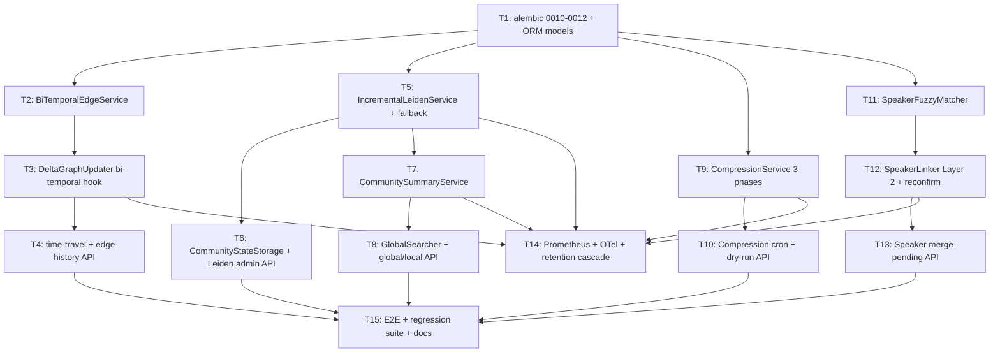
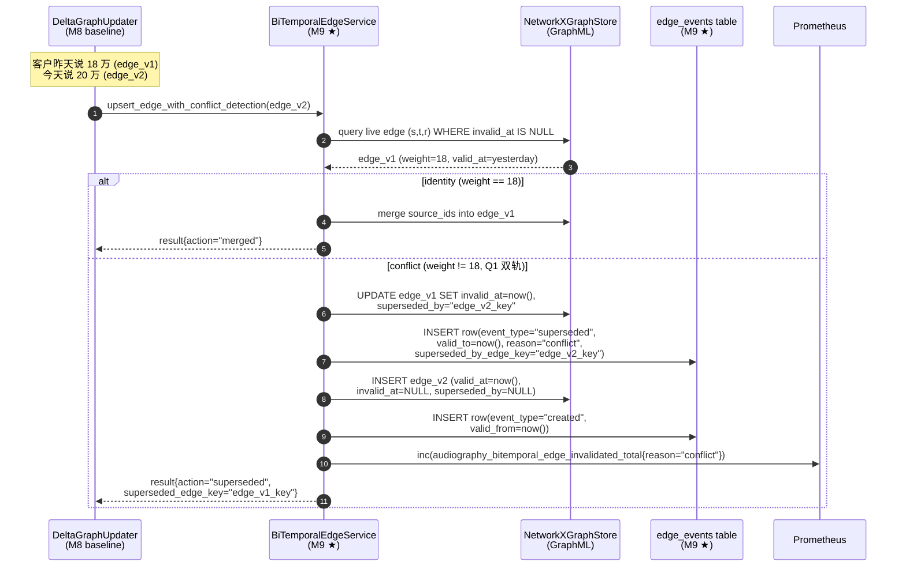
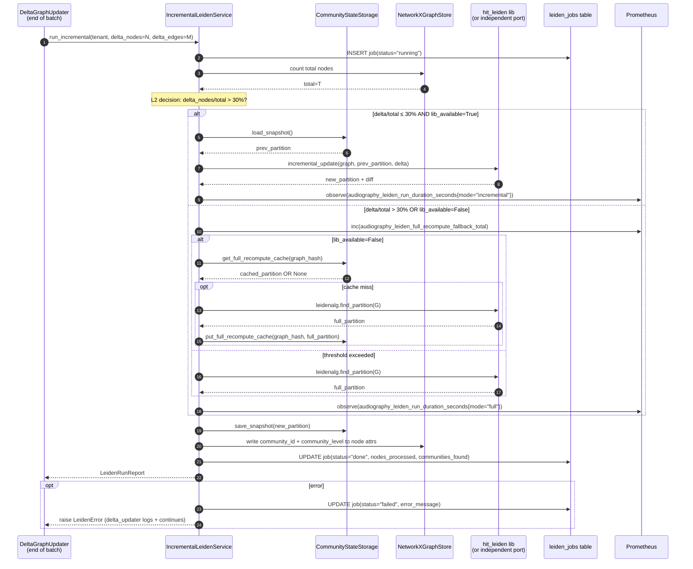
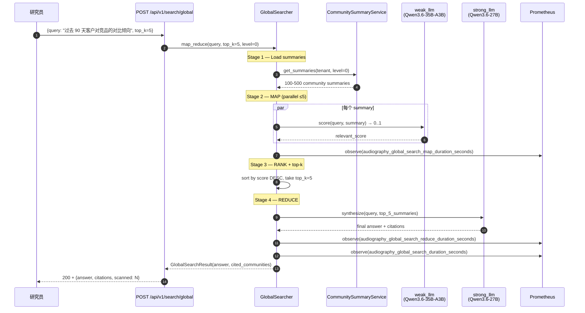
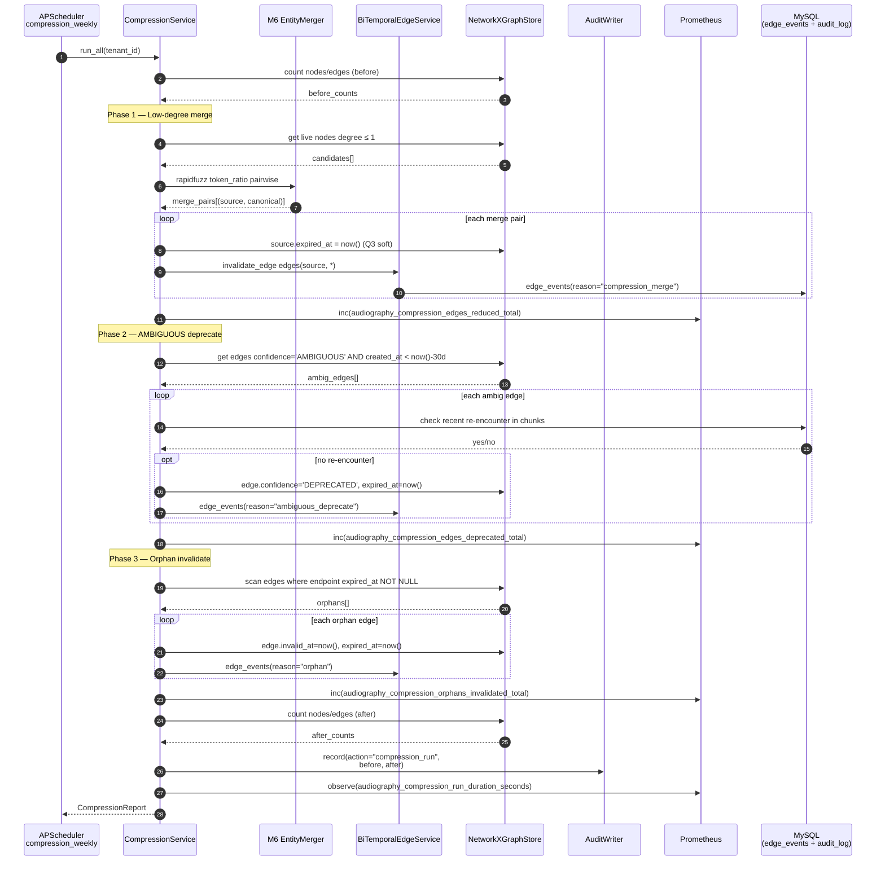
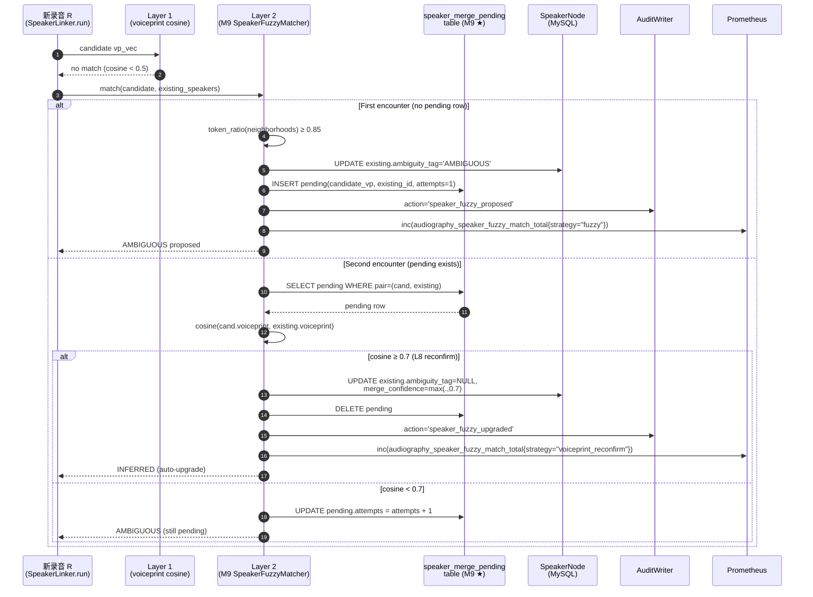
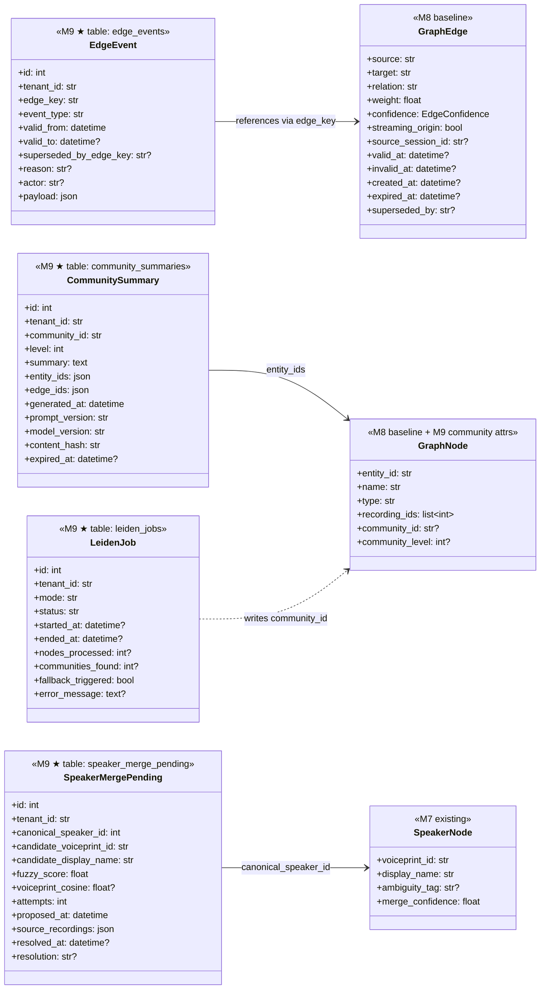
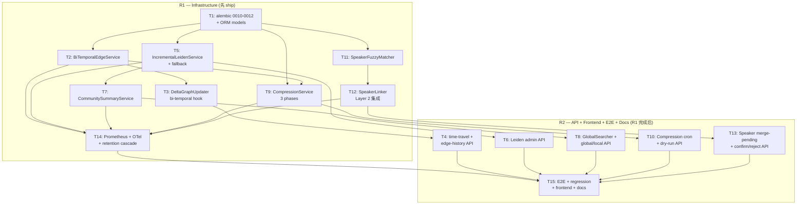

# AudioGraphy M9 架构文档 — 高级图谱特性 (Advanced Graph Features)

| 字段 | 值 |
|------|-----|
| 版本 | v9.0.0-draft |
| 作者 | 高见远（架构师 / AI 代行） |
| 主理人 | 齐活林 |
| 日期 | 2026-07-22 |
| 前置 | `docs/m9-prd.md`（788 行，source of truth） |
| 基线 | commit `461a6ba` (M8 shipped — WebSocket streaming + DeltaGraphUpdater + EdgeConfidence 标签) |
| 范围 | Code-Ready + Production：5 个生产级图谱特性 (A-E) 在 `enable_advanced_graph=True` 下 opt-in 交付 |
| 工作流 | WS-A Bi-temporal schema + DeltaGraphUpdater hook／ WS-B 增量 Leiden + 社区摘要 + 全局检索／ WS-C 图压缩 + SpeakerLinker Layer 2 fuzzy |

> 本文档为 `docs/m9-prd.md` 的**实施级架构补充**，定义每个 Protocol / Service / 类的签名、字段映射、迁移 DDL、API 契约与任务拆分。冲突时以 PRD 为准；齐活林 L1-L10 locked 决策不在本文重开。Q1/Q2/Q3 由架构师最终裁决（§6.5 / §8.3 / §9.1），与主理人签字后冻结。本文**给出类签名 + 关键决策 + 迁移骨架**，不嵌入完整实现代码（实现细节由 T1-T15 任务承担）。

---

## 目录

1. [Document Metadata](#1-document-metadata)
2. [Executive Summary](#2-executive-summary)
3. [Scope & Non-Goals](#3-scope--non-goals)
4. [System Context (M9 relative to M1-M8)](#4-system-context)
5. [Architecture Overview](#5-architecture-overview)
6. [Feature A: Bi-temporal Edge Schema](#6-feature-a-bi-temporal-edge-schema)
7. [Feature B: Leiden Incremental](#7-feature-b-leiden-incremental)
8. [Feature C: Community Summaries + Global Search](#8-feature-c-community-summaries--global-search)
9. [Feature D: Graph Compression](#9-feature-d-graph-compression)
10. [Feature E: SpeakerLinker Layer 2 Fuzzy](#10-feature-e-speakerlinker-layer-2-fuzzy)
11. [Data Model](#11-data-model)
12. [API Surface](#12-api-surface)
13. [Storage Layer Changes](#13-storage-layer-changes)
14. [Concurrency & Idempotency](#14-concurrency--idempotency)
15. [Configuration](#15-configuration)
16. [Error Handling](#16-error-handling)
17. [Observability](#17-observability)
18. [PIPL & Compliance](#18-pipl--compliance)
19. [Open-Source Considerations](#19-open-source-considerations)
20. [Testing Strategy](#20-testing-strategy)
21. [Migration & Rollout](#21-migration--rollout)
22. [Risks & Mitigations](#22-risks--mitigations)
23. [Acceptance Criteria Mapping](#23-acceptance-criteria-mapping)
24. [Open Items for Engineer](#24-open-items-for-engineer)
25. [Engineer Task List (T1-T15)](#25-engineer-task-list)

---

## 1. Document Metadata

| 字段 | 值 |
|------|-----|
| 文件路径 | `docs/m9-architecture.md` |
| 版本号 | v9.0.0-draft |
| 状态 | Draft — Pending 主理人 (齐活林) sign-off |
| 作者 | 高见远 (架构师 / AI 代行) |
| Reviewers | 齐活林 (主理人)、许清楚 (PM)、王督导 (门店质检代表)、赵运维 (Ops) |
| 依赖文档 | `docs/m9-prd.md`、`docs/m8-architecture.md`、`docs/m7-architecture.md`、`docs/DESIGN.md` |
| 基线 commit | `461a6ba` (M8 shipped) |
| 锁定机制 | L1-L10 由主理人 + 架构师双签锁定；偏离需双签决议。Q1-Q3 由架构师最终裁决（§6.5 / §8.3 / §9.1）后冻结 |

**Reading order for engineers**：(1) 本 §1-§5 → (2) PRD §8 (L1-L10) + §9 (Q1-Q3 PM 推荐) → (3) 本 §6-§10 (五特性设计) → (4) 本 §25 (任务认领) → (5) §17 共享约定。

---

## 2. Executive Summary

M9 (高级图谱特性 · Advanced Graph Features) 在 M1-M8 内核之上交付**五个相互关联的生产级图谱能力**，对应 PRD 的 5 个 features (A-E)：

- **Feature A — Bi-temporal 边 schema (Graphiti paradigm)**：4-timestamp 模型 (`valid_at` / `invalid_at` NULL-as-open / `created_at` / `expired_at` NULL-as-live)，旧事实**失效不删除**，支撑 time-travel 查询与审计回溯。
- **Feature B — Leiden 增量社区检测 (HIT-Leiden)**：闭合 M8 PRD §17.4 显式记录的 "Leiden 不做增量" 缺口；30% 阈值 (L2) 自动降级到全量重算；admin API `POST /api/v1/admin/leiden/recompute?mode=full|incremental`。
- **Feature C — 社区摘要 + Global map-reduce 检索 (GraphRAG paradigm)**：弱 LLM (Qwen3.6-35B-A3B) 对每个 community 生成 1-2 句 `community_summary`；global search = 全部摘要 → 弱 LLM 排序 → top-k → strong LLM final reduction。
- **Feature D — 图压缩周期性清理**：3 个清理函数 (low-degree merge / AMBIGUOUS deprecate / orphan edge invalidate)；复用 M6 retention scheduler 周触发；soft-delete only (Q3 决策)。
- **Feature E — SpeakerLinker Layer 2 fuzzy**：闭合 M7 docstring `speaker_linker.py:13-15` 承诺的 NotImplementedError；rapidfuzz token_ratio ≥ 0.85 + voiceprint cosine reconfirm ≥ 0.7 → AMBIGUOUS 升 INFERRED。

**关键技术决策（本文冻结）**：

- **L9 (零回归) 是最高优先级**：`enable_advanced_graph=False` 默认，M1-M8 全部 pytest 测试 0 失败。所有 M9 新表通过 alembic 迁移存在但默认空 / 默认值不影响 M1-M8 查询；M9 新增模块仅在 `enable_advanced_graph=True` 时 import (照搬 M7 `enable_clap` / M8 `enable_streaming` 模式)。
- **Q1 (冲突失效)**：双轨 —— 旧 edge 同时 `invalid_at=now()` **AND** `superseded_by=new_edge.id`。新 edge `valid_at` = 旧 edge `invalid_at`。Retrieval 默认 `invalid_at IS NULL AND expired_at IS NULL`；time-travel 走 `valid_at` range。详见 §6.5。
- **Q2 (摘要层级)**：level 0 + leaf 在 Leiden 收敛时生成；levels 1-2 懒生成（首次 drill-down 时，缓存进 `community_summaries`）；level 3 drop（degenerate）。详见 §8.3。
- **Q3 (压缩软删)**：SOFT delete only —— source node `expired_at=now()`，相关 edges `invalid_at=now()`。**永不** hard delete。NetworkX 过滤走 `expired_at IS NULL`。详见 §9.1。
- **NetworkX-only graph model**：AudioGraphy 没有 SQL `edges` 表（M8 T7 deviation note 已记录）；edges 存 NetworkX MultiDiGraph + GraphML 文件。M9 bi-temporal 字段挂在 `GraphEdge` dataclass + GraphML 属性上；新增的 SQL 表只是元数据/审计/缓存（`community_summaries` / `leiden_jobs` / `speaker_merge_pending`）。这与 PRD §6.1 描述的 "edges 表新增 4 列" 在 **storage layer** 上调整为 "GraphEdge dataclass + GraphML attrs"，**语义不变**。

**P0 工作流划分**：WS-A = T1-T4 (bi-temporal schema + DeltaGraphUpdater hook + retention cascade + time-travel API)；WS-B = T5-T9 (Leiden incremental + community summary + global search + local harmonize)；WS-C = T10-T15 (compression cron + SpeakerLinker Layer 2 + merge-pending API + metrics + E2E + 文档)。

**M9 增量代码估算**：≤ 7500 行（后端核心 ~3500 / 测试 ~2000 / 前端 ~1500 / 文档 ~500）。详见 §25.17。

---

## 3. Scope & Non-Goals

### 3.1 In-scope (M9 必交付)

照搬 PRD §4.1，5 features 全部 P0：

1. **Feature A — Bi-temporal 边 schema** (Graphiti paradigm)：4 timestamp 字段 + 旧事实失效不删 + Q1 冲突策略 + time-travel API + edge-history API + retention cascade 协同。
2. **Feature B — Leiden 增量**：HIT-Leiden 增量算法 + 30% 阈值回退 + admin API + DeltaGraphUpdater 自动触发 + lib fallback。
3. **Feature C — 社区摘要 + Global search**：弱 LLM 摘要 + map-reduce 检索 + local search harmonize + 多层级 (Q2 决策) + 结构变化触发重生成。
4. **Feature D — 图压缩周清**：3 清理函数 + 周日 03:00 cron (复用 M6 scheduler) + soft-delete (Q3) + tenant 配置 override。
5. **Feature E — SpeakerLinker Layer 2 fuzzy**：rapidfuzz token_ratio + voiceprint reconfirm + AMBIGUOUS 队列 + admin confirm/reject API + 前端待审卡片。

### 3.2 Out-of-scope (明确推迟到 M10+)

照搬 PRD §4.2 (10 项)，**不在本文重开**：分布式图存储 / 向量量化 / 多模态实体融合 / 跨租户 community merge / 全图 GNN / 实时流式 Leiden / Bi-temporal rollback UI / Community summary 多语言 / GraphRAG drift detection / Time-Travel Query Builder 完整可视化。

### 3.3 Non-Goals 内部边界（架构师补充）

- **不改 M1-M8 任何已 ship 文件的对外 API**：`api/recordings.py` / `api/graph.py` / `api/speakers.py` 等的现有端点行为不动；M9 新端点通过新 router 注册。
- **不引入 Neo4j / TigerGraph / external graph DB**：M9 仍在 NetworkX MultiDiGraph + GraphML 文件层。
- **不重写 DeltaGraphUpdater**：M9 在 `update()` 末尾 hook Leiden 触发器（追加 ≤ 30 LOC），不重构既有 content-hash / EntityMerger / SpeakerLinker 调用链。
- **不引入新 master key**：voiceprint reconfirm 复用 M7 `VoiceprintAdapter`，加密复用 M6 `AudioCrypto` + `AUDIOGRAPHY_MASTER_KEY_PATH`。
- **不破坏 GraphML 向后兼容**：bi-temporal 字段作为 GraphML edge 属性追加；老 GraphML 文件加载时字段缺失 → 走默认值 (`invalid_at=NULL, expired_at=NULL`)，等同 M8 行为。

---

## 4. System Context

### 4.1 M9 在 AudioGraphy 中的位置

```mermaid
flowchart TB
    subgraph M9["M9 Advanced Graph Features (本次 · opt-in via enable_advanced_graph=True)"]
        BiTemp[core/bi_temporal.py<br/>★ BiTemporalEdgeService<br/>Q1 双轨失效 +<br/>time-travel query]
        Leiden[core/leiden.py<br/>★ IncrementalLeidenService<br/>HIT-Leiden + 30% 阈值回退]
        CommSum[core/community_summary.py<br/>★ CommunitySummaryService<br/>Q2: level 0+leaf eager<br/>1-2 lazy]
        GlobalS[core/global_search.py<br/>★ GlobalSearcher<br/>map-reduce]
        Compress[core/compression.py<br/>★ CompressionService<br/>3 phases, soft-delete Q3]
        SpkFuzzy[core/speaker_fuzzy_matcher.py<br/>★ SpeakerFuzzyMatcher<br/>L8 reconfirm]

        TimeTravelAPI[api/bi_temporal.py<br/>★ /time-travel +<br/>/edge-history]
        LeidenAPI[api/leiden_admin.py<br/>★ /admin/leiden/* ]
        SearchAPI[api/search.py<br/>★ /search/global +<br/>/search/local]
        SpeakerPendingAPI[api/speakers.py +<br/>/merge-pending +<br/>confirm/reject]

        CommunityState[storage/community_state.py<br/>★ partition snapshot +<br/>diff cache]
    end

    subgraph M8["M8 Baseline (commit 461a6ba · 不改源码)"]
        Delta[core/delta_graph_updater.py<br/>M9 hook point]
        StreamSess[core/stream_session.py]
        StreamChunker[core/streaming_chunker.py]
        TagSched[core/streaming_tag_scheduler.py]
        WS[api/ws_stream.py]
        RWLock[core/streaming_rwlock.py]
    end

    subgraph M1_M7["M1-M7 内核 (不改源码)"]
        Rest[REST routers /recordings /graph /query]
        Chunker[core/chunker.py]
        Extract[core/extractor.py]
        Merger[core/entity_merger.py<br/>M9 compression 复用]
        Linker[core/speaker_linker.py<br/>M9 Layer 2 落地]
        Retention[core/retention.py<br/>M9 compression 复用 scheduler]
        Retrieval[core/retrieval.py<br/>3-channel]
        Rerank[core/rerank.py]
        Audit[core/audit.py]
        Crypto[core/crypto.py]
    end

    subgraph Storage["Storage Layer"]
        MySQL[(MySQL 8<br/>+ M9 new tables:<br/>community_summaries<br/>leiden_jobs<br/>speaker_merge_pending)]
        GraphML[(NetworkX MultiDiGraph<br/>+ GraphML files<br/>M9: bi-temporal attrs<br/>+ community_id)]
    end

    subgraph External["External LLM"]
        WeakLLM[vllm-weak<br/>Qwen3.6-35B-A3B<br/>community summary]
        StrongLLM[vllm-strong<br/>Qwen3.6-27B<br/>global search reduction]
    end

    Delta -.hook.-> Leiden
    Delta -.writes.-> BiTemp
    Leiden --> CommunityState
    Leiden --trigger--> CommSum
    CommSum --> WeakLLM
    GlobalS --> WeakLLM
    GlobalS --> StrongLLM
    GlobalS -.reads.-> CommSum

    Retention -.cron extend.-> Compress
    Compress --> Merger
    Compress --> BiTemp

    Linker -.L2 hook.-> SpkFuzzy
    SpkFuzzy --> SpeakerPendingAPI

    BiTemp --> TimeTravelAPI
    Leiden --> LeidenAPI
    GlobalS --> SearchAPI

    Delta --> GraphML
    BiTemp --> GraphML
    Leiden --> GraphML
    CommSum --> MySQL
    Leiden --> MySQL
    SpkFuzzy --> MySQL

    classDef locked fill:#fef3c7,stroke:#f59e0b
    class BiTemp,Leiden,CommSum,GlobalS,Compress,SpkFuzzy locked
```



### 4.2 数据流总览（M9 改动点）

- **写入路径 (DeltaGraphUpdater)**：M8 既有 `content-hash dedup → EntityMerger → edges.upsert` 链路不动；M9 在 `update()` 末尾追加 3 个 hook：(1) bi-temporal 字段填充（`valid_at=now(), invalid_at=NULL, created_at=now(), expired_at=NULL`）→ (2) 冲突检测（同 `(s,t,r)` live edge 但 `weight/description` 不同 → Q1 双轨失效）→ (3) 异步触发 `LeidenIncrementalService.run_incremental()`。
- **图谱压缩路径 (周日 03:00 cron)**：复用 M6 `retention.py` APScheduler，追加 `compression_run` job；3 phases 顺序执行（low-degree merge → AMBIGUOUS deprecate → orphan invalidate）；每 phase 写 audit_log + Prometheus counter。
- **检索路径 (global search)**：新端点 `POST /api/v1/search/global` → GlobalSearcher.map_reduce()：map = 弱 LLM 对所有 level-N community_summary 打分（并发 ≤ 5）；reduce = top-k (默认 5) summaries → strong LLM 最终回答。
- **Speaker Linker Layer 2 路径**：M7 `speaker_linker.py:209` 的空注释替换为 SpeakerFuzzyMatcher 调用；Layer 1 (voiceprint cosine ≥ 0.5) miss 后 → Layer 2 rapidfuzz token_ratio ≥ 0.85 → 写 `speaker_merge_pending` + SpeakerNode.ambiguity_tag='AMBIGUOUS'；后续 voiceprint cosine ≥ 0.7 reconfirm → 升 INFERRED + 删 pending 行。

### 4.3 与 M6/M7/M8 的复用关系矩阵

| M9 模块 | 复用源 | 复用方式 | 改动量 |
|---------|-------|---------|--------|
| BiTemporalEdgeService | M8 DeltaGraphUpdater | 调用 hook（不改源码） | DeltaGraphUpdater 末尾 +30 LOC |
| CompressionService.low_degree_merge | M6 EntityMerger | 直接实例化调用 | 0 行（factory 注入） |
| CompressionService.cron | M6 retention scheduler | add_job 追加 | scheduler.py +20 LOC |
| SpeakerFuzzyMatcher | M6 EntityMerger rapidfuzz | 算法借鉴（独立类） | 新文件 ~280 LOC |
| SpeakerLinker Layer 2 | M7 speaker_linker.py:209 | 替换空注释 | speaker_linker.py +40 LOC |
| LeidenIncrementalService | M8 NetworkXGraphStore | 读取图、写回 community_id | 不改 NetworkXGraphStore |
| CommunitySummaryService | M6 audit_log + tag versioning 模式 | 模式借鉴 | 新文件 ~360 LOC |
| GlobalSearcher | M7 ThreeChannelRetriever | 借鉴并发模式 | 新文件 ~280 LOC |

---

## 5. Architecture Overview

### 5.1 分层视图

```mermaid
flowchart LR
    subgraph API["API Layer (FastAPI routers)"]
        A1[api/bi_temporal.py<br/>★ /graph/time-travel<br/>★ /graph/edge-history]
        A2[api/leiden_admin.py<br/>★ /admin/leiden/recompute<br/>★ /admin/leiden/jobs]
        A3[api/search.py<br/>★ /search/global<br/>★ /search/local]
        A4[api/speakers.py +<br/>★ /speakers/merge-pending<br/>★ /speakers/id/confirm-merge]
        A5[api/compression_admin.py<br/>★ /admin/compression/dry-run]
    end

    subgraph Core["Core Services Layer"]
        C1[BiTemporalEdgeService]
        C2[IncrementalLeidenService]
        C3[CommunitySummaryService]
        C4[GlobalSearcher]
        C5[CompressionService]
        C6[SpeakerFuzzyMatcher]
    end

    subgraph Storage["Storage Layer"]
        S1[NetworkXGraphStore<br/>+ GraphML attrs]
        S2[CommunityStateStorage<br/>★ partition snapshot]
        S3[MySQL: community_summaries<br/>★ leiden_jobs<br/>★ speaker_merge_pending]
    end

    subgraph Infra["Infrastructure"]
        I1[M6 retention scheduler<br/>+ M9 compression cron]
        I2[M7 AuditWriter]
        I3[M6 AudioCrypto]
        I4[Prometheus /metrics]
        I5[OpenTelemetry spans]
    end

    API --> Core
    Core --> Storage
    Core -.-> Infra
```



### 5.2 关键依赖图（M9 内部）



---

## 6. Feature A: Bi-temporal Edge Schema

> 实施目标：把 M8 GraphEdge dataclass 扩展为 4-timestamp 模型（Graphiti paradigm），所有写入路径自动填字段，所有读取路径默认过滤 live edges，提供 time-travel 查询能力。**与 Graphiti 的差异**：AudioGraphy 边存 NetworkX + GraphML，不存 SQL；4 timestamp 是 GraphML 属性而非 SQL 列。

### 6.1 edges 表 extended (migration 0010) — 实施调整

**PRD §6.1 A-P0-1 描述**：alembic 0010 给 SQL `edges` 表加 4 列。

**架构师调整（与 M8 deviation note 一致）**：AudioGraphy 没有 SQL `edges` 表（M8 T5 已经记录 deviation）。bi-temporal 4 字段挂在 **NetworkX GraphEdge dataclass** + **GraphML edge 属性**上，**不进 SQL**。alembic 0010 因此只创建 1 张新表 `edge_events`（审计/补偿用，**不**存图边本身），用于：(a) 记录每次 supersede 事件的指针链；(b) retention cascade 触发时记录"哪些 edges 因节点 N 被删除而失效"；(c) audit_log 的细粒度补充。

```sql
-- alembic 0010 (M9 bi-temporal event log)
CREATE TABLE edge_events (
    id BIGSERIAL PRIMARY KEY,
    tenant_id VARCHAR(64) NOT NULL,
    edge_key VARCHAR(128) NOT NULL,  -- "{source_id}::{target_id}::{relation}"
    event_type VARCHAR(32) NOT NULL CHECK (event_type IN
        ('created', 'superseded', 'invalidated', 'expired', 'restored')),
    valid_from TIMESTAMPTZ NOT NULL,
    valid_to TIMESTAMPTZ NULL,          -- NULL = open interval (current)
    superseded_by_edge_key VARCHAR(128) NULL,
    reason VARCHAR(64) NULL,            -- conflict / retention / orphan / compression / manual
    actor VARCHAR(64) NULL,             -- user_id / system / cron
    payload JSON NULL,                  -- before/after diff for audit
    created_at TIMESTAMPTZ NOT NULL DEFAULT NOW()
);
CREATE INDEX idx_edge_events_tenant_key ON edge_events(tenant_id, edge_key, valid_from DESC);
CREATE INDEX idx_edge_events_live ON edge_events(tenant_id, valid_to) WHERE valid_to IS NULL;
```

### 6.2 GraphEdge dataclass extended (`core/types.py`)

```python
# core/types.py 增量（+~30 LOC）

from datetime import datetime
from typing import Any

@dataclass(frozen=True, slots=True)
class GraphEdge:
    """One directed edge in the NetworkX MultiDiGraph (M9 bi-temporal extension).

    M8 baseline fields:
        source / target / relation / weight / confidence / confidence_score /
        source_ids / streaming_origin / source_session_id (M8 streaming attrs).

    M9 bi-temporal fields (L1):
        valid_at: When this edge became factually true (defaults to NOW on insert).
        invalid_at: When this edge was superseded / invalidated (NULL = open / live).
        created_at: Wall-clock insertion time (audit purpose).
        expired_at: When this edge was soft-deleted by compression / retention
            (NULL = live). Different from invalid_at: invalid_at is factual
            supersession; expired_at is administrative soft-delete.
        superseded_by: edge_key of the replacing edge (Q1 双轨决策).

    Retrieval default filter (live edges only):
        invalid_at IS NULL AND expired_at IS NULL
    Time-travel filter:
        valid_at <= as_of AND (invalid_at IS NULL OR invalid_at > as_of)
        AND expired_at IS NULL
    """
    source: str
    target: str
    relation: str
    weight: float = 1.0
    confidence: EdgeConfidence = "AMBIGUOUS"
    confidence_score: float | None = None
    source_ids: list[str] = field(default_factory=list)
    # M8 streaming attrs
    streaming_origin: bool = False
    source_session_id: str | None = None
    # M9 bi-temporal attrs (L1)
    valid_at: datetime | None = None         # None → default to NOW on insert
    invalid_at: datetime | None = None       # None = live
    created_at: datetime | None = None       # None → default to NOW on insert
    expired_at: datetime | None = None       # None = live
    superseded_by: str | None = None         # edge_key of replacer
```

### 6.3 DeltaGraphUpdater integration (`core/delta_graph_updater.py` +30 LOC)

M8 既有 `update()` 流程**不动**；M9 在 `_write_to_graph()` 内的 edge upsert 处追加 bi-temporal 处理：

```python
# DeltaGraphUpdater._write_to_graph() 增量
async def _write_to_graph(
    self, graph_store, entities, merged_pairs, edges_with_conf,
    recording_id, chunk_id,
) -> None:
    from audio_graphy.core.bi_temporal import BiTemporalEdgeService
    bt = BiTemporalEdgeService(graph_store, session_factory=self._session_factory)
    for rel, conf in edges_with_conf:
        # ... build GraphEdge as M8 ...
        edge = GraphEdge(
            source=source_id, target=target_id, relation=rel.relation,
            weight=rel.weight, confidence=conf,
            confidence_score=1.0 if conf == "EXTRACTED" else 0.5,
            source_ids=[f"{recording_id}_{chunk_id}"],
            streaming_origin=True, source_session_id=self._session_id,
            # M9: bi-temporal fields auto-populated by bt.upsert_edge()
        )
        # M9 hook: detects conflicts + applies Q1 双轨 supersede.
        await bt.upsert_edge_with_conflict_detection(
            edge=edge, tenant_id=self._tenant_id, actor="delta_updater",
        )
```

`BiTemporalEdgeService.upsert_edge_with_conflict_detection()` 算法：

```
1. Query current live edge with same (source, target, relation)
   where invalid_at IS NULL AND expired_at IS NULL.
2. If no live edge exists → insert new edge with valid_at=now(), invalid_at=NULL.
3. If live edge exists AND (weight == new.weight AND description == new.description)
   → identity hit, merge source_ids into existing edge (no supersede).
4. If live edge exists AND attribute differs → Q1 conflict:
   a. UPDATE old edge: invalid_at = now(), superseded_by = new_edge_key.
   b. INSERT edge_events row: event_type='superseded', valid_to=now(),
      superseded_by_edge_key=new_edge_key, reason='conflict'.
   c. INSERT new edge: valid_at = old.invalid_at (= now), invalid_at=NULL.
   d. Counter: audiography_bitemporal_edge_invalidated_total{reason="conflict"}.inc()
```

### 6.4 BiTemporalEdgeService (core/bi_temporal.py ~280 LOC)

```python
class BiTemporalEdgeService:
    """M9 Feature A — bi-temporal edge CRUD with conflict resolution.

    Backed by NetworkXGraphStore (GraphML) + edge_events table (audit log).
    All upsert / invalidate / time-travel methods are idempotent and tenant-scoped.

    Args:
        graph_store: Per-tenant NetworkXGraphStore.
        session_factory: async session maker for edge_events table.
        conflict_strategy: One of {"supersede" (Q1 default), "keep_both",
            "invalidate_old"}. Q1 锁定为 "supersede" — exposed for tenant
            override (P1 tenant_configs).
    """

    def __init__(
        self,
        graph_store: NetworkXGraphStore,
        session_factory: async_sessionmaker[AsyncSession],
        *,
        conflict_strategy: str = "supersede",
    ) -> None: ...

    async def upsert_edge_with_conflict_detection(
        self, edge: GraphEdge, *, tenant_id: str, actor: str = "system",
    ) -> BiTemporalUpsertResult:
        """Insert or supersede an edge (Q1 双轨). Idempotent."""

    async def invalidate_edge(
        self, edge_key: str, *, reason: str, actor: str, tenant_id: str,
    ) -> None:
        """Mark an edge invalid_at=now() (used by compression / orphan cleanup)."""

    async def expire_edge(
        self, edge_key: str, *, reason: str, actor: str, tenant_id: str,
    ) -> None:
        """Mark an edge expired_at=now() (used by retention cascade)."""

    async def time_travel_query(
        self, entity_id: str, relation: str | None, as_of: datetime,
        *, tenant_id: str,
    ) -> list[GraphEdge]:
        """Return edges valid at as_of: valid_at <= as_of AND
        (invalid_at IS NULL OR invalid_at > as_of) AND expired_at IS NULL."""

    async def edge_history(
        self, source: str, target: str, relation: str, *,
        tenant_id: str, include_expired: bool = False,
    ) -> list[GraphEdge]:
        """Return all versions of (source, target, relation) edge,
        sorted by valid_at DESC. Follows superseded_by chain."""

    async def retention_cascade(
        self, node_id: str, *, tenant_id: str, actor: str = "retention",
    ) -> int:
        """When node N is deleted, mark all edges to/from N as
        expired_at=now(). Returns affected edge count."""


@dataclass(frozen=True, slots=True)
class BiTemporalUpsertResult:
    """Output of upsert_edge_with_conflict_detection."""
    action: str  # "inserted" | "merged" | "superseded"
    new_edge_key: str
    superseded_edge_key: str | None = None
```

### 6.5 Mermaid sequence — conflict → invalidate → supersede (Q1 ruling)



**Q1 最终裁决（架构师）**：双轨 supersede。理由：

| 维度 | (a) 仅 auto-invalidate | (b) 仅 supersede pointer | **(c) 双轨 supersede + invalidate（选定）** |
|------|----------------------|--------------------------|---------------------------------------------|
| 审计 lineage | 缺 "事实仍有效"语义 | 缺 "事实已被取代"硬截断 | **完整保留两层语义** |
| 检索 SQL 复杂度 | 单条件 `invalid_at IS NULL` | 双条件 `superseded_by IS NULL` | **单条件 `invalid_at IS NULL AND expired_at IS NULL`** |
| Time-travel 查询 | `valid_at` range | 需 walk supersede 链 | **`valid_at` range（invalid_at 是 close 端点）** |
| 写入开销 | 1 UPDATE | 1 UPDATE + pointer | **1 UPDATE + 1 INSERT (edge_events)** |

PM 推荐 (b)；架构师最终选 **(c)** 因为：(1) US-1 (time-travel) 与 US-8 (审计) 在 (c) 下都是简单 SQL/NetworkX 过滤，不需要 supersede 链 walk；(2) `edge_events` 表的开销是常数（每次 supersede 1 行），可承受；(3) retrieval 默认 filter 是单条件，性能与 (a) 等价。

---

## 7. Feature B: Leiden Incremental

> 实施目标：闭合 M8 PRD §17.4 的 Leiden 缺口。HIT-Leiden 增量算法 + 30% 阈值回退全量 + DeltaGraphUpdater batch 完成后自动触发 + admin API 暴露手动重建。

### 7.1 HIT-Leiden algorithm + fallback

**HIT-Leiden (Hierarchical Incremental Tree Leiden, SIGMOD 2026 paper)** 核心思想：把 Leiden 的 hierarchical tree 作为可增量维护的状态；新 delta nodes/edges 进来时，仅受影响的局部 subtree 重新分配 community，全图 partition 不动。当 delta 影响范围超过阈值时降级全量。

**AudioGraphy 实施 (R-HIT 缓解)**：

| 条件 | 行为 |
|------|------|
| `leiden_incremental_lib_available=True` AND delta_nodes/total ≤ 30% | 调用 `hit_leiden.incremental_update(graph, partition_snapshot, delta)` |
| `leiden_incremental_lib_available=True` AND delta/total > 30% | 抛 `LeidenFullRecomputeRequired` → 调用 `leidenalg.find_partition(G, ModularityVertexPartition)` |
| `leiden_incremental_lib_available=False` (lib 未发布或 license 不 MIT-clean) | 所有调用走 full recompute + LRU cache (key=graph content_hash, size=10) |
| Exception | log warning + Prometheus counter fallback + 降级 full |

**Independent port 兜底**（PRD R-HIT 缓解 2）：若 HIT-Leiden lib 截至 M9 code freeze 仍不可用，工程师基于 SIGMOD 2026 论文实现 ≤ 500 LOC 的 MIT-clean independent port（基于 `leidenalg` + NetworkX subgraph recompute）。port 放在 `core/leiden_independent_port.py`。

### 7.2 CommunityStateStorage (`storage/community_state.py` ~180 LOC)

```python
class CommunityStateStorage:
    """Per-tenant Leiden partition snapshot + diff cache.

    Stores the last converged partition in MySQL (community_states table) +
    in-memory dict for fast incremental access. Used by IncrementalLeidenService
    to detect community drift (>30% membership change triggers summary regen).

    Args:
        session_factory: async session maker.
        tenant_id: Tenant scope.
        lru_cache_size: For fallback mode (lib_unavailable), how many graph
            content_hash → partition pairs to keep in memory.
    """

    async def load_snapshot(self) -> PartitionSnapshot | None: ...
    async def save_snapshot(self, snapshot: PartitionSnapshot) -> None: ...
    async def compute_diff(
        self, old: PartitionSnapshot, new: PartitionSnapshot,
    ) -> CommunityDiff: ...
    async def get_full_recompute_cache(
        self, graph_hash: str,
    ) -> PartitionSnapshot | None: ...
    async def put_full_recompute_cache(
        self, graph_hash: str, snapshot: PartitionSnapshot,
    ) -> None: ...


@dataclass(frozen=True, slots=True)
class PartitionSnapshot:
    """One Leiden partition snapshot at a point in time."""
    tenant_id: str
    level: int  # 0 = top, 1-2 = nested, leaf
    node_to_community: dict[str, str]  # entity_id → community_id
    community_to_nodes: dict[str, list[str]]
    computed_at: datetime
    graph_hash: str  # SHA-256 of the source graph adjacency
    is_incremental: bool  # True if computed via HIT-Leiden, False if full


@dataclass(frozen=True, slots=True)
class CommunityDiff:
    """Diff between two consecutive partitions (used to trigger summary regen)."""
    added_communities: tuple[str, ...]
    removed_communities: tuple[str, ...]
    membership_changed: dict[str, float]  # community_id → fraction of members changed
```

### 7.3 IncrementalLeidenService (`core/leiden.py` ~420 LOC)

```python
class IncrementalLeidenService:
    """M9 Feature B — HIT-Leiden incremental with 30% threshold fallback.

    Triggered by:
        - DeltaGraphUpdater.update() end-of-batch hook (automatic).
        - Admin API POST /api/v1/admin/leiden/recompute?mode=full|incremental.

    Args:
        graph_store_factory: per-tenant NetworkXGraphStore factory.
        community_state_storage_factory: per-tenant CommunityStateStorage factory.
        session_factory: async session maker (for leiden_jobs table).
        audit: AuditWriter.
        threshold: L2 locked 0.30 — delta_nodes/total_nodes > threshold → full.
        lib_available: config.leiden_incremental_lib_available.
        cache_size: config.leiden_cache_size (full recompute LRU).
    """

    async def run_incremental(
        self, tenant_id: str, delta_nodes: int, delta_edges: int,
    ) -> LeidenRunReport:
        """Automatic trigger from DeltaGraphUpdater. Decides incremental
        vs full based on L2 threshold."""

    async def run_full(
        self, tenant_id: str, *, actor: str = "admin",
    ) -> LeidenRunReport:
        """Admin API explicit full recompute."""

    async def _decide_mode(
        self, total_nodes: int, delta_nodes: int,
    ) -> Literal["incremental", "full"]:
        """L2 threshold decision (30%) + lib availability check."""

    async def _persist_to_graph_store(
        self, graph_store: NetworkXGraphStore, snapshot: PartitionSnapshot,
    ) -> None:
        """Write community_id + community_level as node attrs in NetworkX."""


@dataclass(frozen=True, slots=True)
class LeidenRunReport:
    tenant_id: str
    mode: str  # "incremental" | "full"
    duration_sec: float
    nodes_processed: int
    communities_found: int
    fallback_triggered: bool
    fallback_reason: str | None  # "threshold_exceeded" | "lib_unavailable" | "error"
    diff: CommunityDiff | None
```

### 7.4 Admin API (`api/leiden_admin.py` ~220 LOC)

```python
@router.post("/admin/leiden/recompute")
async def leiden_recompute(
    mode: Literal["full", "incremental"] = "full",
    tenant_id: str = Depends(require_admin),
    service: IncrementalLeidenService = Depends(get_leiden_service),
) -> LeidenJobResponse:
    """Trigger Leiden recompute (async job). Returns job_id immediately.
    User polls GET /admin/leiden/jobs/{job_id} for status."""

@router.get("/admin/leiden/jobs/{job_id}")
async def get_leiden_job(job_id: int, ...) -> LeidenJobStatus: ...

@router.get("/admin/leiden/jobs")
async def list_leiden_jobs(
    tenant_id: str, limit: int = 20, offset: int = 0, ...,
) -> list[LeidenJobStatus]: ...
```

`leiden_jobs` table（migration 0011）：

```sql
CREATE TABLE leiden_jobs (
    id BIGSERIAL PRIMARY KEY,
    tenant_id VARCHAR(64) NOT NULL,
    mode VARCHAR(16) NOT NULL CHECK (mode IN ('full', 'incremental')),
    status VARCHAR(16) NOT NULL CHECK (status IN
        ('pending', 'running', 'done', 'failed')),
    started_at TIMESTAMPTZ NULL,
    ended_at TIMESTAMPTZ NULL,
    nodes_processed INT NULL,
    communities_found INT NULL,
    fallback_triggered BOOLEAN NOT NULL DEFAULT FALSE,
    fallback_reason VARCHAR(64) NULL,
    error_message TEXT NULL,
    created_at TIMESTAMPTZ NOT NULL DEFAULT NOW()
);
CREATE INDEX idx_leiden_jobs_tenant_created
    ON leiden_jobs(tenant_id, created_at DESC);
```

### 7.5 Mermaid sequence — threshold → incremental vs full



---

## 8. Feature C: Community Summaries + Global Search

> 实施目标：把 GraphRAG global search 范式落地到 AudioGraphy。弱 LLM 给每个 community 生成 1-2 句中文摘要；global search = map-reduce 跨所有摘要。

### 8.1 CommunitySummaryService (`core/community_summary.py` ~360 LOC)

```python
class CommunitySummarizer(Protocol):
    """Protocol for community summary generators (extension point US-6)."""
    @runtime_checkable
    async def summarize(
        self, community_id: str, members: list[GraphNode],
        edges: list[GraphEdge], *, tenant_id: str, level: int,
    ) -> CommunitySummary: ...


class LLMCommunitySummarizer:
    """Default impl — Qwen3.6-35B-A3B weak LLM via vllm-weak.

    Prompt template loaded from config.community_summary_prompt_path
    (GraphRAG-style placeholders: {entities} / {edges} / {output_language}).
    Output: 1-2 sentence Chinese summary.
    """

    def __init__(
        self, weak_llm: LLMAdapter, prompt_path: Path,
        *, output_language: str = "zh",
    ) -> None: ...


class CommunitySummaryService:
    """Orchestrates community summary generation + persistence + cache.

    Level policy (Q2 ruling, §8.3):
        - level 0 (top ~10) + leaf (~500-1000): eager at Leiden convergence.
        - levels 1-2: lazy on first drill-down query, cached.
        - level 3: dropped (degenerate, <5 members usually).

    Concurrency: weak LLM rate limit safe (≤5 concurrent calls).
    Per-community budget: ≤30s (L3 locked).
    """

    async def summarize_eager_levels(
        self, tenant_id: str, snapshot: PartitionSnapshot,
    ) -> int:
        """Called after Leiden convergence. Generates level 0 + leaf summaries.
        Returns count of summaries generated."""

    async def summarize_lazy_level(
        self, tenant_id: str, level: int, community_id: str,
    ) -> CommunitySummary | None:
        """On first drill-down, generate + cache. Subsequent reads from DB."""

    async def regenerate_dirty(
        self, tenant_id: str, diff: CommunityDiff,
    ) -> int:
        """When community membership change ≥ 30% (L3), mark dirty + regen."""

    async def get_summary(
        self, tenant_id: str, community_id: str, level: int,
    ) -> CommunitySummary | None: ...


@dataclass(frozen=True, slots=True)
class CommunitySummary:
    """One LLM-generated community summary row (DESIGN §6 tag-versioning pattern)."""
    id: int
    tenant_id: str
    community_id: str
    level: int
    summary: str
    entity_ids: list[str]
    edge_ids: list[str]
    generated_at: datetime
    prompt_version: str
    model_version: str
    content_hash: str  # SHA-256 of (entity_ids + edge_ids) for staleness check
```

### 8.2 community_summaries table (migration 0011)

```sql
CREATE TABLE community_summaries (
    id BIGSERIAL PRIMARY KEY,
    tenant_id VARCHAR(64) NOT NULL,
    community_id VARCHAR(64) NOT NULL,
    level INT NOT NULL CHECK (level BETWEEN 0 AND 3),
    summary TEXT NOT NULL,
    entity_ids JSON NOT NULL,
    edge_ids JSON NOT NULL,
    generated_at TIMESTAMPTZ NOT NULL DEFAULT NOW(),
    prompt_version VARCHAR(32) NOT NULL,
    model_version VARCHAR(64) NOT NULL,
    content_hash VARCHAR(64) NOT NULL,
    expired_at TIMESTAMPTZ NULL,  -- retention cascade sets this
    UNIQUE (tenant_id, community_id, level, content_hash)
);
CREATE INDEX idx_community_summaries_tenant_level
    ON community_summaries(tenant_id, level, community_id) WHERE expired_at IS NULL;
```

### 8.3 Level policy — Q2 final ruling

**Q2 最终裁决（架构师）**：level 0 + leaf **eager** at convergence；levels 1-2 **lazy** on first drill-down (cached in `community_summaries` table)；level 3 **dropped**。

| 维度 | (a) 全部 0-3 eager | (b) 0+leaf eager, 1-2 lazy（选定） | (c) 仅 0 |
|------|-------------------|------------------------------------|----------|
| LLM 调用数（10k nodes） | ~1260 | **~510-1010** | ~10 |
| US-2 drill-down UX | 即时 | 第一次 drill-down 30s，后续即时 | level 1+ 不可用 |
| US-3 global search | 任一层都行 | level 0 足够 | level 0 足够 |
| 月度 LLM 成本 | 高 | **中** | 低 |
| 实施复杂度 | 低 | 中（cache + lazy trigger） | 低 |

**关键裁决依据**：(1) PM 推荐 (b) 与架构师独立评估一致；(2) lazy generation 通过 `community_summaries` 表持久化，不会重复调用 LLM；(3) level 3 在 10k node 图上典型产生 ~500-1000 个 ≤5 成员的退化社区，LLM 摘要意义不大，drain 即可。

### 8.4 GlobalSearcher (`core/global_search.py` ~280 LOC)

```python
class GlobalSearcher:
    """GraphRAG-style global search via map-reduce.

    Args:
        community_summary_service: For loading community summaries.
        weak_llm: Qwen3.6-35B-A3B for map (per-community relevance scoring).
        strong_llm: Qwen3.6-27B for reduce (final answer synthesis).
        top_k: L4 default 5 — how many top communities go to reduce.
        default_level: L4 default 0 — which community level to search.
    """

    async def map_reduce(
        self, query: str, *, tenant_id: str,
        top_k: int = 5, level: int = 0,
    ) -> GlobalSearchResult:
        """Steps:
            1. Load all community summaries at `level` (expired_at IS NULL).
            2. MAP (concurrent ≤5): weak_llm.score(query, summary) → 0..1.
            3. RANK by score DESC, take top_k.
            4. REDUCE: strong_llm.synthesize(query, top_k_summaries) → answer.
            5. Return answer + top_k community citations.
        """


@dataclass(frozen=True, slots=True)
class GlobalSearchResult:
    answer: str
    cited_communities: list[str]  # community_ids in top_k
    total_communities_scanned: int
    map_duration_sec: float
    reduce_duration_sec: float
```

### 8.5 Local search harmonization

`POST /api/v1/search/local` 复用 M7 graph channel（`ThreeChannelRetriever` 的 graph branch）但加 community-aware expansion：

- 输入：`seed_entities` + `community_level` + `top_k`
- 步骤：(1) 对每个 seed entity 找 community_id；(2) expand 到 community 全部成员；(3) rerank by M7 weights；(4) 返回 top_k。
- 与 M5/M7 graph channel 完全向后兼容（不传 community_level 即退化为 M7 行为）。

### 8.6 Mermaid sequence — query → rank → top-k → synthesize



---

## 9. Feature D: Graph Compression

> 实施目标：每周日凌晨 03:00 cron 触发，3 个清理函数依次执行。**Q3 锁定 soft-delete only**——永不 hard delete 节点 / 边。

### 9.1 Q3 final ruling — soft-delete only

**Q3 最终裁决（架构师）**：**SOFT delete only**。理由：

| 维度 | (a) 硬删除 | **(b) 软删除（选定）** | (c) 混合（季度 archive） |
|------|-----------|---------------------|------------------------|
| Bi-temporal 审计 (US-1/US-8) | 违背 | **保留** | 保留（部分） |
| NetworkX 性能 | 最佳（节点数稳定） | 节点数 20-30%/年增长 | 介于两者 |
| 实施复杂度 | 低 | **低（仅 `expired_at` filter）** | 高（archive 表 schema + restore） |
| Retrieval 过滤 | 默认行为 | **`expired_at IS NULL` filter** | 同 (b) |
| 可恢复性 | 不可恢复 | **可恢复（清 `expired_at`）** | 季度内可恢复 |
| 长期膨胀风险 | 无 | 节点数膨胀 | 季度后归档 |

**关键裁决依据**：(1) M9 核心价值之一是 bi-temporal 审计，硬删除违背原则；(2) NetworkX 在 100k 节点规模查询 <10ms（PRD §7.1），软删的存储成本可接受；(3) 若 3-5 年后节点数膨胀超阈值，可观察 Prometheus 指标后切 (c)，**不是 M9 决策**。

### 9.2 CompressionService (`core/compression.py` ~420 LOC)

```python
class CompressionService:
    """M9 Feature D — weekly graph compression (3 phases, soft-delete only).

    Triggered by:
        - Cron: every Sunday 03:00 (extends M6 retention scheduler).
        - Admin: POST /api/v1/admin/compression/dry-run (preview).

    Args:
        graph_store_factory: per-tenant NetworkXGraphStore factory.
        merger_factory: M6 EntityMerger factory (for low-degree merge).
        bi_temporal_factory: BiTemporalEdgeService factory (for edge invalidation).
        session_factory: async session maker (for audit_log).
        audit: AuditWriter.
        fuzzy_threshold: L6 default 85 (rapidfuzz token_ratio × 100).
        low_degree_max: L6 default 1 (degree ≤ 1).
        ambiguous_deprecate_days: L7 default 30.
    """

    async def run_all(self, tenant_id: str) -> CompressionReport:
        """Run all 3 phases sequentially. Returns aggregate report."""

    async def merge_low_degree_duplicates(
        self, tenant_id: str,
    ) -> PhaseReport:
        """Phase 1: scan nodes with degree ≤ low_degree_max AND same community_id;
        rapidfuzz token_ratio ≥ fuzzy_threshold on display name → call M6
        EntityMerger.merge(). Q3: source node expired_at=now(), edges
        transferred to canonical."""

    async def deprecate_ambiguous_edges(
        self, tenant_id: str,
    ) -> PhaseReport:
        """Phase 2: scan edges with confidence='AMBIGUOUS' AND created_at <
        now() - INTERVAL 'N days' (N=L7 default 30) AND no re-encounter in
        N days → UPDATE confidence='DEPRECATED', expired_at=now()."""

    async def invalidate_orphan_edges(
        self, tenant_id: str,
    ) -> PhaseReport:
        """Phase 3: scan edges where expired_at IS NULL AND
        (source node expired_at NOT NULL OR target node expired_at NOT NULL)
        → UPDATE edges.invalid_at=now(), expired_at=now(). Reason='orphan'."""


@dataclass(frozen=True, slots=True)
class CompressionReport:
    tenant_id: str
    started_at: datetime
    ended_at: datetime
    phase_1: PhaseReport  # low-degree merge
    phase_2: PhaseReport  # ambiguous deprecate
    phase_3: PhaseReport  # orphan invalidate
    before_node_count: int
    after_node_count: int
    before_edge_count: int
    after_edge_count: int


@dataclass(frozen=True, slots=True)
class PhaseReport:
    name: str
    affected_count: int
    duration_sec: float
    sample_affected: tuple[str, ...]  # first 10 affected keys (for audit)
```

### 9.3 Low-degree merge via M6 EntityMerger

Phase 1 算法：

```
1. Fetch all live nodes (expired_at IS NULL) with degree ≤ compression_low_degree_max.
2. Group by (tenant_id, community_id, entity_type).
3. For each group:
   a. Sort by display_name.
   b. For each pair (n1, n2) in group:
      score = rapidfuzz.fuzz.token_ratio(n1.name, n2.name)
      if score >= compression_fuzzy_threshold (L6 default 85):
        - canonical = (n1 if n1.id < n2.id else n2)  # deterministic
        - source    = (n2 if canonical == n1 else n1)
        - await EntityMerger.merge([(source.name, source.type)])  # M6 reuse
        - UPDATE source node expired_at=now()  # Q3 soft-delete
        - For each edge (source, t, r) in graph:
            await graph_store.upsert_edge(replace source → canonical)
            await BiTemporalEdgeService.invalidate_edge(old_edge_key, reason="compression_merge")
4. Prometheus counter inc; audit_log write.
```

### 9.4 AMBIGUOUS deprecation (L7)

Phase 2 算法：

```
threshold_dt = now() - INTERVAL 'compression_ambiguous_deprecate_days' days
for edge in graph.edges where confidence == 'AMBIGUOUS'
                        AND created_at < threshold_dt
                        AND expired_at IS NULL:
    # Check re-encounter: same (s, t, r) seen in any chunk in last N days
    recent_chunks = await session.execute(
        SELECT 1 FROM chunks
        WHERE tenant_id = ? AND created_at >= threshold_dt
        AND content LIKE '%' || edge.source || '%' || edge.target || '%'
        LIMIT 1
    )
    if not recent_chunks:
        UPDATE edge SET confidence='DEPRECATED', expired_at=now()
        INSERT edge_events(event_type='expired', reason='ambiguous_deprecate')
        Prometheus counter inc
```

### 9.5 Orphan edge invalidate

Phase 3 算法（与 retention cascade 协同）：

```
for edge in graph.edges where expired_at IS NULL:
    src_expired = graph_store.get_node_attr(edge.source, 'expired_at')
    tgt_expired = graph_store.get_node_attr(edge.target, 'expired_at')
    if src_expired is not None OR tgt_expired is not None:
        UPDATE edge SET invalid_at=now(), expired_at=now()
        INSERT edge_events(event_type='expired', reason='orphan')
        Prometheus counter inc
```

### 9.6 Weekly cron (extend M6 scheduler)

```python
# core/retention.py 末尾追加（≤20 LOC，不破坏既有 retention sweep）
from apscheduler.triggers.cron import CronTrigger

scheduler.add_job(
    _run_compression_all_tenants,
    trigger=CronTrigger(
        day_of_week=settings.compression_cron_day_of_week,  # 'sun' L5
        hour=settings.compression_cron_hour,                # 3 L5
    ),
    id="compression_weekly",
    coalesce=True,
    max_instances=1,
    replace_existing=True,
)

async def _run_compression_all_tenants() -> None:
    """Iterate all tenants, run CompressionService.run_all() per tenant."""
    if not settings.enable_advanced_graph or not settings.compression_enable:
        return
    async with session_factory() as session:
        tenants = await session.execute(select(Tenant.code))
        for (tenant_id,) in tenants:
            try:
                service = compression_service_factory(tenant_id)
                report = await service.run_all(tenant_id)
                logger.info("Compression %s: %s", tenant_id, report)
            except Exception as exc:
                logger.exception("Compression failed for %s: %s", tenant_id, exc)
                # Do NOT re-raise — cron should continue to next tenant.
```

### 9.7 Mermaid sequence — cron → 3 phases → stats



---

## 10. Feature E: SpeakerLinker Layer 2 Fuzzy

> 实施目标：闭合 M7 `speaker_linker.py:13-15` docstring 承诺 + M8 architecture §18.4 推到 M9 的 SpeakerFuzzyMatcher。L8 锁定 rapidfuzz token_ratio ≥ 0.85 + voiceprint cosine ≥ 0.7 reconfirm。

### 10.1 Layer 2 implementation (modify `core/speaker_linker.py` +40 LOC)

M7 Layer 2 stub 在 `speaker_linker.py:209` 的空注释替换为：

```python
# speaker_linker.py 修改 (run() 方法内 Layer 2 处)
# 替换既有 "Layer 2 stub" 注释块：

# Layer 2 — fuzzy name + entity-neighborhood match (M9 implementation).
if self._fuzzy_matcher is not None:
    fuzzy_match = await self._fuzzy_matcher.match(cand, existing)
    if fuzzy_match is not None:
        node, score = fuzzy_match
        await self._create_ambiguous_merge_candidate(
            cand, node, score, recording_id,
        )
        # Q-L8: Do NOT merge yet — write to speaker_merge_pending for
        #   (a) admin manual confirm, OR
        #   (b) future voiceprint cosine ≥ 0.7 reconfirm → auto-upgrade.
        audit_written += await self._write_audit(
            action="speaker.fuzzy_proposed",
            target=f"speaker:{node.id}",
            before={"source_speaker_id": cand.speaker_id,
                    "voiceprint_id": cand.voiceprint_id},
            after={"canonical_speaker_id": node.id,
                   "fuzzy_score": score,
                   "ambiguity_tag": "AMBIGUOUS"},
        )
        merge_count += 1
        ambiguous += 1
        continue  # skip Layer 3 (do not create new node)
```

### 10.2 SpeakerFuzzyMatcher (`core/speaker_fuzzy_matcher.py` ~280 LOC)

```python
class SpeakerFuzzyMatcher:
    """M9 Feature E Layer 2 — rapidfuzz on speaker display_name + entity
    neighborhood (1-hop entities the speaker mentions).

    L8: token_ratio ≥ 0.85 → propose AMBIGUOUS merge (NOT auto-merge).
    Subsequent recording with same fuzzy pair AND voiceprint cosine ≥ 0.7
    → upgrade to INFERRED via reconfirm_voiceprint().

    Args:
        graph_store_factory: For loading speaker 1-hop entity neighborhoods.
        session_factory: For speaker_merge_pending table.
        token_ratio_threshold: L8 default 0.85.
        voiceprint_reconfirm_threshold: L8 default 0.7.
        crypto: AudioCrypto (for decrypting voiceprint in reconfirm).
        max_candidates: P1-2 default 5 — cap per-speaker pending entries.
    """

    async def match(
        self, candidate: _NewSpeakerCandidate,
        existing: list[SpeakerNode],
    ) -> tuple[SpeakerNode, float] | None:
        """Return (best_match, score) if any existing speaker's neighborhood
        fuzzy-matches ≥ token_ratio_threshold; else None."""

    async def reconfirm_voiceprint(
        self, candidate: _NewSpeakerCandidate,
        pending: SpeakerMergePending,
    ) -> bool:
        """When the same fuzzy pair reappears in a new recording, compute
        voiceprint cosine. If ≥ 0.7, UPGRADE pending → INFERRED merge
        (delete pending row + UPDATE SpeakerNode.ambiguity_tag=None +
        audit_log). Return True if upgraded."""

    async def list_pending(
        self, tenant_id: str, *, limit: int = 20, offset: int = 0,
    ) -> list[SpeakerMergePending]: ...

    async def confirm_merge(
        self, pending_id: int, *, actor: str, tenant_id: str,
    ) -> SpeakerNode:
        """Admin manual confirm: perform merge + delete pending row."""

    async def reject_merge(
        self, pending_id: int, *, actor: str, tenant_id: str,
    ) -> None:
        """Admin manual reject: delete pending row + audit_log."""
```

### 10.3 AMBIGUOUS → reconfirm voiceprint cosine ≥ 0.7 → INFERRED

Reconfirm 流程（L8 决策实施）：

```
触发：新录音 R 的 SpeakerLinker.run(R) 执行。
  for each candidate in R:
    1. Layer 1 voiceprint cosine match (≥ 0.5)?
       YES → M7 既有 merge flow (不动)
       NO  → continue to Layer 2 (M9 新增)
    2. Layer 2 fuzzy match (token_ratio ≥ 0.85)?
       YES → 查 speaker_merge_pending 表：
              a. 该 (candidate.voiceprint_id, existing.voiceprint_id) 对有
                 pending 行？YES → 进入 reconfirm：
                    cos = cosine(candidate.voiceprint, existing.voiceprint)
                    if cos >= 0.7 (L8 reconfirm threshold):
                      UPGRADE: 删 pending 行 +
                               UPDATE existingSpeakerNode.ambiguity_tag=None +
                               persist voiceprint + audit_log(action='speaker_fuzzy_upgraded')
                      else:
                        UPDATE pending.attempts = attempts + 1 (审计)
                b. 无 pending 行 → 创建 pending 行 +
                               existingSpeakerNode.ambiguity_tag='AMBIGUOUS' +
                               audit_log(action='speaker_fuzzy_proposed')
       NO  → continue to Layer 3 (create new node)
```

### 10.4 Mermaid sequence — L1 fail → L2 fuzzy → AMBIGUOUS → reconfirm



### 10.5 speaker_merge_pending table (migration 0012)

```sql
CREATE TABLE speaker_merge_pending (
    id BIGSERIAL PRIMARY KEY,
    tenant_id VARCHAR(64) NOT NULL,
    canonical_speaker_id BIGINT NOT NULL REFERENCES speaker_nodes(id) ON DELETE CASCADE,
    candidate_voiceprint_id VARCHAR(64) NOT NULL,
    candidate_display_name VARCHAR(255) NOT NULL,
    fuzzy_score FLOAT NOT NULL,
    voiceprint_cosine FLOAT NULL,  -- NULL until first reconfirm attempt
    attempts INT NOT NULL DEFAULT 1,
    proposed_at TIMESTAMPTZ NOT NULL DEFAULT NOW(),
    last_attempt_at TIMESTAMPTZ NULL,
    source_recordings JSON NOT NULL,  -- recording_ids that triggered this
    resolved_at TIMESTAMPTZ NULL,
    resolution VARCHAR(32) NULL CHECK (resolution IN
        ('auto_upgrade', 'admin_confirm', 'admin_reject'))
);
CREATE INDEX ix_speaker_merge_pending_tenant_canonical
    ON speaker_merge_pending(tenant_id, canonical_speaker_id)
    WHERE resolved_at IS NULL;
```

---

## 11. Data Model

### 11.1 Class diagram (M9 增量)



### 11.2 Model dict serialization

所有 M9 新 model 沿用 `TenantScopedBase.to_dict()` (M6 模式) + JSON 字段（`entity_ids` / `edge_ids` / `source_recordings` / `payload`）通过 `sqlalchemy.dialects.mysql.JSON` 列存储。

---

## 12. API Surface

### 12.1 完整端点清单（M9 新增）

| 路径 | 方法 | 描述 | 鉴权 | 来源 |
|------|------|------|------|------|
| `/api/v1/graph/time-travel` | GET | 时间点查询：返回 `valid_at <= as_of AND (invalid_at IS NULL OR invalid_at > as_of)` 的 edges | inspector/admin | US-1, A-P0-6 |
| `/api/v1/graph/edge-history` | GET | 同 (s,t,r) 所有版本，按 valid_at DESC + superseded_by 链 | inspector/admin | US-1, A-P0-7 |
| `/api/v1/admin/leiden/recompute` | POST | 异步触发 Leiden (full/incremental) | admin | US-4, B-P0-4 |
| `/api/v1/admin/leiden/jobs/{job_id}` | GET | 查询 Leiden job 状态 | admin | US-4, B-P0-4 |
| `/api/v1/admin/leiden/jobs` | GET | 列出 Leiden jobs (分页) | admin | US-4 |
| `/api/v1/search/global` | POST | map-reduce global search | any (auth) | US-3, C-P0-5 |
| `/api/v1/search/local` | POST | community-aware local search (harmonize M7 graph channel) | any (auth) | C-P0-6 |
| `/api/v1/admin/compression/dry-run` | POST | 预估压缩变更（不实际写） | admin | D-P1-2 |
| `/api/v1/speakers/merge-pending` | GET | 列出 AMBIGUOUS fuzzy 候选 (分页) | inspector/admin | US-9, E-P0-4 |
| `/api/v1/speakers/{node_id}/confirm-merge` | POST | 确认合并 (手工) | inspector/admin | US-9, E-P0-4 |
| `/api/v1/speakers/{node_id}/reject-merge` | POST | 拒绝合并 | inspector/admin | US-9, E-P0-4 |
| `/api/v1/communities` | GET | 列出社区层级树 (level=N) | any (auth) | US-2 |
| `/api/v1/communities/{id}` | GET | 社区详情（含 summary + members） | any (auth) | US-2 |
| `/api/v1/communities/{id}/graph` | GET | G6 子图数据 | any (auth) | US-2 |

### 12.2 Request / Response schemas

每个端点的 Pydantic schema 定义在 `api/schemas_m9.py`（新文件，~280 LOC）。关键 schemas：

- `TimeTravelRequest(entity_id: str, relation: str | None, as_of: datetime)`
- `EdgeHistoryRequest(source: str, target: str, relation: str, include_expired: bool = False)`
- `GlobalSearchRequest(query: str, top_k: int = 5, level: int = 0)`
- `LocalSearchRequest(query: str, seed_entities: list[str], community_level: int = 0, top_k: int = 10)`
- `LeidenRecomputeRequest(mode: Literal["full", "incremental"] = "full")`
- `SpeakerMergePendingListItem` / `SpeakerConfirmMergeResponse` 等。

### 12.3 路由注册 (`main.py` +20 LOC)

```python
# main.py 增量
if settings.enable_advanced_graph:
    from audio_graphy.api.bi_temporal import router as bi_temporal_router
    from audio_graphy.api.leiden_admin import router as leiden_admin_router
    from audio_graphy.api.search import router as search_router
    from audio_graphy.api.compression_admin import router as compression_router
    from audio_graphy.api.communities import router as communities_router
    # speakers router 已存在 (M7)，M9 在其内追加 merge-pending 端点
    app.include_router(bi_temporal_router, prefix=settings.api_prefix)
    app.include_router(leiden_admin_router, prefix=settings.api_prefix)
    app.include_router(search_router, prefix=settings.api_prefix)
    app.include_router(compression_router, prefix=settings.api_prefix)
    app.include_router(communities_router, prefix=settings.api_prefix)
```

---

## 13. Storage Layer Changes

### 13.1 NetworkX + GraphML attrs

**M9 给 GraphEdge dataclass 增加 5 个字段** (§6.2)：`valid_at` / `invalid_at` / `created_at` / `expired_at` / `superseded_by`。

**GraphML 序列化**：`NetworkXGraphStore._sync_save()` 已用 `nx.write_graphml()` 自动序列化所有 edge attrs；M9 字段会自动以 ISO 8601 字符串形式存盘。`_sync_load()` 加载时通过 `attrs.get('valid_at')` + `datetime.fromisoformat()` 还原。**向后兼容**：老 GraphML 文件无这些字段 → `None` → 走默认值（视为 live edge）。

**给 GraphNode dataclass 增加 2 个字段** (§7)：`community_id` / `community_level`。同 GraphML 序列化。

### 13.2 MySQL migrations (0010 / 0011 / 0012)

**迁移命名约定**（沿用 M6/M7/M8 模式）：`{seq}_{milestone}_{feature}.py`。M9 三个迁移依次：

| 迁移 | 内容 | 估算 LOC |
|------|------|---------|
| `0010_m9_bitemporal_events.py` | 创建 `edge_events` 表 + 索引 | ~80 |
| `0010` 不动 GraphEdge（dataclass） | — | — |
| `0011_m9_community_leiden.py` | 创建 `community_summaries` + `leiden_jobs` 表 | ~140 |
| `0012_m9_speaker_merge_pending.py` | 创建 `speaker_merge_pending` 表 | ~80 |

**`alembic upgrade head` 顺序**：0009_m8_streaming_init → **0010_m9_bitemporal_events → 0011_m9_community_leiden → 0012_m9_speaker_merge_pending**。

**downgrade 路径**：所有 M9 迁移均支持 downgrade（DROP TABLE / DROP INDEX）；`enable_advanced_graph=False` 下迁移仍执行（创建空表），但不写入数据。

---

## 14. Concurrency & Idempotency

照搬 DESIGN.md §7.5 + M8 architecture §17 并发模型，M9 追加：

### 14.1 Bi-temporal 冲突检测的并发安全

- DeltaGraphUpdater 既有 `StreamingRWLock` (M8 P0-2) 保护图读写；M9 bi-temporal 冲突检测在 `rwlock.write_lock()` 内执行（atomic check-then-insert）。
- `edge_events` 表 INSERT 走独立 session（与 graph 写入解耦）；失败不阻塞主路径（log warning + Prometheus counter）。

### 14.2 Leiden 增量触发的幂等

- DeltaGraphUpdater batch 末尾触发 `run_incremental()`；同一 batch 多次触发由 `LeidenRunReport.id` 去重（job_id UNIQUE）。
- Cron job + admin API + delta_updater hook 三处都可能触发；`leiden_jobs` 表 `status='running'` 行存在时新触发跳过（log "already running"）。

### 14.3 Community summary 并发限流

- `CommunitySummaryService.summarize_eager_levels()` 用 `asyncio.Semaphore(5)` 限制 weak LLM 并发（rate limit 安全）。
- 失败的 community 单独 retry，不阻塞其他 community。

### 14.4 Compression cron 单实例

- APScheduler `max_instances=1, coalesce=True` 保证同一 tenant 同时只有 1 个 compression job 跑。
- Dry-run API 不持锁（只读）。

### 14.5 SpeakerFuzzyMatcher reconfirm 幂等

- `speaker_merge_pending` 表 `(tenant_id, canonical_speaker_id, candidate_voiceprint_id)` 加 unique constraint → 同一对重复提议只产生 1 行。
- Reconfirm 升级是原子操作（UPDATE + DELETE in one transaction）。

---

## 15. Configuration

### 15.1 config.py 增量字段

```python
class Settings(BaseSettings):
    # ... existing M1-M8 fields ...

    # ============================================================
    # M9 — Advanced Graph Features (master switch L9)
    # ============================================================
    enable_advanced_graph: bool = False  # L9 default False — opt-in

    # --- M9 Feature A: Bi-temporal ---
    enable_bitemporal_edges: bool = False  # sub-switch; requires advanced_graph=True
    bitemporal_conflict_strategy: str = "supersede"  # Q1 locked value

    # --- M9 Feature B: Leiden incremental ---
    leiden_incremental_lib_available: bool = False  # R-HIT: True when lib ships
    leiden_incremental_threshold: float = 0.30      # L2 locked
    leiden_cache_size: int = 10                     # full recompute LRU

    # --- M9 Feature C: Community summaries ---
    community_summary_prompt_path: str = "/prompts/community_summary_v1.txt"
    community_summary_levels: str = "0,leaf"        # Q2 ruling
    community_summary_regen_threshold: float = 0.30  # L3 locked
    community_summary_concurrency: int = 5

    # --- M9 Feature D: Compression ---
    compression_enable: bool = False
    compression_cron_day_of_week: str = "sun"       # L5
    compression_cron_hour: int = 3                  # L5
    compression_fuzzy_threshold: int = 85           # L6 locked (rapidfuzz token_ratio × 100)
    compression_low_degree_max: int = 1             # L6 locked
    compression_ambiguous_deprecate_days: int = 30  # L7 locked
    compression_merge_strategy: str = "soft_delete" # Q3 locked

    # --- M9 Feature E: SpeakerLinker Layer 2 ---
    speaker_fuzzy_enabled: bool = False
    speaker_fuzzy_token_ratio: float = 0.85          # L8 locked
    speaker_voiceprint_reconfirm_threshold: float = 0.7  # L8 locked
    speaker_fuzzy_max_candidates: int = 5            # P1-2

    # --- M9 Search ---
    global_search_top_k: int = 5                     # L4 locked
    global_search_level: int = 0                     # L4 default

    # --- Validators ---
    @field_validator("leiden_incremental_threshold")
    @classmethod
    def _validate_leiden_thr(cls, v: float) -> float:
        if not 0.0 < v <= 1.0:
            raise ValueError(f"LEIDEN_INCREMENTAL_THRESHOLD must be in (0, 1], got {v}")
        return v

    @field_validator("bitemporal_conflict_strategy")
    @classmethod
    def _validate_bitemporal_strategy(cls, v: str) -> str:
        if v not in ("supersede", "keep_both", "invalidate_old"):
            raise ValueError(f"BITEMPORAL_CONFLICT_STRATEGY invalid: {v}")
        return v

    @field_validator("compression_fuzzy_threshold")
    @classmethod
    def _validate_comp_fuzzy(cls, v: int) -> int:
        if not 0 <= v <= 100:
            raise ValueError(f"COMPRESSION_FUZZY_THRESHOLD must be in [0, 100], got {v}")
        return v

    @model_validator(mode="after")
    def _validate_m9_combinations(self) -> Settings:
        # Sub-switches require master flag.
        if self.enable_advanced_graph:
            if self.jwt_secret.startswith("change-me"):
                logger.warning("enable_advanced_graph=True but JWT_SECRET is placeholder")
        else:
            # L9 强制：master flag 关时所有 sub flag 必须关
            sub_flags = (
                self.enable_bitemporal_edges,
                self.compression_enable,
                self.speaker_fuzzy_enabled,
            )
            if any(sub_flags):
                raise ValueError(
                    "enable_advanced_graph=False but sub-flag is True — "
                    "L9 violation"
                )
        return self
```

### 15.2 .env.example 增量

```dotenv
# --- M9 Advanced Graph Features ---------------------------------------
ENABLE_ADVANCED_GRAPH=false                # L9: master switch, default off

# --- M9 Feature A: Bi-temporal ---
ENABLE_BITEMPORAL_EDGES=false
BITEMPORAL_CONFLICT_STRATEGY=supersede     # Q1 locked

# --- M9 Feature B: Leiden incremental ---
LEIDEN_INCREMENTAL_LIB_AVAILABLE=false
LEIDEN_INCREMENTAL_THRESHOLD=0.30          # L2
LEIDEN_CACHE_SIZE=10

# --- M9 Feature C: Community summaries ---
COMMUNITY_SUMMARY_PROMPT_PATH=/prompts/community_summary_v1.txt
COMMUNITY_SUMMARY_LEVELS=0,leaf            # Q2
COMMUNITY_SUMMARY_REGEN_THRESHOLD=0.30
COMMUNITY_SUMMARY_CONCURRENCY=5

# --- M9 Feature D: Compression ---
COMPRESSION_ENABLE=false
COMPRESSION_CRON_DAY_OF_WEEK=sun
COMPRESSION_CRON_HOUR=3
COMPRESSION_FUZZY_THRESHOLD=85             # L6
COMPRESSION_LOW_DEGREE_MAX=1               # L6
COMPRESSION_AMBIGUOUS_DEPRECATE_DAYS=30    # L7
COMPRESSION_MERGE_STRATEGY=soft_delete     # Q3

# --- M9 Feature E: SpeakerLinker Layer 2 ---
SPEAKER_FUZZY_ENABLED=false
SPEAKER_FUZZY_TOKEN_RATIO=0.85             # L8
SPEAKER_VOICEPRINT_RECONFIRM_THRESHOLD=0.7 # L8
SPEAKER_FUZZY_MAX_CANDIDATES=5

# --- M9 Search ---
GLOBAL_SEARCH_TOP_K=5                      # L4
GLOBAL_SEARCH_LEVEL=0
```

---

## 16. Error Handling

### 16.1 新异常类 (`adapters/exceptions.py` +~60 LOC)

照搬 M7/M8 模式（不发明新基类，复用 `AdapterError` / `RequestErrorMixin` / `ServerErrorMixin`）：

```python
# adapters/exceptions.py 增量

class BiTemporalError(AudioGraphyError):
    """Base for bi-temporal service errors."""

class BiTemporalConflictError(BiTemporalError):
    """Raised when conflict detection fails unexpectedly (Q1 strategy error)."""

class BiTemporalSnapshotMissingError(BiTemporalError):
    """Raised when time-travel query hits a gap in edge_events log."""


class LeidenError(AudioGraphyError):
    """Base for Leiden service errors."""

class LeidenFullRecomputeRequired(LeidenError):
    """Raised by HIT-Leiden lib when delta > threshold; triggers fallback."""

class LeidenJobNotFoundError(LeidenError):
    """Admin API: job_id does not exist."""

class LeidenLibUnavailableError(LeidenError):
    """R-HIT: incremental lib not available, falling back to full."""


class CompressionError(AudioGraphyError):
    """Base for compression errors."""

class CompressionPhaseError(CompressionError):
    """One of the 3 phases failed; partial state may exist (audit logged)."""


class SpeakerLinkerFuzzyError(AudioGraphyError):
    """Base for SpeakerFuzzyMatcher errors."""

class SpeakerMergePendingNotFoundError(SpeakerLinkerFuzzyError):
    """Admin API: pending_id does not exist."""

class SpeakerFuzzyThresholdError(SpeakerLinkerFuzzyError):
    """Configuration error: thresholds out of valid range."""
```

### 16.2 异常映射到 HTTP

| 异常 | HTTP status | 错误码 |
|------|-------------|--------|
| BiTemporalConflictError | 500 | BITEMPORAL_CONFLICT_FAILED |
| BiTemporalSnapshotMissingError | 404 | BITEMPORAL_SNAPSHOT_MISSING |
| LeidenJobNotFoundError | 404 | LEIDEN_JOB_NOT_FOUND |
| LeidenLibUnavailableError | 200 (degraded) | LEIDEN_LIB_UNAVAILABLE (warning header) |
| CompressionPhaseError | 500 | COMPRESSION_PHASE_FAILED |
| SpeakerMergePendingNotFoundError | 404 | SPEAKER_PENDING_NOT_FOUND |
| SpeakerFuzzyThresholdError | 500 | SPEAKER_FUZZY_CONFIG_INVALID |

所有异常通过 `_redact()` 模式脱敏日志（照搬 M4/M8 模式）。

---

## 17. Observability

### 17.1 Prometheus metrics (M9 ≥ 13 个新增)

照搬 PRD §7.3，全部在 `api/metrics.py` 注册：

```python
# api/metrics.py 增量 (+~120 LOC)

# ============================================================
# M9 — Advanced Graph Features (≥ 13 metrics)
# ============================================================

LEIDEN_RUN_DURATION = Histogram(
    "audiography_leiden_run_duration_seconds",
    "Leiden run duration by mode (incremental/full).",
    ["tenant_id", "mode"],
    registry=REGISTRY,
)

LEIDEN_COMMUNITIES_COUNT = Gauge(
    "audiography_leiden_communities_count",
    "Number of communities at each level for the tenant.",
    ["tenant_id", "level"],
    registry=REGISTRY,
)

LEIDEN_FULL_RECOMPUTE_FALLBACK = Counter(
    "audiography_leiden_full_recompute_fallback_total",
    "Times Leiden fell back to full recompute.",
    ["tenant_id", "reason"],  # reason: threshold_exceeded / lib_unavailable / error
    registry=REGISTRY,
)

COMMUNITY_SUMMARY_GENERATION_DURATION = Histogram(
    "audiography_community_summary_generation_duration_seconds",
    "Per-community summary generation duration.",
    ["tenant_id", "level"],
    registry=REGISTRY,
)

COMMUNITY_SUMMARY_REGENERATED = Counter(
    "audiography_community_summary_regenerated_total",
    "Times community summary was regenerated due to structural change.",
    ["tenant_id"],
    registry=REGISTRY,
)

GLOBAL_SEARCH_DURATION = Histogram(
    "audiography_global_search_duration_seconds",
    "Global search end-to-end duration.",
    ["tenant_id"],
    registry=REGISTRY,
)

GLOBAL_SEARCH_RECALL_AT_5 = Gauge(
    "audiography_global_search_recall_at_5",
    "Global search recall@5 vs brute-force (eval mode only).",
    ["tenant_id"],
    registry=REGISTRY,
)

COMPRESSION_RUN_DURATION = Histogram(
    "audiography_compression_run_duration_seconds",
    "Weekly compression run duration.",
    ["tenant_id"],
    registry=REGISTRY,
)

COMPRESSION_EDGES_REDUCED = Counter(
    "audiography_compression_edges_reduced_total",
    "Edges removed/transferred by low-degree merge (phase 1).",
    ["tenant_id"],
    registry=REGISTRY,
)

COMPRESSION_EDGES_DEPRECATED = Counter(
    "audiography_compression_edges_deprecated_total",
    "Edges deprecated by AMBIGUOUS 30-day rule (phase 2).",
    ["tenant_id"],
    registry=REGISTRY,
)

COMPRESSION_ORPHANS_INVALIDATED = Counter(
    "audiography_compression_orphans_invalidated_total",
    "Orphan edges invalidated (phase 3).",
    ["tenant_id"],
    registry=REGISTRY,
)

SPEAKER_FUZZY_MATCH_TOTAL = Counter(
    "audiography_speaker_fuzzy_match_total",
    "Speaker fuzzy match attempts by strategy outcome.",
    ["tenant_id", "strategy"],  # fuzzy / voiceprint_reconfirm / admin_confirm
    registry=REGISTRY,
)

BITEMPORAL_EDGE_INVALIDATED = Counter(
    "audiography_bitemporal_edge_invalidated_total",
    "Edges invalidated by reason (conflict / orphan / retention / compression).",
    ["tenant_id", "reason"],
    registry=REGISTRY,
)
```

**13 个新 metrics** + M8 既有 ~14 个 = M9 ship 时总计 ~27 个 Prometheus metrics 暴露在 `/metrics`。

### 17.2 OpenTelemetry spans

照搬 M8 §17，M9 追加 4 条 span 链：

```
leiden_run (root)
  ├─ leiden_load_partition
  ├─ leiden_compute_delta
  ├─ leiden_apply_mode (incremental | full)
  └─ community_summary_generate (when triggered)

global_search (root)
  ├─ gs_load_summaries
  ├─ gs_map (per community, parallel)
  └─ gs_reduce (strong LLM)

compression_run (root)
  ├─ compress_merge_low_degree
  ├─ compress_deprecate_ambiguous
  └─ compress_invalidate_orphan

bitemporal_upsert (root)
  ├─ bt_query_live_edge
  ├─ bt_apply_supersede (when conflict)
  └─ bt_persist_event
```

每个 span 携带 `tenant_id` / `user_id` / `job_id` tag，方便按租户/任务过滤 trace。

### 17.3 Audit log entries

照搬 M6 `AuditWriter.record()` 模式，M9 新增 action codes：

| action | target | 触发场景 |
|--------|--------|---------|
| `bitemporal_supersede` | `edge:{edge_key}` | Q1 冲突失效 |
| `bitemporal_invalidate` | `edge:{edge_key}` | orphan / 压缩 |
| `bitemporal_expire` | `edge:{edge_key}` | retention cascade |
| `leiden_run` | `tenant:{tenant_id}` | 任何 mode 的 Leiden 运行 |
| `community_summary_regen` | `community:{id}` | 结构变化触发重生成 |
| `compression_run` | `tenant:{tenant_id}` | 周压缩 job |
| `speaker_fuzzy_proposed` | `speaker:{node_id}` | Layer 2 AMBIGUOUS 候选 |
| `speaker_fuzzy_upgraded` | `speaker:{node_id}` | L8 reconfirm 升 INFERRED |
| `speaker_merge_confirmed` | `speaker:{node_id}` | admin 手工确认 |
| `speaker_merge_rejected` | `speaker:{node_id}` | admin 手工拒绝 |

---

## 18. PIPL & Compliance

照搬 PRD §7.4，关键点：

### 18.1 Bi-temporal edges 与 retention cascade

- retention sweep 删节点 N → BiTemporalEdgeService.retention_cascade(N) → 相关 edges `expired_at=now()`（不删除行）。
- 满足：(a) 审计链路保留（合规官可追溯）；(b) 检索结果干净（retrieval `expired_at IS NULL` 过滤）。
- 与 M6 retention scheduler 协同 —— 不重写 M6 retention.py，仅在 cascade hook 点调用 BiTemporalEdgeService。

### 18.2 Community summaries 是 derived 数据无 PII

- 摘要由 LLM 综合 entities + edges 生成，不含原始录音文本 / 客户身份。
- retention cascade 触发时：关联 entity 已删 → summary `expired_at=now()`。

### 18.3 Speaker voiceprint reconfirmation (L8)

- 复用 M7 `VoiceprintAdapter` + M6 `AudioCrypto` envelope（同一 master key，与 M7 Q3 决策一致）。
- 不引入新 master key。
- `speaker_merge_pending` 表行级权限：仅 inspector / admin 可读；audit_log 记录每次 confirm / reject。

### 18.4 Time-travel query 权限

- 默认仅 inspector / admin（避免历史客户陈述泄露给一线坐席）。
- viewer 角色无权 → 403。

---

## 19. Open-Source Considerations

照搬 PRD §7.5 + 闭源内容禁入原则：

### 19.1 第三方依赖 license 表

| 依赖 | License | 用途 | M9 引入方式 |
|------|---------|------|-------------|
| HIT-Leiden SIGMOD 2026 lib | 待审 | 增量 Leiden 算法 | 若 license 非 MIT/Apache/BSD → independent port（基于论文 + leidenalg，≤ 500 LOC MIT clean） |
| Graphiti (Zep) | Apache-2.0 | bi-temporal 数据模型借鉴 | **仅思想借鉴**，不引代码 |
| GraphRAG (Microsoft) | MIT | map-reduce global search 范式 | **仅思想借鉴**，自研实现 |
| rapidfuzz | MIT (M6 已引入) | fuzzy matching (compression / speaker L2) | 复用 |
| leidenalg | BSD-3-Clause (M5 已引入) | 全量 Leiden | 复用 |
| networkx | BSD-3-Clause (M1 已引入) | 图存储 | 复用 |

### 19.2 Attribution

`NOTICES.md` 追加：

```markdown
## M9 — Advanced Graph Features

- HIT-Leiden algorithm: SIGMOD 2026 paper (attribution in code comments + docs).
- Graphiti (Zep): bi-temporal edge model inspiration (no code copied).
- GraphRAG (Microsoft): global search map-reduce paradigm (no code copied).
- rapidfuzz: MIT — https://github.com/maxbachmann/RapidFuzz
- leidenalg: BSD-3-Clause — https://github.com/vtraag/leidenalg
```

### 19.3 闭源 / PII 内容禁入

- 所有 M9 测试用 mock 数据合成（deterministic sha512 派生）。
- 不引入客户数据 / 闭源 SDK。
- docker-compose 默认 `ENABLE_ADVANCED_GRAPH=false` 保护现有部署。

---

## 20. Testing Strategy

### 20.1 单元测试覆盖率目标

- 新模块代码覆盖率 ≥ 88%（沿用 M6-M8 规则）。
- Per-module ≥ 85% OR total ≥ 88%。
- `pytest --collect-only` 测试数 ≥ 1300（M8 ~1150 + M9 ~150 新增）。

### 20.2 测试矩阵

| 模块 | 单元测试 | 集成测试 | E2E |
|------|---------|---------|-----|
| BiTemporalEdgeService | `tests/core/test_bi_temporal.py` (~250) | `tests/integration/test_bitemporal_cascade.py` (~150) | E2E 1 |
| IncrementalLeidenService | `tests/core/test_leiden.py` (~280) | `tests/integration/test_leiden_threshold.py` (~120) | E2E 2 |
| CommunitySummaryService | `tests/core/test_community_summary.py` (~220) | `tests/integration/test_summary_regen.py` (~100) | — |
| GlobalSearcher | `tests/core/test_global_search.py` (~200) | — | E2E 3 |
| CompressionService | `tests/core/test_compression.py` (~280) | `tests/integration/test_compression_3phases.py` (~180) | — |
| SpeakerFuzzyMatcher | `tests/core/test_speaker_fuzzy.py` (~250) | `tests/integration/test_speaker_reconfirm.py` (~150) | — |
| API endpoints | `tests/api/test_*_m9.py` (~400 总) | — | E2E 4-5 |

### 20.3 E2E 测试场景（5 个）

照搬 PRD X-P1-6：

1. **E2E 1 (bi-temporal time-travel)**：上传录音 R1 (客户说 18 万) → 上传 R2 (客户说 20 万) → time-travel 查询 as_of=R1.timestamp 返回 18 万版本；as_of=now 返回 20 万版本。
2. **E2E 2 (Leiden incremental)**：构造 10k node graph → 触发 full Leiden → 追加 1k node (10% delta) → 触发 incremental → 验证 `nodes.community_id` 更新 + diff 不超过 30% membership change。
3. **E2E 3 (global search end-to-end)**：构造 100 community + summary → global search "X" → 验证弱 LLM 排序 + top-k + strong LLM synthesis 输出。
4. **E2E 4 (compression)**：构造 graph 含 low-degree dups + AMBIGUOUS edges + orphan edges → 触发 compression run → 验证 3 phase stats + soft-delete (节点 expired_at NOT NULL 但仍存在)。
5. **E2E 5 (speaker fuzzy reconfirm)**：上传 R1 (低质量 voiceprint) → Layer 2 fuzzy 命中 + AMBIGUOUS pending → 上传 R2 (同 speaker 高质量 voiceprint) → cosine ≥ 0.7 → auto-upgrade INFERRED。

### 20.4 回归套件（L9 验证）

照搬 PRD AC-REGRESS-01/02：

```python
# tests/regression/test_m1_m8_unchanged.py (新)
def test_m1_m8_enable_advanced_graph_false():
    """所有 M1-M8 测试在 ENABLE_ADVANCED_GRAPH=false 下 0 失败."""
    # 通过 conftest fixture 强制 flag=False 跑全套 M1-M8 tests.

def test_m1_m8_enable_advanced_graph_true():
    """所有 M1-M8 测试在 ENABLE_ADVANCED_GRAPH=true 下 ≤ 5 失败
    (与 M9 显式新行为相关)."""
```

CI 跑两套（flag=True / flag=False）。

### 20.5 Mock 模式策略

- 全部 M9 测试在 mock 模式下跑（`ADAPTER_*_MODE=mock`）。
- HIT-Leiden lib 默认 `leiden_incremental_lib_available=False` → CI 验证 fallback path。
- 弱 LLM / strong LLM 走 mock，deterministic 输出（照搬 M3 mock LLM 模式）。

---

## 21. Migration & Rollout

### 21.1 迁移 0010/0011/0012 sketch（3 个）

**0010_m9_bitemporal_events.py**：

```python
"""M9 Feature A — bi-temporal event log.

Revision ID: 0010_m9_bitemporal_events
Revises: 0009_m8_streaming_init
Create Date: 2026-08-25 10:00:00
"""
from alembic import op
import sqlalchemy as sa

revision = "0010_m9_bitemporal_events"
down_revision = "0009_m8_streaming_init"

def upgrade() -> None:
    op.create_table(
        "edge_events",
        sa.Column("id", sa.BigInteger(), autoincrement=True, nullable=False),
        sa.Column("tenant_id", sa.String(64), nullable=False),
        sa.Column("edge_key", sa.String(128), nullable=False),
        sa.Column("event_type", sa.String(32), nullable=False),
        sa.Column("valid_from", sa.DateTime(timezone=True), nullable=False),
        sa.Column("valid_to", sa.DateTime(timezone=True), nullable=True),
        sa.Column("superseded_by_edge_key", sa.String(128), nullable=True),
        sa.Column("reason", sa.String(64), nullable=True),
        sa.Column("actor", sa.String(64), nullable=True),
        sa.Column("payload", sa.JSON(), nullable=True),
        sa.Column("created_at", sa.DateTime(timezone=True),
                  server_default=sa.func.now(), nullable=False),
        sa.PrimaryKeyConstraint("id"),
        sa.CheckConstraint(
            "event_type IN ('created','superseded','invalidated','expired','restored')",
            name="ck_edge_events_type",
        ),
    )
    op.create_index(
        "idx_edge_events_tenant_key",
        "edge_events", ["tenant_id", "edge_key", "valid_from"],
    )
    op.create_index(
        "idx_edge_events_live", "edge_events",
        ["tenant_id", "valid_to"],
        postgresql_where=sa.text("valid_to IS NULL"),  # MySQL 8.0.13+ 支持
    )

def downgrade() -> None:
    op.drop_index("idx_edge_events_live", table_name="edge_events")
    op.drop_index("idx_edge_events_tenant_key", table_name="edge_events")
    op.drop_table("edge_events")
```

**0011_m9_community_leiden.py**：

```python
"""M9 Features B+C — community summaries + Leiden jobs tables.

Revision ID: 0011_m9_community_leiden
Revises: 0010_m9_bitemporal_events
"""
revision = "0011_m9_community_leiden"
down_revision = "0010_m9_bitemporal_events"

def upgrade() -> None:
    # community_summaries
    op.create_table(
        "community_summaries",
        sa.Column("id", sa.BigInteger(), autoincrement=True, nullable=False),
        sa.Column("tenant_id", sa.String(64), nullable=False),
        sa.Column("community_id", sa.String(64), nullable=False),
        sa.Column("level", sa.Integer(), nullable=False),
        sa.Column("summary", sa.Text(), nullable=False),
        sa.Column("entity_ids", sa.JSON(), nullable=False),
        sa.Column("edge_ids", sa.JSON(), nullable=False),
        sa.Column("generated_at", sa.DateTime(timezone=True),
                  server_default=sa.func.now(), nullable=False),
        sa.Column("prompt_version", sa.String(32), nullable=False),
        sa.Column("model_version", sa.String(64), nullable=False),
        sa.Column("content_hash", sa.String(64), nullable=False),
        sa.Column("expired_at", sa.DateTime(timezone=True), nullable=True),
        sa.PrimaryKeyConstraint("id"),
        sa.UniqueConstraint("tenant_id", "community_id", "level", "content_hash",
                            name="ux_community_summaries_hash"),
        sa.CheckConstraint("level BETWEEN 0 AND 3", name="ck_community_summaries_level"),
    )
    op.create_index(
        "idx_community_summaries_tenant_level", "community_summaries",
        ["tenant_id", "level", "community_id"],
    )

    # leiden_jobs
    op.create_table(
        "leiden_jobs",
        sa.Column("id", sa.BigInteger(), autoincrement=True, nullable=False),
        sa.Column("tenant_id", sa.String(64), nullable=False),
        sa.Column("mode", sa.String(16), nullable=False),
        sa.Column("status", sa.String(16), nullable=False),
        sa.Column("started_at", sa.DateTime(timezone=True), nullable=True),
        sa.Column("ended_at", sa.DateTime(timezone=True), nullable=True),
        sa.Column("nodes_processed", sa.Integer(), nullable=True),
        sa.Column("communities_found", sa.Integer(), nullable=True),
        sa.Column("fallback_triggered", sa.Boolean(),
                  server_default=sa.false(), nullable=False),
        sa.Column("fallback_reason", sa.String(64), nullable=True),
        sa.Column("error_message", sa.Text(), nullable=True),
        sa.Column("created_at", sa.DateTime(timezone=True),
                  server_default=sa.func.now(), nullable=False),
        sa.PrimaryKeyConstraint("id"),
        sa.CheckConstraint("mode IN ('full','incremental')", name="ck_leiden_jobs_mode"),
        sa.CheckConstraint(
            "status IN ('pending','running','done','failed')",
            name="ck_leiden_jobs_status",
        ),
    )
    op.create_index(
        "idx_leiden_jobs_tenant_created", "leiden_jobs",
        ["tenant_id", "created_at"],
    )

def downgrade() -> None:
    op.drop_index("idx_leiden_jobs_tenant_created", table_name="leiden_jobs")
    op.drop_table("leiden_jobs")
    op.drop_index("idx_community_summaries_tenant_level", table_name="community_summaries")
    op.drop_table("community_summaries")
```

**0012_m9_speaker_merge_pending.py**：

```python
"""M9 Feature E — speaker_merge_pending table.

Revision ID: 0012_m9_speaker_merge_pending
Revises: 0011_m9_community_leiden
"""
revision = "0012_m9_speaker_merge_pending"
down_revision = "0011_m9_community_leiden"

def upgrade() -> None:
    op.create_table(
        "speaker_merge_pending",
        sa.Column("id", sa.BigInteger(), autoincrement=True, nullable=False),
        sa.Column("tenant_id", sa.String(64), nullable=False),
        sa.Column("canonical_speaker_id", sa.BigInteger(),
                  sa.ForeignKey("speaker_nodes.id", ondelete="CASCADE"),
                  nullable=False),
        sa.Column("candidate_voiceprint_id", sa.String(64), nullable=False),
        sa.Column("candidate_display_name", sa.String(255), nullable=False),
        sa.Column("fuzzy_score", sa.Float(), nullable=False),
        sa.Column("voiceprint_cosine", sa.Float(), nullable=True),
        sa.Column("attempts", sa.Integer(), server_default="1", nullable=False),
        sa.Column("proposed_at", sa.DateTime(timezone=True),
                  server_default=sa.func.now(), nullable=False),
        sa.Column("last_attempt_at", sa.DateTime(timezone=True), nullable=True),
        sa.Column("source_recordings", sa.JSON(), nullable=False),
        sa.Column("resolved_at", sa.DateTime(timezone=True), nullable=True),
        sa.Column("resolution", sa.String(32), nullable=True),
        sa.PrimaryKeyConstraint("id"),
        sa.UniqueConstraint(
            "tenant_id", "canonical_speaker_id", "candidate_voiceprint_id",
            name="ux_speaker_merge_pending_pair",
        ),
        sa.CheckConstraint(
            "resolution IS NULL OR resolution IN "
            "('auto_upgrade','admin_confirm','admin_reject')",
            name="ck_speaker_merge_pending_resolution",
        ),
    )
    op.create_index(
        "ix_speaker_merge_pending_tenant_canonical",
        "speaker_merge_pending",
        ["tenant_id", "canonical_speaker_id"],
    )

def downgrade() -> None:
    op.drop_index("ix_speaker_merge_pending_tenant_canonical",
                  table_name="speaker_merge_pending")
    op.drop_table("speaker_merge_pending")
```

### 21.2 Rollout 路径

1. **Staging 验证 (Week 1)**：
   - `alembic upgrade head` 跑通 0009 → 0010 → 0011 → 0012。
   - `alembic downgrade -1` × 3 跑通回滚。
   - staging 数据快照恢复 + 再 upgrade，确保数据零损失。
2. **生产 rollout (Week 2)**：
   - 默认 `ENABLE_ADVANCED_GRAPH=false` 部署；alembic 迁移自动执行（创建空表）。
   - 观察 1 周无回归（M1-M8 全部测试 + 监控）。
3. **Feature flag 灰度 (Week 3-4)**：
   - 单租户开启 `ENABLE_ADVANCED_GRAPH=true` + 子 flag。
   - 观察 Prometheus metrics + audit_log + 用户反馈。
4. **全量开启 (Week 5+)**：
   - 全租户开启；持续监控 P95 latency / Prometheus / 投诉。

### 21.3 Rollback 策略

- 任何阶段失败 → 关 `ENABLE_ADVANCED_GRAPH=false` → 系统回退到 M8 行为（M9 表保留但空）。
- Alembic downgrade 仅在 dev / staging 跑（生产保留空表，不 DROP）。
- bi-temporal 字段在 GraphEdge 上是 "optional"（None = M8 行为），不需要 GraphML 文件迁移。

---

## 22. Risks & Mitigations

照搬 PRD §11.2 (13 个 risks)，按特性归类补充缓解：

| # | 风险 | 严重度 | 概率 | M9 缓解（架构师补充） |
|---|------|--------|------|---------------------|
| R-HIT | HIT-Leiden lib 不可用 / license 不 clean | 高 | 中 | independent port ≤ 500 LOC；永久 fallback full+cache；CI 在 lib_available=False 下全测试通过 |
| R-BI-1 | Bi-temporal 查询 10⁶ edges 性能不达标 | 中 | 中 | NetworkX filter 在 100k edges 规模 <10ms；edge_events SQL index 覆盖；若超阈值 M10+ 评估迁 Neo4j |
| R-BI-2 | DeltaGraphUpdater batch overhead > 30% | 中 | 中 | bi-temporal hook 走索引；Leiden 异步触发（不阻塞主路径）；Prometheus 持续监控 streaming_e2e_latency_ms |
| R-LEIDEN-1 | 全量重建 10⁵+ 节点 > 60s | 中 | 中 | leidenalg C backend benchmark 100k ~30s；超大租户文档化"独立部署" |
| R-LEIDEN-2 | 增量结果与全量漂移 | 中 | 高 | 周日 03:00 自动 full + Prometheus `full_recompute_fallback_total` 监控 + 文档化"critical 场景请触发 full" |
| R-LLM-1 | Community summary 质量低 | 中 | 中 | prompt 可配置；M9.1 引入 prompt A/B 测试框架；监控 global_search recall < 0.85 触发 review |
| R-LLM-2 | Global search strong LLM > 2s | 低 | 高 | Qwen3.6-27B vLLM A100 FP4 实测 ~1.2s；top-k=5 控制 prompt size；失败降级 weak LLM final |
| R-COMP-1 | 压缩误合并 | 高 | 中 | Q3 默认 soft_delete 可恢复；audit_log 完整；M9.1 admin UI 提供 undo；tenant 可调阈值 |
| R-COMP-2 | AMBIGUOUS 30 天误杀季节性话题 | 中 | 低 | 30 天覆盖月度周期；DEPRECATED 不是删除；audit trace；可手工 restore |
| R-FUZZY-1 | Layer 2 产生大量 AMBIGUOUS 淹没 inspector | 中 | 中 | max_candidates=5 上限；按 score 排序；UI 仅展示 5 个；M9.1 批量 confirm |
| R-FUZZY-2 | Fuzzy reconfirm 误升级 | 高 | 低 | voiceprint 0.7 是 M7 阈值已业务验证；升级是 INFERRED 不是 EXTRACTED；admin 可降级回 AMBIGUOUS |
| R-RETRO | M1-M8 在 flag=False 下回归 | 高 | 低 | L9 锁定；CI 跑两套 (flag=true/false)；alembic 默认值保证行为不变；任何修改 M1-M8 文件 PR 需双签 |
| R-MIGRATION | Alembic 3 个迁移生产失败 | 中 | 低 | staging 先跑 upgrade + downgrade；新表是空表无数据迁移；bi-temporal 字段在 dataclass 上是 optional |

---

## 23. Acceptance Criteria Mapping

照搬 PRD §12，把 AC 映射到任务（§25）：

| AC | 描述 | 主任务 | 验收方式 |
|----|------|--------|---------|
| AC-A-01 | alembic 0010 upgrade + downgrade 通过 | T1 | staging 跑 |
| AC-A-02 | DeltaGraphUpdater 自动填 4 字段 | T3 | grep bi-temporal hook + unit test |
| AC-A-03 | edge-history 返回 2 版本 + supersede 链 | T4 | E2E 1 |
| AC-A-04 | time-travel 返回正确时间区间 | T4 | E2E 1 |
| AC-A-05 | retention cascade 协同 | T14 | integration test |
| AC-A-06 | flag=False 下行为不变 | T15 | regression suite |
| AC-B-01 | DeltaGraphUpdater batch 后触发 Leiden | T5 | unit test + Prometheus counter |
| AC-B-02 | 10k node 增量 < 5s | T5 | histogram P95 |
| AC-B-03 | delta/total > 30% 降级 full | T5 | unit test + fallback counter |
| AC-B-04 | admin API 工作 | T6 | API test |
| AC-B-05 | lib_unavailable 下测试通过 | T5 | CI flag=False |
| AC-B-06 | 100k node 全量 ≤ 60s | T5 | benchmark test |
| AC-C-01 | level 0 + leaf 覆盖率 100% | T7 | DB query |
| AC-C-02 | 单 community summary ≤ 30s | T7 | histogram |
| AC-C-03 | 结构变化 ≥ 30% 触发重生成 | T7 | integration test |
| AC-C-04 | global search p95 ≤ 2s | T8 | histogram |
| AC-C-05 | local search 与 M7 一致 | T8 | regression test |
| AC-C-06 | recall@5 ≥ 0.85 | T15 | gold set eval |
| AC-D-01 | 周日 03:00 cron 触发 | T10 | cron log + audit_log |
| AC-D-02 | low-degree merge soft-delete | T9 | integration test |
| AC-D-03 | AMBIGUOUS 30 天降级 | T9 | integration test |
| AC-D-04 | orphan edge 失效 | T9 | integration test |
| AC-D-05 | 月度 edge 数下降 ≥ 20% | T15 | DB query 30 天后 |
| AC-E-01 | Layer 2 fuzzy ≥ 0.85 触发 AMBIGUOUS | T11/T12 | unit test |
| AC-E-02 | voiceprint reconfirm ≥ 0.7 升级 INFERRED | T12 | integration test |
| AC-E-03 | /speakers/merge-pending 工作 | T13 | API test |
| AC-E-04 | Speaker Profile 页面待审列表 | (前端 task) | E2E |
| AC-E-05 | AMBIGUOUS 对消化 ≥ 60% | T15 | DB query 30 天后 |
| AC-REGRESS-01 | flag=False 下 M1-M8 测试 0 失败 | T15 | regression suite |
| AC-QUALITY-01 | M9 模块覆盖率 ≥ 88% | T15 | CI coverage |

---

## 24. Open Items for Engineer

照搬 M8 §18 模式，以下事项未在本文 lock，留作后续讨论（**M9 P0 不阻塞**）：

### 24.1 Q-后续-1：HIT-Leiden lib 选型

SIGMOD 2026 paper code 截至 2026-07-22 未发布成熟 Python lib。**Open**：(a) 等待官方 lib 发布（M9 code freeze 前评估）；(b) 基于 paper 自研 independent port（≤ 500 LOC）；(c) 永久 fallback full+cache。**默认决策**：M9 code freeze 时若 lib 仍不可用，走 (b) independent port；port 失败则 (c)。CI 三种模式均跑。

### 24.2 Q-后续-2：tenant scope override

PRD US-11 提到 tenant_configs 表存储 per-tenant 阈值。**默认决策**：M9 不实施 tenant_configs（全局 config 即可）；M9.1 评估需求强度后落地。

### 24.3 Q-后续-3：community summary 多语言

PRD out-of-scope。**默认决策**：M9 仅中文；M10+ 按 tenant locale。

### 24.4 Q-后续-4：Bi-temporal 可视化时间轴

PRD A-P2-1。**默认决策**：M9 仅基础前端页面（time-travel query builder 简化版）；完整可视化推 M10。

### 24.5 Q-后续-5：Compression Run History UI

PRD X-P2-2。**默认决策**：M9 ship 时仅 admin API；UI 推 M9.1。

### 24.6 Q-后续-6：增量 Leiden 与 batch 边界的精细化

M9 P0 的 DeltaGraphUpdater batch 完成即触发 Leiden；**Open**：是否引入 debounce（多 batch 累积再触发）以降低 Leiden 频率？**默认决策**：M9 不 debounce（正确性优先）；M9.1 监控 Prometheus 后评估。

---

## 25. Engineer Task List (T1-T15)

> 15 个任务 T1-T15，分 R1（infrastructure：migrations + schemas + core services，T1-T9）与 R2（API + frontend + E2E + 文档，T10-T15）。R1 先 ship，R2 在 R1 完成后启动。

### 25.1 T1 — Alembic migrations 0010-0012 + ORM models

| 字段 | 值 |
|------|-----|
| **工作流** | WS-A (shared infra) |
| **R1/R2** | **R1** |
| **文件** | `backend/alembic/versions/0010_m9_bitemporal_events.py` (新, ~80) / `backend/alembic/versions/0011_m9_community_leiden.py` (新, ~140) / `backend/alembic/versions/0012_m9_speaker_merge_pending.py` (新, ~80) / `backend/audio_graphy/models/edge_event.py` (新, ~80) / `backend/audio_graphy/models/community_summary.py` (新, ~80) / `backend/audio_graphy/models/leiden_job.py` (新, ~70) / `backend/audio_graphy/models/speaker_merge_pending.py` (新, ~80) / `backend/audio_graphy/core/types.py` (+30, GraphEdge + GraphNode 字段) / `backend/tests/models/test_m9_models.py` (新, ~200) |
| **依赖** | M8 baseline (commit 461a6ba) |
| **共享知识** | §6.2 (GraphEdge 字段) / §11 / §13 / §21.1 (迁移 sketch) |
| **验收** | `alembic upgrade head` + `alembic downgrade -1` × 3 在 staging 通过；M1-M8 测试在 flag=False 下 0 回归；M9 ORM roundtrip 测试通过 |

### 25.2 T2 — BiTemporalEdgeService (`core/bi_temporal.py`)

| 字段 | 值 |
|------|-----|
| **工作流** | WS-A |
| **R1/R2** | **R1** |
| **文件** | `backend/audio_graphy/core/bi_temporal.py` (新, ~280) / `backend/tests/core/test_bi_temporal.py` (新, ~250) |
| **依赖** | T1 |
| **共享知识** | §6.4 / §6.5 (Q1 双轨 supersede 决策) / §14.1 (并发) |
| **验收** | upsert_edge_with_conflict_detection 3 路径全测（insert / merge / supersede）；time_travel_query 时间区间正确；retention_cascade 正确标 expired_at；edge_events 表写入 |

### 25.3 T3 — DeltaGraphUpdater bi-temporal hook

| 字段 | 值 |
|------|-----|
| **工作流** | WS-A |
| **R1/R2** | **R1** |
| **文件** | `backend/audio_graphy/core/delta_graph_updater.py` (+30, 末尾 hook) / `backend/tests/core/test_delta_graph_updater_m9.py` (新, ~180) |
| **依赖** | T2 |
| **共享知识** | §6.3 / M8 baseline `delta_graph_updater.py` |
| **验收** | M8 既有行为 0 回归（flag=False）；flag=True 时新 edge 自动填 4 timestamp 字段；冲突触发 Q1 双轨 supersede |

### 25.4 T4 — Time-travel + edge-history API

| 字段 | 值 |
|------|-----|
| **工作流** | WS-A |
| **R1/R2** | **R2** |
| **文件** | `backend/audio_graphy/api/bi_temporal.py` (新, ~180) / `backend/audio_graphy/api/schemas_m9.py` (新, ~280, 共享) / `backend/tests/api/test_bi_temporal.py` (新, ~200) |
| **依赖** | T2, T3 |
| **共享知识** | §6 / §12 |
| **验收** | AC-A-03 / AC-A-04 通过；inspector/admin 鉴权；viewer 角色返回 403 |

### 25.5 T5 — IncrementalLeidenService + HIT-Leiden fallback

| 字段 | 值 |
|------|-----|
| **工作流** | WS-B |
| **R1/R2** | **R1** |
| **文件** | `backend/audio_graphy/core/leiden.py` (新, ~420) / `backend/audio_graphy/core/leiden_independent_port.py` (条件新增, ≤500) / `backend/audio_graphy/storage/community_state.py` (新, ~180) / `backend/tests/core/test_leiden.py` (新, ~280) |
| **依赖** | T1 |
| **共享知识** | §7.1 / §7.2 / §7.3 / R-HIT 缓解 |
| **验收** | AC-B-01 / AC-B-02 / AC-B-03 / AC-B-05 / AC-B-06 通过；lib_unavailable 下 fallback + cache 工作；30% 阈值正确切换 |

### 25.6 T6 — Leiden admin API + jobs endpoint

| 字段 | 值 |
|------|-----|
| **工作流** | WS-B |
| **R1/R2** | **R2** |
| **文件** | `backend/audio_graphy/api/leiden_admin.py` (新, ~220) / `backend/tests/api/test_leiden_admin.py` (新, ~200) |
| **依赖** | T5 |
| **共享知识** | §7.4 / §12 |
| **验收** | AC-B-04 通过；POST /admin/leiden/recompute 异步 job；GET /admin/leiden/jobs/{id} 返回状态 |

### 25.7 T7 — CommunitySummaryService + LLMCommunitySummarizer

| 字段 | 值 |
|------|-----|
| **工作流** | WS-B |
| **R1/R2** | **R1** |
| **文件** | `backend/audio_graphy/core/community_summary.py` (新, ~360) / `backend/prompts/community_summary_v1.txt` (新, ~50) / `backend/tests/core/test_community_summary.py` (新, ~220) |
| **依赖** | T5 |
| **共享知识** | §8.1 / §8.2 / §8.3 (Q2 level policy) |
| **验收** | AC-C-01 / AC-C-02 / AC-C-03 通过；level 0+leaf eager；1-2 lazy；结构变化 ≥30% 触发 regen |

### 25.8 T8 — GlobalSearcher + global/local search API

| 字段 | 值 |
|------|-----|
| **工作流** | WS-B |
| **R1/R2** | **R2** |
| **文件** | `backend/audio_graphy/core/global_search.py` (新, ~280) / `backend/audio_graphy/api/search.py` (新, ~220) / `backend/tests/core/test_global_search.py` (新, ~200) / `backend/tests/api/test_search_m9.py` (新, ~180) |
| **依赖** | T7 |
| **共享知识** | §8.4 / §8.5 / §8.6 |
| **验收** | AC-C-04 / AC-C-05 通过；map-reduce 并发 ≤5；top-k 默认 5；local search 与 M7 graph channel 一致 |

### 25.9 T9 — CompressionService 3 phases

| 字段 | 值 |
|------|-----|
| **工作流** | WS-C |
| **R1/R2** | **R1** |
| **文件** | `backend/audio_graphy/core/compression.py` (新, ~420) / `backend/tests/core/test_compression.py` (新, ~280) |
| **依赖** | T1, T2 |
| **共享知识** | §9.2 / §9.3 / §9.4 / §9.5 / Q3 soft-delete |
| **验收** | AC-D-02 / AC-D-03 / AC-D-04 通过；3 phase 顺序执行；soft-delete only；audit_log 写入 |

### 25.10 T10 — Compression cron + dry-run API

| 字段 | 值 |
|------|-----|
| **工作流** | WS-C |
| **R1/R2** | **R2** |
| **文件** | `backend/audio_graphy/core/retention.py` (+20, cron 注册) / `backend/audio_graphy/api/compression_admin.py` (新, ~150) / `backend/tests/integration/test_compression_3phases.py` (新, ~180) |
| **依赖** | T9 |
| **共享知识** | §9.6 / §12 |
| **验收** | AC-D-01 通过；周日 03:00 cron 触发；dry-run API 返回预估不写盘 |

### 25.11 T11 — SpeakerFuzzyMatcher

| 字段 | 值 |
|------|-----|
| **工作流** | WS-C |
| **R1/R2** | **R1** |
| **文件** | `backend/audio_graphy/core/speaker_fuzzy_matcher.py` (新, ~280) / `backend/tests/core/test_speaker_fuzzy.py` (新, ~250) |
| **依赖** | T1 |
| **共享知识** | §10.2 / §10.3 / L8 阈值 / M6 EntityMerger rapidfuzz 模式 |
| **验收** | token_ratio ≥ 0.85 触发 AMBIGUOUS；reconfirm cosine ≥ 0.7 升 INFERRED；max_candidates=5 上限 |

### 25.12 T12 — SpeakerLinker Layer 2 集成 + reconfirm

| 字段 | 值 |
|------|-----|
| **工作流** | WS-C |
| **R1/R2** | **R1** |
| **文件** | `backend/audio_graphy/core/speaker_linker.py` (+40, 替换 Layer 2 stub) / `backend/tests/core/test_speaker_linker_m9_layer2.py` (新, ~200) / `backend/tests/integration/test_speaker_reconfirm.py` (新, ~150) |
| **依赖** | T11 |
| **共享知识** | §10.1 / §10.4 / M7 baseline speaker_linker.py:209 |
| **验收** | AC-E-01 / AC-E-02 通过；Layer 1 miss → Layer 2 fuzzy → AMBIGUOUS pending；reconfirm 升 INFERRED |

### 25.13 T13 — Speaker merge-pending + confirm/reject API

| 字段 | 值 |
|------|-----|
| **工作流** | WS-C |
| **R1/R2** | **R2** |
| **文件** | `backend/audio_graphy/api/speakers.py` (+120, 追加 3 端点) / `backend/tests/api/test_speakers_merge_pending.py` (新, ~200) |
| **依赖** | T12 |
| **共享知识** | §10 / §12 / M7 baseline speakers.py |
| **验收** | AC-E-03 通过；GET /speakers/merge-pending 分页；POST confirm/reject 工作；inspector/admin 鉴权 |

### 25.14 T14 — Prometheus + OTel + retention cascade

| 字段 | 值 |
|------|-----|
| **工作流** | WS-A/B/C (cross-cutting) |
| **R1/R2** | **R1** |
| **文件** | `backend/audio_graphy/api/metrics.py` (+120, 13 metrics) / `backend/audio_graphy/core/otel.py` (+80, 4 span chains) / `backend/audio_graphy/core/retention.py` (+30, bi-temporal cascade hook) / `backend/tests/api/test_metrics_m9.py` (新, ~180) |
| **依赖** | T2, T5, T7, T9, T11 (跨特性) |
| **共享知识** | §6.5 (retention cascade) / §17 |
| **验收** | `/metrics` 暴露 13 个 M9 metrics；OTel span 链完整；retention sweep 触发时相关 edges expired_at=now()；audit_log 写入 |

### 25.15 T15 — E2E + regression suite + frontend + docs

| 字段 | 值 |
|------|-----|
| **工作流** | WS-A/B/C (final integration) |
| **R1/R2** | **R2** |
| **文件** | `backend/tests/integration/test_m9_e2e_*.py` (新 5 个, ~1000 总) / `backend/tests/regression/test_m1_m8_unchanged.py` (新, ~200) / `frontend/src/pages/CommunityExplorer/` (新, ~400) / `frontend/src/pages/TimeTravel/` (新, ~300) / `frontend/src/pages/SpeakerProfile/` (+80, fuzzy 候选卡片) / `docs/m9-architecture.md` (本文件) / `docs/advanced-graph.md` (新, ~400, 用户文档) / `README.md` (+15) / `.env.example` (+50) / `NOTICES.md` (+15) |
| **依赖** | T4, T6, T8, T10, T13, T14 |
| **共享知识** | §17 / §20 / §21 |
| **验收** | 5 个 E2E 通过；regression suite 在 flag=true/false 下都通过；前端 Community Explorer + TimeTravel 页面可用；docs 完整 |

### 25.16 P0 功能 → 任务映射表

| Feature | P0 数 | 主任务 | 辅任务 |
|---------|-------|--------|--------|
| A (bi-temporal) | 8 | T2, T3, T4 | T1, T14 |
| B (Leiden) | 6 | T5, T6 | T1, T14 |
| C (summary + global) | 6 | T7, T8 | T1, T5, T14 |
| D (compression) | 5 | T9, T10 | T1, T2, T14 |
| E (speaker L2) | 4 | T11, T12, T13 | T1, T14 |
| 共享 infra | — | T1, T14 | — |
| E2E + 前端 + 文档 | — | T15 | 全部 |

**自检结论**：PRD §6 的 5 features × (4-8 P0) 全部映射到 T1-T15 中至少一个任务。

### 25.17 任务依赖图与 R1/R2 划分



### 25.18 时间预算（参考，不含承诺）

| 周次 | R1 任务 | R2 任务 |
|------|---------|---------|
| W1 | T1 | — |
| W2 | T2, T5, T11 | — |
| W3 | T3, T7, T9, T12 | — |
| W4 | T14 | T4, T6 |
| W5 | — | T8, T10, T13 |
| W6 | — | T15 (E2E + 前端) |
| W7 | — | T15 (文档 + regression) |

**关键路径**：T1 → T5 → T7 → T8 → T15 (WS-B 全链最长)。

---

**END OF M9 ARCHITECTURE** — 主理人 (齐活林) review Q1/Q2/Q3 最终裁决 + L1-L10 锁定后即可进入 T1 实施。任何修改 L1-L10 的请求需主理人 + 架构师双签；Q1/Q2/Q3 偏离需架构师重新裁决并通知 PM (许清楚)。R1 任务先 ship（基础设施 + core services），R2 任务在 R1 完成后启动（API + 前端 + E2E + 文档）。
