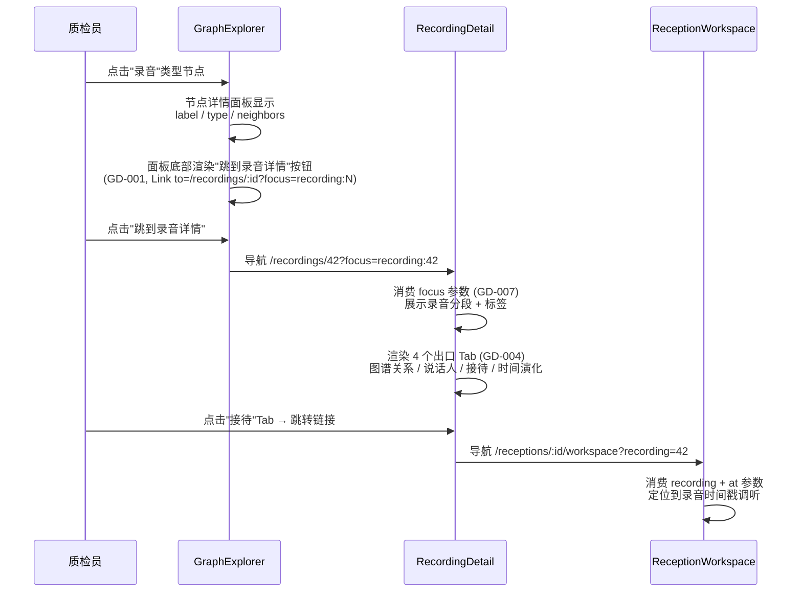
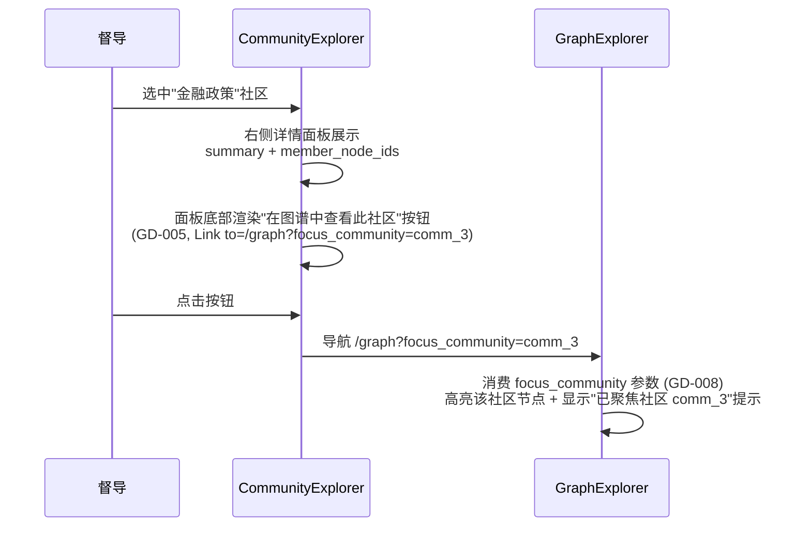

# 增量 PRD · 图谱→下钻闭环（Graph Drilldown Closed Loop）

> **定位**：纯前端增量需求。基于已完成只读断点分析的工程化产品化文档。
> **参照样本**：TagInsightGraph（唯一已实现完整三元组闭环的图谱页面）。
> **基线**：M1-M9 已交付，1892 测试 / 90.98% 覆盖率，工作目录 `frontend/src/pages/`。

| 字段 | 值 |
|------|-----|
| 版本 | v1.0-draft |
| 范围 | 纯前端 + URL 参数规范；零后端改动；零新页面 |
| 技术栈 | React + TypeScript + @arco-design/web-react + React Router |
| 关联页面 | GraphExplorer / TimeTravel / RecordingDetail / CommunityExplorer / SpeakerProfile |
| 参照实现 | TagInsightGraph.tsx（证据 Link 模式） / ReceptionWorkspace.tsx（URL 参数消费模式） |

---

## 1. 产品目标

AudioGraphy 的 5 个图谱页面中，只有 TagInsightGraph 真正实现了"节点上下文 → URL 参数编码 → 目标页面参数消费"的完整三元组闭环。其余图谱（GraphExplorer / CommunityExplorer / TimeTravel）和上下文页（RecordingDetail）都停在"本页展示"层面，节点点击不产生外跳，导致质检员在情报挖掘时频繁遇到死胡同，必须手动返回导航重新定位。

**本 PRD 的目标**：通过统一 URL 参数规范 + 为 5 个死胡同页面补齐"跳到 X"出口，让任意图谱节点都能一键下钻到相关的录音调听、说话人画像、接待工作台或���谱聚焦视图，形成完整的情报挖掘闭环。**量化指标**：死胡同页面从 5 个降到 0；全站图谱→下钻可用路径从 1 条（TagInsightGraph）扩展到 6+ 条。

---

## 2. 用户故事

- **US-1**：作为质检员，我希望在 GraphExplorer 点一个产品/客户节点后能直接跳到该实体的录音详情或说话人画像，以便不用手动回到列表页搜索。
- **US-2**：作为质检员，我希望在 TimeTravel 选录音时有一个 recording picker（而不是手填数字 ID），且看完 audit log 后能跳到源录音对应时间戳，以便快速回溯客户陈述。
- **US-3**：作为质检员，我希望 RecordingDetail 页面提供图谱/说话人/接待/时间演化 4 个出口，以便从一条录音快速发散到关联情报。
- **US-4**：作为督导，我希望在 CommunityExplorer 点一个社区后能跳到 GraphExplorer 并高亮该社区节点，以便查看社区内实体的完整关系。
- **US-5**：作为质检员，我希望在 SpeakerProfile Detail 看到该说话人时能"在图谱中查看"，以便了解其跨录音的实体关系。

---

## 3. 需求池

| 优先级 | 需求 ID | 描述 | 验收标准 | 关联页面 |
|--------|---------|------|----------|----------|
| P0 | GD-001 | GraphExplorer 节点详情面板加"跳到 X"按钮 | 点击节点后，详情面板底部出现按节点 type 动态生成的跳转按钮；产品/品牌/竞品→GraphExplorer 自聚焦；客户/坐席→SpeakerProfile；录音→RecordingDetail；接待→ReceptionWorkspace。按钮使用 `<Link>` 带正确 URL 参数（focus）。邻居节点列表保持本页跳转不变。 | GraphExplorerPage.tsx `EntityRelationshipPanel` |
| P0 | GD-002 | TimeTravel 加 recording picker | 录音选择从手填 InputNumber 改为复用 RecordingsPage 列表数据的 Select/AutoComplete 组件；选中后自动填入 recordingId。 | TimeTravel/index.tsx |
| P0 | GD-003 | TimeTravel 边点击跳到源录音时间戳 | Live edges 表格中每条边的 Action 列，在现有 "History" 链接旁新增 "跳到录音" 链接，点击导航到 `/recordings/:id?at=<edge.valid_at 对应秒数>` 或 ReceptionWorkspace。 | TimeTravel/index.tsx |
| P0 | GD-004 | RecordingDetail 加 4 个出口 Tab | 现有 Tabs（分段/标签）后新增 4 个 Tab：① 图谱关系（`<Link to="/graph?focus=recording:{id}">`）② 说话人（`<Link to="/speakers?focus=recording:{id}">`）③ 接待（`<Link to="/receptions?focus=recording:{id}">`）④ 时间演化（`<Link to="/time-travel?recording={id}">`）。每个 Tab 内为入口卡片 + 说明文字，点击即跳转。 | RecordingDetailPage.tsx |
| P0 | GD-005 | CommunityExplorer 社区点击跳到 GraphExplorer 高亮 | 选中社区后，详情面板（`ag-topic-cluster-detail`）底部新增"在图谱中查看此社区"按钮，导航到 `/graph?focus_community={community_id}`。 | CommunityExplorer/index.tsx |
| P0 | GD-006 | SpeakerProfile Detail 加"在图谱中查看" | 页面顶部或 header 区域新增"在图谱中查看此说话人"按钮，导航到 `/graph?focus=speaker:{id}`。 | SpeakerProfile/Detail.tsx |
| P0 | GD-007 | URL 参数规范化——全站统一 5 个参数 | 见 §4 参数规范表。所有跳转链接必须使用这套参数；消费页面读取参数后执行对应行为（聚焦/定位/高亮）。 | 全站 |
| P0 | GD-008 | GraphExplorer 消费 focus / focus_community 参数 | 页面初始化时读取 `searchParams.get("focus")` 和 `searchParams.get("focus_community")`；有值时自动选中/高亮对应节点或社区，视觉上显示"已聚焦到 X"提示。 | GraphExplorerPage.tsx |
| P1 | GD-009 | TimeTravel 消费 recording 参数支持深链 | 读取 `searchParams.get("recording")` 预填 recordingId，支持从 RecordingDetail 的"时间演化"Tab 深链进入。 | TimeTravel/index.tsx |
| P1 | GD-010 | RecordingDetail 消费 at 参数定位时间戳 | 读取 `searchParams.get("at")`，若有值则在分段表格中高亮对应时间段的行并滚动定位。 | RecordingDetailPage.tsx |
| P2 | GD-011 | StatsPage 加跳转出口（非死胡同化） | 在关键统计卡片上加"查看详情"链接到 RecordingsPage 带筛选参数。 | StatsPage.tsx |

---

## 4. URL 参数规范（核心 — 全站统一）

| 参数 | 类型 | 含义 | 消费页面 | 来源页面 |
|------|------|------|----------|----------|
| `focus` | string | 节点聚焦 ID，格式 `<type>:<id>`（如 `recording:42`、`speaker:7`、`product:里程碑`） | GraphExplorer | CommunityExplorer / SpeakerProfile / RecordingDetail / 接待图谱 |
| `at` | number(ms) | 时间戳定位（毫秒，与现有 ReceptionWorkspace 的 `at` 参数保持一致） | ReceptionWorkspace / RecordingDetail | TagInsightGraph（已有）/ TimeTravel / 任何带证据时间码的页面 |
| `from` | number(ms) | 时间窗起点 | ReceptionGraph / ReceptionWorkspace | ReceptionStateInsights（已有）/ TimeTravel |
| `to` | number(ms) | 时间窗终点 | 同上 | 同上 |
| `focus_community` | string | 社区 ID 高亮 | GraphExplorer | CommunityExplorer |

> **注意**：`at` 参数的单位和现有实现保持一致。ReceptionWorkspace 当前使用毫秒（`searchParams.get("at")` → `Number(rawMilliseconds)`），TagInsightGraph 的 Link 也用毫秒（`at=${startMs}`）。本规范统一使用毫秒。

---

## 5. 关键流程

### 5.1 核心闭环：GraphExplorer → RecordingDetail → 出口发散

### 5. CommunityExplorer → GraphExplorer 社区高亮

---

## 6. UI 设计要点

### 6.1 GraphExplorer 节点详情面板的"跳到 X"按钮

- **位置**：现有 `ag-entity-detail-panel` Card 内，邻居节点列表（`ag-entity-detail-neighbors`）下方，紧跟在 neighbors 区域之后。
- **样式**：参考 TagInsightGraph 证据条目的 `<Link>` 样式（蓝色文字链接 + 小图标），使用 Arco `Button type="text" size="mini"` 或直接 `<Link>` + CSS。
- **动态生成规则**（按 `entityDetail.node.type`）：

| 节点 type | 按钮文字 | 跳转目标 |
|-----------|---------|---------|
| 产品 / 品牌 / 竞品 | "在图谱中聚焦" | `/graph?focus={type}:{id}`（自聚焦，展开邻居） |
| 客户 / 坐席 | "查看说话人画像" | `/speakers?focus={type}:{id}` |
| 录音 | "查看录音详情" | `/recordings/{id}` |
| 门店 | "查看接待中心" | `/receptions?focus={type}:{id}` |

- **边界**：如果节点 type 无法映射到已知路由，不显示按钮（不报错）。

### 6.2 RecordingDetail 4 个出口 Tab

- **实现方式**：在现有 `<Tabs>` 内追加 4 个 `<TabPane>`。
- **Tab 命名 / 图标 / 顺序**：

| 顺序 | Tab 标题 | 图标 | 内容 |
|------|---------|------|------|
| 1 | 分段 | IconFileAudio | （现有，不变） |
| 2 | 标签 | IconTag | （现有，不变） |
| 3 | 图谱关系 | IconBranch | 入口卡片：`<Link to="/graph?focus=recording:{id}">` + 说明"查看此录音的实体关系图谱" |
| 4 | 说话人 | IconUser | 入口卡片：`<Link to="/speakers?focus=recording:{id}">` + 说明"查看参与此录音的说话人画像" |
| 5 | 接待 | IconMessage | 入口卡片：`<Link to="/receptions?focus=recording:{id}">` + 说明"跳转到此录音所属的接待工作台" |
| 6 | 时间演化 | IconClockCircle | 入口卡片：`<Link to="/time-travel?recording={id}">` + 说明"查看此录音的标签时间演化历史" |

- **Tab 3-6 为"跳转入口"型 Tab**：Tab 内不是完整数据展示，而是一张说明卡片 + 一个跳转按钮，点击后导航离开当前页。这样避免在 RecordingDetail 内重复实现图谱/说话人等页面的完整功能。

### 6.3 URL 参数消费的视觉反馈

- **GraphExplorer 消费 `focus` / `focus_community`**：页面加载后若有参数，在顶部 `ag-global-graph-heading__status` 区域显示"已聚焦到 {label}"提示条（Arco `Alert type="info"`），2 秒后自动消失或手动关闭；同时自动调用 `setSelectedEntity(focusId)` 选中节点。
- **RecordingDetail 消费 `at`**：分段表格中对应时间段的行高亮（`background: #e8f3ff`）并 `scrollIntoView`。
- **TimeTravel 消费 `recording`**：picker 自动选中对应录音。

---

## 7. 不做（明确排除）

- ❌ **不做新页面**：只改现有 5 个页面（GraphExplorer / TimeTravel / RecordingDetail / CommunityExplorer / SpeakerProfile）。
- ❌ **不做后端 API 改动**：纯前端 + URL 参数；所有数据来自已有 API。
- ❌ **不做权限模型调整**：现有角色权限不变。
- ❌ **不做 i18n**：所有新增文案使用中文（与现有页面一致）。
- ❌ **不做图谱渲染引擎替换**：GraphExplorer 继续用 AntV G6 v5，不换 G6 版本。
- ❌ **不做 RecordingDetail 出口 Tab 的内嵌完整功能**：Tab 3-6 是跳转入口，不是内嵌图谱/说话人页面（避免页面复杂度爆炸）。

---

## 8. 待确认问题

### Q1：RecordingDetail 出口 Tab（3-6）用 Arco Tabs 还是 Drawer？

**背景**：Tab 3-6 目前设计为"入口卡片 + 跳转按钮"。但也可以用 Arco Drawer（点击 Tab 弹出抽屉展示更多预览信息后再跳转）。

**PM 建议**：用 **Tabs**。理由：(1) 与现有分段/标签 Tab 保持一致的交互模式；(2) 入口卡片足够简单，不需要 Drawer 的额外层级；(3) Drawer 会增加组件复杂度和测试成本，收益低。

### Q2：节点 type 路由表是否需要支持自定义扩展？

**背景**：GD-001 的节点 type → 路由映射目前硬编码在组件内。是否需要做成可配置（如 config 文件或 props）以支持未来新增节点 type？

**PM 建议**：P0 硬编码即可。当前节点 type 固定 8 种（产品/品牌/客户/竞品/坐席/门店/问题/未知），短期不会扩展。若未来需要，可提取为独立 `nodeRouteConfig.ts` 配置文件，但这属于 P2 优化，不在本次范围。

### Q3：GraphExplorer 的 focus 参数如何与现有筛选参数共存？

**背景**：GraphExplorer 当前已有 `nodeType` / `minDegree` / `limit` 等状态筛选，URL 上也有 `view` 参数（entities/clusters 切换）。新增 `focus` / `focus_community` 是否需要与这些参数互斥？

**PM 建议**：`focus` 与筛选参数**共存不互斥**。逻辑：先应用筛选（nodeType/minDegree）加载图数据 → 图渲染完成后读取 `focus` 参数 → 在已渲染的节点中查找并高亮匹配节点。若 focus 指向的节点不在当前筛选结果中，显示提示"该节点不在当前筛选范围内，请调整筛选"但不自动改筛选条件。`focus_community` 仅在 `view=clusters`（CommunityExplorer）模式下有效。

### Q4：TimeTravel 边跳转的目标是 RecordingDetail 还是 ReceptionWorkspace？

**背景**：GD-003 中 TimeTravel 边点击"跳到录音"，目标可以是 `/recordings/:id`（纯展示）或 `/receptions/:id/workspace`（带调听播放器）。TagInsightGraph 的参照实现是跳到 workspace（因为有 `at` 时间戳可定位调听）。

**PM 建议**：如果边数据包含 `recording_id`，优先跳到 **ReceptionWorkspace**（`/receptions/:receptionId/workspace?recording={recordingId}&at={timestamp}`），与 TagInsightGraph 一致，因为 workspace 有调听播放器能播放时间戳。若边数据不包含 reception 关联（仅有 recording_id），则降级跳到 RecordingDetail 带 `at` 参数高亮分段。需要确认 `EdgeOut` 类型是否携带 reception_id 字段——若无，则统一跳 RecordingDetail。
