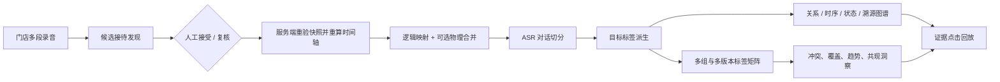

# 接待对话智能工作台

AudioGraphy 的接待域把“录音文件”提升为可回放、可切分、可追溯、可比较的业务接待。适用于金店销售、汽车销售等一次客户接待由多段短录音组成的场景，也支持对超长录音进行签名快照复核和原子切分。

## 状态说明

本文同时描述已上线兼容路径和下一代一致性契约。为避免把设计目标误写成生产保证，统一使用：

- **现状**：当前代码存在的路径，不代表迁移、Worker 和全量故障注入已经完成。
- **目标**：新 generation/revision/artifact 状态机完成后的稳定契约。
- **已验证**：有自动化测试在当前工作区通过。
- **发布缺口**：尚缺全量门禁或生产证据，不能据此打开租户 feature flag。

详细真值矩阵、状态转移、崩溃窗口和需求—测试追踪见
[audio-segmentation-merge-state-space.md](./audio-segmentation-merge-state-space.md)。

## 目标与验收

| 目标 | 目标生产行为 | 现状 / 已验证 |
|---|---|---|
| 自动组接待 | 按租户、门店、销售、时间与客户线索发现候选；服务端重算时间线后才接受 | 候选解释、跨租户/跨门店拒绝、force-split 优先级和“缺媒体时长即 review”已有测试；历史媒体事实可恢复回填仍是缺口 |
| 长录音拆接待 | 对可信边界签发短时令牌；执行时重验媒体与全量分段快照，并覆盖完整源时长 | 源文件不改写、签名快照、事务切分和尾部静音覆盖已验证；历史录音的媒体 hash/时长 backfill 与全库重叠审计仍是缺口 |
| 多录音合并 | 保留每段源录音，建立接待时间轴；可选生成不可变物理 artifact | 精确裁剪、静音 gap、部分源裁剪播放、plan/operation、Artifact 原子发布和安全 reconciler 已验证；lifespan 周期 dispatcher 可捞起提交后未 dispatch 的 `QUEUED` 行并回收失租/孤儿；真实 ffmpeg/ffprobe 的 WAV/MP3/AAC 中间裁剪 + 375 ms gap 均精确输出 16 kHz mono PCM 的 42,000 样本；`0030` 已迁移对应 schema；独立 Worker 部署和全格式 × 加密 × 故障矩阵仍缺 |
| 对话切分 | 从活动 generation 的真实 Segment 生成语义/业务单元；允许人工拆分与跨窗相邻合并 | generation/revision CAS、真实 embedding provenance、显式 rules-only、独立 stage confidence 和跨窗交互已覆盖；v2 在 4 cases/19 segments 小型金标上通过 F1 门禁，领域样本仍需扩大 |
| 图谱与溯源 | 展示关系、时间版本、业务状态、证据来源四种图 | 现有持久化事件和图视图可用；录音生产 pipeline 已对 GraphML 开启 strict persistence，save 失败不会确认 graph outbox 或发布 indexed；全部流式/历史投影绑定同一活动 revision/generation 仍待 outbox 对账 |
| 目标标签 | 派生阶段、意向、异议、下一步、合规风险标签 | 规则/治理版本、证据和洞察已有覆盖；时间线变更会失效旧 canonical，DSAR 数据库删除与 erasure outbox 同事务已有故障测试；所有外部投影清零对账仍缺 |
| 多组对比 | 对多个标签组和版本做矩阵、冲突、覆盖、趋势与共现分析 | 当前版本、历史版本、预算和证据回跳已有实现 |
| 自动处理 | 接受后依次执行合并、对话切分、目标标签派生 | 接待自动化有检查点和租约；录音 pipeline 已按 generation staging、显式合法跃迁、数据库 claim、最新代 CAS 和投影清单发布，双 Worker/非法跳转/失败不假 indexed 有专项测试；Scheduler 可 CAS 回收七个处理中阶段的过期 run，保持同一 run/generation，状态/投影/失败写入以 `lease_owner + attempt_count` 拒绝旧 Worker；`0031` 将纯静音独立为 `ready_no_speech` 并修复旧假 indexed 行；历史 bootstrap 与真实 MySQL 全故障矩阵仍缺 |
| Speaker 审核 | 模糊匹配审核前不改变 canonical node/vector/link | 加密候选 staging、带锁确认事务和无副作用拒绝已实现并测试，`0030` 已迁移；当前持久化直接进入 `PENDING_REVIEW`，独立 `OBSERVED` checkpoint 尚未运行 |
| Streaming | 一次性票据、durable PCM/Segment/Chunk/outbox、可恢复 ACK/epoch | `0030` schema、一次性 ticket、默认关闭长期 JWT query、重连/去重/倒序和 durable 事件已有测试；outbox 消费到 Tag/Graph 与真实 MySQL 长时链仍缺 |
| 性能与隐私 | 大规模检索可量化；音频、ASR 文本和删除链路默认安全 | 既有 PII、加密和响应预算路径可用；Artifact/删除 outbox/reconciler 已有故障测试；生产零残留扫描、全量性能与灰度指标仍缺 |

## 主链路



核心不变量：

1. 源录音不可被自动切坏。长录音只创建带 `source_start_sec/source_end_sec` 的两个逻辑映射，不改写原文件。
2. 接受候选时不信任客户端时间线。**现状**已要求只使用媒体探测/解码得到的真实时长并通过统一 `AudioTimelinePlanner` 计算映射；缺少源时长时进入 `duration_review`，不再用最后一个 Segment 推断。历史数据仍需媒体 backfill。
3. 证据同时保留源录音坐标和接待时间轴坐标。人工切分会按重叠区间裁剪两套坐标。
4. 合并单元遇到同键不同值标签时，只合并胜出值的证据；冲突值保存在溯源快照中，禁止语义串线。
5. 人工切分或合并后，业务状态转移按最终对话顺序完整重建，不允许悬空或重复状态边。
6. 接待时间线或人工对话几何改变时，同事务失效/重建数据库内的 Dialogue、Tag Current 和状态转移，并创建重算意图；GraphML、FileIndex、Vector、Cache 的统一消费者完成确认和 drift 对账仍是**发布缺口**。
7. 物理音频在外部构建前先持久化 `PREPARING`，验证后进入 `READY`；活动 revision、Artifact `ATTACHED`、旧 Artifact `RETIRED` 和 operation `SUCCEEDED` 在一笔事务提交。reconciler 只允许在租户/接待 generation 目录内修复或回收，活动 DB 指针永不因文件扫描被删除。
8. 录音普通 indexed 当且仅当活动 run 为 `READY` 且必需投影全部确认；纯静音是独立 `READY_NO_SPEECH`，ASR/Embedding 失败或缺失只能进入 `PARTIAL/FAILED_*`。

## 自动接待类型

`POST /api/v1/receptions/proposals/discover` 返回三类候选：

- `merge_group`：同门店、销售及相邻时间窗内的多段短录音，可在确认后创建接待。
- `recording_split`：长录音存在可信分界点，返回绑定租户、场景、门店、录音更新时间、全量 Segment 指纹、verified duration 与边界的 15 分钟 HMAC 令牌。
- `duration_review`：缺少可信时长，必须先完成索引或人工确认。

`POST /api/v1/receptions/proposals/accept` 接受安全的合并候选，或携带签名令牌执行 `recording_split`。现有 v2 令牌显式绑定租户、场景、门店、录音更新时间、verified duration、媒体 hash/size/source revision、全量 Segment 快照与边界；提交时会锁定源录音、重跑边界检测并逐项复验。旧数据缺媒体事实时拒绝，不能回退到 Segment 尾点。**发布缺口**：历史媒体事实仍需通过可恢复管理任务回填并完成 shadow audit。

接受后可一键运行或恢复自动处理：

```text
POST /api/v1/receptions/{reception_id}/automation/run
GET  /api/v1/receptions/{reception_id}/automation
```

接待自动化的现有状态机为 `merge → segmentation → tagging → ready`，运行记录包含尝试次数、检查点、租约、失败阶段和错误，工作台可从失败检查点重试。录音级索引则由
`QUEUED → CLAIMED → VAD → ASR → SEGMENTS → CHUNKS → PROJECTIONS → VERIFYING → READY`
generation 状态机接管，并以 required/completed 投影清单和最新 generation CAS 发布；两者不得共用一个“indexed”结论。纯静音使用 `READY_NO_SPEECH`，AI 阶段缺失为 `PARTIAL/FAILED_*`。

录音 pipeline 的合法边由单一状态模型校验，未声明跳转会被拒绝。Worker 若在
`CLAIMED/VAD/ASR/SEGMENTS/CHUNKS/PROJECTIONS/VERIFYING` 任一阶段失租，Scheduler 只会以阶段状态和过期时间做 CAS，将原 `run_id`、原 generation 重新 claim 到受控入口并增加 attempt；它不会因阶段不再是 `QUEUED` 而永久搁置，也不会另建一个 generation。后续状态、投影确认、激活和失败写入都必须匹配新的 `lease_owner + attempt_count` fence，因此晚返回的旧 Worker 不能把新 claim 改成失败或 READY。七个阶段及旧 Worker 重分配均有服务测试。

## 对话与证据模型

一次接待包含：

- `ReceptionRecording`：源录音到接待时间轴的映射；
- `DialogueUnit`：主题、业务阶段、摘要、边界理由、说话人和 Segment 证据；
- `DialogueStateTransition`：按单元顺序形成的业务阶段状态链；
- `DialogueTagAssignment`：标签组、版本、标签键值、置信度和证据；
- `ProvenanceEvent`：对象版本、父项、证据、操作者与算法版本。

证据坐标约定：

- `source_start_sec/source_end_sec`：源录音时间；
- `timeline_start_sec/timeline_end_sec`：合并后的接待时间；
- `coordinate_space=both`：两套坐标已经过几何一致性校验。

自动切分的新请求默认使用 `dialogue-hybrid-v2`。服务端先读取每个录音的活动 `READY/READY_NO_SPEECH` generation，再批量获取语义 embedding；不可用时显式记录 `rules-only`，不会把规则结果伪装成语义结果。每次运行保存算法版本、配置 hash、实际启用信号、能力模式和输入 generation，embedding 返回后会重新加锁校验 generation/revision，避免旧输入晚完成后覆盖新活动代。

本工作区的小型冻结金标 `backend/tests/fixtures/dialogue_segmentation_gold.json` 包含金店和汽车 4 个 case、19 个 Segment；当前 boundary F1 与 stage macro-F1 均为 1.0，并通过全局 `0.85/0.80` 和逐场景不低于 v1 的门禁。这只能证明该冻结夹具，不代表更大规模真实分布已经完成标注或线上灰度。

## 标签生产与洞察

派生接口：

```text
POST /api/v1/receptions/{reception_id}/dialogue-tags/derive
```

默认目标标签：

- `stage`：销售阶段；
- `intent`：购买/试戴/试驾等意向；
- `objection`：价格、竞品、信任、时间等异议；
- `next_step`：预约、报价、跟进等下一步；
- `compliance_risk`：私下收款、敏感信息索取等合规风险。

数据库洞察接口：

```text
GET /api/v1/reception-tag-insights
```

可按门店、销售、场景、接待时间、接待 ID、标签组筛选。默认比较各组当前版本；传入重复参数 `group_id=key@version` 可精确读取最多 8 个历史或当前版本，且不能与宽泛 `group_key` 混用。返回：

- 标签组/版本矩阵与合并结果；
- 值分布、覆盖率和缺失标签；
- 冲突单元与证据摘要；
- 日/周趋势；
- 标签共现和目标对话洞察；
- 结果截断状态与分页元数据。

洞察输出设置矩阵、差异项、证据引用、证据文本字节和证据摘要的独立硬预算。两两差异只返回有界摘要，完整证据通过有界摘要/钻取链路读取，避免 8 组、5000 个赋值的合法请求放大为数百 MB。

通用快照分析 `POST /api/v1/tag-insights/analyze` 仍保留，适合离线实验或外部标签导入；生产工作台优先读取数据库洞察。

## 工作台

前端采用 Arco Design 的信息密度与操作层级，调听页包含：

- 接待元数据、版本、合并状态及来源录音；
- 合并音轨 Range 回放，以及部分源经服务端裁剪后的授权播放；
- 默认 10 分钟、最大 60 分钟的前后时间窗口，超长接待不会一次加载完整转写；
- 多轨时间线：源录音、说话人、对话单元、标签与播放头；
- ASR 文本、人工切分/合并、自动重新切分；
- 标签证据和状态转移审计；
- 关系、时序、状态、溯源四种图谱；
- 点击证据跳到正确的接待或源录音时间。

新工作台还实现了以下 capability-gated 交互：明确区分 mapping ID 与 recording ID；来源鼠标拖动、键盘上下移、gap 编辑和服务端 plan 预览；异步 operation 轮询/取消以及页面重载后从 Workspace 的 `active_audio_operation` 恢复轮询；409 保留草稿后刷新；跨窗口相邻单元选择；源播放边界硬停止、真实 gap 静音推进和自动换源/换窗；一次性 WS ticket 的 16 kHz 单声道 PCM 采集，以及 256 帧有界 pending、ACK 水位清理和同 session 断线重放。后端未声明对应 capability 时，前端不会展示未完成的新契约，并继续使用旧 `/merge`。

浏览器旅程 `frontend/e2e/audio-timeline-operation.spec.ts` 已在 Worker 生成的合法 PCM WAV 上走通候选接受、源区间播放、服务端 plan、异步 physical 发布、物理音轨样本时长、人工切分/合并和审计回跳。真实后端媒体门禁
`backend/tests/integration/test_real_audio_media_matrix.py` 另以 ffmpeg/ffprobe 验证 WAV、MP3、AAC：两段中间裁剪插入 375 ms gap 后，三种输入都输出 16 kHz、单声道、16-bit PCM 的 42,000 样本（2.625 s）。加密源/产物无明文落盘另有接待测试；这些证据仍不替代所有格式 × 加密 × 混合参数 × 磁盘/进程故障的笛卡尔矩阵。

接待入口不是静态演示页：它直接读取工作队列，执行候选扫描、解释、短录音接受或长录音原子切分，并自动处理新建接待后跳转到调听工作台。

工作台的对话单元、当前标签、状态转移、转写和溯源事件分别设置数据库侧硬上限，
响应返回 `total/returned/limit/truncated` 及前后窗口位置；危险写操作依据整场
`total_dialogue_units/protected_dialogue_units` 判断，而不是误用当前窗口数据。
独立状态转移和溯源查询同样先完成稳定销售身份授权，再按最大 200 条分页读取。

## 销售身份与历史歧义

接待授权使用不可变的 `receptions.agent_user_id`，`agent_name` 只保留为展示快照。新接待只在
同租户、同姓名且角色为 `agent` 的用户恰好有一个时绑定稳定 ID；零匹配或重名都保持
`agent_user_id IS NULL`，因此只对管理员和质检可见，不会因姓名复用而泄露给销售。

迁移会记录未能唯一回填的数量和前 100 条明细。运维也可随时执行以下维护查询：

```sql
SELECT r.id AS reception_id,
       r.tenant_id,
       r.agent_name,
       COUNT(u.id) AS matching_agent_users
FROM receptions AS r
LEFT JOIN users AS u
  ON u.tenant_id = r.tenant_id
 AND u.name = r.agent_name
 AND u.role = 'agent'
WHERE r.agent_name IS NOT NULL
  AND r.agent_user_id IS NULL
GROUP BY r.id, r.tenant_id, r.agent_name
HAVING COUNT(u.id) <> 1
ORDER BY r.tenant_id, r.id;
```

## 模型与部署

默认 `mock` profile 可以在无 GPU 环境验证功能链路与状态契约，但不能替代真实模型质量、真实 MySQL 并发、ffmpeg 媒体矩阵或生产投影对账。真实模型可通过 Docker profile 组合：

- `models-cpu`：FunASR、BGE-M3、CAM++ 等 CPU 服务；
- `models-single-gpu`：单 GPU vLLM、BGE-M3/CLAP；
- `models-multi-gpu`：强弱模型分卡部署；
- `docker-compose.streaming-vad.yml`：本地 Streaming Silero VAD 叠加层。

所有宿主机发布端口默认绑定 `127.0.0.1`。应用端口与 MySQL、Adminer、模型端口使用不同绑定变量，避免开放反向代理时连带暴露私有服务。详见 [deployment.md](./deployment.md)。

## 质量门禁

目标后端 CI 门禁包括：

- Ruff 格式与静态检查；
- mypy；
- 单元/集成测试和覆盖率；
- Alembic 真实 MySQL 升降级、可恢复回填与约束验证；
- ffmpeg WAV/MP3/AAC/加密和故障注入矩阵；
- 10 万条、128 维向量热查询 P95 门禁；
- Docker profile 配置解析。

目标前端 CI 门禁包括：

- ESLint；
- Vitest/RTL 单元、契约和交互测试，且无 unhandled error；
- TypeScript 与 Vite 构建；
- Playwright 真实音频全旅程；
- 初始包体 gzip 预算。

本轮已经形成的专项证据包括：

- 真实 MySQL `0029/0030/0031` 升降级、结构/毫秒坐标/Streaming/Speaker/无语音状态回填和不安全迁移阻断；
- pipeline 合法/非法跃迁、双 Worker claim、七阶段过期租约 CAS 回收、失租旧 Worker fence、最新 generation、AI 失败不假 indexed；
- FileIndex checkpoint flush 与 strict GraphML save 故障均不会产生假 projection ack 或假 indexed；
- 真实 ffmpeg/ffprobe 的 WAV/MP3/AAC 中间裁剪、375 ms gap 与 42,000 样本网格门禁；
- Artifact 各关键故障窗口、lease、取消和 reconciler 安全边界；
- Streaming ticket/ACK/epoch/durable Segment–Chunk–outbox；
- Speaker 审核前 canonical 不变以及确认/拒绝；
- DSAR commit failure、外部失败重试和 erasure outbox 周期 drain；
- 前端 RTL/契约、合法 WAV Worker 和 Playwright 音频全旅程；
- `dialogue-hybrid-v2` 冻结小型金标门禁。
- 后端无覆盖率全量回归 `2994 passed, 5 skipped`；默认全量覆盖率回归 `2995 passed, 4 skipped`，分支感知总覆盖率 `85.81%`，达到 `85%` 门槛；
- Ruff、mypy（`219` 个源文件）、前端 ESLint、`304` 个 Vitest、TypeScript/Vite build 及 Chromium Playwright `5/5` 均通过；Vitest 没有 unhandled error；
- 真实 MySQL `0029/0030/0031` 相关升降级与回填门禁 `9 passed`。

仍未形成发布证据的项目是：历史媒体/bootstrap 可恢复回填与 shadow compare、所有格式 × 加密 × 混合参数 × 磁盘/进程故障的笛卡尔媒体矩阵、所有外部投影消费及 drift 清零、分租户生产灰度指标观察窗。任何专项测试的通过都不能覆盖这些缺口。

局部测试通过只能证明对应单元，不能替代
[状态空间文档的发布门禁](./audio-segmentation-merge-state-space.md#11-发布门禁)。
