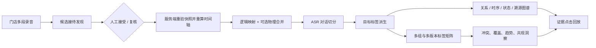

# 接待对话智能工作台

AudioGraphy 的接待域把“录音文件”提升为可回放、可切分、可追溯、可比较的业务接待。适用于金店销售、汽车销售等一次客户接待由多段短录音组成的场景，也支持对超长录音进行签名快照复核和原子切分。

## 目标与验收

| 目标 | 生产行为 | 当前验收 |
|---|---|---|
| 自动组接待 | 按租户、门店、销售、时间与客户线索发现候选；服务端重算时间线后才接受 | 候选可解释，跨门店和未知时长不能自动接受 |
| 长录音拆接待 | 对可信边界签发短时令牌；执行时重验全部分段快照 | 源录音不变，前后两个接待及溯源事件同事务提交 |
| 多录音合并 | 保留每段源录音，建立接待时间轴；可选生成物理合并音频 | 逻辑映射、物理 WAV、Range 回放及加密均可用 |
| 对话切分 | 从真实 ASR Segment 生成语义/业务对话单元；允许人工拆分与相邻合并 | 乐观锁、锁定保护、证据裁剪、状态链重建 |
| 图谱与溯源 | 展示关系、时间版本、业务状态、证据来源四种图 | 每次创建、派生、切分、合并和失效均写持久化事件 |
| 目标标签 | 派生阶段、意向、异议、下一步、合规风险标签 | 金店/汽车规则基线、版本幂等、缺失原因、双坐标证据 |
| 多组对比 | 对多个标签组和版本做矩阵、冲突、覆盖、趋势与共现分析 | 支持当前版本和精确历史版本、四种合并策略及证据回跳 |
| 自动处理 | 接受后依次执行合并、对话切分、目标标签派生 | 持久化检查点、短租约、幂等重入、失败原因和阶段重试 |
| 性能与隐私 | 大规模检索可量化；音频、ASR 文本和删除链路默认安全 | 10 万向量门禁、PII 先清洗、分块认证加密、工作台/洞察响应预算、DSAR 擦除 |

## 主链路



核心不变量：

1. 源录音不可被自动切坏。长录音只创建带 `source_start_sec/source_end_sec` 的两个逻辑映射，不改写原文件。
2. 接受候选时不信任客户端时间线。后端读取真实 Segment 时长并重新排序、计算映射。
3. 证据同时保留源录音坐标和接待时间轴坐标。人工切分会按重叠区间裁剪两套坐标。
4. 合并单元遇到同键不同值标签时，只合并胜出值的证据；冲突值保存在溯源快照中，禁止语义串线。
5. 人工切分或合并后，业务状态转移按最终对话顺序完整重建，不允许悬空或重复状态边。
6. 接待时间线改变时，旧对话单元、标签和状态转移显式失效并留下快照，不能静默复用。
7. 自动处理每完成一个阶段就写入持久化检查点；进程中断后从最后完成阶段继续，不重复发布物理音频或覆盖标签版本。

## 自动接待类型

`POST /api/v1/receptions/proposals/discover` 返回三类候选：

- `merge_group`：同门店、销售及相邻时间窗内的多段短录音，可在确认后创建接待。
- `recording_split`：长录音存在可信分界点，返回绑定租户、场景、门店、录音版本、全量 Segment 指纹、时长与边界的 15 分钟 HMAC 令牌。
- `duration_review`：缺少可信时长，必须先完成索引或人工确认。

`POST /api/v1/receptions/proposals/accept` 接受安全的合并候选，或携带签名令牌执行 `recording_split`。执行长录音切分时，后端在事务内锁定源录音、重跑边界检测并校验快照未过期；任一步失败都会整单回滚。

接受后可一键运行或恢复自动处理：

```text
POST /api/v1/receptions/{reception_id}/automation/run
GET  /api/v1/receptions/{reception_id}/automation
```

状态机为 `merge → segmentation → tagging → ready`。每个接待仅有一个不可变配置的运行记录，包含尝试次数、检查点、租约、失败阶段和错误；工作台可从失败检查点重试。

## 对话与证据模型

一次接待包含：

- `ReceptionRecording`：源录音到接待时间轴的映射；
- `DialogueUnit`：主题、业务阶段、摘要、边界理由、说话人和 Segment 证据；
- `DialogueStateTransition`：按单元顺序形成的业务阶段状态链；
- `DialogueTagAssignment`：标签组、版本、标签键值、置信度和证据；
- `ProvenanceEvent`：对象版本、父项、证据、操作者与算法版本。

证据坐标约定：

- `source_start_sec/source_end_sec`：源录音时间；
- `timeline_start_sec/timeline_end_sec`：合并后的接待时间；
- `coordinate_space=both`：两套坐标已经过几何一致性校验。

## 标签生产与洞察

派生接口：

```text
POST /api/v1/receptions/{reception_id}/dialogue-tags/derive
```

默认目标标签：

- `stage`：销售阶段；
- `intent`：购买/试戴/试驾等意向；
- `objection`：价格、竞品、信任、时间等异议；
- `next_step`：预约、报价、跟进等下一步；
- `compliance_risk`：私下收款、敏感信息索取等合规风险。

数据库洞察接口：

```text
GET /api/v1/reception-tag-insights
```

可按门店、销售、场景、接待时间、接待 ID、标签组筛选。默认比较各组当前版本；传入重复参数 `group_id=key@version` 可精确读取最多 8 个历史或当前版本，且不能与宽泛 `group_key` 混用。返回：

- 标签组/版本矩阵与合并结果；
- 值分布、覆盖率和缺失标签；
- 冲突单元与证据摘要；
- 日/周趋势；
- 标签共现和目标对话洞察；
- 结果截断状态与分页元数据。

洞察输出设置矩阵、差异项、证据引用、证据文本字节和证据摘要的独立硬预算。两两差异只返回有界摘要，完整证据通过有界摘要/钻取链路读取，避免 8 组、5000 个赋值的合法请求放大为数百 MB。

通用快照分析 `POST /api/v1/tag-insights/analyze` 仍保留，适合离线实验或外部标签导入；生产工作台优先读取数据库洞察。

## 工作台

前端采用 Arco Design 的信息密度与操作层级，调听页包含：

- 接待元数据、版本、合并状态及来源录音；
- 原生音频 Range 回放与过期凭证自动刷新；
- 默认 10 分钟、最大 60 分钟的前后时间窗口，超长接待不会一次加载完整转写；
- 多轨时间线：源录音、说话人、对话单元、标签与播放头；
- ASR 文本、人工切分/合并、自动重新切分；
- 标签证据和状态转移审计；
- 关系、时序、状态、溯源四种图谱；
- 点击证据跳到正确的接待或源录音时间。

接待入口不是静态演示页：它直接读取工作队列，执行候选扫描、解释、短录音接受或长录音原子切分，并自动处理新建接待后跳转到调听工作台。

工作台的对话单元、当前标签、状态转移、转写和溯源事件分别设置数据库侧硬上限，
响应返回 `total/returned/limit/truncated` 及前后窗口位置；危险写操作依据整场
`total_dialogue_units/protected_dialogue_units` 判断，而不是误用当前窗口数据。
独立状态转移和溯源查询同样先完成稳定销售身份授权，再按最大 200 条分页读取。

## 销售身份与历史歧义

接待授权使用不可变的 `receptions.agent_user_id`，`agent_name` 只保留为展示快照。新接待只在
同租户、同姓名且角色为 `agent` 的用户恰好有一个时绑定稳定 ID；零匹配或重名都保持
`agent_user_id IS NULL`，因此只对管理员和质检可见，不会因姓名复用而泄露给销售。

迁移会记录未能唯一回填的数量和前 100 条明细。运维也可随时执行以下维护查询：

```sql
SELECT r.id AS reception_id,
       r.tenant_id,
       r.agent_name,
       COUNT(u.id) AS matching_agent_users
FROM receptions AS r
LEFT JOIN users AS u
  ON u.tenant_id = r.tenant_id
 AND u.name = r.agent_name
 AND u.role = 'agent'
WHERE r.agent_name IS NOT NULL
  AND r.agent_user_id IS NULL
GROUP BY r.id, r.tenant_id, r.agent_name
HAVING COUNT(u.id) <> 1
ORDER BY r.tenant_id, r.id;
```

## 模型与部署

默认 `mock` profile 可以在无 GPU 环境验证完整业务链路。真实模型可通过 Docker profile 组合：

- `models-cpu`：FunASR、BGE-M3、CAM++ 等 CPU 服务；
- `models-single-gpu`：单 GPU vLLM、BGE-M3/CLAP；
- `models-multi-gpu`：强弱模型分卡部署；
- `docker-compose.streaming-vad.yml`：本地 Streaming Silero VAD 叠加层。

所有宿主机发布端口默认绑定 `127.0.0.1`。应用端口与 MySQL、Adminer、模型端口使用不同绑定变量，避免开放反向代理时连带暴露私有服务。详见 [deployment.md](./deployment.md)。

## 质量门禁

后端 CI 包含：

- Ruff 格式与静态检查；
- mypy；
- 单元/集成测试和覆盖率；
- 10 万条、128 维向量热查询 P95 门禁；
- Docker profile 配置解析。

前端 CI 包含：

- ESLint；
- RTL 单元/交互测试；
- TypeScript 与 Vite 构建；
- 初始包体 gzip 预算。
